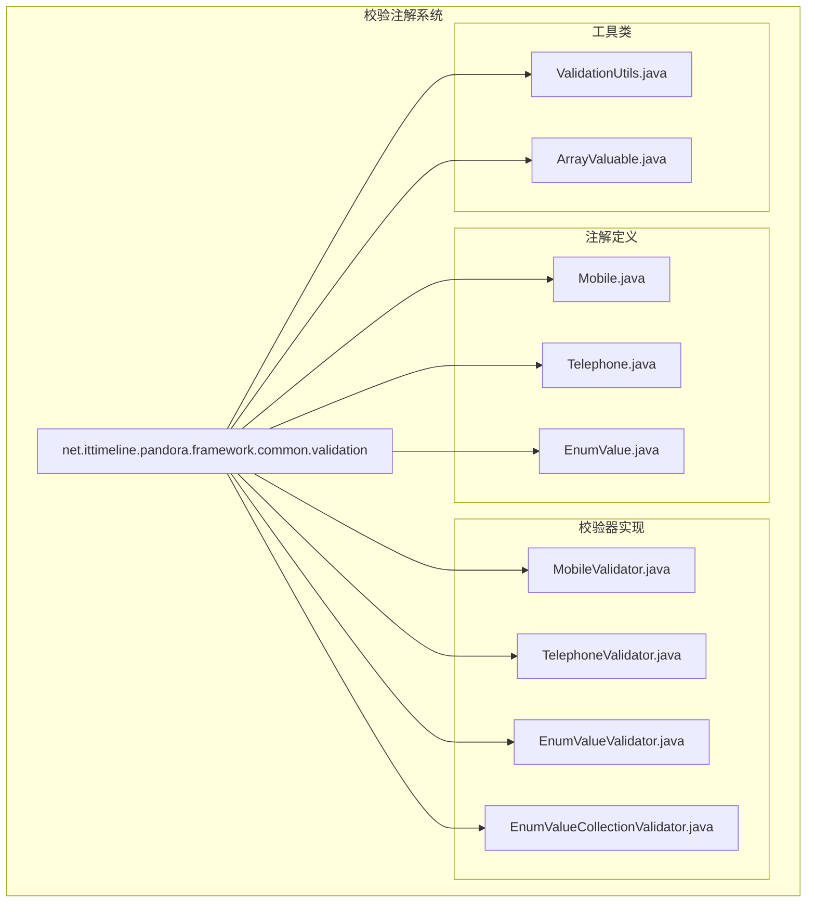
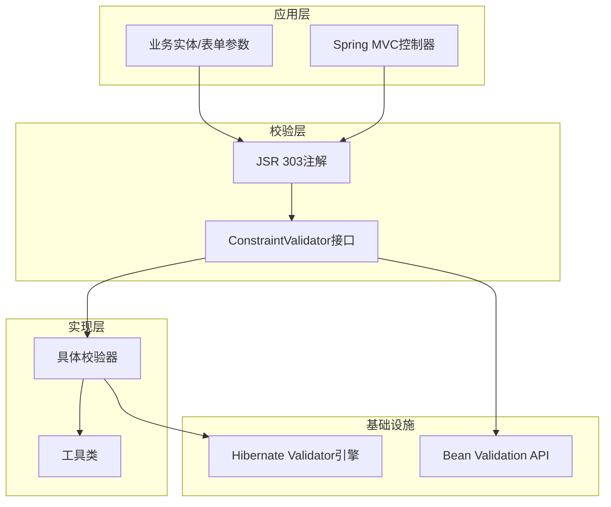
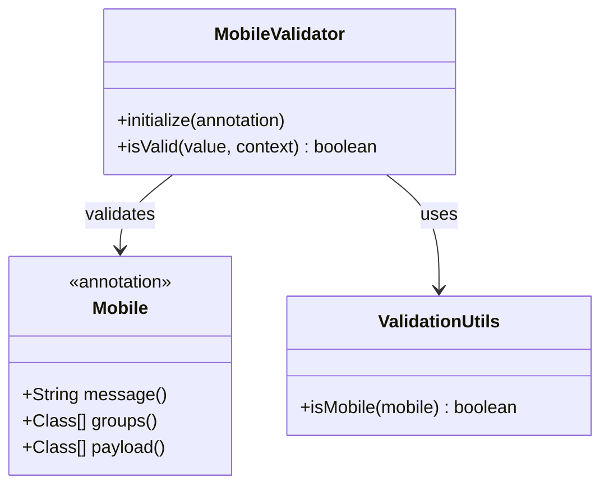
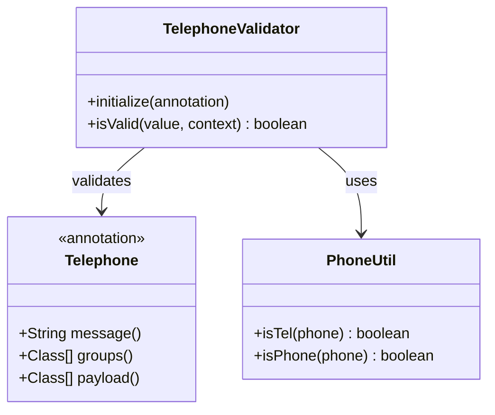
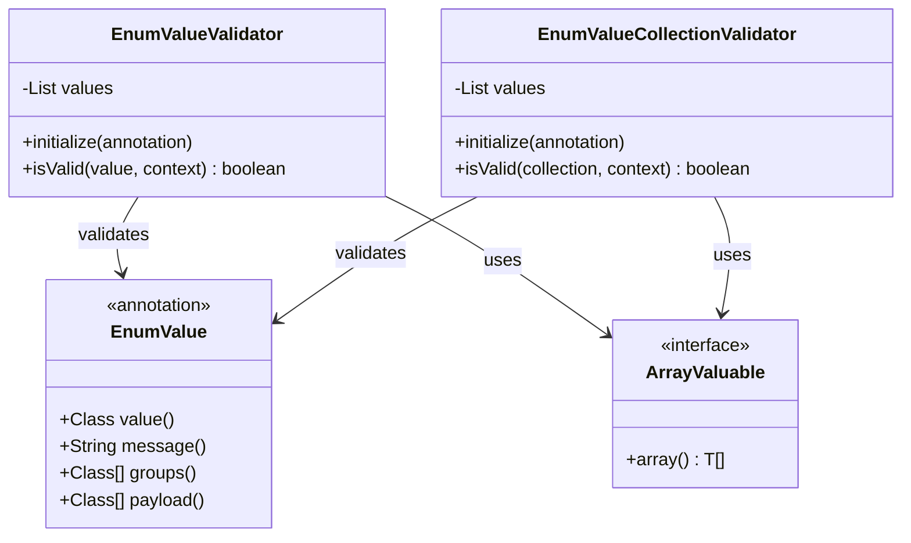
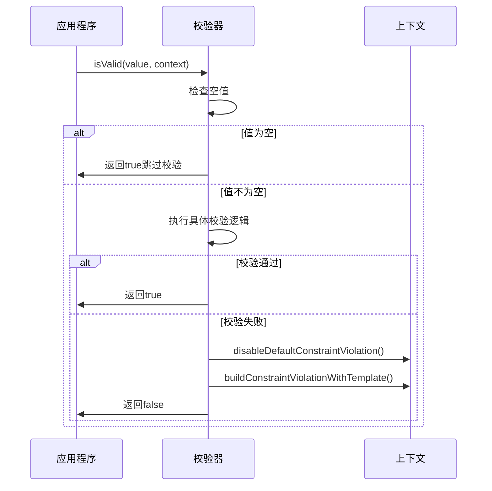
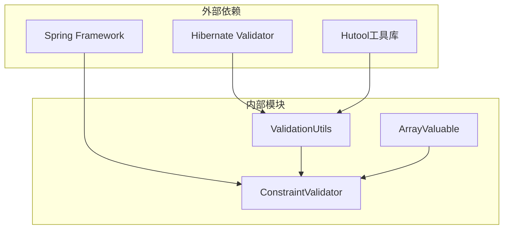
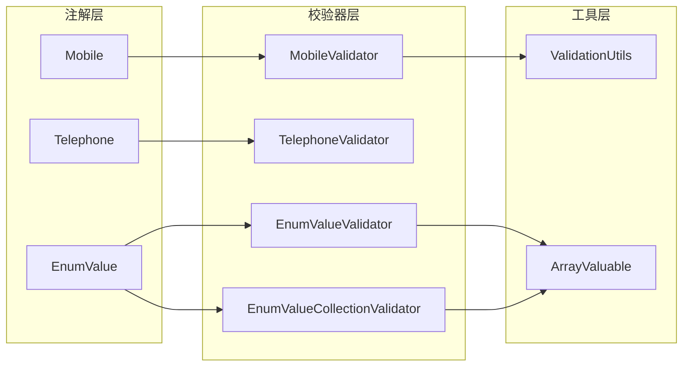

# 校验注解系统

<cite>
**本文档引用的文件**
- [Mobile.java](file://pandora-framework/pandora-common/src/main/java/net/ittimeline/pandora/framework/common/validation/Mobile.java)
- [MobileValidator.java](file://pandora-framework/pandora-common/src/main/java/net/ittimeline/pandora/framework/common/validation/MobileValidator.java)
- [Telephone.java](file://pandora-framework/pandora-common/src/main/java/net/ittimeline/pandora/framework/common/validation/Telephone.java)
- [TelephoneValidator.java](file://pandora-framework/pandora-common/src/main/java/net/ittimeline/pandora/framework/common/validation/TelephoneValidator.java)
- [EnumValue.java](file://pandora-framework/pandora-common/src/main/java/net/ittimeline/pandora/framework/common/validation/EnumValue.java)
- [EnumValueValidator.java](file://pandora-framework/pandora-common/src/main/java/net/ittimeline/pandora/framework/common/validation/EnumValueValidator.java)
- [EnumValueCollectionValidator.java](file://pandora-framework/pandora-common/src/main/java/net/ittimeline/pandora/framework/common/validation/EnumValueCollectionValidator.java)
- [ValidationUtils.java](file://pandora-framework/pandora-common/src/main/java/net/ittimeline/pandora/framework/common/util/web/validation/ValidationUtils.java)
- [ArrayValuable.java](file://pandora-framework/pandora-common/src/main/java/net/ittimeline/pandora/framework/common/core/ArrayValuable.java)
</cite>

## 目录
1. [简介](#简介)
2. [项目结构](#项目结构)
3. [核心组件](#核心组件)
4. [架构概览](#架构概览)
5. [详细组件分析](#详细组件分析)
6. [依赖关系分析](#依赖关系分析)
7. [性能考虑](#性能考虑)
8. [故障排除指南](#故障排除指南)
9. [结论](#结论)
10. [附录](#附录)

## 简介

本项目提供了一套完整的Java参数校验注解系统，基于JSR 303 Bean Validation规范构建。系统包含三个核心校验注解：@Mobile手机号校验、@Telephone电话号码校验、@EnumValue枚举值校验。每个注解都配有专门的校验器实现，支持空值跳过校验、自定义错误消息、分组校验等特性。

该系统采用模块化设计，将校验逻辑与业务逻辑分离，提供了高度可扩展的验证框架，适用于Web表单验证、API参数校验等多种场景。

## 项目结构

校验注解系统位于pandora-framework/pandora-common模块中，采用清晰的包结构组织：



**图表来源**
- [Mobile.java:1-35](file://pandora-framework/pandora-common/src/main/java/net/ittimeline/pandora/framework/common/validation/Mobile.java#L1-L35)
- [Telephone.java:1-35](file://pandora-framework/pandora-common/src/main/java/net/ittimeline/pandora/framework/common/validation/Telephone.java#L1-L35)
- [EnumValue.java:1-40](file://pandora-framework/pandora-common/src/main/java/net/ittimeline/pandora/framework/common/validation/EnumValue.java#L1-L40)

**章节来源**
- [Mobile.java:1-35](file://pandora-framework/pandora-common/src/main/java/net/ittimeline/pandora/framework/common/validation/Mobile.java#L1-L35)
- [Telephone.java:1-35](file://pandora-framework/pandora-common/src/main/java/net/ittimeline/pandora/framework/common/validation/Telephone.java#L1-L35)
- [EnumValue.java:1-40](file://pandora-framework/pandora-common/src/main/java/net/ittimeline/pandora/framework/common/validation/EnumValue.java#L1-L40)

## 核心组件

### 注解定义层

所有校验注解都遵循JSR 303规范，具有以下共同特征：
- 支持多种目标类型（METHOD、FIELD、PARAMETER等）
- 支持分组校验（groups属性）
- 支持负载传递（payload属性）
- 支持自定义错误消息

### 校验器实现层

每个注解都有对应的校验器实现，遵循ConstraintValidator接口规范：
- 实现isValid方法进行具体校验逻辑
- 支持空值跳过校验的默认行为
- 提供自定义错误消息支持

### 工具类支持层

- ValidationUtils提供基础验证功能和统一的验证入口
- ArrayValuable接口定义了枚举值数组的生成规范

**章节来源**
- [Mobile.java:14-35](file://pandora-framework/pandora-common/src/main/java/net/ittimeline/pandora/framework/common/validation/Mobile.java#L14-L35)
- [Telephone.java:14-35](file://pandora-framework/pandora-common/src/main/java/net/ittimeline/pandora/framework/common/validation/Telephone.java#L14-L35)
- [EnumValue.java:15-39](file://pandora-framework/pandora-common/src/main/java/net/ittimeline/pandora/framework/common/validation/EnumValue.java#L15-L39)

## 架构概览

系统采用分层架构设计，确保职责分离和高内聚低耦合：



**图表来源**
- [MobileValidator.java:14-30](file://pandora-framework/pandora-common/src/main/java/net/ittimeline/pandora/framework/common/validation/MobileValidator.java#L14-L30)
- [EnumValueValidator.java:18-49](file://pandora-framework/pandora-common/src/main/java/net/ittimeline/pandora/framework/common/validation/EnumValueValidator.java#L18-L49)
- [ValidationUtils.java:21-56](file://pandora-framework/pandora-common/src/main/java/net/ittimeline/pandora/framework/common/util/web/validation/ValidationUtils.java#L21-L56)

## 详细组件分析

### @Mobile 手机号校验注解

#### 设计理念

@Mobile注解专为手机号格式验证而设计，采用严格的标准手机号格式匹配：



**图表来源**
- [Mobile.java:27-35](file://pandora-framework/pandora-common/src/main/java/net/ittimeline/pandora/framework/common/validation/Mobile.java#L27-L35)
- [MobileValidator.java:14-30](file://pandora-framework/pandora-common/src/main/java/net/ittimeline/pandora/framework/common/validation/MobileValidator.java#L14-L30)
- [ValidationUtils.java:28-31](file://pandora-framework/pandora-common/src/main/java/net/ittimeline/pandora/framework/common/util/web/validation/ValidationUtils.java#L28-L31)

#### 验证规则

- 支持中国手机号格式（含+86、0086前缀）
- 支持11位数字格式
- 支持多种运营商号段
- 空值默认跳过校验

#### 使用场景

- 用户注册手机号输入
- 账户绑定手机号
- 短信发送前的手机号验证

**章节来源**
- [Mobile.java:1-35](file://pandora-framework/pandora-common/src/main/java/net/ittimeline/pandora/framework/common/validation/Mobile.java#L1-L35)
- [MobileValidator.java:1-30](file://pandora-framework/pandora-common/src/main/java/net/ittimeline/pandora/framework/common/validation/MobileValidator.java#L1-L30)
- [ValidationUtils.java:21-31](file://pandora-framework/pandora-common/src/main/java/net/ittimeline/pandora/framework/common/util/web/validation/ValidationUtils.java#L21-L31)

### @Telephone 电话号码校验注解

#### 设计理念

@Telephone注解提供更灵活的电话号码验证，支持固话和手机号混合验证：



**图表来源**
- [Telephone.java:27-35](file://pandora-framework/pandora-common/src/main/java/net/ittimeline/pandora/framework/common/validation/Telephone.java#L27-L35)
- [TelephoneValidator.java:14-31](file://pandora-framework/pandora-common/src/main/java/net/ittimeline/pandora/framework/common/validation/TelephoneValidator.java#L14-L31)

#### 验证规则

- 支持固话号码验证（区号+号码）
- 支持手机号码验证
- 支持多种号码格式
- 空值默认跳过校验

#### 使用场景

- 客户联系信息收集
- 企业联系方式验证
- 多种电话格式兼容

**章节来源**
- [Telephone.java:1-35](file://pandora-framework/pandora-common/src/main/java/net/ittimeline/pandora/framework/common/validation/Telephone.java#L1-L35)
- [TelephoneValidator.java:1-31](file://pandora-framework/pandora-common/src/main/java/net/ittimeline/pandora/framework/common/validation/TelephoneValidator.java#L1-L31)

### @EnumValue 枚举值校验注解

#### 设计理念

@EnumValue注解提供强大的枚举值验证功能，支持单值和集合值两种校验模式：



**图表来源**
- [EnumValue.java:28-39](file://pandora-framework/pandora-common/src/main/java/net/ittimeline/pandora/framework/common/validation/EnumValue.java#L28-L39)
- [EnumValueValidator.java:18-49](file://pandora-framework/pandora-common/src/main/java/net/ittimeline/pandora/framework/common/validation/EnumValueValidator.java#L18-L49)
- [EnumValueCollectionValidator.java:19-50](file://pandora-framework/pandora-common/src/main/java/net/ittimeline/pandora/framework/common/validation/EnumValueCollectionValidator.java#L19-L50)
- [ArrayValuable.java:10-16](file://pandora-framework/pandora-common/src/main/java/net/ittimeline/pandora/framework/common/core/ArrayValuable.java#L10-L16)

#### 验证规则

**单值校验（EnumValueValidator）**：
- 支持单个值在枚举范围内的验证
- 空值默认跳过校验
- 提供自定义错误消息模板

**集合校验（EnumValueCollectionValidator）**：
- 支持Collection类型的批量验证
- 使用containsAll确保所有元素都在范围内
- 支持空集合跳过校验

#### 使用场景

- 订单状态字段验证
- 用户角色权限校验
- 业务状态码检查
- 多选参数范围验证

**章节来源**
- [EnumValue.java:1-40](file://pandora-framework/pandora-common/src/main/java/net/ittimeline/pandora/framework/common/validation/EnumValue.java#L1-L40)
- [EnumValueValidator.java:1-49](file://pandora-framework/pandora-common/src/main/java/net/ittimeline/pandora/framework/common/validation/EnumValueValidator.java#L1-L49)
- [EnumValueCollectionValidator.java:1-50](file://pandora-framework/pandora-common/src/main/java/net/ittimeline/pandora/framework/common/validation/EnumValueCollectionValidator.java#L1-L50)

### 校验器实现机制

#### ConstraintValidator接口实现

所有校验器都实现ConstraintValidator接口，包含两个核心方法：



**图表来源**
- [EnumValueValidator.java:32-47](file://pandora-framework/pandora-common/src/main/java/net/ittimeline/pandora/framework/common/validation/EnumValueValidator.java#L32-L47)
- [EnumValueCollectionValidator.java:33-46](file://pandora-framework/pandora-common/src/main/java/net/ittimeline/pandora/framework/common/validation/EnumValueCollectionValidator.java#L33-L46)

#### 错误消息处理

校验器支持自定义错误消息模板，通过ConstraintValidatorContext实现：

- 禁用默认消息：disableDefaultConstraintViolation()
- 构建自定义模板：buildConstraintViolationWithTemplate()
- 动态替换占位符：{value}替换为允许的值列表

**章节来源**
- [EnumValueValidator.java:42-46](file://pandora-framework/pandora-common/src/main/java/net/ittimeline/pandora/framework/common/validation/EnumValueValidator.java#L42-L46)
- [EnumValueCollectionValidator.java:42-46](file://pandora-framework/pandora-common/src/main/java/net/ittimeline/pandora/framework/common/validation/EnumValueCollectionValidator.java#L42-L46)

## 依赖关系分析

### 外部依赖

系统主要依赖以下外部库：



**图表来源**
- [ValidationUtils.java:1-12](file://pandora-framework/pandora-common/src/main/java/net/ittimeline/pandora/framework/common/util/web/validation/ValidationUtils.java#L1-L12)
- [MobileValidator.java:3-6](file://pandora-framework/pandora-common/src/main/java/net/ittimeline/pandora/framework/common/validation/MobileValidator.java#L3-L6)

### 内部依赖关系



**图表来源**
- [Mobile.java:24-26](file://pandora-framework/pandora-common/src/main/java/net/ittimeline/pandora/framework/common/validation/Mobile.java#L24-L26)
- [EnumValue.java:25-27](file://pandora-framework/pandora-common/src/main/java/net/ittimeline/pandora/framework/common/validation/EnumValue.java#L25-L27)

**章节来源**
- [ValidationUtils.java:1-56](file://pandora-framework/pandora-common/src/main/java/net/ittimeline/pandora/framework/common/util/web/validation/ValidationUtils.java#L1-L56)
- [ArrayValuable.java:1-16](file://pandora-framework/pandora-common/src/main/java/net/ittimeline/pandora/framework/common/core/ArrayValuable.java#L1-L16)

## 性能考虑

### 校验执行策略

1. **短路执行**：空值直接返回true，避免不必要的计算
2. **缓存机制**：枚举值列表在初始化时缓存，避免重复反射调用
3. **正则表达式优化**：手机号验证使用预编译的Pattern对象

### 内存使用优化

- 枚举值列表转换为不可变List，减少内存占用
- 集合校验使用高效的containsAll算法
- 避免在isValid方法中创建临时对象

### 并发安全性

- 校验器实例是无状态的，线程安全
- 初始化过程只在配置阶段执行
- 不同校验器实例之间互不影响

## 故障排除指南

### 常见问题及解决方案

#### 1. 校验不生效

**问题症状**：添加注解后校验无效

**可能原因**：
- 缺少@Valid或@Validated注解
- Spring Boot未启用校验功能
- 注解位置不正确

**解决方案**：
```java
// 在控制器方法上添加@Validated
@PostMapping("/user")
public ResponseEntity createUser(@Validated @RequestBody User user) {
    return ResponseEntity.ok().build();
}
```

#### 2. 自定义错误消息不显示

**问题症状**：使用自定义message但不生效

**可能原因**：
- 消息模板语法错误
- 未正确禁用默认消息

**解决方案**：
```java
@EnumValue(
    value = UserStatusEnum.class,
    message = "用户状态必须在{value}范围内"
)
private String status;
```

#### 3. 枚举值校验失败

**问题症状**：枚举值校验总是失败

**可能原因**：
- 枚举类未实现ArrayValuable接口
- 枚举值数组为空
- 值类型不匹配

**解决方案**：
```java
public enum UserStatusEnum implements ArrayValuable<UserStatusEnum> {
    ACTIVE, INACTIVE, SUSPENDED;
    
    @Override
    public UserStatusEnum[] array() {
        return values();
    }
}
```

#### 4. 手机号格式验证问题

**问题症状**：手机号验证结果不符合预期

**可能原因**：
- 号码格式不符合标准
- 前缀处理问题

**解决方案**：
```java
// 支持的格式示例
// +8613800001111
// 008613800001111  
// 13800001111
@Mobile
private String phone;
```

**章节来源**
- [EnumValueValidator.java:32-47](file://pandora-framework/pandora-common/src/main/java/net/ittimeline/pandora/framework/common/validation/EnumValueValidator.java#L32-L47)
- [MobileValidator.java:20-28](file://pandora-framework/pandora-common/src/main/java/net/ittimeline/pandora/framework/common/validation/MobileValidator.java#L20-L28)

## 结论

本校验注解系统提供了完整、灵活且高性能的参数验证解决方案。通过精心设计的注解体系和校验器实现，系统能够满足各种复杂的业务验证需求。

### 主要优势

1. **模块化设计**：清晰的层次结构，职责分离
2. **扩展性强**：基于JSR 303规范，易于扩展新的校验规则
3. **性能优化**：合理的缓存策略和短路执行机制
4. **易用性**：简洁的API设计和丰富的使用场景支持

### 最佳实践建议

1. **合理选择注解**：根据业务需求选择合适的校验注解
2. **自定义错误消息**：提供用户友好的错误提示
3. **分组校验**：利用分组功能实现不同场景下的差异化验证
4. **单元测试**：为关键校验逻辑编写单元测试

## 附录

### 自定义校验注解开发流程

#### 1. 创建注解定义

```java
@Target({ElementType.FIELD, ElementType.PARAMETER})
@Retention(RetentionPolicy.RUNTIME)
@Constraint(validatedBy = CustomValidator.class)
public @interface CustomValidation {
    String message() default "验证失败";
    Class<?>[] groups() default {};
    Class<? extends Payload>[] payload() default {};
}
```

#### 2. 实现校验器

```java
public class CustomValidator implements ConstraintValidator<CustomValidation, String> {
    @Override
    public boolean isValid(String value, ConstraintValidatorContext context) {
        // 实现具体的校验逻辑
        return value != null && value.matches("your-pattern");
    }
}
```

#### 3. 配置消息国际化

在messages.properties中添加：
```
custom.validation.message=自定义验证消息
```

#### 4. 使用注解

```java
@CustomValidation
private String field;
```

### API参数校验最佳实践

#### 1. 控制器层校验

```java
@RestController
@RequestMapping("/api")
public class UserController {
    
    @PostMapping("/users")
    public ResponseEntity createUser(@Valid @RequestBody CreateUserRequest request) {
        // 处理业务逻辑
        return ResponseEntity.ok().build();
    }
}
```

#### 2. 分组校验

```java
// 定义校验组
public interface CreateGroup {}
public interface UpdateGroup {}

// 在注解中使用分组
@NotBlank(groups = CreateGroup.class)
@Size(min = 6, groups = CreateGroup.class)
private String password;

@NotNull(groups = UpdateGroup.class)
private Long id;
```

#### 3. 统一错误处理

```java
@RestControllerAdvice
public class ValidationExceptionHandler {
    
    @ExceptionHandler(ConstraintViolationException.class)
    public ResponseEntity handleValidationException(ConstraintViolationException ex) {
        // 统一处理校验异常
        return ResponseEntity.badRequest().body(ex.getConstraintViolations());
    }
}
```