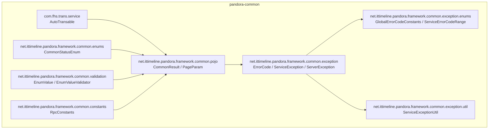
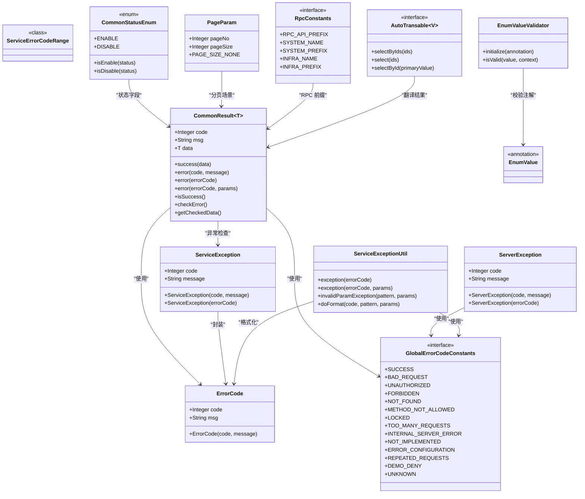
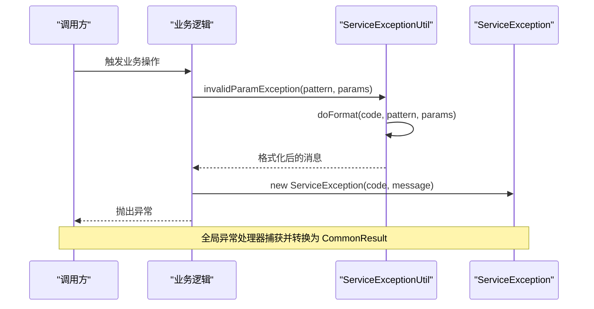
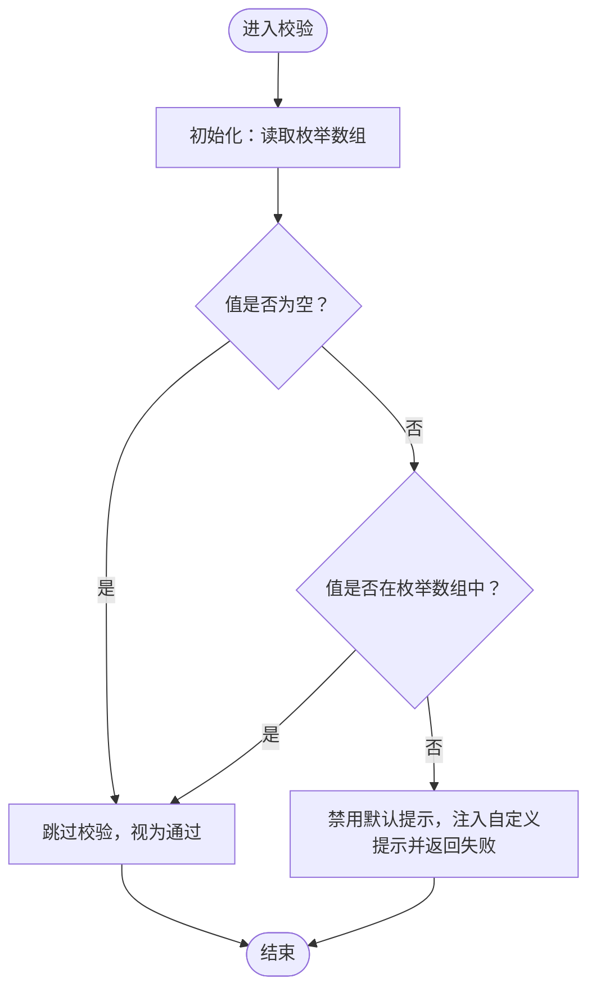
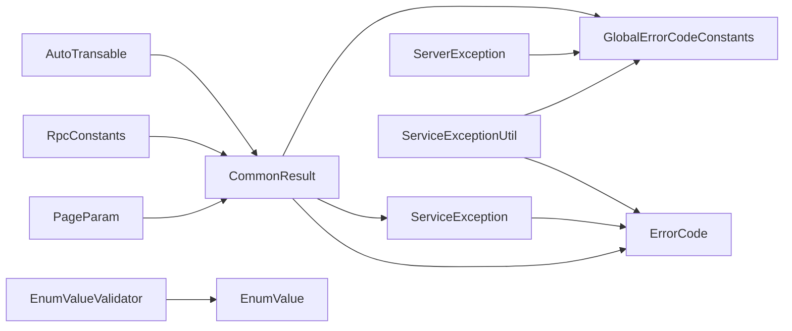

# 核心模块

<cite>
**本文引用的文件**
- [AutoTransable.java](file://pandora-framework/pandora-common/src/main/java/com/fhs/trans/service/AutoTransable.java)
- [CommonResult.java](file://pandora-framework/pandora-common/src/main/java/net/ittimeline/pandora/framework/common/pojo/CommonResult.java)
- [ErrorCode.java](file://pandora-framework/pandora-common/src/main/java/net/ittimeline/pandora/framework/common/exception/ErrorCode.java)
- [ServiceException.java](file://pandora-framework/pandora-common/src/main/java/net/ittimeline/pandora/framework/common/exception/ServiceException.java)
- [ServerException.java](file://pandora-framework/pandora-common/src/main/java/net/ittimeline/pandora/framework/common/exception/ServerException.java)
- [GlobalErrorCodeConstants.java](file://pandora-framework/pandora-common/src/main/java/net/ittimeline/pandora/framework/common/exception/enums/GlobalErrorCodeConstants.java)
- [ServiceErrorCodeRange.java](file://pandora-framework/pandora-common/src/main/java/net/ittimeline/pandora/framework/common/exception/enums/ServiceErrorCodeRange.java)
- [ServiceExceptionUtil.java](file://pandora-framework/pandora-common/src/main/java/net/ittimeline/pandora/framework/common/exception/util/ServiceExceptionUtil.java)
- [CommonStatusEnum.java](file://pandora-framework/pandora-common/src/main/java/net/ittimeline/pandora/framework/common/enums/CommonStatusEnum.java)
- [PageParam.java](file://pandora-framework/pandora-common/src/main/java/net/ittimeline/pandora/framework/common/pojo/PageParam.java)
- [EnumValue.java](file://pandora-framework/pandora-common/src/main/java/net/ittimeline/pandora/framework/common/validation/EnumValue.java)
- [EnumValueValidator.java](file://pandora-framework/pandora-common/src/main/java/net/ittimeline/pandora/framework/common/validation/EnumValueValidator.java)
- [RpcConstants.java](file://pandora-framework/pandora-common/src/main/java/net/ittimeline/pandora/framework/common/constants/RpcConstants.java)
- [README.md](file://pandora-framework/pandora-common/README.md)
</cite>

## 目录
1. [简介](#简介)
2. [项目结构](#项目结构)
3. [核心组件](#核心组件)
4. [架构总览](#架构总览)
5. [详细组件分析](#详细组件分析)
6. [依赖分析](#依赖分析)
7. [性能考虑](#性能考虑)
8. [故障排查指南](#故障排查指南)
9. [结论](#结论)
10. [附录](#附录)

## 简介
本文件面向 Pandora Cloud 框架的核心模块（pandora-common），系统性梳理通用基础能力与公共设施，包括：
- 数据翻译服务接口 AutoTransable
- 统一响应格式 CommonResult
- 错误码与异常体系（ErrorCode、ServiceException、ServerException、全局错误码与业务错误码区间）
- 工具类与枚举（ServiceExceptionUtil、CommonStatusEnum、PageParam、RpcConstants）
- 校验注解与校验器（EnumValue、EnumValueValidator）

文档兼顾初学者的概念解释与高级开发者的实现细节、最佳实践与协作关系。

## 项目结构
pandora-common 作为通用基础模块，提供跨服务复用的基础设施，主要分布在以下包：
- com.fhs.trans.service：数据翻译接口 AutoTransable
- net.ittimeline.pandora.framework.common.pojo：统一响应、分页参数等模型
- net.ittimeline.pandora.framework.common.exception：错误码与异常体系
- net.ittimeline.pandora.framework.common.exception.enums：全局与业务错误码常量
- net.ittimeline.pandora.framework.common.exception.util：异常消息格式化工具
- net.ittimeline.pandora.framework.common.enums：通用状态枚举
- net.ittimeline.pandora.framework.common.validation：自定义校验注解与校验器
- net.ittimeline.pandora.framework.common.constants：RPC 常量

图表来源
- [AutoTransable.java:1-61](file://pandora-framework/pandora-common/src/main/java/com/fhs/trans/service/AutoTransable.java#L1-L61)
- [CommonResult.java:1-123](file://pandora-framework/pandora-common/src/main/java/net/ittimeline/pandora/framework/common/pojo/CommonResult.java#L1-L123)
- [ErrorCode.java:1-33](file://pandora-framework/pandora-common/src/main/java/net/ittimeline/pandora/framework/common/exception/ErrorCode.java#L1-L33)
- [ServiceException.java:1-64](file://pandora-framework/pandora-common/src/main/java/net/ittimeline/pandora/framework/common/exception/ServiceException.java#L1-L64)
- [ServerException.java:1-65](file://pandora-framework/pandora-common/src/main/java/net/ittimeline/pandora/framework/common/exception/ServerException.java#L1-L65)
- [GlobalErrorCodeConstants.java:1-42](file://pandora-framework/pandora-common/src/main/java/net/ittimeline/pandora/framework/common/exception/enums/GlobalErrorCodeConstants.java#L1-L42)
- [ServiceErrorCodeRange.java:1-48](file://pandora-framework/pandora-common/src/main/java/net/ittimeline/pandora/framework/common/exception/enums/ServiceErrorCodeRange.java#L1-L48)
- [ServiceExceptionUtil.java:1-85](file://pandora-framework/pandora-common/src/main/java/net/ittimeline/pandora/framework/common/exception/util/ServiceExceptionUtil.java#L1-L85)
- [CommonStatusEnum.java:1-48](file://pandora-framework/pandora-common/src/main/java/net/ittimeline/pandora/framework/common/enums/CommonStatusEnum.java#L1-L48)
- [PageParam.java:1-43](file://pandora-framework/pandora-common/src/main/java/net/ittimeline/pandora/framework/common/pojo/PageParam.java#L1-L43)
- [EnumValue.java:1-40](file://pandora-framework/pandora-common/src/main/java/net/ittimeline/pandora/framework/common/validation/EnumValue.java#L1-L40)
- [EnumValueValidator.java:1-49](file://pandora-framework/pandora-common/src/main/java/net/ittimeline/pandora/framework/common/validation/EnumValueValidator.java#L1-L49)
- [RpcConstants.java:1-42](file://pandora-framework/pandora-common/src/main/java/net/ittimeline/pandora/framework/common/constants/RpcConstants.java#L1-L42)

章节来源
- [README.md:1-33](file://pandora-framework/pandora-common/README.md#L1-L33)

## 核心组件
- AutoTransable：定义自动翻译的数据访问契约，支持按主键集合查询、全量查询与单条查询，便于上层统一进行字典/名称翻译。
- CommonResult：统一响应载体，包含 code、msg、data，提供 success/error 辅助方法与异常检查能力。
- ErrorCode：错误码对象，承载 code 与 message，配合全局与业务错误码常量使用。
- ServiceException / ServerException：业务异常与服务器异常，均继承自 RuntimeException，携带错误码与消息。
- GlobalErrorCodeConstants：全局错误码常量集，覆盖客户端错误（4xx）、服务端错误（5xx）与自定义段。
- ServiceErrorCodeRange：业务异常错误码区间规范，指导模块内错误码分配。
- ServiceExceptionUtil：异常消息格式化工具，采用 {} 占位符与安全格式化策略。
- CommonStatusEnum：通用状态枚举 ENABLE/DISABLE，提供数组与便捷判断方法。
- PageParam：分页请求参数模型，含默认页码、默认页大小与不分页标记。
- EnumValue / EnumValueValidator：基于枚举数组的参数校验注解与校验器。
- RpcConstants：RPC 前缀与服务名常量，便于跨模块统一约定。

章节来源
- [AutoTransable.java:1-61](file://pandora-framework/pandora-common/src/main/java/com/fhs/trans/service/AutoTransable.java#L1-L61)
- [CommonResult.java:1-123](file://pandora-framework/pandora-common/src/main/java/net/ittimeline/pandora/framework/common/pojo/CommonResult.java#L1-L123)
- [ErrorCode.java:1-33](file://pandora-framework/pandora-common/src/main/java/net/ittimeline/pandora/framework/common/exception/ErrorCode.java#L1-L33)
- [ServiceException.java:1-64](file://pandora-framework/pandora-common/src/main/java/net/ittimeline/pandora/framework/common/exception/ServiceException.java#L1-L64)
- [ServerException.java:1-65](file://pandora-framework/pandora-common/src/main/java/net/ittimeline/pandora/framework/common/exception/ServerException.java#L1-L65)
- [GlobalErrorCodeConstants.java:1-42](file://pandora-framework/pandora-common/src/main/java/net/ittimeline/pandora/framework/common/exception/enums/GlobalErrorCodeConstants.java#L1-L42)
- [ServiceErrorCodeRange.java:1-48](file://pandora-framework/pandora-common/src/main/java/net/ittimeline/pandora/framework/common/exception/enums/ServiceErrorCodeRange.java#L1-L48)
- [ServiceExceptionUtil.java:1-85](file://pandora-framework/pandora-common/src/main/java/net/ittimeline/pandora/framework/common/exception/util/ServiceExceptionUtil.java#L1-L85)
- [CommonStatusEnum.java:1-48](file://pandora-framework/pandora-common/src/main/java/net/ittimeline/pandora/framework/common/enums/CommonStatusEnum.java#L1-L48)
- [PageParam.java:1-43](file://pandora-framework/pandora-common/src/main/java/net/ittimeline/pandora/framework/common/pojo/PageParam.java#L1-L43)
- [EnumValue.java:1-40](file://pandora-framework/pandora-common/src/main/java/net/ittimeline/pandora/framework/common/validation/EnumValue.java#L1-L40)
- [EnumValueValidator.java:1-49](file://pandora-framework/pandora-common/src/main/java/net/ittimeline/pandora/framework/common/validation/EnumValueValidator.java#L1-L49)
- [RpcConstants.java:1-42](file://pandora-framework/pandora-common/src/main/java/net/ittimeline/pandora/framework/common/constants/RpcConstants.java#L1-L42)

## 架构总览
下图展示核心模块内部关键组件的交互关系与职责边界：

图表来源
- [ErrorCode.java:1-33](file://pandora-framework/pandora-common/src/main/java/net/ittimeline/pandora/framework/common/exception/ErrorCode.java#L1-L33)
- [GlobalErrorCodeConstants.java:1-42](file://pandora-framework/pandora-common/src/main/java/net/ittimeline/pandora/framework/common/exception/enums/GlobalErrorCodeConstants.java#L1-L42)
- [ServiceErrorCodeRange.java:1-48](file://pandora-framework/pandora-common/src/main/java/net/ittimeline/pandora/framework/common/exception/enums/ServiceErrorCodeRange.java#L1-L48)
- [ServiceException.java:1-64](file://pandora-framework/pandora-common/src/main/java/net/ittimeline/pandora/framework/common/exception/ServiceException.java#L1-L64)
- [ServerException.java:1-65](file://pandora-framework/pandora-common/src/main/java/net/ittimeline/pandora/framework/common/exception/ServerException.java#L1-L65)
- [ServiceExceptionUtil.java:1-85](file://pandora-framework/pandora-common/src/main/java/net/ittimeline/pandora/framework/common/exception/util/ServiceExceptionUtil.java#L1-L85)
- [CommonResult.java:1-123](file://pandora-framework/pandora-common/src/main/java/net/ittimeline/pandora/framework/common/pojo/CommonResult.java#L1-L123)
- [CommonStatusEnum.java:1-48](file://pandora-framework/pandora-common/src/main/java/net/ittimeline/pandora/framework/common/enums/CommonStatusEnum.java#L1-L48)
- [PageParam.java:1-43](file://pandora-framework/pandora-common/src/main/java/net/ittimeline/pandora/framework/common/pojo/PageParam.java#L1-L43)
- [EnumValue.java:1-40](file://pandora-framework/pandora-common/src/main/java/net/ittimeline/pandora/framework/common/validation/EnumValue.java#L1-L40)
- [EnumValueValidator.java:1-49](file://pandora-framework/pandora-common/src/main/java/net/ittimeline/pandora/framework/common/validation/EnumValueValidator.java#L1-L49)
- [RpcConstants.java:1-42](file://pandora-framework/pandora-common/src/main/java/net/ittimeline/pandora/framework/common/constants/RpcConstants.java#L1-L42)
- [AutoTransable.java:1-61](file://pandora-framework/pandora-common/src/main/java/com/fhs/trans/service/AutoTransable.java#L1-L61)

## 详细组件分析

### AutoTransable 数据翻译服务接口
- 设计目标：为需要“自动翻译”的领域对象提供统一的数据访问能力，如根据主键集合批量查询、全量查询、按主键查询。
- 默认方法：提供 selectByIds 与 select（默认回退至 findByIds），兼容旧版本 API。
- 使用建议：
  - 在 DTO/VO 上标注翻译字段，结合上层翻译引擎按需加载。
  - 优先使用 selectByIds 批量查询，减少数据库往返。
- 关键点：接口位于独立包，便于在 API 模块复用，避免对特定子系统的耦合。

章节来源
- [AutoTransable.java:1-61](file://pandora-framework/pandora-common/src/main/java/com/fhs/trans/service/AutoTransable.java#L1-L61)

### CommonResult 统一响应格式
- 字段：code、msg、data；提供静态工厂方法快速构建成功/错误响应。
- 成功/错误判定：支持静态与实例方法判断；提供异常检查与安全取数。
- 与异常体系集成：当响应表示错误时，可通过 checkError 抛出 ServiceException；getCheckedData 在成功时返回 data。
- 使用模式：
  - 控制器层统一包装：返回 CommonResult.success(data) 或 CommonResult.error(...)。
  - 业务层可直接抛出 ServiceException，由全局异常处理器转换为 CommonResult。

章节来源
- [CommonResult.java:1-123](file://pandora-framework/pandora-common/src/main/java/net/ittimeline/pandora/framework/common/pojo/CommonResult.java#L1-L123)

### 错误码与异常体系
- ErrorCode：承载错误码与消息，作为异常与响应的统一载体。
- ServiceException：业务异常，携带业务错误码，适合业务断言与校验失败。
- ServerException：服务器异常，通常用于 5xx 场景或非业务错误。
- GlobalErrorCodeConstants：全局错误码常量，覆盖 4xx/5xx/自定义段，便于与 HTTP 语义对齐。
- ServiceErrorCodeRange：业务错误码区间规范，指导模块内错误码分配，避免冲突。
- ServiceExceptionUtil：提供异常构造与消息格式化，采用 {} 占位符与安全格式化策略，避免参数不匹配导致异常。

图表来源
- [ServiceExceptionUtil.java:1-85](file://pandora-framework/pandora-common/src/main/java/net/ittimeline/pandora/framework/common/exception/util/ServiceExceptionUtil.java#L1-L85)
- [ServiceException.java:1-64](file://pandora-framework/pandora-common/src/main/java/net/ittimeline/pandora/framework/common/exception/ServiceException.java#L1-L64)
- [GlobalErrorCodeConstants.java:1-42](file://pandora-framework/pandora-common/src/main/java/net/ittimeline/pandora/framework/common/exception/enums/GlobalErrorCodeConstants.java#L1-L42)

章节来源
- [ErrorCode.java:1-33](file://pandora-framework/pandora-common/src/main/java/net/ittimeline/pandora/framework/common/exception/ErrorCode.java#L1-L33)
- [ServiceException.java:1-64](file://pandora-framework/pandora-common/src/main/java/net/ittimeline/pandora/framework/common/exception/ServiceException.java#L1-L64)
- [ServerException.java:1-65](file://pandora-framework/pandora-common/src/main/java/net/ittimeline/pandora/framework/common/exception/ServerException.java#L1-L65)
- [GlobalErrorCodeConstants.java:1-42](file://pandora-framework/pandora-common/src/main/java/net/ittimeline/pandora/framework/common/exception/enums/GlobalErrorCodeConstants.java#L1-L42)
- [ServiceErrorCodeRange.java:1-48](file://pandora-framework/pandora-common/src/main/java/net/ittimeline/pandora/framework/common/exception/enums/ServiceErrorCodeRange.java#L1-L48)
- [ServiceExceptionUtil.java:1-85](file://pandora-framework/pandora-common/src/main/java/net/ittimeline/pandora/framework/common/exception/util/ServiceExceptionUtil.java#L1-L85)

### 工具类与枚举
- CommonStatusEnum：提供 ENABLE/DISABLE 两个状态，支持数组与便捷判断方法，适用于通用状态字段。
- PageParam：分页参数模型，含默认页码、默认页大小与不分页标记，便于统一分页处理。
- RpcConstants：RPC 前缀与服务名常量，便于跨模块统一约定，减少硬编码。

章节来源
- [CommonStatusEnum.java:1-48](file://pandora-framework/pandora-common/src/main/java/net/ittimeline/pandora/framework/common/enums/CommonStatusEnum.java#L1-L48)
- [PageParam.java:1-43](file://pandora-framework/pandora-common/src/main/java/net/ittimeline/pandora/framework/common/pojo/PageParam.java#L1-L43)
- [RpcConstants.java:1-42](file://pandora-framework/pandora-common/src/main/java/net/ittimeline/pandora/framework/common/constants/RpcConstants.java#L1-L42)

### 校验注解与校验器
- EnumValue：自定义校验注解，要求被校验字段的值必须在指定枚举数组范围内。
- EnumValueValidator：单值校验器，初始化时读取枚举数组，支持空值跳过校验，校验失败时自定义提示模板。
- 使用模式：在 DTO 字段上标注 @EnumValue(value = MyEnum.class)，即可完成参数合法性校验。

图表来源
- [EnumValue.java:1-40](file://pandora-framework/pandora-common/src/main/java/net/ittimeline/pandora/framework/common/validation/EnumValue.java#L1-L40)
- [EnumValueValidator.java:1-49](file://pandora-framework/pandora-common/src/main/java/net/ittimeline/pandora/framework/common/validation/EnumValueValidator.java#L1-L49)

章节来源
- [EnumValue.java:1-40](file://pandora-framework/pandora-common/src/main/java/net/ittimeline/pandora/framework/common/validation/EnumValue.java#L1-L40)
- [EnumValueValidator.java:1-49](file://pandora-framework/pandora-common/src/main/java/net/ittimeline/pandora/framework/common/validation/EnumValueValidator.java#L1-L49)

## 依赖分析
- 内聚性：各包职责清晰，pojo 负责数据传输对象，exception 负责错误与异常，validation 提供参数校验，constants 提供常量。
- 耦合度：CommonResult 与异常体系强关联；ServiceExceptionUtil 与 ErrorCode/GlobalErrorCodeConstants 强关联；EnumValueValidator 依赖 ArrayValuable 接口与枚举数组。
- 外部依赖：使用 Lombok 简化样板代码；Hutool 提供对象比较与数组工具；Jackson 注解用于序列化控制；Guava 用于测试可见性注解。

图表来源
- [CommonResult.java:1-123](file://pandora-framework/pandora-common/src/main/java/net/ittimeline/pandora/framework/common/pojo/CommonResult.java#L1-L123)
- [ErrorCode.java:1-33](file://pandora-framework/pandora-common/src/main/java/net/ittimeline/pandora/framework/common/exception/ErrorCode.java#L1-L33)
- [ServiceException.java:1-64](file://pandora-framework/pandora-common/src/main/java/net/ittimeline/pandora/framework/common/exception/ServiceException.java#L1-L64)
- [ServerException.java:1-65](file://pandora-framework/pandora-common/src/main/java/net/ittimeline/pandora/framework/common/exception/ServerException.java#L1-L65)
- [GlobalErrorCodeConstants.java:1-42](file://pandora-framework/pandora-common/src/main/java/net/ittimeline/pandora/framework/common/exception/enums/GlobalErrorCodeConstants.java#L1-L42)
- [ServiceExceptionUtil.java:1-85](file://pandora-framework/pandora-common/src/main/java/net/ittimeline/pandora/framework/common/exception/util/ServiceExceptionUtil.java#L1-L85)
- [EnumValue.java:1-40](file://pandora-framework/pandora-common/src/main/java/net/ittimeline/pandora/framework/common/validation/EnumValue.java#L1-L40)
- [EnumValueValidator.java:1-49](file://pandora-framework/pandora-common/src/main/java/net/ittimeline/pandora/framework/common/validation/EnumValueValidator.java#L1-L49)
- [PageParam.java:1-43](file://pandora-framework/pandora-common/src/main/java/net/ittimeline/pandora/framework/common/pojo/PageParam.java#L1-L43)
- [RpcConstants.java:1-42](file://pandora-framework/pandora-common/src/main/java/net/ittimeline/pandora/framework/common/constants/RpcConstants.java#L1-L42)
- [AutoTransable.java:1-61](file://pandora-framework/pandora-common/src/main/java/com/fhs/trans/service/AutoTransable.java#L1-L61)

## 性能考虑
- 批量查询：AutoTransable 的 selectByIds 优于多次单条查询，降低网络与数据库压力。
- 分页参数：PageParam 限制最大页大小，避免超大分页导致内存与性能问题。
- 异常格式化：ServiceExceptionUtil 使用预分配容量的 StringBuilder，减少字符串拼接开销。
- 序列化控制：CommonResult 对敏感方法标注忽略序列化，避免 JSON 输出冗余信息。

## 故障排查指南
- 统一响应错误：若前端收到错误响应，先检查 code 是否来自 GlobalErrorCodeConstants；若为业务异常，查看 ServiceExceptionUtil 格式化后的 message。
- 参数校验失败：确认 DTO 字段是否标注 @EnumValue(value = ...)，并确保传入值在枚举数组范围内。
- 分页异常：检查 pageNo 与 pageSize 是否符合 PageParam 的约束（最小值、最大值与不分页标记）。
- RPC 前缀不一致：核对 RpcConstants 中的前缀与服务端路由是否一致。

章节来源
- [ServiceExceptionUtil.java:1-85](file://pandora-framework/pandora-common/src/main/java/net/ittimeline/pandora/framework/common/exception/util/ServiceExceptionUtil.java#L1-L85)
- [EnumValue.java:1-40](file://pandora-framework/pandora-common/src/main/java/net/ittimeline/pandora/framework/common/validation/EnumValue.java#L1-L40)
- [EnumValueValidator.java:1-49](file://pandora-framework/pandora-common/src/main/java/net/ittimeline/pandora/framework/common/validation/EnumValueValidator.java#L1-L49)
- [PageParam.java:1-43](file://pandora-framework/pandora-common/src/main/java/net/ittimeline/pandora/framework/common/pojo/PageParam.java#L1-L43)
- [RpcConstants.java:1-42](file://pandora-framework/pandora-common/src/main/java/net/ittimeline/pandora/framework/common/constants/RpcConstants.java#L1-L42)

## 结论
pandora-common 通过 AutoTransable、CommonResult、ErrorCode/Exception 体系、校验注解与工具类，构建了统一、可复用且易于扩展的基础能力。遵循错误码区间规范与参数校验约定，可显著提升系统一致性与可维护性；结合批量查询与分页约束，有助于优化性能与资源消耗。

## 附录
- 使用建议
  - 控制器层统一返回 CommonResult，业务层抛出 ServiceException，由全局异常处理器转换。
  - 在 DTO 中使用 @EnumValue 标注参数范围，减少重复校验代码。
  - 在需要字典翻译的场景，实现 AutoTransable 接口并提供批量查询能力。
  - 在 RPC 场景统一使用 RpcConstants，避免路由不一致问题。