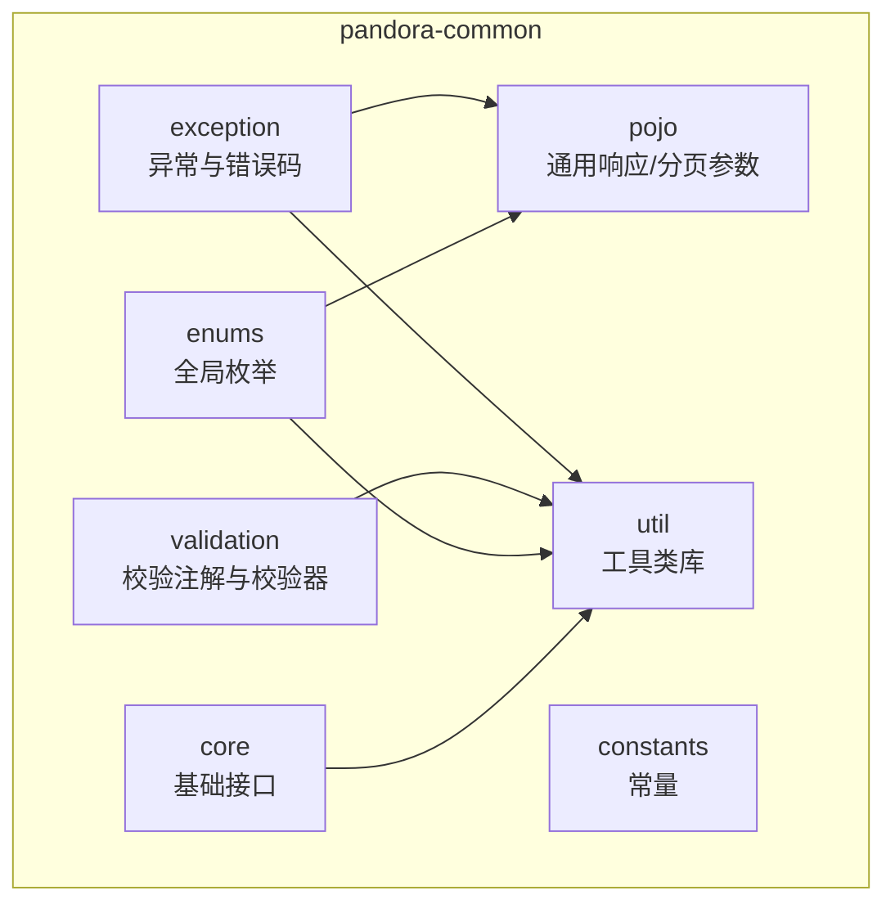
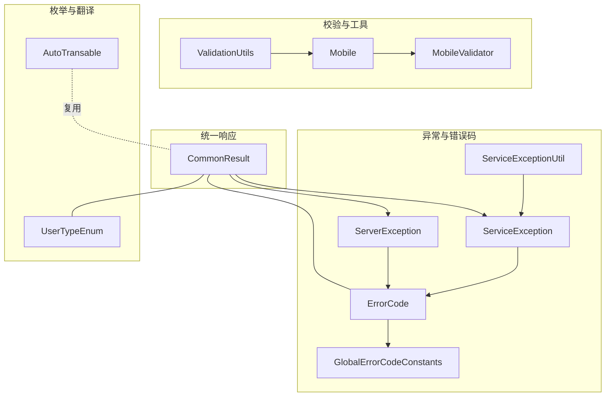
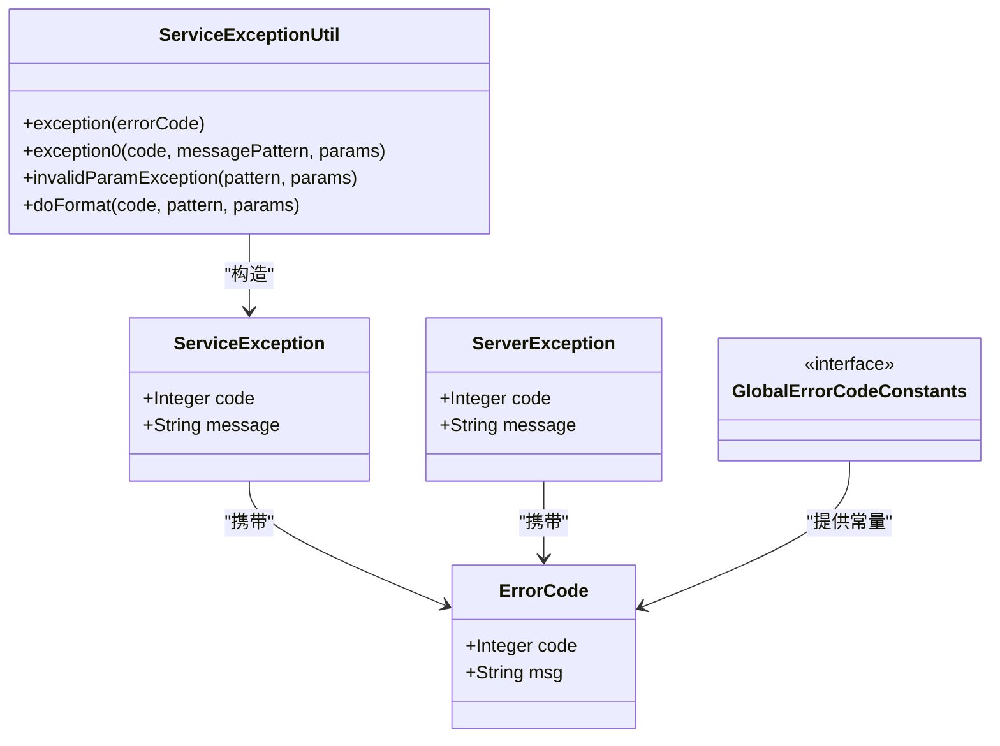
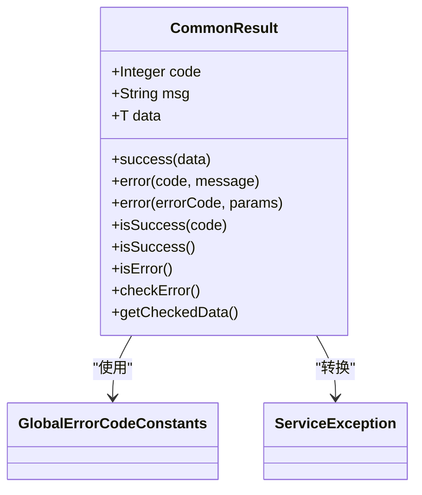
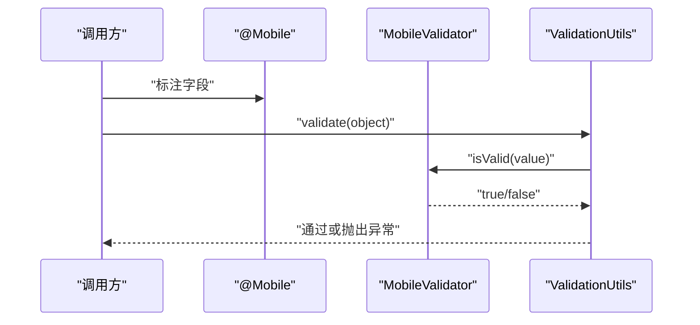
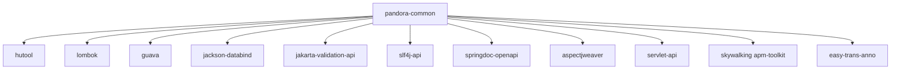

# 核心模块

<cite>
**本文引用的文件**
- [README.md](file://pandora-framework/pandora-common/README.md)
- [pom.xml](file://pandora-framework/pandora-common/pom.xml)
- [ErrorCode.java](file://pandora-framework/pandora-common/src/main/java/net/ittimeline/pandora/framework/common/exception/ErrorCode.java)
- [ServiceException.java](file://pandora-framework/pandora-common/src/main/java/net/ittimeline/pandora/framework/common/exception/ServiceException.java)
- [ServerException.java](file://pandora-framework/pandora-common/src/main/java/net/ittimeline/pandora/framework/common/exception/ServerException.java)
- [GlobalErrorCodeConstants.java](file://pandora-framework/pandora-common/src/main/java/net/ittimeline/pandora/framework/common/exception/enums/GlobalErrorCodeConstants.java)
- [ServiceExceptionUtil.java](file://pandora-framework/pandora-common/src/main/java/net/ittimeline/pandora/framework/common/exception/util/ServiceExceptionUtil.java)
- [CommonResult.java](file://pandora-framework/pandora-common/src/main/java/net/ittimeline/pandora/framework/common/pojo/CommonResult.java)
- [PageParam.java](file://pandora-framework/pandora-common/src/main/java/net/ittimeline/pandora/framework/common/pojo/PageParam.java)
- [AutoTransable.java](file://pandora-framework/pandora-common/src/main/java/com/fhs/trans/service/AutoTransable.java)
- [SpringUtils.java](file://pandora-framework/pandora-common/src/main/java/net/ittimeline/pandora/framework/common/util/web/spring/SpringUtils.java)
- [ValidationUtils.java](file://pandora-framework/pandora-common/src/main/java/net/ittimeline/pandora/framework/common/util/web/validation/ValidationUtils.java)
- [Mobile.java](file://pandora-framework/pandora-common/src/main/java/net/ittimeline/pandora/framework/common/validation/Mobile.java)
- [MobileValidator.java](file://pandora-framework/pandora-common/src/main/java/net/ittimeline/pandora/framework/common/validation/MobileValidator.java)
- [UserTypeEnum.java](file://pandora-framework/pandora-common/src/main/java/net/ittimeline/pandora/framework/common/enums/UserTypeEnum.java)
</cite>

## 目录
1. [简介](#简介)
2. [项目结构](#项目结构)
3. [核心组件](#核心组件)
4. [架构总览](#架构总览)
5. [详细组件分析](#详细组件分析)
6. [依赖分析](#依赖分析)
7. [性能考量](#性能考量)
8. [故障排查指南](#故障排查指南)
9. [结论](#结论)
10. [附录](#附录)

## 简介
本文件为 Pandora Cloud 核心模块 pandora-common 的综合性架构文档。该模块以“基础设施与通用能力”为核心定位，提供统一的异常处理体系、统一响应模型、基础 POJO 与分页参数、校验注解与工具类、以及跨模块可复用的枚举与翻译接口等。其设计理念强调：
- 统一性：通过统一的错误码与响应模型，降低各业务模块的沟通成本
- 可扩展性：通过枚举与接口抽象，支持业务扩展与第三方集成
- 易用性：通过工具类与注解简化常见场景的开发与校验
- 解耦性：将异常、响应、校验、工具等能力以独立包形式沉淀，便于多模块复用

## 项目结构
pandora-common 模块采用按功能域分层的组织方式，主要目录与职责如下：
- exception：异常体系与错误码模型
- pojo：通用响应、分页参数等基础数据模型
- util：工具类库（集合、日期、IO、数字、对象、字符串、Web 工具、JSON、监控、Spring 扩展、校验）
- validation：校验注解与校验器
- enums：全局枚举（如用户类型）
- constants：常量定义（如 RPC、Web 过滤器顺序）
- core：基础接口（如数组可取值）

图表来源
- [pom.xml:1-101](file://pandora-framework/pandora-common/pom.xml#L1-L101)

章节来源
- [pom.xml:1-101](file://pandora-framework/pandora-common/pom.xml#L1-L101)

## 核心组件
本节对关键组件进行深入解析，涵盖职责、数据结构、复杂度与依赖关系。

- 统一异常与错误码
  - ErrorCode：错误码对象，封装 code 与 msg
  - GlobalErrorCodeConstants：全局错误码常量集，覆盖客户端、服务端与自定义错误段
  - ServiceException：业务异常，携带业务错误码
  - ServerException：服务器异常，用于非业务错误（如 5xx）
  - ServiceExceptionUtil：异常消息格式化工具，支持占位符与日志记录

- 统一响应模型
  - CommonResult：通用响应体，包含 code、msg、data；提供 success/error/checkError/getCheckedData 等静态与实例方法，支持与异常体系无缝集成

- 分页参数
  - PageParam：分页请求参数，含默认页码与默认页大小，支持不分页标记

- 校验注解与工具
  - Mobile/Telephone 注解与对应校验器：基于正则表达式的手机号/座机校验
  - ValidationUtils：基于 Jakarta Validation 的校验工具，支持对象级校验与异常抛出

- 枚举与翻译接口
  - UserTypeEnum：用户类型枚举，支持数组化与查找
  - AutoTransable：VO 翻译接口，便于跨模块的数据翻译能力复用

章节来源
- [ErrorCode.java:1-33](file://pandora-framework/pandora-common/src/main/java/net/ittimeline/pandora/framework/common/exception/ErrorCode.java#L1-L33)
- [GlobalErrorCodeConstants.java:1-42](file://pandora-framework/pandora-common/src/main/java/net/ittimeline/pandora/framework/common/exception/enums/GlobalErrorCodeConstants.java#L1-L42)
- [ServiceException.java:1-64](file://pandora-framework/pandora-common/src/main/java/net/ittimeline/pandora/framework/common/exception/ServiceException.java#L1-L64)
- [ServerException.java:1-65](file://pandora-framework/pandora-common/src/main/java/net/ittimeline/pandora/framework/common/exception/ServerException.java#L1-L65)
- [ServiceExceptionUtil.java:1-85](file://pandora-framework/pandora-common/src/main/java/net/ittimeline/pandora/framework/common/exception/util/ServiceExceptionUtil.java#L1-L85)
- [CommonResult.java:1-123](file://pandora-framework/pandora-common/src/main/java/net/ittimeline/pandora/framework/common/pojo/CommonResult.java#L1-L123)
- [PageParam.java:1-43](file://pandora-framework/pandora-common/src/main/java/net/ittimeline/pandora/framework/common/pojo/PageParam.java#L1-L43)
- [Mobile.java:1-35](file://pandora-framework/pandora-common/src/main/java/net/ittimeline/pandora/framework/common/validation/Mobile.java#L1-L35)
- [MobileValidator.java:1-30](file://pandora-framework/pandora-common/src/main/java/net/ittimeline/pandora/framework/common/validation/MobileValidator.java#L1-L30)
- [ValidationUtils.java:1-56](file://pandora-framework/pandora-common/src/main/java/net/ittimeline/pandora/framework/common/util/web/validation/ValidationUtils.java#L1-L56)
- [AutoTransable.java:1-61](file://pandora-framework/pandora-common/src/main/java/com/fhs/trans/service/AutoTransable.java#L1-L61)
- [UserTypeEnum.java:1-48](file://pandora-framework/pandora-common/src/main/java/net/ittimeline/pandora/framework/common/enums/UserTypeEnum.java#L1-L48)

## 架构总览
pandora-common 的架构围绕“统一异常与响应”“校验与工具”“枚举与翻译”三大主线展开，形成低耦合、高内聚的基础能力层，供上层模块复用。

图表来源
- [ErrorCode.java:1-33](file://pandora-framework/pandora-common/src/main/java/net/ittimeline/pandora/framework/common/exception/ErrorCode.java#L1-L33)
- [GlobalErrorCodeConstants.java:1-42](file://pandora-framework/pandora-common/src/main/java/net/ittimeline/pandora/framework/common/exception/enums/GlobalErrorCodeConstants.java#L1-L42)
- [ServiceException.java:1-64](file://pandora-framework/pandora-common/src/main/java/net/ittimeline/pandora/framework/common/exception/ServiceException.java#L1-L64)
- [ServerException.java:1-65](file://pandora-framework/pandora-common/src/main/java/net/ittimeline/pandora/framework/common/exception/ServerException.java#L1-L65)
- [ServiceExceptionUtil.java:1-85](file://pandora-framework/pandora-common/src/main/java/net/ittimeline/pandora/framework/common/exception/util/ServiceExceptionUtil.java#L1-L85)
- [CommonResult.java:1-123](file://pandora-framework/pandora-common/src/main/java/net/ittimeline/pandora/framework/common/pojo/CommonResult.java#L1-L123)
- [Mobile.java:1-35](file://pandora-framework/pandora-common/src/main/java/net/ittimeline/pandora/framework/common/validation/Mobile.java#L1-L35)
- [MobileValidator.java:1-30](file://pandora-framework/pandora-common/src/main/java/net/ittimeline/pandora/framework/common/validation/MobileValidator.java#L1-L30)
- [ValidationUtils.java:1-56](file://pandora-framework/pandora-common/src/main/java/net/ittimeline/pandora/framework/common/util/web/validation/ValidationUtils.java#L1-L56)
- [AutoTransable.java:1-61](file://pandora-framework/pandora-common/src/main/java/com/fhs/trans/service/AutoTransable.java#L1-L61)
- [UserTypeEnum.java:1-48](file://pandora-framework/pandora-common/src/main/java/net/ittimeline/pandora/framework/common/enums/UserTypeEnum.java#L1-L48)

## 详细组件分析

### 统一异常与错误码体系
- 设计要点
  - 错误码分段：全局错误码（0-999）与业务错误码（≥10^9），避免冲突
  - 异常分类：业务异常 ServiceException 与服务器异常 ServerException，分别面向不同场景
  - 消息格式化：ServiceExceptionUtil 提供占位符与日志记录，保证国际化与可维护性

图表来源
- [ErrorCode.java:1-33](file://pandora-framework/pandora-common/src/main/java/net/ittimeline/pandora/framework/common/exception/ErrorCode.java#L1-L33)
- [GlobalErrorCodeConstants.java:1-42](file://pandora-framework/pandora-common/src/main/java/net/ittimeline/pandora/framework/common/exception/enums/GlobalErrorCodeConstants.java#L1-L42)
- [ServiceException.java:1-64](file://pandora-framework/pandora-common/src/main/java/net/ittimeline/pandora/framework/common/exception/ServiceException.java#L1-L64)
- [ServerException.java:1-65](file://pandora-framework/pandora-common/src/main/java/net/ittimeline/pandora/framework/common/exception/ServerException.java#L1-L65)
- [ServiceExceptionUtil.java:1-85](file://pandora-framework/pandora-common/src/main/java/net/ittimeline/pandora/framework/common/exception/util/ServiceExceptionUtil.java#L1-L85)

章节来源
- [ErrorCode.java:1-33](file://pandora-framework/pandora-common/src/main/java/net/ittimeline/pandora/framework/common/exception/ErrorCode.java#L1-L33)
- [GlobalErrorCodeConstants.java:1-42](file://pandora-framework/pandora-common/src/main/java/net/ittimeline/pandora/framework/common/exception/enums/GlobalErrorCodeConstants.java#L1-L42)
- [ServiceException.java:1-64](file://pandora-framework/pandora-common/src/main/java/net/ittimeline/pandora/framework/common/exception/ServiceException.java#L1-L64)
- [ServerException.java:1-65](file://pandora-framework/pandora-common/src/main/java/net/ittimeline/pandora/framework/common/exception/ServerException.java#L1-L65)
- [ServiceExceptionUtil.java:1-85](file://pandora-framework/pandora-common/src/main/java/net/ittimeline/pandora/framework/common/exception/util/ServiceExceptionUtil.java#L1-L85)

### 统一响应模型
- 设计要点
  - 泛型响应体：支持任意数据类型的统一包装
  - 成功/失败判断：通过 code 与工具方法快速判定
  - 与异常体系集成：checkError/getCheckedData 将错误直接转化为异常，便于上层拦截

图表来源
- [CommonResult.java:1-123](file://pandora-framework/pandora-common/src/main/java/net/ittimeline/pandora/framework/common/pojo/CommonResult.java#L1-L123)
- [GlobalErrorCodeConstants.java:1-42](file://pandora-framework/pandora-common/src/main/java/net/ittimeline/pandora/framework/common/exception/enums/GlobalErrorCodeConstants.java#L1-L42)
- [ServiceException.java:1-64](file://pandora-framework/pandora-common/src/main/java/net/ittimeline/pandora/framework/common/exception/ServiceException.java#L1-L64)

章节来源
- [CommonResult.java:1-123](file://pandora-framework/pandora-common/src/main/java/net/ittimeline/pandora/framework/common/pojo/CommonResult.java#L1-L123)

### 分页参数与排序字段
- 设计要点
  - PageParam：提供默认页码与默认页大小，支持不分页标记（如导出场景）
  - 与 OpenAPI 文档集成：通过注解生成文档描述，提升接口可读性

章节来源
- [PageParam.java:1-43](file://pandora-framework/pandora-common/src/main/java/net/ittimeline/pandora/framework/common/pojo/PageParam.java#L1-L43)

### 校验注解与工具
- 设计要点
  - 注解驱动：Mobile/Telephone 等注解声明式校验
  - 校验器实现：基于正则表达式与工具类校验
  - ValidationUtils：统一对象级校验入口，异常抛出策略明确

图表来源
- [Mobile.java:1-35](file://pandora-framework/pandora-common/src/main/java/net/ittimeline/pandora/framework/common/validation/Mobile.java#L1-L35)
- [MobileValidator.java:1-30](file://pandora-framework/pandora-common/src/main/java/net/ittimeline/pandora/framework/common/validation/MobileValidator.java#L1-L30)
- [ValidationUtils.java:1-56](file://pandora-framework/pandora-common/src/main/java/net/ittimeline/pandora/framework/common/util/web/validation/ValidationUtils.java#L1-L56)

章节来源
- [Mobile.java:1-35](file://pandora-framework/pandora-common/src/main/java/net/ittimeline/pandora/framework/common/validation/Mobile.java#L1-L35)
- [MobileValidator.java:1-30](file://pandora-framework/pandora-common/src/main/java/net/ittimeline/pandora/framework/common/validation/MobileValidator.java#L1-L30)
- [ValidationUtils.java:1-56](file://pandora-framework/pandora-common/src/main/java/net/ittimeline/pandora/framework/common/util/web/validation/ValidationUtils.java#L1-L56)

### 枚举与翻译接口
- 设计要点
  - UserTypeEnum：提供数组化与查找能力，便于批量校验与过滤
  - AutoTransable：为 VO 翻译提供统一接口，便于跨模块复用

章节来源
- [UserTypeEnum.java:1-48](file://pandora-framework/pandora-common/src/main/java/net/ittimeline/pandora/framework/common/enums/UserTypeEnum.java#L1-L48)
- [AutoTransable.java:1-61](file://pandora-framework/pandora-common/src/main/java/com/fhs/trans/service/AutoTransable.java#L1-L61)

## 依赖分析
- 外部依赖概览
  - hutool：提供丰富的工具方法（字符串、集合、断言等）
  - Lombok：减少样板代码
  - Guava/Jackson/Jakarta Validation/SLF4J：工具类与校验、序列化、日志所需
  - SpringDoc OpenAPI：分页参数的文档注解支持
  - AspectJ/Spring/SkyWalking：监控与切面支持
  - easy-trans-anno：VO 翻译注解支持

图表来源
- [pom.xml:26-98](file://pandora-framework/pandora-common/pom.xml#L26-L98)

章节来源
- [pom.xml:26-98](file://pandora-framework/pandora-common/pom.xml#L26-L98)

## 性能考量
- 异常消息格式化
  - 预分配 StringBuilder，减少扩容与字符串拼接开销
  - 占位符替换采用线性扫描，时间复杂度 O(n)，适合短模板
- 校验流程
  - 正则匹配为 O(n) 时间复杂度，建议在高频场景下缓存 Pattern 或进行前置空值判断
- JSON 序列化
  - 通过注解忽略字段，避免不必要的序列化开销
- 工具类选择
  - 优先使用 hutool 与 Guava 的高性能实现，避免重复造轮子

## 故障排查指南
- 常见问题与定位
  - 错误码冲突：检查是否跨越全局与业务错误码区间
  - 响应体误判：确认 code 与 isSuccess 的判断逻辑
  - 校验异常：查看 ValidationUtils 抛出的异常类型与约束信息
  - 消息格式化异常：关注 ServiceExceptionUtil 的日志输出，核对占位符数量与参数个数
- 最佳实践
  - 统一使用 GlobalErrorCodeConstants 与 ServiceExceptionUtil，确保错误语义一致
  - 在接口层使用 CommonResult 包裹返回，便于前端与网关统一处理
  - 对高频校验场景，优先使用注解 + 校验器组合，减少重复代码

章节来源
- [ServiceExceptionUtil.java:49-82](file://pandora-framework/pandora-common/src/main/java/net/ittimeline/pandora/framework/common/exception/util/ServiceExceptionUtil.java#L49-L82)
- [ValidationUtils.java:43-54](file://pandora-framework/pandora-common/src/main/java/net/ittimeline/pandora/framework/common/util/web/validation/ValidationUtils.java#L43-L54)
- [CommonResult.java:82-94](file://pandora-framework/pandora-common/src/main/java/net/ittimeline/pandora/framework/common/pojo/CommonResult.java#L82-L94)

## 结论
pandora-common 通过统一异常与错误码、统一响应模型、校验注解与工具、枚举与翻译接口等能力，构建了清晰、稳定且易扩展的基础层。其模块化设计与对外部库的合理利用，使得上层业务能够专注于领域逻辑，同时保持一致的错误处理与交互体验。

## 附录
- 使用指南与集成最佳实践
  - 异常与错误码
    - 业务异常统一使用 ServiceException，结合 ServiceExceptionUtil 进行消息格式化
    - 全局错误码统一来自 GlobalErrorCodeConstants
  - 统一响应
    - 接口返回统一使用 CommonResult，成功使用 success，失败使用 error
    - 在服务编排层，使用 checkError/getCheckedData 将错误转为异常，便于全局拦截
  - 校验
    - 字段校验使用 @Mobile/@Telephone 等注解，配合 ValidationUtils.validate 进行对象级校验
  - 枚举与翻译
    - 使用 UserTypeEnum 等枚举进行类型判断与批量处理
    - VO 翻译能力通过 AutoTransable 接口复用，便于跨模块调用

章节来源
- [README.md:1-33](file://pandora-framework/pandora-common/README.md#L1-L33)