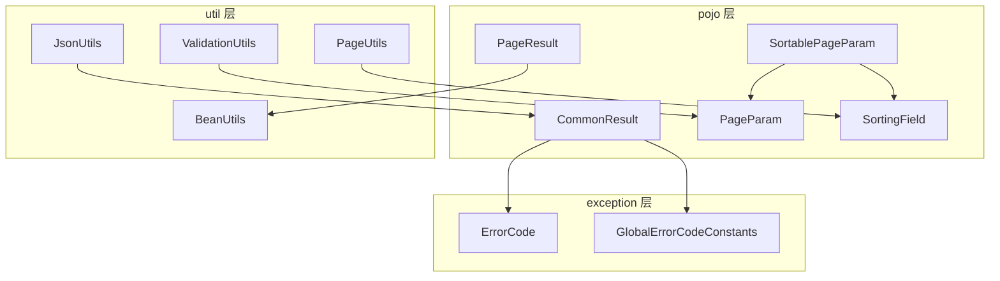
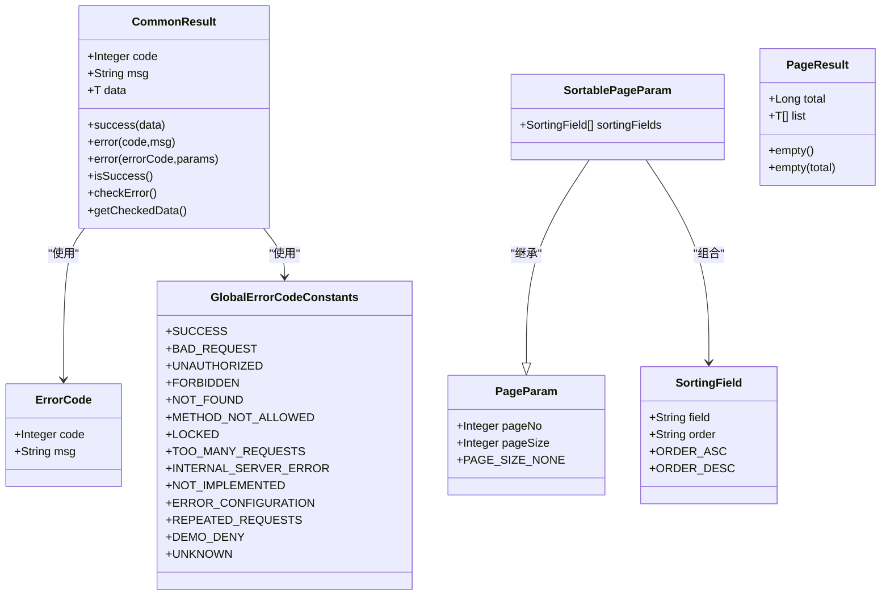
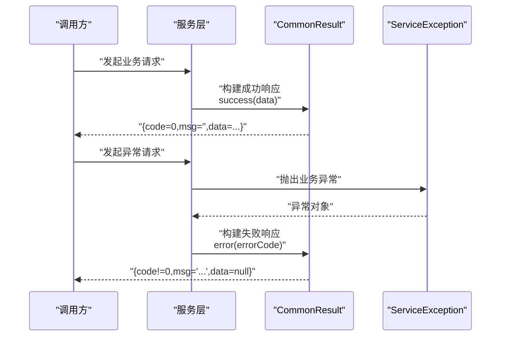
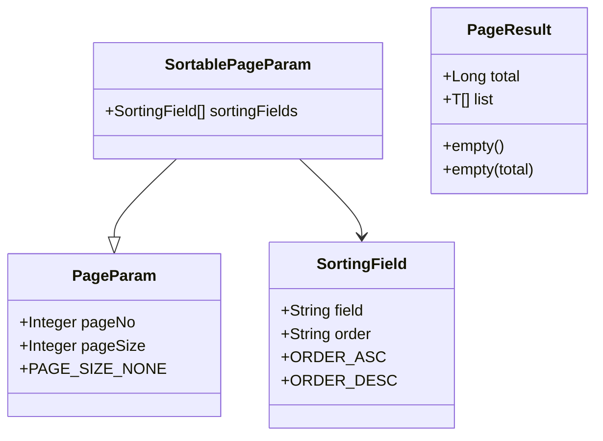
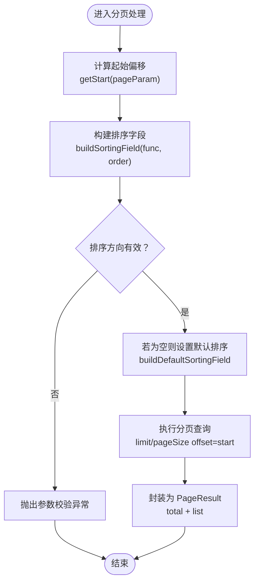
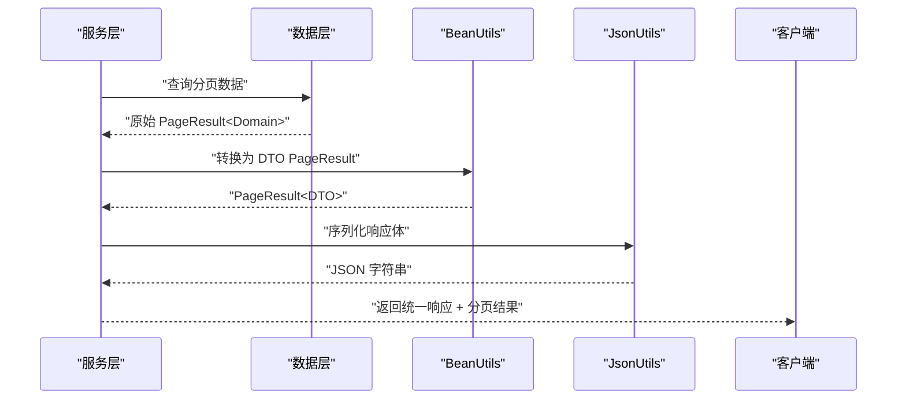
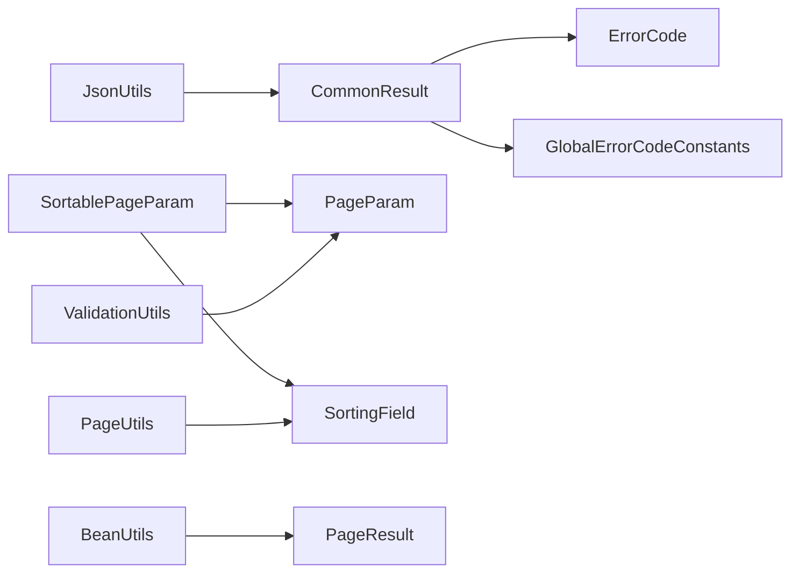

# 统一响应系统

<cite>
**本文档引用的文件**
- [CommonResult.java](file://pandora-framework/pandora-common/src/main/java/net/ittimeline/pandora/framework/common/pojo/CommonResult.java)
- [PageParam.java](file://pandora-framework/pandora-common/src/main/java/net/ittimeline/pandora/framework/common/pojo/PageParam.java)
- [SortablePageParam.java](file://pandora-framework/pandora-common/src/main/java/net/ittimeline/pandora/framework/common/pojo/SortablePageParam.java)
- [SortingField.java](file://pandora-framework/pandora-common/src/main/java/net/ittimeline/pandora/framework/common/pojo/SortingField.java)
- [PageResult.java](file://pandora-framework/pandora-common/src/main/java/net/ittimeline/pandora/framework/common/pojo/PageResult.java)
- [ErrorCode.java](file://pandora-framework/pandora-common/src/main/java/net/ittimeline/pandora/framework/common/exception/ErrorCode.java)
- [GlobalErrorCodeConstants.java](file://pandora-framework/pandora-common/src/main/java/net/ittimeline/pandora/framework/common/exception/enums/GlobalErrorCodeConstants.java)
- [PageUtils.java](file://pandora-framework/pandora-common/src/main/java/net/ittimeline/pandora/framework/common/util/foundational/object/PageUtils.java)
- [JsonUtils.java](file://pandora-framework/pandora-common/src/main/java/net/ittimeline/pandora/framework/common/util/web/json/JsonUtils.java)
- [ValidationUtils.java](file://pandora-framework/pandora-common/src/main/java/net/ittimeline/pandora/framework/common/util/web/validation/ValidationUtils.java)
- [BeanUtils.java](file://pandora-framework/pandora-common/src/main/java/net/ittimeline/pandora/framework/common/util/foundational/object/BeanUtils.java)
- [README.md](file://pandora-framework/pandora-common/README.md)
</cite>

## 目录
1. [简介](#简介)
2. [项目结构](#项目结构)
3. [核心组件](#核心组件)
4. [架构总览](#架构总览)
5. [详细组件分析](#详细组件分析)
6. [依赖关系分析](#依赖关系分析)
7. [性能考虑](#性能考虑)
8. [故障排查指南](#故障排查指南)
9. [结论](#结论)
10. [附录](#附录)

## 简介
本文件面向统一响应系统，围绕 CommonResult<T> 统一响应格式与分页查询体系（PageParam、SortablePageParam、SortingField、PageResult）进行系统化技术文档编写。内容涵盖：
- 统一响应格式的设计原则与使用方法（成功/失败标准结构）
- 分页参数与排序字段的实现机制与最佳实践
- 分页结果封装与数据传输优化策略
- RESTful API 响应标准化建议（状态码约定、错误信息格式、分页数据结构）

## 项目结构
统一响应系统位于框架模块 pandora-common 中，核心 POJO 与工具类分布如下：
- pojo 层：统一响应、分页参数、排序字段、分页结果
- exception 层：错误码模型与全局错误码常量
- util 层：分页工具、JSON 工具、校验工具、Bean 转换工具

**图表来源**
- [CommonResult.java:14-122](file://pandora-framework/pandora-common/src/main/java/net/ittimeline/pandora/framework/common/pojo/CommonResult.java#L14-L122)
- [PageParam.java:11-42](file://pandora-framework/pandora-common/src/main/java/net/ittimeline/pandora/framework/common/pojo/PageParam.java#L11-L42)
- [SortablePageParam.java:10-26](file://pandora-framework/pandora-common/src/main/java/net/ittimeline/pandora/framework/common/pojo/SortablePageParam.java#L10-L26)
- [SortingField.java:9-39](file://pandora-framework/pandora-common/src/main/java/net/ittimeline/pandora/framework/common/pojo/SortingField.java#L9-L39)
- [PageResult.java:10-49](file://pandora-framework/pandora-common/src/main/java/net/ittimeline/pandora/framework/common/pojo/PageResult.java#L10-L49)
- [ErrorCode.java:7-33](file://pandora-framework/pandora-common/src/main/java/net/ittimeline/pandora/framework/common/exception/ErrorCode.java#L7-L33)
- [GlobalErrorCodeConstants.java:5-42](file://pandora-framework/pandora-common/src/main/java/net/ittimeline/pandora/framework/common/exception/enums/GlobalErrorCodeConstants.java#L5-L42)
- [PageUtils.java:15-69](file://pandora-framework/pandora-common/src/main/java/net/ittimeline/pandora/framework/common/util/foundational/object/PageUtils.java#L15-L69)
- [JsonUtils.java:26-305](file://pandora-framework/pandora-common/src/main/java/net/ittimeline/pandora/framework/common/util/web/json/JsonUtils.java#L26-L305)
- [ValidationUtils.java:14-56](file://pandora-framework/pandora-common/src/main/java/net/ittimeline/pandora/framework/common/util/web/validation/ValidationUtils.java#L14-L56)
- [BeanUtils.java:39-68](file://pandora-framework/pandora-common/src/main/java/net/ittimeline/pandora/framework/common/util/foundational/object/BeanUtils.java#L39-L68)

**章节来源**
- [README.md:1-12](file://pandora-framework/pandora-common/README.md#L1-L12)

## 核心组件
- 统一响应：CommonResult<T> 提供统一的成功/失败响应结构，内置静态工厂方法与异常集成能力，支持 JSON 序列化控制与断言校验。
- 分页参数：PageParam 定义页码与每页数量的约束；SortablePageParam 扩展排序字段集合；SortingField 描述单个排序字段。
- 分页结果：PageResult<T> 封装 total 与 list，提供空结果便捷构造器。
- 错误码体系：ErrorCode 与 GlobalErrorCodeConstants 提供统一错误码语义与范围划分。

**章节来源**
- [CommonResult.java:14-122](file://pandora-framework/pandora-common/src/main/java/net/ittimeline/pandora/framework/common/pojo/CommonResult.java#L14-L122)
- [PageParam.java:11-42](file://pandora-framework/pandora-common/src/main/java/net/ittimeline/pandora/framework/common/pojo/PageParam.java#L11-L42)
- [SortablePageParam.java:10-26](file://pandora-framework/pandora-common/src/main/java/net/ittimeline/pandora/framework/common/pojo/SortablePageParam.java#L10-L26)
- [SortingField.java:9-39](file://pandora-framework/pandora-common/src/main/java/net/ittimeline/pandora/framework/common/pojo/SortingField.java#L9-L39)
- [PageResult.java:10-49](file://pandora-framework/pandora-common/src/main/java/net/ittimeline/pandora/framework/common/pojo/PageResult.java#L10-L49)
- [ErrorCode.java:7-33](file://pandora-framework/pandora-common/src/main/java/net/ittimeline/pandora/framework/common/exception/ErrorCode.java#L7-L33)
- [GlobalErrorCodeConstants.java:5-42](file://pandora-framework/pandora-common/src/main/java/net/ittimeline/pandora/framework/common/exception/enums/GlobalErrorCodeConstants.java#L5-L42)

## 架构总览
统一响应系统通过 POJO 层的数据结构与异常层的错误码模型协同工作，结合工具层的分页与 JSON 处理能力，形成完整的 RESTful 响应与分页查询方案。

**图表来源**
- [CommonResult.java:14-122](file://pandora-framework/pandora-common/src/main/java/net/ittimeline/pandora/framework/common/pojo/CommonResult.java#L14-L122)
- [ErrorCode.java:7-33](file://pandora-framework/pandora-common/src/main/java/net/ittimeline/pandora/framework/common/exception/ErrorCode.java#L7-L33)
- [GlobalErrorCodeConstants.java:5-42](file://pandora-framework/pandora-common/src/main/java/net/ittimeline/pandora/framework/common/exception/enums/GlobalErrorCodeConstants.java#L5-L42)
- [PageParam.java:11-42](file://pandora-framework/pandora-common/src/main/java/net/ittimeline/pandora/framework/common/pojo/PageParam.java#L11-L42)
- [SortablePageParam.java:10-26](file://pandora-framework/pandora-common/src/main/java/net/ittimeline/pandora/framework/common/pojo/SortablePageParam.java#L10-L26)
- [SortingField.java:9-39](file://pandora-framework/pandora-common/src/main/java/net/ittimeline/pandora/framework/common/pojo/SortingField.java#L9-L39)
- [PageResult.java:10-49](file://pandora-framework/pandora-common/src/main/java/net/ittimeline/pandora/framework/common/pojo/PageResult.java#L10-L49)

## 详细组件分析

### 统一响应格式：CommonResult<T>
- 设计要点
  - 结构化字段：code、msg、data，满足前端与客户端一致的解析预期。
  - 成功/失败工厂方法：提供多种 error 重载与 success 工厂方法，便于快速构建响应。
  - 异常集成：提供 checkError 与 getCheckedData，将业务异常与响应体绑定，简化调用方判断。
  - JSON 控制：对 isSuccess/isError 使用 @JsonIgnore，避免序列化冗余字段。
  - 断言校验：确保错误码非“成功”状态，防止误用。

- 使用建议
  - 成功响应：优先使用 success(data)，保持 msg 为空或按需填充。
  - 失败响应：优先使用 error(ErrorCode, params) 或 error(code, msg)，确保错误码语义清晰。
  - 异常处理：在控制器或服务层统一捕获 ServiceException 并转换为 CommonResult，避免直接抛出异常给客户端。

**图表来源**
- [CommonResult.java:74-122](file://pandora-framework/pandora-common/src/main/java/net/ittimeline/pandora/framework/common/pojo/CommonResult.java#L74-L122)
- [GlobalErrorCodeConstants.java:16-42](file://pandora-framework/pandora-common/src/main/java/net/ittimeline/pandora/framework/common/exception/enums/GlobalErrorCodeConstants.java#L16-L42)

**章节来源**
- [CommonResult.java:14-122](file://pandora-framework/pandora-common/src/main/java/net/ittimeline/pandora/framework/common/pojo/CommonResult.java#L14-L122)
- [ErrorCode.java:7-33](file://pandora-framework/pandora-common/src/main/java/net/ittimeline/pandora/framework/common/exception/ErrorCode.java#L7-L33)
- [GlobalErrorCodeConstants.java:5-42](file://pandora-framework/pandora-common/src/main/java/net/ittimeline/pandora/framework/common/exception/enums/GlobalErrorCodeConstants.java#L5-L42)

### 分页查询系统
- PageParam：基础分页参数，包含页码与每页数量，提供默认值与边界约束（最小页码为 1，最大每页 200，-1 表示不分页导出场景）。
- SortablePageParam：在 PageParam 基础上扩展排序字段列表，支持多字段排序。
- SortingField：描述单个排序字段，包含字段名与排序方向（asc/desc），提供常量标识。
- PageResult：封装分页结果，包含 total 与 list，提供空结果便捷构造器。

**图表来源**
- [PageParam.java:11-42](file://pandora-framework/pandora-common/src/main/java/net/ittimeline/pandora/framework/common/pojo/PageParam.java#L11-L42)
- [SortablePageParam.java:10-26](file://pandora-framework/pandora-common/src/main/java/net/ittimeline/pandora/framework/common/pojo/SortablePageParam.java#L10-L26)
- [SortingField.java:9-39](file://pandora-framework/pandora-common/src/main/java/net/ittimeline/pandora/framework/common/pojo/SortingField.java#L9-L39)
- [PageResult.java:10-49](file://pandora-framework/pandora-common/src/main/java/net/ittimeline/pandora/framework/common/pojo/PageResult.java#L10-L49)

**章节来源**
- [PageParam.java:11-42](file://pandora-framework/pandora-common/src/main/java/net/ittimeline/pandora/framework/common/pojo/PageParam.java#L11-L42)
- [SortablePageParam.java:10-26](file://pandora-framework/pandora-common/src/main/java/net/ittimeline/pandora/framework/common/pojo/SortablePageParam.java#L10-L26)
- [SortingField.java:9-39](file://pandora-framework/pandora-common/src/main/java/net/ittimeline/pandora/framework/common/pojo/SortingField.java#L9-L39)
- [PageResult.java:10-49](file://pandora-framework/pandora-common/src/main/java/net/ittimeline/pandora/framework/common/pojo/PageResult.java#L10-L49)

### 分页参数与排序字段实现机制
- 分页起始位置计算：PageUtils 提供 getStart(pageParam) 计算数据库偏移量，遵循 pageNo 从 1 开始的约定。
- 排序字段构建：PageUtils 提供 buildSortingField(Func1<T,?>) 与重载版本，基于 Lambda 表达式提取字段名，并校验排序方向仅限 asc/desc。
- 默认排序：buildDefaultSortingField 用于在排序字段为空时自动设置默认排序，避免重复逻辑。

**图表来源**
- [PageUtils.java:23-69](file://pandora-framework/pandora-common/src/main/java/net/ittimeline/pandora/framework/common/util/foundational/object/PageUtils.java#L23-L69)
- [PageParam.java:11-42](file://pandora-framework/pandora-common/src/main/java/net/ittimeline/pandora/framework/common/pojo/PageParam.java#L11-L42)
- [SortingField.java:9-39](file://pandora-framework/pandora-common/src/main/java/net/ittimeline/pandora/framework/common/pojo/SortingField.java#L9-L39)

**章节来源**
- [PageUtils.java:15-69](file://pandora-framework/pandora-common/src/main/java/net/ittimeline/pandora/framework/common/util/foundational/object/PageUtils.java#L15-L69)

### 分页结果封装与数据传输优化
- PageResult 封装 total 与 list，提供 empty() 与 empty(total) 两种空结果构造方式，便于不同场景复用。
- BeanUtils 提供 toBean(PageResult<S>, Class<T>) 转换方法，支持对 list 进行批量转换并保留 total，减少重复封装成本。
- JsonUtils 通过 ObjectMapper 配置（忽略空值、时间序列化）提升序列化效率与一致性，避免冗余字段传输。

**图表来源**
- [PageResult.java:10-49](file://pandora-framework/pandora-common/src/main/java/net/ittimeline/pandora/framework/common/pojo/PageResult.java#L10-L49)
- [BeanUtils.java:39-68](file://pandora-framework/pandora-common/src/main/java/net/ittimeline/pandora/framework/common/util/foundational/object/BeanUtils.java#L39-L68)
- [JsonUtils.java:26-305](file://pandora-framework/pandora-common/src/main/java/net/ittimeline/pandora/framework/common/util/web/json/JsonUtils.java#L26-L305)

**章节来源**
- [PageResult.java:10-49](file://pandora-framework/pandora-common/src/main/java/net/ittimeline/pandora/framework/common/pojo/PageResult.java#L10-L49)
- [BeanUtils.java:39-68](file://pandora-framework/pandora-common/src/main/java/net/ittimeline/pandora/framework/common/util/foundational/object/BeanUtils.java#L39-L68)
- [JsonUtils.java:26-305](file://pandora-framework/pandora-common/src/main/java/net/ittimeline/pandora/framework/common/util/web/json/JsonUtils.java#L26-L305)

### RESTful API 响应标准化最佳实践
- 状态码约定
  - 成功：统一使用 200，配合 CommonResult.code=0 表示业务成功。
  - 参数错误：400，对应 GlobalErrorCodeConstants.BAD_REQUEST。
  - 未授权：401，对应 UNAUTHORIZED。
  - 权限不足：403，对应 FORBIDDEN。
  - 资源不存在：404，对应 NOT_FOUND。
  - 请求方法不正确：405，对应 METHOD_NOT_ALLOWED。
  - 资源锁定/并发冲突：423，对应 LOCKED。
  - 请求过于频繁：429，对应 TOO_MANY_REQUESTS。
  - 服务器内部错误：500，对应 INTERNAL_SERVER_ERROR。
  - 功能未实现：501，对应 NOT_IMPLEMENTED。
  - 配置错误：502，对应 ERROR_CONFIGURATION。
  - 重复请求：900，对应 REPEATED_REQUESTS。
  - 演示模式禁止写操作：901，对应 DEMO_DENY。
  - 未知错误：999，对应 UNKNOWN。
- 错误信息格式
  - 统一使用 CommonResult.code/msg/data 结构，msg 为用户可读提示，data 为 null。
  - 使用 GlobalErrorCodeConstants 提供的语义化错误码，避免自定义字符串。
- 分页数据结构设计
  - 使用 PageResult.total/list，total 为总数，list 为当前页数据。
  - 排序字段采用 SortingField(field, order)，order 限定为 asc/desc。
  - 导出场景可通过 PageParam.pageSize=-1 实现不分页查询。

**章节来源**
- [GlobalErrorCodeConstants.java:5-42](file://pandora-framework/pandora-common/src/main/java/net/ittimeline/pandora/framework/common/exception/enums/GlobalErrorCodeConstants.java#L5-L42)
- [CommonResult.java:14-122](file://pandora-framework/pandora-common/src/main/java/net/ittimeline/pandora/framework/common/pojo/CommonResult.java#L14-L122)
- [PageResult.java:10-49](file://pandora-framework/pandora-common/src/main/java/net/ittimeline/pandora/framework/common/pojo/PageResult.java#L10-L49)
- [SortingField.java:9-39](file://pandora-framework/pandora-common/src/main/java/net/ittimeline/pandora/framework/common/pojo/SortingField.java#L9-L39)
- [PageParam.java:11-42](file://pandora-framework/pandora-common/src/main/java/net/ittimeline/pandora/framework/common/pojo/PageParam.java#L11-L42)

## 依赖关系分析
- 组件耦合
  - CommonResult 依赖 ErrorCode 与 GlobalErrorCodeConstants，用于统一错误语义。
  - SortablePageParam 继承 PageParam 并组合 SortingField，形成可排序分页参数。
  - PageUtils 依赖 SortingField 常量与 Lambda 工具，负责排序字段构建与默认排序设置。
  - BeanUtils 依赖 PageResult，提供分页结果的类型转换。
  - JsonUtils 与 ValidationUtils 为响应序列化与参数校验提供支撑。
- 外部依赖
  - Jackson：用于 JSON 序列化配置与时间类型处理。
  - Jakarta Validation：用于参数校验注解（@NotNull/@Min/@Max）。
  - OpenAPI/Springdoc：用于 PageParam 的文档注解。

**图表来源**
- [CommonResult.java:14-122](file://pandora-framework/pandora-common/src/main/java/net/ittimeline/pandora/framework/common/pojo/CommonResult.java#L14-L122)
- [ErrorCode.java:7-33](file://pandora-framework/pandora-common/src/main/java/net/ittimeline/pandora/framework/common/exception/ErrorCode.java#L7-L33)
- [GlobalErrorCodeConstants.java:5-42](file://pandora-framework/pandora-common/src/main/java/net/ittimeline/pandora/framework/common/exception/enums/GlobalErrorCodeConstants.java#L5-L42)
- [SortablePageParam.java:10-26](file://pandora-framework/pandora-common/src/main/java/net/ittimeline/pandora/framework/common/pojo/SortablePageParam.java#L10-L26)
- [PageParam.java:11-42](file://pandora-framework/pandora-common/src/main/java/net/ittimeline/pandora/framework/common/pojo/PageParam.java#L11-L42)
- [SortingField.java:9-39](file://pandora-framework/pandora-common/src/main/java/net/ittimeline/pandora/framework/common/pojo/SortingField.java#L9-L39)
- [PageResult.java:10-49](file://pandora-framework/pandora-common/src/main/java/net/ittimeline/pandora/framework/common/pojo/PageResult.java#L10-L49)
- [PageUtils.java:15-69](file://pandora-framework/pandora-common/src/main/java/net/ittimeline/pandora/framework/common/util/foundational/object/PageUtils.java#L15-L69)
- [BeanUtils.java:39-68](file://pandora-framework/pandora-common/src/main/java/net/ittimeline/pandora/framework/common/util/foundational/object/BeanUtils.java#L39-L68)
- [JsonUtils.java:26-305](file://pandora-framework/pandora-common/src/main/java/net/ittimeline/pandora/framework/common/util/web/json/JsonUtils.java#L26-L305)
- [ValidationUtils.java:14-56](file://pandora-framework/pandora-common/src/main/java/net/ittimeline/pandora/framework/common/util/web/validation/ValidationUtils.java#L14-L56)

**章节来源**
- [README.md:1-12](file://pandora-framework/pandora-common/README.md#L1-L12)

## 性能考虑
- JSON 序列化优化
  - JsonUtils 通过 ObjectMapper 配置忽略空值字段，减少响应体积与网络开销。
  - 时间类型序列化采用专用模块，避免额外转换成本。
- 分页查询优化
  - PageUtils 的 getStart 计算简单高效，避免复杂表达式。
  - SortingField 仅存储字段名与方向，内存占用低。
- 结果转换优化
  - BeanUtils 的 PageResult 转换在已有 list 上进行映射，避免重复遍历。
- 参数校验
  - ValidationUtils 使用标准 Validator，避免自定义正则导致的性能问题。

**章节来源**
- [JsonUtils.java:26-305](file://pandora-framework/pandora-common/src/main/java/net/ittimeline/pandora/framework/common/util/web/json/JsonUtils.java#L26-L305)
- [PageUtils.java:15-69](file://pandora-framework/pandora-common/src/main/java/net/ittimeline/pandora/framework/common/util/foundational/object/PageUtils.java#L15-L69)
- [BeanUtils.java:39-68](file://pandora-framework/pandora-common/src/main/java/net/ittimeline/pandora/framework/common/util/foundational/object/BeanUtils.java#L39-L68)
- [ValidationUtils.java:14-56](file://pandora-framework/pandora-common/src/main/java/net/ittimeline/pandora/framework/common/util/web/validation/ValidationUtils.java#L14-L56)

## 故障排查指南
- 常见问题与定位
  - 响应体包含冗余字段：检查是否误用 isSuccess/isError 导致 JSON 序列化输出，确认 @JsonIgnore 注解生效。
  - 错误码误用为成功：CommonResult 在构建错误响应时会断言 code 非成功，若出现异常请检查调用处是否传入错误码。
  - 分页参数越界：PageParam 对 pageNo/pageSize 设置了最小/最大值，若出现参数异常请检查客户端传参。
  - 排序方向非法：SortingField.order 仅允许 asc/desc，非法值将触发断言异常，检查排序方向设置。
  - 分页查询结果为空：使用 PageResult.empty()/empty(total) 构造空结果，确认 total 是否正确传递。
- 排查步骤
  - 校验请求参数：使用 ValidationUtils.validate 对入参进行统一校验。
  - 统一异常处理：在控制器层捕获 ServiceException 并转换为 CommonResult。
  - 日志与序列化：通过 JsonUtils 的错误日志定位 JSON 解析问题。

**章节来源**
- [CommonResult.java:54-94](file://pandora-framework/pandora-common/src/main/java/net/ittimeline/pandora/framework/common/pojo/CommonResult.java#L54-L94)
- [PageParam.java:32-41](file://pandora-framework/pandora-common/src/main/java/net/ittimeline/pandora/framework/common/pojo/PageParam.java#L32-L41)
- [SortingField.java:21-28](file://pandora-framework/pandora-common/src/main/java/net/ittimeline/pandora/framework/common/pojo/SortingField.java#L21-L28)
- [PageResult.java:40-46](file://pandora-framework/pandora-common/src/main/java/net/ittimeline/pandora/framework/common/pojo/PageResult.java#L40-L46)
- [ValidationUtils.java:43-54](file://pandora-framework/pandora-common/src/main/java/net/ittimeline/pandora/framework/common/util/web/validation/ValidationUtils.java#L43-L54)
- [JsonUtils.java:75-102](file://pandora-framework/pandora-common/src/main/java/net/ittimeline/pandora/framework/common/util/web/json/JsonUtils.java#L75-L102)

## 结论
统一响应系统通过 CommonResult<T>、分页参数与排序字段、分页结果封装以及错误码体系，实现了前后端一致的响应契约与高效的分页查询能力。结合 JsonUtils、PageUtils、BeanUtils 与 ValidationUtils 的工具链，可在保证性能的同时提升开发效率与可维护性。建议在实际项目中严格遵循本文的状态码约定、错误信息格式与分页数据结构设计，确保 API 的一致性与可预测性。

## 附录
- 关键类与职责概览
  - CommonResult：统一响应体，提供成功/失败工厂方法与异常集成。
  - ErrorCode/GlobalErrorCodeConstants：统一错误码模型与语义化错误码。
  - PageParam/SortablePageParam/SortingField/PageResult：分页参数、排序字段与分页结果封装。
  - PageUtils：分页起始位置计算与排序字段构建。
  - BeanUtils：分页结果类型转换。
  - JsonUtils：JSON 序列化配置与工具方法。
  - ValidationUtils：参数校验工具。

**章节来源**
- [README.md:1-12](file://pandora-framework/pandora-common/README.md#L1-L12)