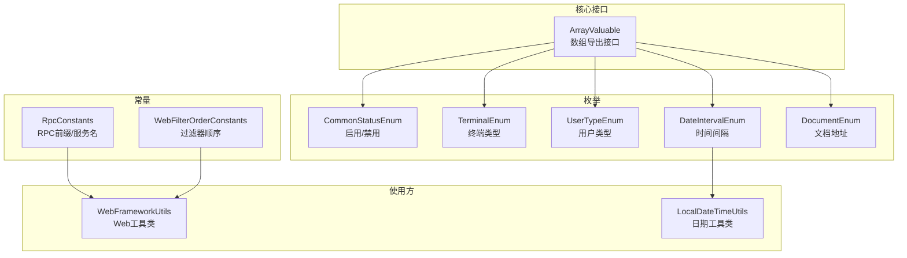
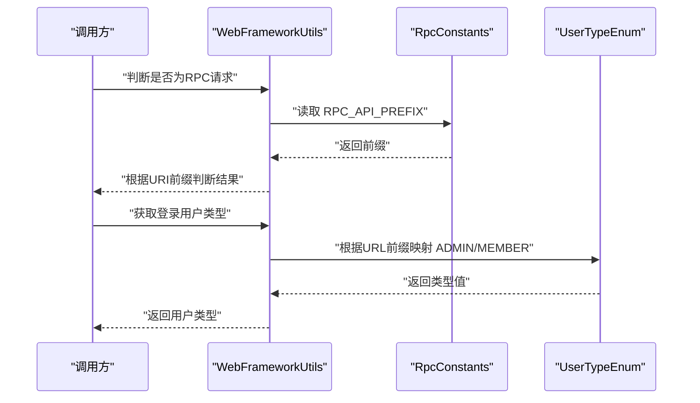
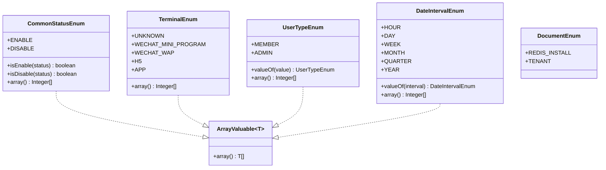
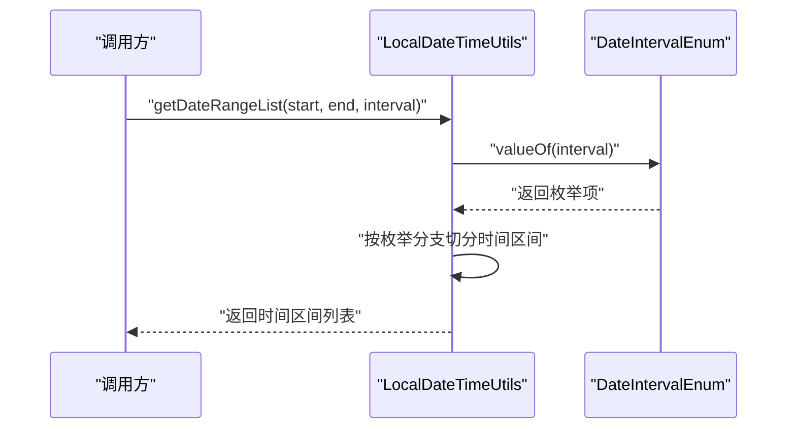
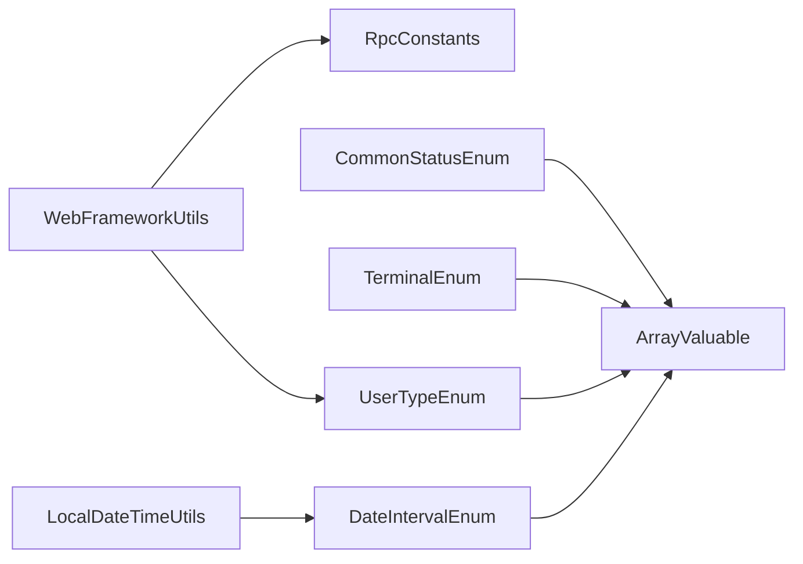

# 常量与枚举

<cite>
**本文引用的文件**
- [RpcConstants.java](file://pandora-framework/pandora-common/src/main/java/net/ittimeline/pandora/framework/common/constants/RpcConstants.java)
- [WebFilterOrderConstants.java](file://pandora-framework/pandora-common/src/main/java/net/ittimeline/pandora/framework/common/constants/WebFilterOrderConstants.java)
- [ArrayValuable.java](file://pandora-framework/pandora-common/src/main/java/net/ittimeline/pandora/framework/common/core/ArrayValuable.java)
- [CommonStatusEnum.java](file://pandora-framework/pandora-common/src/main/java/net/ittimeline/pandora/framework/common/enums/CommonStatusEnum.java)
- [TerminalEnum.java](file://pandora-framework/pandora-common/src/main/java/net/ittimeline/pandora/framework/common/enums/TerminalEnum.java)
- [UserTypeEnum.java](file://pandora-framework/pandora-common/src/main/java/net/ittimeline/pandora/framework/common/enums/UserTypeEnum.java)
- [DateIntervalEnum.java](file://pandora-framework/pandora-common/src/main/java/net/ittimeline/pandora/framework/common/enums/DateIntervalEnum.java)
- [DocumentEnum.java](file://pandora-framework/pandora-common/src/main/java/net/ittimeline/pandora/framework/common/enums/DocumentEnum.java)
- [WebFrameworkUtils.java](file://pandora-framework/pandora-spring-boot-starter-web/src/main/java/net/ittimeline/pandora/framework/web/core/util/WebFrameworkUtils.java)
- [LocalDateTimeUtils.java](file://pandora-framework/pandora-common/src/main/java/net/ittimeline/pandora/framework/common/util/foundational/date/LocalDateTimeUtils.java)
</cite>

## 目录
1. [简介](#简介)
2. [项目结构](#项目结构)
3. [核心组件](#核心组件)
4. [架构总览](#架构总览)
5. [详细组件分析](#详细组件分析)
6. [依赖分析](#依赖分析)
7. [性能考虑](#性能考虑)
8. [故障排查指南](#故障排查指南)
9. [结论](#结论)
10. [附录](#附录)

## 简介
本章节系统性梳理Pandora Cloud框架中的“常量与枚举”体系，重点覆盖以下内容：
- 常量类设计目的与使用场景：RpcConstants（RPC接口前缀与服务名）、WebFilterOrderConstants（Web过滤器执行顺序）。
- 枚举类型定义规则与业务含义：状态枚举、终端类型枚举、用户类型枚举、时间间隔枚举、文档地址枚举。
- 在框架中的作用：统一约定、避免魔法数、提升可维护性与可读性。
- 实际应用示例：配置读取、业务判断、状态管理、日志与安全链路控制。

## 项目结构
围绕常量与枚举的相关文件分布如下：
- constants：存放全局共享的常量接口，如RpcConstants、WebFilterOrderConstants。
- enums：存放全局共享的枚举类型，如CommonStatusEnum、TerminalEnum、UserTypeEnum、DateIntervalEnum、DocumentEnum。
- core：提供基础能力接口，如ArrayValuable，供枚举实现统一数组导出能力。
- web工具：WebFrameworkUtils在Web层使用常量与枚举进行请求识别、用户类型判定等。
- 日期工具：LocalDateTimeUtils在日期处理中使用DateIntervalEnum进行区间切分与格式化。

**图表来源**
- [RpcConstants.java:12-41](file://pandora-framework/pandora-common/src/main/java/net/ittimeline/pandora/framework/common/constants/RpcConstants.java#L12-L41)
- [WebFilterOrderConstants.java:11-37](file://pandora-framework/pandora-common/src/main/java/net/ittimeline/pandora/framework/common/constants/WebFilterOrderConstants.java#L11-L37)
- [ArrayValuable.java:10-15](file://pandora-framework/pandora-common/src/main/java/net/ittimeline/pandora/framework/common/core/ArrayValuable.java#L10-L15)
- [CommonStatusEnum.java:18-47](file://pandora-framework/pandora-common/src/main/java/net/ittimeline/pandora/framework/common/enums/CommonStatusEnum.java#L18-L47)
- [TerminalEnum.java:18-42](file://pandora-framework/pandora-common/src/main/java/net/ittimeline/pandora/framework/common/enums/TerminalEnum.java#L18-L42)
- [UserTypeEnum.java:18-47](file://pandora-framework/pandora-common/src/main/java/net/ittimeline/pandora/framework/common/enums/UserTypeEnum.java#L18-L47)
- [DateIntervalEnum.java:19-46](file://pandora-framework/pandora-common/src/main/java/net/ittimeline/pandora/framework/common/enums/DateIntervalEnum.java#L19-L46)
- [DocumentEnum.java:15-26](file://pandora-framework/pandora-common/src/main/java/net/ittimeline/pandora/framework/common/enums/DocumentEnum.java#L15-L26)
- [WebFrameworkUtils.java:159-179](file://pandora-framework/pandora-spring-boot-starter-web/src/main/java/net/ittimeline/pandora/framework/web/core/util/WebFrameworkUtils.java#L159-L179)
- [LocalDateTimeUtils.java:241-306](file://pandora-framework/pandora-common/src/main/java/net/ittimeline/pandora/framework/common/util/foundational/date/LocalDateTimeUtils.java#L241-L306)

**章节来源**
- [RpcConstants.java:1-42](file://pandora-framework/pandora-common/src/main/java/net/ittimeline/pandora/framework/common/constants/RpcConstants.java#L1-L42)
- [WebFilterOrderConstants.java:1-38](file://pandora-framework/pandora-common/src/main/java/net/ittimeline/pandora/framework/common/constants/WebFilterOrderConstants.java#L1-L38)
- [ArrayValuable.java:1-16](file://pandora-framework/pandora-common/src/main/java/net/ittimeline/pandora/framework/common/core/ArrayValuable.java#L1-L16)
- [CommonStatusEnum.java:1-48](file://pandora-framework/pandora-common/src/main/java/net/ittimeline/pandora/framework/common/enums/CommonStatusEnum.java#L1-L48)
- [TerminalEnum.java:1-43](file://pandora-framework/pandora-common/src/main/java/net/ittimeline/pandora/framework/common/enums/TerminalEnum.java#L1-L43)
- [UserTypeEnum.java:1-48](file://pandora-framework/pandora-common/src/main/java/net/ittimeline/pandora/framework/common/enums/UserTypeEnum.java#L1-L48)
- [DateIntervalEnum.java:1-47](file://pandora-framework/pandora-common/src/main/java/net/ittimeline/pandora/framework/common/enums/DateIntervalEnum.java#L1-L47)
- [DocumentEnum.java:1-27](file://pandora-framework/pandora-common/src/main/java/net/ittimeline/pandora/framework/common/enums/DocumentEnum.java#L1-L27)
- [WebFrameworkUtils.java:159-179](file://pandora-framework/pandora-spring-boot-starter-web/src/main/java/net/ittimeline/pandora/framework/web/core/util/WebFrameworkUtils.java#L159-L179)
- [LocalDateTimeUtils.java:241-306](file://pandora-framework/pandora-common/src/main/java/net/ittimeline/pandora/framework/common/util/foundational/date/LocalDateTimeUtils.java#L241-L306)

## 核心组件
- RpcConstants：集中定义RPC接口前缀与各子域服务名及前缀，便于跨模块统一识别与路由。
- WebFilterOrderConstants：集中定义Web过滤器的执行顺序，确保跨starter的一致性与可预期性。
- ArrayValuable：统一的数组导出接口，使枚举具备可枚举的整型数组能力，便于数据库校验与批量查询。
- 枚举族：
  - CommonStatusEnum：通用状态（启用/禁用），提供静态判断方法。
  - TerminalEnum：终端类型（未知、微信小程序、微信公众号、H5、App），用于识别访问终端。
  - UserTypeEnum：用户类型（会员、管理员），用于区分业务域与权限边界。
  - DateIntervalEnum：时间间隔（小时、天、周、月、季度、年），用于日期区间切分与格式化。
  - DocumentEnum：文档地址，用于对外展示指引链接。

**章节来源**
- [RpcConstants.java:12-41](file://pandora-framework/pandora-common/src/main/java/net/ittimeline/pandora/framework/common/constants/RpcConstants.java#L12-L41)
- [WebFilterOrderConstants.java:11-37](file://pandora-framework/pandora-common/src/main/java/net/ittimeline/pandora/framework/common/constants/WebFilterOrderConstants.java#L11-L37)
- [ArrayValuable.java:10-15](file://pandora-framework/pandora-common/src/main/java/net/ittimeline/pandora/framework/common/core/ArrayValuable.java#L10-L15)
- [CommonStatusEnum.java:18-47](file://pandora-framework/pandora-common/src/main/java/net/ittimeline/pandora/framework/common/enums/CommonStatusEnum.java#L18-L47)
- [TerminalEnum.java:18-42](file://pandora-framework/pandora-common/src/main/java/net/ittimeline/pandora/framework/common/enums/TerminalEnum.java#L18-L42)
- [UserTypeEnum.java:18-47](file://pandora-framework/pandora-common/src/main/java/net/ittimeline/pandora/framework/common/enums/UserTypeEnum.java#L18-L47)
- [DateIntervalEnum.java:19-46](file://pandora-framework/pandora-common/src/main/java/net/ittimeline/pandora/framework/common/enums/DateIntervalEnum.java#L19-L46)
- [DocumentEnum.java:15-26](file://pandora-framework/pandora-common/src/main/java/net/ittimeline/pandora/framework/common/enums/DocumentEnum.java#L15-L26)

## 架构总览
常量与枚举在框架中的作用：
- 统一约定：通过常量集中管理URL前缀、服务名等，避免分散配置带来的不一致。
- 明确边界：通过枚举约束状态、终端、用户类型、时间间隔等取值域，减少业务分支混乱。
- 可扩展性：ArrayValuable接口让新增枚举只需遵循统一规范即可被框架其他模块复用。

**图表来源**
- [WebFrameworkUtils.java:159-179](file://pandora-framework/pandora-spring-boot-starter-web/src/main/java/net/ittimeline/pandora/framework/web/core/util/WebFrameworkUtils.java#L159-L179)
- [RpcConstants.java:16-16](file://pandora-framework/pandora-common/src/main/java/net/ittimeline/pandora/framework/common/constants/RpcConstants.java#L16-L16)
- [UserTypeEnum.java:18-26](file://pandora-framework/pandora-common/src/main/java/net/ittimeline/pandora/framework/common/enums/UserTypeEnum.java#L18-L26)

## 详细组件分析

### 常量类：RpcConstants
- 设计目的
  - 统一RPC接口前缀与各子域服务名，便于跨模块识别与路由。
  - 通过常量集中管理，避免硬编码与多处散落的字符串。
- 关键字段
  - RPC_API_PREFIX：RPC接口统一前缀。
  - SYSTEM_NAME/INFRA_NAME：系统与基础设施服务的服务名。
  - SYSTEM_PREFIX/INFRA_PREFIX：对应服务的接口前缀。
- 使用场景
  - Web层通过前缀判断是否为RPC请求。
  - RPC拦截器或网关侧按前缀路由至对应服务。
- 最佳实践
  - 与spring.application.name保持一致，避免运行期路由错误。
  - 新增服务时同步更新前缀与常量，确保一致性。

**章节来源**
- [RpcConstants.java:12-41](file://pandora-framework/pandora-common/src/main/java/net/ittimeline/pandora/framework/common/constants/RpcConstants.java#L12-L41)
- [WebFrameworkUtils.java:159-179](file://pandora-framework/pandora-spring-boot-starter-web/src/main/java/net/ittimeline/pandora/framework/web/core/util/WebFrameworkUtils.java#L159-L179)

### 常量类：WebFilterOrderConstants
- 设计目的
  - 规范Web过滤器执行顺序，确保跨starter的一致性与可预期性。
- 关键点
  - 使用整型顺序值，明确各过滤器的先后关系。
  - 与Spring Security等默认过滤器顺序协同，避免冲突。
- 使用场景
  - 各starter在注册自定义过滤器时，参考该常量设置order，保证链路稳定。
- 最佳实践
  - 新增过滤器时，选择预留间隙或在现有常量之间插入，避免破坏既有顺序。

**章节来源**
- [WebFilterOrderConstants.java:11-37](file://pandora-framework/pandora-common/src/main/java/net/ittimeline/pandora/framework/common/constants/WebFilterOrderConstants.java#L11-L37)

### 枚举：CommonStatusEnum（通用状态）
- 定义规则
  - 枚举项：ENABLE/DISABLE。
  - 提供静态数组与ArrayValuable接口，便于批量校验与数据库存储。
- 业务含义
  - 通用开关状态，适用于多种资源的启用/禁用控制。
- 使用场景
  - 数据库字段校验、页面状态显示、业务逻辑判断。
- 最佳实践
  - 使用静态判断方法进行状态判断，避免直接比较原始值。

**章节来源**
- [CommonStatusEnum.java:18-47](file://pandora-framework/pandora-common/src/main/java/net/ittimeline/pandora/framework/common/enums/CommonStatusEnum.java#L18-L47)
- [ArrayValuable.java:10-15](file://pandora-framework/pandora-common/src/main/java/net/ittimeline/pandora/framework/common/core/ArrayValuable.java#L10-L15)

### 枚举：TerminalEnum（终端类型）
- 定义规则
  - 枚举项：UNKNOWN、WECHAT_MINI_PROGRAM、WECHAT_WAP、H5、APP。
  - 提供静态数组与ArrayValuable接口。
- 业务含义
  - 识别请求来自何种终端，用于差异化策略（如风控、推送、UI适配）。
- 使用场景
  - Web层从Header读取终端标识，结合业务做差异化处理。
- 最佳实践
  - 未识别时使用UNKNOWN兜底，确保系统健壮性。

**章节来源**
- [TerminalEnum.java:18-42](file://pandora-framework/pandora-common/src/main/java/net/ittimeline/pandora/framework/common/enums/TerminalEnum.java#L18-L42)
- [ArrayValuable.java:10-15](file://pandora-framework/pandora-common/src/main/java/net/ittimeline/pandora/framework/common/core/ArrayValuable.java#L10-L15)
- [WebFrameworkUtils.java:36-36](file://pandora-framework/pandora-spring-boot-starter-web/src/main/java/net/ittimeline/pandora/framework/web/core/util/WebFrameworkUtils.java#L36-L36)

### 枚举：UserTypeEnum（用户类型）
- 定义规则
  - 枚举项：MEMBER（会员）、ADMIN（管理员）。
  - 提供静态数组与valueOf方法，支持按值查找。
- 业务含义
  - 区分前端用户与后台管理用户，用于权限与业务域划分。
- 使用场景
  - Web层根据URL前缀推断用户类型，或从上下文中提取。
- 最佳实践
  - 优先从上下文获取，其次基于URL前缀推断，最后兜底为空。

**章节来源**
- [UserTypeEnum.java:18-47](file://pandora-framework/pandora-common/src/main/java/net/ittimeline/pandora/framework/common/enums/UserTypeEnum.java#L18-L47)
- [ArrayValuable.java:10-15](file://pandora-framework/pandora-common/src/main/java/net/ittimeline/pandora/framework/common/core/ArrayValuable.java#L10-L15)
- [WebFrameworkUtils.java:113-118](file://pandora-framework/pandora-spring-boot-starter-web/src/main/java/net/ittimeline/pandora/framework/web/core/util/WebFrameworkUtils.java#L113-L118)

### 枚举：DateIntervalEnum（时间间隔）
- 定义规则
  - 枚举项：HOUR、DAY、WEEK、MONTH、QUARTER、YEAR。
  - 提供静态数组与valueOf方法，支持按值查找。
- 业务含义
  - 用于报表统计、时间窗口切分、格式化展示。
- 使用场景
  - 日期工具类按枚举切分时间范围或格式化输出。
- 最佳实践
  - 输入校验：找不到对应枚举时抛出异常，避免非法区间。

**章节来源**
- [DateIntervalEnum.java:19-46](file://pandora-framework/pandora-common/src/main/java/net/ittimeline/pandora/framework/common/enums/DateIntervalEnum.java#L19-L46)
- [ArrayValuable.java:10-15](file://pandora-framework/pandora-common/src/main/java/net/ittimeline/pandora/framework/common/core/ArrayValuable.java#L10-L15)
- [LocalDateTimeUtils.java:241-306](file://pandora-framework/pandora-common/src/main/java/net/ittimeline/pandora/framework/common/util/foundational/date/LocalDateTimeUtils.java#L241-L306)

### 枚举：DocumentEnum（文档地址）
- 定义规则
  - 枚举项：Redis安装文档、SaaS多租户文档。
  - 字段包含URL与备注。
- 业务含义
  - 为外部用户提供快速跳转指引。
- 使用场景
  - 控制台或API响应中返回文档链接，辅助用户自助排障。
- 最佳实践
  - 文档URL应保持可访问性与稳定性。

**章节来源**
- [DocumentEnum.java:15-26](file://pandora-framework/pandora-common/src/main/java/net/ittimeline/pandora/framework/common/enums/DocumentEnum.java#L15-L26)

### 类图：枚举与ArrayValuable的关系

**图表来源**
- [ArrayValuable.java:10-15](file://pandora-framework/pandora-common/src/main/java/net/ittimeline/pandora/framework/common/core/ArrayValuable.java#L10-L15)
- [CommonStatusEnum.java:18-47](file://pandora-framework/pandora-common/src/main/java/net/ittimeline/pandora/framework/common/enums/CommonStatusEnum.java#L18-L47)
- [TerminalEnum.java:18-42](file://pandora-framework/pandora-common/src/main/java/net/ittimeline/pandora/framework/common/enums/TerminalEnum.java#L18-L42)
- [UserTypeEnum.java:18-47](file://pandora-framework/pandora-common/src/main/java/net/ittimeline/pandora/framework/common/enums/UserTypeEnum.java#L18-L47)
- [DateIntervalEnum.java:19-46](file://pandora-framework/pandora-common/src/main/java/net/ittimeline/pandora/framework/common/enums/DateIntervalEnum.java#L19-L46)
- [DocumentEnum.java:15-26](file://pandora-framework/pandora-common/src/main/java/net/ittimeline/pandora/framework/common/enums/DocumentEnum.java#L15-L26)

### 序列图：日期区间切分流程

**图表来源**
- [LocalDateTimeUtils.java:241-306](file://pandora-framework/pandora-common/src/main/java/net/ittimeline/pandora/framework/common/util/foundational/date/LocalDateTimeUtils.java#L241-L306)
- [DateIntervalEnum.java:43-45](file://pandora-framework/pandora-common/src/main/java/net/ittimeline/pandora/framework/common/enums/DateIntervalEnum.java#L43-L45)

## 依赖分析
- 常量与枚举的耦合度低，主要通过工具类间接使用。
- WebFrameworkUtils依赖RpcConstants与UserTypeEnum进行请求识别与用户类型判定。
- LocalDateTimeUtils依赖DateIntervalEnum进行时间区间处理。
- ArrayValuable作为统一接口，被多个枚举实现，形成稳定的扩展点。

**图表来源**
- [WebFrameworkUtils.java:159-179](file://pandora-framework/pandora-spring-boot-starter-web/src/main/java/net/ittimeline/pandora/framework/web/core/util/WebFrameworkUtils.java#L159-L179)
- [LocalDateTimeUtils.java:241-306](file://pandora-framework/pandora-common/src/main/java/net/ittimeline/pandora/framework/common/util/foundational/date/LocalDateTimeUtils.java#L241-L306)
- [ArrayValuable.java:10-15](file://pandora-framework/pandora-common/src/main/java/net/ittimeline/pandora/framework/common/core/ArrayValuable.java#L10-L15)

**章节来源**
- [WebFrameworkUtils.java:159-179](file://pandora-framework/pandora-spring-boot-starter-web/src/main/java/net/ittimeline/pandora/framework/web/core/util/WebFrameworkUtils.java#L159-L179)
- [LocalDateTimeUtils.java:241-306](file://pandora-framework/pandora-common/src/main/java/net/ittimeline/pandora/framework/common/util/foundational/date/LocalDateTimeUtils.java#L241-L306)
- [ArrayValuable.java:10-15](file://pandora-framework/pandora-common/src/main/java/net/ittimeline/pandora/framework/common/core/ArrayValuable.java#L10-L15)

## 性能考虑
- 枚举数组导出：通过静态数组缓存避免重复计算，提升批量校验效率。
- 值查找：valueOf方法基于线性匹配，建议在高频路径上缓存结果或使用switch-case替代。
- 字符串前缀判断：RPC前缀判断为O(n)（n为前缀长度），通常可忽略；若存在大量请求，可考虑预编译正则或路径映射表。

## 故障排查指南
- RPC请求误判
  - 现象：非RPC接口被识别为RPC。
  - 排查：确认请求URI是否以RpcConstants.RPC_API_PREFIX开头。
  - 参考路径：[WebFrameworkUtils.java:159-167](file://pandora-framework/pandora-spring-boot-starter-web/src/main/java/net/ittimeline/pandora/framework/web/core/util/WebFrameworkUtils.java#L159-L167)
- 用户类型推断异常
  - 现象：用户类型为空或错误。
  - 排查：检查URL前缀配置与UserTypeEnum映射关系。
  - 参考路径：[WebFrameworkUtils.java:113-118](file://pandora-framework/pandora-spring-boot-starter-web/src/main/java/net/ittimeline/pandora/framework/web/core/util/WebFrameworkUtils.java#L113-L118)
- 时间区间切分异常
  - 现象：找不到对应的时间间隔枚举。
  - 排查：确认传入的interval值是否在DateIntervalEnum范围内。
  - 参考路径：[LocalDateTimeUtils.java:244-246](file://pandora-framework/pandora-common/src/main/java/net/ittimeline/pandora/framework/common/util/foundational/date/LocalDateTimeUtils.java#L244-L246)
- 终端类型缺失
  - 现象：终端识别为未知。
  - 排查：确认Header中terminal值是否正确传递。
  - 参考路径：[WebFrameworkUtils.java:36-36](file://pandora-framework/pandora-spring-boot-starter-web/src/main/java/net/ittimeline/pandora/framework/web/core/util/WebFrameworkUtils.java#L36-L36)

**章节来源**
- [WebFrameworkUtils.java:159-179](file://pandora-framework/pandora-spring-boot-starter-web/src/main/java/net/ittimeline/pandora/framework/web/core/util/WebFrameworkUtils.java#L159-L179)
- [LocalDateTimeUtils.java:241-306](file://pandora-framework/pandora-common/src/main/java/net/ittimeline/pandora/framework/common/util/foundational/date/LocalDateTimeUtils.java#L241-L306)

## 结论
- 常量与枚举通过统一的命名与组织方式，显著提升了框架的可维护性与一致性。
- RpcConstants与WebFilterOrderConstants为跨模块协作提供了稳定契约。
- 枚举体系借助ArrayValuable实现了强约束与高扩展性，配合工具类在Web与日期处理场景中发挥关键作用。
- 建议在新增枚举时严格遵循现有规范，并在高频路径上关注性能优化与缓存策略。

## 附录
- 常量与枚举的典型使用清单
  - 配置读取：RpcConstants.RPC_API_PREFIX、WebFilterOrderConstants.*。
  - 业务判断：CommonStatusEnum.isEnable/isDisable、UserTypeEnum.valueOf。
  - 状态管理：TerminalEnum、DateIntervalEnum在Web与日期工具中的应用。
- 示例路径（不展示具体代码，仅提供定位）
  - [WebFrameworkUtils.isRpcRequest:159-179](file://pandora-framework/pandora-spring-boot-starter-web/src/main/java/net/ittimeline/pandora/framework/web/core/util/WebFrameworkUtils.java#L159-L179)
  - [WebFrameworkUtils.getLoginUserType:113-118](file://pandora-framework/pandora-spring-boot-starter-web/src/main/java/net/ittimeline/pandora/framework/web/core/util/WebFrameworkUtils.java#L113-L118)
  - [LocalDateTimeUtils.getDateRangeList:241-306](file://pandora-framework/pandora-common/src/main/java/net/ittimeline/pandora/framework/common/util/foundational/date/LocalDateTimeUtils.java#L241-L306)