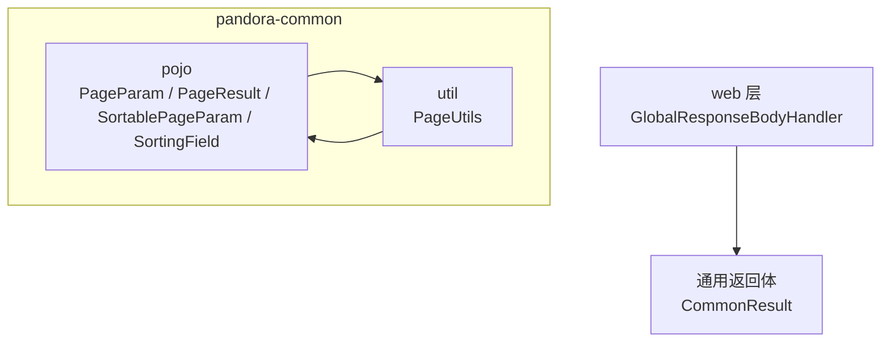
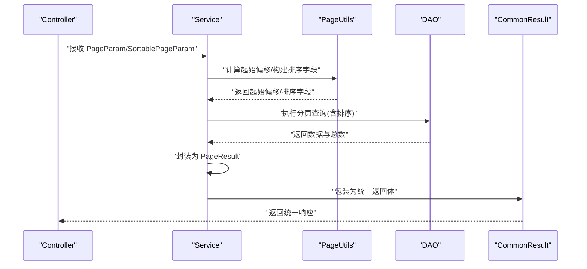
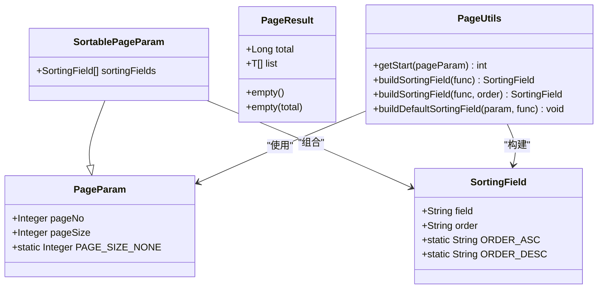
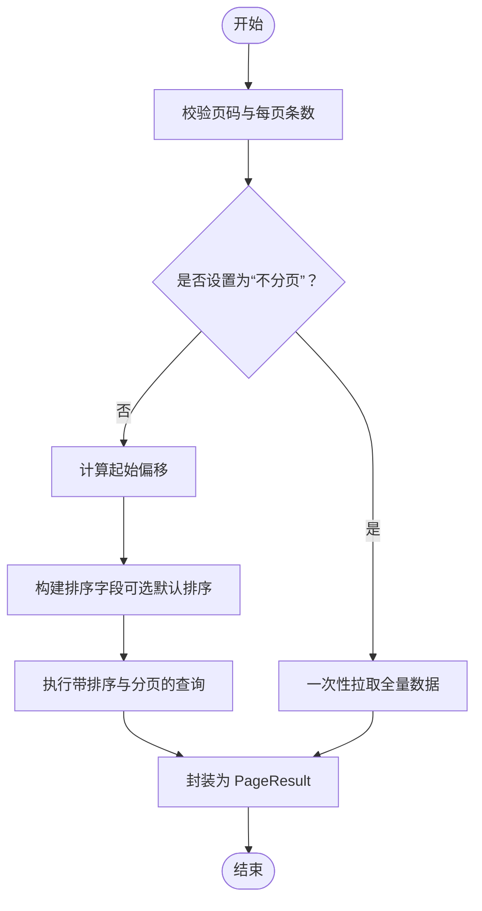

# 数据模型

<cite>
**本文引用的文件**
- [PageParam.java](file://pandora-framework/pandora-common/src/main/java/net/ittimeline/pandora/framework/common/pojo/PageParam.java)
- [PageResult.java](file://pandora-framework/pandora-common/src/main/java/net/ittimeline/pandora/framework/common/pojo/PageResult.java)
- [SortablePageParam.java](file://pandora-framework/pandora-common/src/main/java/net/ittimeline/pandora/framework/common/pojo/SortablePageParam.java)
- [SortingField.java](file://pandora-framework/pandora-common/src/main/java/net/ittimeline/pandora/framework/common/pojo/SortingField.java)
- [PageUtils.java](file://pandora-framework/pandora-common/src/main/java/net/ittimeline/pandora/framework/common/util/foundational/object/PageUtils.java)
- [CommonResult.java](file://pandora-framework/pandora-common/src/main/java/net/ittimeline/pandora/framework/common/pojo/CommonResult.java)
- [GlobalResponseBodyHandler.java](file://pandora-framework/pandora-spring-boot-starter-web/src/main/java/net/ittimeline/pandora/framework/web/core/handler/GlobalResponseBodyHandler.java)
- [pandora-common README.md](file://pandora-framework/pandora-common/README.md)
</cite>

## 目录
1. [简介](#简介)
2. [项目结构](#项目结构)
3. [核心组件](#核心组件)
4. [架构总览](#架构总览)
5. [详细组件分析](#详细组件分析)
6. [依赖关系分析](#依赖关系分析)
7. [性能考量](#性能考量)
8. [故障排查指南](#故障排查指南)
9. [结论](#结论)
10. [附录](#附录)

## 简介
本文件围绕分页与排序相关的数据模型与工具进行系统化说明，重点覆盖以下内容：
- 数据模型设计思路与职责边界：PageParam、PageResult、SortablePageParam、SortingField
- 分页查询实现原理：参数传递、结果封装、排序机制
- 在 Controller、Service、DAO 层的使用范式与最佳实践
- 性能优化、数据安全与用户体验建议

## 项目结构
分页与排序相关的核心代码位于 pandora-common 模块的 pojo 与 util 包中，同时配合通用返回体与 Web 层响应包装，形成完整的分页查询闭环。

图表来源
- [PageParam.java:1-42](file://pandora-framework/pandora-common/src/main/java/net/ittimeline/pandora/framework/common/pojo/PageParam.java#L1-L42)
- [PageResult.java:1-49](file://pandora-framework/pandora-common/src/main/java/net/ittimeline/pandora/framework/common/pojo/PageResult.java#L1-L49)
- [SortablePageParam.java:1-26](file://pandora-framework/pandora-common/src/main/java/net/ittimeline/pandora/framework/common/pojo/SortablePageParam.java#L1-L26)
- [SortingField.java:1-39](file://pandora-framework/pandora-common/src/main/java/net/ittimeline/pandora/framework/common/pojo/SortingField.java#L1-L39)
- [PageUtils.java:1-70](file://pandora-framework/pandora-common/src/main/java/net/ittimeline/pandora/framework/common/util/foundational/object/PageUtils.java#L1-L70)
- [GlobalResponseBodyHandler.java:1-25](file://pandora-framework/pandora-spring-boot-starter-web/src/main/java/net/ittimeline/pandora/framework/web/core/handler/GlobalResponseBodyHandler.java#L1-L25)
- [CommonResult.java:1-52](file://pandora-framework/pandora-common/src/main/java/net/ittimeline/pandora/framework/common/pojo/CommonResult.java#L1-L52)

章节来源
- [pandora-common README.md:1-12](file://pandora-framework/pandora-common/README.md#L1-L12)

## 核心组件
- PageParam：定义分页请求的基本参数（页码、每页条数），并提供“不分页”标记常量，用于导出等场景。
- PageResult：封装分页结果（总量与数据列表），提供空结果便捷构造。
- SortablePageParam：在 PageParam 基础上扩展排序字段集合，支持多字段排序。
- SortingField：描述单个排序维度（字段名与方向），提供升序/降序常量。
- PageUtils：提供分页起始偏移计算、排序字段构建与默认排序字段填充等工具方法。

章节来源
- [PageParam.java:1-42](file://pandora-framework/pandora-common/src/main/java/net/ittimeline/pandora/framework/common/pojo/PageParam.java#L1-L42)
- [PageResult.java:1-49](file://pandora-framework/pandora-common/src/main/java/net/ittimeline/pandora/framework/common/pojo/PageResult.java#L1-L49)
- [SortablePageParam.java:1-26](file://pandora-framework/pandora-common/src/main/java/net/ittimeline/pandora/framework/common/pojo/SortablePageParam.java#L1-L26)
- [SortingField.java:1-39](file://pandora-framework/pandora-common/src/main/java/net/ittimeline/pandora/framework/common/pojo/SortingField.java#L1-L39)
- [PageUtils.java:1-70](file://pandora-framework/pandora-common/src/main/java/net/ittimeline/pandora/framework/common/util/foundational/object/PageUtils.java#L1-L70)

## 架构总览
分页查询在框架内的典型流转如下：
- Controller 接收 PageParam/SortablePageParam 请求参数
- Service 层使用 PageUtils 计算分页起始位置与构建排序字段
- DAO 层执行带 LIMIT/OFFSET 与 ORDER BY 的查询
- Service 将数据与总数封装为 PageResult
- Web 层通过 GlobalResponseBodyHandler 记录响应，最终由 CommonResult 统一封装输出

图表来源
- [PageParam.java:1-42](file://pandora-framework/pandora-common/src/main/java/net/ittimeline/pandora/framework/common/pojo/PageParam.java#L1-L42)
- [SortablePageParam.java:1-26](file://pandora-framework/pandora-common/src/main/java/net/ittimeline/pandora/framework/common/pojo/SortablePageParam.java#L1-L26)
- [SortingField.java:1-39](file://pandora-framework/pandora-common/src/main/java/net/ittimeline/pandora/framework/common/pojo/SortingField.java#L1-L39)
- [PageUtils.java:1-70](file://pandora-framework/pandora-common/src/main/java/net/ittimeline/pandora/framework/common/util/foundational/object/PageUtils.java#L1-L70)
- [CommonResult.java:1-52](file://pandora-framework/pandora-common/src/main/java/net/ittimeline/pandora/framework/common/pojo/CommonResult.java#L1-L52)
- [GlobalResponseBodyHandler.java:1-25](file://pandora-framework/pandora-spring-boot-starter-web/src/main/java/net/ittimeline/pandora/framework/web/core/handler/GlobalResponseBodyHandler.java#L1-L25)

## 详细组件分析

### PageParam：分页请求参数
- 设计要点
  - 默认页码与默认每页条数，保证首次请求即有合理行为
  - 提供“不分页”标记常量，便于导出等一次性拉取全量数据的场景
  - 参数校验注解确保页码从 1 开始且每页条数上限为 200
- 使用建议
  - 对外接口建议显式传入页码与每页条数；若需导出，显式设置为“不分页”
  - 避免在业务层硬编码页大小，优先通过参数控制

章节来源
- [PageParam.java:1-42](file://pandora-framework/pandora-common/src/main/java/net/ittimeline/pandora/framework/common/pojo/PageParam.java#L1-L42)

### PageResult：分页结果封装
- 设计要点
  - 泛型封装数据列表与总量，便于强类型返回
  - 提供空结果构造方法，简化无数据场景
- 使用建议
  - Service 层在查询完成后直接构造 PageResult，避免额外封装
  - 与 CommonResult 结合，统一对外输出格式

章节来源
- [PageResult.java:1-49](file://pandora-framework/pandora-common/src/main/java/net/ittimeline/pandora/framework/common/pojo/PageResult.java#L1-L49)

### SortablePageParam：可排序分页参数
- 设计要点
  - 继承 PageParam，复用基础分页能力
  - 扩展排序字段集合，支持多字段排序
- 使用建议
  - 当前端需要多列排序时，使用该模型承载排序字段
  - 若排序字段为空，可通过工具方法填充默认排序

章节来源
- [SortablePageParam.java:1-26](file://pandora-framework/pandora-common/src/main/java/net/ittimeline/pandora/framework/common/pojo/SortablePageParam.java#L1-L26)

### SortingField：排序字段描述
- 设计要点
  - 字段名与排序方向组成一个排序维度
  - 提供升序/降序常量，保证排序方向的规范性
- 使用建议
  - 与 PageUtils 配合，通过 Lambda 表达式安全地提取字段名
  - 排序方向仅允许预设值，避免非法输入

章节来源
- [SortingField.java:1-39](file://pandora-framework/pandora-common/src/main/java/net/ittimeline/pandora/framework/common/pojo/SortingField.java#L1-L39)

### PageUtils：分页与排序工具
- 核心能力
  - 计算分页起始偏移：基于页码与每页条数
  - 构建排序字段：支持默认降序与指定方向
  - 填充默认排序：当排序字段为空时，自动设置默认排序
- 使用建议
  - 在 Service 层统一调用工具方法，避免重复计算
  - 通过 Lambda 表达式生成字段名，降低字符串拼写风险

章节来源
- [PageUtils.java:1-70](file://pandora-framework/pandora-common/src/main/java/net/ittimeline/pandora/framework/common/util/foundational/object/PageUtils.java#L1-L70)

### 与通用返回体与 Web 层的协作
- 通用返回体：统一承载 code、msg、data，便于前端一致处理
- Web 层响应包装：记录 Controller 返回结果，便于日志与审计

章节来源
- [CommonResult.java:1-52](file://pandora-framework/pandora-common/src/main/java/net/ittimeline/pandora/framework/common/pojo/CommonResult.java#L1-L52)
- [GlobalResponseBodyHandler.java:1-25](file://pandora-framework/pandora-spring-boot-starter-web/src/main/java/net/ittimeline/pandora/framework/web/core/handler/GlobalResponseBodyHandler.java#L1-L25)

## 依赖关系分析

图表来源
- [PageParam.java:1-42](file://pandora-framework/pandora-common/src/main/java/net/ittimeline/pandora/framework/common/pojo/PageParam.java#L1-L42)
- [SortablePageParam.java:1-26](file://pandora-framework/pandora-common/src/main/java/net/ittimeline/pandora/framework/common/pojo/SortablePageParam.java#L1-L26)
- [SortingField.java:1-39](file://pandora-framework/pandora-common/src/main/java/net/ittimeline/pandora/framework/common/pojo/SortingField.java#L1-L39)
- [PageResult.java:1-49](file://pandora-framework/pandora-common/src/main/java/net/ittimeline/pandora/framework/common/pojo/PageResult.java#L1-L49)
- [PageUtils.java:1-70](file://pandora-framework/pandora-common/src/main/java/net/ittimeline/pandora/framework/common/util/foundational/object/PageUtils.java#L1-L70)

## 性能考量
- 分页起始偏移计算
  - 使用 PageUtils 的起始偏移计算，避免重复逻辑与潜在溢出
- 排序字段构建
  - 通过 Lambda 表达式生成字段名，减少字符串拼写与 SQL 注入风险
- 不分页导出
  - 使用“不分页”标记常量，避免一次性拉取全量数据导致内存压力
- 结果封装
  - PageResult 提供空结果构造，减少空数据场景的分支判断

章节来源
- [PageUtils.java:1-70](file://pandora-framework/pandora-common/src/main/java/net/ittimeline/pandora/framework/common/util/foundational/object/PageUtils.java#L1-L70)
- [PageParam.java:1-42](file://pandora-framework/pandora-common/src/main/java/net/ittimeline/pandora/framework/common/pojo/PageParam.java#L1-L42)
- [PageResult.java:1-49](file://pandora-framework/pandora-common/src/main/java/net/ittimeline/pandora/framework/common/pojo/PageResult.java#L1-L49)

## 故障排查指南
- 参数校验失败
  - 页码小于 1 或每页条数超过上限会触发校验异常，检查前端传参或默认值设置
- 排序方向非法
  - 排序方向仅允许升序/降序常量，非法值会被断言拦截
- 导出数据过大
  - 使用“不分页”标记时需评估内存与网络开销，必要时采用流式导出或分批处理
- 响应格式不一致
  - 确保 Controller 返回值被统一包装为通用返回体，避免绕过 Web 层包装

章节来源
- [PageParam.java:1-42](file://pandora-framework/pandora-common/src/main/java/net/ittimeline/pandora/framework/common/pojo/PageParam.java#L1-L42)
- [SortingField.java:1-39](file://pandora-framework/pandora-common/src/main/java/net/ittimeline/pandora/framework/common/pojo/SortingField.java#L1-L39)
- [GlobalResponseBodyHandler.java:1-25](file://pandora-framework/pandora-spring-boot-starter-web/src/main/java/net/ittimeline/pandora/framework/web/core/handler/GlobalResponseBodyHandler.java#L1-L25)
- [CommonResult.java:1-52](file://pandora-framework/pandora-common/src/main/java/net/ittimeline/pandora/framework/common/pojo/CommonResult.java#L1-L52)

## 结论
本套分页与排序数据模型以简洁、可复用为核心目标，结合工具类与通用返回体，形成了从参数接收、排序构建、查询执行到结果封装的完整链路。遵循本文的最佳实践，可在保证安全性与可维护性的前提下，显著提升分页查询的性能与用户体验。

## 附录

### 分页查询流程图（算法实现）

图表来源
- [PageParam.java:1-42](file://pandora-framework/pandora-common/src/main/java/net/ittimeline/pandora/framework/common/pojo/PageParam.java#L1-L42)
- [PageUtils.java:1-70](file://pandora-framework/pandora-common/src/main/java/net/ittimeline/pandora/framework/common/util/foundational/object/PageUtils.java#L1-L70)
- [PageResult.java:1-49](file://pandora-framework/pandora-common/src/main/java/net/ittimeline/pandora/framework/common/pojo/PageResult.java#L1-L49)