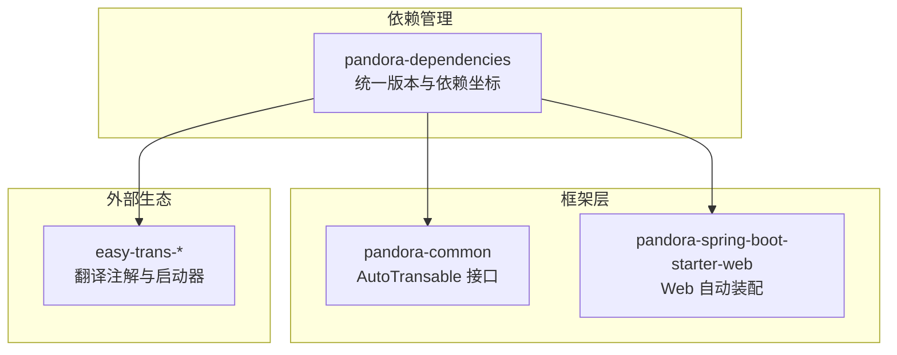
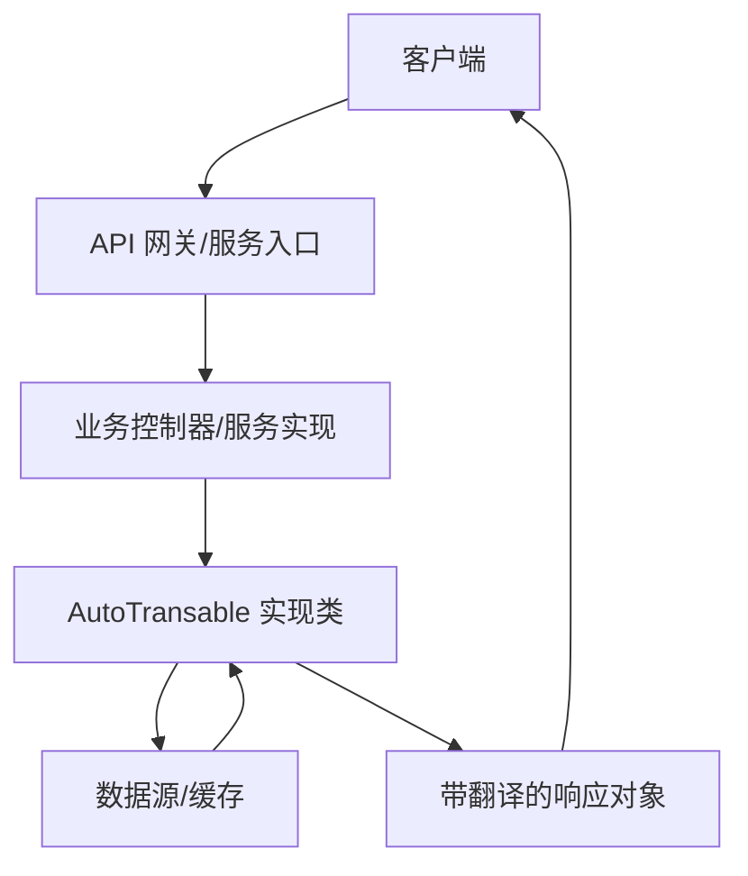
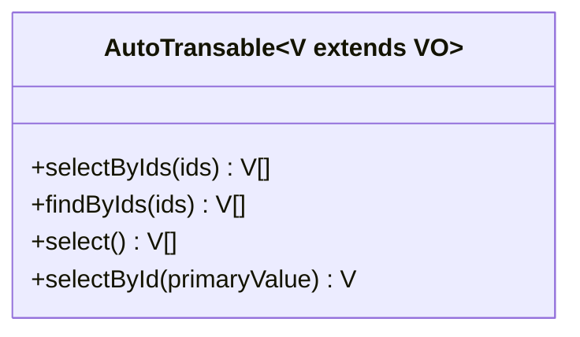
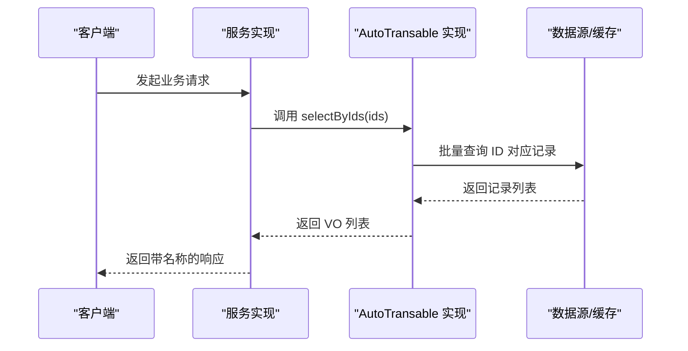
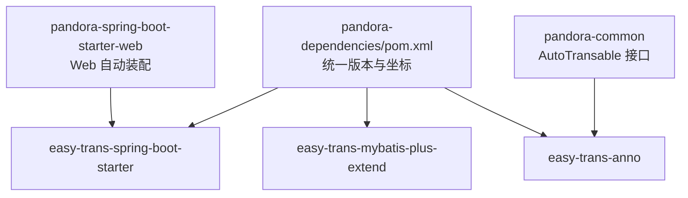

# 数据翻译服务

<cite>
**本文引用的文件**
- [AutoTransable.java](file://pandora-framework/pandora-common/src/main/java/com/fhs/trans/service/AutoTransable.java)
- [pandora-common/pom.xml](file://pandora-framework/pandora-common/pom.xml)
- [pandora-dependencies/pom.xml](file://pandora-dependencies/pom.xml)
- [PandoraWebAutoConfiguration.java](file://pandora-framework/pandora-spring-boot-starter-web/src/main/java/net/ittimeline/pandora/framework/web/config/PandoraWebAutoConfiguration.java)
- [README.md](file://README.md)
</cite>

## 目录
1. [简介](#简介)
2. [项目结构](#项目结构)
3. [核心组件](#核心组件)
4. [架构总览](#架构总览)
5. [详细组件分析](#详细组件分析)
6. [依赖分析](#依赖分析)
7. [性能考虑](#性能考虑)
8. [故障排查指南](#故障排查指南)
9. [结论](#结论)
10. [附录](#附录)

## 简介
本文件围绕“数据翻译服务”展开，重点阐述 AutoTransable 接口的设计理念、方法语义与在微服务架构中的价值。AutoTransable 是一个用于“自动翻译”的通用能力抽象，目标是将业务对象中的 ID 字段透明地转换为可读的名称字段，从而提升接口返回结果的可读性与用户体验。该接口通过一组默认方法与一个强制实现方法，形成清晰的扩展点，既保证了向后兼容，又允许下游按需覆盖关键逻辑。

## 项目结构
从仓库结构看，数据翻译能力由框架层提供，核心接口位于 pandora-common 模块；同时，项目通过依赖管理统一引入翻译生态（如 easy-trans-* 组件），并结合 Web 自动装配确保在微服务环境中正确初始化。

图示来源
- [pandora-dependencies/pom.xml:239-262](file://pandora-dependencies/pom.xml#L239-L262)
- [pandora-common/pom.xml:93-96](file://pandora-framework/pandora-common/pom.xml#L93-L96)
- [PandoraWebAutoConfiguration.java:43-45](file://pandora-framework/pandora-spring-boot-starter-web/src/main/java/net/ittimeline/pandora/framework/web/config/PandoraWebAutoConfiguration.java#L43-L45)

章节来源
- [README.md:1-15](file://README.md#L1-L15)
- [pandora-dependencies/pom.xml:239-262](file://pandora-dependencies/pom.xml#L239-L262)
- [pandora-common/pom.xml:93-96](file://pandora-framework/pandora-common/pom.xml#L93-L96)

## 核心组件
- AutoTransable 接口：定义“自动翻译”的最小能力集，包含以下方法族：
  - selectByIds(ids)：根据主键集合批量查询，返回对应 VO 列表
  - findByIds(ids)：历史方法，已标注过时，建议使用 selectByIds
  - select()：获取全量数据（默认空列表）
  - selectById(primaryValue)：按主键单条查询，必须由实现类提供具体逻辑
- VO 泛型约束：接口泛型 V 必须是 VO 类型，确保翻译结果具备统一的数据载体形态

设计要点
- 默认方法提供向后兼容与零成本扩展：未覆盖的方法会回退到默认行为，便于快速接入
- 强制方法 selectById 提供实现边界：所有实现类必须给出主键查询的落地实现
- 方法命名与职责清晰：批量查询与单条查询分离，避免混淆

章节来源
- [AutoTransable.java:18-60](file://pandora-framework/pandora-common/src/main/java/com/fhs/trans/service/AutoTransable.java#L18-L60)

## 架构总览
AutoTransable 在微服务中的作用可以概括为：在数据出参阶段，将业务对象中的 ID 字段替换为其对应的名称，从而降低客户端对字典/码表的重复请求，提升整体交互效率。结合项目中的 Web 自动装配与翻译生态依赖，可在服务启动时完成必要的初始化与扫描，使翻译能力在运行期自然生效。

图示来源
- [PandoraWebAutoConfiguration.java:43-45](file://pandora-framework/pandora-spring-boot-starter-web/src/main/java/net/ittimeline/pandora/framework/web/config/PandoraWebAutoConfiguration.java#L43-L45)
- [pandora-dependencies/pom.xml:239-262](file://pandora-dependencies/pom.xml#L239-L262)

## 详细组件分析

### AutoTransable 接口方法详解
- selectByIds(ids)
  - 功能：根据主键集合批量查询，返回 VO 列表
  - 使用场景：当业务对象包含多个 ID 字段需要一次性翻译时，优先调用此方法，减少多次往返
  - 默认实现：委托给 findByIds，若未覆盖则返回空列表
- findByIds(ids)
  - 功能：历史方法，已标注过时
  - 使用场景：兼容旧版本；新项目请使用 selectByIds
- select()
  - 功能：获取全量数据，用于兜底或缓存预热
  - 使用场景：首次加载或缓存失效时，批量拉取以支撑后续翻译
- selectById(primaryValue)
  - 功能：按主键单条查询，必须由实现类提供
  - 使用场景：针对单个 ID 的即时翻译，适用于高并发下的细粒度查询

图示来源
- [AutoTransable.java:18-60](file://pandora-framework/pandora-common/src/main/java/com/fhs/trans/service/AutoTransable.java#L18-L60)

章节来源
- [AutoTransable.java:18-60](file://pandora-framework/pandora-common/src/main/java/com/fhs/trans/service/AutoTransable.java#L18-L60)

### 数据翻译机制工作流程
数据翻译的核心在于“ID → 名称”的映射与替换。典型流程如下：

图示来源
- [AutoTransable.java:39-41](file://pandora-framework/pandora-common/src/main/java/com/fhs/trans/service/AutoTransable.java#L39-L41)
- [AutoTransable.java:48-50](file://pandora-framework/pandora-common/src/main/java/com/fhs/trans/service/AutoTransable.java#L48-L50)

### 典型实现与使用场景
- 实现方式
  - 在业务服务中实现 AutoTransable<V>，至少提供 selectById 的具体实现
  - 若存在批量翻译需求，建议重写 selectByIds 以优化性能
  - 对于全量字典/码表，可配合 select() 进行缓存预热
- 使用场景
  - 用户信息展示：将用户 ID 翻译为用户名
  - 角色/权限展示：将角色 ID 翻译为角色名
  - 状态码展示：将状态码翻译为状态描述
  - 地区/部门展示：将区域/部门 ID 翻译为名称

章节来源
- [AutoTransable.java:18-60](file://pandora-framework/pandora-common/src/main/java/com/fhs/trans/service/AutoTransable.java#L18-L60)

## 依赖分析
AutoTransable 所在的框架层通过依赖管理统一引入翻译生态组件，确保在不同模块中一致启用翻译能力。

图示来源
- [pandora-dependencies/pom.xml:239-262](file://pandora-dependencies/pom.xml#L239-L262)
- [pandora-common/pom.xml:93-96](file://pandora-framework/pandora-common/pom.xml#L93-L96)

章节来源
- [pandora-dependencies/pom.xml:239-262](file://pandora-dependencies/pom.xml#L239-L262)
- [pandora-common/pom.xml:93-96](file://pandora-framework/pandora-common/pom.xml#L93-L96)

## 性能考虑
- 批量查询优先：尽量使用 selectByIds 批量查询，减少数据库往返次数
- 缓存策略：结合 select() 进行全量数据缓存，热点数据可放入本地/分布式缓存
- 合理分页：当数据量较大时，采用分批翻译策略，避免一次性加载过多数据
- 并发控制：在高并发场景下，注意对翻译缓存的读写一致性与锁竞争

## 故障排查指南
- 现象：翻译结果为空
  - 排查点：确认实现类是否覆盖 selectByIds/selectById；检查输入 ID 是否有效
- 现象：性能抖动
  - 排查点：是否存在大量小批量请求；是否缺少缓存预热；是否遗漏批量翻译
- 现象：启动失败或翻译不生效
  - 排查点：确认依赖注入与自动装配是否正确；检查翻译生态依赖是否引入成功

## 结论
AutoTransable 以简洁的接口设计提供了“自动翻译”的通用能力，既能满足快速接入的需求，又能通过默认方法与强制方法的组合实现灵活扩展。结合项目中的依赖管理与 Web 自动装配，能够在微服务环境中稳定、高效地完成 ID 到名称的转换，显著提升接口输出的可读性与用户体验。

## 附录
- 最佳实践
  - 优先实现 selectByIds 并结合缓存，减少数据库压力
  - 对高频字段进行批量翻译，避免 N+1 查询
  - 明确翻译范围与缓存策略，防止脏数据影响
- 常见问题
  - 误用过时方法 findByIds：请迁移到 selectByIds
  - 未覆盖 selectById：导致单 ID 翻译失败
  - 依赖缺失：未引入翻译生态依赖，导致运行期翻译无效