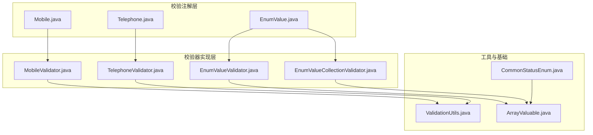
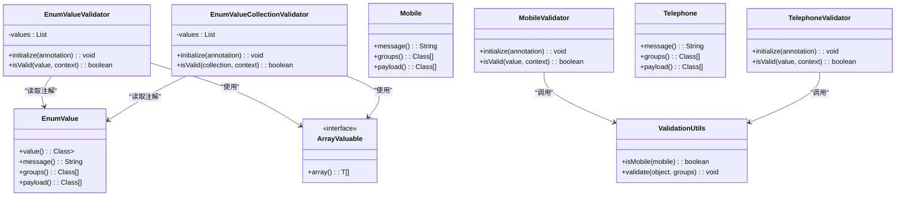
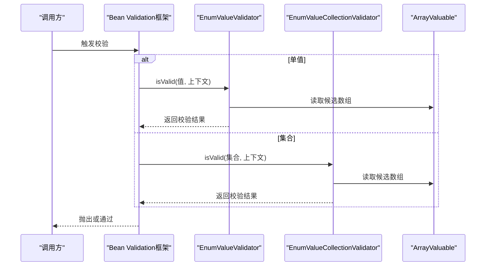
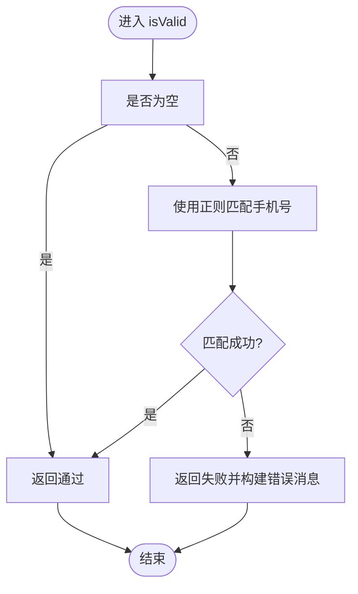
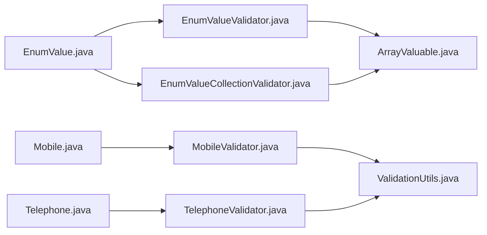

# 校验注解

<cite>
**本文引用的文件**
- [EnumValue.java](file://pandora-framework/pandora-common/src/main/java/net/ittimeline/pandora/framework/common/validation/EnumValue.java)
- [EnumValueValidator.java](file://pandora-framework/pandora-common/src/main/java/net/ittimeline/pandora/framework/common/validation/EnumValueValidator.java)
- [EnumValueCollectionValidator.java](file://pandora-framework/pandora-common/src/main/java/net/ittimeline/pandora/framework/common/validation/EnumValueCollectionValidator.java)
- [Mobile.java](file://pandora-framework/pandora-common/src/main/java/net/ittimeline/pandora/framework/common/validation/Mobile.java)
- [MobileValidator.java](file://pandora-framework/pandora-common/src/main/java/net/ittimeline/pandora/framework/common/validation/MobileValidator.java)
- [Telephone.java](file://pandora-framework/pandora-common/src/main/java/net/ittimeline/pandora/framework/common/validation/Telephone.java)
- [TelephoneValidator.java](file://pandora-framework/pandora-common/src/main/java/net/ittimeline/pandora/framework/common/validation/TelephoneValidator.java)
- [ValidationUtils.java](file://pandora-framework/pandora-common/src/main/java/net/ittimeline/pandora/framework/common/util/web/validation/ValidationUtils.java)
- [ArrayValuable.java](file://pandora-framework/pandora-common/src/main/java/net/ittimeline/pandora/framework/common/core/ArrayValuable.java)
- [CommonStatusEnum.java](file://pandora-framework/pandora-common/src/main/java/net/ittimeline/pandora/framework/common/enums/CommonStatusEnum.java)
</cite>

## 目录
1. [简介](#简介)
2. [项目结构](#项目结构)
3. [核心组件](#核心组件)
4. [架构总览](#架构总览)
5. [详细组件分析](#详细组件分析)
6. [依赖分析](#依赖分析)
7. [性能考量](#性能考量)
8. [故障排查指南](#故障排查指南)
9. [结论](#结论)
10. [附录](#附录)

## 简介
本文件系统性梳理并讲解本仓库中的自定义校验注解与对应校验器的实现与使用方法，覆盖以下主题：
- 注解设计原理与Bean Validation集成方式
- 校验器实现机制、判断规则与错误处理策略
- 在实体类、Controller参数、表单数据中的典型使用场景
- 如何扩展自定义校验规则

重点涉及的注解与校验器包括：
- EnumValue：对单值或集合值进行枚举范围校验
- Mobile：手机号格式校验
- Telephone：固话/手机号混合格式校验

## 项目结构
本次文档聚焦于校验相关的核心文件，位于公共模块的validation与util/web/validation目录中，并依赖core层的ArrayValuable接口。

图表来源
- [EnumValue.java:1-40](file://pandora-framework/pandora-common/src/main/java/net/ittimeline/pandora/framework/common/validation/EnumValue.java#L1-L40)
- [EnumValueValidator.java:1-49](file://pandora-framework/pandora-common/src/main/java/net/ittimeline/pandora/framework/common/validation/EnumValueValidator.java#L1-L49)
- [EnumValueCollectionValidator.java:1-50](file://pandora-framework/pandora-common/src/main/java/net/ittimeline/pandora/framework/common/validation/EnumValueCollectionValidator.java#L1-L50)
- [Mobile.java:1-35](file://pandora-framework/pandora-common/src/main/java/net/ittimeline/pandora/framework/common/validation/Mobile.java#L1-L35)
- [MobileValidator.java:1-30](file://pandora-framework/pandora-common/src/main/java/net/ittimeline/pandora/framework/common/validation/MobileValidator.java#L1-L30)
- [Telephone.java:1-35](file://pandora-framework/pandora-common/src/main/java/net/ittimeline/pandora/framework/common/validation/Telephone.java#L1-L35)
- [TelephoneValidator.java:1-31](file://pandora-framework/pandora-common/src/main/java/net/ittimeline/pandora/framework/common/validation/TelephoneValidator.java#L1-L31)
- [ValidationUtils.java:1-56](file://pandora-framework/pandora-common/src/main/java/net/ittimeline/pandora/framework/common/util/web/validation/ValidationUtils.java#L1-L56)
- [ArrayValuable.java:1-16](file://pandora-framework/pandora-common/src/main/java/net/ittimeline/pandora/framework/common/core/ArrayValuable.java#L1-L16)
- [CommonStatusEnum.java:1-47](file://pandora-framework/pandora-common/src/main/java/net/ittimeline/pandora/framework/common/enums/CommonStatusEnum.java#L1-L47)

章节来源
- [EnumValue.java:1-40](file://pandora-framework/pandora-common/src/main/java/net/ittimeline/pandora/framework/common/validation/EnumValue.java#L1-L40)
- [ArrayValuable.java:1-16](file://pandora-framework/pandora-common/src/main/java/net/ittimeline/pandora/framework/common/core/ArrayValuable.java#L1-L16)

## 核心组件
本节概述三个自定义校验注解及其校验器职责：
- EnumValue：支持单值与集合两种校验路径，基于实现ArrayValuable接口的枚举类提供的数组进行包含关系判断
- Mobile：基于正则表达式对手机号格式进行严格校验
- Telephone：兼容固话与手机号的混合格式校验

章节来源
- [EnumValue.java:1-40](file://pandora-framework/pandora-common/src/main/java/net/ittimeline/pandora/framework/common/validation/EnumValue.java#L1-L40)
- [Mobile.java:1-35](file://pandora-framework/pandora-common/src/main/java/net/ittimeline/pandora/framework/common/validation/Mobile.java#L1-L35)
- [Telephone.java:1-35](file://pandora-framework/pandora-common/src/main/java/net/ittimeline/pandora/framework/common/validation/Telephone.java#L1-L35)

## 架构总览
下图展示了注解、校验器与工具类之间的关系，以及Bean Validation的标准集成点（ConstraintValidator）。

图表来源
- [EnumValue.java:1-40](file://pandora-framework/pandora-common/src/main/java/net/ittimeline/pandora/framework/common/validation/EnumValue.java#L1-L40)
- [EnumValueValidator.java:1-49](file://pandora-framework/pandora-common/src/main/java/net/ittimeline/pandora/framework/common/validation/EnumValueValidator.java#L1-L49)
- [EnumValueCollectionValidator.java:1-50](file://pandora-framework/pandora-common/src/main/java/net/ittimeline/pandora/framework/common/validation/EnumValueCollectionValidator.java#L1-L50)
- [Mobile.java:1-35](file://pandora-framework/pandora-common/src/main/java/net/ittimeline/pandora/framework/common/validation/Mobile.java#L1-L35)
- [MobileValidator.java:1-30](file://pandora-framework/pandora-common/src/main/java/net/ittimeline/pandora/framework/common/validation/MobileValidator.java#L1-L30)
- [Telephone.java:1-35](file://pandora-framework/pandora-common/src/main/java/net/ittimeline/pandora/framework/common/validation/Telephone.java#L1-L35)
- [TelephoneValidator.java:1-31](file://pandora-framework/pandora-common/src/main/java/net/ittimeline/pandora/framework/common/validation/TelephoneValidator.java#L1-L31)
- [ValidationUtils.java:1-56](file://pandora-framework/pandora-common/src/main/java/net/ittimeline/pandora/framework/common/util/web/validation/ValidationUtils.java#L1-L56)
- [ArrayValuable.java:1-16](file://pandora-framework/pandora-common/src/main/java/net/ittimeline/pandora/framework/common/core/ArrayValuable.java#L1-L16)

## 详细组件分析

### EnumValue 注解与校验器
- 设计目标
  - 对单值或集合值进行“是否全部落入指定枚举范围”的校验
  - 通过注解参数绑定实现ArrayValuable接口的枚举类，统一从枚举中提取候选值集合
- 校验逻辑
  - 单值校验器：当值为null时默认通过；否则检查是否包含在候选集合中
  - 集合校验器：当集合为null时默认通过；否则检查集合是否完全包含于候选集合
  - 错误处理：若校验失败，禁用默认消息并注入模板化的自定义消息
- 使用场景
  - 实体类字段：如状态码、类型标识等
  - Controller参数：如批量操作的ID集合
  - 表单数据：多选值或单选值的合法性约束

图表来源
- [EnumValueValidator.java:1-49](file://pandora-framework/pandora-common/src/main/java/net/ittimeline/pandora/framework/common/validation/EnumValueValidator.java#L1-L49)
- [EnumValueCollectionValidator.java:1-50](file://pandora-framework/pandora-common/src/main/java/net/ittimeline/pandora/framework/common/validation/EnumValueCollectionValidator.java#L1-L50)
- [ArrayValuable.java:1-16](file://pandora-framework/pandora-common/src/main/java/net/ittimeline/pandora/framework/common/core/ArrayValuable.java#L1-L16)

章节来源
- [EnumValue.java:1-40](file://pandora-framework/pandora-common/src/main/java/net/ittimeline/pandora/framework/common/validation/EnumValue.java#L1-L40)
- [EnumValueValidator.java:1-49](file://pandora-framework/pandora-common/src/main/java/net/ittimeline/pandora/framework/common/validation/EnumValueValidator.java#L1-L49)
- [EnumValueCollectionValidator.java:1-50](file://pandora-framework/pandora-common/src/main/java/net/ittimeline/pandora/framework/common/validation/EnumValueCollectionValidator.java#L1-L50)
- [ArrayValuable.java:1-16](file://pandora-framework/pandora-common/src/main/java/net/ittimeline/pandora/framework/common/core/ArrayValuable.java#L1-L16)
- [CommonStatusEnum.java:1-47](file://pandora-framework/pandora-common/src/main/java/net/ittimeline/pandora/framework/common/enums/CommonStatusEnum.java#L1-L47)

### Mobile 注解与校验器
- 设计目标
  - 对字符串类型的手机号进行严格格式校验
- 校验逻辑
  - 空值默认通过
  - 使用工具类的正则表达式进行匹配
- 使用场景
  - 用户注册/登录手机号字段
  - 客户端提交的联系人信息

图表来源
- [MobileValidator.java:1-30](file://pandora-framework/pandora-common/src/main/java/net/ittimeline/pandora/framework/common/validation/MobileValidator.java#L1-L30)
- [ValidationUtils.java:1-56](file://pandora-framework/pandora-common/src/main/java/net/ittimeline/pandora/framework/common/util/web/validation/ValidationUtils.java#L1-L56)

章节来源
- [Mobile.java:1-35](file://pandora-framework/pandora-common/src/main/java/net/ittimeline/pandora/framework/common/validation/Mobile.java#L1-L35)
- [MobileValidator.java:1-30](file://pandora-framework/pandora-common/src/main/java/net/ittimeline/pandora/framework/common/validation/MobileValidator.java#L1-L30)
- [ValidationUtils.java:1-56](file://pandora-framework/pandora-common/src/main/java/net/ittimeline/pandora/framework/common/util/web/validation/ValidationUtils.java#L1-L56)

### Telephone 注解与校验器
- 设计目标
  - 兼容固话与手机号的混合格式校验
- 校验逻辑
  - 空值默认通过
  - 使用工具类的固话/手机识别方法进行判断
- 使用场景
  - 客户端提交的联系方式字段（允许固话或手机号）

章节来源
- [Telephone.java:1-35](file://pandora-framework/pandora-common/src/main/java/net/ittimeline/pandora/framework/common/validation/Telephone.java#L1-L35)
- [TelephoneValidator.java:1-31](file://pandora-framework/pandora-common/src/main/java/net/ittimeline/pandora/framework/common/validation/TelephoneValidator.java#L1-L31)
- [ValidationUtils.java:1-56](file://pandora-framework/pandora-common/src/main/java/net/ittimeline/pandora/framework/common/util/web/validation/ValidationUtils.java#L1-L56)

## 依赖分析
- 注解与校验器的耦合
  - EnumValue通过validatedBy声明两个校验器，分别处理单值与集合
  - Mobile与Telephone各自声明单一校验器
- 校验器与工具类的依赖
  - MobileValidator与TelephoneValidator均依赖ValidationUtils进行格式判断
- 基础接口
  - EnumValueValidator与EnumValueCollectionValidator依赖ArrayValuable接口从枚举中提取候选值

图表来源
- [EnumValue.java:1-40](file://pandora-framework/pandora-common/src/main/java/net/ittimeline/pandora/framework/common/validation/EnumValue.java#L1-L40)
- [EnumValueValidator.java:1-49](file://pandora-framework/pandora-common/src/main/java/net/ittimeline/pandora/framework/common/validation/EnumValueValidator.java#L1-L49)
- [EnumValueCollectionValidator.java:1-50](file://pandora-framework/pandora-common/src/main/java/net/ittimeline/pandora/framework/common/validation/EnumValueCollectionValidator.java#L1-L50)
- [Mobile.java:1-35](file://pandora-framework/pandora-common/src/main/java/net/ittimeline/pandora/framework/common/validation/Mobile.java#L1-L35)
- [MobileValidator.java:1-30](file://pandora-framework/pandora-common/src/main/java/net/ittimeline/pandora/framework/common/validation/MobileValidator.java#L1-L30)
- [Telephone.java:1-35](file://pandora-framework/pandora-common/src/main/java/net/ittimeline/pandora/framework/common/validation/Telephone.java#L1-L35)
- [TelephoneValidator.java:1-31](file://pandora-framework/pandora-common/src/main/java/net/ittimeline/pandora/framework/common/validation/TelephoneValidator.java#L1-L31)
- [ValidationUtils.java:1-56](file://pandora-framework/pandora-common/src/main/java/net/ittimeline/pandora/framework/common/util/web/validation/ValidationUtils.java#L1-L56)
- [ArrayValuable.java:1-16](file://pandora-framework/pandora-common/src/main/java/net/ittimeline/pandora/framework/common/core/ArrayValuable.java#L1-L16)

## 性能考量
- 正则匹配成本
  - Mobile与Telephone的正则匹配为O(n)级别，n为字符串长度，通常开销较小
- 集合校验成本
  - EnumValueCollectionValidator使用包含关系判断，时间复杂度近似O(m)，m为待校验集合大小
- 候选值缓存
  - 当前实现每次初始化都会从枚举读取候选数组，建议在高并发场景下避免频繁反射调用，可在注解初始化阶段缓存候选值列表
- 空值短路
  - 所有校验器对空值直接放行，减少不必要的计算

## 故障排查指南
- 常见问题
  - 枚举未实现ArrayValuable接口：导致候选值为空，校验恒失败
  - 注解未配置message：默认消息模板可能不满足业务需求
  - 空值场景误解：空值默认通过，需明确业务是否允许空值
- 定位步骤
  - 检查注解绑定的枚举类是否实现ArrayValuable并正确提供数组
  - 检查校验器初始化逻辑是否能正确读取候选值
  - 使用工具类的validate方法捕获并查看具体违反的约束信息
- 建议
  - 在开发环境启用更详细的异常堆栈，便于定位违反的具体注解与字段
  - 对高频校验场景增加单元测试，覆盖边界值与非法输入

章节来源
- [ValidationUtils.java:1-56](file://pandora-framework/pandora-common/src/main/java/net/ittimeline/pandora/framework/common/util/web/validation/ValidationUtils.java#L1-L56)
- [EnumValueValidator.java:1-49](file://pandora-framework/pandora-common/src/main/java/net/ittimeline/pandora/framework/common/validation/EnumValueValidator.java#L1-L49)
- [EnumValueCollectionValidator.java:1-50](file://pandora-framework/pandora-common/src/main/java/net/ittimeline/pandora/framework/common/validation/EnumValueCollectionValidator.java#L1-L50)

## 结论
本仓库的校验注解体系遵循Bean Validation标准，结合ArrayValuable接口与工具类，提供了简洁而强大的扩展能力：
- EnumValue：统一了单值与集合的枚举范围校验
- Mobile/Telephone：分别面向手机号与混合联系方式的格式校验
- 易扩展：新增校验规则只需实现ConstraintValidator接口并声明在注解的validatedBy中

## 附录

### 使用示例（路径指引）
以下示例仅给出文件与位置，不直接展示代码内容：
- 在实体类字段上使用枚举范围校验
  - 参考：[CommonStatusEnum.java:1-47](file://pandora-framework/pandora-common/src/main/java/net/ittimeline/pandora/framework/common/enums/CommonStatusEnum.java#L1-L47)
  - 注解使用参考：[EnumValue.java:1-40](file://pandora-framework/pandora-common/src/main/java/net/ittimeline/pandora/framework/common/validation/EnumValue.java#L1-L40)
- 在Controller参数上使用手机号/固话校验
  - 注解使用参考：[Mobile.java:1-35](file://pandora-framework/pandora-common/src/main/java/net/ittimeline/pandora/framework/common/validation/Mobile.java#L1-L35)、[Telephone.java:1-35](file://pandora-framework/pandora-common/src/main/java/net/ittimeline/pandora/framework/common/validation/Telephone.java#L1-L35)
- 使用工具类触发全局校验
  - 参考：[ValidationUtils.java:1-56](file://pandora-framework/pandora-common/src/main/java/net/ittimeline/pandora/framework/common/util/web/validation/ValidationUtils.java#L1-L56)

### 扩展自定义校验规则（步骤）
- 定义注解
  - 继承jakarta.validation.Constraint，声明validatedBy
  - 参考：[EnumValue.java:1-40](file://pandora-framework/pandora-common/src/main/java/net/ittimeline/pandora/framework/common/validation/EnumValue.java#L1-L40)、[Mobile.java:1-35](file://pandora-framework/pandora-common/src/main/java/net/ittimeline/pandora/framework/common/validation/Mobile.java#L1-L35)、[Telephone.java:1-35](file://pandora-framework/pandora-common/src/main/java/net/ittimeline/pandora/framework/common/validation/Telephone.java#L1-L35)
- 实现校验器
  - 实现ConstraintValidator<T, V>
  - 在isValid中编写判断逻辑与错误消息构建
  - 参考：[EnumValueValidator.java:1-49](file://pandora-framework/pandora-common/src/main/java/net/ittimeline/pandora/framework/common/validation/EnumValueValidator.java#L1-L49)、[MobileValidator.java:1-30](file://pandora-framework/pandora-common/src/main/java/net/ittimeline/pandora/framework/common/validation/MobileValidator.java#L1-L30)、[TelephoneValidator.java:1-31](file://pandora-framework/pandora-common/src/main/java/net/ittimeline/pandora/framework/common/validation/TelephoneValidator.java#L1-L31)
- 集成与测试
  - 在实体类或参数上应用注解
  - 使用ValidationUtils.validate进行整体校验
  - 参考：[ValidationUtils.java:1-56](file://pandora-framework/pandora-common/src/main/java/net/ittimeline/pandora/framework/common/util/web/validation/ValidationUtils.java#L1-L56)