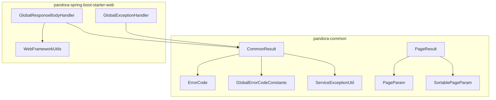
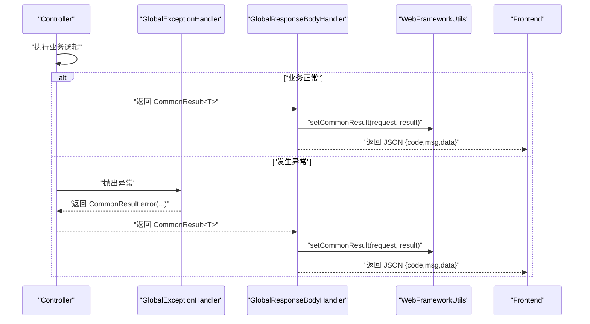
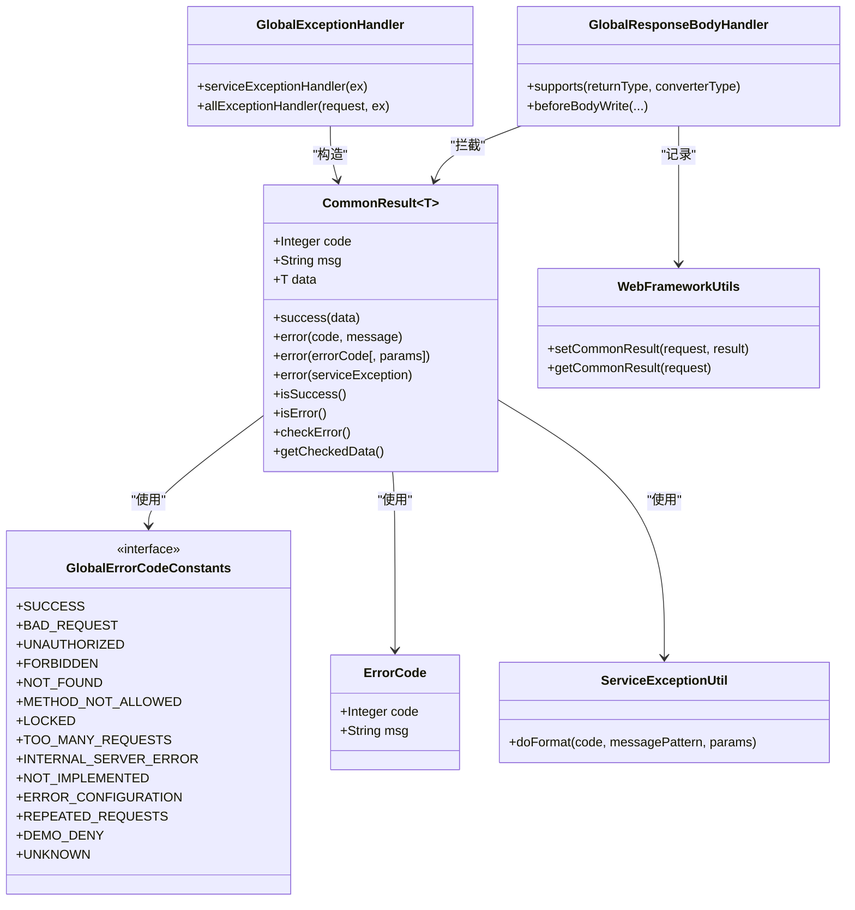

# 统一响应格式

<cite>
**本文引用的文件列表**
- [CommonResult.java](file://pandora-framework/pandora-common/src/main/java/net/ittimeline/pandora/framework/common/pojo/CommonResult.java)
- [ErrorCode.java](file://pandora-framework/pandora-common/src/main/java/net/ittimeline/pandora/framework/common/exception/ErrorCode.java)
- [GlobalErrorCodeConstants.java](file://pandora-framework/pandora-common/src/main/java/net/ittimeline/pandora/framework/common/exception/enums/GlobalErrorCodeConstants.java)
- [ServiceExceptionUtil.java](file://pandora-framework/pandora-common/src/main/java/net/ittimeline/pandora/framework/common/exception/util/ServiceExceptionUtil.java)
- [GlobalResponseBodyHandler.java](file://pandora-framework/pandora-spring-boot-starter-web/src/main/java/net/ittimeline/pandora/framework/web/core/handler/GlobalResponseBodyHandler.java)
- [GlobalExceptionHandler.java](file://pandora-framework/pandora-spring-boot-starter-web/src/main/java/net/ittimeline/pandora/framework/web/core/handler/GlobalExceptionHandler.java)
- [WebFrameworkUtils.java](file://pandora-framework/pandora-spring-boot-starter-web/src/main/java/net/ittimeline/pandora/framework/web/core/util/WebFrameworkUtils.java)
- [PageResult.java](file://pandora-framework/pandora-common/src/main/java/net/ittimeline/pandora/framework/common/pojo/PageResult.java)
- [PageParam.java](file://pandora-framework/pandora-common/src/main/java/net/ittimeline/pandora/framework/common/pojo/PageParam.java)
- [SortablePageParam.java](file://pandora-framework/pandora-common/src/main/java/net/ittimeline/pandora/framework/common/pojo/SortablePageParam.java)
</cite>

## 目录
1. [简介](#简介)
2. [项目结构](#项目结构)
3. [核心组件](#核心组件)
4. [架构总览](#架构总览)
5. [组件详解](#组件详解)
6. [依赖关系分析](#依赖关系分析)
7. [性能考量](#性能考量)
8. [故障排查指南](#故障排查指南)
9. [结论](#结论)
10. [附录](#附录)

## 简介
本文件围绕“统一响应格式”展开，重点解析 CommonResult 类的设计理念与实现细节，阐述其在 API 响应标准化中的关键作用。文档将详细说明响应格式的结构组成（状态码、消息、数据体等），给出在不同场景下的使用范式，并总结与前端交互的最佳实践（错误与成功响应的处理差异）。同时，结合全局异常处理与全局响应包装机制，帮助读者理解从后端到前端的一致性响应契约。

## 项目结构
统一响应格式相关的核心代码分布在以下模块：
- pandora-common：通用领域模型与异常体系，包含统一响应对象与错误码定义
- pandora-spring-boot-starter-web：Web 层的全局异常处理与响应包装

图表来源
- [CommonResult.java:1-122](file://pandora-framework/pandora-common/src/main/java/net/ittimeline/pandora/framework/common/pojo/CommonResult.java#L1-L122)
- [GlobalErrorCodeConstants.java:1-41](file://pandora-framework/pandora-common/src/main/java/net/ittimeline/pandora/framework/common/exception/enums/GlobalErrorCodeConstants.java#L1-L41)
- [ErrorCode.java:1-33](file://pandora-framework/pandora-common/src/main/java/net/ittimeline/pandora/framework/common/exception/ErrorCode.java#L1-L33)
- [ServiceExceptionUtil.java:1-85](file://pandora-framework/pandora-common/src/main/java/net/ittimeline/pandora/framework/common/exception/util/ServiceExceptionUtil.java#L1-L85)
- [GlobalResponseBodyHandler.java:1-46](file://pandora-framework/pandora-spring-boot-starter-web/src/main/java/net/ittimeline/pandora/framework/web/core/handler/GlobalResponseBodyHandler.java#L1-L46)
- [GlobalExceptionHandler.java:1-375](file://pandora-framework/pandora-spring-boot-starter-web/src/main/java/net/ittimeline/pandora/framework/web/core/handler/GlobalExceptionHandler.java#L1-L375)
- [WebFrameworkUtils.java:1-182](file://pandora-framework/pandora-spring-boot-starter-web/src/main/java/net/ittimeline/pandora/framework/web/core/util/WebFrameworkUtils.java#L1-L182)
- [PageResult.java:1-48](file://pandora-framework/pandora-common/src/main/java/net/ittimeline/pandora/framework/common/pojo/PageResult.java#L1-L48)
- [PageParam.java:1-42](file://pandora-framework/pandora-common/src/main/java/net/ittimeline/pandora/framework/common/pojo/PageParam.java#L1-L42)
- [SortablePageParam.java:1-26](file://pandora-framework/pandora-common/src/main/java/net/ittimeline/pandora/framework/common/pojo/SortablePageParam.java#L1-L26)

章节来源
- [CommonResult.java:1-122](file://pandora-framework/pandora-common/src/main/java/net/ittimeline/pandora/framework/common/pojo/CommonResult.java#L1-L122)
- [GlobalResponseBodyHandler.java:1-46](file://pandora-framework/pandora-spring-boot-starter-web/src/main/java/net/ittimeline/pandora/framework/web/core/handler/GlobalResponseBodyHandler.java#L1-L46)

## 核心组件
- CommonResult<T>：统一响应载体，包含 code、msg、data 三要素；提供 success/error 工厂方法与异常检查能力
- ErrorCode：错误码对象，承载 code 与 msg
- GlobalErrorCodeConstants：全局错误码常量集合，覆盖客户端错误、服务端错误与自定义错误段
- ServiceExceptionUtil：异常消息格式化工具，支持占位符替换与参数校验
- GlobalExceptionHandler：全局异常处理器，将各类异常翻译为 CommonResult
- GlobalResponseBodyHandler：全局响应包装器，记录 Controller 返回的 CommonResult，便于后续日志与监控
- WebFrameworkUtils：Web 工具类，提供 setCommonResult/getCommonResult 等能力
- PageResult<T>/PageParam/SortablePageParam：分页模型，配合统一响应用于列表数据返回

章节来源
- [CommonResult.java:1-122](file://pandora-framework/pandora-common/src/main/java/net/ittimeline/pandora/framework/common/pojo/CommonResult.java#L1-L122)
- [ErrorCode.java:1-33](file://pandora-framework/pandora-common/src/main/java/net/ittimeline/pandora/framework/common/exception/ErrorCode.java#L1-L33)
- [GlobalErrorCodeConstants.java:1-41](file://pandora-framework/pandora-common/src/main/java/net/ittimeline/pandora/framework/common/exception/enums/GlobalErrorCodeConstants.java#L1-L41)
- [ServiceExceptionUtil.java:1-85](file://pandora-framework/pandora-common/src/main/java/net/ittimeline/pandora/framework/common/exception/util/ServiceExceptionUtil.java#L1-L85)
- [GlobalExceptionHandler.java:1-375](file://pandora-framework/pandora-spring-boot-starter-web/src/main/java/net/ittimeline/pandora/framework/web/core/handler/GlobalExceptionHandler.java#L1-L375)
- [GlobalResponseBodyHandler.java:1-46](file://pandora-framework/pandora-spring-boot-starter-web/src/main/java/net/ittimeline/pandora/framework/web/core/handler/GlobalResponseBodyHandler.java#L1-L46)
- [WebFrameworkUtils.java:1-182](file://pandora-framework/pandora-spring-boot-starter-web/src/main/java/net/ittimeline/pandora/framework/web/core/util/WebFrameworkUtils.java#L1-L182)
- [PageResult.java:1-48](file://pandora-framework/pandora-common/src/main/java/net/ittimeline/pandora/framework/common/pojo/PageResult.java#L1-L48)
- [PageParam.java:1-42](file://pandora-framework/pandora-common/src/main/java/net/ittimeline/pandora/framework/common/pojo/PageParam.java#L1-L42)
- [SortablePageParam.java:1-26](file://pandora-framework/pandora-common/src/main/java/net/ittimeline/pandora/framework/common/pojo/SortablePageParam.java#L1-L26)

## 架构总览
统一响应格式贯穿“控制器 -> 异常处理 -> 响应包装”的链路，确保前后端一致的契约。

图表来源
- [GlobalExceptionHandler.java:1-375](file://pandora-framework/pandora-spring-boot-starter-web/src/main/java/net/ittimeline/pandora/framework/web/core/handler/GlobalExceptionHandler.java#L1-L375)
- [GlobalResponseBodyHandler.java:1-46](file://pandora-framework/pandora-spring-boot-starter-web/src/main/java/net/ittimeline/pandora/framework/web/core/handler/GlobalResponseBodyHandler.java#L1-L46)
- [WebFrameworkUtils.java:141-147](file://pandora-framework/pandora-spring-boot-starter-web/src/main/java/net/ittimeline/pandora/framework/web/core/util/WebFrameworkUtils.java#L141-L147)

## 组件详解

### CommonResult 设计与实现
- 结构组成
  - code：整型错误码，0 表示成功，非 0 表示失败
  - msg：人类可读的提示信息，错误时由错误码模板与参数格式化生成
  - data：泛型数据体，成功时承载业务数据
- 关键方法
  - success(data)：构造成功响应
  - error(code, message)：构造错误响应（断言 code 非成功）
  - error(errorCode[, params])：根据错误码与参数格式化消息
  - error(ServiceException)：将业务异常转为统一响应
  - isSuccess()/isError()：判断响应状态
  - checkError()/getCheckedData()：将响应转回异常或安全取数据
- 设计要点
  - 使用泛型 T 提供强类型数据承载
  - 通过注解避免 JSON 序列化时携带 isSuccess/isError 字段
  - 与错误码体系与异常工具深度集成，保证消息一致性与可维护性

章节来源
- [CommonResult.java:1-122](file://pandora-framework/pandora-common/src/main/java/net/ittimeline/pandora/framework/common/pojo/CommonResult.java#L1-L122)

### 错误码与异常体系
- ErrorCode：封装 code 与 msg 的不可变对象
- GlobalErrorCodeConstants：集中定义全局错误码，覆盖客户端错误（4xx）、服务端错误（5xx）与自定义段（9xx）
- ServiceExceptionUtil：提供 doFormat 实现占位符替换，避免 String.format 的脆弱性；支持参数过多/过少的容错与日志提示

章节来源
- [ErrorCode.java:1-33](file://pandora-framework/pandora-common/src/main/java/net/ittimeline/pandora/framework/common/exception/ErrorCode.java#L1-L33)
- [GlobalErrorCodeConstants.java:1-41](file://pandora-framework/pandora-common/src/main/java/net/ittimeline/pandora/framework/common/exception/enums/GlobalErrorCodeConstants.java#L1-L41)
- [ServiceExceptionUtil.java:1-85](file://pandora-framework/pandora-common/src/main/java/net/ittimeline/pandora/framework/common/exception/util/ServiceExceptionUtil.java#L1-L85)

### 全局异常处理与响应包装
- GlobalExceptionHandler：将各类异常（参数校验、权限、业务异常等）统一翻译为 CommonResult，确保前端收到一致的错误结构
- GlobalResponseBodyHandler：仅对返回类型为 CommonResult 的接口进行响应包装，记录响应以便后续日志与监控
- WebFrameworkUtils：提供 setCommonResult/getCommonResult，将响应结果存入请求属性，供后续组件使用

章节来源
- [GlobalExceptionHandler.java:1-375](file://pandora-framework/pandora-spring-boot-starter-web/src/main/java/net/ittimeline/pandora/framework/web/core/handler/GlobalExceptionHandler.java#L1-L375)
- [GlobalResponseBodyHandler.java:1-46](file://pandora-framework/pandora-spring-boot-starter-web/src/main/java/net/ittimeline/pandora/framework/web/core/handler/GlobalResponseBodyHandler.java#L1-L46)
- [WebFrameworkUtils.java:141-147](file://pandora-framework/pandora-spring-boot-starter-web/src/main/java/net/ittimeline/pandora/framework/web/core/util/WebFrameworkUtils.java#L141-L147)

### 分页模型与统一响应的结合
- PageResult<T>：包含 total 与 list，适合列表数据的统一返回
- PageParam/SortablePageParam：提供分页与排序参数，与统一响应配合，形成标准的分页接口契约

章节来源
- [PageResult.java:1-48](file://pandora-framework/pandora-common/src/main/java/net/ittimeline/pandora/framework/common/pojo/PageResult.java#L1-L48)
- [PageParam.java:1-42](file://pandora-framework/pandora-common/src/main/java/net/ittimeline/pandora/framework/common/pojo/PageParam.java#L1-L42)
- [SortablePageParam.java:1-26](file://pandora-framework/pandora-common/src/main/java/net/ittimeline/pandora/framework/common/pojo/SortablePageParam.java#L1-L26)

## 依赖关系分析
CommonResult 与错误码、异常工具、异常处理器、响应包装器之间存在紧密耦合，形成闭环的统一响应体系。

图表来源
- [CommonResult.java:1-122](file://pandora-framework/pandora-common/src/main/java/net/ittimeline/pandora/framework/common/pojo/CommonResult.java#L1-L122)
- [GlobalErrorCodeConstants.java:1-41](file://pandora-framework/pandora-common/src/main/java/net/ittimeline/pandora/framework/common/exception/enums/GlobalErrorCodeConstants.java#L1-L41)
- [ErrorCode.java:1-33](file://pandora-framework/pandora-common/src/main/java/net/ittimeline/pandora/framework/common/exception/ErrorCode.java#L1-L33)
- [ServiceExceptionUtil.java:1-85](file://pandora-framework/pandora-common/src/main/java/net/ittimeline/pandora/framework/common/exception/util/ServiceExceptionUtil.java#L1-L85)
- [GlobalExceptionHandler.java:1-375](file://pandora-framework/pandora-spring-boot-starter-web/src/main/java/net/ittimeline/pandora/framework/web/core/handler/GlobalExceptionHandler.java#L1-L375)
- [GlobalResponseBodyHandler.java:1-46](file://pandora-framework/pandora-spring-boot-starter-web/src/main/java/net/ittimeline/pandora/framework/web/core/handler/GlobalResponseBodyHandler.java#L1-L46)
- [WebFrameworkUtils.java:141-147](file://pandora-framework/pandora-spring-boot-starter-web/src/main/java/net/ittimeline/pandora/framework/web/core/util/WebFrameworkUtils.java#L141-L147)

## 性能考量
- JSON 序列化开销：CommonResult 的 isSuccess/isError 字段标注忽略序列化，减少冗余字段传输
- 消息格式化：ServiceExceptionUtil 的 doFormat 采用预分配容量与占位符遍历策略，避免频繁扩容与异常
- 响应包装：GlobalResponseBodyHandler 仅拦截返回类型为 CommonResult 的接口，避免对其他响应类型的无谓处理

[本节为通用建议，无需特定文件来源]

## 故障排查指南
- 成功与失败的识别
  - 前端应以 code === 0 判定成功，否则视为失败
  - 若后端返回了非 0 code，前端应展示 msg 或根据 code 映射国际化文案
- 异常处理流程
  - 控制器内部抛出 ServiceException 时，会被 GlobalExceptionHandler 统一捕获并返回 CommonResult.error
  - 若出现未被处理的异常，GlobalExceptionHandler.allExceptionHandler 会兜底返回通用错误
- 日志与追踪
  - GlobalResponseBodyHandler 会将 CommonResult 写入请求属性，便于后续日志组件记录
  - WebFrameworkUtils 提供 getCommonResult 获取当前请求的响应结果，辅助定位问题

章节来源
- [GlobalExceptionHandler.java:79-119](file://pandora-framework/pandora-spring-boot-starter-web/src/main/java/net/ittimeline/pandora/framework/web/core/handler/GlobalExceptionHandler.java#L79-L119)
- [GlobalExceptionHandler.java:298-315](file://pandora-framework/pandora-spring-boot-starter-web/src/main/java/net/ittimeline/pandora/framework/web/core/handler/GlobalExceptionHandler.java#L298-L315)
- [GlobalResponseBodyHandler.java:39-44](file://pandora-framework/pandora-spring-boot-starter-web/src/main/java/net/ittimeline/pandora/framework/web/core/handler/GlobalResponseBodyHandler.java#L39-L44)
- [WebFrameworkUtils.java:141-147](file://pandora-framework/pandora-spring-boot-starter-web/src/main/java/net/ittimeline/pandora/framework/web/core/util/WebFrameworkUtils.java#L141-L147)

## 结论
统一响应格式通过 CommonResult 将“状态码 + 消息 + 数据体”标准化，配合错误码常量、异常工具与全局异常/响应处理机制，实现了前后端一致的契约。该设计既保证了错误信息的可读性与可维护性，也为前端提供了稳定的判错依据。结合分页模型，可进一步提升列表数据返回的一致性与扩展性。

[本节为总结，无需特定文件来源]

## 附录

### 响应格式字段说明
- code：整型错误码
  - 0：成功
  - 非 0：失败，具体语义由错误码常量定义
- msg：字符串，人类可读的提示信息
  - 成功时为空串或省略
  - 失败时由错误码模板与参数格式化生成
- data：任意类型数据体
  - 成功时承载业务数据
  - 失败时通常为空或省略

章节来源
- [CommonResult.java:24-39](file://pandora-framework/pandora-common/src/main/java/net/ittimeline/pandora/framework/common/pojo/CommonResult.java#L24-L39)
- [GlobalErrorCodeConstants.java:18-41](file://pandora-framework/pandora-common/src/main/java/net/ittimeline/pandora/framework/common/exception/enums/GlobalErrorCodeConstants.java#L18-L41)

### 常见使用场景与最佳实践
- 成功响应
  - 场景：查询单条/多条数据、创建/更新/删除成功
  - 建议：使用 CommonResult.success(data)，data 为具体业务对象或分页结果
  - 参考路径：[CommonResult.java:74-80](file://pandora-framework/pandora-common/src/main/java/net/ittimeline/pandora/framework/common/pojo/CommonResult.java#L74-L80)
- 错误响应
  - 场景：参数校验失败、权限不足、业务异常
  - 建议：使用 CommonResult.error(errorCode[, params]) 或 error(code, message)
  - 参考路径：[CommonResult.java:54-72](file://pandora-framework/pandora-common/src/main/java/net/ittimeline/pandora/framework/common/pojo/CommonResult.java#L54-L72)
- 分页响应
  - 场景：列表查询
  - 建议：使用 PageResult<T> 作为 data，结合 PageParam/SortablePageParam
  - 参考路径：[PageResult.java:19-48](file://pandora-framework/pandora-common/src/main/java/net/ittimeline/pandora/framework/common/pojo/PageResult.java#L19-L48)
- 异常兜底
  - 场景：未被捕获的异常
  - 建议：交由 GlobalExceptionHandler 统一处理，返回通用错误
  - 参考路径：[GlobalExceptionHandler.java:119-119](file://pandora-framework/pandora-spring-boot-starter-web/src/main/java/net/ittimeline/pandora/framework/web/core/handler/GlobalExceptionHandler.java#L119-L119)

### 前端交互最佳实践
- 成功响应处理
  - 以 code === 0 为准，读取 data 进行渲染
  - 对空数据进行友好提示
- 错误响应处理
  - 以 code !== 0 为准，展示 msg 或按 code 映射国际化文案
  - 对 401/403 等鉴权错误，引导跳转登录或权限申请
- 统一拦截器
  - 建议在前端统一拦截器中，对 code !== 0 的响应进行统一提示与埋点
- 分页处理
  - 读取 total 与 list，结合 PageParam/SortablePageParam 的约束进行分页 UI 更新

[本节为通用建议，无需特定文件来源]