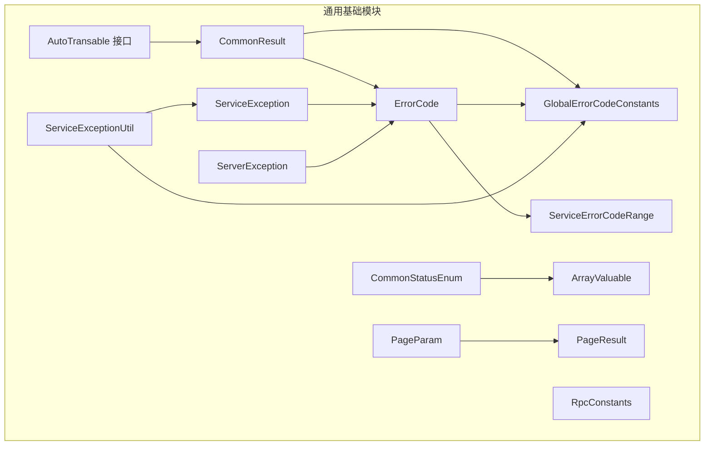
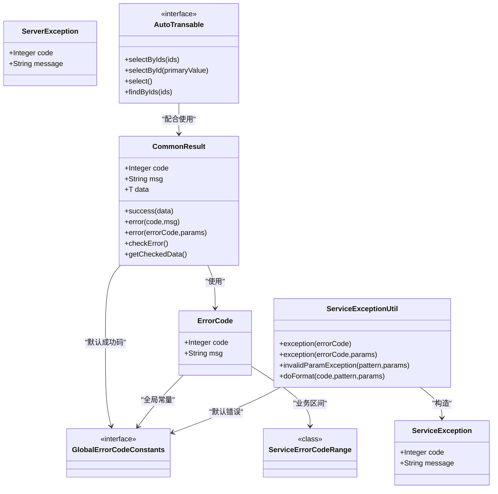
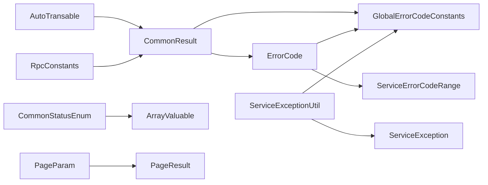

# 通用基础模块

<cite>
**本文引用的文件**
- [AutoTransable.java](file://pandora-framework/pandora-common/src/main/java/com/fhs/trans/service/AutoTransable.java)
- [CommonResult.java](file://pandora-framework/pandora-common/src/main/java/net/ittimeline/pandora/framework/common/pojo/CommonResult.java)
- [ErrorCode.java](file://pandora-framework/pandora-common/src/main/java/net/ittimeline/pandora/framework/common/exception/ErrorCode.java)
- [ServerException.java](file://pandora-framework/pandora-common/src/main/java/net/ittimeline/pandora/framework/common/exception/ServerException.java)
- [ServiceException.java](file://pandora-framework/pandora-common/src/main/java/net/ittimeline/pandora/framework/common/exception/ServiceException.java)
- [GlobalErrorCodeConstants.java](file://pandora-framework/pandora-common/src/main/java/net/ittimeline/pandora/framework/common/exception/enums/GlobalErrorCodeConstants.java)
- [ServiceErrorCodeRange.java](file://pandora-framework/pandora-common/src/main/java/net/ittimeline/pandora/framework/common/exception/enums/ServiceErrorCodeRange.java)
- [ServiceExceptionUtil.java](file://pandora-framework/pandora-common/src/main/java/net/ittimeline/pandora/framework/common/exception/util/ServiceExceptionUtil.java)
- [CommonStatusEnum.java](file://pandora-framework/pandora-common/src/main/java/net/ittimeline/pandora/framework/common/enums/CommonStatusEnum.java)
- [ArrayValuable.java](file://pandora-framework/pandora-common/src/main/java/net/ittimeline/pandora/framework/common/core/ArrayValuable.java)
- [RpcConstants.java](file://pandora-framework/pandora-common/src/main/java/net/ittimeline/pandora/framework/common/constants/RpcConstants.java)
- [PageParam.java](file://pandora-framework/pandora-common/src/main/java/net/ittimeline/pandora/framework/common/pojo/PageParam.java)
- [PageResult.java](file://pandora-framework/pandora-common/src/main/java/net/ittimeline/pandora/framework/common/pojo/PageResult.java)
</cite>

## 目录
1. [简介](#简介)
2. [项目结构](#项目结构)
3. [核心组件](#核心组件)
4. [架构总览](#架构总览)
5. [详细组件分析](#详细组件分析)
6. [依赖关系分析](#依赖关系分析)
7. [性能考量](#性能考量)
8. [故障排查指南](#故障排查指南)
9. [结论](#结论)
10. [附录](#附录)

## 简介
本文件面向 Pandora Cloud 框架的通用基础模块，聚焦以下关键主题：
- AutoTransable 数据翻译服务接口的设计理念与实现要点
- CommonResult 统一响应格式的结构、语义与使用场景
- ErrorCode 错误码体系的定义规则与异常处理机制
- 工具类库、常量与枚举的职责与用法
- 实际项目中的使用示例路径（以文件路径与行号标注）
- 组件间的依赖关系与协作模式，以及最佳实践

## 项目结构
通用基础模块位于 pandora-framework/pandora-common，采用按领域与层次混合的组织方式：
- 接口与服务：AutoTransable（数据翻译）
- POJO：CommonResult、PageParam、PageResult
- 异常与错误码：ErrorCode、ServiceException、ServerException、全局与业务错误码常量与范围
- 枚举与常量：CommonStatusEnum、RpcConstants
- 工具与接口：ServiceExceptionUtil、ArrayValuable

图表来源
- [AutoTransable.java:18-60](file://pandora-framework/pandora-common/src/main/java/com/fhs/trans/service/AutoTransable.java#L18-L60)
- [CommonResult.java:22-122](file://pandora-framework/pandora-common/src/main/java/net/ittimeline/pandora/framework/common/pojo/CommonResult.java#L22-L122)
- [ErrorCode.java:18-32](file://pandora-framework/pandora-common/src/main/java/net/ittimeline/pandora/framework/common/exception/ErrorCode.java#L18-L32)
- [ServiceException.java:15-63](file://pandora-framework/pandora-common/src/main/java/net/ittimeline/pandora/framework/common/exception/ServiceException.java#L15-L63)
- [ServerException.java:16-64](file://pandora-framework/pandora-common/src/main/java/net/ittimeline/pandora/framework/common/exception/ServerException.java#L16-L64)
- [GlobalErrorCodeConstants.java:16-41](file://pandora-framework/pandora-common/src/main/java/net/ittimeline/pandora/framework/common/exception/enums/GlobalErrorCodeConstants.java#L16-L41)
- [ServiceErrorCodeRange.java:31-47](file://pandora-framework/pandora-common/src/main/java/net/ittimeline/pandora/framework/common/exception/enums/ServiceErrorCodeRange.java#L31-L47)
- [ServiceExceptionUtil.java:19-84](file://pandora-framework/pandora-common/src/main/java/net/ittimeline/pandora/framework/common/exception/util/ServiceExceptionUtil.java#L19-L84)
- [CommonStatusEnum.java:18-47](file://pandora-framework/pandora-common/src/main/java/net/ittimeline/pandora/framework/common/enums/CommonStatusEnum.java#L18-L47)
- [ArrayValuable.java:10-15](file://pandora-framework/pandora-common/src/main/java/net/ittimeline/pandora/framework/common/core/ArrayValuable.java#L10-L15)
- [RpcConstants.java:12-41](file://pandora-framework/pandora-common/src/main/java/net/ittimeline/pandora/framework/common/constants/RpcConstants.java#L12-L41)
- [PageParam.java:20-42](file://pandora-framework/pandora-common/src/main/java/net/ittimeline/pandora/framework/common/pojo/PageParam.java#L20-L42)
- [PageResult.java:19-48](file://pandora-framework/pandora-common/src/main/java/net/ittimeline/pandora/framework/common/pojo/PageResult.java#L19-L48)

章节来源
- [AutoTransable.java:18-60](file://pandora-framework/pandora-common/src/main/java/com/fhs/trans/service/AutoTransable.java#L18-L60)
- [CommonResult.java:22-122](file://pandora-framework/pandora-common/src/main/java/net/ittimeline/pandora/framework/common/pojo/CommonResult.java#L22-L122)
- [ErrorCode.java:18-32](file://pandora-framework/pandora-common/src/main/java/net/ittimeline/pandora/framework/common/exception/ErrorCode.java#L18-L32)
- [ServiceException.java:15-63](file://pandora-framework/pandora-common/src/main/java/net/ittimeline/pandora/framework/common/exception/ServiceException.java#L15-L63)
- [ServerException.java:16-64](file://pandora-framework/pandora-common/src/main/java/net/ittimeline/pandora/framework/common/exception/ServerException.java#L16-L64)
- [GlobalErrorCodeConstants.java:16-41](file://pandora-framework/pandora-common/src/main/java/net/ittimeline/pandora/framework/common/exception/enums/GlobalErrorCodeConstants.java#L16-L41)
- [ServiceErrorCodeRange.java:31-47](file://pandora-framework/pandora-common/src/main/java/net/ittimeline/pandora/framework/common/exception/enums/ServiceErrorCodeRange.java#L31-L47)
- [ServiceExceptionUtil.java:19-84](file://pandora-framework/pandora-common/src/main/java/net/ittimeline/pandora/framework/common/exception/util/ServiceExceptionUtil.java#L19-L84)
- [CommonStatusEnum.java:18-47](file://pandora-framework/pandora-common/src/main/java/net/ittimeline/pandora/framework/common/enums/CommonStatusEnum.java#L18-L47)
- [ArrayValuable.java:10-15](file://pandora-framework/pandora-common/src/main/java/net/ittimeline/pandora/framework/common/core/ArrayValuable.java#L10-L15)
- [RpcConstants.java:12-41](file://pandora-framework/pandora-common/src/main/java/net/ittimeline/pandora/framework/common/constants/RpcConstants.java#L12-L41)
- [PageParam.java:20-42](file://pandora-framework/pandora-common/src/main/java/net/ittimeline/pandora/framework/common/pojo/PageParam.java#L20-L42)
- [PageResult.java:19-48](file://pandora-framework/pandora-common/src/main/java/net/ittimeline/pandora/framework/common/pojo/PageResult.java#L19-L48)

## 核心组件
- AutoTransable：定义数据翻译的统一入口，支持按主键或批量 ID 查询，兼容旧方法标记为过期
- CommonResult：统一响应载体，包含 code、msg、data；提供 success/error 工厂方法、校验与异常转换
- ErrorCode：错误码对象，承载 code 与 msg；与全局与业务错误码常量配合
- ServiceException/ServerException：业务异常与服务器异常，继承 RuntimeException，携带 code 与 message
- GlobalErrorCodeConstants：全局错误码常量集合（0-999），覆盖客户端、服务端与自定义段
- ServiceErrorCodeRange：业务异常错误码区间规范（10 位编号，分段定义）
- ServiceExceptionUtil：异常消息格式化工具，支持占位符 {} 的安全替换
- CommonStatusEnum：通用状态枚举 ENABLE/DISABLE，实现 ArrayValuable 接口
- ArrayValuable：可生成数组的接口，用于枚举快速构建数组
- RpcConstants：RPC 常量（前缀、服务名等）
- PageParam/PageResult：分页请求参数与分页结果封装

章节来源
- [AutoTransable.java:18-60](file://pandora-framework/pandora-common/src/main/java/com/fhs/trans/service/AutoTransable.java#L18-L60)
- [CommonResult.java:22-122](file://pandora-framework/pandora-common/src/main/java/net/ittimeline/pandora/framework/common/pojo/CommonResult.java#L22-L122)
- [ErrorCode.java:18-32](file://pandora-framework/pandora-common/src/main/java/net/ittimeline/pandora/framework/common/exception/ErrorCode.java#L18-L32)
- [ServiceException.java:15-63](file://pandora-framework/pandora-common/src/main/java/net/ittimeline/pandora/framework/common/exception/ServiceException.java#L15-L63)
- [ServerException.java:16-64](file://pandora-framework/pandora-common/src/main/java/net/ittimeline/pandora/framework/common/exception/ServerException.java#L16-L64)
- [GlobalErrorCodeConstants.java:16-41](file://pandora-framework/pandora-common/src/main/java/net/ittimeline/pandora/framework/common/exception/enums/GlobalErrorCodeConstants.java#L16-L41)
- [ServiceErrorCodeRange.java:31-47](file://pandora-framework/pandora-common/src/main/java/net/ittimeline/pandora/framework/common/exception/enums/ServiceErrorCodeRange.java#L31-L47)
- [ServiceExceptionUtil.java:19-84](file://pandora-framework/pandora-common/src/main/java/net/ittimeline/pandora/framework/common/exception/util/ServiceExceptionUtil.java#L19-L84)
- [CommonStatusEnum.java:18-47](file://pandora-framework/pandora-common/src/main/java/net/ittimeline/pandora/framework/common/enums/CommonStatusEnum.java#L18-L47)
- [ArrayValuable.java:10-15](file://pandora-framework/pandora-common/src/main/java/net/ittimeline/pandora/framework/common/core/ArrayValuable.java#L10-L15)
- [RpcConstants.java:12-41](file://pandora-framework/pandora-common/src/main/java/net/ittimeline/pandora/framework/common/constants/RpcConstants.java#L12-L41)
- [PageParam.java:20-42](file://pandora-framework/pandora-common/src/main/java/net/ittimeline/pandora/framework/common/pojo/PageParam.java#L20-L42)
- [PageResult.java:19-48](file://pandora-framework/pandora-common/src/main/java/net/ittimeline/pandora/framework/common/pojo/PageResult.java#L19-L48)

## 架构总览
通用基础模块围绕“统一响应 + 错误码 + 异常 + 翻译”四大支柱构建：
- 统一响应：CommonResult 承载所有对外输出
- 错误码：ErrorCode + 全局与业务常量，确保一致性
- 异常：ServiceException/ServerException 与 ServiceExceptionUtil 协作，提供格式化与抛出能力
- 翻译：AutoTransable 为 VO 提供按 ID 或批量 ID 的查询能力，便于后续翻译

图表来源
- [CommonResult.java:22-122](file://pandora-framework/pandora-common/src/main/java/net/ittimeline/pandora/framework/common/pojo/CommonResult.java#L22-L122)
- [ErrorCode.java:18-32](file://pandora-framework/pandora-common/src/main/java/net/ittimeline/pandora/framework/common/exception/ErrorCode.java#L18-L32)
- [ServiceException.java:15-63](file://pandora-framework/pandora-common/src/main/java/net/ittimeline/pandora/framework/common/exception/ServiceException.java#L15-L63)
- [ServerException.java:16-64](file://pandora-framework/pandora-common/src/main/java/net/ittimeline/pandora/framework/common/exception/ServerException.java#L16-L64)
- [GlobalErrorCodeConstants.java:16-41](file://pandora-framework/pandora-common/src/main/java/net/ittimeline/pandora/framework/common/exception/enums/GlobalErrorCodeConstants.java#L16-L41)
- [ServiceErrorCodeRange.java:31-47](file://pandora-framework/pandora-common/src/main/java/net/ittimeline/pandora/framework/common/exception/enums/ServiceErrorCodeRange.java#L31-L47)
- [ServiceExceptionUtil.java:19-84](file://pandora-framework/pandora-common/src/main/java/net/ittimeline/pandora/framework/common/exception/util/ServiceExceptionUtil.java#L19-L84)
- [AutoTransable.java:18-60](file://pandora-framework/pandora-common/src/main/java/com/fhs/trans/service/AutoTransable.java#L18-L60)

## 详细组件分析

### AutoTransable 数据翻译服务接口
设计理念
- 通过统一接口约束数据翻译能力，支持单条与批量查询，兼容历史方法（过期）
- 与 VO 泛型配合，便于上层在序列化/翻译阶段直接消费

实现要点
- 提供 selectByIds(ids) 与 selectById(primaryValue) 等方法
- 默认方法 select() 与 findByIds(ids) 提供空实现，便于子类按需覆盖
- 适用于 Easy-Trans 等翻译框架的扩展点

使用建议
- 在 VO 层实现 AutoTransable，结合翻译器按需加载字典或关联数据
- 批量查询优先使用 selectByIds(ids)，减少多次 IO

章节来源
- [AutoTransable.java:18-60](file://pandora-framework/pandora-common/src/main/java/com/fhs/trans/service/AutoTransable.java#L18-L60)

### CommonResult 统一响应格式
结构与语义
- code：错误码，0 表示成功
- msg：错误提示，用户可读
- data：返回数据，泛型承载

工厂方法与行为
- success(data)：构造成功响应
- error(...)：多种重载，支持错误码对象、整型、异常等
- checkError()/getCheckedData()：将响应转为异常或安全取值
- isSuccess/isError：布尔判断，忽略 Jackson 序列化

与异常体系集成
- 与 ServiceException/ServerException 协作，统一抛出与捕获

使用场景
- 控制器层统一返回
- RPC/网关层透传
- 日志与监控埋点

章节来源
- [CommonResult.java:22-122](file://pandora-framework/pandora-common/src/main/java/net/ittimeline/pandora/framework/common/pojo/CommonResult.java#L22-L122)

### ErrorCode 错误码体系与异常处理
ErrorCode 对象
- 承载 code 与 msg，作为错误码载体

全局错误码（0-999）
- 覆盖客户端错误（如 400、401、403 等）、服务端错误（500、501 等）与自定义段（900、901、999）

业务错误码区间（≥10^9）
- 10 位编号，分段定义，避免模块间冲突

异常类
- ServiceException：业务异常，携带业务错误码
- ServerException：服务器异常，携带全局错误码

异常格式化工具
- ServiceExceptionUtil：提供 doFormat 安全占位符替换，避免 String.format 的参数不匹配风险

章节来源
- [ErrorCode.java:18-32](file://pandora-framework/pandora-common/src/main/java/net/ittimeline/pandora/framework/common/exception/ErrorCode.java#L18-L32)
- [GlobalErrorCodeConstants.java:16-41](file://pandora-framework/pandora-common/src/main/java/net/ittimeline/pandora/framework/common/exception/enums/GlobalErrorCodeConstants.java#L16-L41)
- [ServiceErrorCodeRange.java:31-47](file://pandora-framework/pandora-common/src/main/java/net/ittimeline/pandora/framework/common/exception/enums/ServiceErrorCodeRange.java#L31-L47)
- [ServiceException.java:15-63](file://pandora-framework/pandora-common/src/main/java/net/ittimeline/pandora/framework/common/exception/ServiceException.java#L15-L63)
- [ServerException.java:16-64](file://pandora-framework/pandora-common/src/main/java/net/ittimeline/pandora/framework/common/exception/ServerException.java#L16-L64)
- [ServiceExceptionUtil.java:19-84](file://pandora-framework/pandora-common/src/main/java/net/ittimeline/pandora/framework/common/exception/util/ServiceExceptionUtil.java#L19-L84)

### 枚举与常量
CommonStatusEnum
- 通用状态 ENABLE/DISABLE，实现 ArrayValuable，便于生成数组
- 提供 isEnable/isDisable 辅助判断

ArrayValuable
- 为枚举提供 array() 输出，简化 SQL IN 查询等场景

RpcConstants
- 定义 RPC 前缀、服务名与前缀，便于跨模块统一访问

章节来源
- [CommonStatusEnum.java:18-47](file://pandora-framework/pandora-common/src/main/java/net/ittimeline/pandora/framework/common/enums/CommonStatusEnum.java#L18-L47)
- [ArrayValuable.java:10-15](file://pandora-framework/pandora-common/src/main/java/net/ittimeline/pandora/framework/common/core/ArrayValuable.java#L10-L15)
- [RpcConstants.java:12-41](file://pandora-framework/pandora-common/src/main/java/net/ittimeline/pandora/framework/common/constants/RpcConstants.java#L12-L41)

### 分页模型
PageParam
- 标准分页参数：pageNo、pageSize，含默认值与校验
- 支持不分页场景（pageSize=-1）

PageResult
- 分页结果：total、list
- 提供 empty(...) 工厂方法

章节来源
- [PageParam.java:20-42](file://pandora-framework/pandora-common/src/main/java/net/ittimeline/pandora/framework/common/pojo/PageParam.java#L20-L42)
- [PageResult.java:19-48](file://pandora-framework/pandora-common/src/main/java/net/ittimeline/pandora/framework/common/pojo/PageResult.java#L19-L48)

## 依赖关系分析
- AutoTransable 与 CommonResult：翻译阶段与统一响应的协作
- CommonResult 依赖 ErrorCode 与全局错误码常量，提供默认成功码
- ServiceException/ServerException 与 ServiceExceptionUtil：异常构造与格式化
- ErrorCode 与全局/业务错误码：错误码的统一来源
- 枚举与常量：为业务层提供稳定的状态与 RPC 常量

图表来源
- [AutoTransable.java:18-60](file://pandora-framework/pandora-common/src/main/java/com/fhs/trans/service/AutoTransable.java#L18-L60)
- [CommonResult.java:22-122](file://pandora-framework/pandora-common/src/main/java/net/ittimeline/pandora/framework/common/pojo/CommonResult.java#L22-L122)
- [ErrorCode.java:18-32](file://pandora-framework/pandora-common/src/main/java/net/ittimeline/pandora/framework/common/exception/ErrorCode.java#L18-L32)
- [GlobalErrorCodeConstants.java:16-41](file://pandora-framework/pandora-common/src/main/java/net/ittimeline/pandora/framework/common/exception/enums/GlobalErrorCodeConstants.java#L16-L41)
- [ServiceErrorCodeRange.java:31-47](file://pandora-framework/pandora-common/src/main/java/net/ittimeline/pandora/framework/common/exception/enums/ServiceErrorCodeRange.java#L31-L47)
- [ServiceExceptionUtil.java:19-84](file://pandora-framework/pandora-common/src/main/java/net/ittimeline/pandora/framework/common/exception/util/ServiceExceptionUtil.java#L19-L84)
- [CommonStatusEnum.java:18-47](file://pandora-framework/pandora-common/src/main/java/net/ittimeline/pandora/framework/common/enums/CommonStatusEnum.java#L18-L47)
- [ArrayValuable.java:10-15](file://pandora-framework/pandora-common/src/main/java/net/ittimeline/pandora/framework/common/core/ArrayValuable.java#L10-L15)
- [RpcConstants.java:12-41](file://pandora-framework/pandora-common/src/main/java/net/ittimeline/pandora/framework/common/constants/RpcConstants.java#L12-L41)
- [PageParam.java:20-42](file://pandora-framework/pandora-common/src/main/java/net/ittimeline/pandora/framework/common/pojo/PageParam.java#L20-L42)
- [PageResult.java:19-48](file://pandora-framework/pandora-common/src/main/java/net/ittimeline/pandora/framework/common/pojo/PageResult.java#L19-L48)

## 性能考量
- CommonResult.isSuccess 使用对象比较，注意 code 与全局成功码一致
- ServiceExceptionUtil.doFormat 预分配容量，减少字符串拼接开销
- AutoTransable.selectByIds(ids) 批量查询优于多次单条查询
- PageParam.pageSize 最大值限制，避免超大数据集导致内存压力

## 故障排查指南
常见问题与定位
- 统一响应未按预期返回：检查 code 是否为全局成功码，确认 CommonResult.success/error 的使用
- 异常未被正确格式化：核对 ServiceExceptionUtil.doFormat 的占位符数量与参数个数
- 业务异常未抛出：确认 CommonResult.checkError() 是否被调用，或使用 getCheckedData() 安全取值
- 错误码冲突：遵循 ServiceErrorCodeRange 的 10 位编号分段规则

章节来源
- [CommonResult.java:82-122](file://pandora-framework/pandora-common/src/main/java/net/ittimeline/pandora/framework/common/pojo/CommonResult.java#L82-L122)
- [ServiceExceptionUtil.java:49-82](file://pandora-framework/pandora-common/src/main/java/net/ittimeline/pandora/framework/common/exception/util/ServiceExceptionUtil.java#L49-L82)
- [ServiceErrorCodeRange.java:31-47](file://pandora-framework/pandora-common/src/main/java/net/ittimeline/pandora/framework/common/exception/enums/ServiceErrorCodeRange.java#L31-L47)

## 结论
通用基础模块通过 AutoTransable、CommonResult、ErrorCode 与异常工具形成闭环，既保证了对外输出的一致性，也提供了清晰的错误码与异常处理策略。结合枚举、常量与分页模型，能够支撑多模块协同开发与稳定运行。

## 附录

### 使用示例（以路径标注）
- 统一响应返回
  - 成功返回：[CommonResult.java:74-80](file://pandora-framework/pandora-common/src/main/java/net/ittimeline/pandora/framework/common/pojo/CommonResult.java#L74-L80)
  - 错误返回（整型+文本）：[CommonResult.java:54-60](file://pandora-framework/pandora-common/src/main/java/net/ittimeline/pandora/framework/common/pojo/CommonResult.java#L54-L60)
  - 错误返回（错误码对象）：[CommonResult.java:62-68](file://pandora-framework/pandora-common/src/main/java/net/ittimeline/pandora/framework/common/pojo/CommonResult.java#L62-L68)
  - 抛出业务异常：[CommonResult.java:101-107](file://pandora-framework/pandora-common/src/main/java/net/ittimeline/pandora/framework/common/pojo/CommonResult.java#L101-L107)
- 错误码与异常
  - 构造业务异常：[ServiceExceptionUtil.java:22-33](file://pandora-framework/pandora-common/src/main/java/net/ittimeline/pandora/framework/common/exception/util/ServiceExceptionUtil.java#L22-L33)
  - 格式化错误消息：[ServiceExceptionUtil.java:49-82](file://pandora-framework/pandora-common/src/main/java/net/ittimeline/pandora/framework/common/exception/util/ServiceExceptionUtil.java#L49-L82)
  - 全局错误码常量：[GlobalErrorCodeConstants.java:18-40](file://pandora-framework/pandora-common/src/main/java/net/ittimeline/pandora/framework/common/exception/enums/GlobalErrorCodeConstants.java#L18-L40)
- 翻译接口
  - 批量查询：[AutoTransable.java:39-41](file://pandora-framework/pandora-common/src/main/java/com/fhs/trans/service/AutoTransable.java#L39-L41)
  - 单条查询：[AutoTransable.java:58-58](file://pandora-framework/pandora-common/src/main/java/com/fhs/trans/service/AutoTransable.java#L58-L58)
- 枚举与常量
  - 通用状态判断：[CommonStatusEnum.java:39-45](file://pandora-framework/pandora-common/src/main/java/net/ittimeline/pandora/framework/common/enums/CommonStatusEnum.java#L39-L45)
  - RPC 常量：[RpcConstants.java:16-39](file://pandora-framework/pandora-common/src/main/java/net/ittimeline/pandora/framework/common/constants/RpcConstants.java#L16-L39)
- 分页
  - 分页参数默认值与校验：[PageParam.java:22-41](file://pandora-framework/pandora-common/src/main/java/net/ittimeline/pandora/framework/common/pojo/PageParam.java#L22-L41)
  - 分页结果工厂方法：[PageResult.java:40-46](file://pandora-framework/pandora-common/src/main/java/net/ittimeline/pandora/framework/common/pojo/PageResult.java#L40-L46)