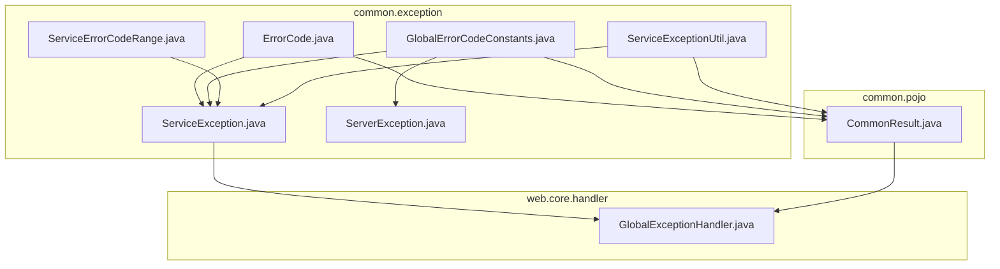
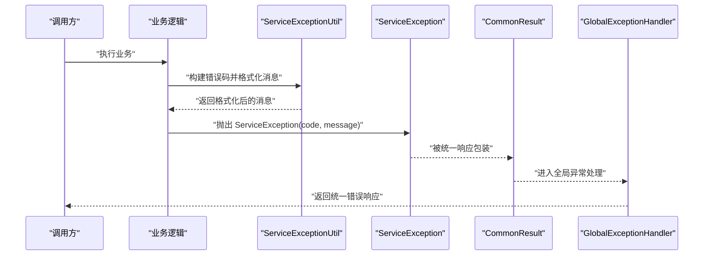
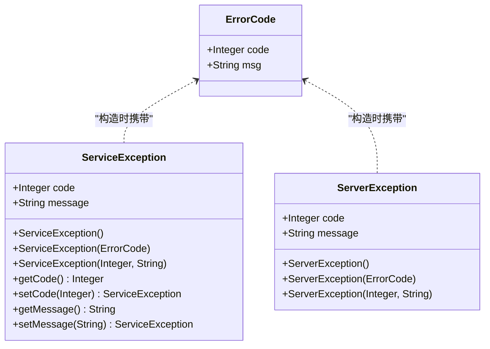
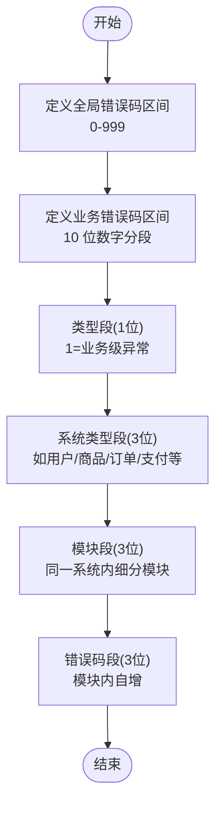
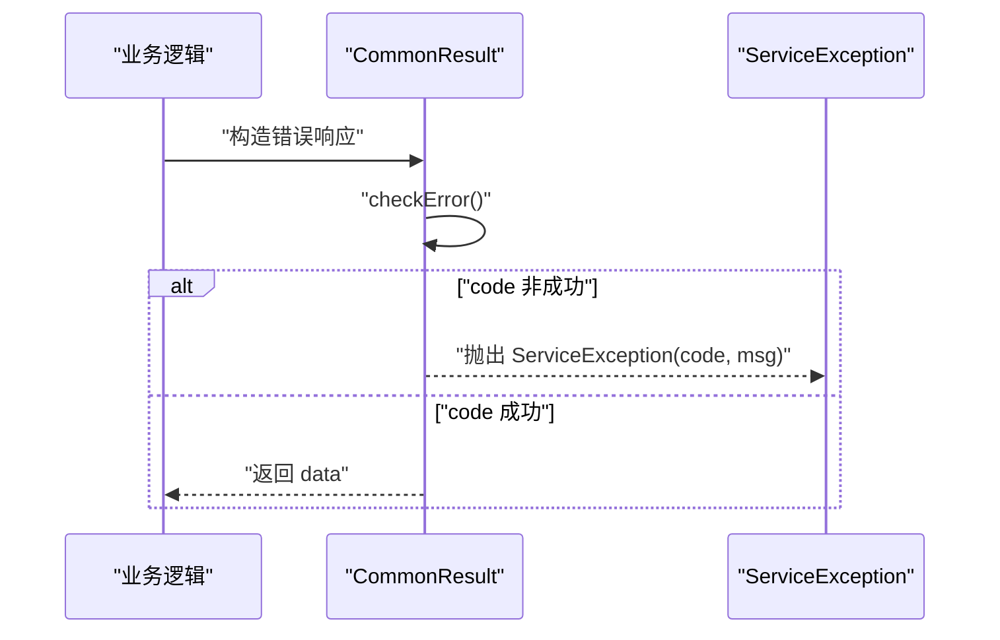
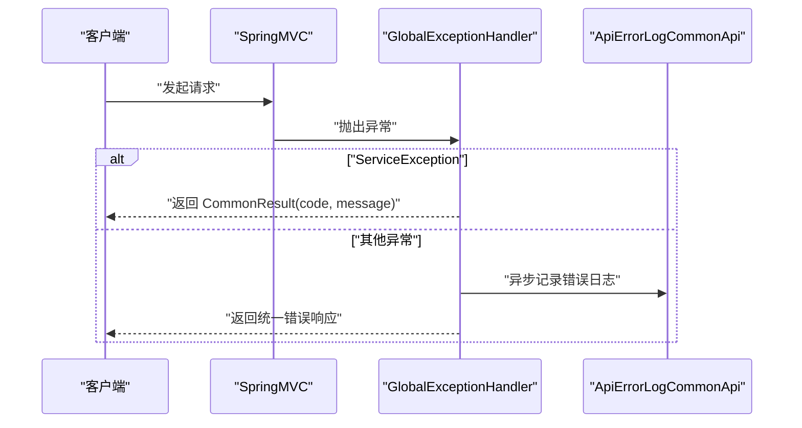
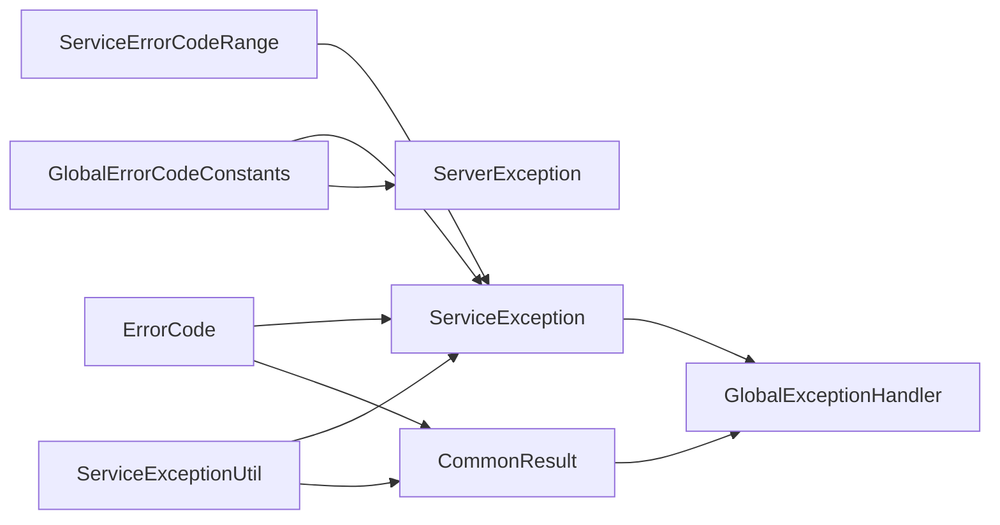

# 错误码体系

<cite>
**本文引用的文件**
- [ErrorCode.java](file://pandora-framework/pandora-common/src/main/java/net/ittimeline/pandora/framework/common/exception/ErrorCode.java)
- [ServiceException.java](file://pandora-framework/pandora-common/src/main/java/net/ittimeline/pandora/framework/common/exception/ServiceException.java)
- [ServerException.java](file://pandora-framework/pandora-common/src/main/java/net/ittimeline/pandora/framework/common/exception/ServerException.java)
- [GlobalErrorCodeConstants.java](file://pandora-framework/pandora-common/src/main/java/net/ittimeline/pandora/framework/common/exception/enums/GlobalErrorCodeConstants.java)
- [ServiceErrorCodeRange.java](file://pandora-framework/pandora-common/src/main/java/net/ittimeline/pandora/framework/common/exception/enums/ServiceErrorCodeRange.java)
- [ServiceExceptionUtil.java](file://pandora-framework/pandora-common/src/main/java/net/ittimeline/pandora/framework/common/exception/util/ServiceExceptionUtil.java)
- [CommonResult.java](file://pandora-framework/pandora-common/src/main/java/net/ittimeline/pandora/framework/common/pojo/CommonResult.java)
- [GlobalExceptionHandler.java](file://pandora-framework/pandora-spring-boot-starter-web/src/main/java/net/ittimeline/pandora/framework/web/core/handler/GlobalExceptionHandler.java)
</cite>

## 目录
1. [简介](#简介)
2. [项目结构](#项目结构)
3. [核心组件](#核心组件)
4. [架构总览](#架构总览)
5. [详细组件分析](#详细组件分析)
6. [依赖分析](#依赖分析)
7. [性能考虑](#性能考虑)
8. [故障排查指南](#故障排查指南)
9. [结论](#结论)
10. [附录](#附录)

## 简介
本文件系统性阐述“错误码体系”的设计与实现，覆盖以下关键点：
- ErrorCode 接口的设计理念与数据结构
- ServiceException 异常类的实现机制与最佳实践
- 全局错误码常量与业务错误码范围的定义规则与使用场景
- 错误码分类体系（系统级、业务级、参数验证）
- 与国际化、日志记录的集成方式
- 异常处理最佳实践与常见问题排查

## 项目结构
围绕错误码体系的核心代码位于框架模块的公共包与Web异常处理模块中，采用“分层+按职责”的组织方式：
- common.exception：错误码与异常定义
- common.exception.enums：错误码常量与范围
- common.exception.util：异常工具（消息格式化）
- common.pojo：统一响应包装
- web.core.handler：全局异常处理器



图表来源
- [ErrorCode.java:1-33](file://pandora-framework/pandora-common/src/main/java/net/ittimeline/pandora/framework/common/exception/ErrorCode.java#L1-L33)
- [ServiceException.java:1-64](file://pandora-framework/pandora-common/src/main/java/net/ittimeline/pandora/framework/common/exception/ServiceException.java#L1-L64)
- [ServerException.java:1-65](file://pandora-framework/pandora-common/src/main/java/net/ittimeline/pandora/framework/common/exception/ServerException.java#L1-L65)
- [GlobalErrorCodeConstants.java:1-42](file://pandora-framework/pandora-common/src/main/java/net/ittimeline/pandora/framework/common/exception/enums/GlobalErrorCodeConstants.java#L1-L42)
- [ServiceErrorCodeRange.java:1-48](file://pandora-framework/pandora-common/src/main/java/net/ittimeline/pandora/framework/common/exception/enums/ServiceErrorCodeRange.java#L1-L48)
- [ServiceExceptionUtil.java:1-85](file://pandora-framework/pandora-common/src/main/java/net/ittimeline/pandora/framework/common/exception/util/ServiceExceptionUtil.java#L1-L85)
- [CommonResult.java:1-123](file://pandora-framework/pandora-common/src/main/java/net/ittimeline/pandora/framework/common/pojo/CommonResult.java#L1-L123)
- [GlobalExceptionHandler.java:1-454](file://pandora-framework/pandora-spring-boot-starter-web/src/main/java/net/ittimeline/pandora/framework/web/core/handler/GlobalExceptionHandler.java#L1-L454)

章节来源
- [README.md:1-15](file://README.md#L1-L15)

## 核心组件
- 错误码对象：承载错误码与错误提示，用于统一对外返回与内部异常携带
- 业务异常：ServiceException，用于业务逻辑失败场景
- 服务器异常：ServerException，用于系统级异常
- 全局错误码常量：覆盖客户端错误、服务端错误、自定义错误等
- 业务错误码范围：约定10位业务错误码的分段规则
- 异常工具：格式化消息模板中的占位符，避免参数不匹配导致的运行时异常
- 统一响应：CommonResult，封装 code/msg/data，支持检查并抛出 ServiceException
- 全局异常处理器：将各类异常翻译为统一响应，并记录错误日志

章节来源
- [ErrorCode.java:17-32](file://pandora-framework/pandora-common/src/main/java/net/ittimeline/pandora/framework/common/exception/ErrorCode.java#L17-L32)
- [ServiceException.java:13-63](file://pandora-framework/pandora-common/src/main/java/net/ittimeline/pandora/framework/common/exception/ServiceException.java#L13-L63)
- [ServerException.java:14-64](file://pandora-framework/pandora-common/src/main/java/net/ittimeline/pandora/framework/common/exception/ServerException.java#L14-L64)
- [GlobalErrorCodeConstants.java:16-41](file://pandora-framework/pandora-common/src/main/java/net/ittimeline/pandora/framework/common/exception/enums/GlobalErrorCodeConstants.java#L16-L41)
- [ServiceErrorCodeRange.java:31-47](file://pandora-framework/pandora-common/src/main/java/net/ittimeline/pandora/framework/common/exception/enums/ServiceErrorCodeRange.java#L31-L47)
- [ServiceExceptionUtil.java:18-84](file://pandora-framework/pandora-common/src/main/java/net/ittimeline/pandora/framework/common/exception/util/ServiceExceptionUtil.java#L18-L84)
- [CommonResult.java:21-122](file://pandora-framework/pandora-common/src/main/java/net/ittimeline/pandora/framework/common/pojo/CommonResult.java#L21-L122)
- [GlobalExceptionHandler.java:57-453](file://pandora-framework/pandora-spring-boot-starter-web/src/main/java/net/ittimeline/pandora/framework/web/core/handler/GlobalExceptionHandler.java#L57-L453)

## 架构总览
错误码体系贯穿“异常定义—消息格式化—统一响应—全局处理—日志记录”的完整链路。



图表来源
- [ServiceExceptionUtil.java:22-37](file://pandora-framework/pandora-common/src/main/java/net/ittimeline/pandora/framework/common/exception/util/ServiceExceptionUtil.java#L22-L37)
- [ServiceException.java:34-42](file://pandora-framework/pandora-common/src/main/java/net/ittimeline/pandora/framework/common/exception/ServiceException.java#L34-L42)
- [CommonResult.java:62-72](file://pandora-framework/pandora-common/src/main/java/net/ittimeline/pandora/framework/common/pojo/CommonResult.java#L62-L72)
- [GlobalExceptionHandler.java:298-316](file://pandora-framework/pandora-spring-boot-starter-web/src/main/java/net/ittimeline/pandora/framework/web/core/handler/GlobalExceptionHandler.java#L298-L316)

## 详细组件分析

### 错误码对象与异常类
- 错误码对象：包含 code 与 msg，用于承载错误标识与提示
- 业务异常 ServiceException：继承 RuntimeException，便于在业务层快速抛出；支持从 ErrorCode 构造或直接传入 code/message
- 服务器异常 ServerException：用于系统级异常，与全局错误码常量配合



图表来源
- [ErrorCode.java:18-32](file://pandora-framework/pandora-common/src/main/java/net/ittimeline/pandora/framework/common/exception/ErrorCode.java#L18-L32)
- [ServiceException.java:14-63](file://pandora-framework/pandora-common/src/main/java/net/ittimeline/pandora/framework/common/exception/ServiceException.java#L14-L63)
- [ServerException.java:16-64](file://pandora-framework/pandora-common/src/main/java/net/ittimeline/pandora/framework/common/exception/ServerException.java#L16-L64)

章节来源
- [ErrorCode.java:17-32](file://pandora-framework/pandora-common/src/main/java/net/ittimeline/pandora/framework/common/exception/ErrorCode.java#L17-L32)
- [ServiceException.java:13-63](file://pandora-framework/pandora-common/src/main/java/net/ittimeline/pandora/framework/common/exception/ServiceException.java#L13-L63)
- [ServerException.java:14-64](file://pandora-framework/pandora-common/src/main/java/net/ittimeline/pandora/framework/common/exception/ServerException.java#L14-L64)

### 全局错误码常量与业务错误码范围
- 全局错误码常量：覆盖客户端错误（如 400、401、403 等）、服务端错误（如 500、501、502）、自定义错误（如 900、901）与未知错误（999），并以 0 作为成功标识
- 业务错误码范围：采用 10 位数字分四段，分别表示“类型-系统类型-模块-错误码”，并给出若干模块区间的预留说明，便于各子系统扩展



图表来源
- [GlobalErrorCodeConstants.java:16-41](file://pandora-framework/pandora-common/src/main/java/net/ittimeline/pandora/framework/common/exception/enums/GlobalErrorCodeConstants.java#L16-L41)
- [ServiceErrorCodeRange.java:31-47](file://pandora-framework/pandora-common/src/main/java/net/ittimeline/pandora/framework/common/exception/enums/ServiceErrorCodeRange.java#L31-L47)

章节来源
- [GlobalErrorCodeConstants.java:16-41](file://pandora-framework/pandora-common/src/main/java/net/ittimeline/pandora/framework/common/exception/enums/GlobalErrorCodeConstants.java#L16-L41)
- [ServiceErrorCodeRange.java:31-47](file://pandora-framework/pandora-common/src/main/java/net/ittimeline/pandora/framework/common/exception/enums/ServiceErrorCodeRange.java#L31-L47)

### 异常工具与消息格式化
- 提供 exception(...) 与 invalidParamException(...) 等便捷方法，支持将错误码与参数结合生成最终提示
- doFormat 使用 {} 作为占位符，避免 String.format 的参数不匹配风险；当参数过多或过少时记录日志并返回已处理片段

```mermaid
flowchart TD
A["输入: code, messagePattern, params"] --> B["预分配 StringBuilder"]
B --> C{"遍历 params 替换 {}"}
C --> |替换成功| D["追加替换后的片段"]
C --> |无更多 {}| E{"是否还有未替换的 {}"}
E --> |是| F["记录参数过少日志"]
E --> |否| G["追加剩余文本"]
D --> H{"是否还有参数未处理?"}
H --> |是| I["记录参数过多日志并截断返回"]
H --> |否| J["返回完整字符串"]
F --> K["返回已处理片段"]
G --> L["返回完整字符串"]
I --> M["结束"]
J --> M["结束"]
K --> M["结束"]
L --> M["结束"]
```

图表来源
- [ServiceExceptionUtil.java:30-82](file://pandora-framework/pandora-common/src/main/java/net/ittimeline/pandora/framework/common/exception/util/ServiceExceptionUtil.java#L30-L82)

章节来源
- [ServiceExceptionUtil.java:18-84](file://pandora-framework/pandora-common/src/main/java/net/ittimeline/pandora/framework/common/exception/util/ServiceExceptionUtil.java#L18-L84)

### 统一响应与异常检查
- CommonResult 封装 code/msg/data，提供 success/error/getCheckedData/checkError 等方法
- checkError 在错误码非成功时抛出 ServiceException，便于在调用链中快速中断并向上层传播



图表来源
- [CommonResult.java:101-117](file://pandora-framework/pandora-common/src/main/java/net/ittimeline/pandora/framework/common/pojo/CommonResult.java#L101-L117)

章节来源
- [CommonResult.java:21-122](file://pandora-framework/pandora-common/src/main/java/net/ittimeline/pandora/framework/common/pojo/CommonResult.java#L21-L122)

### 全局异常处理与日志记录
- GlobalExceptionHandler 将各类异常（含参数校验、权限不足、系统异常等）统一转换为 CommonResult
- 对 ServiceException 进行轻量日志输出（可忽略特定消息），对系统异常记录详细错误日志并异步上报



图表来源
- [GlobalExceptionHandler.java:113-341](file://pandora-framework/pandora-spring-boot-starter-web/src/main/java/net/ittimeline/pandora/framework/web/core/handler/GlobalExceptionHandler.java#L113-L341)

章节来源
- [GlobalExceptionHandler.java:57-453](file://pandora-framework/pandora-spring-boot-starter-web/src/main/java/net/ittimeline/pandora/framework/web/core/handler/GlobalExceptionHandler.java#L57-L453)

## 依赖分析
- 错误码对象与异常类之间为“携带关系”：ServiceException/ServerException 通过构造函数携带 ErrorCode 或 code/message
- 全局错误码常量与业务错误码范围为“规范约束”：前者决定系统可用的错误码区间，后者决定业务错误码的分段规则
- 异常工具与统一响应：ServiceExceptionUtil 与 CommonResult 分别负责消息格式化与响应封装
- 全局异常处理器：依赖统一响应与日志组件，将异常转换为对外一致的错误响应



图表来源
- [GlobalErrorCodeConstants.java:16-41](file://pandora-framework/pandora-common/src/main/java/net/ittimeline/pandora/framework/common/exception/enums/GlobalErrorCodeConstants.java#L16-L41)
- [ServiceErrorCodeRange.java:31-47](file://pandora-framework/pandora-common/src/main/java/net/ittimeline/pandora/framework/common/exception/enums/ServiceErrorCodeRange.java#L31-L47)
- [ErrorCode.java:18-32](file://pandora-framework/pandora-common/src/main/java/net/ittimeline/pandora/framework/common/exception/ErrorCode.java#L18-L32)
- [ServiceException.java:14-63](file://pandora-framework/pandora-common/src/main/java/net/ittimeline/pandora/framework/common/exception/ServiceException.java#L14-L63)
- [ServerException.java:16-64](file://pandora-framework/pandora-common/src/main/java/net/ittimeline/pandora/framework/common/exception/ServerException.java#L16-L64)
- [ServiceExceptionUtil.java:18-84](file://pandora-framework/pandora-common/src/main/java/net/ittimeline/pandora/framework/common/exception/util/ServiceExceptionUtil.java#L18-L84)
- [CommonResult.java:21-122](file://pandora-framework/pandora-common/src/main/java/net/ittimeline/pandora/framework/common/pojo/CommonResult.java#L21-L122)
- [GlobalExceptionHandler.java:57-453](file://pandora-framework/pandora-spring-boot-starter-web/src/main/java/net/ittimeline/pandora/framework/web/core/handler/GlobalExceptionHandler.java#L57-L453)

## 性能考虑
- 消息格式化：预分配 StringBuilder 容量，减少扩容开销；仅在参数不匹配时记录日志，避免频繁 IO
- 异常处理：对 ServiceException 进行轻量日志输出，避免堆栈打印带来的性能损耗
- 统一响应：通过 isSuccess 判断减少不必要的异常抛出，提升调用链效率

## 故障排查指南
- 参数校验异常：关注 MethodArgumentNotValidException、ConstraintViolationException 等，确保前端传参与后端校验一致
- 权限不足：AccessDeniedException 会被转换为 403，检查安全配置与用户权限
- 业务异常：ServiceException 由业务逻辑抛出，需核对错误码与消息模板
- 系统异常：默认兜底处理并记录详细日志，优先查看异常日志与追踪 ID

章节来源
- [GlobalExceptionHandler.java:127-341](file://pandora-framework/pandora-spring-boot-starter-web/src/main/java/net/ittimeline/pandora/framework/web/core/handler/GlobalExceptionHandler.java#L127-L341)

## 结论
本错误码体系通过“错误码对象—异常类—工具—统一响应—全局处理—日志记录”的闭环设计，实现了：
- 明确的错误分类与规范的业务错误码分段
- 可扩展的全局错误码常量与业务错误码范围
- 友好的消息格式化与异常传播机制
- 与 Web 层的无缝集成与完善的日志记录

## 附录

### 错误码分类与使用场景
- 系统级错误：由全局错误码常量定义，覆盖 HTTP 状态语义与系统保留码
- 业务级错误：使用业务错误码范围，按“类型-系统-模块-错误码”分段，便于模块化管理
- 参数验证错误：通过 invalidParamException 快速返回 400 类型错误

章节来源
- [GlobalErrorCodeConstants.java:16-41](file://pandora-framework/pandora-common/src/main/java/net/ittimeline/pandora/framework/common/exception/enums/GlobalErrorCodeConstants.java#L16-L41)
- [ServiceErrorCodeRange.java:31-47](file://pandora-framework/pandora-common/src/main/java/net/ittimeline/pandora/framework/common/exception/enums/ServiceErrorCodeRange.java#L31-L47)
- [ServiceExceptionUtil.java:35-37](file://pandora-framework/pandora-common/src/main/java/net/ittimeline/pandora/framework/common/exception/util/ServiceExceptionUtil.java#L35-L37)

### 国际化与日志集成
- 国际化：消息模板采用 {} 占位符，可在不同语言环境下替换为对应文案
- 日志：全局异常处理器对系统异常进行详细记录，并异步上报；对 ServiceException 进行轻量日志输出

章节来源
- [ServiceExceptionUtil.java:49-82](file://pandora-framework/pandora-common/src/main/java/net/ittimeline/pandora/framework/common/exception/util/ServiceExceptionUtil.java#L49-L82)
- [GlobalExceptionHandler.java:343-384](file://pandora-framework/pandora-spring-boot-starter-web/src/main/java/net/ittimeline/pandora/framework/web/core/handler/GlobalExceptionHandler.java#L343-L384)

### 最佳实践
- 定义业务错误码时遵循“类型-系统-模块-错误码”分段，避免冲突
- 使用 ServiceExceptionUtil 的格式化方法，保证消息一致性
- 在业务层使用 CommonResult.checkError/getCheckedData 快速传播异常
- 全局异常处理器仅做“翻译与兜底”，具体业务异常由业务层自行处理

章节来源
- [ServiceExceptionUtil.java:22-37](file://pandora-framework/pandora-common/src/main/java/net/ittimeline/pandora/framework/common/exception/util/ServiceExceptionUtil.java#L22-L37)
- [CommonResult.java:101-117](file://pandora-framework/pandora-common/src/main/java/net/ittimeline/pandora/framework/common/pojo/CommonResult.java#L101-L117)
- [GlobalExceptionHandler.java:298-316](file://pandora-framework/pandora-spring-boot-starter-web/src/main/java/net/ittimeline/pandora/framework/web/core/handler/GlobalExceptionHandler.java#L298-L316)