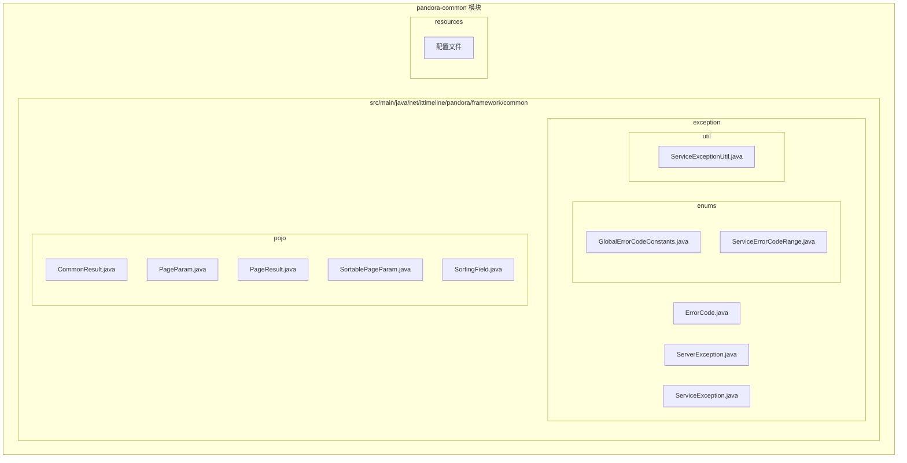
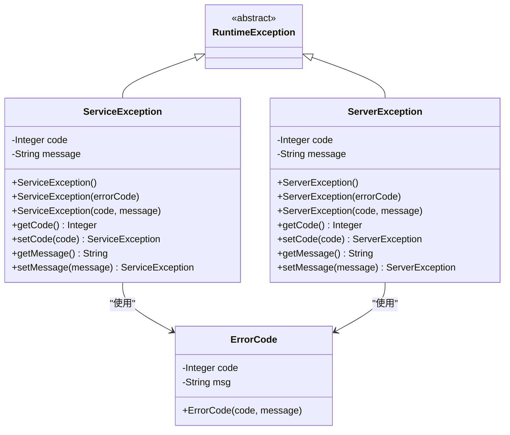
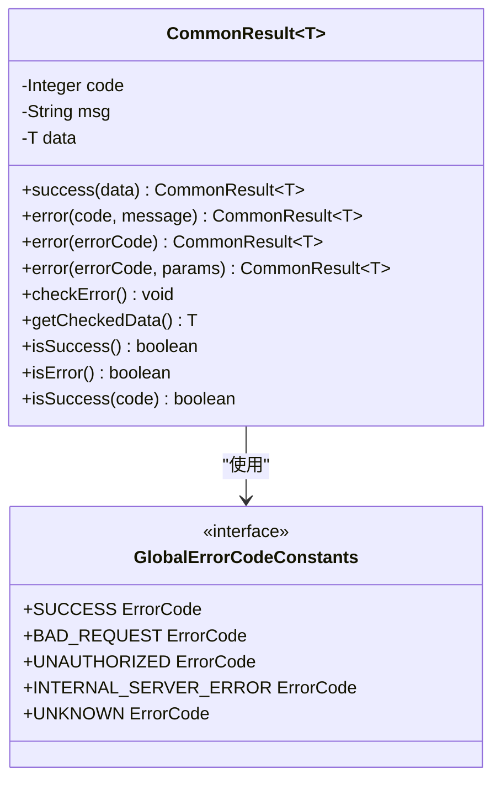
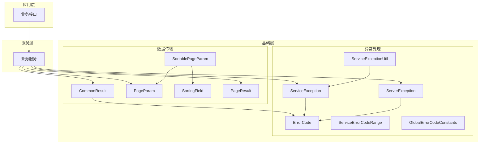
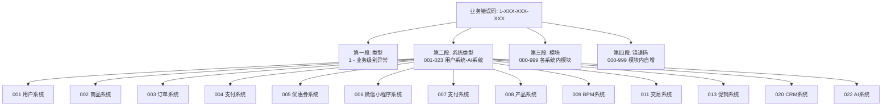
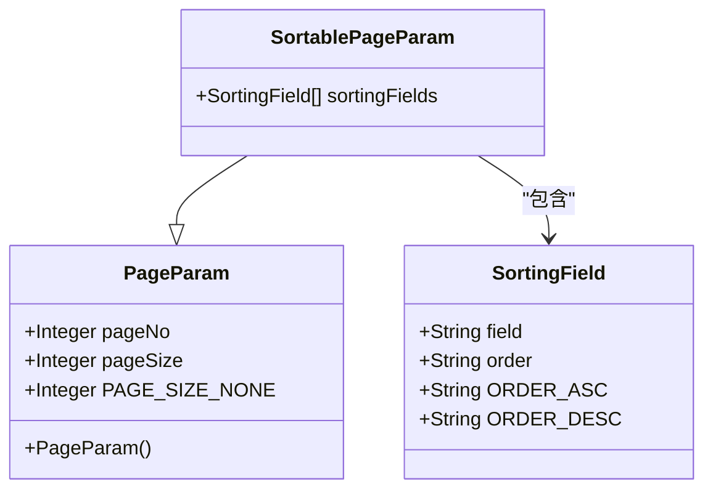
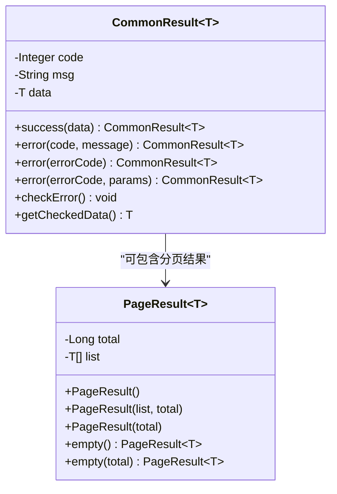
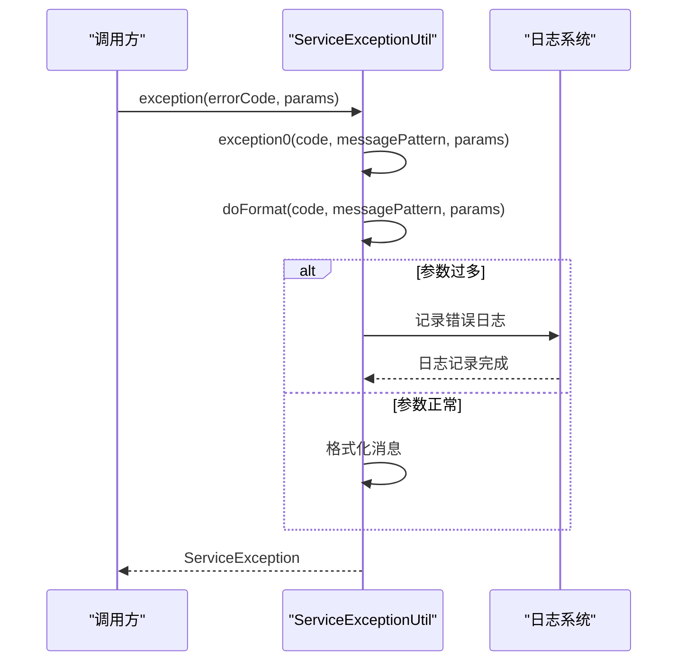
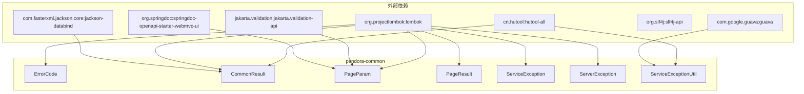

# pandora-common 基础模块

<cite>
**本文档引用的文件**
- [README.md](file://pandora-framework/pandora-common/README.md)
- [pom.xml](file://pandora-framework/pandora-common/pom.xml)
- [ErrorCode.java](file://pandora-framework/pandora-common/src/main/java/net/ittimeline/pandora/framework/common/exception/ErrorCode.java)
- [ServerException.java](file://pandora-framework/pandora-common/src/main/java/net/ittimeline/pandora/framework/common/exception/ServerException.java)
- [ServiceException.java](file://pandora-framework/pandora-common/src/main/java/net/ittimeline/pandora/framework/common/exception/ServiceException.java)
- [CommonResult.java](file://pandora-framework/pandora-common/src/main/java/net/ittimeline/pandora/framework/common/pojo/CommonResult.java)
- [PageParam.java](file://pandora-framework/pandora-common/src/main/java/net/ittimeline/pandora/framework/common/pojo/PageParam.java)
- [PageResult.java](file://pandora-framework/pandora-common/src/main/java/net/ittimeline/pandora/framework/common/pojo/PageResult.java)
- [SortablePageParam.java](file://pandora-framework/pandora-common/src/main/java/net/ittimeline/pandora/framework/common/pojo/SortablePageParam.java)
- [SortingField.java](file://pandora-framework/pandora-common/src/main/java/net/ittimeline/pandora/framework/common/pojo/SortingField.java)
- [GlobalErrorCodeConstants.java](file://pandora-framework/pandora-common/src/main/java/net/ittimeline/pandora/framework/common/exception/enums/GlobalErrorCodeConstants.java)
- [ServiceErrorCodeRange.java](file://pandora-framework/pandora-common/src/main/java/net/ittimeline/pandora/framework/common/exception/enums/ServiceErrorCodeRange.java)
- [ServiceExceptionUtil.java](file://pandora-framework/pandora-common/src/main/java/net/ittimeline/pandora/framework/common/exception/util/ServiceExceptionUtil.java)
</cite>

## 目录
1. [简介](#简介)
2. [项目结构](#项目结构)
3. [核心组件](#核心组件)
4. [架构概览](#架构概览)
5. [详细组件分析](#详细组件分析)
6. [依赖关系分析](#依赖关系分析)
7. [性能考虑](#性能考虑)
8. [故障排除指南](#故障排除指南)
9. [结论](#结论)

## 简介

pandora-common 是 pandora-cloud 框架的基础模块，提供了一套完整的异常处理、统一响应、分页查询等基础设施。该模块采用分层设计，包含异常体系、POJO 数据传输对象、工具类等核心组件，为上层应用提供了标准化的开发基础。

该模块的主要目标是：
- 提供统一的异常处理机制
- 标准化 API 响应格式
- 支持分页查询和排序功能
- 维护清晰的错误码管理策略

## 项目结构

pandora-common 模块遵循标准的 Maven 项目结构，主要分为以下层次：

**图表来源**
- [pom.xml:1-74](file://pandora-framework/pandora-common/pom.xml#L1-L74)
- [README.md:1-33](file://pandora-framework/pandora-common/README.md#L1-L33)

**章节来源**
- [pom.xml:1-74](file://pandora-framework/pandora-common/pom.xml#L1-L74)
- [README.md:1-33](file://pandora-framework/pandora-common/README.md#L1-L33)

## 核心组件

### 异常处理体系

pandora-common 提供了完整的异常处理机制，包括全局异常和业务异常两大类：

**图表来源**
- [ServiceException.java:1-64](file://pandora-framework/pandora-common/src/main/java/net/ittimeline/pandora/framework/common/exception/ServiceException.java#L1-L64)
- [ServerException.java:1-65](file://pandora-framework/pandora-common/src/main/java/net/ittimeline/pandora/framework/common/exception/ServerException.java#L1-L65)
- [ErrorCode.java:1-33](file://pandora-framework/pandora-common/src/main/java/net/ittimeline/pandora/framework/common/exception/ErrorCode.java#L1-L33)

### 统一响应模型

CommonResult 提供了标准化的 API 响应格式，支持泛型数据传输：

**图表来源**
- [CommonResult.java:1-123](file://pandora-framework/pandora-common/src/main/java/net/ittimeline/pandora/framework/common/pojo/CommonResult.java#L1-L123)
- [GlobalErrorCodeConstants.java:1-42](file://pandora-framework/pandora-common/src/main/java/net/ittimeline/pandora/framework/common/exception/enums/GlobalErrorCodeConstants.java#L1-L42)

**章节来源**
- [ServiceException.java:1-64](file://pandora-framework/pandora-common/src/main/java/net/ittimeline/pandora/framework/common/exception/ServiceException.java#L1-L64)
- [ServerException.java:1-65](file://pandora-framework/pandora-common/src/main/java/net/ittimeline/pandora/framework/common/exception/ServerException.java#L1-L65)
- [ErrorCode.java:1-33](file://pandora-framework/pandora-common/src/main/java/net/ittimeline/pandora/framework/common/exception/ErrorCode.java#L1-L33)
- [CommonResult.java:1-123](file://pandora-framework/pandora-common/src/main/java/net/ittimeline/pandora/framework/common/pojo/CommonResult.java#L1-L123)

## 架构概览

pandora-common 采用分层架构设计，各组件之间职责明确，耦合度低：

**图表来源**
- [pom.xml:26-71](file://pandora-framework/pandora-common/pom.xml#L26-L71)
- [CommonResult.java:1-123](file://pandora-framework/pandora-common/src/main/java/net/ittimeline/pandora/framework/common/pojo/CommonResult.java#L1-L123)
- [ServiceException.java:1-64](file://pandora-framework/pandora-common/src/main/java/net/ittimeline/pandora/framework/common/exception/ServiceException.java#L1-L64)

## 详细组件分析

### 错误码管理系统

错误码系统采用分层设计，确保全局错误码和业务错误码的分离管理：

#### 全局错误码常量

全局错误码范围为 0-999，涵盖客户端错误、服务端错误和自定义错误：

| 错误码范围 | 类型 | 示例错误码 | 描述 |
|-----------|------|------------|------|
| 0 | 成功 | SUCCESS | 操作成功 |
| 400 | 客户端错误 | BAD_REQUEST | 请求参数不正确 |
| 401 | 客户端错误 | UNAUTHORIZED | 账号未登录 |
| 403 | 客户端错误 | FORBIDDEN | 没有该操作权限 |
| 404 | 客户端错误 | NOT_FOUND | 请求未找到 |
| 500 | 服务端错误 | INTERNAL_SERVER_ERROR | 系统异常 |
| 501 | 服务端错误 | NOT_IMPLEMENTED | 功能未实现/未开启 |
| 900 | 自定义错误 | REPEATED_REQUESTS | 重复请求，请稍后重试 |
| 999 | 自定义错误 | UNKNOWN | 未知错误 |

#### 业务错误码区间规划

业务错误码采用 10 位数字设计，分为四个段落：

**图表来源**
- [ServiceErrorCodeRange.java:31-47](file://pandora-framework/pandora-common/src/main/java/net/ittimeline/pandora/framework/common/exception/enums/ServiceErrorCodeRange.java#L31-L47)

**章节来源**
- [GlobalErrorCodeConstants.java:1-42](file://pandora-framework/pandora-common/src/main/java/net/ittimeline/pandora/framework/common/exception/enums/GlobalErrorCodeConstants.java#L1-L42)
- [ServiceErrorCodeRange.java:1-48](file://pandora-framework/pandora-common/src/main/java/net/ittimeline/pandora/framework/common/exception/enums/ServiceErrorCodeRange.java#L1-L48)

### 分页查询系统

分页查询系统支持基本分页和可排序分页两种模式：

#### 基本分页参数

PageParam 提供标准的分页查询参数：

**图表来源**
- [PageParam.java:1-43](file://pandora-framework/pandora-common/src/main/java/net/ittimeline/pandora/framework/common/pojo/PageParam.java#L1-L43)
- [SortablePageParam.java:1-26](file://pandora-framework/pandora-common/src/main/java/net/ittimeline/pandora/framework/common/pojo/SortablePageParam.java#L1-L26)
- [SortingField.java:1-39](file://pandora-framework/pandora-common/src/main/java/net/ittimeline/pandora/framework/common/pojo/SortingField.java#L1-L39)

#### 分页结果封装

PageResult 提供标准的分页结果封装：

**图表来源**
- [PageResult.java:1-49](file://pandora-framework/pandora-common/src/main/java/net/ittimeline/pandora/framework/common/pojo/PageResult.java#L1-L49)
- [CommonResult.java:1-123](file://pandora-framework/pandora-common/src/main/java/net/ittimeline/pandora/framework/common/pojo/CommonResult.java#L1-L123)

**章节来源**
- [PageParam.java:1-43](file://pandora-framework/pandora-common/src/main/java/net/ittimeline/pandora/framework/common/pojo/PageParam.java#L1-L43)
- [PageResult.java:1-49](file://pandora-framework/pandora-common/src/main/java/net/ittimeline/pandora/framework/common/pojo/PageResult.java#L1-L49)
- [SortablePageParam.java:1-26](file://pandora-framework/pandora-common/src/main/java/net/ittimeline/pandora/framework/common/pojo/SortablePageParam.java#L1-L26)
- [SortingField.java:1-39](file://pandora-framework/pandora-common/src/main/java/net/ittimeline/pandora/framework/common/pojo/SortingField.java#L1-L39)

### 工具类系统

ServiceExceptionUtil 提供了异常信息格式化的工具方法：

**图表来源**
- [ServiceExceptionUtil.java:22-37](file://pandora-framework/pandora-common/src/main/java/net/ittimeline/pandora/framework/common/exception/util/ServiceExceptionUtil.java#L22-L37)
- [ServiceExceptionUtil.java:49-82](file://pandora-framework/pandora-common/src/main/java/net/ittimeline/pandora/framework/common/exception/util/ServiceExceptionUtil.java#L49-L82)

**章节来源**
- [ServiceExceptionUtil.java:1-85](file://pandora-framework/pandora-common/src/main/java/net/ittimeline/pandora/framework/common/exception/util/ServiceExceptionUtil.java#L1-L85)

## 依赖关系分析

pandora-common 模块的依赖关系体现了其作为基础设施模块的特点：

**图表来源**
- [pom.xml:26-71](file://pandora-framework/pandora-common/pom.xml#L26-L71)

**章节来源**
- [pom.xml:1-74](file://pandora-framework/pandora-common/pom.xml#L1-L74)

## 性能考虑

### 内存优化策略

1. **StringBuilder 预分配容量**：在 ServiceExceptionUtil 中预分配 StringBuilder 容量，避免字符串拼接时的扩容开销
2. **静态常量优化**：PageParam 中使用静态常量存储默认值，减少对象创建
3. **泛型缓存**：CommonResult 使用泛型设计，避免不必要的类型转换

### 序列化优化

1. **JsonIgnore 注解**：在 CommonResult 中使用 @JsonIgnore 注解避免不必要的序列化字段
2. **延迟计算**：isSuccess() 和 isError() 方法采用延迟计算策略

### 错误处理优化

1. **异常快速失败**：ServiceExceptionUtil 在参数不匹配时快速返回，避免无效计算
2. **日志分级**：使用 SLF4J 进行日志记录，支持不同级别的错误处理

## 故障排除指南

### 常见问题及解决方案

#### 1. 分页参数验证失败

**问题描述**：当 pageNo 或 pageSize 参数不符合要求时抛出异常

**解决方案**：
- pageNo 必须大于等于 1
- pageSize 必须在 1-200 范围内
- 特殊值 PAGE_SIZE_NONE = -1 表示不分页

#### 2. 错误码冲突

**问题描述**：业务错误码与全局错误码冲突

**解决方案**：
- 全局错误码范围：0-999
- 业务错误码范围：1,000,000,000+
- 遵循 10 位数字的分段设计

#### 3. 异常信息格式化失败

**问题描述**：占位符数量与参数数量不匹配

**解决方案**：
- 使用 {} 作为占位符
- ServiceExceptionUtil 会记录错误日志并返回已处理部分

**章节来源**
- [PageParam.java:32-41](file://pandora-framework/pandora-common/src/main/java/net/ittimeline/pandora/framework/common/pojo/PageParam.java#L32-L41)
- [ServiceExceptionUtil.java:49-82](file://pandora-framework/pandora-common/src/main/java/net/ittimeline/pandora/framework/common/exception/util/ServiceExceptionUtil.java#L49-L82)

## 结论

pandora-common 基础模块通过精心设计的架构和完善的组件体系，为 pandora-cloud 框架提供了坚实的基础设施支持。该模块的主要优势包括：

1. **标准化设计**：统一的异常处理、响应格式和分页查询规范
2. **扩展性强**：模块化设计便于功能扩展和维护
3. **性能优化**：针对常见场景进行了性能优化
4. **易于使用**：简洁的 API 设计降低了使用成本

该模块的成功实施为整个框架的稳定性和可维护性奠定了坚实基础，是构建企业级应用的理想选择。