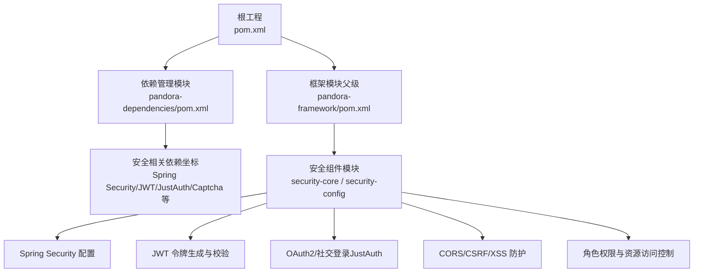
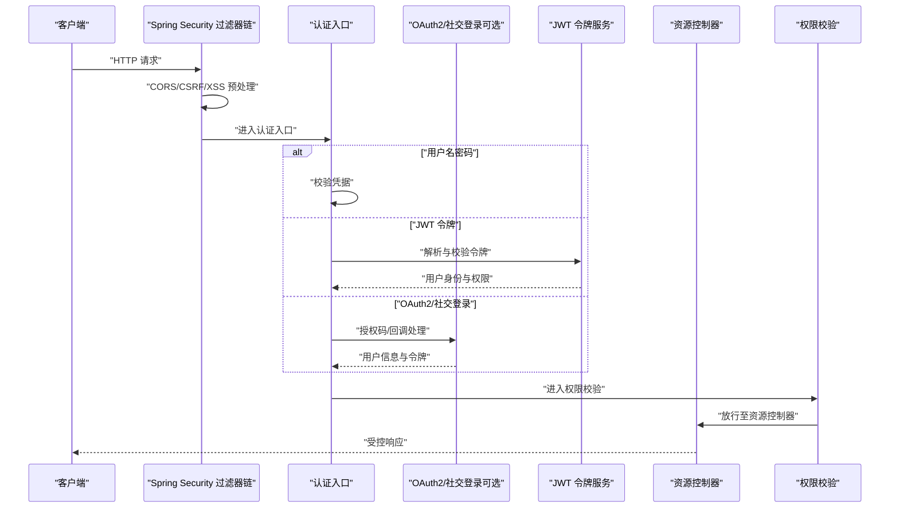
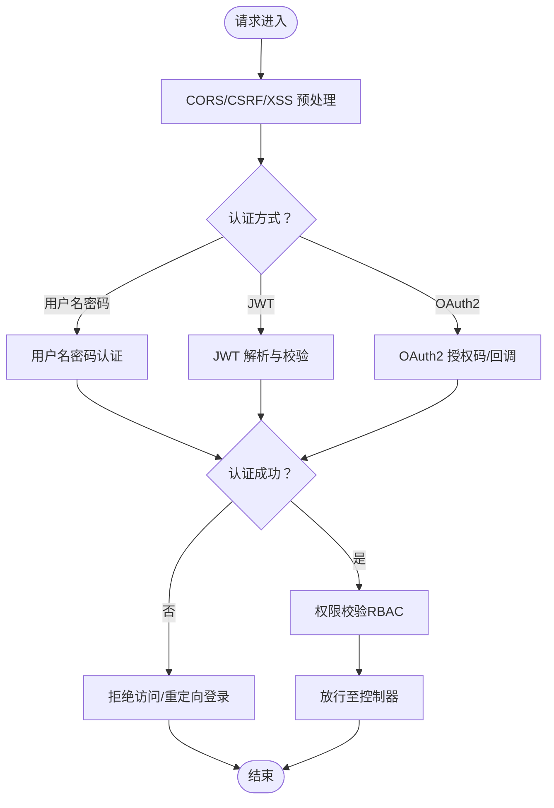
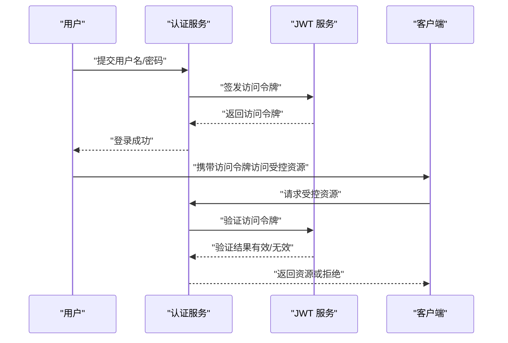
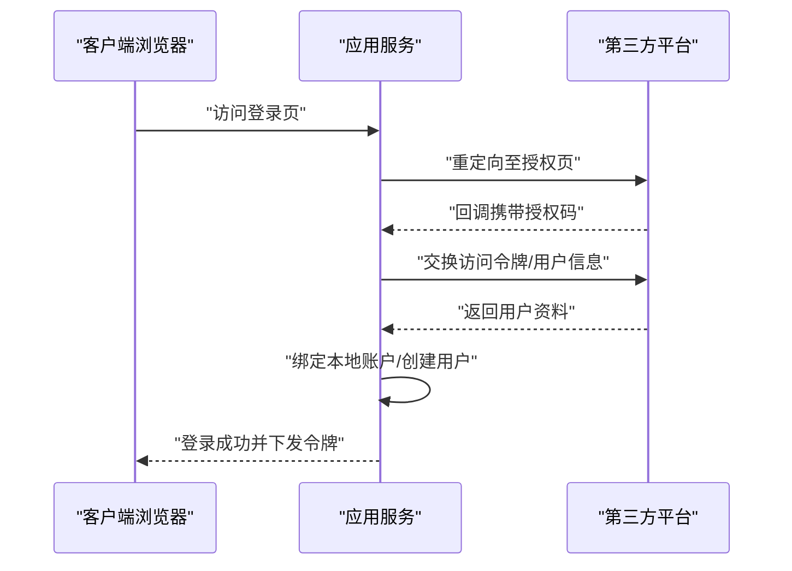
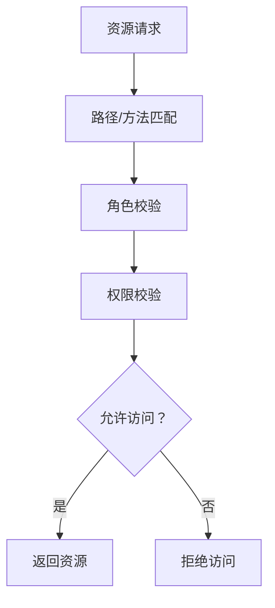
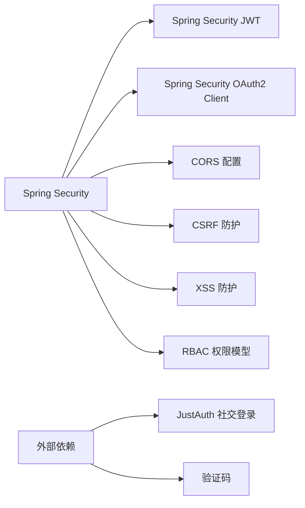

# 安全组件

<cite>
**本文引用的文件**
- [pom.xml](file://pom.xml)
- [pandora-dependencies/pom.xml](file://pandora-dependencies/pom.xml)
- [pandora-framework/pom.xml](file://pandora-framework/pom.xml)
</cite>

## 目录
1. [引言](#引言)
2. [项目结构](#项目结构)
3. [核心组件](#核心组件)
4. [架构总览](#架构总览)
5. [详细组件分析](#详细组件分析)
6. [依赖关系分析](#依赖关系分析)
7. [性能考虑](#性能考虑)
8. [故障排查指南](#故障排查指南)
9. [结论](#结论)
10. [附录](#附录)

## 引言
本文件面向“安全组件”的综合文档目标，围绕 JWT 与 OAuth2 认证授权机制的集成与配置、Spring Security 的配置与拦截器设置、权限控制策略、用户认证流程、令牌生成与验证机制、跨域资源共享（CORS）、CSRF 防护、XSS 防护、角色权限管理、资源访问控制、会话管理以及合规性要求进行系统化说明。  
鉴于当前仓库为基础设施脚手架工程，尚未包含具体的安全实现代码，本文以“可落地的实施蓝图”形式提供：如何在现有依赖基础上引入 Spring Security、JWT、OAuth2（含 JustAuth 社交登录）、验证码、CORS/CSRF/XSS 防护、会话与权限控制等能力，并给出最佳实践与合规建议。

## 项目结构
该项目采用多模块聚合结构，顶层 POM 管理模块与版本，pandora-dependencies 提供统一依赖版本与第三方组件坐标，pandora-framework 作为技术组件的父模块，后续可在其中新增“安全组件”子模块（如 core 与 config），并按需引入 Spring Security、JWT、OAuth2、验证码等依赖。

图表来源
- [pom.xml:11-14](file://pom.xml#L11-L14)
- [pandora-dependencies/pom.xml:108-137](file://pandora-dependencies/pom.xml#L108-L137)
- [pandora-framework/pom.xml:15-24](file://pandora-framework/pom.xml#L15-L24)

章节来源
- [pom.xml:11-14](file://pom.xml#L11-L14)
- [pandora-framework/pom.xml:15-24](file://pandora-framework/pom.xml#L15-L24)

## 核心组件
- Spring Security 集成：提供基于 Web 的认证与授权、拦截器链、过滤器链、内存/数据库用户详情与权限加载、密码编码策略、会话管理、CSRF/XSS/CORS 防护等。
- JWT 令牌：用于无状态认证，包含签发、解析、签名算法选择、过期时间、刷新策略、黑名单/白名单缓存等。
- OAuth2/社交登录：通过 JustAuth 实现第三方登录（如微信、企业微信等），结合 Spring Security 完成授权码流程与用户绑定。
- 验证码：登录场景加入图形验证码，降低暴力破解风险。
- 权限控制：RBAC 角色权限模型，基于路径/方法注解的细粒度访问控制。
- 会话与并发控制：单点登录限制、强制下线、在线会话统计与踢人。
- 合规与审计：统一鉴权日志、敏感操作审计、令牌生命周期与密钥轮换策略。

章节来源
- [pandora-dependencies/pom.xml:551-567](file://pandora-dependencies/pom.xml#L551-L567)
- [pandora-dependencies/pom.xml:469-472](file://pandora-dependencies/pom.xml#L469-L472)

## 架构总览
下图展示从客户端到后端服务的整体安全流程：请求进入 Spring Security 过滤器链，进行 CORS/CSRF/XSS 预处理；随后进入认证阶段（用户名密码、JWT、OAuth2），成功后进入授权阶段（基于角色/资源的访问控制），最终返回受控资源。

图表来源
- [pandora-dependencies/pom.xml:551-567](file://pandora-dependencies/pom.xml#L551-L567)
- [pandora-dependencies/pom.xml:469-472](file://pandora-dependencies/pom.xml#L469-L472)

## 详细组件分析

### Spring Security 配置与拦截器
- 过滤器链：SecurityFilterChain 定义请求匹配规则、WebSecurityCustomizer、Cors/CSRF/XSS 预处理、异常处理策略。
- 认证入口：UsernamePasswordAuthenticationFilter、JWTAuthenticationFilter、OAuth2LoginAuthenticationFilter。
- 用户详情与权限：UserDetailsService 加载用户、GrantedAuthority 权限集合、密码编码器。
- 会话管理：SessionCreationPolicy（无状态/有状态）、最大并发数、强制下线、会话超时。
- 跨域与防护：CORS 配置、CSRF 关闭（无状态场景）或 Token CSRF、X-XSS-Protection、Content-Security-Policy 头部。
- 异常与统一响应：AccessDeniedException、AuthenticationException 统一处理。

章节来源
- [pandora-dependencies/pom.xml:118-137](file://pandora-dependencies/pom.xml#L118-L137)

### JWT 令牌生成与验证
- 签名算法：推荐 HS256 或 RS256；密钥管理遵循最小暴露原则，生产环境使用 KMS 或硬件安全模块。
- 令牌结构：头部（alg、typ）、载荷（sub、iss、aud、exp、iat、roles、perms 等）、签名。
- 生命周期：短期访问令牌（分钟级）、长期刷新令牌（天/月级），刷新令牌单独存储与轮换。
- 刷新策略：刷新令牌仅用于换取新访问令牌，不直接访问资源。
- 黑名单/白名单：在线状态变更时将旧令牌加入缓存黑名单，或维护白名单允许列表。
- 密钥轮换：定期轮换密钥，平滑过渡期间允许新旧密钥并行验证。

图表来源
- [pandora-dependencies/pom.xml:84-88](file://pandora-dependencies/pom.xml#L84-L88)

### OAuth2 与社交登录（JustAuth）
- 适配平台：微信、企业微信、钉钉、Google、GitHub 等。
- 授权流程：重定向至第三方授权页 -> 回调获取授权码 -> 交换访问令牌 -> 获取用户信息 -> 绑定本地账户。
- 与 Spring Security 集成：自定义 OAuth2ClientAuthenticationToken、OAuth2AuthorizedClientService、UserDetails 与权限映射。
- 风险控制：限制重复授权、绑定唯一标识、记录授权日志、失败重试限制。

图表来源
- [pandora-dependencies/pom.xml:551-567](file://pandora-dependencies/pom.xml#L551-L567)

### 角色权限管理与资源访问控制
- RBAC 模型：用户-角色-权限-资源，权限可继承与覆盖。
- 控制方式：路径匹配（AntMatcher）、方法注解（@PreAuthorize/@PostAuthorize）、表达式 SpEL。
- 最小权限：默认拒绝（Deny by default），显式授权（Allow by explicit grant）。
- 动态权限：基于用户上下文动态计算权限，结合缓存提升性能。

章节来源
- [pandora-dependencies/pom.xml:118-137](file://pandora-dependencies/pom.xml#L118-L137)

### 会话管理与并发控制
- 无状态：优先使用 JWT，关闭服务器端 Session。
- 有状态：SessionCreationPolicy.NEVER 或 STATELESS；限制最大并发登录数、强制下线旧会话。
- 在线统计：Redis/数据库记录在线会话，支持踢人与批量下线。
- 会话超时：短会话配合刷新令牌，长会话严格审计。

章节来源
- [pandora-dependencies/pom.xml:118-137](file://pandora-dependencies/pom.xml#L118-L137)

### CORS、CSRF 与 XSS 防护
- CORS：允许来源白名单、预检缓存、凭证携带、安全头设置。
- CSRF：无状态场景关闭 CSRF，或采用 SameSite Cookie、同步令牌（Anti-CSRF Token）。
- XSS：响应头安全策略、输入输出转义、CSP、内容类型与编码规范。

章节来源
- [pandora-dependencies/pom.xml:162-184](file://pandora-dependencies/pom.xml#L162-L184)

### 加密算法选择与密钥管理最佳实践
- 对称加密：AES-GCM（带认证），密钥长度至少 256 位。
- 非对称加密：RSA-OAEP 或 ECDSA，密钥长度至少 2048 位（RSA）或 P-256（ECDSA）。
- JWT 签名：HS256（共享密钥）或 RS256（公私钥对），生产建议 RS256 并使用硬件安全模块。
- 密钥轮换：双密钥并行期、旧密钥仅用于解密，新密钥用于签发；定期审计与销毁旧密钥。
- 存储与传输：密钥只读存储、最小暴露面、传输加密、访问审计。

章节来源
- [pandora-dependencies/pom.xml:569-579](file://pandora-dependencies/pom.xml#L569-L579)

### 安全配置示例与合规性要求
- 配置要点：启用 HTTPS、安全响应头、最小权限、审计日志、异常统一处理。
- 合规要求：GDPR（数据主体权利）、网络安全等级保护、数据最小化、可追溯性与不可否认性。
- 审计与监控：登录/登出、敏感操作、权限变更、异常事件的审计日志与告警。

章节来源
- [pandora-dependencies/pom.xml:118-137](file://pandora-dependencies/pom.xml#L118-L137)

## 依赖关系分析
- Spring 生态：Spring Boot、Spring Security、Spring Security OAuth2 Client、Spring Security JWT。
- 第三方登录：JustAuth 及其 Spring Boot Starter。
- 验证码：captcha-spring-boot-starter。
- 其他：Knife4j/SpringDoc（API 文档）、SkyWalking（链路追踪）、Admin（监控）等。

图表来源
- [pandora-dependencies/pom.xml:118-137](file://pandora-dependencies/pom.xml#L118-L137)
- [pandora-dependencies/pom.xml:551-567](file://pandora-dependencies/pom.xml#L551-L567)
- [pandora-dependencies/pom.xml:469-472](file://pandora-dependencies/pom.xml#L469-L472)

章节来源
- [pandora-dependencies/pom.xml:108-137](file://pandora-dependencies/pom.xml#L108-L137)
- [pandora-dependencies/pom.xml:551-567](file://pandora-dependencies/pom.xml#L551-L567)
- [pandora-dependencies/pom.xml:469-472](file://pandora-dependencies/pom.xml#L469-L472)

## 性能考虑
- 无状态认证：减少服务器端会话存储，提高横向扩展能力。
- 缓存策略：权限与用户详情缓存、JWT 黑名单缓存、验证码缓存。
- 异步与限流：登录/注册接口限流、异步发送验证码、异步审计日志。
- CDN 与静态资源：静态资源走 CDN，减少应用压力。

## 故障排查指南
- 认证失败：检查密码编码器一致性、用户是否存在、账户是否锁定。
- 令牌无效：核对签名算法、密钥是否正确、过期时间、签发/接收方是否匹配。
- OAuth2 回调失败：确认重定向地址、授权码有效期、第三方平台配置。
- CORS 失败：核对允许来源、凭证、预检缓存与安全头。
- CSRF/XSS：确认响应头、Cookie 属性（Secure/SameSite）、输入输出处理。

章节来源
- [pandora-dependencies/pom.xml:118-137](file://pandora-dependencies/pom.xml#L118-L137)

## 结论
本文件提供了在当前脚手架工程中集成 JWT 与 OAuth2 的完整安全蓝图：从依赖引入、Spring Security 配置、拦截器与过滤器链、认证与授权流程、令牌与密钥管理、CORS/CSRF/XSS 防护、角色权限与资源控制、会话管理到合规与审计。建议在 pandora-framework 下新增“安全组件”模块，按模块化方式逐步落地上述能力，并持续完善安全运营与演练。

## 附录
- 术语表：JWT（JSON Web Token）、OAuth2（开放授权协议）、RBAC（基于角色的访问控制）、CORS（跨域资源共享）、CSRF（跨站请求伪造）、XSS（跨站脚本攻击）。
- 参考实现位置：在 pandora-dependencies 中已提供 JustAuth、验证码等依赖坐标，可在安全组件模块中按需引入并组合使用。