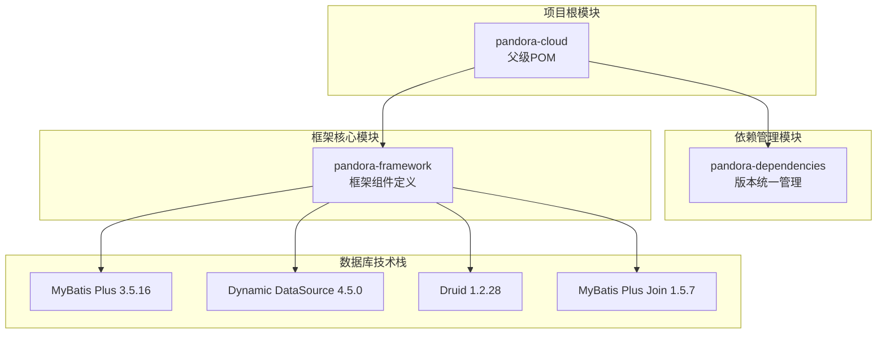
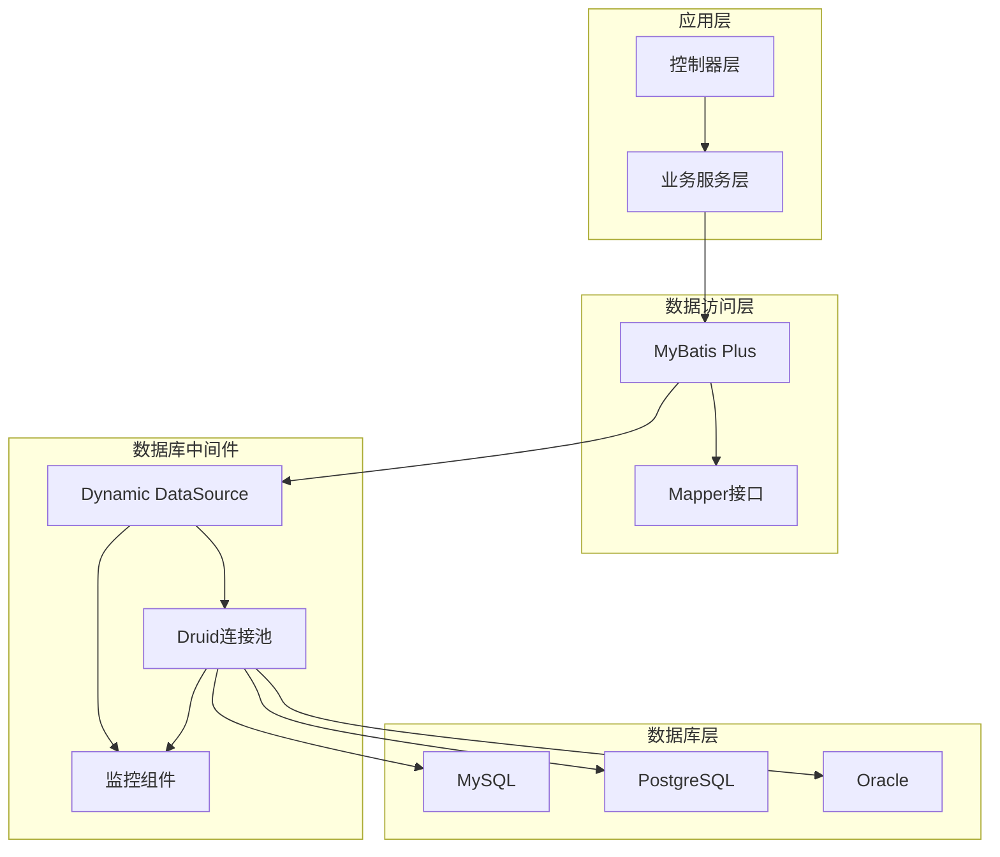
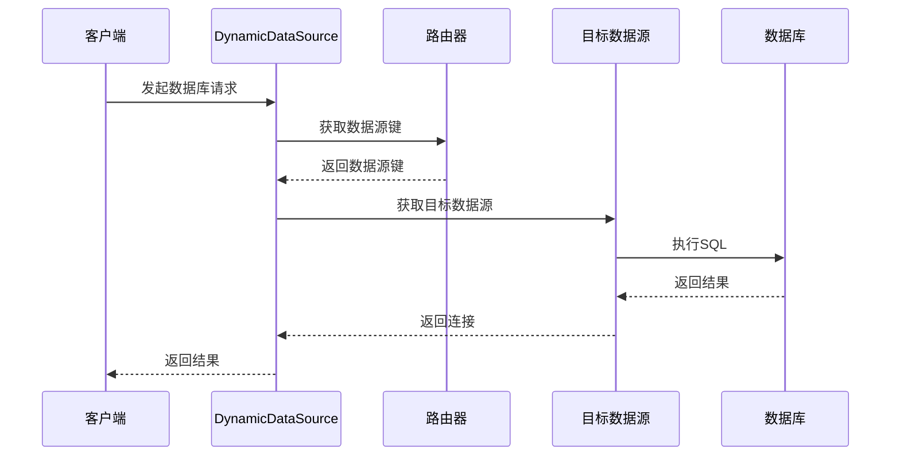
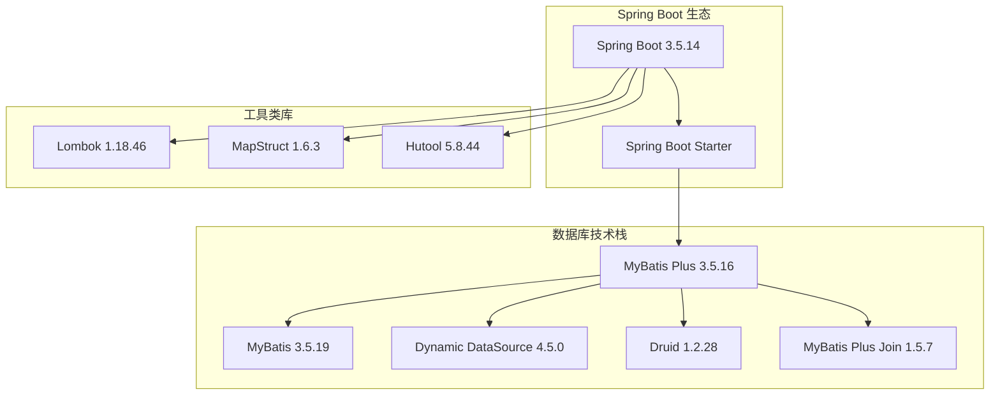

# 数据库组件

<cite>
**本文引用的文件**
- [pom.xml](file://pom.xml)
- [pandora-dependencies/pom.xml](file://pandora-dependencies/pom.xml)
- [pandora-framework/pom.xml](file://pandora-framework/pom.xml)
</cite>

## 目录
1. [简介](#简介)
2. [项目结构](#项目结构)
3. [核心组件](#核心组件)
4. [架构概览](#架构概览)
5. [详细组件分析](#详细组件分析)
6. [依赖关系分析](#依赖关系分析)
7. [性能考虑](#性能考虑)
8. [故障排查指南](#故障排查指南)
9. [结论](#结论)
10. [附录](#附录)

## 简介

本项目是一个基于 Spring Boot 3.5.14 的现代化微服务架构脚手架，专注于数据库组件的集成与优化。项目集成了多个业界领先的数据库相关技术栈，包括 MyBatis Plus ORM 框架、Dynamic DataSource 多数据源切换机制、Druid 连接池以及 MyBatis Plus Join 联表查询扩展。

该项目旨在为开发者提供一套完整、高性能、易维护的数据库解决方案，涵盖从基础配置到高级优化的全方位需求。通过模块化的架构设计，开发者可以轻松地在现有基础上进行扩展和定制。

## 项目结构

项目采用多模块架构设计，主要包含以下核心模块：



**图表来源**
- [pom.xml:11-14](file://pom.xml#L11-L14)
- [pandora-dependencies/pom.xml:65-72](file://pandora-dependencies/pom.xml#L65-L72)

**章节来源**
- [pom.xml:1-150](file://pom.xml#L1-L150)
- [pandora-framework/pom.xml:15-24](file://pandora-framework/pom.xml#L15-L24)

## 核心组件

### MyBatis Plus ORM 框架

MyBatis Plus 是在 MyBatis 基础上的增强工具，提供了更简洁的 CRUD 操作和强大的查询功能。

**核心特性：**
- 自动代码生成器
- 内置通用 CRUD 操作
- 条件构造器 QueryWrapper/UpdateWrapper
- 分页插件
- 性能分析插件
- 多租户支持

**版本信息：** 3.5.16

### Dynamic DataSource 多数据源切换

Dynamic DataSource 提供了灵活的多数据源管理能力，支持读写分离、主从复制等场景。

**核心功能：**
- 动态数据源切换
- 读写分离自动路由
- 多数据源配置管理
- 事务传播控制

**版本信息：** 4.5.0

### Druid 连接池

Druid 是阿里巴巴开源的数据库连接池，提供了强大的监控和扩展功能。

**核心特性：**
- 连接池监控
- SQL 防御
- 插件扩展
- 性能优化

**版本信息：** 1.2.28

### MyBatis Plus Join 联表查询

MyBatis Plus Join 扩展了原生的联表查询能力，提供了更直观的链式调用语法。

**核心功能：**
- 链式联表查询
- 复杂关联关系处理
- 性能优化查询
- 类型安全的查询构建

**版本信息：** 1.5.7

**章节来源**
- [pandora-dependencies/pom.xml:191-226](file://pandora-dependencies/pom.xml#L191-L226)

## 架构概览

项目采用分层架构设计，数据库组件位于应用层与数据访问层之间，提供统一的数据访问抽象。



**图表来源**
- [pandora-dependencies/pom.xml:65-72](file://pandora-dependencies/pom.xml#L65-L72)

## 详细组件分析

### MyBatis Plus 配置与使用

#### 基础配置

MyBatis Plus 的配置相对简单，主要通过 Spring Boot Starter 自动装配完成。

**配置要点：**
- 自动扫描实体类和 Mapper 接口
- 默认配置已满足大多数场景
- 可通过 application.yml 进行个性化配置

#### 代码生成器使用

项目集成了 MyBatis Plus Generator，可以自动生成实体类、Mapper、Service 等代码。

**使用流程：**
1. 配置数据库连接信息
2. 设置生成策略
3. 执行生成命令
4. 验证生成结果

#### 最佳实践

**性能优化建议：**
- 合理使用缓存策略
- 避免 N+1 查询问题
- 使用批量操作减少往返次数
- 优化 SQL 查询条件

**安全考虑：**
- 使用预编译语句防止 SQL 注入
- 启用参数校验
- 合理设置权限控制

### Dynamic DataSource 多数据源切换

#### 实现原理

Dynamic DataSource 通过动态数据源代理实现数据源的透明切换。



**图表来源**
- [pandora-dependencies/pom.xml:218-221](file://pandora-dependencies/pom.xml#L218-L221)

#### 配置方式

**YAML 配置示例：**
```yaml
spring:
  datasource:
    dynamic:
      primary: master
      strict: false
      datasource:
        master:
          url: jdbc:mysql://localhost:3306/master_db
          username: user
          password: password
        slave:
          url: jdbc:mysql://localhost:3306/slave_db
          username: user
          password: password
```

#### 使用场景

- 读写分离：将读操作路由到从库，写操作路由到主库
- 多租户：为不同租户提供独立的数据源
- 数据归档：将历史数据迁移到专用数据源
- A/B 测试：为不同用户群体提供不同的数据源

### Druid 连接池配置优化

#### 基础配置

Druid 连接池提供了丰富的配置选项，可以根据实际需求进行调优。

**核心配置参数：**
- initialSize：初始连接数
- minIdle：最小空闲连接数
- maxActive：最大连接数
- validationQuery：连接有效性检测SQL
- timeBetweenEvictionRunsMillis：空闲连接检测间隔

#### 性能调优

**连接池优化策略：**
- 根据并发量调整初始连接数和最大连接数
- 合理设置连接超时时间
- 启用连接池监控
- 配置合适的回收策略

**监控设置：**
- 开启 SQL 监控
- 配置慢 SQL 日志
- 设置连接池告警阈值
- 定期检查连接池状态

### MyBatis Plus Join 联表查询

#### 使用方法

MyBatis Plus Join 提供了链式的联表查询语法，使复杂的联表操作变得简单直观。

**基本语法：**
```java
// 使用链式语法进行联表查询
SelectJoinList<UserDO> users = userMapper.selectJoinList(UserDO.class)
    .leftJoin(UserRoleDO.class, UserDO::getId, UserRoleDO::getUserId)
    .leftJoin(RoleDO.class, UserRoleDO::getRoleId, RoleDO::getId)
    .where(UserDO::getStatus).eq(StatusEnum.ACTIVE)
    .orderByDesc(UserDO::getCreateTime);
```

#### 性能考虑

**查询优化：**
- 合理选择联表类型（INNER JOIN、LEFT JOIN 等）
- 避免不必要的联表操作
- 使用索引优化关联字段
- 控制返回字段数量

**复杂场景处理：**
- 子查询的使用
- 多层嵌套联表
- 条件过滤的优化
- 结果集的分页处理

**章节来源**
- [pandora-dependencies/pom.xml:222-226](file://pandora-dependencies/pom.xml#L222-L226)

## 依赖关系分析

项目中的数据库相关依赖关系如下：



**图表来源**
- [pandora-dependencies/pom.xml:121-140](file://pandora-dependencies/pom.xml#L121-L140)
- [pandora-dependencies/pom.xml:191-226](file://pandora-dependencies/pom.xml#L191-L226)

**章节来源**
- [pandora-dependencies/pom.xml:109-140](file://pandora-dependencies/pom.xml#L109-L140)

## 性能考虑

### 连接池性能优化

**连接池参数调优：**
- 初始连接数：根据应用启动时的并发需求设置
- 最大连接数：不超过数据库的最大连接限制
- 空闲连接检测：定期清理长时间空闲的连接
- 连接超时时间：合理设置获取连接的超时时间

**监控指标：**
- 连接池利用率
- 等待时间分布
- 连接泄漏检测
- SQL 执行统计

### 查询性能优化

**SQL 优化策略：**
- 使用 EXPLAIN 分析查询计划
- 合理创建和使用索引
- 避免 SELECT *
- 控制查询结果集大小

**缓存策略：**
- 一级缓存：MyBatis 内置缓存
- 二级缓存：Mapper 级别的缓存
- 应用层缓存：Redis 等外部缓存

### 多数据源性能

**负载均衡：**
- 读写分离的负载分配
- 数据源健康检查
- 故障转移机制
- 连接池资源管理

## 故障排查指南

### 常见问题及解决方案

**连接池相关问题：**
- 连接池耗尽：检查连接池配置，增加最大连接数
- 连接泄漏：检查代码中是否正确关闭连接
- 连接超时：优化 SQL 查询，调整超时时间

**多数据源切换问题：**
- 数据源切换失败：检查数据源配置和路由规则
- 事务传播异常：确认事务配置和数据源绑定
- 读写分离失效：验证读写分离配置和注解使用

**性能问题诊断：**
- SQL 性能分析：使用慢 SQL 监控和分析工具
- 连接池监控：通过 Druid 控制台查看连接池状态
- 内存使用情况：监控应用内存和垃圾回收

### 监控与诊断

**Druid 监控：**
- 访问地址：http://host:port/druid
- 监控指标：连接池状态、SQL 执行统计、慢 SQL
- 告警配置：设置合理的阈值和通知机制

**日志分析：**
- 数据库连接日志
- SQL 执行日志
- 性能监控日志
- 错误和异常日志

**章节来源**
- [pandora-dependencies/pom.xml:193-195](file://pandora-dependencies/pom.xml#L193-L195)

## 结论

本数据库组件方案提供了完整的现代化数据库解决方案，具有以下优势：

**技术先进性：** 集成了当前最流行的数据库相关技术栈，包括 MyBatis Plus、Dynamic DataSource、Druid 等。

**架构合理性：** 采用分层架构设计，各组件职责明确，便于维护和扩展。

**性能优化：** 提供了全面的性能优化策略和监控方案。

**易用性：** 通过 Spring Boot Starter 实现零配置或简单配置即可使用。

**可扩展性：** 模块化设计使得组件可以独立升级和替换。

建议在实际项目中根据具体需求选择合适的技术组合，并结合监控和性能分析工具持续优化系统表现。

## 附录

### 快速开始指南

**环境要求：**
- JDK 25+
- Maven 3.6+
- 数据库（MySQL、PostgreSQL 或 Oracle）

**基本步骤：**
1. 添加必要的依赖
2. 配置数据库连接信息
3. 创建实体类和 Mapper 接口
4. 编写业务逻辑代码
5. 启动应用进行测试

### 配置参考

**数据库连接配置：**
```yaml
spring:
  datasource:
    url: jdbc:mysql://localhost:3306/test_db
    username: user
    password: password
    driver-class-name: com.mysql.cj.jdbc.Driver
```

**MyBatis Plus 配置：**
```yaml
mybatis-plus:
  mapper-locations: classpath*:/mapper/**/*.xml
  type-aliases-package: com.example.entity
  global-config:
    db-config:
      id-type: auto
```

**Druid 监控配置：**
```yaml
spring:
  datasource:
    druid:
      stat-view-servlet:
        enabled: true
        login-username: admin
        login-password: password
```