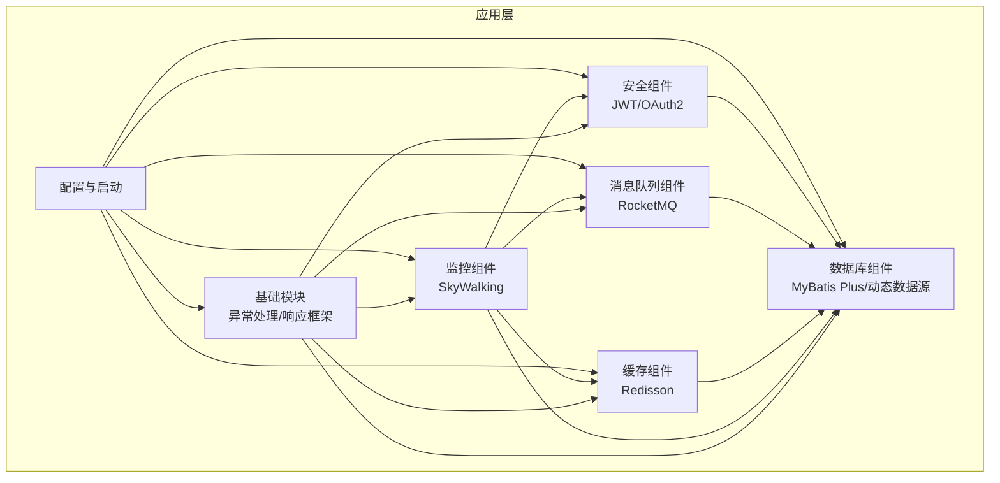
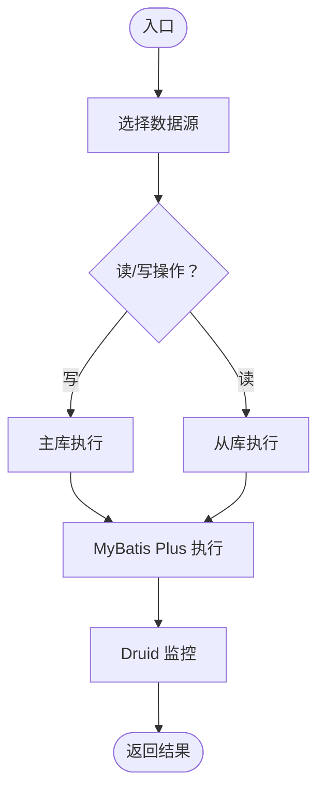
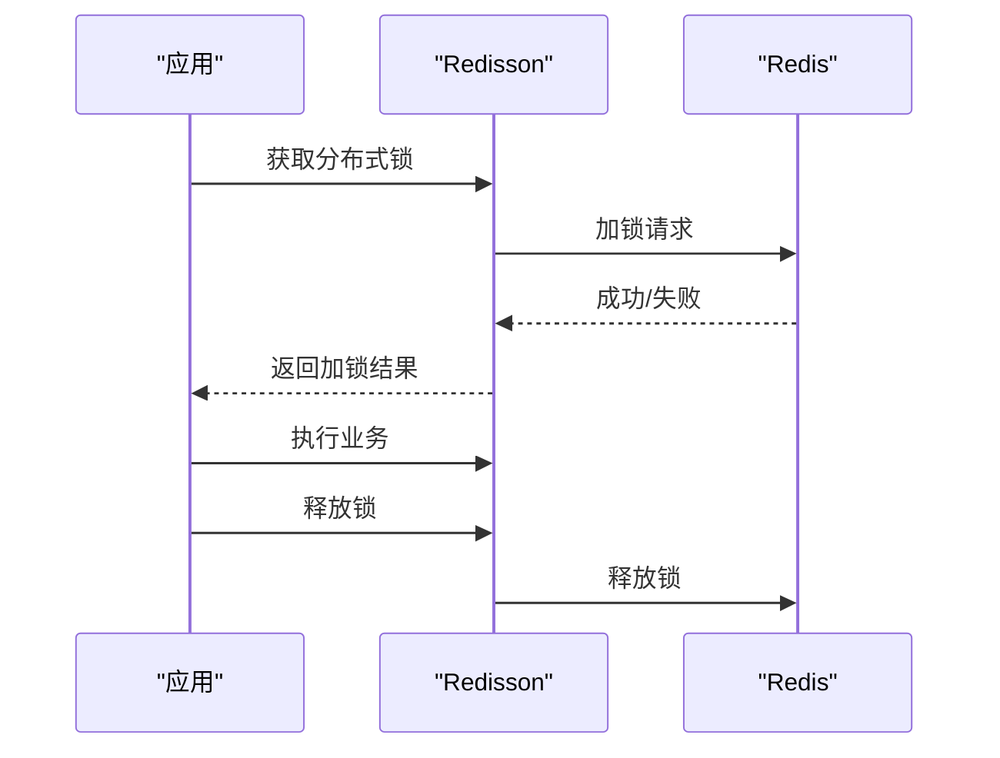
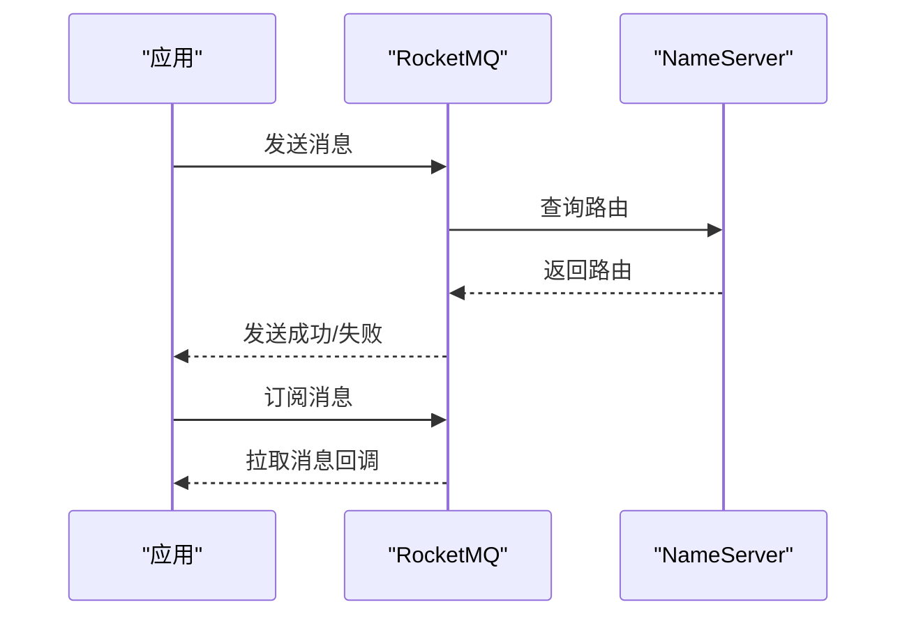
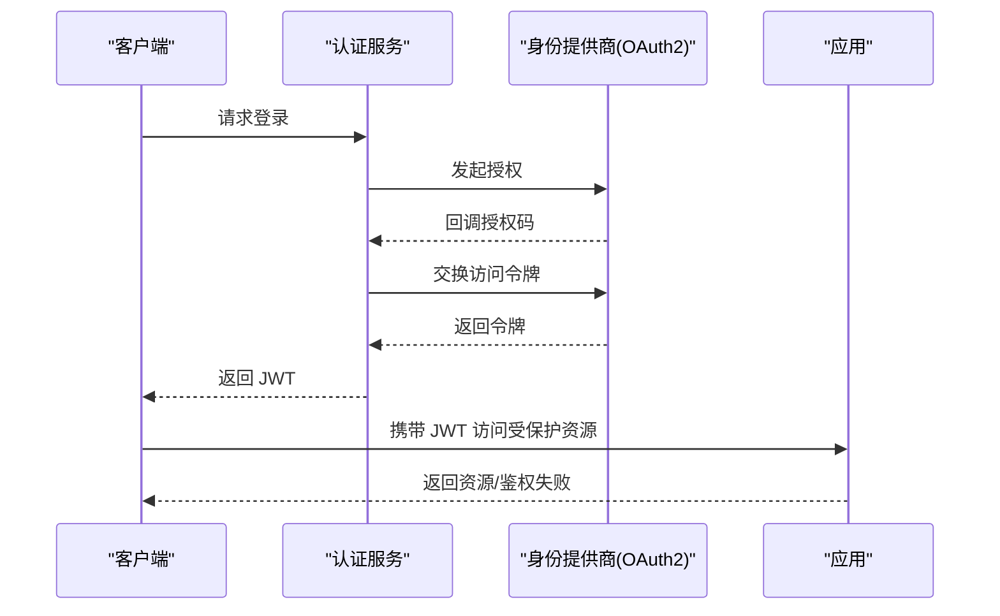
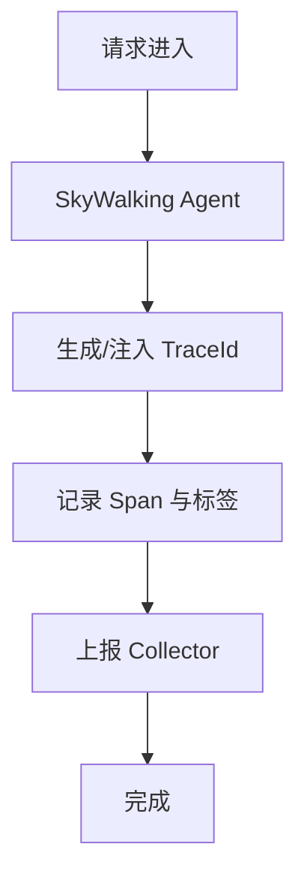
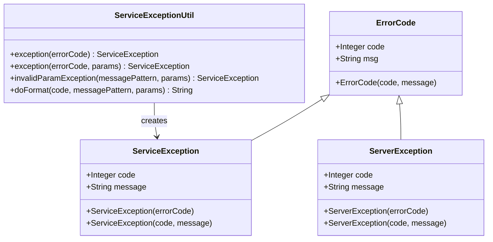
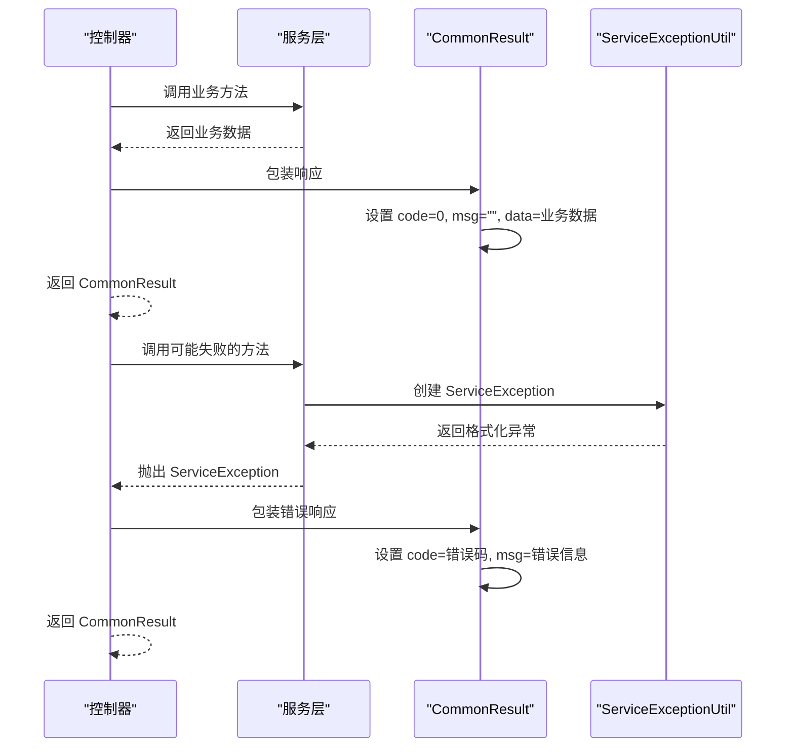
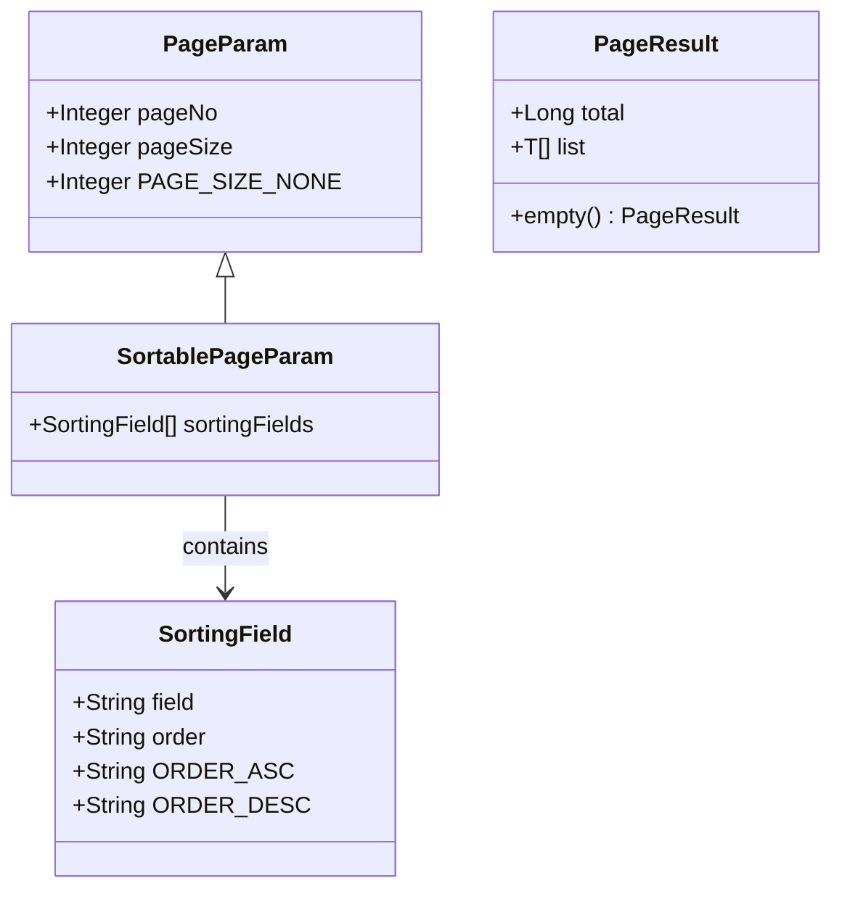
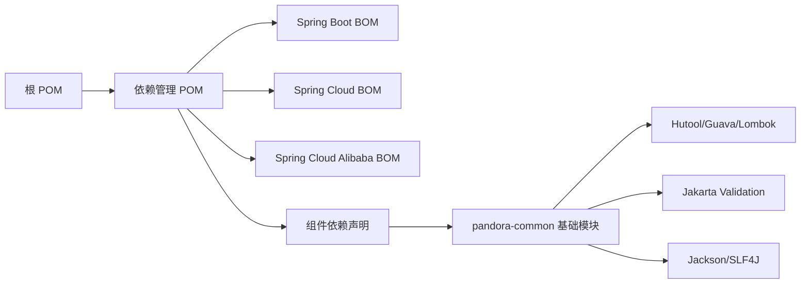

# 核心组件

<cite>
**本文引用的文件**
- [根 POM](file://pom.xml)
- [依赖管理 POM](file://pandora-dependencies/pom.xml)
- [框架模块 POM](file://pandora-framework/pom.xml)
- [pandora-common 模块 POM](file://pandora-framework/pandora-common/pom.xml)
- [pandora-common README](file://pandora-framework/pandora-common/README.md)
- [ErrorCode](file://pandora-framework/pandora-common/src/main/java/net/ittimeline/pandora/framework/common/exception/ErrorCode.java)
- [ServiceException](file://pandora-framework/pandora-common/src/main/java/net/ittimeline/pandora/framework/common/exception/ServiceException.java)
- [ServerException](file://pandora-framework/pandora-common/src/main/java/net/ittimeline/pandora/framework/common/exception/ServerException.java)
- [GlobalErrorCodeConstants](file://pandora-framework/pandora-common/src/main/java/net/ittimeline/pandora/framework/common/exception/enums/GlobalErrorCodeConstants.java)
- [ServiceErrorCodeRange](file://pandora-framework/pandora-common/src/main/java/net/ittimeline/pandora/framework/common/exception/enums/ServiceErrorCodeRange.java)
- [ServiceExceptionUtil](file://pandora-framework/pandora-common/src/main/java/net/ittimeline/pandora/framework/common/exception/util/ServiceExceptionUtil.java)
- [CommonResult](file://pandora-framework/pandora-common/src/main/java/net/ittimeline/pandora/framework/common/pojo/CommonResult.java)
- [PageParam](file://pandora-framework/pandora-common/src/main/java/net/ittimeline/pandora/framework/common/pojo/PageParam.java)
- [SortablePageParam](file://pandora-framework/pandora-common/src/main/java/net/ittimeline/pandora/framework/common/pojo/SortablePageParam.java)
- [SortingField](file://pandora-framework/pandora-common/src/main/java/net/ittimeline/pandora/framework/common/pojo/SortingField.java)
- [PageResult](file://pandora-framework/pandora-common/src/main/java/net/ittimeline/pandora/framework/common/pojo/PageResult.java)
- [README](file://README.md)
</cite>

## 更新摘要
**变更内容**
- 新增 pandora-common 基础模块的详细分析和文档
- 更新核心组件架构图，体现基础模块的重要性
- 添加异常处理、错误代码管理、标准化响应和分页框架的完整说明
- 更新依赖分析，反映基础模块的依赖关系
- 增强故障排查指南，包含基础模块相关的调试方法

## 目录
1. [引言](#引言)
2. [项目结构](#项目结构)
3. [核心组件](#核心组件)
4. [架构总览](#架构总览)
5. [详细组件分析](#详细组件分析)
6. [基础模块详解](#基础模块详解)
7. [依赖分析](#依赖分析)
8. [性能考虑](#性能考虑)
9. [故障排查指南](#故障排查指南)
10. [结论](#结论)
11. [附录](#附录)

## 引言
本文件面向"Pandora Cloud"基础脚手架项目，聚焦于其核心组件生态的系统化说明。当前仓库以 Maven 多模块组织呈现，包含统一依赖管理与框架模块定义；数据库、缓存、消息队列、安全与监控等组件通过依赖管理集中版本控制，并以 Spring Boot Starter 的形式引入。**新增的 pandora-common 基础模块**提供了异常处理、错误代码管理、标准化响应和分页框架等核心基础设施，现已成为核心组件的重要组成部分。本文将围绕这些组件的版本、配置要点、集成模式、最佳实践与运维建议进行系统阐述，帮助初学者快速上手，同时为专家提供深入的技术参考。

## 项目结构
项目采用多模块结构，核心由以下模块构成：
- 根 POM：统一属性、插件与仓库配置，聚合子模块。
- 依赖管理 POM：集中管理各技术栈版本，确保依赖一致性。
- 框架模块 POM：作为技术组件的容器模块，约定"core/config"分层与"框架/业务"组件分类。
- **pandora-common 基础模块**：提供异常处理、错误代码管理、标准化响应和分页框架等核心基础设施。

```mermaid
graph TB
Root["根 POM<br/>聚合模块与构建配置"] --> Deps["依赖管理 POM<br/>集中版本与依赖声明"]
Root --> Framework["框架模块 POM<br/>组件容器与说明"]
Framework --> Common["pandora-common 基础模块<br/>异常处理与响应框架"]
subgraph "模块职责"
Deps --- "统一版本与依赖"
Framework --- "组件打包与分层约定"
Common --- "核心基础设施"
end
```

**图表来源**
- [根 POM:1-150](file://pom.xml#L1-L150)
- [依赖管理 POM:1-658](file://pandora-dependencies/pom.xml#L1-L658)
- [框架模块 POM:1-34](file://pandora-framework/pom.xml#L1-L34)
- [pandora-common 模块 POM:1-74](file://pandora-framework/pandora-common/pom.xml#L1-L74)

**章节来源**
- [根 POM:1-150](file://pom.xml#L1-L150)
- [依赖管理 POM:1-658](file://pandora-dependencies/pom.xml#L1-L658)
- [框架模块 POM:1-34](file://pandora-framework/pom.xml#L1-L34)
- [pandora-common 模块 POM:1-74](file://pandora-framework/pandora-common/pom.xml#L1-L74)

## 核心组件
本节概述本次文档关注的六大核心组件及其在依赖管理中的版本与引入方式。**新增的 pandora-common 基础模块**作为核心基础设施，为其他组件提供统一的异常处理和响应标准。

- 数据库组件
  - MyBatis Plus：ORM 能力增强，提供通用 CRUD、分页、条件构造器、代码生成等。
  - 动态数据源：多数据源路由与切换，支持读写分离、按需切换。
  - 关联查询扩展：提供便捷的多表联查能力。
  - 事务与翻译：提供事务与字段翻译等扩展能力。
  - Druid：连接池与监控。
  - 参考依赖
    - [mybatis-plus-spring-boot3-starter:204-206](file://pandora-dependencies/pom.xml#L204-L206)
    - [dynamic-datasource-spring-boot3-starter:219-221](file://pandora-dependencies/pom.xml#L219-L221)
    - [mybatis-plus-join-boot-starter:224-226](file://pandora-dependencies/pom.xml#L224-L226)
    - [druid-spring-boot-3-starter:193-195](file://pandora-dependencies/pom.xml#L193-L195)

- 缓存组件
  - Redisson：分布式对象、集合、锁、限流、布隆过滤器等，提供 Spring Boot 自动装配。
  - 参考依赖
    - [redisson-spring-boot-starter:257-259](file://pandora-dependencies/pom.xml#L257-L259)

- 消息队列组件
  - RocketMQ：消息生产与消费、顺序消息、事务消息、延迟消息等能力，提供 Spring Boot 自动装配。
  - 参考依赖
    - [rocketmq-spring-boot-starter:280-282](file://pandora-dependencies/pom.xml#L280-L282)

- 安全组件
  - JWT：令牌签发与校验，常配合 Spring Security 或自定义拦截器使用。
  - OAuth2：社交登录与第三方授权接入，结合 JustAuth Starter 快速落地。
  - 参考依赖
    - [JustAuth 与 Starter:556-570](file://pandora-dependencies/pom.xml#L556-L570)

- 监控组件
  - SkyWalking：链路追踪、日志与指标采集，提供 Trace Toolkit、Logback 集成与 OpenTracing 兼容。
  - 参考依赖
    - [apm-toolkit-trace:300-301](file://pandora-dependencies/pom.xml#L300-L301)
    - [apm-toolkit-logback-1.x:305-306](file://pandora-dependencies/pom.xml#L305-L306)
    - [apm-toolkit-opentracing:310-311](file://pandora-dependencies/pom.xml#L310-L311)
    - [opentracing-api/util/noop:315-327](file://pandora-dependencies/pom.xml#L315-L327)

- **基础模块（新增）**
  - **异常处理框架**：统一的异常类型、错误码管理和异常工具类。
  - **标准化响应**：统一的 API 响应格式和状态码管理。
  - **分页框架**：完整的分页请求参数和结果封装。
  - **错误代码管理**：全局错误码和业务错误码区间定义。
  - 参考依赖
    - [pandora-common 模块 POM:26-71](file://pandora-framework/pandora-common/pom.xml#L26-L71)

**章节来源**
- [依赖管理 POM:65-89](file://pandora-dependencies/pom.xml#L65-L89)
- [依赖管理 POM:189-282](file://pandora-dependencies/pom.xml#L189-L282)
- [依赖管理 POM:285-327](file://pandora-dependencies/pom.xml#L285-L327)
- [pandora-common 模块 POM:26-71](file://pandora-framework/pandora-common/pom.xml#L26-L71)

## 架构总览
下图展示核心组件在应用中的典型协作关系：**pandora-common 基础模块**作为统一基础设施，为其他组件提供异常处理和响应标准；数据库组件负责持久化与多数据源路由；缓存组件提供高性能读取与分布式能力；消息队列组件承担异步解耦与削峰填谷；安全组件贯穿认证与授权；监控组件覆盖链路追踪与可观测性。



**图表来源**
- [依赖管理 POM:189-282](file://pandora-dependencies/pom.xml#L189-L282)
- [依赖管理 POM:285-327](file://pandora-dependencies/pom.xml#L285-L327)
- [pandora-common 模块 POM:1-74](file://pandora-framework/pandora-common/pom.xml#L1-L74)

## 详细组件分析

### 数据库组件（MyBatis Plus、动态数据源）
- 能力概览
  - MyBatis Plus：简化 CRUD、分页、条件构造器、代码生成、乐观锁、自动填充等。
  - 动态数据源：按上下文切换数据源，支持主从读写分离、按方法/类注解切换。
  - 关联查询：多表联查、嵌套结果映射。
  - Druid：连接池监控、SQL 防御、SQL 日志。
- 典型配置维度（说明性）
  - 数据源：驱动、URL、用户名、密码、连接池参数。
  - 多数据源：数据源列表、默认数据源、路由策略（按类/方法注解或 AOP）。
  - MyBatis Plus：Mapper 扫描、分页方言、逻辑删除、自动填充。
  - Druid：监控页面、慢 SQL 阈值、SQL 防御规则。
- 最佳实践
  - 明确读写分离策略与路由键，避免跨库事务。
  - 合理设置分页大小与排序字段，避免全表扫描。
  - 使用逻辑删除与自动填充，统一数据生命周期管理。
- 集成建议
  - 在框架模块中提供 Starter 封装与默认配置，业务模块按需覆盖。
  - 结合 SkyWalking 做慢 SQL 与异常追踪。



**图表来源**
- [依赖管理 POM:219-221](file://pandora-dependencies/pom.xml#L219-L221)
- [依赖管理 POM:204-206](file://pandora-dependencies/pom.xml#L204-L206)
- [依赖管理 POM:193-195](file://pandora-dependencies/pom.xml#L193-L195)

**章节来源**
- [依赖管理 POM:189-226](file://pandora-dependencies/pom.xml#L189-L226)

### 缓存组件（Redisson）
- 能力概览
  - 分布式对象与集合：RMap、RSet、RList 等。
  - 分布式同步原语：RLock、RSemaphore、RCountDownLatch。
  - 限流与布隆过滤器：RateLimiter、BloomFilter。
  - Spring Boot 自动装配：基于配置即可使用。
- 典型配置维度（说明性）
  - Redis 地址、连接超时、命令超时、序列化策略。
  - 集群/哨兵模式、密码认证、SSL。
  - 对象编码、空闲回收、连接池大小。
- 最佳实践
  - 优先使用本地缓存+Redisson 的两级缓存策略。
  - 对热点数据设置合理的过期时间与 TTL 管理。
  - 使用布隆过滤器降低"误判率"，减少后端压力。
- 集成建议
  - 在框架模块提供默认配置模板，业务模块按需覆盖。
  - 结合 SkyWalking 观察缓存命中率与异常。



**图表来源**
- [依赖管理 POM:257-259](file://pandora-dependencies/pom.xml#L257-L259)

**章节来源**
- [依赖管理 POM:256-259](file://pandora-dependencies/pom.xml#L256-L259)

### 消息队列组件（RocketMQ）
- 能力概览
  - 生产与消费：可靠投递、顺序消息、事务消息、延迟消息。
  - Spring Boot 自动装配：基于配置即可使用。
- 典型配置维度（说明性）
  - NameServer 地址、Producer/Consumer 组、消息模型（广播/集群）、批量大小。
  - 消费并发度、重试策略、死信队列、回溯消费。
- 最佳实践
  - 明确消息幂等与去重策略，避免重复消费。
  - 对关键路径使用顺序消息，保证业务有序性。
  - 合理设置延迟等级与重试次数，平衡可靠性与性能。
- 集成建议
  - 在框架模块提供默认 Producer/Consumer 配置模板。
  - 结合 SkyWalking 观察消息积压与延迟。



**图表来源**
- [依赖管理 POM:280-282](file://pandora-dependencies/pom.xml#L280-L282)

**章节来源**
- [依赖管理 POM:277-282](file://pandora-dependencies/pom.xml#L277-L282)

### 安全组件（JWT/OAuth2）
- 能力概览
  - JWT：签发与校验，支持自定义载荷与签名算法。
  - OAuth2：社交登录与第三方授权，结合 JustAuth Starter 快速接入。
- 典型配置维度（说明性）
  - JWT：密钥、算法、有效期、签发者、受众。
  - OAuth2：客户端 ID/Secret、授权回调地址、作用域、第三方平台配置。
- 最佳实践
  - 使用 HTTPS 传输，避免令牌泄露。
  - 对敏感接口启用细粒度权限控制与审计日志。
  - OAuth2 回调地址与作用域严格校验，防止 CSRF。
- 集成建议
  - 在框架模块提供通用拦截器与权限注解。
  - 结合 SkyWalking 观察鉴权异常与耗时。



**图表来源**
- [依赖管理 POM:556-570](file://pandora-dependencies/pom.xml#L556-L570)

**章节来源**
- [依赖管理 POM:44-57](file://pandora-dependencies/pom.xml#L44-L57)

### 监控组件（SkyWalking）
- 能力概览
  - 链路追踪：Trace Toolkit 提供注解与 API。
  - 日志集成：Logback 集成，自动注入 TraceId。
  - OpenTracing 兼容：可选 OpenTracing API。
- 典型配置维度（说明性）
  - Agent 启用与探针加载、服务名与实例名、Collector 地址。
  - 日志格式、采样策略、上报周期。
- 最佳实践
  - 为关键业务流程打点，避免过度打点导致性能开销。
  - TraceId 透传至下游服务，确保端到端可见。
- 集成建议
  - 在框架模块提供默认 agent 配置模板。
  - 结合 Spring Boot Admin 展示运行状态。



**图表来源**
- [依赖管理 POM:299-327](file://pandora-dependencies/pom.xml#L299-L327)

**章节来源**
- [依赖管理 POM:88-91](file://pandora-dependencies/pom.xml#L88-L91)
- [依赖管理 POM:299-327](file://pandora-dependencies/pom.xml#L299-L327)

## 基础模块详解

### 异常处理框架
**pandora-common 基础模块的核心价值在于提供了统一的异常处理机制**，确保整个应用的异常处理风格一致。

- **异常类型体系**
  - `ServiceException`：业务逻辑异常，携带业务错误码
  - `ServerException`：服务器异常，使用全局错误码（5xx 场景）
  - `ErrorCode`：错误码对象，包含 code 和 msg 字段
- **错误码管理**
  - `GlobalErrorCodeConstants`：全局错误码枚举（0-999）
  - `ServiceErrorCodeRange`：业务错误码区间定义（1000000000+）
- **异常工具类**
  - `ServiceExceptionUtil`：提供异常格式化和创建方法



**图表来源**
- [ErrorCode:18-32](file://pandora-framework/pandora-common/src/main/java/net/ittimeline/pandora/framework/common/exception/ErrorCode.java#L18-L32)
- [ServiceException:14-63](file://pandora-framework/pandora-common/src/main/java/net/ittimeline/pandora/framework/common/exception/ServiceException.java#L14-L63)
- [ServerException:15-64](file://pandora-framework/pandora-common/src/main/java/net/ittimeline/pandora/framework/common/exception/ServerException.java#L15-L64)
- [ServiceExceptionUtil:19-84](file://pandora-framework/pandora-common/src/main/java/net/ittimeline/pandora/framework/common/exception/util/ServiceExceptionUtil.java#L19-L84)

**章节来源**
- [ErrorCode:1-33](file://pandora-framework/pandora-common/src/main/java/net/ittimeline/pandora/framework/common/exception/ErrorCode.java#L1-L33)
- [ServiceException:1-64](file://pandora-framework/pandora-common/src/main/java/net/ittimeline/pandora/framework/common/exception/ServiceException.java#L1-L64)
- [ServerException:1-65](file://pandora-framework/pandora-common/src/main/java/net/ittimeline/pandora/framework/common/exception/ServerException.java#L1-L65)
- [GlobalErrorCodeConstants:1-42](file://pandora-framework/pandora-common/src/main/java/net/ittimeline/pandora/framework/common/exception/enums/GlobalErrorCodeConstants.java#L1-L42)
- [ServiceErrorCodeRange:1-48](file://pandora-framework/pandora-common/src/main/java/net/ittimeline/pandora/framework/common/exception/enums/ServiceErrorCodeRange.java#L1-L48)
- [ServiceExceptionUtil:1-85](file://pandora-framework/pandora-common/src/main/java/net/ittimeline/pandora/framework/common/exception/util/ServiceExceptionUtil.java#L1-L85)

### 标准化响应框架
**pandora-common 提供了统一的 API 响应格式，确保前后端交互的一致性**。

- **响应对象**
  - `CommonResult<T>`：通用响应包装类，包含 code、msg、data 字段
  - 支持泛型，可承载任意类型的业务数据
- **响应状态管理**
  - `SUCCESS`：成功状态（code=0）
  - `isSuccess()`：判断响应是否成功
  - `isError()`：判断响应是否失败
- **异常集成**
  - `checkError()`：检查响应状态，失败时抛出 ServiceException
  - `getCheckedData()`：获取数据并进行异常检查



**图表来源**
- [CommonResult:22-122](file://pandora-framework/pandora-common/src/main/java/net/ittimeline/pandora/framework/common/pojo/CommonResult.java#L22-L122)
- [ServiceExceptionUtil:22-37](file://pandora-framework/pandora-common/src/main/java/net/ittimeline/pandora/framework/common/exception/util/ServiceExceptionUtil.java#L22-L37)

**章节来源**
- [CommonResult:1-123](file://pandora-framework/pandora-common/src/main/java/net/ittimeline/pandora/framework/common/pojo/CommonResult.java#L1-L123)

### 分页框架
**完整的分页请求参数和结果封装，支持基本分页和可排序分页**。

- **分页参数**
  - `PageParam`：基础分页参数（pageNo、pageSize）
  - `SortablePageParam`：可排序分页参数，继承自 PageParam
  - `SortingField`：排序字段定义（field、order）
- **分页结果**
  - `PageResult<T>`：分页结果封装（list、total）
  - 提供 empty() 工厂方法创建空结果



**图表来源**
- [PageParam:20-42](file://pandora-framework/pandora-common/src/main/java/net/ittimeline/pandora/framework/common/pojo/PageParam.java#L20-L42)
- [SortablePageParam:21-25](file://pandora-framework/pandora-common/src/main/java/net/ittimeline/pandora/framework/common/pojo/SortablePageParam.java#L21-L25)
- [SortingField:19-38](file://pandora-framework/pandora-common/src/main/java/net/ittimeline/pandora/framework/common/pojo/SortingField.java#L19-L38)
- [PageResult:19-48](file://pandora-framework/pandora-common/src/main/java/net/ittimeline/pandora/framework/common/pojo/PageResult.java#L19-L48)

**章节来源**
- [PageParam:1-43](file://pandora-framework/pandora-common/src/main/java/net/ittimeline/pandora/framework/common/pojo/PageParam.java#L1-L43)
- [SortablePageParam:1-26](file://pandora-framework/pandora-common/src/main/java/net/ittimeline/pandora/framework/common/pojo/SortablePageParam.java#L1-L26)
- [SortingField:1-39](file://pandora-framework/pandora-common/src/main/java/net/ittimeline/pandora/framework/common/pojo/SortingField.java#L1-L39)
- [PageResult:1-49](file://pandora-framework/pandora-common/src/main/java/net/ittimeline/pandora/framework/common/pojo/PageResult.java#L1-L49)

### 依赖关系与集成
**pandora-common 作为基础设施模块，被其他组件广泛依赖**。

- **内部依赖**
  - Hutool：提供常用工具方法
  - Lombok：简化 Java 代码
  - Guava：提供集合和并发工具
  - Jackson：JSON 序列化支持
  - Jakarta Validation：参数校验
  - SLF4J：日志抽象
  - springdoc-openapi：API 文档支持

- **对外暴露**
  - 为业务模块提供统一的异常处理标准
  - 为控制器层提供标准化的响应格式
  - 为数据访问层提供分页和排序支持

**章节来源**
- [pandora-common 模块 POM:26-71](file://pandora-framework/pandora-common/pom.xml#L26-L71)
- [pandora-common README:1-33](file://pandora-framework/pandora-common/README.md#L1-L33)

## 依赖分析
- **依赖层次**
  - 根 POM 通过 dependencyManagement 导入依赖管理 POM，再由依赖管理 POM 统一声明各组件版本。
  - 框架模块 POM 作为容器，约定组件分层与命名规范，便于后续扩展。
  - **pandora-common 基础模块独立管理其依赖，为其他模块提供基础设施服务**。
- **组件耦合**
  - 组件间低耦合：通过 Starter 与配置隔离，按需引入。
  - **基础模块高内聚：集中管理异常处理、响应格式和分页框架**。
  - 外部依赖：Spring Boot、Spring Cloud、Spring Cloud Alibaba 生态。
- **版本一致性**
  - 通过统一属性与 flatten 插件，确保版本号一致性与可维护性。
  - **基础模块版本独立管理，确保基础设施的稳定性**。



**图表来源**
- [根 POM:40-50](file://pom.xml#L40-L50)
- [依赖管理 POM:122-140](file://pandora-dependencies/pom.xml#L122-L140)
- [pandora-common 模块 POM:26-71](file://pandora-framework/pandora-common/pom.xml#L26-L71)

**章节来源**
- [根 POM:40-50](file://pom.xml#L40-L50)
- [依赖管理 POM:122-140](file://pandora-dependencies/pom.xml#L122-L140)
- [pandora-common 模块 POM:26-71](file://pandora-framework/pandora-common/pom.xml#L26-L71)

## 性能考虑
- **数据库**
  - 合理分页与索引设计，避免 N+1 查询。
  - 读写分离与连接池参数优化，结合 Druid 监控定位瓶颈。
- **缓存**
  - 两级缓存策略与 TTL 管理，布隆过滤器降低无效查询。
- **消息队列**
  - 并发度与批量大小平衡吞吐与延迟，合理设置重试与死信。
- **安全**
  - JWT 密钥轮换与短有效期策略，OAuth2 回调严格校验。
- **监控**
  - Trace 采样与日志级别控制，避免对性能造成影响。
- **基础模块**
  - **异常处理的性能优化**：使用预分配的 StringBuilder 减少字符串拼接开销。
  - **响应序列化的性能优化**：使用 @JsonIgnore 避免不必要的字段序列化。
  - **分页查询的性能优化**：合理设置 pageSize 上限，避免大数据量查询。

## 故障排查指南
- **数据库**
  - 慢 SQL：开启 Druid SQL 监控，定位慢查询与异常。
  - 连接池：检查连接数、等待时间与泄漏。
- **缓存**
  - 锁竞争：观察锁等待与超时，调整并发策略。
  - 命中率：结合监控与日志分析缓存策略有效性。
- **消息队列**
  - 积压与延迟：检查消费者并发与处理耗时，调整批大小。
  - 重复消费：确认幂等与去重策略。
- **安全**
  - 鉴权失败：核对令牌签名、有效期与作用域。
  - OAuth2 回调异常：检查回调地址与第三方配置。
- **监控**
  - Trace 上报异常：检查 Agent 配置与 Collector 地址。
  - 日志缺失：确认 Logback 集成与 TraceId 注入。
- **基础模块（新增）**
  - **异常处理问题**：检查 ServiceExceptionUtil 的格式化参数，确认占位符匹配。
  - **响应格式异常**：验证 CommonResult 的序列化配置，检查 @JsonIgnore 注解。
  - **分页参数校验失败**：确认 PageParam 的参数范围和排序字段格式。
  - **错误码冲突**：检查业务错误码是否符合 ServiceErrorCodeRange 的区间定义。

## 结论
本文件基于当前仓库的依赖管理与模块结构，系统梳理了数据库、缓存、消息队列、安全、监控五大核心组件以及新增的 pandora-common 基础模块。**pandora-common 作为核心基础设施，为整个应用提供了统一的异常处理、标准化响应和分页框架**，确保了系统的稳定性和一致性。建议在框架模块中沉淀 Starter 与默认配置模板，业务模块按需覆盖；同时结合 SkyWalking 做全链路观测，持续优化性能与稳定性。

## 附录
- **入门步骤（概念性）**
  - 在业务模块引入对应 Starter 依赖。
  - 在 application.yml 中添加组件基础配置。
  - 编写最小可用 Demo，验证读写、缓存、消息与鉴权链路。
  - **使用 pandora-common 的异常处理和响应框架**。
  - 开启 SkyWalking Agent，观察链路与日志。
- **扩展开发指导（概念性）**
  - 在框架模块新增组件时，遵循"core/config"分层与命名规范。
  - 提供默认配置模板与使用示例，降低接入成本。
  - **充分利用 pandora-common 的基础设施能力**。
  - 与 Spring Boot Admin/SkyWalking 集成，完善可观测性。
- **基础模块使用最佳实践**
  - **统一使用 ServiceException 和 ServerException**，避免自定义异常类型。
  - **使用 GlobalErrorCodeConstants 和业务错误码区间**，确保错误码唯一性。
  - **通过 CommonResult 统一响应格式**，简化前端处理。
  - **使用 PageParam 和 SortablePageParam**，确保分页查询的一致性。
  - **利用 ServiceExceptionUtil 进行异常信息格式化**，提升用户体验。

**章节来源**
- [pandora-common README:1-33](file://pandora-framework/pandora-common/README.md#L1-L33)
- [CommonResult:74-89](file://pandora-framework/pandora-common/src/main/java/net/ittimeline/pandora/framework/common/pojo/CommonResult.java#L74-L89)
- [ServiceExceptionUtil:30-37](file://pandora-framework/pandora-common/src/main/java/net/ittimeline/pandora/framework/common/exception/util/ServiceExceptionUtil.java#L30-L37)