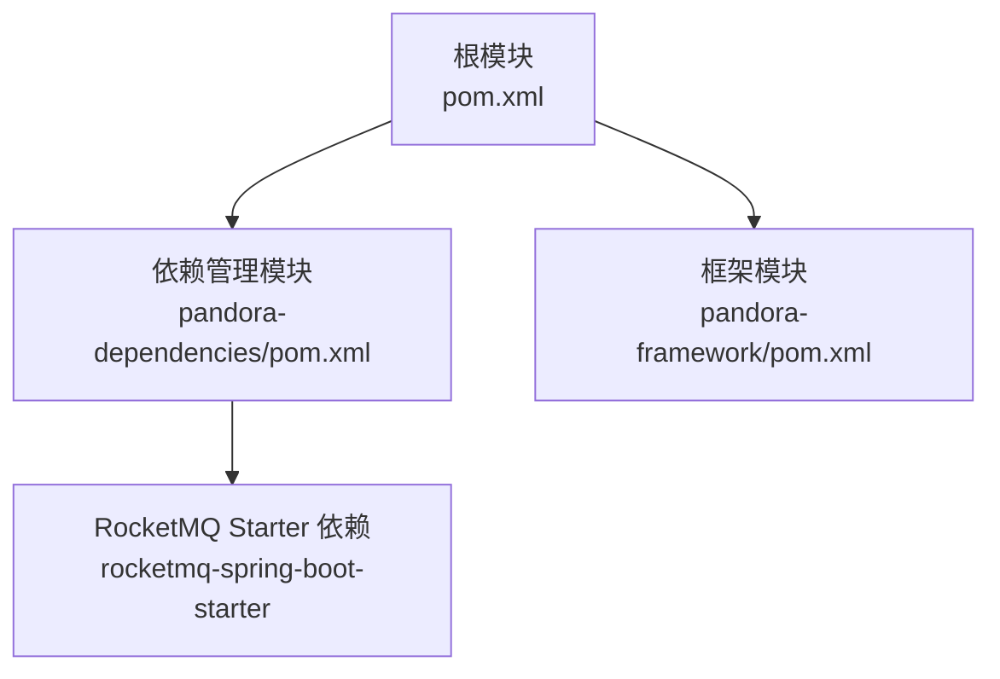
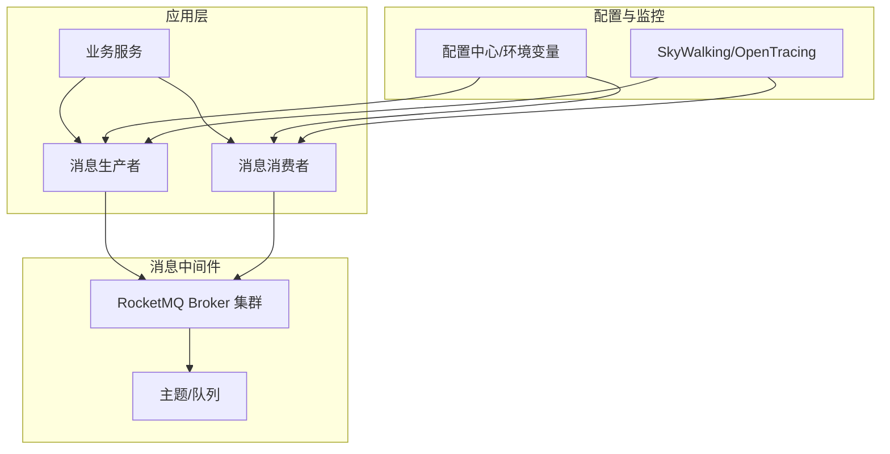
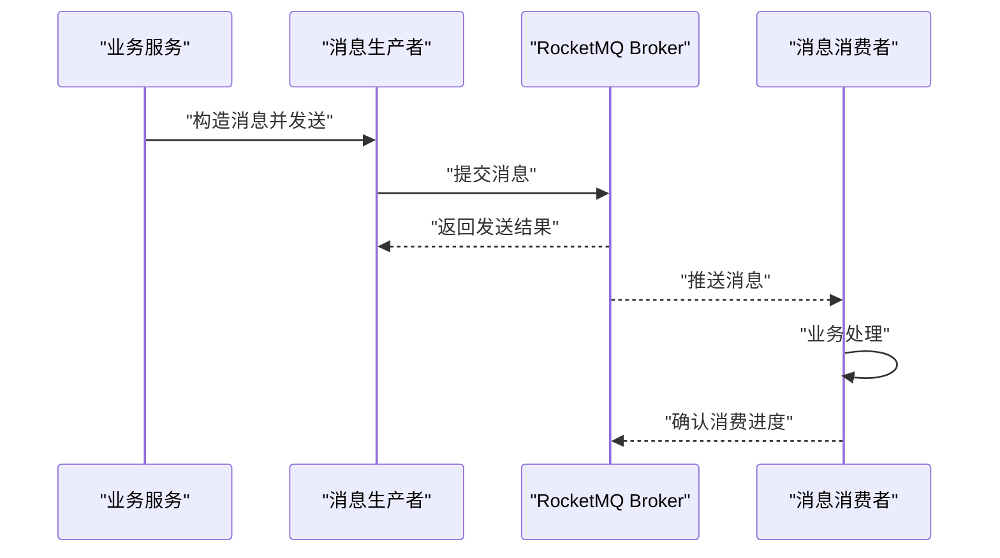
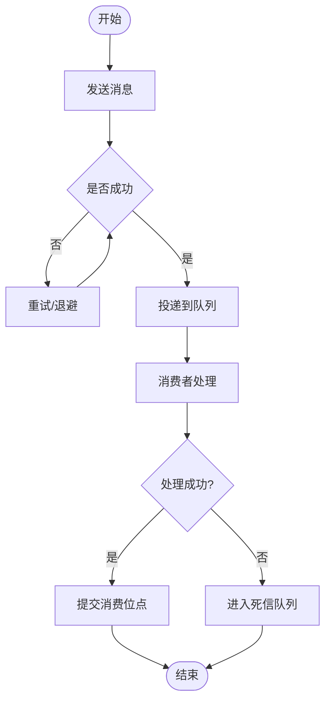
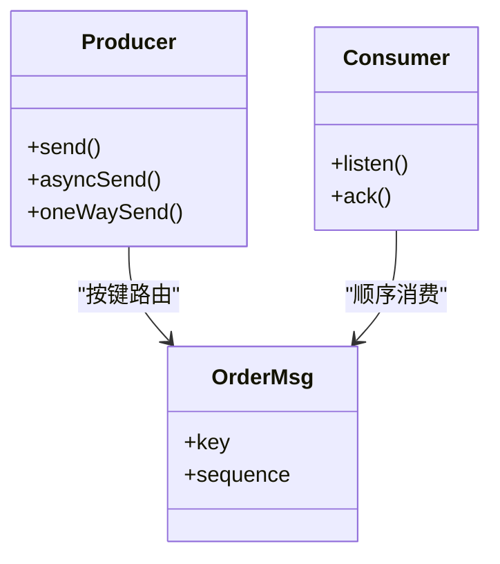
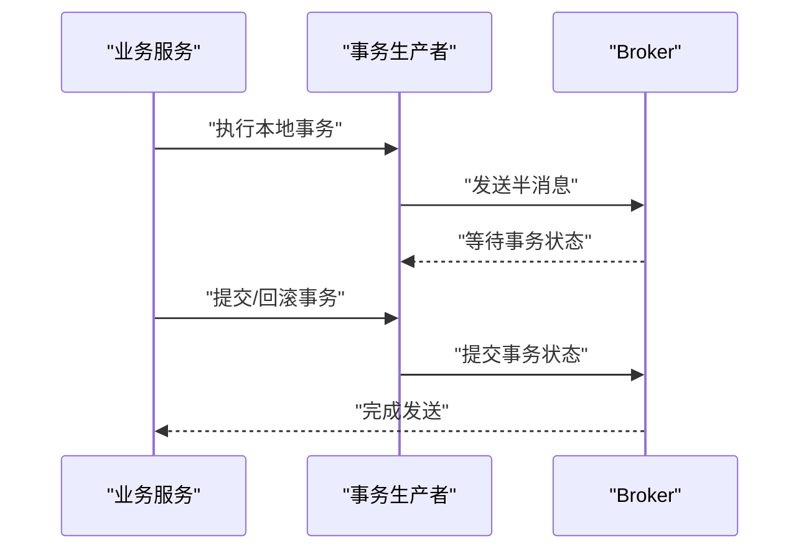
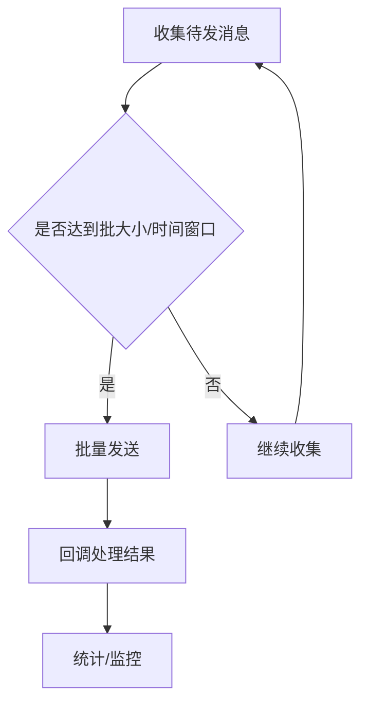
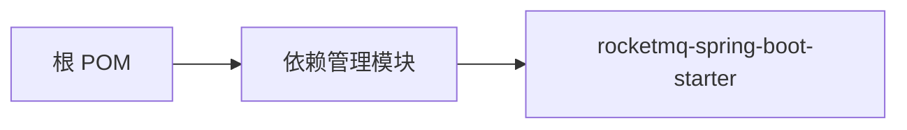

# 消息队列组件

<cite>
**本文引用的文件**
- [pom.xml](file://pom.xml)
- [pandora-dependencies/pom.xml](file://pandora-dependencies/pom.xml)
- [pandora-framework/pom.xml](file://pandora-framework/pom.xml)
</cite>

## 目录
1. [引言](#引言)
2. [项目结构](#项目结构)
3. [核心组件](#核心组件)
4. [架构总览](#架构总览)
5. [详细组件分析](#详细组件分析)
6. [依赖分析](#依赖分析)
7. [性能考虑](#性能考虑)
8. [故障排查指南](#故障排查指南)
9. [结论](#结论)
10. [附录](#附录)

## 引言
本文件围绕消息队列组件展开，重点说明 RocketMQ Spring Boot Starter 在本项目中的集成方式与使用要点。当前仓库中已通过统一依赖管理引入 RocketMQ Spring Boot Starter，并在模块化结构中预留了后续扩展空间。本文将从系统架构、组件关系、数据流与处理逻辑、集成配置、可靠性保障、性能调优与监控、以及常见问题处理等方面进行系统化梳理，帮助读者快速理解并安全地在高并发场景下使用消息队列。

## 项目结构
本项目采用多模块结构，其中：
- 根 POM 负责构建生命周期与插件管理；
- pandora-dependencies 提供统一依赖版本与管理；
- pandora-framework 作为技术组件聚合模块，为后续按“组件(core)/配置(config)”拆分预留组织形态。

图表来源
- [pom.xml:1-150](file://pom.xml#L1-L150)
- [pandora-dependencies/pom.xml:278-282](file://pandora-dependencies/pom.xml#L278-L282)

章节来源
- [pom.xml:1-150](file://pom.xml#L1-L150)
- [pandora-dependencies/pom.xml:109-140](file://pandora-dependencies/pom.xml#L109-L140)
- [pandora-framework/pom.xml:1-34](file://pandora-framework/pom.xml#L1-L34)

## 核心组件
- RocketMQ Spring Boot Starter：通过依赖管理模块集中引入，版本由属性统一控制，便于跨模块一致性与升级维护。
- 模块化扩展：框架模块为后续拆分“消息队列组件(core)/配置(config)”提供组织基础；建议在 core 中封装通用能力，在 config 中提供自动装配与配置项。

章节来源
- [pandora-dependencies/pom.xml:78](file://pandora-dependencies/pom.xml#L78)
- [pandora-dependencies/pom.xml:278-282](file://pandora-dependencies/pom.xml#L278-L282)
- [pandora-framework/pom.xml:15-24](file://pandora-framework/pom.xml#L15-L24)

## 架构总览
消息队列在系统中的典型位置如下：
- 应用层：业务服务通过 RocketMQ 自动装配的生产者/消费者接口发布/订阅消息；
- MQ 层：RocketMQ Broker 集群负责消息存储与投递；
- 配置层：通过 application.yml 或环境变量注入连接参数、命名空间、主题、消费组等；
- 监控链路：结合 SkyWalking/OpenTracing 等实现端到端链路追踪与可观测性。

## 详细组件分析

### 生产者与消费者实现模式
- 生产者模式
  - 同步发送：适用于对确认及时性要求高的场景，需关注发送超时与失败重试策略。
  - 异步发送：适用于高吞吐但可容忍少量丢失的场景，需设置回调与异常处理。
  - 单向发送：适用于日志上报等对可靠性无强需求的场景。
- 消费者模式
  - 广播消费：每台机器均收到全量消息，适用于配置下发、节点感知等。
  - 集群消费：消息在多个消费者实例间负载均衡，适用于业务事件处理。
  - 订阅关系：按标签/表达式过滤消息，降低网络与CPU开销。

### 消息可靠性保证机制
- 发送可靠性
  - 同步刷盘/复制：确保消息落盘与主从复制完成后再返回成功，适合强一致场景。
  - 失败重试：在发送异常或超时时触发，结合退避策略与最大重试次数。
- 消费可靠性
  - 消费确认：消费者处理完成后提交位点，避免重复消费。
  - 死信队列：消费失败达到阈值后进入死信队列，便于离线分析与人工干预。
  - 幂等设计：通过业务键/去重表/状态机等手段保证重复消息不影响最终一致性。

### 消息路由、负载均衡与顺序消息
- 路由与负载均衡
  - 主题分区：消息按分区轮询或哈希路由，提高并行度。
  - 消费者负载均衡：集群模式下RocketMQ自动分配队列给消费者实例。
- 顺序消息
  - 全局顺序：单队列串行，吞吐受限但严格有序。
  - 分区有序：同一业务键映射到同一分区，兼顾有序与并行。
  - 适用场景：订单流水、库存扣减等对顺序敏感的业务。

### 事务消息
- 场景：需要保证本地事务与消息发送的原子性，如资金类交易。
- 原理：半消息提交、事务状态回查、最终确认/回滚。
- 最佳实践：短事务、幂等处理、合理设置回查间隔与最大回查期。

### 批量发送与异步处理
- 批量发送：合并小消息为批次，减少网络往返与系统调用开销。
- 异步发送：设置回调处理成功/失败，结合限流与背压策略。
- 异步消费：多线程并发处理，注意线程池大小与资源隔离。

### 配置示例与参数说明（模板）
以下为常用配置项的说明与建议取值范围，具体数值应结合压测与线上观测调整：
- 连接与认证
  - 服务器地址、命名空间、访问密钥（如启用鉴权）
- 生产者
  - 发送超时、最大重试次数、批量大小、异步回调线程数
- 消费者
  - 消费模式（集群/广播）、并发度、拉取大小、长轮询超时
- 顺序与事务
  - 顺序队列数量、事务回查间隔、最大回查次数
- 监控与可观测性
  - 开启链路追踪、埋点采样率、指标导出端点

章节来源
- [pandora-dependencies/pom.xml:278-282](file://pandora-dependencies/pom.xml#L278-L282)

## 依赖分析
- 依赖来源
  - RocketMQ Spring Boot Starter 由依赖管理模块集中声明，版本由属性统一控制，避免各模块版本漂移。
- 依赖关系
  - 根 POM 通过 dependencyManagement 导入依赖管理模块，再由依赖管理模块声明 RocketMQ Starter。
- 潜在风险
  - 若业务模块未继承依赖管理，可能导致版本不一致；建议统一在业务模块中引入依赖管理模块。

图表来源
- [pom.xml:40-50](file://pom.xml#L40-L50)
- [pandora-dependencies/pom.xml:109-140](file://pandora-dependencies/pom.xml#L109-L140)
- [pandora-dependencies/pom.xml:278-282](file://pandora-dependencies/pom.xml#L278-L282)

章节来源
- [pom.xml:40-50](file://pom.xml#L40-L50)
- [pandora-dependencies/pom.xml:109-140](file://pandora-dependencies/pom.xml#L109-L140)
- [pandora-dependencies/pom.xml:278-282](file://pandora-dependencies/pom.xml#L278-L282)

## 性能考虑
- 发送侧
  - 合理设置批量大小与超时，避免过大批次导致延迟抖动。
  - 异步发送配合回调线程池，避免阻塞主线程。
- 消费侧
  - 并发度与拉取大小平衡 CPU 与网络带宽；根据消息体大小与处理耗时动态调整。
  - 顺序消息会限制并行度，需评估业务对顺序的需求强度。
- 存储与网络
  - Broker 集群规模与磁盘 IO、网络带宽成正比；建议独立部署与容量规划。
- 监控与告警
  - 关注发送/消费延迟、堆积量、失败率、重试率、死信量等关键指标。

## 故障排查指南
- 常见问题
  - 发送超时：检查网络连通性、Broker 压力、批量大小与超时设置。
  - 消费堆积：提升并发度、优化处理逻辑、检查死信队列与重试策略。
  - 重复消费：核查幂等设计与消费确认流程。
  - 顺序错乱：确认路由键与分区策略，避免跨分区消费。
- 诊断步骤
  - 查看生产/消费日志与链路追踪；
  - 对比监控指标与历史基线；
  - 逐步降级功能定位问题根因。

## 结论
本项目通过统一依赖管理引入 RocketMQ Spring Boot Starter，为后续在框架模块中落地“消息队列组件(core)/配置(config)”提供了清晰的组织边界。结合本文的架构视图、实现模式、可靠性机制与性能调优建议，可在保证一致性与可用性的前提下，支撑高并发业务场景下的稳定运行。

## 附录
- 参考配置清单（模板）
  - 连接参数、命名空间、主题与消费组
  - 生产者/消费者并发度、批量大小、超时与重试
  - 顺序与事务相关参数
  - 监控与链路追踪开关
- 建议的演进路径
  - 在框架模块中新增消息队列子模块，拆分 core 与 config；
  - 将配置项抽象为可读写的配置类，提供默认值与校验；
  - 补充单元测试与集成测试，覆盖发送/消费/重试/死信等场景。