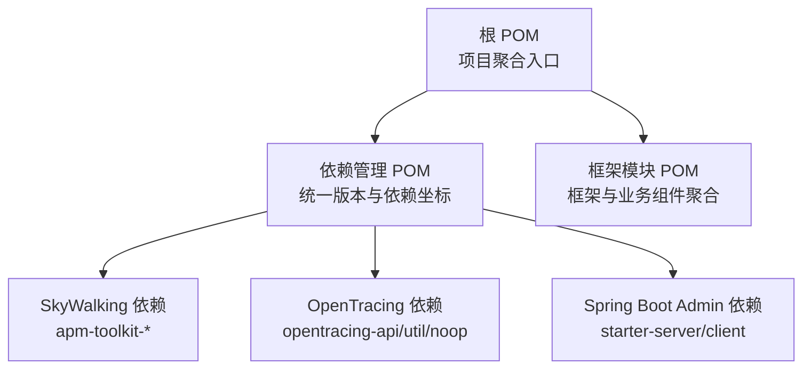
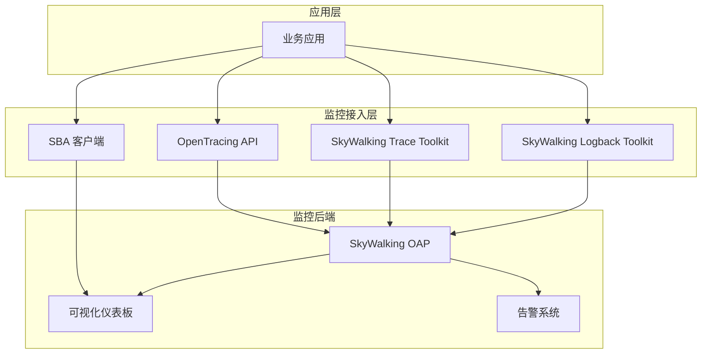
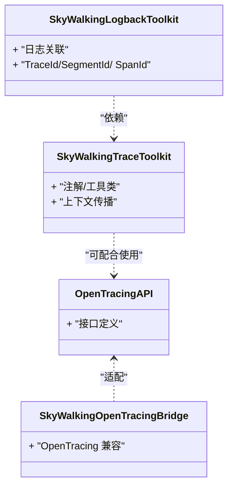
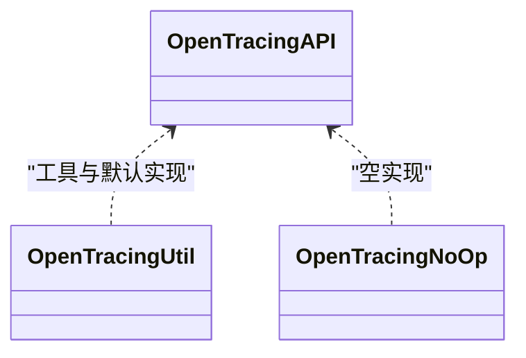
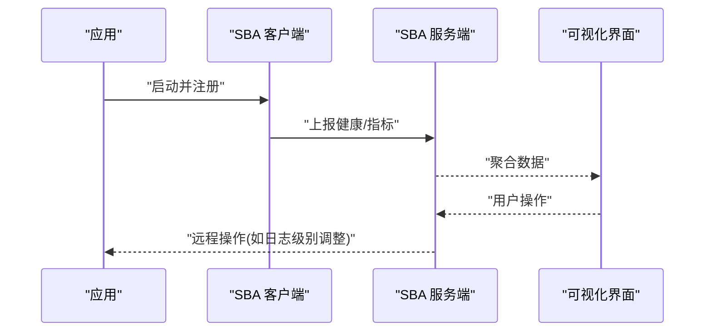
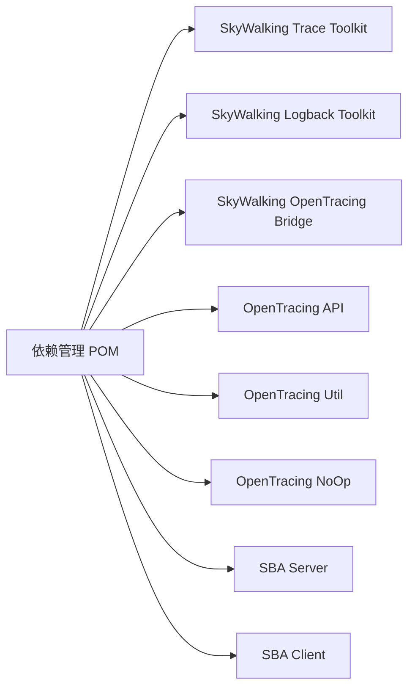

# 监控组件

<cite>
**本文引用的文件**
- [根 POM](file://pom.xml)
- [依赖管理 POM](file://pandora-dependencies/pom.xml)
- [框架模块 POM](file://pandora-framework/pom.xml)
- [项目说明](file://README.md)
</cite>

## 目录
1. [引言](#引言)
2. [项目结构](#项目结构)
3. [核心组件](#核心组件)
4. [架构总览](#架构总览)
5. [详细组件分析](#详细组件分析)
6. [依赖分析](#依赖分析)
7. [性能考虑](#性能考虑)
8. [故障排查指南](#故障排查指南)
9. [结论](#结论)
10. [附录](#附录)

## 引言
本文件面向运维与研发团队，系统性梳理本仓库中与监控体系相关的依赖与能力边界，重点围绕以下目标展开：
- SkyWalking 分布式链路追踪的依赖引入与集成要点
- OpenTracing API 的依赖与使用边界
- APM、服务依赖分析、性能瓶颈定位的实践建议
- 监控数据采集、告警与可视化仪表板的通用配置思路
- 分布式 ID 生成、日志聚合与错误追踪的对接方式
- 性能指标采集、业务指标埋点与监控数据导出的实施路径
- 面向生产环境的监控体系建设与故障排查流程

说明：当前仓库以依赖管理为主，未包含具体监控组件的实现代码；本文基于已声明的依赖进行概念性与实操性指导。

## 项目结构
本仓库采用多模块结构，监控相关能力通过依赖管理集中定义，便于各业务模块按需启用。

图表来源
- [根 POM:11-14](file://pom.xml#L11-L14)
- [依赖管理 POM:295-344](file://pandora-dependencies/pom.xml#L295-L344)

章节来源
- [根 POM:11-14](file://pom.xml#L11-L14)
- [依赖管理 POM:106-137](file://pandora-dependencies/pom.xml#L106-L137)
- [框架模块 POM:15-24](file://pandora-framework/pom.xml#L15-L24)

## 核心组件
- SkyWalking 工具集
  - apm-toolkit-trace：提供注解与 API 用于手动/自动埋点与上下文传播
  - apm-toolkit-logback-1.x：与 Logback 集成的日志关联能力
  - apm-toolkit-opentracing：OpenTracing 兼容桥接
- OpenTracing API 生态
  - opentracing-api：标准 API
  - opentracing-util：工具与默认实现
  - opentracing-noop：空实现，便于在无追踪场景下保持代码一致性
- Spring Boot Admin
  - starter-server：监控服务端
  - starter-client：客户端，暴露健康与指标

章节来源
- [依赖管理 POM:295-344](file://pandora-dependencies/pom.xml#L295-L344)

## 架构总览
下图展示监控相关组件在系统中的位置与交互关系：

图表来源
- [依赖管理 POM:295-344](file://pandora-dependencies/pom.xml#L295-L344)

## 详细组件分析

### SkyWalking 工具集
- apm-toolkit-trace
  - 用途：提供注解与 API，用于在业务代码中显式创建 Span、设置标签、处理异常等
  - 建议：在关键业务路径、跨进程边界处添加手动埋点，确保上下文正确传递
- apm-toolkit-logback-1.x
  - 用途：将日志与当前 Trace 上下文关联，便于日志聚合与问题定位
  - 建议：统一日志格式，保留 TraceId/SegmentId/SpanId，便于跨系统串联
- apm-toolkit-opentracing
  - 用途：提供 OpenTracing 兼容层，便于在已有 OpenTracing 代码中复用
  - 建议：与 OpenTracing API 同时引入时，注意兼容性与性能开销

图表来源
- [依赖管理 POM:295-324](file://pandora-dependencies/pom.xml#L295-L324)

章节来源
- [依赖管理 POM:295-324](file://pandora-dependencies/pom.xml#L295-L324)

### OpenTracing API 集成
- opentracing-api：标准化的追踪 API，便于在不同实现间切换
- opentracing-util：常用工具与默认实现
- opentracing-noop：空实现，适合在不需要追踪时保持接口一致

图表来源
- [依赖管理 POM:310-324](file://pandora-dependencies/pom.xml#L310-L324)

章节来源
- [依赖管理 POM:310-324](file://pandora-dependencies/pom.xml#L310-L324)

### Spring Boot Admin
- starter-server：作为监控服务端，负责聚合各客户端的健康状态与指标
- starter-client：在应用侧暴露 Actuator 端点，供服务端拉取

图表来源
- [依赖管理 POM:326-335](file://pandora-dependencies/pom.xml#L326-L335)

章节来源
- [依赖管理 POM:326-335](file://pandora-dependencies/pom.xml#L326-L335)

## 依赖分析
- 版本与范围
  - SkyWalking：apm-toolkit-trace、apm-toolkit-logback-1.x、apm-toolkit-opentracing
  - OpenTracing：opentracing-api、opentracing-util、opentracing-noop
  - Spring Boot Admin：starter-server、starter-client
- 耦合与内聚
  - 依赖管理集中于 pandora-dependencies，便于统一升级与约束
  - 各业务模块按需引入，降低非必要耦合
- 外部依赖与集成点
  - SkyWalking OAP：负责接收探针上报、计算与持久化
  - 可视化与告警：由外部系统对接 OAP 或通过 SBA 展示

图表来源
- [依赖管理 POM:295-344](file://pandora-dependencies/pom.xml#L295-L344)

章节来源
- [依赖管理 POM:295-344](file://pandora-dependencies/pom.xml#L295-L344)

## 性能考虑
- 探针开销控制
  - 合理选择采样率与阈值，避免高频路径上的过度记录
  - 手动埋点聚焦关键路径，减少不必要的 Span 创建
- 日志与追踪关联
  - 在高并发场景下，避免在日志中输出过大的上下文数据
  - 使用结构化日志，便于后续检索与聚合
- 指标与告警
  - 将热点指标纳入告警，设置合理的阈值与抑制策略
  - 避免告警风暴，结合趋势与基线进行智能告警

## 故障排查指南
- 追踪链路缺失
  - 检查是否正确引入 apm-toolkit-trace 与 apm-toolkit-opentracing
  - 确认 OpenTracing 与 SkyWalking 的桥接配置一致
- 日志无法关联 Trace
  - 校验 apm-toolkit-logback-1.x 是否生效
  - 确认日志格式中包含 TraceId/SegmentId/SpanId
- 指标与健康状态异常
  - 检查 SBA 客户端是否成功注册到服务端
  - 核对 Actuator 端点访问权限与网络连通性
- 告警不触发或误报
  - 校验告警规则与阈值设置
  - 结合历史趋势与基线进行验证

## 结论
本仓库通过依赖管理集中引入了 SkyWalking、OpenTracing 与 Spring Boot Admin 的核心能力，为构建统一的监控体系提供了基础支撑。实际落地时，建议结合业务特性完善埋点策略、日志规范与告警规则，并持续优化采样与阈值以平衡可观测性与性能。

## 附录
- 快速对照清单
  - 引入 apm-toolkit-trace 与 apm-toolkit-logback-1.x
  - 如需 OpenTracing 兼容，引入 apm-toolkit-opentracing 与 opentracing-api/util/noop
  - 在应用侧引入 SBA 客户端，在监控侧部署 SBA 服务端
  - 配置 SkyWalking OAP 接收端与可视化/告警对接