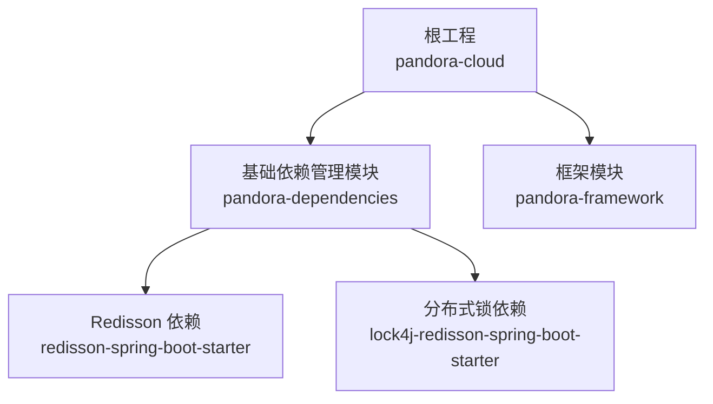
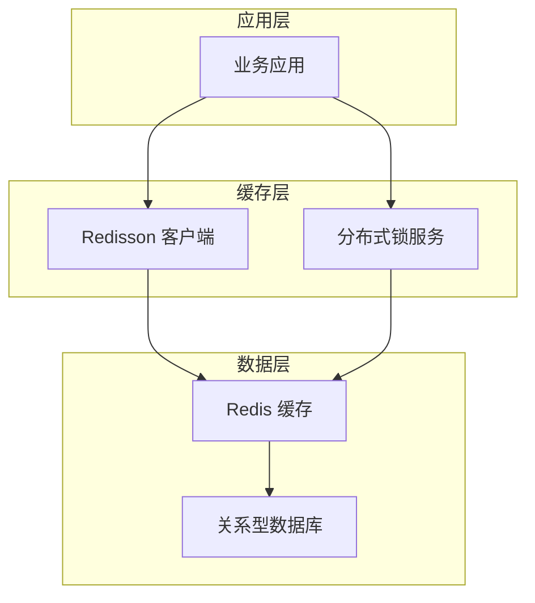
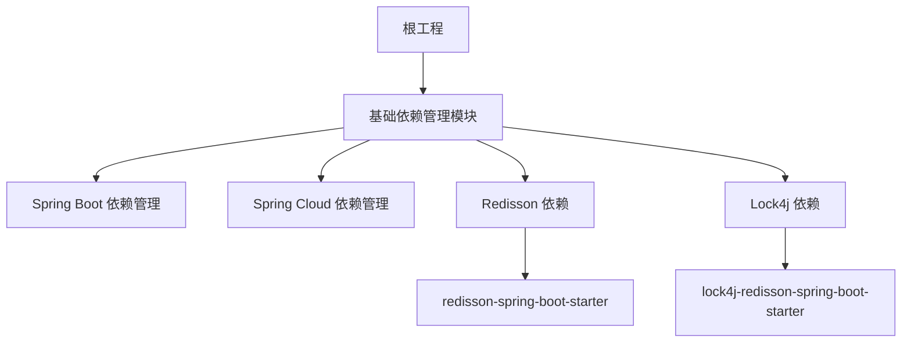

# 缓存组件

<cite>
**本文引用的文件**
- [pom.xml](file://pandora-dependencies/pom.xml)
- [pom.xml](file://pandora-framework/pom.xml)
- [pom.xml](file://pom.xml)
</cite>

## 目录
1. [简介](#简介)
2. [项目结构](#项目结构)
3. [核心组件](#核心组件)
4. [架构总览](#架构总览)
5. [详细组件分析](#详细组件分析)
6. [依赖分析](#依赖分析)
7. [性能考虑](#性能考虑)
8. [故障排查指南](#故障排查指南)
9. [结论](#结论)
10. [附录](#附录)

## 简介
本文件围绕缓存组件展开，重点介绍 Redisson 分布式缓存客户端在本项目中的配置与使用路径，并结合项目实际引入的依赖，系统阐述以下主题：
- Redisson 在 Spring Boot 环境下的自动装配与依赖管理方式
- 分布式对象与服务（分布式锁、分布式集合、分布式映射等）在本项目中的集成思路
- 缓存策略设计原则、缓存穿透与雪崩问题的通用解决方案
- 缓存与数据库协同机制、缓存更新策略与一致性保障
- 不同规模应用的缓存架构设计指导
- 性能调优建议与监控指标
- 分布式锁的使用场景、实现原理与最佳实践

由于当前仓库未包含具体业务代码与配置文件，本文将严格依据已提供的 POM 依赖信息进行说明，并给出可落地的实施建议与参考路径。

## 项目结构
本项目采用多模块结构，其中与缓存组件直接相关的是“基础依赖管理模块”（pandora-dependencies），该模块集中管理各技术栈的版本与依赖，包括 Redisson 与分布式锁相关依赖。

图表来源
- [pom.xml:255-259](file://pandora-dependencies/pom.xml#L255-L259)
- [pom.xml:286-295](file://pandora-dependencies/pom.xml#L286-L295)

章节来源
- [pom.xml:11-14](file://pom.xml#L11-L14)
- [pom.xml:15-24](file://pandora-framework/pom.xml#L15-L24)

## 核心组件
- Redisson 自动装配与版本管理
  - 通过基础依赖模块统一管理 Redisson 版本与自动装配依赖，确保 Spring Boot 应用在引入后可直接获得 Redisson 的自动配置能力。
  - 参考路径：[Redisson 依赖声明:255-259](file://pandora-dependencies/pom.xml#L255-L259)

- 分布式锁集成
  - 项目引入了基于 Redisson 的分布式锁自动装配依赖，便于在应用中以注解或编程方式获取分布式锁，保障并发安全。
  - 参考路径：[Lock4j Redisson 自动装配依赖:286-295](file://pandora-dependencies/pom.xml#L286-L295)

- 版本与生态
  - 基础依赖模块统一管理 Spring Boot、Spring Cloud、MyBatis、Redisson、分布式锁等生态组件版本，确保兼容性与一致性。
  - 参考路径：[版本属性与依赖管理:15-106](file://pandora-dependencies/pom.xml#L15-L106)

章节来源
- [pom.xml:75-77](file://pandora-dependencies/pom.xml#L75-L77)
- [pom.xml:255-259](file://pandora-dependencies/pom.xml#L255-L259)
- [pom.xml:286-295](file://pandora-dependencies/pom.xml#L286-L295)

## 架构总览
下图展示了缓存组件在本项目中的定位与关系：

说明
- 应用通过 Redisson 访问 Redis 缓存，同时利用分布式锁保障高并发场景下的数据一致性。
- 缓存与数据库之间形成读写分离与一致性保障的协作关系。

## 详细组件分析

### Redisson 分布式缓存客户端
- 自动装配与启动流程
  - 引入 Redisson 的 Spring Boot 自动装配依赖后，应用启动时会加载 Redisson 的自动配置，完成客户端初始化与 Bean 注册。
  - 参考路径：[Redisson 自动装配依赖:255-259](file://pandora-dependencies/pom.xml#L255-L259)

- 分布式对象与服务
  - 分布式锁：用于互斥控制，避免并发写冲突。
  - 分布式集合与映射：用于跨实例共享的数据结构，满足分布式场景下的集合操作与键值映射需求。
  - 其他分布式对象（如信号量、计数器等）可根据业务扩展引入。
  - 参考路径：[Lock4j Redisson 自动装配依赖:286-295](file://pandora-dependencies/pom.xml#L286-L295)

- 配置要点（基于自动装配）
  - 通常无需手动创建 Redisson 客户端 Bean，自动装配会根据配置文件中的 Redis 地址、认证等信息完成初始化。
  - 若需定制化配置，可在配置文件中添加 Redisson 相关属性，由自动装配读取并构建客户端。
  - 参考路径：[Redisson 依赖声明:255-259](file://pandora-dependencies/pom.xml#L255-L259)

- 使用建议
  - 将 Redisson 客户端注入到业务类中，按需使用分布式对象与服务。
  - 对于分布式锁，建议明确超时时间与重试策略，避免死锁与长时间阻塞。
  - 对于分布式集合与映射，注意序列化策略与内存占用，合理设置过期时间与容量上限。

章节来源
- [pom.xml:255-259](file://pandora-dependencies/pom.xml#L255-L259)
- [pom.xml:286-295](file://pandora-dependencies/pom.xml#L286-L295)

### 分布式锁
- 使用场景
  - 并发写入热点数据时的互斥控制
  - 分布式定时任务的互斥执行
  - 限流与幂等校验
  - 批量操作的串行化处理

- 实现原理（通用）
  - 基于 Redis 的 SET key value NX EX ttl 原子命令实现加锁；解锁通过 Lua 脚本保证原子释放。
  - 锁续期与看门狗机制防止超时释放导致的竞态条件。

- 最佳实践
  - 明确锁粒度与作用域，避免过度使用分布式锁造成性能瓶颈。
  - 设置合理的超时时间与重试次数，避免死锁与级联失败。
  - 结合业务特性选择合适的锁类型（公平锁、读写锁、信号量等）。
  - 记录锁的获取与释放日志，便于问题排查与审计。

- 在本项目中的集成
  - 通过引入 Lock4j Redisson 自动装配依赖，即可在应用中便捷地使用分布式锁能力。
  - 参考路径：[Lock4j Redisson 自动装配依赖:286-295](file://pandora-dependencies/pom.xml#L286-L295)

章节来源
- [pom.xml:286-295](file://pandora-dependencies/pom.xml#L286-L295)

### 缓存策略与一致性
- 设计原则
  - 读多写少场景优先使用缓存，写少读多场景采用延迟双删或异步更新。
  - 缓存键设计应具备唯一性与可预测性，避免命名冲突与碎片化。
  - 合理设置 TTL 与过期策略，结合热点数据的预热与淘汰策略。

- 缓存穿透
  - 通过布隆过滤器或缓存空值（带短 TTL）降低无效请求对后端的压力。
  - 对非法参数进行拦截与限流，减少异常请求对缓存与数据库的冲击。

- 缓存雪崩
  - 为缓存项设置随机 TTL，避免同一时间大面积失效。
  - 采用多级缓存（本地缓存 + 远程缓存）与热点保护策略，限制突发流量。

- 缓存与数据库协同
  - 读策略：先查缓存，命中则返回；未命中再查数据库并回填缓存。
  - 写策略：先更新数据库，再删除缓存（或异步更新），避免脏读。
  - 一致性保障：结合分布式锁与消息队列，确保写操作的顺序性与最终一致性。

- 参考路径
  - Redisson 与分布式锁的依赖已在基础依赖模块中声明，便于在业务中直接使用。
  - 参考路径：[Redisson 依赖声明:255-259](file://pandora-dependencies/pom.xml#L255-L259)，[Lock4j Redisson 自动装配依赖:286-295](file://pandora-dependencies/pom.xml#L286-L295)

章节来源
- [pom.xml:255-259](file://pandora-dependencies/pom.xml#L255-L259)
- [pom.xml:286-295](file://pandora-dependencies/pom.xml#L286-L295)

### 不同规模应用的缓存架构设计
- 小型应用
  - 单机 Redis 或本地缓存 + 远程缓存，简化部署与运维成本。
  - 使用 Redisson 的简单分布式对象与锁，快速满足基本并发需求。

- 中型应用
  - 引入哨兵/集群模式的 Redis，提升可用性与扩展性。
  - 采用多级缓存与热点数据预热，结合分布式锁保障关键路径的一致性。

- 大型应用
  - 构建多租户隔离的缓存体系，结合命名空间与键前缀管理。
  - 引入缓存路由与灰度发布策略，配合可观测性与压测工具持续优化。

## 依赖分析
本项目通过“基础依赖管理模块”集中管理 Redisson 与分布式锁相关依赖，确保版本统一与自动装配生效。

图表来源
- [pom.xml:112-140](file://pandora-dependencies/pom.xml#L112-L140)
- [pom.xml:255-259](file://pandora-dependencies/pom.xml#L255-L259)
- [pom.xml:286-295](file://pandora-dependencies/pom.xml#L286-L295)

章节来源
- [pom.xml:112-140](file://pandora-dependencies/pom.xml#L112-L140)
- [pom.xml:255-259](file://pandora-dependencies/pom.xml#L255-L259)
- [pom.xml:286-295](file://pandora-dependencies/pom.xml#L286-L295)

## 性能考虑
- 连接池与网络
  - 合理配置 Redisson 的连接池大小与超时时间，避免连接抖动与阻塞。
  - 使用集群模式时，关注节点间网络延迟与分区容忍性。

- 序列化与内存
  - 选择高效的序列化方案（如 JSON、Kryo 或 Protobuf），降低序列化开销。
  - 控制缓存对象大小与数量，定期清理无用键，避免内存膨胀。

- 分布式锁
  - 锁粒度要适中，避免长事务与全局锁导致吞吐下降。
  - 合理设置锁超时与续期策略，防止锁过期与死锁。

- 监控与告警
  - 关注缓存命中率、过期率、淘汰率与慢查询指标。
  - 对分布式锁的等待时间与失败率进行监控，及时发现热点与竞争。

## 故障排查指南
- 启动阶段
  - 若 Redisson 未生效，检查是否正确引入自动装配依赖以及配置文件中的 Redis 地址与认证信息。
  - 参考路径：[Redisson 依赖声明:255-259](file://pandora-dependencies/pom.xml#L255-L259)

- 运行阶段
  - 分布式锁无法释放：检查锁的持有者标识与释放逻辑，确保使用正确的解锁方式。
  - 缓存命中异常：核对键命名规则、TTL 设置与序列化策略，确认缓存与数据库状态一致。
  - 性能波动：检查连接池配置、网络延迟与热点数据分布，必要时引入多级缓存与限流策略。

- 参考路径
  - [Lock4j Redisson 自动装配依赖:286-295](file://pandora-dependencies/pom.xml#L286-L295)

章节来源
- [pom.xml:255-259](file://pandora-dependencies/pom.xml#L255-L259)
- [pom.xml:286-295](file://pandora-dependencies/pom.xml#L286-L295)

## 结论
本项目通过基础依赖模块统一引入 Redisson 与分布式锁相关依赖，为应用提供了开箱即用的分布式缓存与并发控制能力。结合本文提出的缓存策略、一致性保障与性能优化建议，可在不同规模的应用中构建稳定、高效且可扩展的缓存架构。后续可在业务模块中逐步引入具体的缓存使用示例与监控指标，完善整体缓存治理体系。

## 附录
- 参考路径
  - [根工程 POM:11-14](file://pom.xml#L11-L14)
  - [框架模块 POM:15-24](file://pandora-framework/pom.xml#L15-L24)
  - [基础依赖模块 POM:255-259](file://pandora-dependencies/pom.xml#L255-L259)
  - [Lock4j Redisson 自动装配依赖:286-295](file://pandora-dependencies/pom.xml#L286-L295)