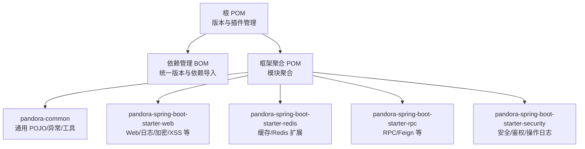
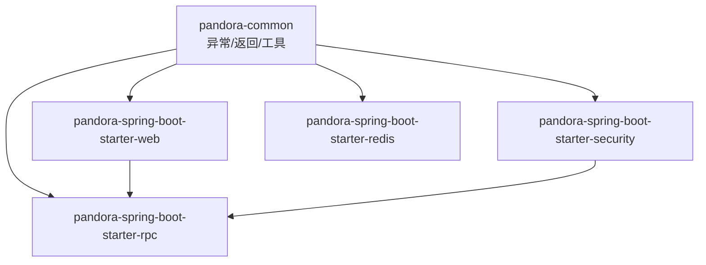
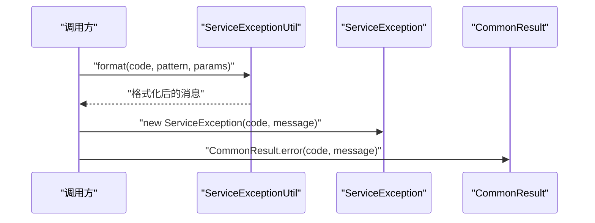
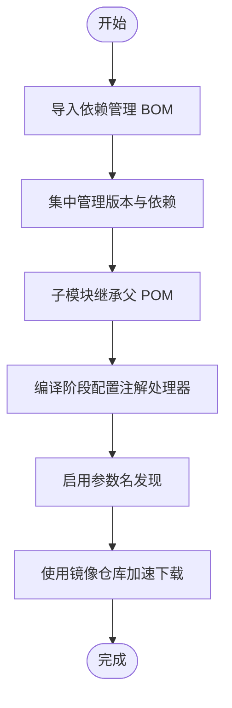

# 贡献指南

<cite>
**本文引用的文件**
- [根 POM](file://pom.xml)
- [框架聚合 POM](file://pandora-framework/pom.xml)
- [依赖管理 BOM](file://pandora-dependencies/pom.xml)
- [公共模块 POM](file://pandora-framework/pandora-common/pom.xml)
- [公共模块 README](file://pandora-framework/pandora-common/README.md)
- [全局异常 ServiceException](file://pandora-framework/pandora-common/src/main/java/net/ittimeline/pandora/framework/common/exception/ServiceException.java)
- [通用返回 CommonResult](file://pandora-framework/pandora-common/src/main/java/net/ittimeline/pandora/framework/common/pojo/CommonResult.java)
- [异常工具 ServiceExceptionUtil](file://pandora-framework/pandora-common/src/main/java/net/ittimeline/pandora/framework/common/exception/util/ServiceExceptionUtil.java)
- [验证工具 ValidationUtils](file://pandora-framework/pandora-common/src/main/java/net/ittimeline/pandora/framework/common/util/web/validation/ValidationUtils.java)
- [集合工具 CollectionUtils](file://pandora-framework/pandora-common/src/main/java/net/ittimeline/pandora/framework/common/util/foundational/collection/CollectionUtils.java)
- [对象工具 ObjectUtils](file://pandora-framework/pandora-common/src/main/java/net/ittimeline/pandora/framework/common/util/foundational/object/ObjectUtils.java)
- [API 日志自动配置](file://pandora-framework/pandora-spring-boot-starter-web/src/main/java/net/ittimeline/pandora/framework/apilog/config/PandoraApiLogAutoConfiguration.java)
- [API 日志 RPC 自动配置](file://pandora-framework/pandora-spring-boot-starter-web/src/main/java/net/ittimeline/pandora/framework/apilog/config/PandoraApiLogRpcAutoConfiguration.java)
- [操作日志自动配置](file://pandora-framework/pandora-spring-boot-starter-security/src/main/java/net/ittimeline/pandora/framework/operatelog/config/PandoraOperateLogConfiguration.java)
- [.gitignore](file://.gitignore)
- [lombok.config](file://lombok.config)
- [项目总 README](file://README.md)
</cite>

## 目录
1. [简介](#简介)
2. [项目结构](#项目结构)
3. [核心组件](#核心组件)
4. [架构概览](#架构概览)
5. [详细组件分析](#详细组件分析)
6. [依赖分析](#依赖分析)
7. [性能考虑](#性能考虑)
8. [故障排查指南](#故障排查指南)
9. [结论](#结论)
10. [附录](#附录)

## 简介
本指南面向希望为 Pandora Cloud 框架做出贡献的新老贡献者，覆盖从开发环境搭建、IDE 配置、依赖安装、测试运行、构建打包，到代码风格、命名约定、文档规范、Issue 与 PR 流程、代码审查标准、测试策略与覆盖率、CI 配置以及社区参与与版本发布流程的完整路径。目标是帮助你快速上手并高质量地参与项目贡献。

## 项目结构
Pandora Cloud 采用多模块 Maven 聚合工程组织，顶层 POM 管理版本与插件，框架聚合模块按功能拆分为多个 Spring Boot Starter 子模块，公共能力集中在 pandora-common 中，便于各模块复用。

图表来源
- [根 POM:1-150](file://pom.xml#L1-L150)
- [框架聚合 POM:1-41](file://pandora-framework/pom.xml#L1-L41)
- [依赖管理 BOM:1-637](file://pandora-dependencies/pom.xml#L1-L637)

章节来源
- [根 POM:1-150](file://pom.xml#L1-L150)
- [框架聚合 POM:1-41](file://pandora-framework/pom.xml#L1-L41)
- [依赖管理 BOM:1-637](file://pandora-dependencies/pom.xml#L1-L637)

## 核心组件
- 通用异常与返回体
  - 异常模型：ServiceException 提供业务异常承载错误码与消息
  - 通用返回：CommonResult 统一接口返回结构，内置成功/失败判断与校验
  - 异常格式化：ServiceExceptionUtil 提供占位符格式化与全局错误码集成
- 通用工具集
  - 集合工具：CollectionUtils 提供去重、转换、过滤等常用操作
  - 对象工具：ObjectUtils 提供默认值、相等性判断等
  - 参数校验：ValidationUtils 基于 Jakarta Validation 提供便捷校验入口
- Web 与安全扩展
  - API 访问日志：通过自动配置注册 Filter 与 Interceptor
  - 操作日志：基于日志记录组件的自动配置与服务实现
  - 安全与鉴权：Token 过滤、认证与授权处理、线程上下文传递

章节来源
- [全局异常 ServiceException:1-64](file://pandora-framework/pandora-common/src/main/java/net/ittimeline/pandora/framework/common/exception/ServiceException.java#L1-L64)
- [通用返回 CommonResult:1-123](file://pandora-framework/pandora-common/src/main/java/net/ittimeline/pandora/framework/common/pojo/CommonResult.java#L1-L123)
- [异常工具 ServiceExceptionUtil:1-39](file://pandora-framework/pandora-common/src/main/java/net/ittimeline/pandora/framework/common/exception/util/ServiceExceptionUtil.java#L1-L39)
- [验证工具 ValidationUtils:43-55](file://pandora-framework/pandora-common/src/main/java/net/ittimeline/pandora/framework/common/util/web/validation/ValidationUtils.java#L43-L55)
- [集合工具 CollectionUtils:43-76](file://pandora-framework/pandora-common/src/main/java/net/ittimeline/pandora/framework/common/util/foundational/collection/CollectionUtils.java#L43-L76)
- [对象工具 ObjectUtils:49-74](file://pandora-framework/pandora-common/src/main/java/net/ittimeline/pandora/framework/common/util/foundational/object/ObjectUtils.java#L49-L74)
- [API 日志自动配置:1-25](file://pandora-framework/pandora-spring-boot-starter-web/src/main/java/net/ittimeline/pandora/framework/apilog/config/PandoraApiLogAutoConfiguration.java#L1-L25)
- [API 日志 RPC 自动配置:1-18](file://pandora-framework/pandora-spring-boot-starter-web/src/main/java/net/ittimeline/pandora/framework/apilog/config/PandoraApiLogRpcAutoConfiguration.java#L1-L18)
- [操作日志自动配置:1-27](file://pandora-framework/pandora-spring-boot-starter-security/src/main/java/net/ittimeline/pandora/framework/operatelog/config/PandoraOperateLogConfiguration.java#L1-L27)

## 架构概览
下图展示框架模块间的关系与职责边界，突出公共能力的复用与各扩展模块的装配关系。

图表来源
- [公共模块 POM:1-114](file://pandora-framework/pandora-common/pom.xml#L1-L114)
- [框架聚合 POM:26-32](file://pandora-framework/pom.xml#L26-L32)

章节来源
- [公共模块 POM:1-114](file://pandora-framework/pandora-common/pom.xml#L1-L114)
- [框架聚合 POM:26-32](file://pandora-framework/pom.xml#L26-L32)

## 详细组件分析

### 异常与返回体系
- 设计要点
  - 通过 ErrorCode 与全局错误码常量统一错误语义
  - ServiceException 与 CommonResult 解耦业务异常与接口返回
  - ServiceExceptionUtil 提供安全的占位符格式化，避免参数不匹配导致的异常
- 关键流程（异常抛出与返回）

图表来源
- [异常工具 ServiceExceptionUtil:30-39](file://pandora-framework/pandora-common/src/main/java/net/ittimeline/pandora/framework/common/exception/util/ServiceExceptionUtil.java#L30-L39)
- [全局异常 ServiceException:34-42](file://pandora-framework/pandora-common/src/main/java/net/ittimeline/pandora/framework/common/exception/ServiceException.java#L34-L42)
- [通用返回 CommonResult:54-72](file://pandora-framework/pandora-common/src/main/java/net/ittimeline/pandora/framework/common/pojo/CommonResult.java#L54-L72)

章节来源
- [异常工具 ServiceExceptionUtil:1-39](file://pandora-framework/pandora-common/src/main/java/net/ittimeline/pandora/framework/common/exception/util/ServiceExceptionUtil.java#L1-L39)
- [全局异常 ServiceException:1-64](file://pandora-framework/pandora-common/src/main/java/net/ittimeline/pandora/framework/common/exception/ServiceException.java#L1-L64)
- [通用返回 CommonResult:1-123](file://pandora-framework/pandora-common/src/main/java/net/ittimeline/pandora/framework/common/pojo/CommonResult.java#L1-L123)

### 参数校验与工具函数
- 参数校验
  - ValidationUtils.validate(...) 基于 Jakarta Validation 校验对象，校验失败抛出约束异常
- 工具函数
  - CollectionUtils：支持去重、转换、过滤的链式操作
  - ObjectUtils：提供默认值、相等性判断等

章节来源
- [验证工具 ValidationUtils:43-55](file://pandora-framework/pandora-common/src/main/java/net/ittimeline/pandora/framework/common/util/web/validation/ValidationUtils.java#L43-L55)
- [集合工具 CollectionUtils:43-76](file://pandora-framework/pandora-common/src/main/java/net/ittimeline/pandora/framework/common/util/foundational/collection/CollectionUtils.java#L43-L76)
- [对象工具 ObjectUtils:49-74](file://pandora-framework/pandora-common/src/main/java/net/ittimeline/pandora/framework/common/util/foundational/object/ObjectUtils.java#L49-L74)

### Web 与安全扩展装配
- API 访问日志
  - 通过自动配置注册 Filter 与 Interceptor，结合 WebProperties 控制开关与顺序
- 操作日志
  - 通过 @EnableLogRecord 启用，注入 ILogRecordService 实现
- 安全与鉴权
  - TokenAuthenticationFilter、认证与授权处理器、线程上下文传递工具

章节来源
- [API 日志自动配置:1-25](file://pandora-framework/pandora-spring-boot-starter-web/src/main/java/net/ittimeline/pandora/framework/apilog/config/PandoraApiLogAutoConfiguration.java#L1-L25)
- [API 日志 RPC 自动配置:1-18](file://pandora-framework/pandora-spring-boot-starter-web/src/main/java/net/ittimeline/pandora/framework/apilog/config/PandoraApiLogRpcAutoConfiguration.java#L1-L18)
- [操作日志自动配置:1-27](file://pandora-framework/pandora-spring-boot-starter-security/src/main/java/net/ittimeline/pandora/framework/operatelog/config/PandoraOperateLogConfiguration.java#L1-L27)

## 依赖分析
- 版本与依赖管理
  - 顶层 POM 通过 dependencyManagement 导入依赖管理 BOM，集中管理 Spring Boot、Spring Cloud、MyBatis、Redisson、OkHttp、SkyWalking 等生态组件版本
  - 各子模块继承父 POM，直接使用受管依赖，避免版本冲突
- 插件与编译参数
  - maven-compiler-plugin 配置 annotationProcessorPaths，确保 Lombok 与 MapStruct 组合正常工作
  - -parameters 参数启用以兼容 Spring Boot 3.x 的参数名发现
- 仓库镜像
  - 配置阿里云与华为云 Maven 镜像加速依赖下载

图表来源
- [根 POM:40-147](file://pom.xml#L40-L147)
- [依赖管理 BOM:106-601](file://pandora-dependencies/pom.xml#L106-L601)

章节来源
- [根 POM:1-150](file://pom.xml#L1-L150)
- [依赖管理 BOM:1-637](file://pandora-dependencies/pom.xml#L1-L637)

## 性能考虑
- 依赖版本统一与最小化
  - 通过 BOM 管理版本，减少重复依赖与冲突带来的额外开销
- 编译优化
  - 合理配置注解处理器顺序，避免重复扫描与生成
- 运行时依赖裁剪
  - 按需引入 Starter，避免不必要的自动配置与 Bean 创建
- 日志与监控
  - 使用 SkyWalking 等链路追踪组件时，注意采样率与日志级别，避免对性能造成影响

## 故障排查指南
- 编译错误：Lombok + MapStruct 组合
  - 症状：编译时报“找不到属性”或 MapStruct 未生成 Mapper
  - 处理：确认 maven-compiler-plugin 的 annotationProcessorPaths 顺序与版本，确保 Lombok 与 MapStruct 的处理器均生效
- 参数名发现
  - 症状：运行时无法正确识别方法参数名
  - 处理：确认编译参数中包含 -parameters
- 依赖冲突
  - 症状：启动时报 NoSuchMethodError 或 ClassNotFoundException
  - 处理：检查子模块是否显式声明了不受管版本；优先使用 BOM 中的受管版本
- 测试失败
  - 症状：单元测试执行失败或覆盖率异常
  - 处理：确认 maven-surefire-plugin 版本与 JUnit 5 兼容；检查测试依赖与 Mock 配置

章节来源
- [根 POM:64-98](file://pom.xml#L64-L98)
- [依赖管理 BOM:501-531](file://pandora-dependencies/pom.xml#L501-L531)

## 结论
本指南提供了从环境搭建到贡献实践的全流程指引。建议在提交任何改动前，先阅读公共模块的 README 与核心类的设计意图，确保改动与整体架构保持一致。遵循本文的风格与流程，将有助于提高贡献质量与评审效率。

## 附录

### 开发环境搭建
- JDK 版本
  - 使用 Java 25（与项目属性一致）
- IDE 推荐
  - IntelliJ IDEA 或 Eclipse（根据团队习惯），启用 Lombok 插件
- Maven 配置
  - 使用本地 Maven，或通过 wrapper 运行 mvnw
  - 建议使用镜像仓库加速下载
- 依赖安装
  - 在根目录执行构建命令以安装所有模块与依赖

章节来源
- [根 POM:20-37](file://pom.xml#L20-L37)
- [根 POM:134-147](file://pom.xml#L134-L147)

### IDE 配置
- Lombok
  - 启用注解处理；项目已提供 lombok.config，确保生成的 getter/setter/toString 等符合团队约定
- MapStruct
  - 确保注解处理器顺序正确，避免编译期错误
- 参数名发现
  - 编译参数中包含 -parameters

章节来源
- [lombok.config:1-4](file://lombok.config#L1-L4)
- [根 POM:94-98](file://pom.xml#L94-L98)

### 依赖安装与构建
- 依赖安装
  - 在根目录执行构建命令，Maven 将根据 BOM 下载并安装所有模块依赖
- 构建打包
  - 使用 Maven 生命周期命令进行编译、测试与打包（具体命令请参考各模块的 pom.xml）

章节来源
- [根 POM:102-129](file://pom.xml#L102-L129)
- [框架聚合 POM:1-41](file://pandora-framework/pom.xml#L1-L41)

### 测试运行与覆盖率
- 测试框架
  - 使用 Spring Boot Test 与 JUnit 5；Mock 框架为 Mockito Inline
- 运行方式
  - 在各模块目录下执行测试命令，或在 IDE 中运行单测
- 覆盖率
  - 建议在 CI 中统计覆盖率并设置阈值（如达到一定覆盖率才允许合并）

章节来源
- [依赖管理 BOM:501-531](file://pandora-dependencies/pom.xml#L501-L531)

### 代码风格与命名约定
- 包与类命名
  - 采用分层与功能域划分（如 common、web、security、redis 等），类名使用帕斯卡命名法
- 字段与方法
  - 字段使用驼峰命名；方法遵循语义化命名；避免缩写，保证可读性
- 注解与 Lombok
  - 使用 Lombok 简化样板代码，但避免滥用；确保 toString、equals/hashCode 等行为符合预期
- 文档注释
  - 重要类与方法应包含简明注释，说明用途、参数与返回值

### 文档编写规范
- README
  - 模块 README 应包含模块职责、关键类与使用示例
- 代码注释
  - 关键流程与设计决策应有注释说明
- 示例与用法
  - 在公共模块 README 中列出核心类与其职责，便于使用者快速定位

章节来源
- [公共模块 README:1-33](file://pandora-framework/pandora-common/README.md#L1-L33)

### Issue 报告模板
- 标题：简洁描述问题
- 环境：JDK 版本、Maven 版本、操作系统
- 复现步骤：最小可复现步骤
- 期望行为：期望的结果
- 实际行为：实际结果
- 日志与截图：必要时附上日志片段或截图

### Pull Request 流程
- 分支策略
  - 基于主分支新建特性分支，完成后发起 PR
- 描述规范
  - 清晰说明变更目的、范围与影响
- 代码审查
  - 至少一名维护者审查；关注代码风格、异常处理、测试覆盖与文档更新
- CI 与测试
  - 确保所有测试通过，覆盖率达标

### 代码审查标准
- 正确性
  - 逻辑正确、边界条件处理完善
- 可维护性
  - 代码清晰、注释充分、模块职责单一
- 兼容性
  - 不破坏现有 API；必要时提供迁移指南
- 性能
  - 避免引入明显性能退化

### 持续集成配置
- 插件与版本
  - maven-surefire-plugin 与 maven-compiler-plugin 的版本已在根 POM 中统一管理
- 仓库镜像
  - 已配置阿里云与华为云镜像，提升依赖下载速度
- 建议
  - 在 CI 中增加静态分析与覆盖率检查，确保质量门槛

章节来源
- [根 POM:52-101](file://pom.xml#L52-L101)
- [根 POM:134-147](file://pom.xml#L134-L147)

### 社区参与与沟通
- 问题反馈
  - 通过 Issue 模板提交问题
- 讨论与协作
  - 在 PR 与 Issue 中积极沟通，及时响应审查意见
- 版本发布
  - 版本号遵循项目属性中的 revision 规则；发布前确保文档与测试齐备

### 常见问题解答
- Q：如何避免 Lombok 与 MapStruct 编译冲突？
  - A：确保注解处理器顺序正确，Lombok 与 MapStruct 的处理器均在配置中声明
- Q：为什么编译后找不到参数名？
  - A：确认编译参数包含 -parameters
- Q：如何引入新的第三方依赖？
  - A：优先在依赖管理 BOM 中统一版本，避免子模块显式指定版本