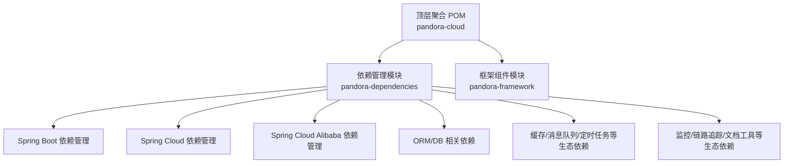
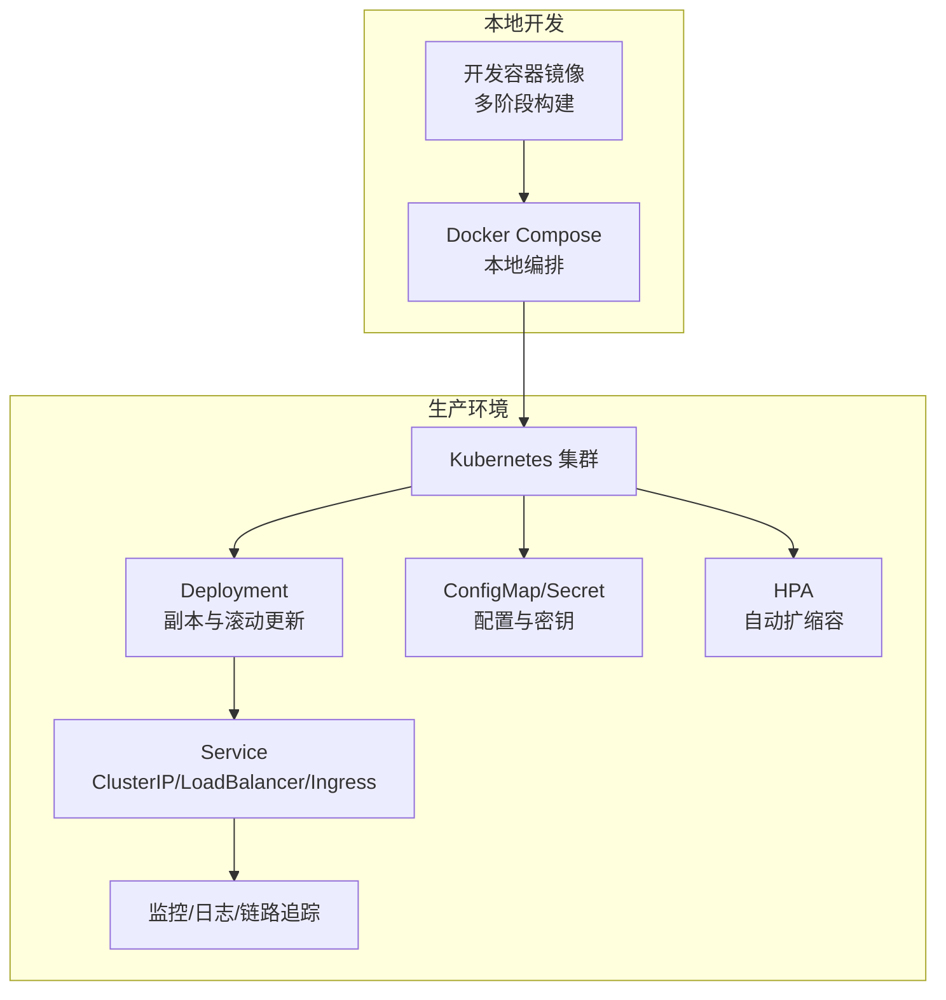
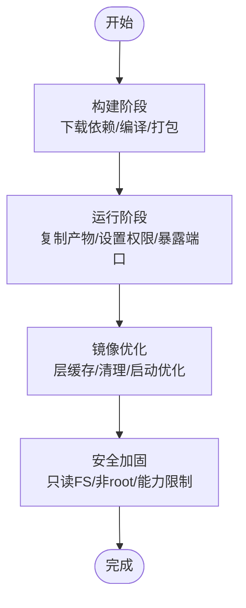
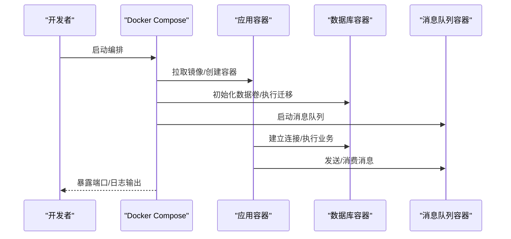
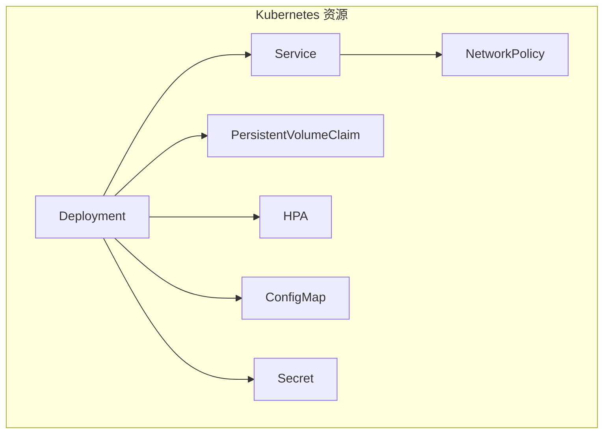
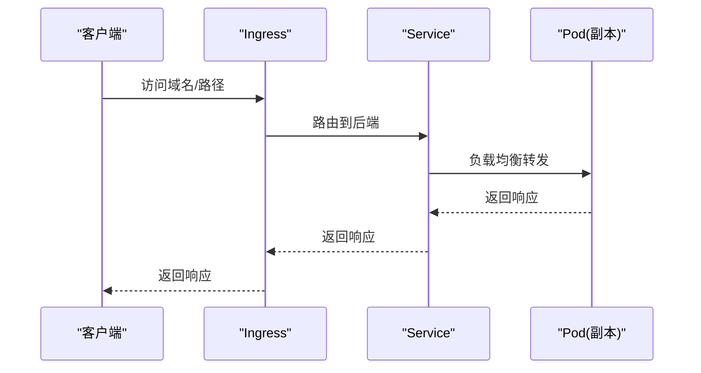
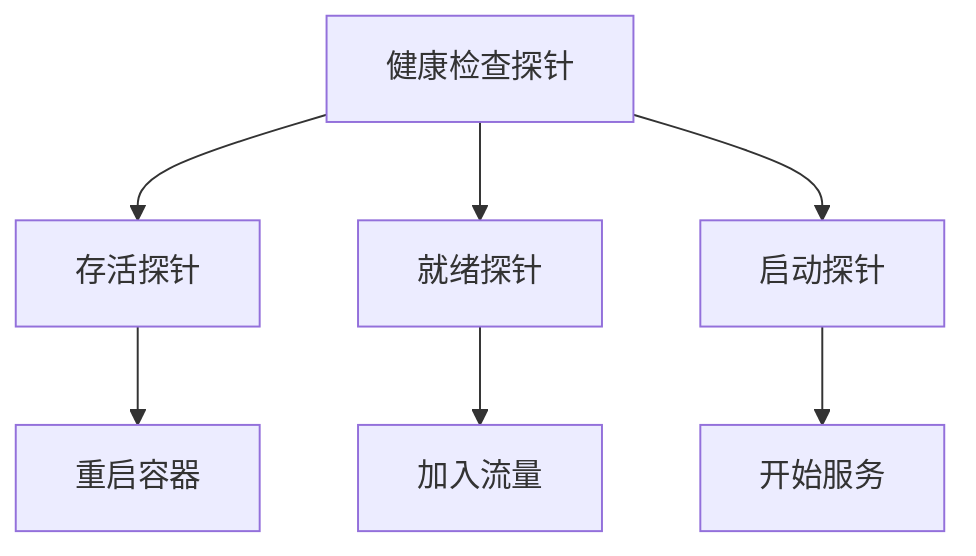
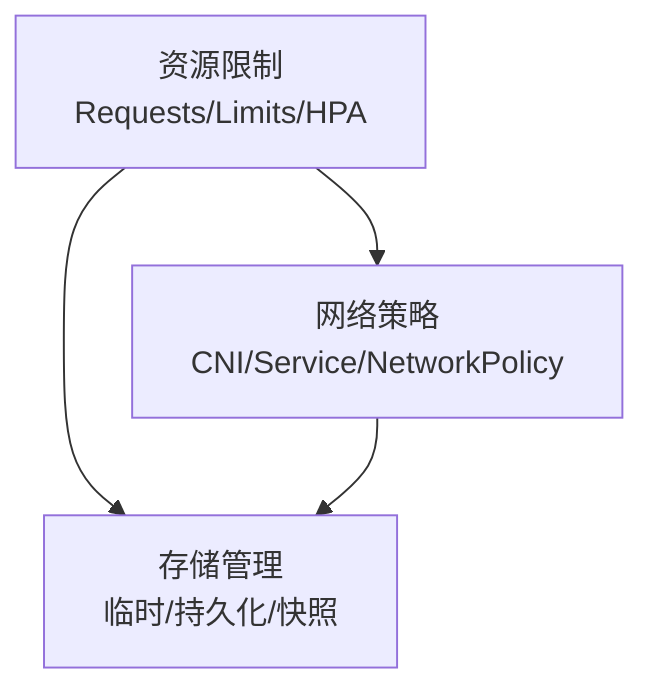
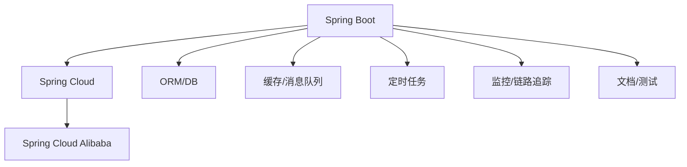

# 容器化部署

<cite>
**本文引用的文件**
- [README.md](file://README.md)
- [pom.xml](file://pom.xml)
- [pandora-dependencies/pom.xml](file://pandora-dependencies/pom.xml)
- [pandora-framework/pom.xml](file://pandora-framework/pom.xml)
</cite>

## 目录
1. [简介](#简介)
2. [项目结构](#项目结构)
3. [核心组件](#核心组件)
4. [架构总览](#架构总览)
5. [详细组件分析](#详细组件分析)
6. [依赖分析](#依赖分析)
7. [性能考虑](#性能考虑)
8. [故障排查指南](#故障排查指南)
9. [结论](#结论)
10. [附录](#附录)

## 简介
本文件面向“潘多拉云平台”的容器化部署，系统性阐述容器化策略、镜像构建与部署流程，覆盖 Dockerfile 编写、Docker Compose 编排与 Kubernetes 清单设计，并结合项目实际的 Maven 构建体系，给出多阶段构建、镜像优化、安全加固、资源限制、网络与存储配置、服务发现与负载均衡、监控与日志、健康检查等最佳实践。由于当前仓库尚未包含容器化配置文件，本文以概念性与工程化落地指导为主，便于后续快速集成到现有工程中。

## 项目结构
仓库采用 Maven 多模块结构，顶层聚合 POM 管理模块与依赖版本，子模块 pandora-framework 作为技术组件聚合体，pandora-dependencies 提供统一依赖管理与版本对齐。整体结构清晰，适合容器化打包与分层构建。

图表来源
- [pom.xml:11-14](file://pom.xml#L11-L14)
- [pandora-dependencies/pom.xml:109-141](file://pandora-dependencies/pom.xml#L109-L141)

章节来源
- [pom.xml:1-150](file://pom.xml#L1-150)
- [pandora-framework/pom.xml:1-34](file://pandora-framework/pom.xml#L1-L34)
- [pandora-dependencies/pom.xml:1-658](file://pandora-dependencies/pom.xml#L1-L658)

## 核心组件
- 顶层聚合 POM：负责模块聚合、版本属性与插件管理，确保构建一致性与可重复性。
- 依赖管理模块：集中管理 Spring 生态、微服务生态、ORM/DB、缓存/消息队列、监控与文档等依赖版本，保证各组件兼容性。
- 框架组件模块：作为技术组件的父模块，承载核心封装与 Spring 配置，便于容器化打包与发布。

章节来源
- [pom.xml:1-150](file://pom.xml#L1-L150)
- [pandora-dependencies/pom.xml:109-141](file://pandora-dependencies/pom.xml#L109-L141)
- [pandora-framework/pom.xml:15-24](file://pandora-framework/pom.xml#L15-L24)

## 架构总览
下图展示容器化部署的整体视图：应用通过多阶段 Dockerfile 构建为精简镜像；Docker Compose 用于本地开发与测试环境编排；Kubernetes 用于生产级编排，包含 Deployment、Service、ConfigMap、Secret、HPA、Ingress 等资源对象，实现服务发现、负载均衡、弹性伸缩与外部访问。

图表来源
- [pom.xml:1-150](file://pom.xml#L1-L150)
- [pandora-dependencies/pom.xml:109-141](file://pandora-dependencies/pom.xml#L109-L141)

## 详细组件分析

### Dockerfile 多阶段构建策略
目标：最小化镜像体积、缩短构建时间、提升安全性与可审计性。

- 基础镜像选择
  - 构建阶段：使用官方 JDK 镜像，启用只读根文件系统与非 root 用户，安装必要工具（如 ca-certificates）。
  - 运行阶段：使用超薄 Alpine 或 distroless 镜像，仅包含运行时所需依赖，降低攻击面。
- 多阶段构建流程
  - 第一阶段：下载依赖并执行构建，输出可执行产物（如 Spring Boot 可执行 jar 或 native image）。
  - 第二阶段：复制构建产物至运行镜像，设置非 root 用户与安全权限，暴露端口，配置健康检查与启动命令。
- 镜像优化要点
  - 层缓存优化：将依赖下载与源码拷贝分层，减少变更引起的全量重建。
  - 清理无用文件：删除构建期临时文件、日志与调试信息。
  - 启动优化：预热 JVM 参数、禁用不必要的日志级别、延迟初始化非关键组件。
- 安全加固
  - 使用只读根文件系统、丢弃不必要的用户与组。
  - 启用镜像扫描与漏洞修复策略，定期更新基础镜像。
  - 限制容器能力（capabilities），避免使用特权模式。

图表来源
- [pom.xml:52-132](file://pom.xml#L52-L132)

章节来源
- [pom.xml:52-132](file://pom.xml#L52-L132)

### Docker Compose 编排与本地开发
- 服务编排
  - 应用服务：挂载卷用于热更新与日志收集，映射端口便于本地调试。
  - 数据库服务：持久化卷与初始化脚本，确保数据安全与可恢复。
  - 缓存/消息队列：按需启用 Redis/RocketMQ 等中间件，提供开发测试环境。
- 环境变量与配置
  - 使用 .env 文件管理敏感参数，避免硬编码。
  - 通过 ConfigMap/Secret 在 Compose 中注入配置与密钥。
- 健康检查与重启策略
  - 配置健康检查探针，失败自动重启，保障可用性。
  - 设置重启延迟与重试次数，避免雪崩效应。

图表来源
- [pom.xml:1-150](file://pom.xml#L1-L150)

章节来源
- [pom.xml:1-150](file://pom.xml#L1-L150)

### Kubernetes 部署清单与编排
- Deployment
  - 设置副本数、滚动更新策略（最大不可用/最大同时扩容）、就绪/存活探针。
  - 使用 PodDisruptionBudget 控制中断影响。
- Service
  - ClusterIP：内部服务发现。
  - LoadBalancer/Ingress：对外暴露服务，结合 TLS 与证书管理。
- ConfigMap/Secret
  - 将配置与密钥注入容器，避免硬编码。
  - 使用 Secret 保存数据库密码、第三方服务密钥等敏感信息。
- 存储
  - PersistentVolumeClaim 绑定持久化存储，支持备份与快照。
  - 使用 StorageClass 自动供应动态卷。
- 资源与安全
  - Requests/Limits：为 CPU 与内存设置合理配额，避免资源争抢。
  - PodSecurity：启用最小权限原则，限制 capabilities。
  - NetworkPolicy：限制入站/出站流量，强化网络隔离。
- 弹性伸缩
  - HPA：基于 CPU/内存或自定义指标自动扩缩容。
  - VPA：建议资源请求与限制，提升资源利用率。
- 监控与日志
  - Prometheus/Grafana：采集指标与可视化。
  - ELK/Fluent Bit：集中日志收集与检索。
  - OpenTelemetry/SkyWalking：链路追踪与性能分析。

图表来源
- [pandora-dependencies/pom.xml:87-91](file://pandora-dependencies/pom.xml#L87-L91)

章节来源
- [pandora-dependencies/pom.xml:87-91](file://pandora-dependencies/pom.xml#L87-L91)

### 服务发现与负载均衡
- 服务发现
  - Kubernetes Service 提供稳定 DNS 与虚拟 IP，Pod 重启后地址不变。
  - 集成注册中心（如 Nacos/Consul）实现更灵活的服务治理。
- 负载均衡
  - Service 层：Round-Robin 或基于权重的负载均衡。
  - Ingress：七层负载均衡，支持路径路由、TLS 终止与限流。
  - 外部 LB：云厂商提供的负载均衡器，实现高可用与弹性。

图表来源
- [pandora-dependencies/pom.xml:264-267](file://pandora-dependencies/pom.xml#L264-L267)

章节来源
- [pandora-dependencies/pom.xml:264-267](file://pandora-dependencies/pom.xml#L264-L267)

### 监控、日志与健康检查
- 健康检查
  - Liveness Probe：检测应用是否存活，失败则重启。
  - Readiness Probe：检测应用是否准备好接收流量，未就绪则不加入服务。
  - Startup Probe：检测应用启动状态，避免早期误判。
- 日志
  - 标准输出与标准错误：容器日志收集器统一采集。
  - 结构化日志：JSON 格式便于检索与分析。
  - 日志轮转：控制日志大小与保留周期，避免磁盘占满。
- 监控
  - 指标采集：JVM/应用指标、系统指标、业务指标。
  - 告警：阈值告警与异常检测，结合通知渠道。
  - 链路追踪：Span 上报与可视化，定位性能瓶颈。

图表来源
- [pandora-dependencies/pom.xml:87-91](file://pandora-dependencies/pom.xml#L87-L91)

章节来源
- [pandora-dependencies/pom.xml:87-91](file://pandora-dependencies/pom.xml#L87-L91)

### 容器资源限制、网络与存储
- 资源限制
  - Requests：保障调度与亲和性。
  - Limits：防止资源滥用，避免级联故障。
  - HPA：根据指标自动调整副本数。
- 网络
  - Pod 网络：CNI 插件提供 Pod 间通信。
  - Service 网络：ClusterIP/NodePort/LoadBalancer。
  - NetworkPolicy：细粒度流量控制。
- 存储
  - 临时存储：emptyDir/内存卷。
  - 持久化存储：PV/PVC，支持快照与备份。
  - 多租户隔离：命名空间与资源配额。

图表来源
- [pandora-dependencies/pom.xml:65-83](file://pandora-dependencies/pom.xml#L65-L83)

章节来源
- [pandora-dependencies/pom.xml:65-83](file://pandora-dependencies/pom.xml#L65-L83)

## 依赖分析
- Spring 生态：Spring Boot、Spring Cloud、Spring Cloud Alibaba 提供微服务基础设施。
- ORM/DB：MyBatis/Plus、Druid、动态数据源、Easy-Trans 等支撑数据层。
- 缓存/消息队列：Redisson、RocketMQ 提供缓存与异步消息能力。
- 定时任务：XXL-Job 提供分布式任务调度。
- 监控与链路追踪：SkyWalking、Spring Boot Admin、OpenTracing。
- 文档与测试：Knife4j、SpringDoc、Mockito、Jedis-Mock、Podam。

图表来源
- [pandora-dependencies/pom.xml:109-141](file://pandora-dependencies/pom.xml#L109-L141)

章节来源
- [pandora-dependencies/pom.xml:109-141](file://pandora-dependencies/pom.xml#L109-L141)

## 性能考虑
- 构建性能
  - 多阶段构建减少镜像体积与构建时间。
  - 依赖缓存与层复用，避免频繁全量构建。
- 运行性能
  - JVM 参数优化（堆大小、GC 策略、JIT）。
  - 业务线程池与连接池参数调优。
  - 数据库连接池与 SQL 优化。
- 资源利用
  - 合理设置 Requests/Limits，避免过度分配。
  - HPA/VPD 动态调整，提升资源利用率。
- 网络与 I/O
  - 减少跨节点通信，优化数据访问路径。
  - 使用连接复用与异步 I/O。

## 故障排查指南
- 健康检查失败
  - 检查探针配置与端口暴露。
  - 查看容器日志与应用启动日志。
- 启动慢或 OOM
  - 调整 JVM 参数与容器资源限制。
  - 检查依赖加载顺序与懒加载策略。
- 服务不可达
  - 检查 Service/Ingress 配置与 DNS 解析。
  - 核对防火墙与 NetworkPolicy 规则。
- 日志缺失
  - 确认容器标准输出与日志驱动配置。
  - 检查日志轮转与存储空间。
- 配置错误
  - 核对 ConfigMap/Secret 注入与键名。
  - 使用 kubectl describe 查看事件与错误。

章节来源
- [pandora-dependencies/pom.xml:87-91](file://pandora-dependencies/pom.xml#L87-L91)

## 结论
通过多阶段 Dockerfile、Docker Compose 与 Kubernetes 清单的协同，结合完善的监控、日志与健康检查机制，可以实现“潘多拉云平台”的高效、安全与可观测的容器化部署。建议在现有 Maven 架构基础上，逐步引入容器化配置，先在本地 Compose 环境验证，再在 Kubernetes 集群中灰度发布，最终形成标准化的 CI/CD 流水线与运维规范。

## 附录
- 快速落地步骤
  - 编写 Dockerfile 与 .dockerignore，完成多阶段构建。
  - 编写 docker-compose.yml，定义应用、数据库、缓存与消息队列服务。
  - 编写 Kubernetes 清单：Deployment、Service、ConfigMap、Secret、HPA、Ingress。
  - 配置健康检查、资源限制与安全策略。
  - 集成监控与日志，建立告警与巡检机制。
  - 制定 CI/CD 流水线，自动化构建、测试与发布。