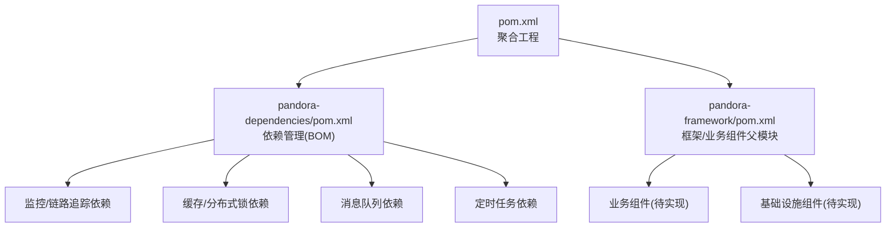
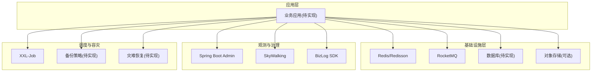
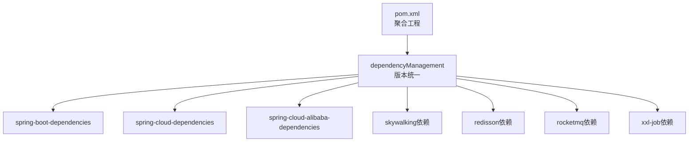
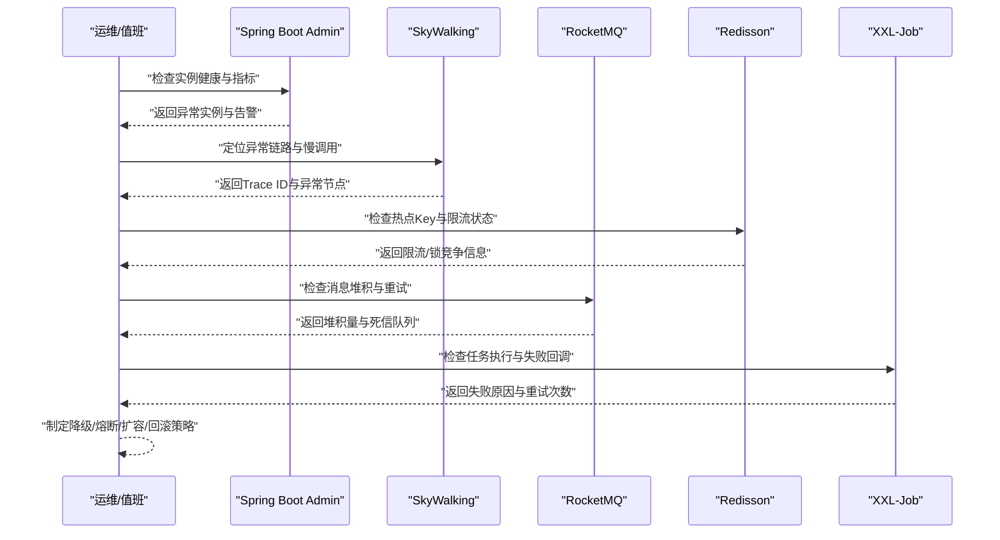

# 故障处理与恢复

<cite>
**本文引用的文件**
- [pom.xml](file://pom.xml)
- [README.md](file://README.md)
- [pandora-dependencies/pom.xml](file://pandora-dependencies/pom.xml)
- [pandora-framework/pom.xml](file://pandora-framework/pom.xml)
- [lombok.config](file://lombok.config)
</cite>

## 目录
1. [简介](#简介)
2. [项目结构](#项目结构)
3. [核心组件](#核心组件)
4. [架构总览](#架构总览)
5. [详细组件分析](#详细组件分析)
6. [依赖分析](#依赖分析)
7. [性能考虑](#性能考虑)
8. [故障处理指南](#故障处理指南)
9. [结论](#结论)
10. [附录](#附录)

## 简介
本文件面向“Pandora Cloud”项目的故障处理与恢复，结合当前仓库中已提供的工程化配置与依赖清单，系统化梳理常见故障类型、诊断方法、应急响应流程、根因分析与快速修复路径，并覆盖备份策略、数据恢复与灾难恢复计划。同时给出故障演练方案、应急预案与业务连续性保障措施，以及系统降级、熔断限流与优雅停机的实现建议。最后提出建立故障知识库、经验总结与持续改进机制的方法论。

由于当前仓库主要为多模块聚合工程与依赖管理配置，尚未包含具体业务实现代码，因此本文件以“配置即能力”的视角，从工程化与运维保障维度出发，提供可落地的故障处理与恢复实践。

## 项目结构
- 顶层聚合工程负责版本与插件统一管理，包含两个核心模块：
  - pandora-dependencies：统一依赖版本与BOM管理
  - pandora-framework：框架与业务组件的父级模块
- 工程采用Maven多模块组织，便于在各子模块中按需引入监控、链路追踪、缓存、消息队列、定时任务等组件，支撑故障定位与恢复能力。

图表来源
- [pom.xml:1-150](file://pom.xml#L1-L150)
- [pandora-dependencies/pom.xml:1-655](file://pandora-dependencies/pom.xml#L1-L655)
- [pandora-framework/pom.xml:1-34](file://pandora-framework/pom.xml#L1-L34)

章节来源
- [pom.xml:1-150](file://pom.xml#L1-L150)
- [pandora-framework/pom.xml:1-34](file://pandora-framework/pom.xml#L1-L34)
- [README.md:1-2](file://README.md#L1-L2)

## 核心组件
围绕故障处理与恢复，建议在各子模块中优先引入以下能力组件（基于依赖清单中的可用项）：

- 监控与可观测性
  - Spring Boot Admin：服务端/客户端，用于健康检查、指标采集与告警集成
  - SkyWalking：链路追踪探针，支持OpenTracing API，便于定位慢调用与异常链路
- 缓存与分布式锁
  - Redisson：分布式锁、限流、缓存一致性保障
- 消息队列
  - RocketMQ：异步解耦、削峰填谷、重试与死信队列
- 定时任务
  - XXL-Job：分布式任务调度，支持失败重试与隔离执行
- 日志与审计
  - BizLog SDK：业务日志采集与回溯
- 安全与合规
  - Lombok、MapStruct：减少样板代码，降低人为错误风险
- 工具与测试
  - Hutool、Guava、FastJSON、Mockito：提升开发效率与质量

章节来源
- [pandora-dependencies/pom.xml:106-618](file://pandora-dependencies/pom.xml#L106-L618)

## 架构总览
下图展示故障处理与恢复的关键能力在系统中的位置与交互关系。该图为概念性架构，帮助团队理解“配置即能力”的落地方式。

## 详细组件分析

### 监控与告警（Spring Boot Admin）
- 能力要点
  - 服务端/客户端组合，统一暴露Actuator端点，集中查看实例状态
  - 可与告警平台对接，触发故障事件
- 故障定位价值
  - 快速发现实例不可用、内存/线程池/连接池异常
- 实施建议
  - 在各子模块引入客户端Starter，统一注册到Admin Server
  - 配置健康检查规则与阈值告警

章节来源
- [pandora-dependencies/pom.xml:326-335](file://pandora-dependencies/pom.xml#L326-L335)

### 链路追踪（SkyWalking）
- 能力要点
  - 提供Trace ID贯穿请求链路，支持OpenTracing API
  - 可与日志、指标联动，快速定位异常节点
- 故障定位价值
  - 发现慢调用、超时、异常抛出点
- 实施建议
  - 在网关与服务侧启用探针，统一上报至OAP
  - 结合告警规则对P95/P99延迟与错误率进行告警

章节来源
- [pandora-dependencies/pom.xml:295-324](file://pandora-dependencies/pom.xml#L295-L324)

### 缓存与分布式锁（Redisson）
- 能力要点
  - 分布式锁、限流、布隆过滤器、Ratelimiter
  - 保障缓存更新一致性与热点保护
- 故障定位价值
  - 锁竞争、限流触发、缓存穿透/击穿
- 实施建议
  - 对关键写路径加分布式锁
  - 对热点Key设置限流与本地缓存兜底

章节来源
- [pandora-dependencies/pom.xml:252-256](file://pandora-dependencies/pom.xml#L252-L256)

### 消息队列（RocketMQ）
- 能力要点
  - 异步解耦、削峰填谷、可靠投递、重试与死信队列
- 故障定位价值
  - 消息堆积、重复消费、死信积累
- 实施建议
  - 为关键流程引入异步消息，设置最大重试次数与死信队列
  - 对消费者进行水平扩展与分区均衡

章节来源
- [pandora-dependencies/pom.xml:274-279](file://pandora-dependencies/pom.xml#L274-L279)

### 定时任务（XXL-Job）
- 能力要点
  - 分布式调度、失败重试、隔离执行、失败告警
- 故障定位价值
  - 任务超时、执行失败、资源争抢
- 实施建议
  - 将耗时任务迁移到异步消息或独立Job执行器
  - 为长任务设置超时与失败回调

章节来源
- [pandora-dependencies/pom.xml:265-271](file://pandora-dependencies/pom.xml#L265-L271)

### 业务日志（BizLog SDK）
- 能力要点
  - 统一业务日志格式与采集，支持回溯与审计
- 故障定位价值
  - 关键业务路径的可追溯性
- 实施建议
  - 在关键接口与事务边界埋点，确保日志与Trace ID关联

章节来源
- [pandora-dependencies/pom.xml:139-150](file://pandora-dependencies/pom.xml#L139-L150)

### 工具与测试（通用工具）
- 能力要点
  - Lombok、MapStruct、Hutool、Guava、FastJSON、Mockito
- 故障定位价值
  - 减少样板代码与空指针/类型转换错误
- 实施建议
  - 规范使用注解与映射，配合单元测试与Mock验证

章节来源
- [pandora-dependencies/pom.xml:386-490](file://pandora-dependencies/pom.xml#L386-L490)

## 依赖分析
- 顶层聚合工程通过dependencyManagement集中管理版本，确保各模块依赖一致性
- pandora-dependencies作为BOM，统一管理Spring Boot、Spring Cloud、SkyWalking、Redisson、RocketMQ、XXL-Job等组件版本
- pandora-framework作为父模块，承载框架与业务组件的分层组织

图表来源
- [pom.xml:40-50](file://pom.xml#L40-L50)
- [pandora-dependencies/pom.xml:117-137](file://pandora-dependencies/pom.xml#L117-L137)

章节来源
- [pom.xml:40-50](file://pom.xml#L40-L50)
- [pandora-dependencies/pom.xml:106-137](file://pandora-dependencies/pom.xml#L106-L137)

## 性能考虑
- 通过引入Redisson实现热点保护与限流，避免雪崩效应
- 利用RocketMQ异步化关键路径，降低同步阻塞带来的尾延迟
- 使用SkyWalking进行链路采样与指标聚合，避免过度采样导致的性能损耗
- XXL-Job的分布式执行与失败重试，避免单点瓶颈
- 通过Hutool、Guava等工具库优化常用算法与数据结构，减少不必要的GC与CPU消耗

## 故障处理指南

### 常见故障类型与特征
- 服务不可用
  - 表现：实例离线、健康检查失败、端点不可访问
  - 诊断：查看Spring Boot Admin实例列表与健康状态
- 链路异常
  - 表现：Trace中出现大量错误节点、延迟尖刺
  - 诊断：SkyWalking中定位异常Span与下游依赖
- 缓存/热点问题
  - 表现：缓存命中率异常、热点Key抖动
  - 诊断：结合Redisson限流与日志定位热点Key
- 消息堆积
  - 表现：消费延迟上升、堆积告警
  - 诊断：RocketMQ控制台查看堆积量与消费者组状态
- 定时任务失败
  - 表现：任务超时、执行失败、资源争抢
  - 诊断：XXL-Job控制台查看执行日志与失败回调

章节来源
- [pandora-dependencies/pom.xml:326-335](file://pandora-dependencies/pom.xml#L326-L335)
- [pandora-dependencies/pom.xml:295-324](file://pandora-dependencies/pom.xml#L295-L324)
- [pandora-dependencies/pom.xml:252-256](file://pandora-dependencies/pom.xml#L252-L256)
- [pandora-dependencies/pom.xml:274-279](file://pandora-dependencies/pom.xml#L274-L279)
- [pandora-dependencies/pom.xml:265-271](file://pandora-dependencies/pom.xml#L265-L271)

### 诊断方法与工具链
- 统一入口
  - Spring Boot Admin：集中查看实例健康与指标
  - SkyWalking：链路追踪与异常定位
- 辅助手段
  - BizLog SDK：业务日志回溯
  - Redisson：缓存/限流状态检查
  - RocketMQ：消息堆积与重试情况
  - XXL-Job：任务执行记录与失败原因

章节来源
- [pandora-dependencies/pom.xml:139-150](file://pandora-dependencies/pom.xml#L139-L150)
- [pandora-dependencies/pom.xml:252-256](file://pandora-dependencies/pom.xml#L252-L256)
- [pandora-dependencies/pom.xml:274-279](file://pandora-dependencies/pom.xml#L274-L279)
- [pandora-dependencies/pom.xml:265-271](file://pandora-dependencies/pom.xml#L265-L271)

### 应急响应流程

### 根因分析与快速修复
- 根因分析
  - 以Trace ID为主线，结合BizLog与指标，定位异常发生点
  - 若为缓存/热点问题，评估限流阈值与本地缓存策略
  - 若为消息堆积，评估消费者并发与死信处理策略
- 快速修复
  - 临时降级非关键路径，释放资源
  - 启用熔断与快速失败，防止级联故障
  - 扩容消费者或增加实例副本，缓解压力
  - 回滚变更或切换到备用方案

### 备份策略、数据恢复与灾难恢复
- 备份策略
  - 数据库：定期全量+增量备份，保留至少7天滚动窗口
  - 缓存：定期快照与持久化，支持热点Key恢复
  - 配置与日志：集中化存储，保留至少30天
- 数据恢复
  - 采用最小RPO/RTO目标，优先恢复关键数据
  - 通过备份校验与恢复演练验证有效性
- 灾难恢复
  - 多活/异地容灾：跨机房部署，自动切换
  - 服务降级：核心功能可用，非关键功能降级
  - 业务连续性：通过消息队列与异步化保障最终一致性

### 故障演练方案与应急预案
- 故障演练
  - 定期进行混沌工程演练：注入延迟、异常、分区、容量饱和
  - 验证告警链路、恢复时间与影响范围
- 应急预案
  - 明确分级响应机制（S1/S2/S3），责任到人
  - 制定快速处置步骤与沟通模板
  - 建立变更与回滚清单，确保可逆

### 业务连续性保障
- 通过异步化、缓存与限流，降低同步阻塞
- 通过消息队列与分布式任务，实现最终一致性
- 通过监控与告警，实现早期发现与快速处置

### 系统降级、熔断限流与优雅停机
- 降级
  - 非关键接口降级为静态返回或默认值
  - 缓存兜底，避免后端压力
- 熔断
  - 基于错误率/延迟触发熔断，防止级联故障
  - 熔断窗口内拒绝请求，窗口后半开试探
- 限流
  - 基于Redisson限流器，限制QPS与突发流量
  - 对热点Key单独限流，保护后端
- 优雅停机
  - 停止接收新请求，等待存量请求完成
  - 释放资源、关闭连接、输出健康状态

## 结论
本文件基于当前仓库的工程化配置，提出了以“配置即能力”的故障处理与恢复体系：通过监控、链路追踪、缓存/限流、消息队列与分布式任务等组件，构建可观测、可恢复、可演进的系统韧性。建议尽快在子模块中落地上述能力，并配套演练与预案，持续完善故障知识库与改进机制，逐步形成闭环的故障治理体系。

## 附录
- 工程化配置参考
  - 顶层聚合工程与依赖管理：[pom.xml:1-150](file://pom.xml#L1-L150)
  - 依赖BOM与组件版本：[pandora-dependencies/pom.xml:106-618](file://pandora-dependencies/pom.xml#L106-L618)
  - 框架/业务组件父模块：[pandora-framework/pom.xml:1-34](file://pandora-framework/pom.xml#L1-L34)
  - Lombok配置：[lombok.config](file://lombok.config)