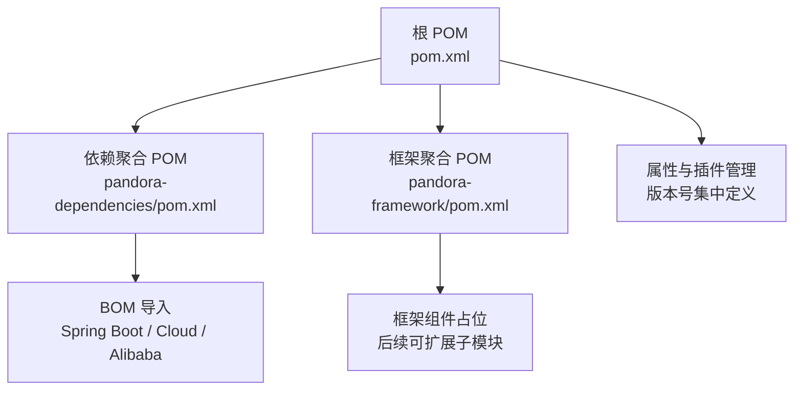
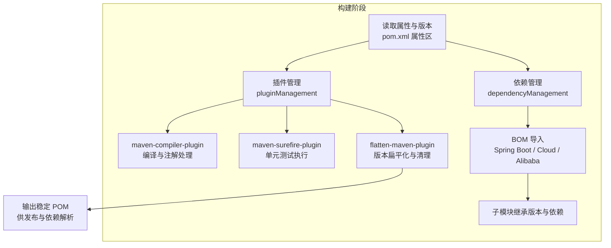
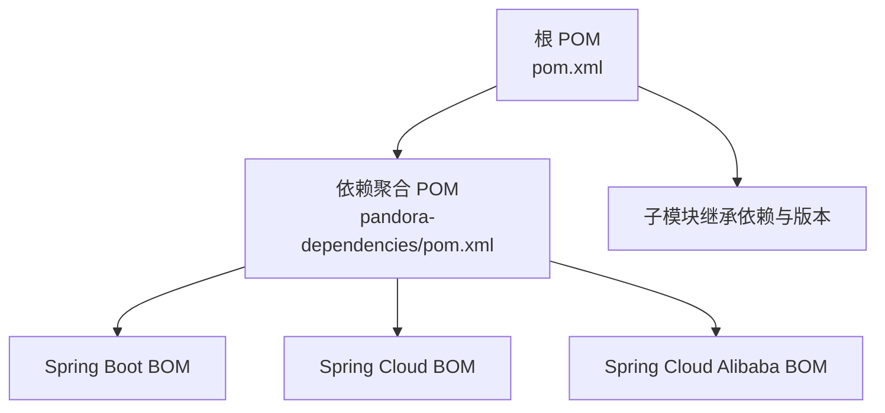

# 构建打包

<cite>
**本文引用的文件**
- [根 POM](file://pom.xml)
- [依赖聚合 POM](file://pandora-dependencies/pom.xml)
- [框架聚合 POM](file://pandora-framework/pom.xml)
- [README](file://README.md)
</cite>

## 目录
1. [简介](#简介)
2. [项目结构](#项目结构)
3. [核心组件](#核心组件)
4. [架构总览](#架构总览)
5. [详细组件分析](#详细组件分析)
6. [依赖分析](#依赖分析)
7. [性能考虑](#性能考虑)
8. [故障排查指南](#故障排查指南)
9. [结论](#结论)
10. [附录](#附录)

## 简介
本文件面向 Pandora Cloud 的构建打包实践，系统性阐述 Maven 多模块工程的构建流程、插件管理与版本控制策略，重点覆盖以下方面：
- maven-compiler-plugin 的编译参数与注解处理器链配置，以适配 Lombok + MapStruct 组合
- maven-surefire-plugin 的测试执行策略与版本选择
- flatten-maven-plugin 的版本扁平化与 POM 清理机制
- 依赖管理与版本统一策略（通过依赖聚合模块）
- 多模块构建顺序与并行优化建议
- 构建产物验证与质量检查流程
- 常见构建问题的定位与修复思路

## 项目结构
Pandora Cloud 采用多模块聚合结构，顶层 POM 负责版本与插件管理，子模块分别承担依赖聚合与框架功能分组。整体结构如下图所示：

图表来源
- [根 POM:11-14](file://pom.xml#L11-L14)
- [依赖聚合 POM:109-141](file://pandora-dependencies/pom.xml#L109-L141)
- [框架聚合 POM:12-13](file://pandora-framework/pom.xml#L12-L13)

章节来源
- [根 POM:11-14](file://pom.xml#L11-L14)
- [依赖聚合 POM:109-141](file://pandora-dependencies/pom.xml#L109-L141)
- [框架聚合 POM:12-13](file://pandora-framework/pom.xml#L12-L13)

## 核心组件
本节聚焦于构建与打包的关键组件及其职责：
- 版本与属性中心：集中定义 revision、Java 版本、编码、插件版本等
- 依赖管理：通过依赖聚合模块统一管理第三方组件版本，并导入 Spring 生态 BOM
- 插件管理：在根 POM 中统一声明插件版本与配置，子模块继承使用
- 仓库镜像：配置阿里云与华为云 Maven 源以提升依赖下载速度

章节来源
- [根 POM:20-37](file://pom.xml#L20-L37)
- [依赖聚合 POM:15-106](file://pandora-dependencies/pom.xml#L15-L106)
- [根 POM:134-147](file://pom.xml#L134-L147)

## 架构总览
下图展示构建阶段中各组件的交互关系，以及版本扁平化与插件执行的关键节点：

图表来源
- [根 POM:52-132](file://pom.xml#L52-L132)
- [依赖聚合 POM:109-141](file://pandora-dependencies/pom.xml#L109-L141)

## 详细组件分析

### maven-compiler-plugin 配置与注解处理器链
- 目标与作用
  - 统一编译目标与源码级别，确保与 Java 版本一致
  - 配置注解处理器路径，使 Lombok、MapStruct、Spring Configuration Processor 协同工作
  - 启用参数名保留，满足 Spring Boot 3.2 的参数名称发现需求
- 关键配置点
  - 编译参数：启用参数名保留
  - 注解处理器链：包含 Spring Configuration Processor、Lombok、lombok-mapstruct-binding、MapStruct Processor
- 典型问题与对策
  - Lombok 与 MapStruct 组合导致“找不到属性”错误：需引入 lombok-mapstruct-binding 并正确配置注解处理器链
  - 参数名发现失败：确保编译参数包含参数名保留选项

章节来源
- [根 POM:68-98](file://pom.xml#L68-L98)

### maven-surefire-plugin 配置与测试执行
- 目标与作用
  - 执行单元测试，兼容 JUnit 5
  - 作为插件管理的一部分，由根 POM 统一版本
- 版本选择
  - 选择 3.0 及以上版本以获得对 JUnit 5 的更好支持
- 建议
  - 在子模块中可按需覆盖参数（如并行度、fork 行为），但保持与根 POM 的版本一致性

章节来源
- [根 POM:55-61](file://pom.xml#L55-L61)

### flatten-maven-plugin 配置与版本扁平化
- 目标与作用
  - 在构建过程中将动态版本（如 ${revision}）扁平化为固定版本，便于发布与依赖解析
  - 提供 clean 执行阶段的清理，避免残留扁平化痕迹
- 执行时机
  - flatten：process-resources 阶段
  - clean：clean 阶段
- 模式选择
  - 项目级使用 oss 模式，依赖聚合模块使用 bom 模式，确保不同场景下的版本稳定性

章节来源
- [根 POM:102-129](file://pom.xml#L102-L129)
- [依赖聚合 POM:627-655](file://pandora-dependencies/pom.xml#L627-L655)

### 依赖管理与版本控制策略
- 依赖聚合模块的作用
  - 集中管理第三方组件版本，避免子模块重复维护
  - 通过导入 Spring Boot / Cloud / Alibaba BOM，统一生态版本
- 版本来源
  - 顶层 POM 的 revision 作为动态版本占位符
  - 依赖聚合模块在 dependencyManagement 中定义具体版本号
- 发布与继承
  - 子模块通过 import 方式继承依赖聚合模块，从而获得统一的版本与依赖树

章节来源
- [根 POM:40-50](file://pom.xml#L40-L50)
- [依赖聚合 POM:109-141](file://pandora-dependencies/pom.xml#L109-L141)
- [根 POM](file://pom.xml#L21)

### 多模块构建顺序与并行优化
- 构建顺序
  - 依赖聚合模块先于框架聚合模块构建，确保依赖版本已就绪
  - 子模块遵循依赖关系从上到下依次构建
- 并行优化
  - 使用 Maven 的并行构建能力（如 -T 参数）加速多模块构建
  - 将无依赖的模块并行执行，减少总构建时间
- 建议
  - 在 CI 环境中结合缓存与并行度，平衡构建速度与资源占用

（本节为通用实践指导，不直接分析具体文件）

## 依赖分析
下图展示顶层 POM 与依赖聚合模块之间的依赖导入关系，以及版本传递路径：

图表来源
- [根 POM:40-50](file://pom.xml#L40-L50)
- [依赖聚合 POM:109-141](file://pandora-dependencies/pom.xml#L109-L141)

章节来源
- [根 POM:40-50](file://pom.xml#L40-L50)
- [依赖聚合 POM:109-141](file://pandora-dependencies/pom.xml#L109-L141)

## 性能考虑
- 仓库镜像
  - 使用阿里云与华为云 Maven 源，显著提升依赖下载速度
- 插件执行阶段
  - flatten-maven-plugin 在 process-resources 阶段执行，避免影响编译与测试阶段
- 并行构建
  - 在本地与 CI 环境中合理设置并行度，缩短构建时间
- 依赖解析
  - 通过依赖聚合模块集中管理版本，减少版本冲突带来的重试与回溯

章节来源
- [根 POM:134-147](file://pom.xml#L134-L147)

## 故障排查指南
- Lombok 与 MapStruct 组合报错
  - 症状：编译时报“找不到属性”或 MapStruct 无法识别 Lombok 生成的 getter/setter
  - 处理：确认注解处理器链中包含 lombok-mapstruct-binding，并确保 maven-compiler-plugin 的 annotationProcessorPaths 配置完整
- 参数名发现失败
  - 症状：运行时无法获取方法参数名
  - 处理：确保编译参数包含参数名保留选项
- 版本不稳定导致发布失败
  - 症状：发布制品版本仍为动态占位符
  - 处理：确保 flatten-maven-plugin 在 process-resources 阶段执行，并在 clean 阶段清理
- 依赖冲突
  - 症状：不同模块引入的同一依赖版本不一致
  - 处理：在依赖聚合模块中统一版本，并通过 BOM 导入锁定生态版本

章节来源
- [根 POM:68-98](file://pom.xml#L68-L98)
- [根 POM:108-127](file://pom.xml#L108-L127)
- [依赖聚合 POM:109-141](file://pandora-dependencies/pom.xml#L109-L141)

## 结论
Pandora Cloud 的构建体系通过“顶层 POM + 依赖聚合模块”的双层设计，实现了版本与依赖的集中治理，配合 maven-compiler-plugin、maven-surefire-plugin 与 flatten-maven-plugin 的协同，确保了编译、测试与发布的稳定性与可重复性。建议在实际落地中：
- 明确各模块的构建顺序与并行策略
- 在 CI 环境中启用镜像与缓存，提升构建效率
- 对注解处理器链与编译参数进行最小化配置，避免过度复杂化
- 定期审查依赖聚合模块中的版本，保持与生态同步

（本节为总结性内容，不直接分析具体文件）

## 附录

### 构建命令示例
- 基础构建
  - mvn clean install
- 仅构建指定模块
  - mvn -pl pandora-dependencies clean install
- 并行构建
  - mvn -T 4 clean install
- 仅执行测试
  - mvn test
- 仅执行编译
  - mvn compile
- 发布前版本扁平化验证
  - mvn org.codehaus.mojo:flatten-maven-plugin:flatten -DflattenMode=oss

（本节为通用命令示例，不直接分析具体文件）

### 构建产物验证与质量检查流程
- 产物校验
  - 校验 POM 是否已扁平化（版本非动态占位符）
  - 校验测试报告是否生成且通过
- 质量检查
  - 依赖冲突扫描：使用 Maven Dependency 插件检查冲突
  - 重复依赖检查：确保依赖树简洁，避免冗余
  - 依赖版本一致性：核对依赖聚合模块中的版本与实际生效版本一致

（本节为通用流程指导，不直接分析具体文件）