# 监控运维

<cite>
**本文引用的文件**
- [pom.xml](file://pom.xml)
- [pandora-dependencies/pom.xml](file://pandora-dependencies/pom.xml)
- [pandora-framework/pom.xml](file://pandora-framework/pom.xml)
- [README.md](file://README.md)
</cite>

## 目录
1. [简介](#简介)
2. [项目结构](#项目结构)
3. [核心组件](#核心组件)
4. [架构概览](#架构概览)
5. [详细组件分析](#详细组件分析)
6. [依赖分析](#依赖分析)
7. [性能考虑](#性能考虑)
8. [故障排查指南](#故障排查指南)
9. [结论](#结论)
10. [附录](#附录)

## 简介

Pandora Cloud 是一个基于 Spring Boot 3.5.14 和 Spring Cloud 2025.0.1 的现代化微服务云平台。该项目采用 Maven 多模块架构设计，通过统一的依赖管理确保各组件版本兼容性。项目已集成多种监控解决方案，为构建完整的监控运维体系奠定了坚实基础。

该平台专注于提供企业级的云服务基础设施，支持分布式系统的可观测性需求，包括应用监控、性能监控、基础设施监控和业务监控等多个维度。

## 项目结构

Pandora Cloud 采用清晰的分层架构设计，主要包含以下核心模块：

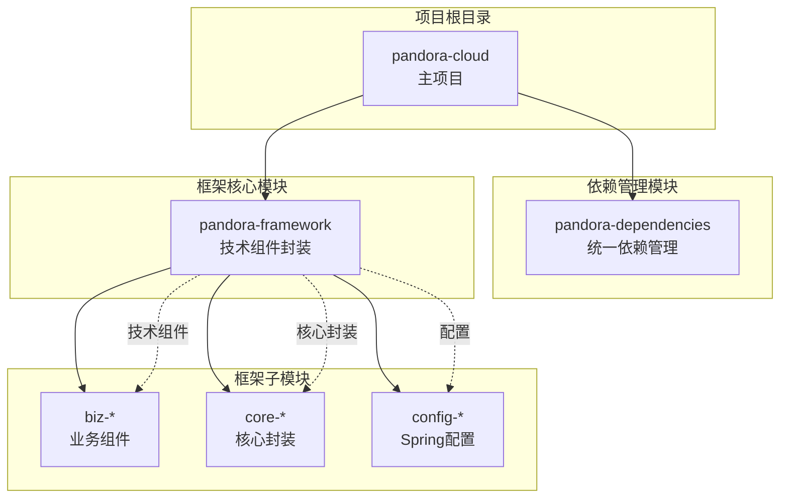

**图表来源**
- [pom.xml:11-14](file://pom.xml#L11-L14)
- [pandora-framework/pom.xml:15-24](file://pandora-framework/pom.xml#L15-L24)

**章节来源**
- [pom.xml:1-150](file://pom.xml#L1-150)
- [pandora-framework/pom.xml:1-34](file://pandora-framework/pom.xml#L1-L34)

## 核心组件

### 依赖管理体系

项目采用统一的依赖管理机制，通过 `pandora-dependencies` 模块集中管理所有第三方依赖的版本和配置：

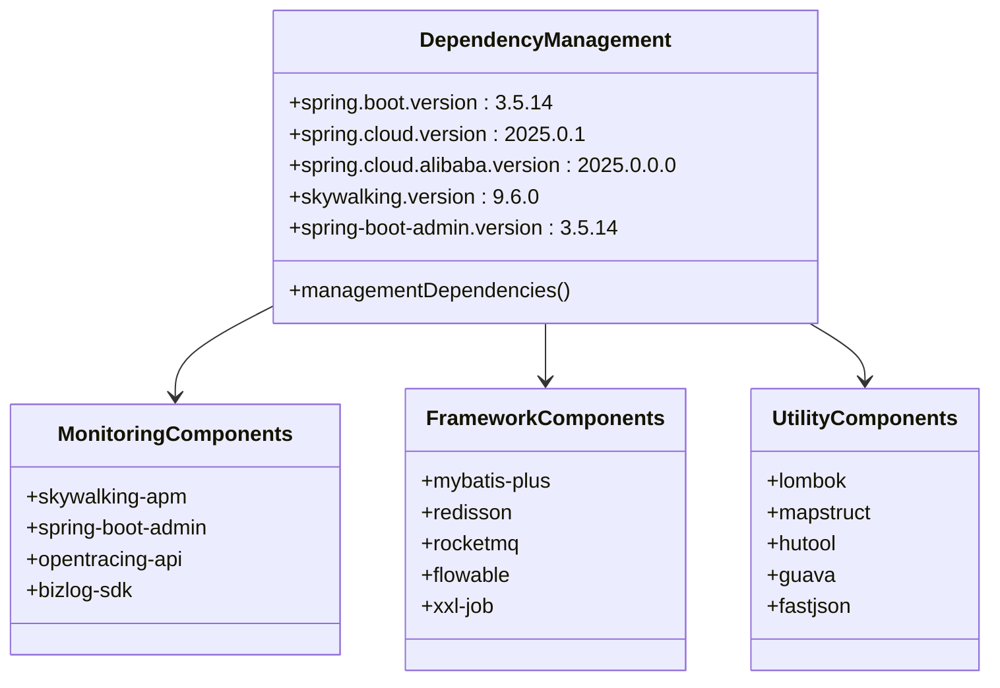

**图表来源**
- [pandora-dependencies/pom.xml:20-105](file://pandora-dependencies/pom.xml#L20-L105)

### 技术栈特性

项目的技术栈具有以下显著特点：

- **现代化框架组合**：Spring Boot 3.5.14 + Spring Cloud 2025.0.1 + Spring Cloud Alibaba 2025.0.0.0
- **统一版本管理**：通过 BOM (Bill of Materials) 确保依赖版本一致性
- **微服务架构**：支持分布式系统监控和治理
- **企业级功能**：集成工作流、定时任务、消息队列等企业级组件

**章节来源**
- [pandora-dependencies/pom.xml:15-106](file://pandora-dependencies/pom.xml#L15-L106)

## 架构概览

### 整体监控架构

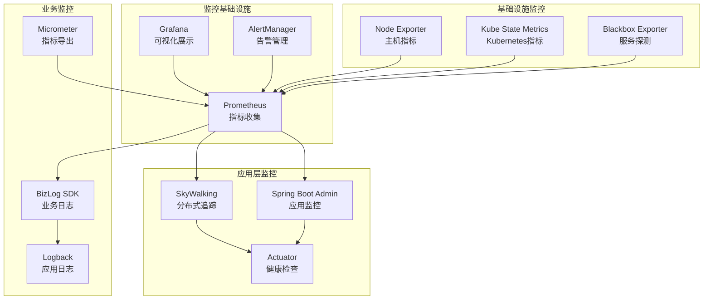

**图表来源**
- [pandora-dependencies/pom.xml:298-338](file://pandora-dependencies/pom.xml#L298-L338)

### 微服务监控架构

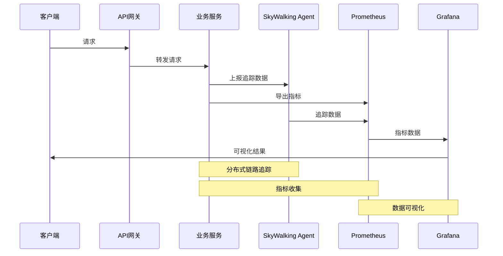

**图表来源**
- [pandora-dependencies/pom.xml:298-338](file://pandora-dependencies/pom.xml#L298-L338)

## 详细组件分析

### SkyWalking 分布式链路追踪

SkyWalking 作为 Apache 基金会顶级项目，提供了完整的 APM (Application Performance Management) 解决方案：

#### 核心组件配置

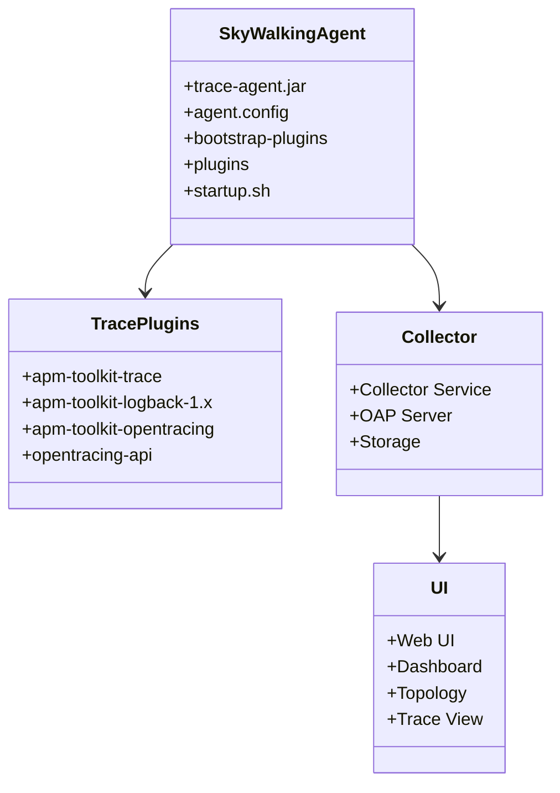

**图表来源**
- [pandora-dependencies/pom.xml:298-327](file://pandora-dependencies/pom.xml#L298-L327)

#### 集成优势

- **无侵入性**：通过 JVM Agent 方式自动采集数据
- **多语言支持**：支持 Java、Go、Python、PHP 等多种语言
- **实时分析**：提供实时的性能监控和故障诊断能力
- **拓扑发现**：自动发现服务间的依赖关系

**章节来源**
- [pandora-dependencies/pom.xml:298-327](file://pandora-dependencies/pom.xml#L298-L327)

### Spring Boot Admin 应用监控

Spring Boot Admin 提供了企业级的应用监控和管理功能：

#### 监控功能特性

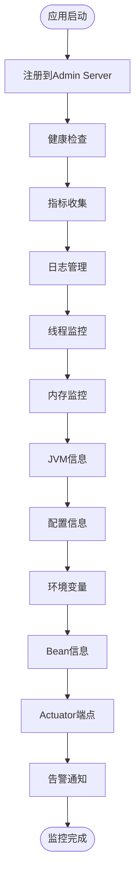

**图表来源**
- [pandora-dependencies/pom.xml:330-338](file://pandora-dependencies/pom.xml#L330-L338)

#### 管理功能

- **应用发现**：自动发现和注册微服务实例
- **健康监控**：实时监控应用健康状态
- **指标展示**：提供丰富的系统指标可视化
- **日志管理**：集中化的日志收集和查询
- **配置管理**：动态配置更新和管理

**章节来源**
- [pandora-dependencies/pom.xml:330-338](file://pandora-dependencies/pom.xml#L330-L338)

### BizLog 业务日志管理

BizLog SDK 提供了专业的业务日志记录和分析能力：

#### 日志管理架构

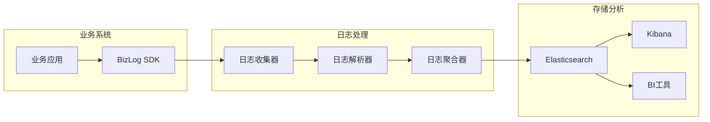

**图表来源**
- [pandora-dependencies/pom.xml:144-153](file://pandora-dependencies/pom.xml#L144-L153)

#### 业务价值

- **业务洞察**：深入理解用户行为和业务流程
- **合规要求**：满足审计和合规的日志记录需求
- **故障诊断**：快速定位业务逻辑问题
- **性能优化**：基于业务数据优化系统性能

**章节来源**
- [pandora-dependencies/pom.xml:144-153](file://pandora-dependencies/pom.xml#L144-L153)

### 指标收集与监控

#### 监控指标分类

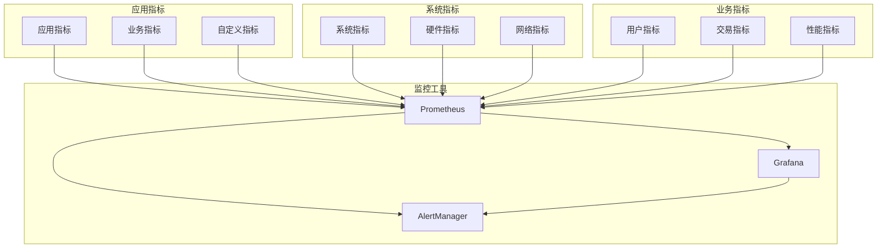

**图表来源**
- [pandora-dependencies/pom.xml:384](file://pandora-dependencies/pom.xml#L384)

## 依赖分析

### 依赖关系图

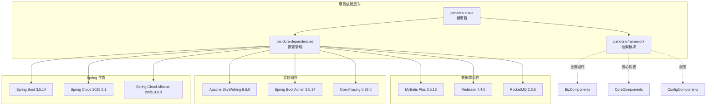

**图表来源**
- [pom.xml:11-14](file://pom.xml#L11-L14)
- [pandora-dependencies/pom.xml:120-140](file://pandora-dependencies/pom.xml#L120-L140)

### 关键依赖特性

#### 版本管理策略

项目采用统一的版本管理策略，确保各组件之间的兼容性和稳定性：

- **Spring 生态系统**：统一管理 Spring Boot、Spring Cloud 和 Spring Cloud Alibaba 的版本
- **监控组件**：SkyWalking 和 Spring Boot Admin 的版本协调
- **数据库组件**：MyBatis Plus、Redisson 等数据库相关组件的版本控制
- **消息队列**：RocketMQ 的版本管理和配置

#### 依赖注入关系

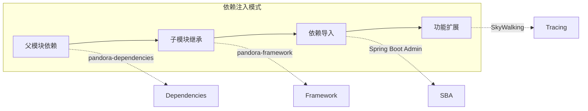

**图表来源**
- [pom.xml:40-50](file://pom.xml#L40-L50)
- [pandora-dependencies/pom.xml:120-140](file://pandora-dependencies/pom.xml#L120-L140)

**章节来源**
- [pom.xml:40-50](file://pom.xml#L40-L50)
- [pandora-dependencies/pom.xml:120-140](file://pandora-dependencies/pom.xml#L120-L140)

## 性能考虑

### 监控系统性能优化

#### SkyWalking 性能优化

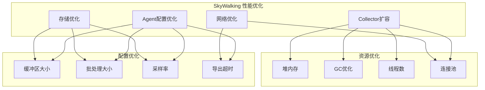

#### Spring Boot Admin 性能考虑

- **内存使用**：合理配置 JVM 参数，避免内存溢出
- **网络带宽**：优化指标数据传输，减少网络开销
- **数据库连接**：合理配置数据库连接池，避免连接泄漏
- **缓存策略**：使用适当的缓存机制提高响应速度

### 监控数据存储优化

#### 数据保留策略

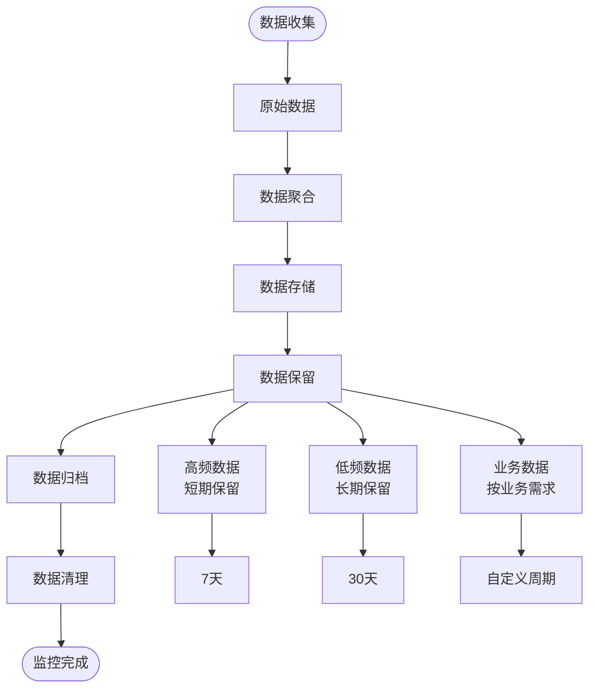

## 故障排查指南

### 常见监控问题诊断

#### SkyWalking 集成问题

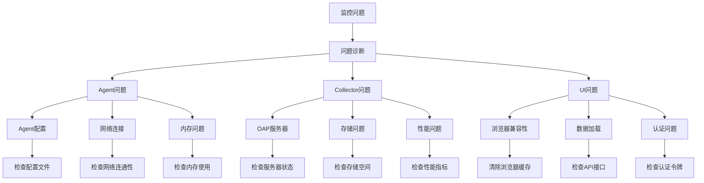

#### Spring Boot Admin 问题排查

- **应用无法注册**：检查网络连接和端口配置
- **监控数据缺失**：验证 Actuator 端点配置
- **界面显示异常**：检查浏览器兼容性和缓存清理
- **告警通知失败**：验证告警配置和通知渠道

### 日志分析方法

#### 业务日志分析

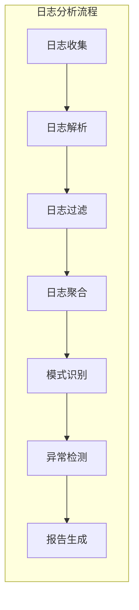

## 结论

Pandora Cloud 项目为构建完整的监控运维体系提供了坚实的技术基础。通过集成 SkyWalking、Spring Boot Admin、BizLog SDK 等先进的监控组件，项目具备了现代微服务架构所需的可观测性能力。

### 主要优势

1. **技术栈先进**：采用最新的 Spring 生态系统和技术组件
2. **监控体系完善**：集成了分布式链路追踪、应用监控、业务日志等多种监控方式
3. **扩展性强**：模块化设计支持功能扩展和定制开发
4. **企业级特性**：满足企业级应用的监控和运维需求

### 发展建议

1. **完善监控配置**：补充具体的监控配置文件和部署脚本
2. **建立监控规范**：制定统一的监控指标和告警规则
3. **优化性能配置**：根据实际使用场景调整监控组件配置
4. **加强文档建设**：完善监控运维的操作手册和最佳实践

## 附录

### 监控组件版本对照表

| 组件名称 | 版本 | 用途 |
|---------|------|------|
| Spring Boot | 3.5.14 | 应用框架 |
| Spring Cloud | 2025.0.1 | 微服务治理 |
| Spring Cloud Alibaba | 2025.0.0.0 | 阿里巴巴生态 |
| Apache SkyWalking | 9.6.0 | 分布式追踪 |
| Spring Boot Admin | 3.5.14 | 应用监控 |
| OpenTracing | 0.33.0 | 跨平台追踪 |

### 部署建议

1. **环境准备**：确保有足够的硬件资源支持监控组件运行
2. **网络配置**：合理规划监控组件间的网络通信
3. **安全设置**：配置适当的访问控制和数据加密
4. **备份策略**：建立监控数据的定期备份机制