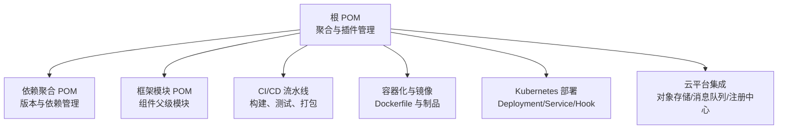
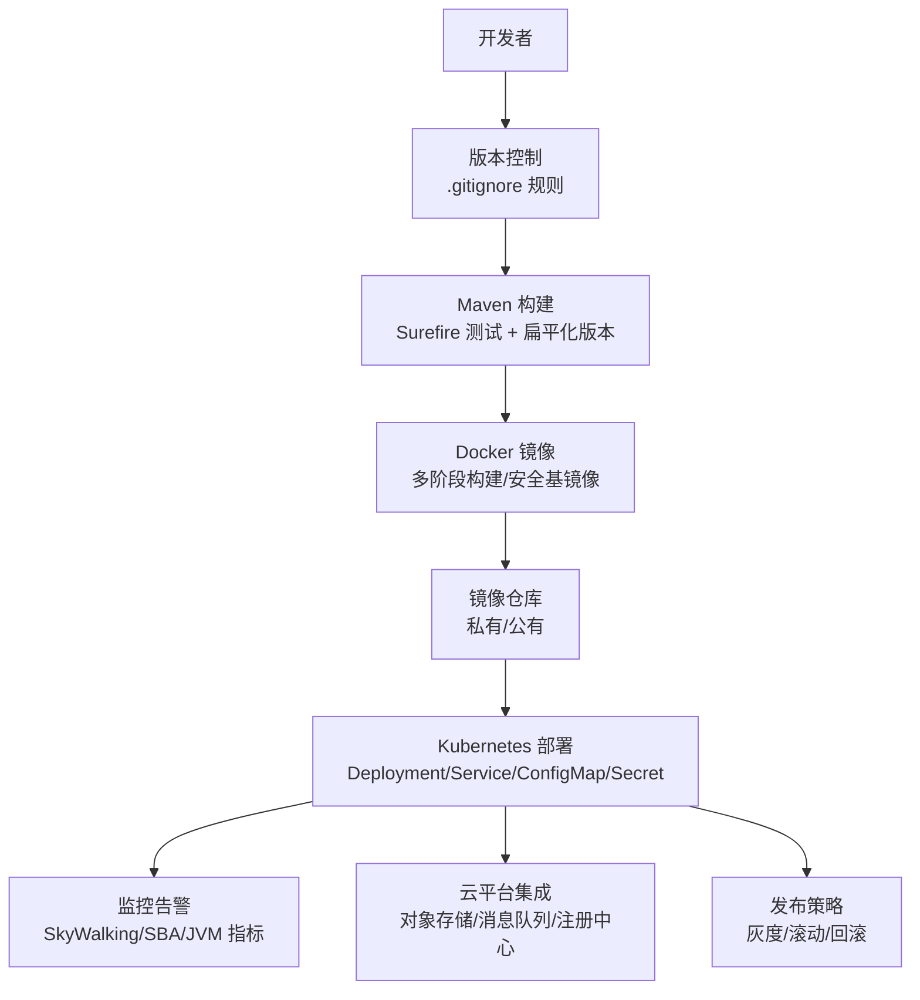
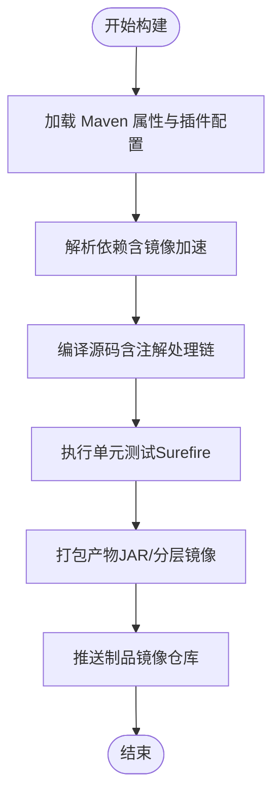
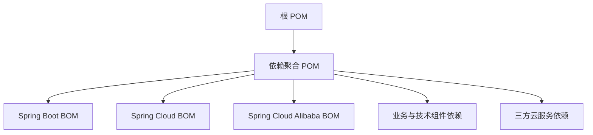

# 部署运维

<cite>
**本文引用的文件**
- [根 POM](file://pom.xml)
- [依赖聚合 POM](file://pandora-dependencies/pom.xml)
- [框架模块 POM](file://pandora-framework/pom.xml)
- [.gitignore](file://.gitignore)
- [lombok 配置](file://lombok.config)
- [项目说明](file://README.md)
</cite>

## 目录
1. [简介](#简介)
2. [项目结构](#项目结构)
3. [核心组件](#核心组件)
4. [架构总览](#架构总览)
5. [详细组件分析](#详细组件分析)
6. [依赖分析](#依赖分析)
7. [性能考虑](#性能考虑)
8. [故障排查指南](#故障排查指南)
9. [结论](#结论)
10. [附录](#附录)

## 简介
本文件面向运维团队，提供“潘多拉云平台”的部署与运维操作手册与最佳实践指南。当前仓库为多模块 Maven 聚合工程，包含依赖版本管理模块与框架模块，具备容器化与云平台集成的基础能力。本文围绕以下目标展开：
- 构建与打包流程
- 容器化与镜像策略
- Kubernetes 部署与云平台集成
- CI/CD 流水线、自动化测试与发布
- 监控告警、日志与性能调优
- 故障排查、备份恢复与灾难恢复
- 灰度发布、滚动更新与版本回滚

由于当前仓库未包含具体业务实现与容器编排清单，本文以现有 Maven 结构为基础，结合可落地的工程实践给出完整运维蓝图。

## 项目结构
项目采用 Maven 多模块结构，顶层 POM 聚合两个子模块：
- 依赖版本管理模块：统一管理第三方依赖版本与依赖范围
- 框架模块：作为技术组件与业务组件的父级模块，承载各子组件的 core 与 config

图示来源
- [根 POM](file://pom.xml)
- [依赖聚合 POM](file://pandora-dependencies/pom.xml)
- [框架模块 POM](file://pandora-framework/pom.xml)

章节来源
- [根 POM](file://pom.xml)
- [依赖聚合 POM](file://pandora-dependencies/pom.xml)
- [框架模块 POM](file://pandora-framework/pom.xml)

## 核心组件
- 依赖版本管理模块
  - 作用：集中管理 Spring Boot、Spring Cloud、MyBatis、Redisson、RocketMQ、XXL-Job、SkyWalking、Knife4j、JustAuth、微信/支付宝 SDK 等版本
  - 影响范围：所有子模块通过依赖导入统一版本，避免冲突
- 框架模块
  - 作用：作为技术组件与业务组件的父级模块，规范子模块命名与职责划分
  - 结构：每个子组件包含 core 与 config 两部分，便于按需引入
- 根 POM
  - 作用：聚合模块、统一插件配置（编译、测试、扁平化版本）、仓库镜像加速
  - 关键点：启用 flatten-maven-plugin 扁平化版本；启用 Surefire 3.5.5 以支持 JUnit 5；启用阿里云/华为云镜像提升依赖下载速度

章节来源
- [根 POM](file://pom.xml)
- [依赖聚合 POM](file://pandora-dependencies/pom.xml)
- [框架模块 POM](file://pandora-framework/pom.xml)

## 架构总览
下图展示从代码到生产环境的典型路径：本地开发 → Maven 构建 → Docker 镜像 → Kubernetes 部署 → 云平台集成。

图示来源
- [根 POM](file://pom.xml)
- [.gitignore](file://.gitignore)

## 详细组件分析

### 构建与打包流程
- 插件与工具链
  - maven-surefire-plugin：执行单元测试，版本由属性统一管理
  - maven-compiler-plugin：配置注解处理器链（Spring Boot Configuration Processor、Lombok、Lombok MapStruct Binding、MapStruct Processor），并开启 -parameters 参数
  - flatten-maven-plugin：在 process-resources 与 clean 阶段执行，确保版本扁平化与清理
- 仓库镜像
  - 配置阿里云与华为云公共仓库，提升依赖下载速度
- 打包产物
  - 建议在 CI 中输出可运行的可执行 JAR 或分层镜像，配合 Spring Boot Maven 插件进行优化

图示来源
- [根 POM](file://pom.xml)

章节来源
- [根 POM](file://pom.xml)

### 容器化与镜像策略
- 基础镜像选择
  - 使用精简的基础镜像（如 distroless 或 alpine），减少攻击面
- 多阶段构建
  - 第一阶段：编译与打包
  - 第二阶段：复制最小运行时产物至基础镜像
- 安全与合规
  - 定期扫描镜像漏洞，遵循最小权限原则
  - 仅暴露必要端口，禁用 root 用户运行
- 可观测性
  - 在镜像中内置 JVM 启动参数与探针配置，便于 SkyWalking/SBA 接入

章节来源
- [根 POM](file://pom.xml)

### Kubernetes 部署与云平台集成
- Deployment/Service
  - 使用副本数、就绪/存活探针、资源限制与请求
  - 使用 ConfigMap/Secret 管理配置与密钥
- 发布策略
  - 滚动更新：设置 maxUnavailable 与 maxSurge
  - 灰度发布：使用金丝雀或蓝绿策略，结合 Ingress/Service 权重
- 云平台集成
  - 对象存储：对接 S3 兼容存储，配置访问凭据
  - 消息队列：对接 RocketMQ/云厂商消息服务
  - 注册中心与配置中心：对接 Spring Cloud Alibaba/Nacos 或云厂商对应服务
- 存储与持久化
  - PVC/StorageClass 策略，备份与快照策略

章节来源
- [依赖聚合 POM](file://pandora-dependencies/pom.xml)

### CI/CD 流水线、自动化测试与发布
- 触发条件
  - Pull Request/Merge 到主分支触发构建与测试
- 阶段划分
  - 代码检出 → 依赖缓存 → 构建 → 单元测试 → 镜像构建 → 镜像扫描 → 推送镜像 → 部署到预发 → 自动化验收测试 → 预发到生产（人工审批）
- 测试策略
  - 单元测试：覆盖率阈值与报告
  - 集成测试：使用内嵌数据库/容器化依赖服务
- 发布与回滚
  - 记录版本标签与镜像摘要，支持一键回滚
  - 回滚策略：镜像回滚 + 配置回滚

章节来源
- [根 POM](file://pom.xml)

### 监控告警、日志与性能调优
- 链路追踪
  - SkyWalking：接入 apm-toolkit-trace/logback/opentracing
- 可视化与告警
  - Spring Boot Admin：服务端/客户端
  - Prometheus/Grafana：指标采集与仪表盘
- 日志
  - 标准输出收集，结合 Loki/ELK 进行检索与聚合
- 性能调优
  - JVM 参数：堆大小、GC 策略、JFR 采样
  - 应用侧：连接池、缓存命中率、异步化与限流

章节来源
- [依赖聚合 POM](file://pandora-dependencies/pom.xml)

### 故障排查、备份恢复与灾难恢复
- 常见问题定位
  - 依赖冲突：使用 mvn dependency:tree 与版本树比对
  - 构建失败：检查注解处理器链顺序与 -parameters 参数
  - 镜像问题：核对多阶段构建产物与运行时依赖
- 备份与恢复
  - 配置与密钥：Secret/配置中心备份
  - 数据：数据库/对象存储快照与异地备份
- 灾难恢复
  - RTO/RPO 指标明确，演练恢复流程，验证数据一致性

章节来源
- [根 POM](file://pom.xml)
- [依赖聚合 POM](file://pandora-dependencies/pom.xml)

### 灰度发布、滚动更新与版本回滚
- 灰度发布
  - 金丝雀：少量流量切换至新版本
  - A/B 测试：通过网关或路由规则分流
- 滚动更新
  - 控制并发与健康检查窗口，避免雪崩
- 版本回滚
  - 快速回滚至上一个稳定镜像，必要时回滚配置

章节来源
- [根 POM](file://pom.xml)

## 依赖分析
- 依赖管理策略
  - 通过依赖聚合 POM 导入 Spring Boot、Spring Cloud、Spring Cloud Alibaba 的 BOM，确保版本一致
  - 业务与技术组件依赖通过统一版本属性管理，降低冲突概率
- 关键依赖类别
  - Web 与 API 文档：Knife4j、SpringDoc
  - ORM 与多数据源：MyBatis、MyBatis-Plus、动态数据源
  - 缓存与分布式锁：Redisson、Lock4j
  - 消息队列：RocketMQ
  - 定时任务：XXL-Job
  - 链路追踪与监控：SkyWalking、Spring Boot Admin
  - 三方云服务：AWS S3、JustAuth、微信/支付宝 SDK
  - 工具类：Hutool、Guava、FastJSON、JSch、Tika、Velocity、MapStruct、Lombok

图示来源
- [根 POM](file://pom.xml)
- [依赖聚合 POM](file://pandora-dependencies/pom.xml)

章节来源
- [根 POM](file://pom.xml)
- [依赖聚合 POM](file://pandora-dependencies/pom.xml)

## 性能考虑
- 构建性能
  - 启用依赖缓存与镜像仓库，减少网络开销
  - 并行构建与跳过测试（在 CI 中按需启用）
- 运行时性能
  - JVM 参数与 GC 调优，结合 APM 观测
  - 连接池与缓存容量评估，避免热点与抖动
- 部署性能
  - 分层镜像与只读根文件系统
  - 就绪/存活探针合理设置，缩短冷启动时间

## 故障排查指南
- 构建失败
  - 检查注解处理器链顺序与版本兼容性
  - 确认 -parameters 参数已正确传递
- 依赖冲突
  - 使用依赖树定位冲突版本，必要时在子模块中显式排除
- 镜像问题
  - 核对多阶段构建的最终产物是否包含运行时依赖
- 部署异常
  - 查看 Pod 事件与日志，确认探针与资源配额
- 监控缺失
  - 核对 SkyWalking/SBA 配置与探针注入

章节来源
- [根 POM](file://pom.xml)
- [依赖聚合 POM](file://pandora-dependencies/pom.xml)

## 结论
本仓库提供了清晰的依赖版本管理体系与模块化结构，为后续容器化、云平台集成与自动化运维奠定了坚实基础。建议在现有基础上补充：
- Dockerfile 与 Kubernetes 清单
- CI/CD 流水线模板与发布策略
- 监控告警与日志采集方案
- 备份恢复与灾难恢复演练

## 附录
- 开发者提示
  - 使用 .gitignore 避免提交本地 IDE/构建产物
  - 通过 lombok.config 统一 Lombok 行为，减少样板代码
- 项目说明
  - 项目名称与描述见项目说明文件

章节来源
- [.gitignore](file://.gitignore)
- [lombok 配置](file://lombok.config)
- [项目说明](file://README.md)