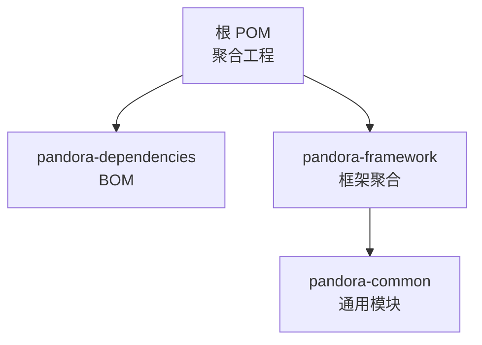
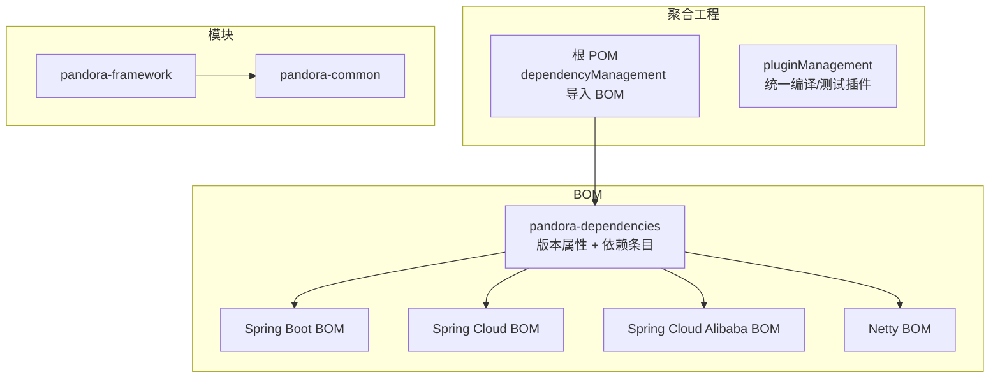
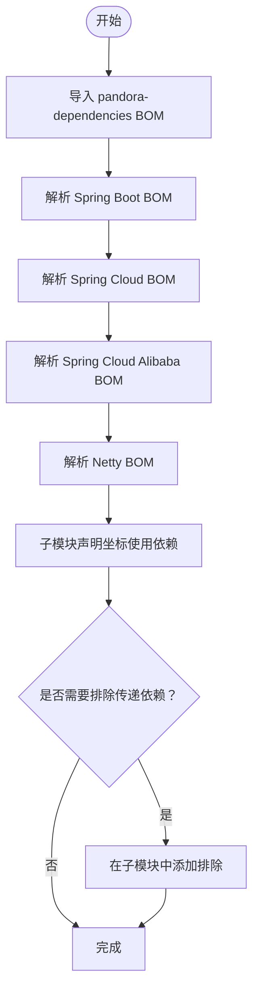

# 配置管理

<cite>
**本文引用的文件**
- [pom.xml](file://pom.xml)
- [lombok.config](file://lombok.config)
- [pandora-dependencies/pom.xml](file://pandora-dependencies/pom.xml)
- [pandora-framework/pom.xml](file://pandora-framework/pom.xml)
- [pandora-framework/pandora-common/pom.xml](file://pandora-framework/pandora-common/pom.xml)
</cite>

## 目录
1. [简介](#简介)
2. [项目结构](#项目结构)
3. [核心组件](#核心组件)
4. [架构总览](#架构总览)
5. [详细组件分析](#详细组件分析)
6. [依赖关系分析](#依赖关系分析)
7. [性能考虑](#性能考虑)
8. [故障排除指南](#故障排除指南)
9. [结论](#结论)
10. [附录](#附录)

## 简介
本指南聚焦于 Pandora Cloud 的配置管理，系统性阐述 Maven 依赖管理策略、pandora-dependencies 作为 BOM 的使用方式与版本控制最佳实践；详解各模块 pom.xml 的配置要点与依赖传递规则；说明 Lombok 与构建期配置（如 MapStruct、Spring Boot 配置处理器）；并提供不同环境下的配置示例与部署策略建议，最后给出优化建议与常见问题排查路径。

## 项目结构
仓库采用多模块聚合结构：
- 顶层聚合工程负责全局属性、插件与仓库镜像配置，并通过 dependencyManagement 导入 pandora-dependencies。
- pandora-dependencies 作为 BOM，集中管理所有第三方组件与内部模块的版本与依赖条目。
- pandora-framework 为框架模块聚合，当前包含 pandora-common 子模块，承载通用 POJO、枚举、工具类与基础能力。

图表来源
- [pom.xml:11-14](file://pom.xml#L11-L14)
- [pandora-framework/pom.xml:26-28](file://pandora-framework/pom.xml#L26-L28)
- [pandora-dependencies/pom.xml:108-145](file://pandora-dependencies/pom.xml#L108-L145)

章节来源
- [pom.xml:1-150](file://pom.xml#L1-L150)
- [pandora-framework/pom.xml:1-37](file://pandora-framework/pom.xml#L1-L37)
- [pandora-framework/pandora-common/pom.xml:1-101](file://pandora-framework/pandora-common/pom.xml#L1-L101)

## 核心组件
- 顶层聚合工程（pom.xml）
  - 统一版本号与 Java 版本属性，启用 flatten-maven-plugin 以生成稳定的发布版本。
  - 在 dependencyManagement 中导入 pandora-dependencies，确保子模块无需重复声明版本。
  - 在 pluginManagement 中统一配置 maven-compiler-plugin 与 maven-surefire-plugin，并设置 Lombok、MapStruct、Spring Configuration Processor 的注解处理器链。
  - 配置阿里云与华为云镜像仓库以加速依赖下载。
- pandora-dependencies（BOM）
  - 定义大量版本属性（Spring Boot、Cloud、Alibaba、Netty、MyBatis、Redisson、RocketMQ、SkyWalking、OkHttp、Vert.x、Flowable、Hutool、Guava、FastJSON、MapStruct、Lombok 等）。
  - 通过 import 方式引入多个官方 BOM（spring-boot-dependencies、spring-cloud-dependencies、spring-cloud-alibaba-dependencies、netty-bom），并按顺序保证依赖解析的一致性。
  - 提供大量常用依赖的依赖条目，便于子模块直接使用坐标而无需指定版本。
- pandora-framework 与 pandora-common
  - 通过继承父 POM 的 dependencyManagement，直接引用 BOM 中已声明的依赖坐标，减少版本冲突风险。
  - pandora-common 将工具类、异常体系、分页模型、校验注解等抽象为可复用的基础能力，部分依赖采用 provided 作用域以避免对上层产生额外传递依赖。

章节来源
- [pom.xml:20-37](file://pom.xml#L20-L37)
- [pom.xml:40-50](file://pom.xml#L40-L50)
- [pom.xml:52-132](file://pom.xml#L52-L132)
- [pandora-dependencies/pom.xml:15-103](file://pandora-dependencies/pom.xml#L15-L103)
- [pandora-dependencies/pom.xml:117-145](file://pandora-dependencies/pom.xml#L117-L145)
- [pandora-framework/pandora-common/pom.xml:26-98](file://pandora-framework/pandora-common/pom.xml#L26-L98)

## 架构总览
下图展示顶层聚合工程如何通过 BOM 管理依赖，以及框架模块如何消费这些依赖。

图表来源
- [pom.xml:40-50](file://pom.xml#L40-L50)
- [pandora-dependencies/pom.xml:117-145](file://pandora-dependencies/pom.xml#L117-L145)
- [pandora-framework/pom.xml:6-10](file://pandora-framework/pom.xml#L6-L10)
- [pandora-framework/pandora-common/pom.xml:6-10](file://pandora-framework/pandora-common/pom.xml#L6-L10)

## 详细组件分析

### 顶层聚合工程（pom.xml）
- 版本与语言级别
  - 使用属性统一管理版本号与 Java 25 编译目标，确保全工程一致性。
- 依赖管理导入
  - 通过 dependencyManagement 导入 pandora-dependencies，子模块只需声明坐标即可继承版本。
- 插件管理
  - maven-compiler-plugin 配置注解处理器链：Spring Boot Configuration Processor、Lombok、lombok-mapstruct-binding、MapStruct Processor，解决 Lombok 与 MapStruct 的兼容性问题。
  - 启用 -parameters 编译参数以适配 Spring Boot 3.2 的参数名发现机制。
  - maven-surefire-plugin 统一版本，支持 JUnit 5。
- 发布与镜像
  - flatten-maven-plugin 用于生成稳定版本，避免 SNAPSHOT 泄露至依赖树。
  - 配置阿里云与华为云公共仓库以提升下载速度。

章节来源
- [pom.xml:20-37](file://pom.xml#L20-L37)
- [pom.xml:40-50](file://pom.xml#L40-L50)
- [pom.xml:52-132](file://pom.xml#L52-L132)
- [pom.xml:134-147](file://pom.xml#L134-L147)

### pandora-dependencies（BOM）
- 版本属性集中管理
  - 覆盖微服务框架、Web/API 文档、数据库/ORM、缓存、消息队列、定时任务、链路追踪/监控、网络通信、IoT/工业协议、BPM 工作流、基础工具、模板/文档、编码/安全、测试、三方云服务等领域的版本。
- BOM 导入顺序
  - 先导入 spring-boot-dependencies，再导入 spring-cloud-dependencies 与 spring-cloud-alibaba-dependencies，最后导入 netty-bom，确保依赖解析优先级与版本对齐。
- 依赖条目
  - 提供常用依赖的条目（如 druid、mybatis-plus、redisson、rocketmq、xxl-job、skywalking、okhttp、vert.x、flowable、hutool、guava、fastjson、mapstruct、lombok 等），子模块直接使用坐标即可。
  - 对部分依赖进行必要的排除（如 knife4j 与 springdoc 的冲突排除、部分 starter 的重复依赖排除），降低传递冲突风险。

章节来源
- [pandora-dependencies/pom.xml:15-103](file://pandora-dependencies/pom.xml#L15-L103)
- [pandora-dependencies/pom.xml:117-145](file://pandora-dependencies/pom.xml#L117-L145)
- [pandora-dependencies/pom.xml:154-170](file://pandora-dependencies/pom.xml#L154-L170)
- [pandora-dependencies/pom.xml:177-237](file://pandora-dependencies/pom.xml#L177-L237)
- [pandora-dependencies/pom.xml:239-251](file://pandora-dependencies/pom.xml#L239-L251)
- [pandora-dependencies/pom.xml:274-314](file://pandora-dependencies/pom.xml#L274-L314)
- [pandora-dependencies/pom.xml:316-362](file://pandora-dependencies/pom.xml#L316-L362)
- [pandora-dependencies/pom.xml:371-381](file://pandora-dependencies/pom.xml#L371-L381)
- [pandora-dependencies/pom.xml:383-429](file://pandora-dependencies/pom.xml#L383-L429)
- [pandora-dependencies/pom.xml:431-446](file://pandora-dependencies/pom.xml#L431-L446)
- [pandora-dependencies/pom.xml:448-474](file://pandora-dependencies/pom.xml#L448-L474)
- [pandora-dependencies/pom.xml:476-506](file://pandora-dependencies/pom.xml#L476-L506)
- [pandora-dependencies/pom.xml:508-575](file://pandora-dependencies/pom.xml#L508-L575)

### pandora-framework 与 pandora-common
- 继承父 POM 的 dependencyManagement
  - 通过父 POM 的 dependencyManagement 导入 pandora-dependencies，pandora-common 可直接使用 BOM 中的依赖坐标，无需重复声明版本。
- 依赖作用域策略
  - 部分依赖采用 provided 作用域（如 guava、jackson-databind、validation-api、slf4j-api、springdoc、aspectjweaver、servlet-api），仅在工具类中使用，避免对上层模块造成不必要的传递依赖。
- 内部模块依赖
  - 明确声明对 pandora-common 的内部模块依赖，便于上层模块复用通用能力。

章节来源
- [pandora-framework/pom.xml:6-10](file://pandora-framework/pom.xml#L6-L10)
- [pandora-framework/pandora-common/pom.xml:6-10](file://pandora-framework/pandora-common/pom.xml#L6-L10)
- [pandora-framework/pandora-common/pom.xml:26-98](file://pandora-framework/pandora-common/pom.xml#L26-L98)

### Lombok 与构建期配置（MapStruct、Spring Configuration Processor）
- 注解处理器链
  - maven-compiler-plugin 配置了 Spring Boot Configuration Processor、Lombok、lombok-mapstruct-binding、MapStruct Processor 的注解处理器路径，确保 Lombok 生成的 getter/setter 能被 MapStruct 正确识别，避免“属性不存在”的编译错误。
- 编译参数
  - 启用 -parameters 参数以适配 Spring Boot 3.2 的参数名发现机制。
- Lombok 配置
  - 通过 lombok.config 统一 Lombok 的行为：关闭 bubbling、开启 toString/equals/hashCode 调用父类、链式访问器等，保证团队风格一致。

章节来源
- [pom.xml:64-98](file://pom.xml#L64-L98)
- [pom.xml:94-97](file://pom.xml#L94-L97)
- [lombok.config:1-4](file://lombok.config#L1-L4)

## 依赖关系分析
- 依赖导入顺序与传递规则
  - BOM 导入顺序：spring-boot → spring-cloud → spring-cloud-alibaba → netty-bom，确保版本解析优先级与依赖树收敛。
  - 子模块仅需声明坐标，版本由 BOM 提供；若子模块需要覆盖版本，可在自身 pom 中重写，但应谨慎评估影响范围。
- 传递依赖与排除
  - 对部分依赖进行显式排除（如 knife4j 与 springdoc 的冲突排除、某些 starter 的重复依赖排除），降低冲突概率。
- 作用域与最小暴露
  - 通过 provided 作用域限制工具类依赖的传递，避免上层模块无谓引入额外依赖。

图表来源
- [pandora-dependencies/pom.xml:117-145](file://pandora-dependencies/pom.xml#L117-L145)
- [pandora-dependencies/pom.xml:159-164](file://pandora-dependencies/pom.xml#L159-L164)
- [pandora-dependencies/pom.xml:217-226](file://pandora-dependencies/pom.xml#L217-L226)
- [pandora-dependencies/pom.xml:266-271](file://pandora-dependencies/pom.xml#L266-L271)
- [pandora-dependencies/pom.xml:471-490](file://pandora-dependencies/pom.xml#L471-L490)
- [pandora-dependencies/pom.xml:523-528](file://pandora-dependencies/pom.xml#L523-L528)
- [pandora-dependencies/pom.xml:534-539](file://pandora-dependencies/pom.xml#L534-L539)
- [pandora-dependencies/pom.xml:565-574](file://pandora-dependencies/pom.xml#L565-L574)

章节来源
- [pandora-dependencies/pom.xml:117-145](file://pandora-dependencies/pom.xml#L117-L145)
- [pandora-dependencies/pom.xml:159-164](file://pandora-dependencies/pom.xml#L159-L164)
- [pandora-dependencies/pom.xml:217-226](file://pandora-dependencies/pom.xml#L217-L226)
- [pandora-dependencies/pom.xml:266-271](file://pandora-dependencies/pom.xml#L266-L271)
- [pandora-dependencies/pom.xml:471-490](file://pandora-dependencies/pom.xml#L471-L490)
- [pandora-dependencies/pom.xml:523-528](file://pandora-dependencies/pom.xml#L523-L528)
- [pandora-dependencies/pom.xml:534-539](file://pandora-dependencies/pom.xml#L534-L539)
- [pandora-dependencies/pom.xml:565-574](file://pandora-dependencies/pom.xml#L565-L574)

## 性能考虑
- 依赖解析性能
  - 使用 BOM 与统一版本属性可显著减少依赖解析时间与冲突排查成本。
  - 控制传递依赖数量（尤其是采用 provided 的依赖），避免上层模块引入不必要的运行时依赖。
- 构建性能
  - 统一注解处理器链与编译参数，减少重复配置与编译失败重试。
  - 使用镜像仓库加速依赖下载，缩短 CI/CD 时间。
- 运行时性能
  - 选择合适版本的框架与组件（如 Netty、OkHttp、Redisson、RocketMQ 等），并在 BOM 中统一管理，避免版本不一致导致的性能回退。

## 故障排除指南
- Lombok 与 MapStruct 兼容性问题
  - 症状：MapStruct 无法识别 Lombok 生成的 getter/setter，报“属性不存在”。
  - 处理：确保 maven-compiler-plugin 的注解处理器链包含 lombok-mapstruct-binding，且 Lombok 与 MapStruct 版本与 BOM 保持一致。
  - 参考路径：[pom.xml:64-98](file://pom.xml#L64-L98)
- Spring Boot 3.2 参数名发现问题
  - 症状：缺少参数名信息导致 @ConfigurationProperties 或 SpEL 表达式解析异常。
  - 处理：启用 -parameters 编译参数，已在根 POM 中配置。
  - 参考路径：[pom.xml:94-97](file://pom.xml#L94-L97)
- 依赖冲突与版本不一致
  - 症状：不同模块引入同一依赖的不同版本，导致运行时类冲突。
  - 处理：在子模块中显式声明版本或使用依赖排除，优先遵循 BOM 版本；必要时在根 POM 中调整版本属性。
  - 参考路径：[pandora-dependencies/pom.xml:117-145](file://pandora-dependencies/pom.xml#L117-L145)
- 传递依赖过多导致打包臃肿
  - 症状：最终产物包含大量无关依赖。
  - 处理：将非必需依赖标记为 provided，减少传递依赖暴露。
  - 参考路径：[pandora-framework/pandora-common/pom.xml:42-84](file://pandora-framework/pandora-common/pom.xml#L42-L84)
- 仓库下载缓慢
  - 症状：CI/CD 构建耗时过长。
  - 处理：使用根 POM 中配置的镜像仓库，或在本地 settings.xml 中配置镜像。
  - 参考路径：[pom.xml:134-147](file://pom.xml#L134-L147)

## 结论
通过将 pandora-dependencies 设计为 BOM 并在根 POM 中集中导入，Pandora Cloud 实现了版本统一、依赖收敛与构建期配置标准化。配合 Lombok 与 MapStruct 的注解处理器链、Spring Boot 3.2 的参数名发现参数，以及 provided 作用域的依赖治理策略，项目在可维护性、构建效率与运行时表现方面均得到显著提升。建议在扩展新模块时严格遵循 BOM 与依赖排除策略，持续优化依赖树，确保跨环境一致性与稳定性。

## 附录
- 不同环境下的配置示例与部署策略（建议）
  - 开发环境
    - 使用本地镜像仓库与默认 profile，启用调试参数与热部署（如 devtools）。
  - 测试环境
    - 使用统一的测试依赖（spring-boot-starter-test、mockito-inline、jedis-mock），确保测试覆盖率与隔离性。
  - 生产环境
    - 使用 prod profile，禁用调试参数，启用 SkyWalking、Spring Boot Admin 等监控与链路追踪能力；确保依赖最小化与版本固化。
  - 部署策略
    - 使用 CI/CD 自动化构建与发布，结合 flatten-maven-plugin 生成稳定版本；通过镜像仓库加速依赖下载，减少构建时间。
- 最佳实践清单
  - 优先使用 BOM 中的依赖坐标，避免重复声明版本。
  - 对工具类依赖尽量采用 provided，减少传递依赖。
  - 新增依赖前评估必要性与潜在冲突，必要时在 BOM 中统一升级。
  - 定期审查依赖树，清理废弃依赖与重复依赖。