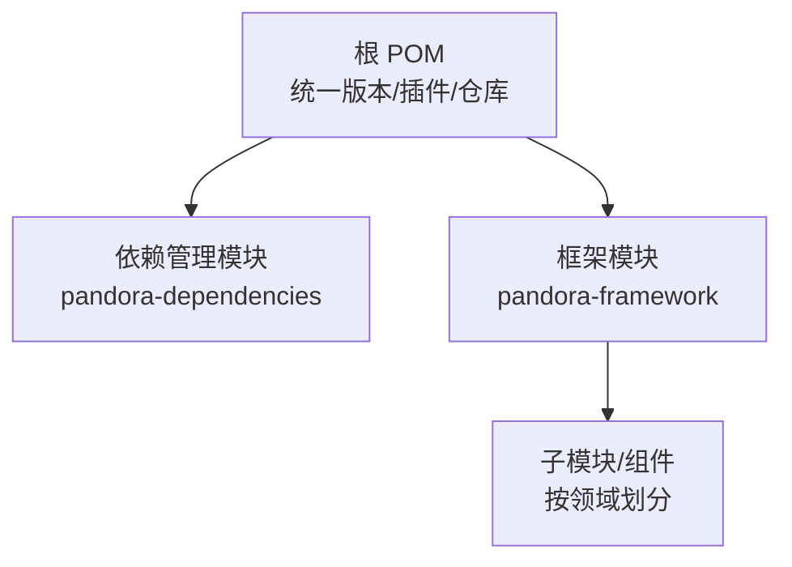
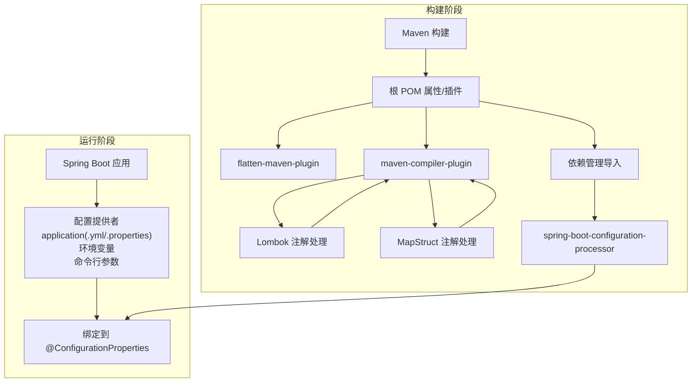
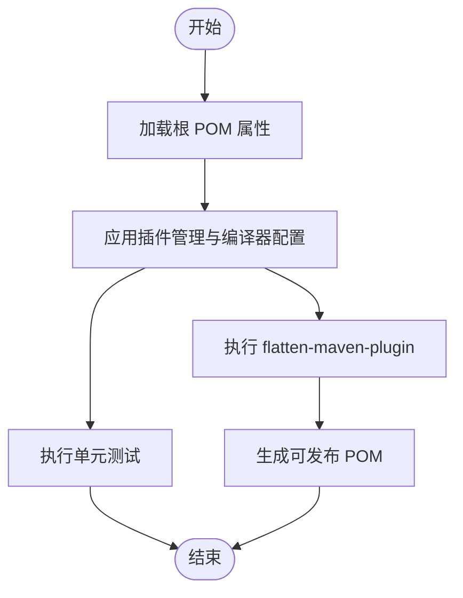
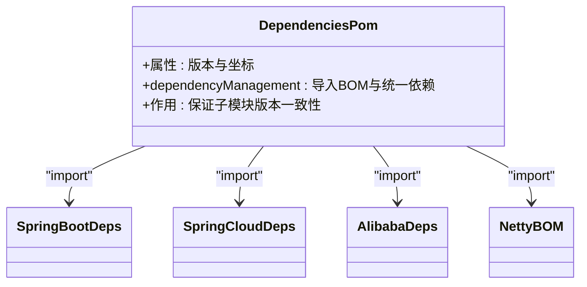
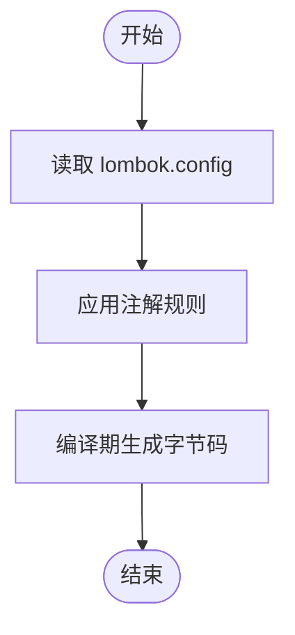
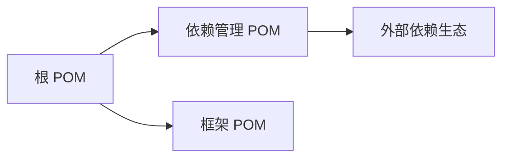

# 配置管理

<cite>
**本文引用的文件**
- [pom.xml](file://pom.xml)
- [lombok.config](file://lombok.config)
- [pandora-dependencies/pom.xml](file://pandora-dependencies/pom.xml)
- [pandora-framework/pom.xml](file://pandora-framework/pom.xml)
- [README.md](file://README.md)
</cite>

## 目录
1. [简介](#简介)
2. [项目结构](#项目结构)
3. [核心组件](#核心组件)
4. [架构总览](#架构总览)
5. [详细组件分析](#详细组件分析)
6. [依赖分析](#依赖分析)
7. [性能考量](#性能考量)
8. [故障排查指南](#故障排查指南)
9. [结论](#结论)
10. [附录](#附录)

## 简介
本指南面向开发者与运维人员，系统讲解 Pandora Cloud 的配置管理体系，覆盖 Maven 构建配置、Lombok 配置与环境变量管理策略，解释如何通过 properties 文件与环境变量实现灵活的配置管理；并给出开发、测试、生产三类环境的差异化处理建议、最佳实践、安全注意事项、版本管理方案、故障排查方法以及可扩展性建议。由于当前仓库未包含具体 Spring Boot 配置文件与环境变量示例，本文以现有 POM 与 Lombok 配置为基础，结合 Spring Boot 典型实践，提供可落地的配置管理蓝图与实施路径。

## 项目结构
Pandora Cloud 采用多模块聚合工程组织，根 POM 负责统一版本与插件管理，pandora-dependencies 提供依赖版本与依赖管理，pandora-framework 作为技术组件的父模块，便于后续按功能域拆分与扩展。

图表来源
- [pom.xml:11-14](file://pom.xml#L11-L14)
- [pandora-framework/pom.xml:12-13](file://pandora-framework/pom.xml#L12-L13)

章节来源
- [pom.xml:1-150](file://pom.xml#L1-L150)
- [pandora-framework/pom.xml:1-34](file://pandora-framework/pom.xml#L1-L34)

## 核心组件
- Maven 版本与插件统一管理：根 POM 使用属性集中定义版本号与插件版本，配合 flatten-maven-plugin 实现可发布版本的稳定化与清理。
- 依赖版本集中管理：pandora-dependencies 以属性与 dependencyManagement 管理各生态组件版本，确保子模块一致性。
- Lombok 配置：通过 lombok.config 控制注解行为，减少样板代码，提升可读性与一致性。
- Spring 配置处理器：根 POM 与依赖管理均引入 spring-boot-configuration-processor，辅助生成配置元数据，增强 IDE 体验与配置提示。

章节来源
- [pom.xml:20-37](file://pom.xml#L20-L37)
- [pom.xml:52-101](file://pom.xml#L52-L101)
- [pandora-dependencies/pom.xml:15-106](file://pandora-dependencies/pom.xml#L15-L106)
- [pandora-dependencies/pom.xml:157-162](file://pandora-dependencies/pom.xml#L157-L162)
- [lombok.config:1-4](file://lombok.config#L1-L4)

## 架构总览
下图展示配置管理在构建与运行阶段的关键交互：Maven 读取根 POM 与依赖管理，Lombok 在编译期生成字节码，Spring 配置处理器生成配置元数据，最终由 Spring Boot 从多种来源加载配置（application.properties/yml、环境变量、命令行参数等）。

图表来源
- [pom.xml:52-101](file://pom.xml#L52-L101)
- [pom.xml:102-128](file://pom.xml#L102-L128)
- [pandora-dependencies/pom.xml:157-162](file://pandora-dependencies/pom.xml#L157-L162)

## 详细组件分析

### Maven 构建配置与版本管理
- 版本与属性集中管理：根 POM 使用属性集中定义 Java 版本、编码、revision 与插件版本，确保跨模块一致性。
- 插件管理与编译器配置：maven-compiler-plugin 集成 spring-boot-configuration-processor、Lombok 与 lombok-mapstruct-binding，保证 MapStruct 能正确识别 Lombok 生成的 getter/setter；同时启用 -parameters 参数以兼容 Spring Boot 3.x 的参数名发现。
- flatten-maven-plugin：在 process-resources 与 clean 阶段执行 flatten 与 clean，确保发布 POM 的稳定性与可重复性。
- 仓库加速：配置阿里云与华为云 Maven 源，提升依赖下载速度。

图表来源
- [pom.xml:20-37](file://pom.xml#L20-L37)
- [pom.xml:52-101](file://pom.xml#L52-L101)
- [pom.xml:102-128](file://pom.xml#L102-L128)

章节来源
- [pom.xml:19-37](file://pom.xml#L19-L37)
- [pom.xml:52-101](file://pom.xml#L52-L101)
- [pom.xml:102-128](file://pom.xml#L102-L128)
- [pom.xml:134-147](file://pom.xml#L134-L147)

### 依赖版本集中管理（pandora-dependencies）
- 依赖版本属性：集中定义 Spring Boot、Spring Cloud、MyBatis/Plus、Redisson、RocketMQ、XXL-Job、SkyWalking、Knife4j/SpringDoc、Hutool、Guava、FastJSON、OkHttp、Vert.x、MQTT、Californium、J2Mod 等组件版本。
- dependencyManagement 导入：通过 import 方式导入 spring-boot-dependencies、spring-cloud-dependencies、spring-cloud-alibaba-dependencies 与 Netty BOM，确保版本对齐与冲突最小化。
- 关键依赖：spring-boot-configuration-processor 用于生成配置元数据；MapStruct 与 Lombok 绑定用于类型映射与字节码增强；测试相关依赖如 Mockito、Jedis-Mock、Podam 用于单元测试场景。

图表来源
- [pandora-dependencies/pom.xml:109-141](file://pandora-dependencies/pom.xml#L109-L141)
- [pandora-dependencies/pom.xml:157-162](file://pandora-dependencies/pom.xml#L157-L162)

章节来源
- [pandora-dependencies/pom.xml:15-106](file://pandora-dependencies/pom.xml#L15-L106)
- [pandora-dependencies/pom.xml:109-141](file://pandora-dependencies/pom.xml#L109-L141)
- [pandora-dependencies/pom.xml:157-162](file://pandora-dependencies/pom.xml#L157-L162)

### Lombok 配置与最佳实践
- 配置项：stopBubbling、toString/callsuper、equals/hashCode/callsuper、accessors.chain。
- 建议：在团队内统一 lombok.config，避免不同 IDE 或 CI 环境下的差异；结合 MapStruct 与 Lombok 的组合，确保编译期注解链路完整。

图表来源
- [lombok.config:1-4](file://lombok.config#L1-L4)

章节来源
- [lombok.config:1-4](file://lombok.config#L1-L4)

### 环境变量与配置文件策略
- 配置来源优先级（Spring Boot 默认）：命令行参数 > 环境变量 > application-{profile}.properties/yml > application.properties/yml > @DefaultValue。
- 环境变量命名规范：建议使用大写、点号或下划线分隔，映射到驼峰属性时注意转换规则。
- profile 切换：通过 spring.profiles.active 选择 dev/test/prod；在 CI/CD 中通过环境变量注入敏感配置。
- 敏感信息隔离：数据库密码、第三方密钥等放入环境变量或配置中心，不在仓库中提交。

章节来源
- [pom.xml:52-101](file://pom.xml#L52-L101)

### 开发/测试/生产环境差异化
- 开发环境：本地 IDE 启动，使用 application-dev.properties/yml；开启调试与热重载；日志级别较低。
- 测试环境：CI 执行单元测试与集成测试，使用 application-test.properties/yml；数据库使用内存或容器化实例；关闭非必要监控。
- 生产环境：通过环境变量注入配置；启用健康检查与监控；严格控制日志级别与输出；使用只读部署与灰度发布。

章节来源
- [pom.xml:52-101](file://pom.xml#L52-L101)

### 配置最佳实践
- 统一版本与依赖：通过根 POM 与依赖管理模块集中维护，避免版本漂移。
- 明确配置边界：将通用配置与业务配置分离；为每个模块定义独立的配置命名空间。
- 配置元数据：启用 spring-boot-configuration-processor，生成 IDE 友好的配置提示。
- Lombok 与 MapStruct 协同：确保 annotationProcessorPaths 正确配置，避免编译期找不到 getter/setter。
- 仓库镜像：使用国内镜像源提升构建效率。

章节来源
- [pandora-dependencies/pom.xml:157-162](file://pandora-dependencies/pom.xml#L157-L162)
- [pom.xml:64-98](file://pom.xml#L64-L98)
- [pom.xml:134-147](file://pom.xml#L134-L147)

### 安全考虑
- 不在仓库中提交敏感配置；使用环境变量或配置中心（如 Spring Cloud Config、Nacos、Consul）管理机密。
- 对外暴露的配置文件仅包含非敏感参数；生产环境启用 HTTPS 与访问控制。
- 定期轮换密钥与证书；限制配置变更权限与审计日志。

章节来源
- [pandora-dependencies/pom.xml:157-162](file://pandora-dependencies/pom.xml#L157-L162)

### 版本管理方案
- 使用根 POM 的 revision 属性统一版本号；通过 flatten-maven-plugin 在构建时写入实际版本，避免 SNAPSHOT 泄露到发布产物。
- 子模块继承父 POM 的版本与属性，确保一致性。
- 发布前执行 mvn clean install -DskipTests，确认 flatten 与清理流程正常。

章节来源
- [pom.xml:19-37](file://pom.xml#L19-L37)
- [pom.xml:102-128](file://pom.xml#L102-L128)

### 自动化配置工具推荐
- 配置模板化：使用 Maven Archetype 或 Cookiecutter 生成标准化的模块与配置骨架。
- CI/CD 集成：在流水线中注入环境变量与 secrets；使用 Docker 镜像固化配置。
- 配置校验：在构建阶段增加配置校验步骤，确保必填项与格式正确。
- 配置中心：结合 Spring Cloud Config/Nacos/Consul 实现动态配置与灰度发布。

章节来源
- [pom.xml:102-128](file://pom.xml#L102-L128)

### 扩展配置体系
- 新增环境：在 application-{env}.properties/yml 中新增 profile，并通过环境变量切换。
- 新增模块：在 pandora-framework 下新增子模块，复用根 POM 与依赖管理的版本与插件配置。
- 新增配置项：在 @ConfigurationProperties 类中声明新字段，配合 spring-boot-configuration-processor 自动生成元数据。

章节来源
- [pandora-framework/pom.xml:12-25](file://pandora-framework/pom.xml#L12-L25)
- [pandora-dependencies/pom.xml:157-162](file://pandora-dependencies/pom.xml#L157-L162)

## 依赖分析
- 耦合关系：根 POM 依赖 pandora-dependencies 的 dependencyManagement；pandora-framework 继承根 POM 的属性与插件配置。
- 外部依赖：Spring Boot、Spring Cloud、Spring Cloud Alibaba、MyBatis/Plus、Redisson、RocketMQ、XXL-Job、SkyWalking、Knife4j/SpringDoc、Hutool、OkHttp、Vert.x、MQTT、Californium、J2Mod 等。
- 循环依赖：当前结构为单向依赖（根 -> 依赖管理 -> 子模块），无循环依赖迹象。

图表来源
- [pom.xml:11-14](file://pom.xml#L11-L14)
- [pandora-dependencies/pom.xml:109-141](file://pandora-dependencies/pom.xml#L109-L141)
- [pandora-framework/pom.xml:6-13](file://pandora-framework/pom.xml#L6-L13)

章节来源
- [pom.xml:11-14](file://pom.xml#L11-L14)
- [pandora-dependencies/pom.xml:109-141](file://pandora-dependencies/pom.xml#L109-L141)
- [pandora-framework/pom.xml:6-13](file://pandora-framework/pom.xml#L6-L13)

## 性能考量
- 依赖解析优化：使用国内镜像源减少网络延迟；合理缓存 Maven 本地仓库。
- 构建性能：启用并行构建与增量编译；避免不必要的测试与打包步骤。
- 运行时性能：合理设置 JVM 参数与线程池大小；使用连接池与缓存组件（Redisson、Druid）优化 IO。

章节来源
- [pom.xml:134-147](file://pom.xml#L134-L147)

## 故障排查指南
- Lombok/MapStruct 编译失败：检查 maven-compiler-plugin 的 annotationProcessorPaths 是否包含 spring-boot-configuration-processor、lombok、lombok-mapstruct-binding 与 mapstruct-processor。
- 参数名发现异常：确认编译器参数包含 -parameters。
- 依赖冲突：通过 dependencyManagement 导入 BOM，或使用 mvn dependency:tree 定位冲突。
- 发布版本不稳定：确认 flatten-maven-plugin 在 process-resources 与 clean 阶段执行成功。
- 环境变量未生效：核对环境变量命名与 Spring Boot 配置映射规则；检查 profile 是否正确激活。

章节来源
- [pom.xml:64-98](file://pom.xml#L64-L98)
- [pom.xml:102-128](file://pom.xml#L102-L128)

## 结论
Pandora Cloud 的配置管理以根 POM 与依赖管理模块为核心，结合 Lombok 与 Spring 配置处理器，形成统一、可扩展且易于维护的配置体系。通过明确的环境差异策略、安全与版本管理方案，以及可落地的自动化工具与扩展路径，能够支撑从开发到生产的全生命周期配置管理需求。

## 附录
- 快速检查清单
  - 是否在根 POM 中统一版本与插件？
  - 是否在依赖管理模块集中定义外部依赖版本？
  - 是否启用 spring-boot-configuration-processor 并正确配置注解处理器链？
  - 是否使用环境变量隔离敏感配置？
  - 是否为 dev/test/prod 定义了独立的 profile 与配置文件？

章节来源
- [pom.xml:19-37](file://pom.xml#L19-L37)
- [pandora-dependencies/pom.xml:157-162](file://pandora-dependencies/pom.xml#L157-L162)
- [pandora-framework/pom.xml:12-25](file://pandora-framework/pom.xml#L12-L25)