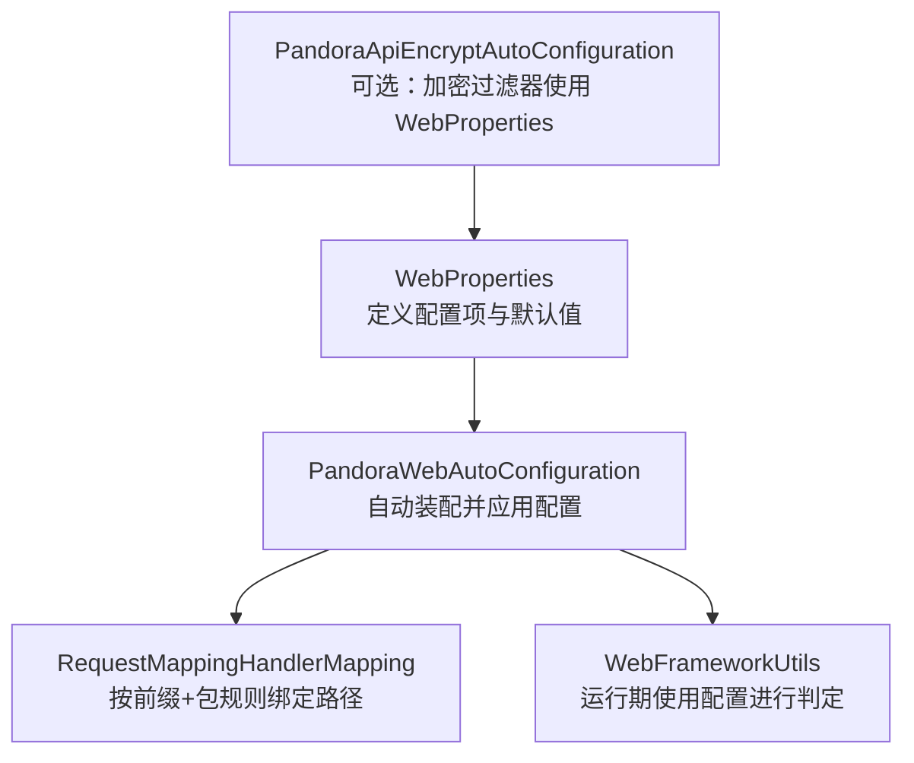
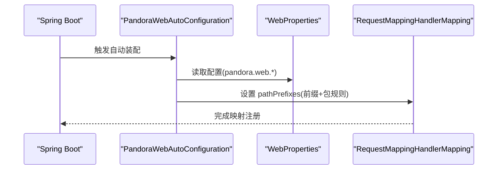
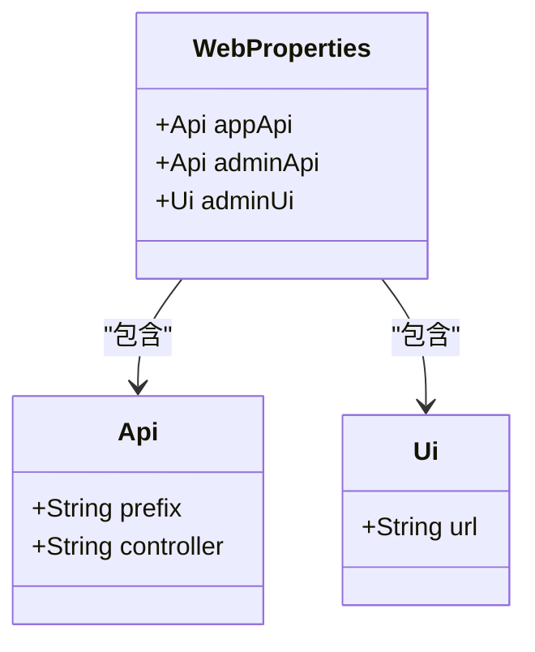
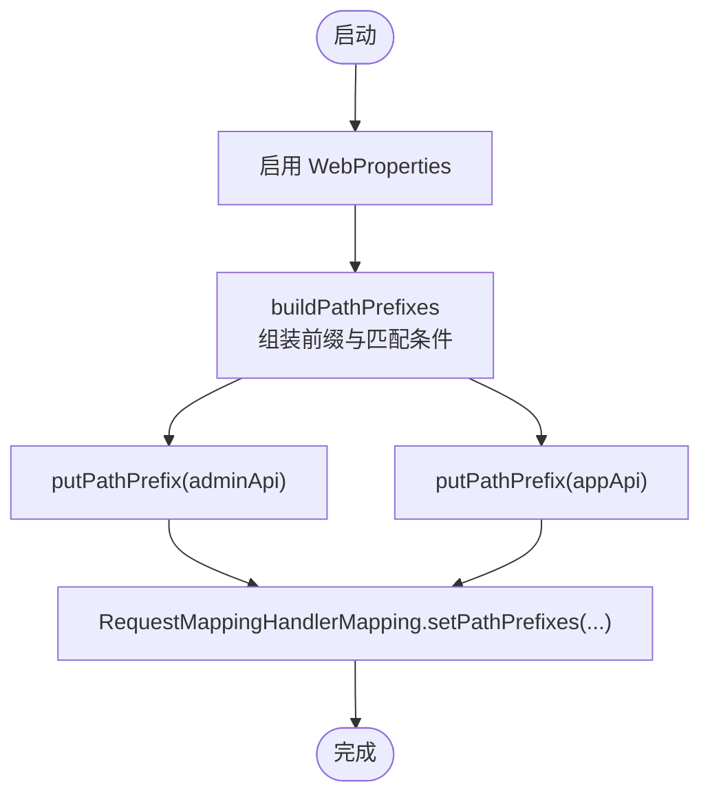
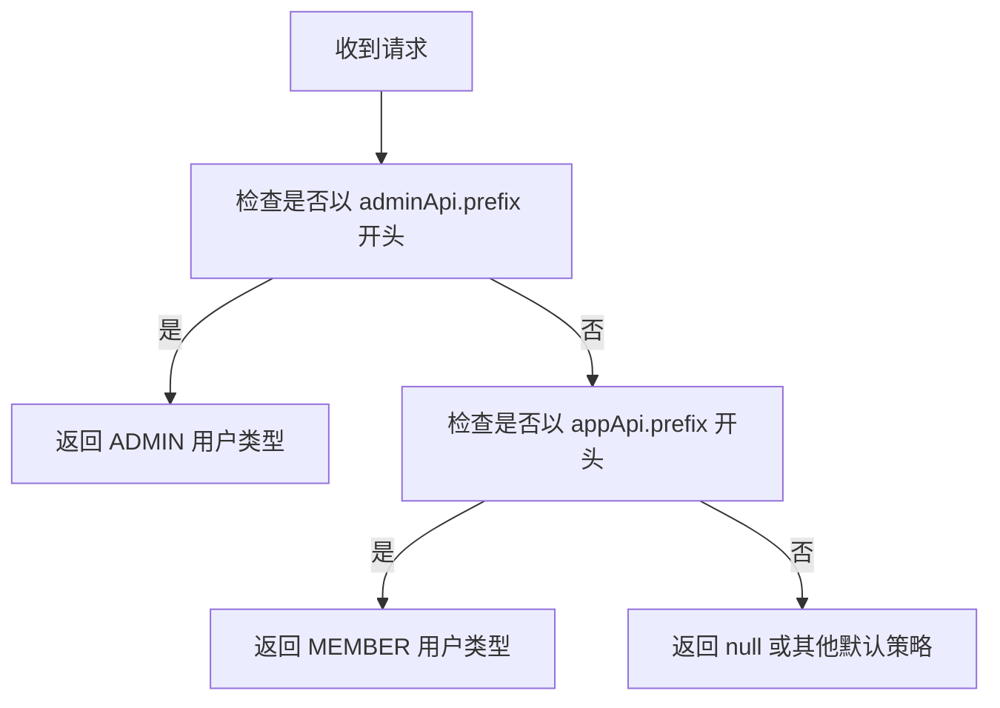
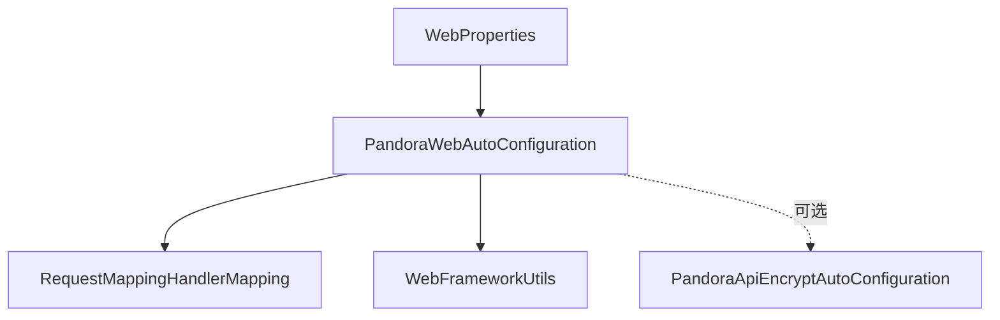

# Web配置属性

<cite>
**本文引用的文件**
- [WebProperties.java](file://pandora-framework/pandora-spring-boot-starter-web/src/main/java/net/ittimeline/pandora/framework/web/config/WebProperties.java)
- [PandoraWebAutoConfiguration.java](file://pandora-framework/pandora-spring-boot-starter-web/src/main/java/net/ittimeline/pandora/framework/web/config/PandoraWebAutoConfiguration.java)
- [WebFrameworkUtils.java](file://pandora-framework/pandora-spring-boot-starter-web/src/main/java/net/ittimeline/pandora/framework/web/core/util/WebFrameworkUtils.java)
- [PandoraApiEncryptAutoConfiguration.java](file://pandora-framework/pandora-spring-boot-starter-web/src/main/java/net/ittimeline/pandora/framework/encrypt/config/PandoraApiEncryptAutoConfiguration.java)
- [pandora-spring-boot-starter-web/pom.xml](file://pandora-framework/pandora-spring-boot-starter-web/pom.xml)
- [README.md](file://README.md)
</cite>

## 目录
1. [简介](#简介)
2. [项目结构](#项目结构)
3. [核心组件](#核心组件)
4. [架构总览](#架构总览)
5. [详细组件分析](#详细组件分析)
6. [依赖关系分析](#依赖关系分析)
7. [性能考量](#性能考量)
8. [故障排查指南](#故障排查指南)
9. [结论](#结论)
10. [附录](#附录)

## 简介
本文件面向使用 Pandora Cloud 框架的开发者，系统性阐述 Web 配置属性 WebProperties 的设计与使用，重点覆盖以下方面：
- APP API 与 Admin API 的 URL 前缀配置与包扫描规则
- Admin UI 访问地址设置
- 配置验证机制与默认值
- 在自动装配中的应用流程与关键行为
- 不同业务场景下的配置示例与最佳实践
- 安全注意事项与常见问题排查

## 项目结构
Web 配置相关的核心代码位于 web starter 模块中，主要由三部分组成：
- WebProperties：定义配置项与默认值
- PandoraWebAutoConfiguration：将配置应用到 RequestMappingHandlerMapping，实现按前缀与包规则的路径前缀绑定
- WebFrameworkUtils：在运行期根据请求路径判断用户类型等逻辑，间接依赖 WebProperties

图表来源
- [WebProperties.java:18-28](file://pandora-framework/pandora-spring-boot-starter-web/src/main/java/net/ittimeline/pandora/framework/web/config/WebProperties.java#L18-L28)
- [PandoraWebAutoConfiguration.java:46](file://pandora-framework/pandora-spring-boot-starter-web/src/main/java/net/ittimeline/pandora/framework/web/config/PandoraWebAutoConfiguration.java#L46)
- [PandoraWebAutoConfiguration.java:55-91](file://pandora-framework/pandora-spring-boot-starter-web/src/main/java/net/ittimeline/pandora/framework/web/config/PandoraWebAutoConfiguration.java#L55-L91)
- [WebFrameworkUtils.java:106-120](file://pandora-framework/pandora-spring-boot-starter-web/src/main/java/net/ittimeline/pandora/framework/web/core/util/WebFrameworkUtils.java#L106-L120)
- [PandoraApiEncryptAutoConfiguration.java:30-38](file://pandora-framework/pandora-spring-boot-starter-web/src/main/java/net/ittimeline/pandora/framework/encrypt/config/PandoraApiEncryptAutoConfiguration.java#L30-L38)

章节来源
- [README.md:1-15](file://README.md#L1-L15)
- [pandora-spring-boot-starter-web/pom.xml:19-52](file://pandora-framework/pandora-spring-boot-starter-web/pom.xml#L19-L52)

## 核心组件
- WebProperties
  - 配置前缀：pandora.web
  - 关键字段：
    - appApi：APP API 的前缀与包扫描规则
    - adminApi：Admin API 的前缀与包扫描规则
    - adminUi：Admin UI 的访问地址
- 内部类 Api
  - prefix：API 前缀字符串，非空校验
  - controller：Ant 风格包路径规则，用于限定仅对标注了 @RestController 且属于该包路径的控制器生效
- 内部类 Ui
  - url：Admin UI 访问地址

章节来源
- [WebProperties.java:18-67](file://pandora-framework/pandora-spring-boot-starter-web/src/main/java/net/ittimeline/pandora/framework/web/config/WebProperties.java#L18-L67)

## 架构总览
WebProperties 的配置在启动阶段被自动装配加载，并通过 RequestMappingHandlerMapping 的路径前缀绑定生效；运行期 WebFrameworkUtils 会依据请求路径前缀判断用户类型，从而实现 APP 与 Admin 的差异化处理。

图表来源
- [PandoraWebAutoConfiguration.java:46](file://pandora-framework/pandora-spring-boot-starter-web/src/main/java/net/ittimeline/pandora/framework/web/config/PandoraWebAutoConfiguration.java#L46)
- [PandoraWebAutoConfiguration.java:55-91](file://pandora-framework/pandora-spring-boot-starter-web/src/main/java/net/ittimeline/pandora/framework/web/config/PandoraWebAutoConfiguration.java#L55-L91)
- [WebProperties.java:18-28](file://pandora-framework/pandora-spring-boot-starter-web/src/main/java/net/ittimeline/pandora/framework/web/config/WebProperties.java#L18-L28)

## 详细组件分析

### WebProperties 类结构与职责
- 配置注解与校验
  - 使用 @ConfigurationProperties(prefix = "pandora.web") 将配置绑定到属性树
  - 使用 @Validated 开启参数校验
  - 字段级别使用 @NotNull、@NotEmpty 等约束，确保必要配置项不为空
- 默认值
  - appApi.prefix 默认 "/app-api"
  - appApi.controller 默认 "**.controller.app.**"
  - adminApi.prefix 默认 "/admin-api"
  - adminApi.controller 默认 "**.controller.admin.**"
  - adminUi.url 未设置默认值，需显式配置
- 数据结构
  - Api：包含 prefix 与 controller
  - Ui：包含 url

图表来源
- [WebProperties.java:21-28](file://pandora-framework/pandora-spring-boot-starter-web/src/main/java/net/ittimeline/pandora/framework/web/config/WebProperties.java#L21-L28)
- [WebProperties.java:34-54](file://pandora-framework/pandora-spring-boot-starter-web/src/main/java/net/ittimeline/pandora/framework/web/config/WebProperties.java#L34-L54)
- [WebProperties.java:59-66](file://pandora-framework/pandora-spring-boot-starter-web/src/main/java/net/ittimeline/pandora/framework/web/config/WebProperties.java#L59-L66)

章节来源
- [WebProperties.java:18-67](file://pandora-framework/pandora-spring-boot-starter-web/src/main/java/net/ittimeline/pandora/framework/web/config/WebProperties.java#L18-L67)

### RequestMappingHandlerMapping 路径前缀绑定流程
- 自动装配启用 WebProperties
  - @EnableConfigurationProperties(WebProperties.class)
- 构建前缀映射
  - buildPathPrefixes：将 adminApi 与 appApi 的前缀与包规则映射到 RequestMappingHandlerMapping
  - putPathPrefix：仅对标注 @RestController 且包名匹配 controller Ant 规则的类生效
- 生效范围
  - 通过 setPathPrefixes 将前缀绑定到映射器，后续所有匹配的控制器方法都会带上对应前缀

图表来源
- [PandoraWebAutoConfiguration.java:46](file://pandora-framework/pandora-spring-boot-starter-web/src/main/java/net/ittimeline/pandora/framework/web/config/PandoraWebAutoConfiguration.java#L46)
- [PandoraWebAutoConfiguration.java:70-88](file://pandora-framework/pandora-spring-boot-starter-web/src/main/java/net/ittimeline/pandora/framework/web/config/PandoraWebAutoConfiguration.java#L70-L88)

章节来源
- [PandoraWebAutoConfiguration.java:55-91](file://pandora-framework/pandora-spring-boot-starter-web/src/main/java/net/ittimeline/pandora/framework/web/config/PandoraWebAutoConfiguration.java#L55-L91)

### 运行期用户类型判定
- WebFrameworkUtils 在运行期根据请求路径前缀判断用户类型：
  - 若路径以前缀匹配 adminApi.prefix 开头，则视为 ADMIN
  - 若路径以前缀匹配 appApi.prefix 开头，则视为 MEMBER
- 该逻辑依赖 WebProperties 中的前缀配置

图表来源
- [WebFrameworkUtils.java:112-120](file://pandora-framework/pandora-spring-boot-starter-web/src/main/java/net/ittimeline/pandora/framework/web/core/util/WebFrameworkUtils.java#L112-L120)
- [WebProperties.java:22-25](file://pandora-framework/pandora-spring-boot-starter-web/src/main/java/net/ittimeline/pandora/framework/web/config/WebProperties.java#L22-L25)

章节来源
- [WebFrameworkUtils.java:106-120](file://pandora-framework/pandora-spring-boot-starter-web/src/main/java/net/ittimeline/pandora/framework/web/core/util/WebFrameworkUtils.java#L106-L120)

### 配置验证机制与默认值
- 验证机制
  - @NotNull：appApi、adminApi、adminUi 必填
  - @NotEmpty：prefix、controller 必填
  - @Valid：内部 Api、Ui 对象参与校验
- 默认值
  - appApi.prefix、appApi.controller、adminApi.prefix、adminApi.controller 存在默认值
  - adminUi.url 无默认值，必须显式配置

章节来源
- [WebProperties.java:22-28](file://pandora-framework/pandora-spring-boot-starter-web/src/main/java/net/ittimeline/pandora/framework/web/config/WebProperties.java#L22-L28)
- [WebProperties.java:44-53](file://pandora-framework/pandora-spring-boot-starter-web/src/main/java/net/ittimeline/pandora/framework/web/config/WebProperties.java#L44-L53)

### 配置示例与场景说明
以下示例均以属性键 pandora.web.* 形式给出，不直接展示具体代码片段。

- 场景一：使用默认值
  - 适用：快速启动，无需自定义前缀与包扫描规则
  - 配置要点：无需额外配置，系统采用默认前缀与包规则
  - 影响：APP API 路径前缀为 /app-api，Admin API 路径前缀为 /admin-api；仅扫描对应包路径下的 @RestController 控制器

- 场景二：自定义 APP API 前缀与包扫描
  - 配置要点：
    - pandora.web.app-api.prefix=自定义APP前缀
    - pandora.web.app-api.controller=自定义Ant包规则
  - 影响：仅匹配满足包规则的 @RestController 控制器，并以前缀暴露

- 场景三：自定义 Admin API 前缀与包扫描
  - 配置要点：
    - pandora.web.admin-api.prefix=自定义Admin前缀
    - pandora.web.admin-api.controller=自定义Ant包规则
  - 影响：仅匹配满足包规则的 @RestController 控制器，并以前缀暴露

- 场景四：同时自定义 APP 与 Admin API
  - 配置要点：分别设置 app-api 与 admin-api 的 prefix 与 controller
  - 影响：RequestMappingHandlerMapping 会为两者分别绑定前缀与包规则

- 场景五：配置 Admin UI 访问地址
  - 配置要点：pandora.web.admin-ui.url=Admin UI 地址
  - 影响：运行期 WebFrameworkUtils 等组件可据此进行访问判定或集成

章节来源
- [WebProperties.java:22-28](file://pandora-framework/pandora-spring-boot-starter-web/src/main/java/net/ittimeline/pandora/framework/web/config/WebProperties.java#L22-L28)
- [WebProperties.java:59-66](file://pandora-framework/pandora-spring-boot-starter-web/src/main/java/net/ittimeline/pandora/framework/web/config/WebProperties.java#L59-L66)

### 与可选组件的集成
- API 加密过滤器（可选）
  - 当开启 pandora.api-encrypt.enable=true 时，PandoraApiEncryptAutoConfiguration 会注入 ApiEncryptFilter，并依赖 WebProperties 与 RequestMappingHandlerMapping
  - 该组件与 WebProperties 的关系体现在其构造函数中对 WebProperties 的使用

章节来源
- [PandoraApiEncryptAutoConfiguration.java:24-38](file://pandora-framework/pandora-spring-boot-starter-web/src/main/java/net/ittimeline/pandora/framework/encrypt/config/PandoraApiEncryptAutoConfiguration.java#L24-L38)

## 依赖关系分析
- WebProperties 作为配置模型，被 PandoraWebAutoConfiguration 启用并消费
- RequestMappingHandlerMapping 通过 setPathPrefixes 应用前缀与包规则
- WebFrameworkUtils 在运行期使用 WebProperties 的前缀信息进行业务判定
- 可选组件（如 API 加密）在装配时同样依赖 WebProperties

图表来源
- [PandoraWebAutoConfiguration.java:46](file://pandora-framework/pandora-spring-boot-starter-web/src/main/java/net/ittimeline/pandora/framework/web/config/PandoraWebAutoConfiguration.java#L46)
- [WebFrameworkUtils.java:106-109](file://pandora-framework/pandora-spring-boot-starter-web/src/main/java/net/ittimeline/pandora/framework/web/core/util/WebFrameworkUtils.java#L106-L109)
- [PandoraApiEncryptAutoConfiguration.java:24-38](file://pandora-framework/pandora-spring-boot-starter-web/src/main/java/net/ittimeline/pandora/framework/encrypt/config/PandoraApiEncryptAutoConfiguration.java#L24-L38)

章节来源
- [pandora-spring-boot-starter-web/pom.xml:19-52](file://pandora-framework/pandora-spring-boot-starter-web/pom.xml#L19-L52)

## 性能考量
- Ant 包匹配在启动阶段一次性完成，运行期仅做前缀判断，开销极低
- 建议合理设置 controller 包规则，避免过度宽泛导致不必要的类扫描
- 若存在大量控制器，建议拆分包结构并明确前缀与包规则，提升可维护性

## 故障排查指南
- 配置缺失或为空
  - 现象：启动时报错，提示某配置项为空
  - 排查：确认 pandora.web.app-api、pandora.web.admin-api、pandora.web.admin-ui.url 是否正确配置
- 前缀冲突
  - 现象：多个控制器前缀相同导致映射冲突
  - 排查：为 APP 与 Admin API 设置不同前缀，确保各自包规则唯一
- 包规则不匹配
  - 现象：控制器未被识别为 REST 控制器
  - 排查：确认控制器类上存在 @RestController 注解，且包名符合 controller Ant 规则
- Admin UI 地址未配置
  - 现象：运行期无法正确识别 Admin UI 访问地址
  - 排查：设置 pandora.web.admin-ui.url

章节来源
- [WebProperties.java:22-28](file://pandora-framework/pandora-spring-boot-starter-web/src/main/java/net/ittimeline/pandora/framework/web/config/WebProperties.java#L22-L28)
- [WebProperties.java:44-53](file://pandora-framework/pandora-spring-boot-starter-web/src/main/java/net/ittimeline/pandora/framework/web/config/WebProperties.java#L44-L53)
- [PandoraWebAutoConfiguration.java:70-88](file://pandora-framework/pandora-spring-boot-starter-web/src/main/java/net/ittimeline/pandora/framework/web/config/PandoraWebAutoConfiguration.java#L70-L88)

## 结论
WebProperties 通过简洁的配置项与默认值，为 APP 与 Admin API 提供了统一的前缀与包扫描规则，并在运行期支撑用户类型判定等业务逻辑。结合自动装配机制，开发者只需关注前缀与包规则的合理性，即可获得清晰、安全、易维护的 API 访问路径。

## 附录
- 最佳实践
  - 为 APP 与 Admin API 分别设置独立前缀，避免路径混淆
  - 明确 controller 包规则，确保仅扫描目标包下的控制器
  - 显式配置 admin-ui.url，便于前端与运维集成
  - 安全考虑：前缀可配合网关/Nginx 进行统一路由与防护，避免敏感接口直接暴露
- 常见问题
  - 未配置 admin-ui.url：需补充 Admin UI 地址
  - 前缀与包规则冲突：调整前缀或包规则，确保唯一性
  - 控制器未被识别：检查 @RestController 注解与包规则匹配