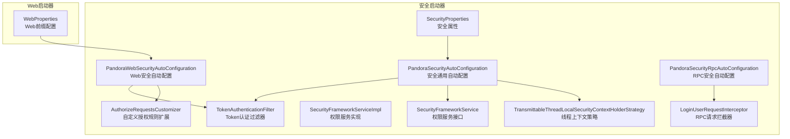
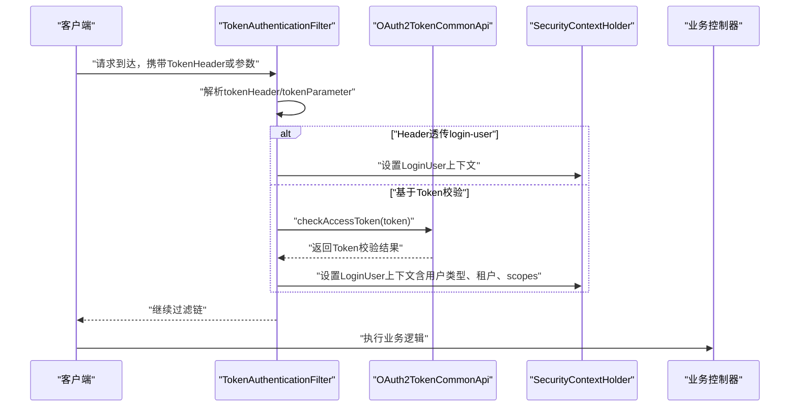
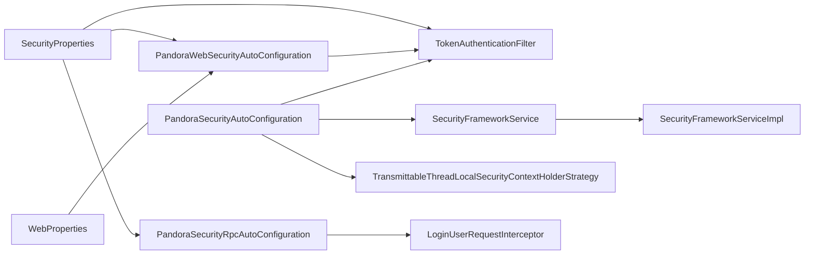

# 安全配置属性

<cite>
**本文引用的文件**
- [SecurityProperties.java](file://pandora-framework/pandora-spring-boot-starter-security/src/main/java/net/ittimeline/pandora/framework/security/config/SecurityProperties.java)
- [PandoraSecurityAutoConfiguration.java](file://pandora-framework/pandora-spring-boot-starter-security/src/main/java/net/ittimeline/pandora/framework/security/config/PandoraSecurityAutoConfiguration.java)
- [PandoraWebSecurityAutoConfiguration.java](file://pandora-framework/pandora-spring-boot-starter-security/src/main/java/net/ittimeline/pandora/framework/security/config/PandoraWebSecurityAutoConfiguration.java)
- [PandoraSecurityRpcAutoConfiguration.java](file://pandora-framework/pandora-spring-boot-starter-security/src/main/java/net/ittimeline/pandora/framework/security/config/PandoraSecurityRpcAutoConfiguration.java)
- [AuthorizeRequestsCustomizer.java](file://pandora-framework/pandora-spring-boot-starter-security/src/main/java/net/ittimeline/pandora/framework/security/config/AuthorizeRequestsCustomizer.java)
- [TokenAuthenticationFilter.java](file://pandora-framework/pandora-spring-boot-starter-security/src/main/java/net/ittimeline/pandora/framework/security/core/filter/TokenAuthenticationFilter.java)
- [SecurityFrameworkService.java](file://pandora-framework/pandora-spring-boot-starter-security/src/main/java/net/ittimeline/pandora/framework/security/core/service/SecurityFrameworkService.java)
- [SecurityFrameworkServiceImpl.java](file://pandora-framework/pandora-spring-boot-starter-security/src/main/java/net/ittimeline/pandora/framework/security/core/service/SecurityFrameworkServiceImpl.java)
- [LoginUserRequestInterceptor.java](file://pandora-framework/pandora-spring-boot-starter-security/src/main/java/net/ittimeline/pandora/framework/security/core/rpc/LoginUserRequestInterceptor.java)
- [TransmittableThreadLocalSecurityContextHolderStrategy.java](file://pandora-framework/pandora-spring-boot-starter-security/src/main/java/net/ittimeline/pandora/framework/security/core/context/TransmittableThreadLocalSecurityContextHolderStrategy.java)
- [org.springframework.boot.autoconfigure.AutoConfiguration.imports](file://pandora-framework/pandora-spring-boot-starter-security/src/main/resources/META-INF/spring/org.springframework.boot.autoconfigure.AutoConfiguration.imports)
- [WebProperties.java](file://pandora-framework/pandora-spring-boot-starter-web/src/main/java/net/ittimeline/pandora/framework/web/config/WebProperties.java)
</cite>

## 更新摘要
**变更内容**
- 新增PandoraSecurityRpcAutoConfiguration RPC自动配置类
- 新增LoginUserRequestInterceptor RPC请求拦截器
- 新增TransmittableThreadLocalSecurityContextHolderStrategy线程上下文策略
- 新增AuthorizeRequestsCustomizer抽象授权定制器
- 更新SecurityProperties配置类的注释和字段说明
- 完善RPC场景下的安全配置支持

## 目录
1. [简介](#简介)
2. [项目结构](#项目结构)
3. [核心组件](#核心组件)
4. [架构总览](#架构总览)
5. [详细组件分析](#详细组件分析)
6. [依赖分析](#依赖分析)
7. [性能考量](#性能考量)
8. [故障排查指南](#故障排查指南)
9. [结论](#结论)
10. [附录](#附录)

## 简介
本文件面向Pandora Cloud框架的安全配置属性，系统性梳理SecurityProperties类中与安全相关的关键配置项，解释安全自动配置的工作原理与配置优先级，给出OAuth2.0集成、Token传递与校验、权限控制的完整配置思路与最佳实践，并覆盖开发、测试、生产三类环境下的差异化策略。

## 项目结构
围绕安全配置的核心模块位于pandora-spring-boot-starter-security，关键文件如下：
- 配置属性：SecurityProperties
- 自动配置：PandoraSecurityAutoConfiguration、PandoraWebSecurityAutoConfiguration、PandoraSecurityRpcAutoConfiguration
- 权限扩展：AuthorizeRequestsCustomizer
- 认证过滤：TokenAuthenticationFilter
- 权限服务：SecurityFrameworkService、SecurityFrameworkServiceImpl
- RPC拦截：LoginUserRequestInterceptor
- 线程上下文：TransmittableThreadLocalSecurityContextHolderStrategy
- 自动装配清单：META-INF/spring/org.springframework.boot.autoconfigure.AutoConfiguration.imports
- Web前缀配置：WebProperties（用于构建/admin-api、/app-api前缀）

**图表来源**
- [SecurityProperties.java:19-57](file://pandora-framework/pandora-spring-boot-starter-security/src/main/java/net/ittimeline/pandora/framework/security/config/SecurityProperties.java#L19-L57)
- [PandoraSecurityAutoConfiguration.java:36-98](file://pandora-framework/pandora-spring-boot-starter-security/src/main/java/net/ittimeline/pandora/framework/security/config/PandoraSecurityAutoConfiguration.java#L36-L98)
- [PandoraWebSecurityAutoConfiguration.java:48-223](file://pandora-framework/pandora-spring-boot-starter-security/src/main/java/net/ittimeline/pandora/framework/security/config/PandoraWebSecurityAutoConfiguration.java#L48-L223)
- [PandoraSecurityRpcAutoConfiguration.java:17-26](file://pandora-framework/pandora-spring-boot-starter-security/src/main/java/net/ittimeline/pandora/framework/security/config/PandoraSecurityRpcAutoConfiguration.java#L17-L26)
- [AuthorizeRequestsCustomizer.java:19-38](file://pandora-framework/pandora-spring-boot-starter-security/src/main/java/net/ittimeline/pandora/framework/security/config/AuthorizeRequestsCustomizer.java#L19-L38)
- [TokenAuthenticationFilter.java:37-157](file://pandora-framework/pandora-spring-boot-starter-security/src/main/java/net/ittimeline/pandora/framework/security/core/filter/TokenAuthenticationFilter.java#L37-L157)
- [SecurityFrameworkService.java:10-61](file://pandora-framework/pandora-spring-boot-starter-security/src/main/java/net/ittimeline/pandora/framework/security/core/service/SecurityFrameworkService.java#L10-L61)
- [SecurityFrameworkServiceImpl.java:28-124](file://pandora-framework/pandora-spring-boot-starter-security/src/main/java/net/ittimeline/pandora/framework/security/core/service/SecurityFrameworkServiceImpl.java#L28-L124)
- [LoginUserRequestInterceptor.java:20-39](file://pandora-framework/pandora-spring-boot-starter-security/src/main/java/net/ittimeline/pandora/framework/security/core/rpc/LoginUserRequestInterceptor.java#L20-39)
- [TransmittableThreadLocalSecurityContextHolderStrategy.java:17-50](file://pandora-framework/pandora-spring-boot-starter-security/src/main/java/net/ittimeline/pandora/framework/security/core/context/TransmittableThreadLocalSecurityContextHolderStrategy.java#L17-50)
- [WebProperties.java](file://pandora-framework/pandora-spring-boot-starter-web/src/main/java/net/ittimeline/pandora/framework/web/config/WebProperties.java)

**章节来源**
- [org.springframework.boot.autoconfigure.AutoConfiguration.imports:1-6](file://pandora-framework/pandora-spring-boot-starter-security/src/main/resources/META-INF/spring/org.springframework.boot.autoconfigure.AutoConfiguration.imports#L1-L6)

## 核心组件
本节聚焦SecurityProperties类中的安全相关配置项及其作用范围。

- 认证配置
  - tokenHeader：HTTP请求中携带访问令牌的请求头名称，默认值为"Authorization"。用于从请求头提取Token。
  - tokenParameter：HTTP请求中携带访问令牌的查询参数名称，默认值为"token"。用于WebSocket等无法通过Header传参的场景。
  - mockEnable：是否启用Mock模式开关。开启后可通过特殊Token进行本地开发调试。
  - mockSecret：Mock模式密钥，需在启用Mock时配置，确保安全性。
  - passwordEncoderLength：BCrypt加密复杂度参数，数值越高安全性越高但计算开销越大。

- 授权与免登录配置
  - permitAllUrls：免登录放行的URL列表。结合注解扫描与自定义规则，形成多层免登录策略。

- OAuth2.0与Token校验
  - TokenAuthenticationFilter通过OAuth2TokenCommonApi校验访问令牌有效性，并在成功时将LoginUser写入Spring Security上下文；同时支持Header透传与Mock模式两种登录路径。

- 权限控制
  - SecurityFrameworkService提供hasPermission、hasAnyPermissions、hasRole、hasAnyRoles、hasScope、hasAnyScopes等能力，SecurityFrameworkServiceImpl基于Feign调用权限中心进行校验，并对常用校验做缓存优化。

- RPC安全配置
  - LoginUserRequestInterceptor在RPC调用时自动传递登录用户信息
  - TransmittableThreadLocalSecurityContextHolderStrategy确保异步场景下的安全上下文传递

**章节来源**
- [SecurityProperties.java:19-57](file://pandora-framework/pandora-spring-boot-starter-security/src/main/java/net/ittimeline/pandora/framework/security/config/SecurityProperties.java#L19-L57)
- [TokenAuthenticationFilter.java:47-157](file://pandora-framework/pandora-spring-boot-starter-security/src/main/java/net/ittimeline/pandora/framework/security/core/filter/TokenAuthenticationFilter.java#L47-L157)
- [SecurityFrameworkService.java:10-61](file://pandora-framework/pandora-spring-boot-starter-security/src/main/java/net/ittimeline/pandora/framework/security/core/service/SecurityFrameworkService.java#L10-L61)
- [SecurityFrameworkServiceImpl.java:28-124](file://pandora-framework/pandora-spring-boot-starter-security/src/main/java/net/ittimeline/pandora/framework/security/core/service/SecurityFrameworkServiceImpl.java#L28-L124)
- [LoginUserRequestInterceptor.java:20-39](file://pandora-framework/pandora-spring-boot-starter-security/src/main/java/net/ittimeline/pandora/framework/security/core/rpc/LoginUserRequestInterceptor.java#L20-39)
- [TransmittableThreadLocalSecurityContextHolderStrategy.java:17-50](file://pandora-framework/pandora-spring-boot-starter-security/src/main/java/net/ittimeline/pandora/framework/security/core/context/TransmittableThreadLocalSecurityContextHolderStrategy.java#L17-50)

## 架构总览
Pandora Cloud的安全体系由"自动配置 + 过滤器 + 权限服务 + RPC拦截"四层构成，配合WebProperties的前缀能力，形成统一的鉴权与授权流程。

**图表来源**
- [TokenAuthenticationFilter.java:47-107](file://pandora-framework/pandora-spring-boot-starter-security/src/main/java/net/ittimeline/pandora/framework/security/core/filter/TokenAuthenticationFilter.java#L47-L107)
- [PandoraWebSecurityAutoConfiguration.java:112-155](file://pandora-framework/pandora-spring-boot-starter-security/src/main/java/net/ittimeline/pandora/framework/security/config/PandoraWebSecurityAutoConfiguration.java#L112-L155)

## 详细组件分析

### SecurityProperties：安全配置属性
- 配置项与默认值
  - tokenHeader：默认"Authorization"
  - tokenParameter：默认"token"
  - mockEnable：默认false
  - mockSecret：默认"test"（仅在mockEnable=true时生效）
  - permitAllUrls：默认空列表
  - passwordEncoderLength：默认4（建议生产环境提升至10+）
- 校验与约束
  - tokenHeader、tokenParameter、mockEnable必填
  - mockSecret在mockEnable=true时必填
- 用途
  - 为TokenAuthenticationFilter提供Token提取策略
  - 为Web安全自动配置提供免登录URL集合
  - 为密码编码器提供复杂度参数

**章节来源**
- [SecurityProperties.java:19-57](file://pandora-framework/pandora-spring-boot-starter-security/src/main/java/net/ittimeline/pandora/framework/security/config/SecurityProperties.java#L19-L57)

### PandoraSecurityAutoConfiguration：安全自动配置
- 职责
  - 注册AuthenticationEntryPoint与AccessDeniedHandler
  - 注册BCryptPasswordEncoder并注入passwordEncoderLength
  - 注册TokenAuthenticationFilter并注入SecurityProperties与GlobalExceptionHandler
  - 注册SecurityFrameworkService实现
  - 设置TransmittableThreadLocalSecurityContextHolderStrategy为上下文策略
- 关键点
  - 与Web安全自动配置分离，避免初始化冲突
  - 通过@EnableConfigurationProperties启用SecurityProperties

**章节来源**
- [PandoraSecurityAutoConfiguration.java:36-98](file://pandora-framework/pandora-spring-boot-starter-security/src/main/java/net/ittimeline/pandora/framework/security/config/PandoraSecurityAutoConfiguration.java#L36-L98)

### PandoraWebSecurityAutoConfiguration：Web安全自动配置
- 职责
  - 配置SecurityFilterChain，禁用CSRF与Session，开启CORS
  - 扫描@PermitAll注解生成免登录URL集合
  - 合并SecurityProperties的permitAllUrls与注解规则
  - 应用AuthorizeRequestsCustomizer扩展点
  - 任何未匹配请求均需认证
  - 在UsernamePasswordAuthenticationFilter之前插入TokenAuthenticationFilter
- 关键点
  - 通过注解扫描与自定义规则实现"注解优先 + 配置兜底"的免登录策略
  - 支持WebFlux异步请求免认证（SSE场景）

**章节来源**
- [PandoraWebSecurityAutoConfiguration.java:48-223](file://pandora-framework/pandora-spring-boot-starter-security/src/main/java/net/ittimeline/pandora/framework/security/config/PandoraWebSecurityAutoConfiguration.java#L48-L223)

### PandoraSecurityRpcAutoConfiguration：RPC安全自动配置
- 职责
  - 启用Feign客户端，引入OAuth2TokenCommonApi和PermissionCommonApi
  - 注册LoginUserRequestInterceptor拦截器
- 关键点
  - 专门针对RPC场景的安全配置
  - 确保微服务间调用时的用户上下文传递

**章节来源**
- [PandoraSecurityRpcAutoConfiguration.java:17-26](file://pandora-framework/pandora-spring-boot-starter-security/src/main/java/net/ittimeline/pandora/framework/security/config/PandoraSecurityRpcAutoConfiguration.java#L17-L26)

### AuthorizeRequestsCustomizer：自定义授权规则扩展
- 职责
  - 提供Ordered接口，允许各模块按顺序自定义URL授权规则
  - 提供buildAdminApi与buildAppApi辅助方法，基于WebProperties前缀拼接URL
- 使用建议
  - 在不同子模块中实现该接口，按需追加授权规则
  - 通过getOrder控制执行顺序

**章节来源**
- [AuthorizeRequestsCustomizer.java:19-38](file://pandora-framework/pandora-spring-boot-starter-security/src/main/java/net/ittimeline/pandora/framework/security/config/AuthorizeRequestsCustomizer.java#L19-L38)
- [WebProperties.java](file://pandora-framework/pandora-spring-boot-starter-web/src/main/java/net/ittimeline/pandora/framework/web/config/WebProperties.java)

### TokenAuthenticationFilter：Token认证过滤器
- 工作流
  - 优先尝试从Header读取login-user并反序列化为LoginUser
  - 若无Header则从tokenHeader或tokenParameter提取Token
  - 调用OAuth2TokenCommonApi校验Token，失败时返回null（允许后续免登录）
  - 校验通过后设置LoginUser到Security上下文
  - 支持Mock模式：当mockEnable=true且token以mockSecret开头时，构造模拟用户
- 错误处理
  - 校验异常交由GlobalExceptionHandler统一处理并输出JSON

**章节来源**
- [TokenAuthenticationFilter.java:47-157](file://pandora-framework/pandora-spring-boot-starter-security/src/main/java/net/ittimeline/pandora/framework/security/core/filter/TokenAuthenticationFilter.java#L47-L157)

### SecurityFrameworkService/SecurityFrameworkServiceImpl：权限服务
- 能力
  - hasPermission/hasAnyPermissions：权限校验
  - hasRole/hasAnyRoles：角色校验
  - hasScope/hasAnyScopes：授权范围校验
- 实现要点
  - 通过PermissionCommonApi远程校验权限/角色
  - 对hasAnyPermissions/hasAnyRoles使用LoadingCache缓存，过期时间1分钟
  - 支持跨租户访问跳过权限检查的特殊逻辑

**章节来源**
- [SecurityFrameworkService.java:10-61](file://pandora-framework/pandora-spring-boot-starter-security/src/main/java/net/ittimeline/pandora/framework/security/core/service/SecurityFrameworkService.java#L10-L61)
- [SecurityFrameworkServiceImpl.java:28-124](file://pandora-framework/pandora-spring-boot-starter-security/src/main/java/net/ittimeline/pandora/framework/security/core/service/SecurityFrameworkServiceImpl.java#L28-L124)

### LoginUserRequestInterceptor：RPC请求拦截器
- 职责
  - 在Feign RPC调用时自动将当前登录用户信息注入到请求头
  - 使用URLEncoder确保中文字符正确传输
- 工作原理
  - 从SecurityFrameworkUtils获取当前LoginUser
  - 将LoginUser序列化为JSON字符串并编码
  - 通过SecurityFrameworkUtils.LOGIN_USER_HEADER头部传递

**章节来源**
- [LoginUserRequestInterceptor.java:20-39](file://pandora-framework/pandora-spring-boot-starter-security/src/main/java/net/ittimeline/pandora/framework/security/core/rpc/LoginUserRequestInterceptor.java#L20-39)

### TransmittableThreadLocalSecurityContextHolderStrategy：线程上下文策略
- 职责
  - 基于TransmittableThreadLocal实现安全上下文的线程传递
  - 解决@Async等异步执行场景下ThreadLocal丢失的问题
- 关键特性
  - 使用阿里巴巴TTL库的TransmittableThreadLocal
  - 确保RPC网关场景下的安全上下文正确传递

**章节来源**
- [TransmittableThreadLocalSecurityContextHolderStrategy.java:17-50](file://pandora-framework/pandora-spring-boot-starter-security/src/main/java/net/ittimeline/pandora/framework/security/core/context/TransmittableThreadLocalSecurityContextHolderStrategy.java#L17-50)

## 依赖分析
- 自动装配顺序
  - 安全启动器的AutoConfiguration导入文件会加载三个自动配置类，确保在Web安全配置之前完成基础安全组件注册
- 组件耦合
  - TokenAuthenticationFilter依赖SecurityProperties、GlobalExceptionHandler、OAuth2TokenCommonApi
  - SecurityFrameworkServiceImpl依赖PermissionCommonApi与SecurityFrameworkUtils
  - PandoraWebSecurityAutoConfiguration依赖WebProperties、SecurityProperties、TokenAuthenticationFilter以及自定义授权扩展
  - LoginUserRequestInterceptor依赖SecurityFrameworkUtils和SecurityFrameworkUtils.LOGIN_USER_HEADER常量

**图表来源**
- [PandoraSecurityAutoConfiguration.java:36-98](file://pandora-framework/pandora-spring-boot-starter-security/src/main/java/net/ittimeline/pandora/framework/security/config/PandoraSecurityAutoConfiguration.java#L36-L98)
- [PandoraWebSecurityAutoConfiguration.java:48-223](file://pandora-framework/pandora-spring-boot-starter-security/src/main/java/net/ittimeline/pandora/framework/security/config/PandoraWebSecurityAutoConfiguration.java#L48-L223)
- [PandoraSecurityRpcAutoConfiguration.java:17-26](file://pandora-framework/pandora-spring-boot-starter-security/src/main/java/net/ittimeline/pandora/framework/security/config/PandoraSecurityRpcAutoConfiguration.java#L17-L26)
- [TokenAuthenticationFilter.java:37-157](file://pandora-framework/pandora-spring-boot-starter-security/src/main/java/net/ittimeline/pandora/framework/security/core/filter/TokenAuthenticationFilter.java#L37-L157)
- [SecurityFrameworkServiceImpl.java:28-124](file://pandora-framework/pandora-spring-boot-starter-security/src/main/java/net/ittimeline/pandora/framework/security/core/service/SecurityFrameworkServiceImpl.java#L28-L124)
- [LoginUserRequestInterceptor.java:20-39](file://pandora-framework/pandora-spring-boot-starter-security/src/main/java/net/ittimeline/pandora/framework/security/core/rpc/LoginUserRequestInterceptor.java#L20-39)
- [TransmittableThreadLocalSecurityContextHolderStrategy.java:17-50](file://pandora-framework/pandora-spring-boot-starter-security/src/main/java/net/ittimeline/pandora/framework/security/core/context/TransmittableThreadLocalSecurityContextHolderStrategy.java#L17-50)
- [WebProperties.java](file://pandora-framework/pandora-spring-boot-starter-web/src/main/java/net/ittimeline/pandora/framework/web/config/WebProperties.java)

**章节来源**
- [org.springframework.boot.autoconfigure.AutoConfiguration.imports:1-6](file://pandora-framework/pandora-spring-boot-starter-security/src/main/resources/META-INF/spring/org.springframework.boot.autoconfigure.AutoConfiguration.imports#L1-L6)

## 性能考量
- 密码编码复杂度
  - passwordEncoderLength默认较低，建议在生产环境提升至10以上，平衡安全与性能
- 权限校验缓存
  - SecurityFrameworkServiceImpl对hasAnyPermissions/hasAnyRoles使用1分钟缓存，减少远程调用次数
- Token校验策略
  - TokenAuthenticationFilter在无Token时直接放行，避免不必要的远程调用
- 并发与线程上下文
  - 使用TransmittableThreadLocalSecurityContextHolderStrategy，保障RPC/网关场景下的安全上下文传递
- RPC调用优化
  - LoginUserRequestInterceptor仅在存在LoginUser时才添加头部，避免无意义的RPC调用

[本节为通用指导，无需特定文件引用]

## 故障排查指南
- Token无法识别
  - 检查tokenHeader与tokenParameter是否与前端/网关一致
  - 确认是否使用了WebSocket场景，应通过token参数传递
- Mock模式无效
  - 确认mockEnable=true且mockSecret正确配置
  - 确认Token以mockSecret开头
- 权限校验失败
  - 检查LoginUser中的userType与目标接口是否匹配
  - 确认权限中心返回的scopes/roles/permission与业务一致
- 免登录规则不生效
  - 检查@PermitAll注解是否正确标注，或SecurityProperties的permitAllUrls是否包含对应路径
  - 确认自定义AuthorizeRequestsCustomizer的执行顺序与规则覆盖关系
- RPC调用失败
  - 检查LoginUserRequestInterceptor是否正确注册
  - 确认Feign客户端是否启用，OAuth2TokenCommonApi和PermissionCommonApi是否可用
- 线程上下文丢失
  - 检查是否使用了@Async等异步注解
  - 确认TransmittableThreadLocalSecurityContextHolderStrategy已正确配置
- 生产环境性能问题
  - 适当提高passwordEncoderLength
  - 评估权限校验缓存命中率，必要时调整缓存策略

[本节为通用指导，无需特定文件引用]

## 结论
SecurityProperties提供了Token传递、Mock调试、免登录与密码编码等关键安全配置；PandoraSecurityAutoConfiguration、PandoraWebSecurityAutoConfiguration与PandoraSecurityRpcAutoConfiguration分别负责基础安全组件、Web层授权规则与RPC场景安全；TokenAuthenticationFilter、SecurityFrameworkServiceImpl与LoginUserRequestInterceptor共同完成Token校验、权限判定与RPC用户传递；TransmittableThreadLocalSecurityContextHolderStrategy保障异步场景下的安全上下文传递。通过注解扫描、配置兜底、扩展点与RPC拦截，形成灵活可控的安全体系。

[本节为总结，无需特定文件引用]

## 附录

### 配置优先级与工作原理
- 配置优先级
  - 注解级免登录（@PermitAll） > 配置级免登录（permitAllUrls） > 自定义扩展（AuthorizeRequestsCustomizer） > 默认全部需认证
- 工作原理
  - Web安全自动配置在SecurityFilterChain中应用上述规则
  - TokenAuthenticationFilter在过滤链中尽早介入，完成用户上下文注入
  - 权限服务在业务层通过SecurityFrameworkService进行细粒度校验
  - RPC场景通过LoginUserRequestInterceptor自动传递用户上下文

**章节来源**
- [PandoraWebSecurityAutoConfiguration.java:112-155](file://pandora-framework/pandora-spring-boot-starter-security/src/main/java/net/ittimeline/pandora/framework/security/config/PandoraWebSecurityAutoConfiguration.java#L112-L155)
- [AuthorizeRequestsCustomizer.java:19-38](file://pandora-framework/pandora-spring-boot-starter-security/src/main/java/net/ittimeline/pandora/framework/security/config/AuthorizeRequestsCustomizer.java#L19-L38)

### OAuth2.0与JWT配置思路
- Token来源
  - 建议使用OAuth2.0颁发的访问令牌，TokenAuthenticationFilter通过OAuth2TokenCommonApi进行校验
- JWT集成
  - 若采用JWT，可在上游网关或认证中心完成签名校验与Claims解析，下游服务仅需校验令牌有效性与用户类型一致性
- 传输方式
  - 建议优先使用Header（tokenHeader），WebSocket等场景使用tokenParameter

[本节为概念性说明，无需特定文件引用]

### 权限验证配置示例（步骤说明）
- 全局免登录
  - 在SecurityProperties中配置permitAllUrls，覆盖静态资源与公开接口
- 注解免登录
  - 在控制器方法或类上添加@PermitAll，自动纳入免登录集合
- 自定义授权规则
  - 实现AuthorizeRequestsCustomizer，按模块追加授权规则
- 权限校验
  - 在业务方法上使用SecurityFrameworkService进行hasPermission/hasAnyPermissions等校验
- RPC调用
  - 通过LoginUserRequestInterceptor自动传递用户上下文，无需手动处理

**章节来源**
- [PandoraWebSecurityAutoConfiguration.java:127-150](file://pandora-framework/pandora-spring-boot-starter-security/src/main/java/net/ittimeline/pandora/framework/security/config/PandoraWebSecurityAutoConfiguration.java#L127-L150)
- [AuthorizeRequestsCustomizer.java:19-38](file://pandora-framework/pandora-spring-boot-starter-security/src/main/java/net/ittimeline/pandora/framework/security/config/AuthorizeRequestsCustomizer.java#L19-L38)
- [SecurityFrameworkService.java:10-61](file://pandora-framework/pandora-spring-boot-starter-security/src/main/java/net/ittimeline/pandora/framework/security/core/service/SecurityFrameworkService.java#L10-L61)
- [LoginUserRequestInterceptor.java:20-39](file://pandora-framework/pandora-spring-boot-starter-security/src/main/java/net/ittimeline/pandora/framework/security/core/rpc/LoginUserRequestInterceptor.java#L20-39)

### 开发/测试/生产环境策略
- 开发环境
  - 可开启mockEnable便于本地联调，mockSecret自定义
  - permitAllUrls可包含较多调试接口
  - 可使用较短的passwordEncoderLength提升开发效率
- 测试环境
  - 保持与生产相近的免登录策略，但可保留部分测试专用免登录接口
  - 建议开启基本的RPC安全配置
- 生产环境
  - 关闭mockEnable
  - 严格限制permitAllUrls，仅开放必要公开接口
  - 提升passwordEncoderLength，强化密码安全
  - 通过AuthorizeRequestsCustomizer精细化控制各模块授权
  - 确保TransmittableThreadLocalSecurityContextHolderStrategy正确配置
  - 配置完整的Feign客户端和RPC拦截器

[本节为通用指导，无需特定文件引用]