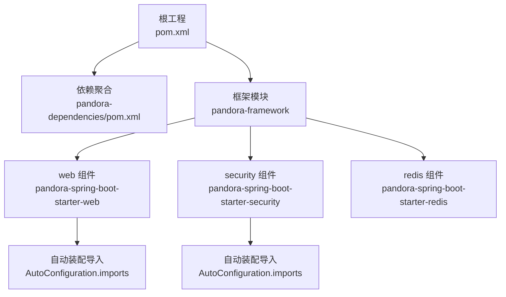
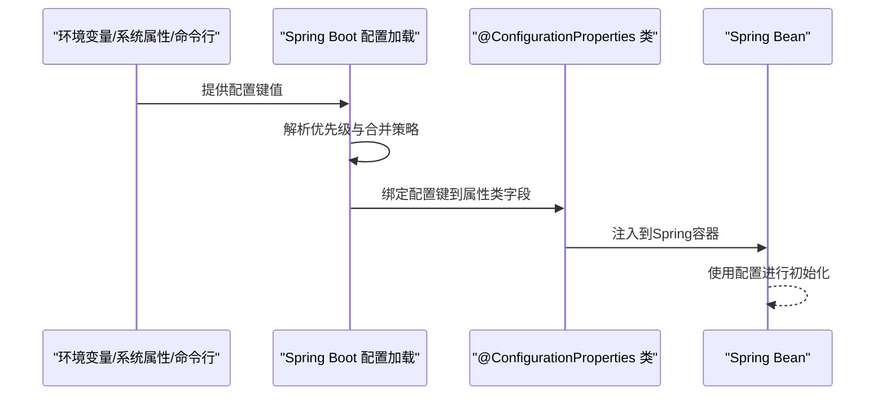
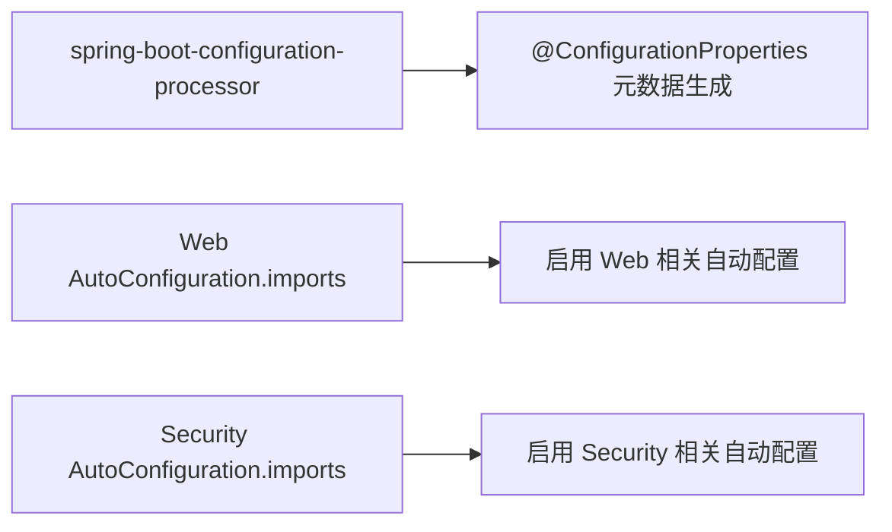

# 环境变量配置

<cite>
**本文引用的文件**
- [README.md](file://README.md)
- [pom.xml](file://pom.xml)
- [pandora-dependencies/pom.xml](file://pandora-dependencies/pom.xml)
- [pandora-framework/pandora-spring-boot-starter-web/src/main/java/net/ittimeline/pandora/framework/web/config/WebProperties.java](file://pandora-framework/pandora-spring-boot-starter-web/src/main/java/net/ittimeline/pandora/framework/web/config/WebProperties.java)
- [pandora-framework/pandora-spring-boot-starter-web/src/main/java/net/ittimeline/pandora/framework/swagger/config/SwaggerProperties.java](file://pandora-framework/pandora-spring-boot-starter-web/src/main/java/net/ittimeline/pandora/framework/swagger/config/SwaggerProperties.java)
- [pandora-framework/pandora-spring-boot-starter-security/src/main/java/net/ittimeline/pandora/framework/security/config/SecurityProperties.java](file://pandora-framework/pandora-spring-boot-starter-security/src/main/java/net/ittimeline/pandora/framework/security/config/SecurityProperties.java)
- [pandora-framework/pandora-spring-boot-starter-web/src/main/java/net/ittimeline/pandora/framework/web/config/PandoraWebAutoConfiguration.java](file://pandora-framework/pandora-spring-boot-starter-web/src/main/java/net/ittimeline/pandora/framework/web/config/PandoraWebAutoConfiguration.java)
- [pandora-framework/pandora-spring-boot-starter-web/src/main/resources/META-INF/spring/org.springframework.boot.autoconfigure.AutoConfiguration.imports](file://pandora-framework/pandora-spring-boot-starter-web/src/main/resources/META-INF/spring/org.springframework.boot.autoconfigure.AutoConfiguration.imports)
- [pandora-framework/pandora-spring-boot-starter-security/src/main/resources/META-INF/spring/org.springframework.boot.autoconfigure.AutoConfiguration.imports](file://pandora-framework/pandora-spring-boot-starter-security/src/main/resources/META-INF/spring/org.springframework.boot.autoconfigure.AutoConfiguration.imports)
- [pandora-framework/pandora-common/src/main/java/net/ittimeline/pandora/framework/common/util/web/spring/SpringUtils.java](file://pandora-framework/pandora-common/src/main/java/net/ittimeline/pandora/framework/common/util/web/spring/SpringUtils.java)
- [pandora-framework/pandora-spring-boot-starter-redis/src/main/java/net/ittimeline/pandora/framework/redis/config/PandoraRedisAutoConfiguration.java](file://pandora-framework/pandora-spring-boot-starter-redis/src/main/java/net/ittimeline/pandora/framework/redis/config/PandoraRedisAutoConfiguration.java)
</cite>

## 目录
1. [简介](#简介)
2. [项目结构](#项目结构)
3. [核心组件](#核心组件)
4. [架构总览](#架构总览)
5. [详细组件分析](#详细组件分析)
6. [依赖分析](#依赖分析)
7. [性能考量](#性能考量)
8. [故障排查指南](#故障排查指南)
9. [结论](#结论)
10. [附录](#附录)

## 简介
本文件面向Pandora Cloud框架的环境变量配置与覆盖机制，系统性阐述以下内容：
- 如何通过环境变量覆盖配置文件中的属性值
- 系统属性、环境变量与命令行参数的优先级规则
- 环境变量命名规范与配置映射关系
- 不同部署环境（Docker容器、Kubernetes集群、传统服务器）下的设置方法
- 敏感信息保护、配置加密与动态配置更新的实现思路
- 最佳实践与安全注意事项

## 项目结构
仓库采用多模块组织，核心与Web、安全、Redis等特性通过Spring Boot Starter自动装配集成。环境变量配置主要通过@ConfigurationProperties绑定到Java对象，结合Spring Boot的配置加载机制生效。

图表来源
- [pom.xml:1-120](file://pom.xml#L1-L120)
- [pandora-dependencies/pom.xml:140-177](file://pandora-dependencies/pom.xml#L140-L177)
- [pandora-spring-boot-starter-web/src/main/resources/META-INF/spring/org.springframework.boot.autoconfigure.AutoConfiguration.imports:1-8](file://pandora-framework/pandora-spring-boot-starter-web/src/main/resources/META-INF/spring/org.springframework.boot.autoconfigure.AutoConfiguration.imports#L1-L8)
- [pandora-spring-boot-starter-security/src/main/resources/META-INF/spring/org.springframework.boot.autoconfigure.AutoConfiguration.imports:1-6](file://pandora-framework/pandora-spring-boot-starter-security/src/main/resources/META-INF/spring/org.springframework.boot.autoconfigure.AutoConfiguration.imports#L1-L6)

章节来源
- [README.md:1-15](file://README.md#L1-L15)
- [pom.xml:1-120](file://pom.xml#L1-L120)
- [pandora-dependencies/pom.xml:140-177](file://pandora-dependencies/pom.xml#L140-L177)

## 核心组件
- Web配置属性：用于统一API前缀、UI地址等，支持通过环境变量覆盖。
- Swagger配置属性：用于文档元数据，支持通过环境变量覆盖。
- 安全配置属性：用于令牌头、参数、Mock开关、免登录URL列表、密码编码复杂度等，支持通过环境变量覆盖。
- 自动装配导入：通过META-INF/spring自动装配机制启用对应功能。

章节来源
- [pandora-framework/pandora-spring-boot-starter-web/src/main/java/net/ittimeline/pandora/framework/web/config/WebProperties.java:1-68](file://pandora-framework/pandora-spring-boot-starter-web/src/main/java/net/ittimeline/pandora/framework/web/config/WebProperties.java#L1-L68)
- [pandora-framework/pandora-spring-boot-starter-web/src/main/java/net/ittimeline/pandora/framework/swagger/config/SwaggerProperties.java:1-60](file://pandora-framework/pandora-spring-boot-starter-web/src/main/java/net/ittimeline/pandora/framework/swagger/config/SwaggerProperties.java#L1-L60)
- [pandora-framework/pandora-spring-boot-starter-security/src/main/java/net/ittimeline/pandora/framework/security/config/SecurityProperties.java:1-58](file://pandora-framework/pandora-spring-boot-starter-security/src/main/java/net/ittimeline/pandora/framework/security/config/SecurityProperties.java#L1-L58)
- [pandora-framework/pandora-spring-boot-starter-web/src/main/resources/META-INF/spring/org.springframework.boot.autoconfigure.AutoConfiguration.imports:1-8](file://pandora-framework/pandora-spring-boot-starter-web/src/main/resources/META-INF/spring/org.springframework.boot.autoconfigure.AutoConfiguration.imports#L1-L8)
- [pandora-framework/pandora-spring-boot-starter-security/src/main/resources/META-INF/spring/org.springframework.boot.autoconfigure.AutoConfiguration.imports:1-6](file://pandora-framework/pandora-spring-boot-starter-security/src/main/resources/META-INF/spring/org.springframework.boot.autoconfigure.AutoConfiguration.imports#L1-L6)

## 架构总览
Spring Boot通过@ConfigurationProperties将配置键映射到属性类字段；自动装配导入文件决定哪些配置类生效；应用启动时由Spring Environment加载配置源（如application.yml、环境变量、命令行参数等），并按优先级合并。

## 详细组件分析

### Web配置属性（WebProperties）
- 功能要点
  - 统一API前缀与控制器包匹配规则，便于网关或反向代理路由。
  - 支持Admin UI地址配置。
- 环境变量映射建议
  - pandora.web.app-api.prefix
  - pandora.web.app-api.controller
  - pandora.web.admin-api.prefix
  - pandora.web.admin-api.controller
  - pandora.web.admin-ui.url
- 优先级规则
  - 命令行参数 > 环境变量 > application.yml > 默认值
- 关键实现参考
  - 属性类定义与注解绑定：[WebProperties.java:18-28](file://pandora-framework/pandora-spring-boot-starter-web/src/main/java/net/ittimeline/pandora/framework/web/config/WebProperties.java#L18-L28)
  - 自动装配启用与Bean注册：[PandoraWebAutoConfiguration.java:46-64](file://pandora-framework/pandora-spring-boot-starter-web/src/main/java/net/ittimeline/pandora/framework/web/config/PandoraWebAutoConfiguration.java#L46-L64)

章节来源
- [pandora-framework/pandora-spring-boot-starter-web/src/main/java/net/ittimeline/pandora/framework/web/config/WebProperties.java:1-68](file://pandora-framework/pandora-spring-boot-starter-web/src/main/java/net/ittimeline/pandora/framework/web/config/WebProperties.java#L1-L68)
- [pandora-framework/pandora-spring-boot-starter-web/src/main/java/net/ittimeline/pandora/framework/web/config/PandoraWebAutoConfiguration.java:46-64](file://pandora-framework/pandora-spring-boot-starter-web/src/main/java/net/ittimeline/pandora/framework/web/config/PandoraWebAutoConfiguration.java#L46-L64)

### Swagger配置属性（SwaggerProperties）
- 功能要点
  - 文档标题、描述、作者、版本、许可证、邮箱等元数据。
- 环境变量映射建议
  - pandora.swagger.title
  - pandora.swagger.description
  - pandora.swagger.author
  - pandora.swagger.version
  - pandora.swagger.url
  - pandora.swagger.email
  - pandora.swagger.license
  - pandora.swagger.license-url
- 优先级规则
  - 命令行参数 > 环境变量 > application.yml > 默认值
- 关键实现参考
  - 属性类定义与注解绑定：[SwaggerProperties.java:14-59](file://pandora-framework/pandora-spring-boot-starter-web/src/main/java/net/ittimeline/pandora/framework/swagger/config/SwaggerProperties.java#L14-L59)

章节来源
- [pandora-framework/pandora-spring-boot-starter-web/src/main/java/net/ittimeline/pandora/framework/swagger/config/SwaggerProperties.java:1-60](file://pandora-framework/pandora-spring-boot-starter-web/src/main/java/net/ittimeline/pandora/framework/swagger/config/SwaggerProperties.java#L1-L60)

### 安全配置属性（SecurityProperties）
- 功能要点
  - 令牌请求头与参数、Mock开关与密钥、免登录URL列表、密码编码复杂度。
- 环境变量映射建议
  - pandora.security.token-header
  - pandora.security.token-parameter
  - pandora.security.mock-enable
  - pandora.security.mock-secret
  - pandora.security.permit-all-urls
  - pandora.security.password-encoder-length
- 优先级规则
  - 命令行参数 > 环境变量 > application.yml > 默认值
- 关键实现参考
  - 属性类定义与注解绑定：[SecurityProperties.java:19-57](file://pandora-framework/pandora-spring-boot-starter-security/src/main/java/net/ittimeline/pandora/framework/security/config/SecurityProperties.java#L19-L57)

章节来源
- [pandora-framework/pandora-spring-boot-starter-security/src/main/java/net/ittimeline/pandora/framework/security/config/SecurityProperties.java:1-58](file://pandora-framework/pandora-spring-boot-starter-security/src/main/java/net/ittimeline/pandora/framework/security/config/SecurityProperties.java#L1-L58)

### 自动装配与配置映射
- Web自动装配导入
  - 启用Banner、Jackson、Web、API日志、Swagger、XSS、加密等自动配置。
- Security自动装配导入
  - 启用安全、RPC、操作日志等自动配置。
- 关键实现参考
  - Web自动装配导入：[AutoConfiguration.imports:1-8](file://pandora-framework/pandora-spring-boot-starter-web/src/main/resources/META-INF/spring/org.springframework.boot.autoconfigure.AutoConfiguration.imports#L1-L8)
  - Security自动装配导入：[AutoConfiguration.imports:1-6](file://pandora-framework/pandora-spring-boot-starter-security/src/main/resources/META-INF/spring/org.springframework.boot.autoconfigure.AutoConfiguration.imports#L1-L6)

章节来源
- [pandora-framework/pandora-spring-boot-starter-web/src/main/resources/META-INF/spring/org.springframework.boot.autoconfigure.AutoConfiguration.imports:1-8](file://pandora-framework/pandora-spring-boot-starter-web/src/main/resources/META-INF/spring/org.springframework.boot.autoconfigure.AutoConfiguration.imports#L1-L8)
- [pandora-framework/pandora-spring-boot-starter-security/src/main/resources/META-INF/spring/org.springframework.boot.autoconfigure.AutoConfiguration.imports:1-6](file://pandora-framework/pandora-spring-boot-starter-security/src/main/resources/META-INF/spring/org.springframework.boot.autoconfigure.AutoConfiguration.imports#L1-L6)

### 配置加载优先级与覆盖规则
- Spring Boot标准优先级（从高到低）
  - 命令行参数
  - 系统属性（JVM -D参数）
  - 操作系统环境变量
  - application-{profile}.yml
  - application.yml
  - @DefaultValue 或字段默认值
- 环境变量命名规范
  - 使用点分隔的层级键（如 pandora.web.app-api.prefix）
  - 建议统一以框架前缀（如 pandora.）开头，便于识别与隔离
- 覆盖示例（示意）
  - 命令行：--pandora.web.app-api.prefix=/api
  - 系统属性：-Dpandora.web.app-api.prefix=/api
  - 环境变量：export PANDORA_WEB_APP_API_PREFIX=/api
- 关键实现参考
  - Web属性绑定与Bean注册：[PandoraWebAutoConfiguration.java:46-64](file://pandora-framework/pandora-spring-boot-starter-web/src/main/java/net/ittimeline/pandora/framework/web/config/PandoraWebAutoConfiguration.java#L46-L64)
  - 配置处理器依赖（生成元数据）：[pandora-dependencies/pom.xml:172-177](file://pandora-dependencies/pom.xml#L172-L177)

章节来源
- [pandora-framework/pandora-spring-boot-starter-web/src/main/java/net/ittimeline/pandora/framework/web/config/PandoraWebAutoConfiguration.java:46-64](file://pandora-framework/pandora-spring-boot-starter-web/src/main/java/net/ittimeline/pandora/framework/web/config/PandoraWebAutoConfiguration.java#L46-L64)
- [pandora-dependencies/pom.xml:172-177](file://pandora-dependencies/pom.xml#L172-L177)

### 部署环境下的环境变量设置方法
- Docker容器
  - 使用 docker run -e 或 docker-compose environment 字段设置环境变量
  - 建议在镜像构建阶段固定非敏感默认值，在运行时通过环境变量覆盖
- Kubernetes集群
  - 使用 ConfigMap/Secret 管理配置与敏感信息，通过 env 或 envFrom 注入
  - 将敏感信息放入 Secret，非敏感信息放入 ConfigMap
- 传统服务器
  - 在系统服务脚本或 systemd unit 中设置环境变量
  - 或在启动脚本中导出后再启动应用进程

[本节为通用实践说明，不直接分析具体文件，故无“章节来源”]

### 敏感信息保护、配置加密与动态配置更新
- 敏感信息保护
  - 将数据库密码、令牌密钥、加密密钥等放入Secret管理，避免硬编码
  - 使用只读权限的Secret挂载，最小权限原则
- 配置加密
  - Spring Vault/Cloud Config等可选方案，结合加密存储与传输
  - 对于本地开发，可通过JCE Unlimited Strength Jurisdiction Policy替换实现更强加密
- 动态配置更新
  - Spring Boot Actuator + Spring Cloud Bus可实现刷新配置（需引入相应依赖与配置）
  - 通过HTTP端点触发刷新，避免重启

[本节为通用实践说明，不直接分析具体文件，故无“章节来源”]

## 依赖分析
- 配置处理器依赖
  - 生成@ConfigurationProperties元数据，提升IDE体验与类型安全
- 自动装配导入
  - 通过META-INF/spring自动装配机制启用对应功能模块

图表来源
- [pandora-dependencies/pom.xml:172-177](file://pandora-dependencies/pom.xml#L172-L177)
- [pandora-spring-boot-starter-web/src/main/resources/META-INF/spring/org.springframework.boot.autoconfigure.AutoConfiguration.imports:1-8](file://pandora-framework/pandora-spring-boot-starter-web/src/main/resources/META-INF/spring/org.springframework.boot.autoconfigure.AutoConfiguration.imports#L1-L8)
- [pandora-spring-boot-starter-security/src/main/resources/META-INF/spring/org.springframework.boot.autoconfigure.AutoConfiguration.imports:1-6](file://pandora-framework/pandora-spring-boot-starter-security/src/main/resources/META-INF/spring/org.springframework.boot.autoconfigure.AutoConfiguration.imports#L1-L6)

章节来源
- [pandora-dependencies/pom.xml:172-177](file://pandora-dependencies/pom.xml#L172-L177)
- [pandora-spring-boot-starter-web/src/main/resources/META-INF/spring/org.springframework.boot.autoconfigure.AutoConfiguration.imports:1-8](file://pandora-framework/pandora-spring-boot-starter-web/src/main/resources/META-INF/spring/org.springframework.boot.autoconfigure.AutoConfiguration.imports#L1-L8)
- [pandora-spring-boot-starter-security/src/main/resources/META-INF/spring/org.springframework.boot.autoconfigure.AutoConfiguration.imports:1-6](file://pandora-framework/pandora-spring-boot-starter-security/src/main/resources/META-INF/spring/org.springframework.boot.autoconfigure.AutoConfiguration.imports#L1-L6)

## 性能考量
- 配置加载性能
  - 合理拆分配置文件，避免单个YAML层级过深
  - 减少不必要的自动装配，按需启用模块
- 运行时性能
  - 避免在热路径频繁读取大量配置键
  - 对热点配置进行缓存或懒加载

[本节提供一般性指导，不直接分析具体文件，故无“章节来源”]

## 故障排查指南
- 常见问题
  - 配置未生效：检查是否正确设置环境变量名（点分层级）、是否处于正确的激活Profile
  - 类型不匹配：确保环境变量值与目标字段类型一致（布尔、整数、列表等）
  - 覆盖无效：确认命令行参数优先级高于环境变量，避免误设
- 排查步骤
  - 打印当前Environment或使用Actuator endpoints查看已生效配置
  - 检查自动装配导入文件是否包含所需模块
  - 校验属性类上的@ConfigurationProperties注解与前缀是否正确

[本节提供一般性指导，不直接分析具体文件，故无“章节来源”]

## 结论
Pandora Cloud框架通过@ConfigurationProperties与自动装配机制，实现了对环境变量的灵活覆盖与统一管理。遵循统一的命名规范与优先级规则，可在Docker、Kubernetes与传统服务器等多环境中稳定地完成配置注入。配合敏感信息保护、配置加密与动态刷新机制，可进一步提升系统的安全性与可运维性。

[本节为总结性内容，不直接分析具体文件，故无“章节来源”]

## 附录

### 环境变量命名规范与映射清单
- Web配置
  - pandora.web.app-api.prefix
  - pandora.web.app-api.controller
  - pandora.web.admin-api.prefix
  - pandora.web.admin-api.controller
  - pandora.web.admin-ui.url
- Swagger配置
  - pandora.swagger.title
  - pandora.swagger.description
  - pandora.swagger.author
  - pandora.swagger.version
  - pandora.swagger.url
  - pandora.swagger.email
  - pandora.swagger.license
  - pandora.swagger.license-url
- 安全配置
  - pandora.security.token-header
  - pandora.security.token-parameter
  - pandora.security.mock-enable
  - pandora.security.mock-secret
  - pandora.security.permit-all-urls
  - pandora.security.password-encoder-length

章节来源
- [pandora-framework/pandora-spring-boot-starter-web/src/main/java/net/ittimeline/pandora/framework/web/config/WebProperties.java:18-68](file://pandora-framework/pandora-spring-boot-starter-web/src/main/java/net/ittimeline/pandora/framework/web/config/WebProperties.java#L18-L68)
- [pandora-framework/pandora-spring-boot-starter-web/src/main/java/net/ittimeline/pandora/framework/swagger/config/SwaggerProperties.java:14-59](file://pandora-framework/pandora-spring-boot-starter-web/src/main/java/net/ittimeline/pandora/framework/swagger/config/SwaggerProperties.java#L14-L59)
- [pandora-framework/pandora-spring-boot-starter-security/src/main/java/net/ittimeline/pandora/framework/security/config/SecurityProperties.java:19-57](file://pandora-framework/pandora-spring-boot-starter-security/src/main/java/net/ittimeline/pandora/framework/security/config/SecurityProperties.java#L19-L57)

### 部署环境设置要点
- Docker
  - 使用 -e 或 compose environment 注入环境变量
- Kubernetes
  - 使用 Secret/ConfigMap，env/envFrom 注入
- 传统服务器
  - 在启动脚本中导出环境变量后启动应用

[本节为通用实践说明，不直接分析具体文件，故无“章节来源”]

### 最佳实践与安全考虑
- 最佳实践
  - 使用框架前缀统一命名，避免与系统或第三方键冲突
  - 将敏感信息放入Secret，非敏感信息放入ConfigMap
  - 分环境分文件管理配置，按需启用Profile
- 安全考虑
  - 严格控制Secret访问权限
  - 定期轮换密钥与令牌
  - 限制配置暴露面，避免将内部配置暴露给客户端

[本节为通用实践说明，不直接分析具体文件，故无“章节来源”]