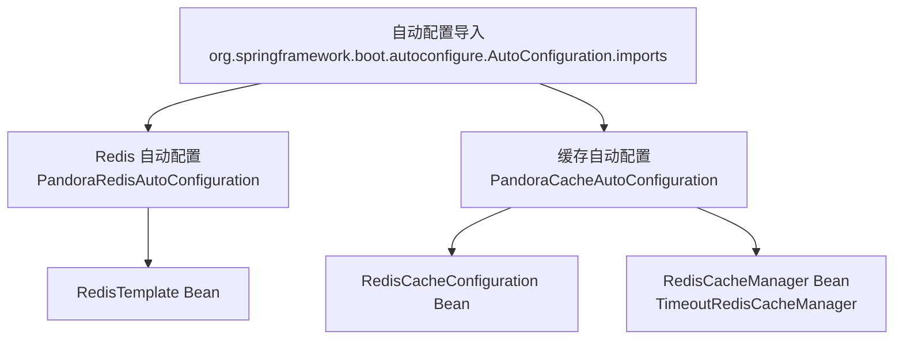
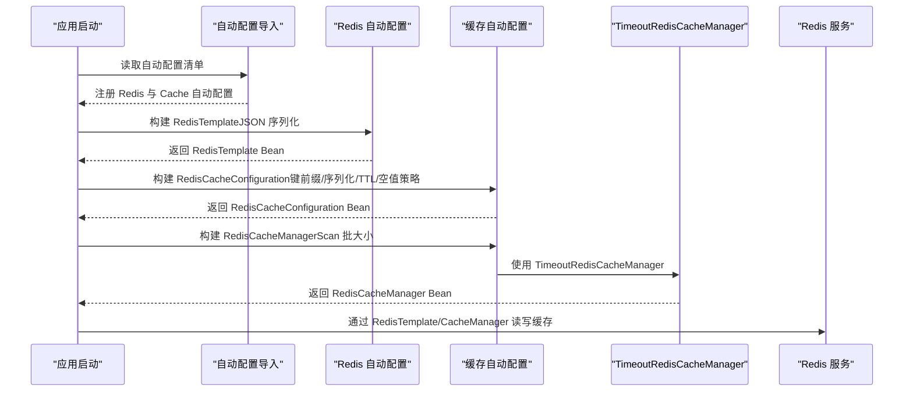
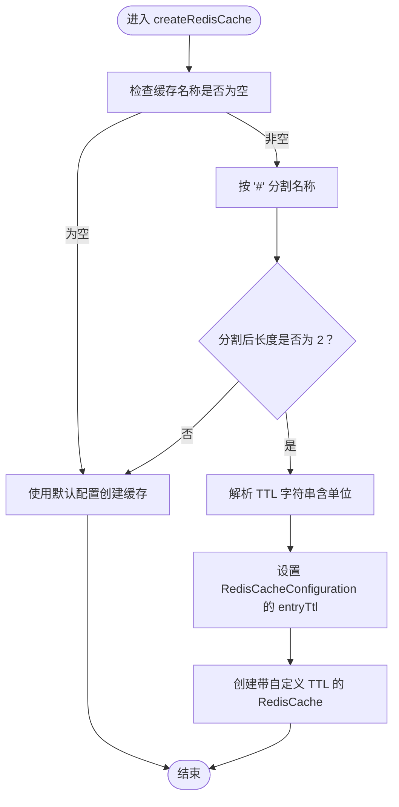
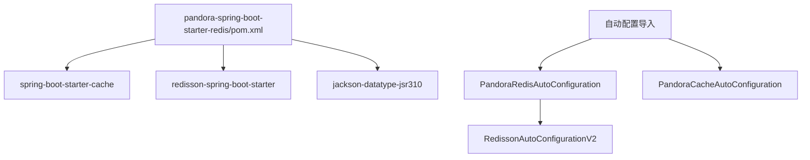

# 缓存配置属性

<cite>
**本文引用的文件**
- [PandoraCacheProperties.java](file://pandora-framework/pandora-spring-boot-starter-redis/src/main/java/net/ittimeline/pandora/framework/redis/config/PandoraCacheProperties.java)
- [PandoraCacheAutoConfiguration.java](file://pandora-framework/pandora-spring-boot-starter-redis/src/main/java/net/ittimeline/pandora/framework/redis/config/PandoraCacheAutoConfiguration.java)
- [PandoraRedisAutoConfiguration.java](file://pandora-framework/pandora-spring-boot-starter-redis/src/main/java/net/ittimeline/pandora/framework/redis/config/PandoraRedisAutoConfiguration.java)
- [TimeoutRedisCacheManager.java](file://pandora-framework/pandora-spring-boot-starter-redis/src/main/java/net/ittimeline/pandora/framework/redis/core/TimeoutRedisCacheManager.java)
- [org.springframework.boot.autoconfigure.AutoConfiguration.imports](file://pandora-framework/pandora-spring-boot-starter-redis/src/main/resources/META-INF/spring/org.springframework.boot.autoconfigure.AutoConfiguration.imports)
- [pandora-spring-boot-starter-redis/pom.xml](file://pandora-framework/pandora-spring-boot-starter-redis/pom.xml)
- [CacheUtils.java](file://pandora-framework/pandora-common/src/main/java/net/ittimeline/pandora/framework/common/util/web/cache/CacheUtils.java)
</cite>

## 目录
1. [简介](#简介)
2. [项目结构](#项目结构)
3. [核心组件](#核心组件)
4. [架构总览](#架构总览)
5. [详细组件分析](#详细组件分析)
6. [依赖分析](#依赖分析)
7. [性能考虑](#性能考虑)
8. [故障排除指南](#故障排除指南)
9. [结论](#结论)
10. [附录](#附录)

## 简介
本文件聚焦于 Pandora Cloud 框架中基于 Redis 的缓存配置属性与自动配置机制，围绕以下主题展开：
- PandoraCacheProperties 类中的缓存配置项说明
- 缓存自动配置的工作流程与关键参数
- Redis 连接与序列化配置
- 缓存过期策略与自定义 TTL 的实现方式
- 分布式锁（Redisson）集成与注意事项
- 不同部署环境下的配置策略与监控建议
- 性能优化与故障排除最佳实践

## 项目结构
与缓存配置直接相关的模块与文件如下：
- 自动配置导入清单：声明了 Redis 与 Cache 的自动配置类
- Redis 自动配置：负责构建 RedisTemplate 与 JSON 序列化
- 缓存自动配置：负责构建 RedisCacheConfiguration 与 RedisCacheManager，并支持自定义扫描批大小
- 自定义缓存管理器：支持在缓存名称中携带自定义过期时间的语法糖

图表来源
- [org.springframework.boot.autoconfigure.AutoConfiguration.imports:1-2](file://pandora-framework/pandora-spring-boot-starter-redis/src/main/resources/META-INF/spring/org.springframework.boot.autoconfigure.AutoConfiguration.imports#L1-L2)
- [PandoraRedisAutoConfiguration.java:19-38](file://pandora-framework/pandora-spring-boot-starter-redis/src/main/java/net/ittimeline/pandora/framework/redis/config/PandoraRedisAutoConfiguration.java#L19-L38)
- [PandoraCacheAutoConfiguration.java:31-83](file://pandora-framework/pandora-spring-boot-starter-redis/src/main/java/net/ittimeline/pandora/framework/redis/config/PandoraCacheAutoConfiguration.java#L31-L83)

章节来源
- [org.springframework.boot.autoconfigure.AutoConfiguration.imports:1-2](file://pandora-framework/pandora-spring-boot-starter-redis/src/main/resources/META-INF/spring/org.springframework.boot.autoconfigure.AutoConfiguration.imports#L1-L2)
- [pandora-spring-boot-starter-redis/pom.xml:19-39](file://pandora-framework/pandora-spring-boot-starter-redis/pom.xml#L19-L39)

## 核心组件
- PandoraCacheProperties：提供缓存相关配置项，默认包含 Redis Scan 批量大小参数。
- PandoraCacheAutoConfiguration：基于 Spring Boot Cache 自动配置，构建 RedisCacheConfiguration 与 RedisCacheManager，支持自定义键前缀、JSON 序列化、空值缓存开关、键前缀开关等。
- PandoraRedisAutoConfiguration：构建 RedisTemplate，统一使用 JSON 序列化（含 JavaTimeModule），并确保在 Redisson 自动配置之前注册，避免被覆盖。
- TimeoutRedisCacheManager：扩展 RedisCacheManager，支持在缓存名称中通过特定语法指定自定义过期时间。

章节来源
- [PandoraCacheProperties.java:14-26](file://pandora-framework/pandora-spring-boot-starter-redis/src/main/java/net/ittimeline/pandora/framework/redis/config/PandoraCacheProperties.java#L14-L26)
- [PandoraCacheAutoConfiguration.java:31-83](file://pandora-framework/pandora-spring-boot-starter-redis/src/main/java/net/ittimeline/pandora/framework/redis/config/PandoraCacheAutoConfiguration.java#L31-L83)
- [PandoraRedisAutoConfiguration.java:19-46](file://pandora-framework/pandora-spring-boot-starter-redis/src/main/java/net/ittimeline/pandora/framework/redis/config/PandoraRedisAutoConfiguration.java#L19-L46)
- [TimeoutRedisCacheManager.java:19-50](file://pandora-framework/pandora-spring-boot-starter-redis/src/main/java/net/ittimeline/pandora/framework/redis/core/TimeoutRedisCacheManager.java#L19-L50)

## 架构总览
下图展示了从应用启动到缓存生效的关键流程：自动配置导入、RedisTemplate 注册、缓存配置构建、缓存管理器创建与自定义 TTL 生效。

图表来源
- [org.springframework.boot.autoconfigure.AutoConfiguration.imports:1-2](file://pandora-framework/pandora-spring-boot-starter-redis/src/main/resources/META-INF/spring/org.springframework.boot.autoconfigure.AutoConfiguration.imports#L1-L2)
- [PandoraRedisAutoConfiguration.java:25-38](file://pandora-framework/pandora-spring-boot-starter-redis/src/main/java/net/ittimeline/pandora/framework/redis/config/PandoraRedisAutoConfiguration.java#L25-L38)
- [PandoraCacheAutoConfiguration.java:40-83](file://pandora-framework/pandora-spring-boot-starter-redis/src/main/java/net/ittimeline/pandora/framework/redis/config/PandoraCacheAutoConfiguration.java#L40-L83)
- [TimeoutRedisCacheManager.java:23-50](file://pandora-framework/pandora-spring-boot-starter-redis/src/main/java/net/ittimeline/pandora/framework/redis/core/TimeoutRedisCacheManager.java#L23-L50)

## 详细组件分析

### PandoraCacheProperties：缓存配置属性
- 命名空间：pandora.cache
- 当前可用配置项：
  - redisScanBatchSize：Redis Scan 批量大小，默认值与默认行为见源码注释与默认常量定义
- 设计意图：为缓存管理器的批量扫描提供可调参数，平衡内存占用与扫描效率

章节来源
- [PandoraCacheProperties.java:14-26](file://pandora-framework/pandora-spring-boot-starter-redis/src/main/java/net/ittimeline/pandora/framework/redis/config/PandoraCacheProperties.java#L14-L26)

### PandoraCacheAutoConfiguration：缓存自动配置机制
- 关键职责：
  - 构建 RedisCacheConfiguration：设置键前缀策略、JSON 序列化、TTL、空值缓存、键前缀开关等
  - 构建 RedisCacheManager：使用非阻塞写入与 Scan 批策略；注入 TimeoutRedisCacheManager 以支持自定义 TTL
- 键前缀规则：优先使用 CacheProperties.Redis 的 keyPrefix，若未以冒号结尾则自动补全，最终格式为 “keyPrefix:cacheName:”
- 序列化策略：值采用 JSON 序列化（由 RedisTemplate 统一配置）
- TTL 与空值策略：遵循 Spring Boot CacheProperties.Redis 的对应配置
- 扫描批大小：来自 PandoraCacheProperties.redisScanBatchSize，默认值参见源码默认常量

章节来源
- [PandoraCacheAutoConfiguration.java:31-83](file://pandora-framework/pandora-spring-boot-starter-redis/src/main/java/net/ittimeline/pandora/framework/redis/config/PandoraCacheAutoConfiguration.java#L31-L83)

### PandoraRedisAutoConfiguration：Redis 连接与序列化配置
- RedisTemplate 统一配置：
  - Key/HashKey：String 序列化
  - Value/HashValue：JSON 序列化（Jackson，含 JavaTimeModule）
- 与 Redisson 的顺序控制：在 Redisson 自动配置之前注册，避免被覆盖
- JSON 序列化增强：显式注册 JavaTimeModule，解决 LocalDateTime 等 JSR-310 类型序列化问题

章节来源
- [PandoraRedisAutoConfiguration.java:19-46](file://pandora-framework/pandora-spring-boot-starter-redis/src/main/java/net/ittimeline/pandora/framework/redis/config/PandoraRedisAutoConfiguration.java#L19-L46)

### TimeoutRedisCacheManager：自定义过期时间实现
- 语法约定：缓存名称中使用“#”分隔，格式为“名称#TTL单位”，例如“userCache#10m”
- TTL 解析规则：
  - 支持 d（天）、h（小时）、m（分钟）、s（秒）后缀；默认为秒
  - 仅当名称包含且仅包含两段（name#ttl）时才启用自定义 TTL
- 实现机制：在创建 RedisCache 时动态修改 RedisCacheConfiguration 的 entryTtl，从而实现按缓存粒度的差异化过期

图表来源
- [TimeoutRedisCacheManager.java:27-50](file://pandora-framework/pandora-spring-boot-starter-redis/src/main/java/net/ittimeline/pandora/framework/redis/core/TimeoutRedisCacheManager.java#L27-L50)

章节来源
- [TimeoutRedisCacheManager.java:19-85](file://pandora-framework/pandora-spring-boot-starter-redis/src/main/java/net/ittimeline/pandora/framework/redis/core/TimeoutRedisCacheManager.java#L19-L85)

### 分布式锁配置（Redisson）
- 依赖引入：starter-redis 模块已引入 redisson-spring-boot-starter
- 自动配置顺序：PandoraRedisAutoConfiguration 在 Redisson 自动配置之前注册，确保自定义 RedisTemplate 生效
- 使用建议：
  - 在需要分布式锁的场景引入 Redisson 官方能力
  - 保持与自定义 RedisTemplate 的一致性，避免序列化差异导致的异常

章节来源
- [pandora-spring-boot-starter-redis/pom.xml:27-29](file://pandora-framework/pandora-spring-boot-starter-redis/pom.xml#L27-L29)
- [PandoraRedisAutoConfiguration.java:19-19](file://pandora-framework/pandora-spring-boot-starter-redis/src/main/java/net/ittimeline/pandora/framework/redis/config/PandoraRedisAutoConfiguration.java#L19-L19)

### 本地缓存工具（Guava Cache）
- 适用场景：对少量全局或系统级数据进行本地缓存，降低对远端缓存的压力
- 特性：支持最大容量、写后刷新、异步刷新等
- 注意事项：与线程上下文相关时需自行处理 ThreadLocal 传递

章节来源
- [CacheUtils.java:16-60](file://pandora-framework/pandora-common/src/main/java/net/ittimeline/pandora/framework/common/util/web/cache/CacheUtils.java#L16-L60)

## 依赖分析
- 模块依赖：
  - pandora-spring-boot-starter-redis 依赖 spring-boot-starter-cache、redisson-spring-boot-starter、Jackson JSR-310 扩展
- 自动配置顺序：
  - 先注册 Redis 自动配置，再注册 Cache 自动配置，最后注册 Redisson 自动配置（通过 before 排序）

图表来源
- [pandora-spring-boot-starter-redis/pom.xml:19-39](file://pandora-framework/pandora-spring-boot-starter-redis/pom.xml#L19-L39)
- [org.springframework.boot.autoconfigure.AutoConfiguration.imports:1-2](file://pandora-framework/pandora-spring-boot-starter-redis/src/main/resources/META-INF/spring/org.springframework.boot.autoconfigure.AutoConfiguration.imports#L1-L2)
- [PandoraRedisAutoConfiguration.java:19-19](file://pandora-framework/pandora-spring-boot-starter-redis/src/main/java/net/ittimeline/pandora/framework/redis/config/PandoraRedisAutoConfiguration.java#L19-L19)

章节来源
- [pandora-spring-boot-starter-redis/pom.xml:19-39](file://pandora-framework/pandora-spring-boot-starter-redis/pom.xml#L19-L39)
- [org.springframework.boot.autoconfigure.AutoConfiguration.imports:1-2](file://pandora-framework/pandora-spring-boot-starter-redis/src/main/resources/META-INF/spring/org.springframework.boot.autoconfigure.AutoConfiguration.imports#L1-L2)

## 性能考虑
- 序列化开销：JSON 序列化相较 Kryo/Lettuce 编解码更通用但有一定 CPU 开销；建议对热点对象进行压缩或字段裁剪
- 键前缀与命名：合理设置 keyPrefix，避免键冲突与跨业务污染；统一命名规范
- TTL 策略：结合业务访问模式设定 TTL；对冷数据使用较长 TTL，热数据使用较短 TTL 并配合异步刷新
- 批量扫描：调整 redisScanBatchSize 以平衡内存与网络；在高并发场景适当增大批次
- 非阻塞写入：使用非锁定写入减少阻塞，提升吞吐
- 本地缓存：对高频只读数据使用本地缓存（Guava Cache）降低远端压力

## 故障排除指南
- 键前缀异常（出现多余冒号）：确认 keyPrefix 是否以冒号结尾，自动配置会自动补全
- 序列化失败：检查对象是否包含不可序列化字段；确保 Jackson 已注册 JavaTimeModule
- 自定义 TTL 无效：确认缓存名称格式为“名称#TTL单位”，且 TTL 单位正确（d/h/m/s）
- 分布式锁失效：确认 Redisson 自动配置顺序正确，且与自定义 RedisTemplate 一致
- 扫描性能问题：适当提高 redisScanBatchSize，或在业务侧避免一次性扫描大量键

## 结论
Pandora Cloud 的缓存配置以 Spring Boot Cache 自动配置为基础，结合 RedisTemplate 的统一 JSON 序列化与 TimeoutRedisCacheManager 的自定义 TTL 能力，提供了灵活、易用且高性能的缓存方案。通过合理的 TTL 策略、键前缀与扫描批大小配置，可在不同部署环境下获得稳定表现。同时，Redisson 的集成与本地缓存工具为分布式锁与本地热点数据缓存提供了补充能力。

## 附录

### 配置参数一览表
- 命名空间：pandora.cache
  - redisScanBatchSize：Redis Scan 批量大小（默认值参见源码默认常量）
- 命名空间：spring.redis（间接影响）
  - keyPrefix：键前缀（自动配置会自动补全冒号）
- 命名空间：spring.cache.redis
  - time-to-live：默认 TTL
  - cache-null-values：是否缓存空值
  - use-key-prefix：是否启用键前缀

章节来源
- [PandoraCacheProperties.java:14-26](file://pandora-framework/pandora-spring-boot-starter-redis/src/main/java/net/ittimeline/pandora/framework/redis/config/PandoraCacheProperties.java#L14-L26)
- [PandoraCacheAutoConfiguration.java:40-71](file://pandora-framework/pandora-spring-boot-starter-redis/src/main/java/net/ittimeline/pandora/framework/redis/config/PandoraCacheAutoConfiguration.java#L40-L71)

### 自定义 TTL 使用示例（说明性）
- 示例格式：在缓存名称中加入“#TTL单位”，如“userCache#10m”
- 规则：仅当名称为两段（name#ttl）时生效；TTL 支持 d/h/m/s 后缀

章节来源
- [TimeoutRedisCacheManager.java:27-50](file://pandora-framework/pandora-spring-boot-starter-redis/src/main/java/net/ittimeline/pandora/framework/redis/core/TimeoutRedisCacheManager.java#L27-L50)

### 不同部署环境下的配置策略建议
- 开发环境
  - TTL 较短，便于快速验证；开启日志观察键前缀与序列化行为
- 测试/预发布环境
  - 与生产接近的 TTL 与 redisScanBatchSize；开启慢查询与键空间监控
- 生产环境
  - 基于压测结果确定 redisScanBatchSize；对关键路径启用非阻塞写入
  - 使用自定义 TTL 精细化控制热点数据生命周期
  - 通过 Redisson 获取分布式锁，确保幂等与一致性

### 监控配置建议
- Redis 监控：关注命令耗时、内存使用、键空间大小、过期键删除率
- 应用侧指标：缓存命中率、TTL 命中分布、序列化耗时、批量扫描耗时
- 日志：记录键前缀生成、自定义 TTL 解析、异常重试与降级策略