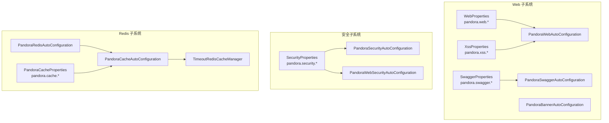
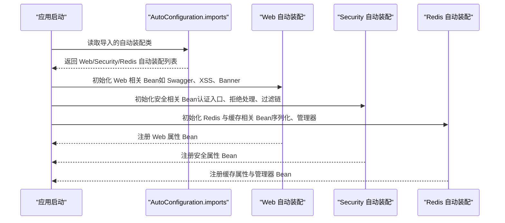
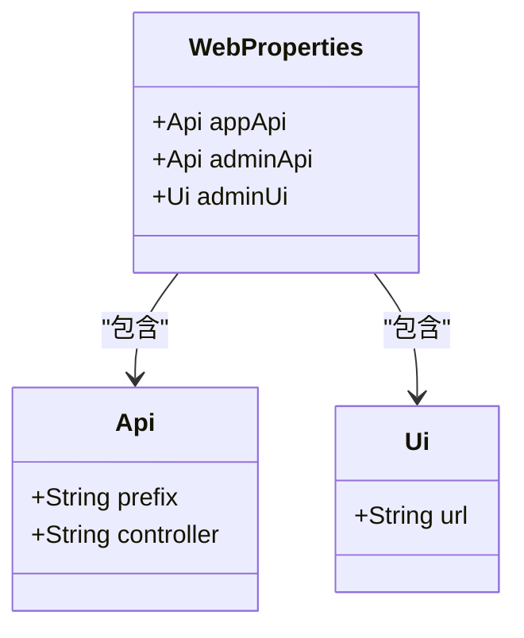
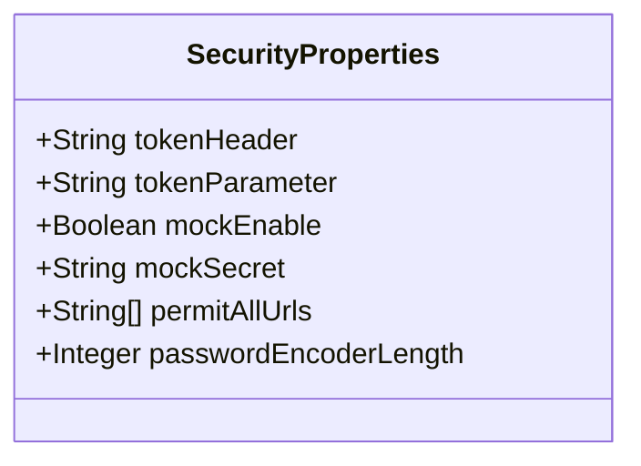
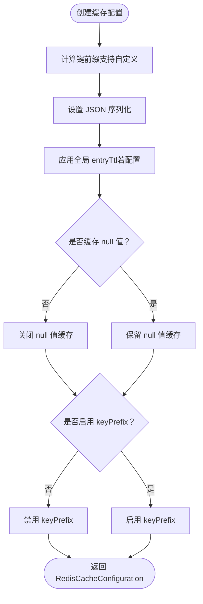
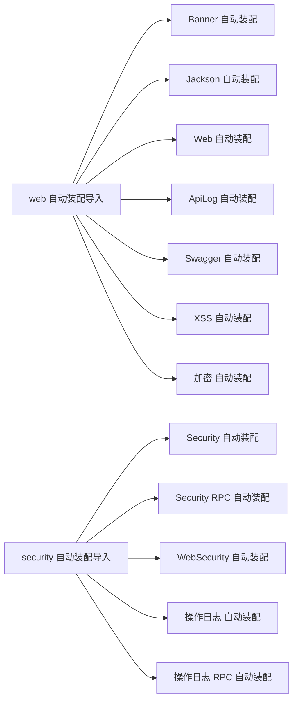

# 配置管理

<cite>
**本文引用的文件**
- [WebProperties.java](file://pandora-framework/pandora-spring-boot-starter-web/src/main/java/net/ittimeline/pandora/framework/web/config/WebProperties.java)
- [SwaggerProperties.java](file://pandora-framework/pandora-spring-boot-starter-web/src/main/java/net/ittimeline/pandora/framework/swagger/config/SwaggerProperties.java)
- [XssProperties.java](file://pandora-framework/pandora-spring-boot-starter-web/src/main/java/net/ittimeline/pandora/framework/xss/config/XssProperties.java)
- [PandoraWebAutoConfiguration.java](file://pandora-framework/pandora-spring-boot-starter-web/src/main/java/net/ittimeline/pandora/framework/web/config/PandoraWebAutoConfiguration.java)
- [PandoraSwaggerAutoConfiguration.java](file://pandora-framework/pandora-spring-boot-starter-web/src/main/java/net/ittimeline/pandora/framework/swagger/config/PandoraSwaggerAutoConfiguration.java)
- [PandoraBannerAutoConfiguration.java](file://pandora-framework/pandora-spring-boot-starter-web/src/main/java/net/ittimeline/pandora/framework/banner/config/PandoraBannerAutoConfiguration.java)
- [SpringUtils.java](file://pandora-framework/pandora-common/src/main/java/net/ittimeline/pandora/framework/common/util/web/spring/SpringUtils.java)
- [SecurityProperties.java](file://pandora-framework/pandora-spring-boot-starter-security/src/main/java/net/ittimeline/pandora/framework/security/config/SecurityProperties.java)
- [PandoraSecurityAutoConfiguration.java](file://pandora-framework/pandora-spring-boot-starter-security/src/main/java/net/ittimeline/pandora/framework/security/config/PandoraSecurityAutoConfiguration.java)
- [PandoraWebSecurityAutoConfiguration.java](file://pandora-framework/pandora-spring-boot-starter-security/src/main/java/net/ittimeline/pandora/framework/security/config/PandoraWebSecurityAutoConfiguration.java)
- [PandoraRedisAutoConfiguration.java](file://pandora-framework/pandora-spring-boot-starter-redis/src/main/java/net/ittimeline/pandora/framework/redis/config/PandoraRedisAutoConfiguration.java)
- [PandoraCacheAutoConfiguration.java](file://pandora-framework/pandora-spring-boot-starter-redis/src/main/java/net/ittimeline/pandora/framework/redis/config/PandoraCacheAutoConfiguration.java)
- [PandoraCacheProperties.java](file://pandora-framework/pandora-spring-boot-starter-redis/src/main/java/net/ittimeline/pandora/framework/redis/config/PandoraCacheProperties.java)
- [TimeoutRedisCacheManager.java](file://pandora-framework/pandora-spring-boot-starter-redis/src/main/java/net/ittimeline/pandora/framework/redis/core/TimeoutRedisCacheManager.java)
- [org.springframework.boot.autoconfigure.AutoConfiguration.imports（web）](file://pandora-framework/pandora-spring-boot-starter-web/src/main/resources/META-INF/spring/org.springframework.boot.autoconfigure.AutoConfiguration.imports)
- [org.springframework.boot.autoconfigure.AutoConfiguration.imports（security）](file://pandora-framework/pandora-spring-boot-starter-security/src/main/resources/META-INF/spring/org.springframework.boot.autoconfigure.AutoConfiguration.imports)
- [pandora-dependencies/pom.xml](file://pandora-dependencies/pom.xml)
- [pom.xml](file://pandora-dependencies/pom.xml)
</cite>

## 目录
1. [简介](#简介)
2. [项目结构](#项目结构)
3. [核心组件](#核心组件)
4. [架构总览](#架构总览)
5. [详细组件分析](#详细组件分析)
6. [依赖关系分析](#依赖关系分析)
7. [性能考量](#性能考量)
8. [故障排除指南](#故障排除指南)
9. [结论](#结论)
10. [附录](#附录)

## 简介
本文件系统性阐述 Pandora Cloud 框架的配置管理体系，覆盖 Web、安全、Redis 缓存等子系统的配置项、自动装配机制、配置优先级与继承关系、动态更新策略、验证与校验、环境隔离与最佳实践，以及性能优化与故障排除建议。目标是帮助开发者在不同环境（开发、测试、生产）下快速、安全地完成配置落地。

## 项目结构
Pandora Cloud 将配置能力以“starter”模块形式提供，核心由以下模块组成：
- web starter：提供 Web 属性、Swagger、XSS、Banner 等配置与自动装配
- security starter：提供安全属性与自动装配，含认证入口、拒绝处理、过滤链等
- redis starter：提供 Redis 与缓存配置，含序列化、键前缀、扫描批大小、自定义 TTL 管理器等

图表来源
- [WebProperties.java:1-68](file://pandora-framework/pandora-spring-boot-starter-web/src/main/java/net/ittimeline/pandora/framework/web/config/WebProperties.java#L1-L68)
- [SwaggerProperties.java:1-60](file://pandora-framework/pandora-spring-boot-starter-web/src/main/java/net/ittimeline/pandora/framework/swagger/config/SwaggerProperties.java#L1-L60)
- [XssProperties.java:1-30](file://pandora-framework/pandora-spring-boot-starter-web/src/main/java/net/ittimeline/pandora/framework/xss/config/XssProperties.java#L1-L30)
- [PandoraWebAutoConfiguration.java:139-176](file://pandora-framework/pandora-spring-boot-starter-web/src/main/java/net/ittimeline/pandora/framework/web/config/PandoraWebAutoConfiguration.java#L139-L176)
- [PandoraSwaggerAutoConfiguration.java:1-30](file://pandora-framework/pandora-spring-boot-starter-web/src/main/java/net/ittimeline/pandora/framework/swagger/config/PandoraSwaggerAutoConfiguration.java#L1-L30)
- [PandoraBannerAutoConfiguration.java:1-19](file://pandora-framework/pandora-spring-boot-starter-web/src/main/java/net/ittimeline/pandora/framework/banner/config/PandoraBannerAutoConfiguration.java#L1-L19)
- [SecurityProperties.java:1-58](file://pandora-framework/pandora-spring-boot-starter-security/src/main/java/net/ittimeline/pandora/framework/security/config/SecurityProperties.java#L1-L58)
- [PandoraSecurityAutoConfiguration.java:36-58](file://pandora-framework/pandora-spring-boot-starter-security/src/main/java/net/ittimeline/pandora/framework/security/config/PandoraSecurityAutoConfiguration.java#L36-L58)
- [PandoraWebSecurityAutoConfiguration.java:48-125](file://pandora-framework/pandora-spring-boot-starter-security/src/main/java/net/ittimeline/pandora/framework/security/config/PandoraWebSecurityAutoConfiguration.java#L48-L125)
- [PandoraRedisAutoConfiguration.java:1-20](file://pandora-framework/pandora-spring-boot-starter-redis/src/main/java/net/ittimeline/pandora/framework/redis/config/PandoraRedisAutoConfiguration.java#L1-L20)
- [PandoraCacheAutoConfiguration.java:31-84](file://pandora-framework/pandora-spring-boot-starter-redis/src/main/java/net/ittimeline/pandora/framework/redis/config/PandoraCacheAutoConfiguration.java#L31-L84)
- [PandoraCacheProperties.java:1-30](file://pandora-framework/pandora-spring-boot-starter-redis/src/main/java/net/ittimeline/pandora/framework/redis/config/PandoraCacheProperties.java#L1-L30)
- [TimeoutRedisCacheManager.java:1-85](file://pandora-framework/pandora-spring-boot-starter-redis/src/main/java/net/ittimeline/pandora/framework/redis/core/TimeoutRedisCacheManager.java#L1-L85)

章节来源
- [org.springframework.boot.autoconfigure.AutoConfiguration.imports（web）:1-8](file://pandora-framework/pandora-spring-boot-starter-web/src/main/resources/META-INF/spring/org.springframework.boot.autoconfigure.AutoConfiguration.imports#L1-L8)
- [org.springframework.boot.autoconfigure.AutoConfiguration.imports（security）:1-6](file://pandora-framework/pandora-spring-boot-starter-security/src/main/resources/META-INF/spring/org.springframework.boot.autoconfigure.AutoConfiguration.imports#L1-L6)

## 核心组件
- Web 配置：统一 API 前缀、控制器包匹配、UI 地址等
- 安全配置：令牌头/参数、Mock 开关与密钥、免登录 URL、密码编码复杂度
- Redis 缓存配置：键前缀策略、JSON 序列化、null 值缓存开关、扫描批大小、自定义 TTL 管理器

章节来源
- [WebProperties.java:18-68](file://pandora-framework/pandora-spring-boot-starter-web/src/main/java/net/ittimeline/pandora/framework/web/config/WebProperties.java#L18-L68)
- [SecurityProperties.java:19-58](file://pandora-framework/pandora-spring-boot-starter-security/src/main/java/net/ittimeline/pandora/framework/security/config/SecurityProperties.java#L19-L58)
- [PandoraCacheAutoConfiguration.java:31-84](file://pandora-framework/pandora-spring-boot-starter-redis/src/main/java/net/ittimeline/pandora/framework/redis/config/PandoraCacheAutoConfiguration.java#L31-L84)
- [PandoraCacheProperties.java:14-30](file://pandora-framework/pandora-spring-boot-starter-redis/src/main/java/net/ittimeline/pandora/framework/redis/config/PandoraCacheProperties.java#L14-L30)

## 架构总览
配置体系通过“属性类 + 自动装配 + 条件装配”的方式工作：
- 属性类使用 @ConfigurationProperties 绑定配置前缀
- 自动装配类在容器启动时按需注册 Bean，并可依据条件属性启用/禁用功能
- 条件装配通过 @ConditionalOnProperty、@ConditionalOnMissingBean 等控制

图表来源
- [org.springframework.boot.autoconfigure.AutoConfiguration.imports（web）:1-8](file://pandora-framework/pandora-spring-boot-starter-web/src/main/resources/META-INF/spring/org.springframework.boot.autoconfigure.AutoConfiguration.imports#L1-L8)
- [org.springframework.boot.autoconfigure.AutoConfiguration.imports（security）:1-6](file://pandora-framework/pandora-spring-boot-starter-security/src/main/resources/META-INF/spring/org.springframework.boot.autoconfigure.AutoConfiguration.imports#L1-L6)

## 详细组件分析

### Web 配置
- 配置前缀：pandora.web.*
- 关键属性
  - appApi.prefix/adminApi.prefix：统一 API 前缀，便于反向代理与安全隔离
  - appApi.controller/adminApi.controller：控制器包路径匹配规则
  - adminUi.url：后台 UI 访问地址
- 自动装配
  - 条件注册 DemoFilter（受 pandora.demo 控制）
  - 注册 RestTemplate（普通与带负载均衡两种）

图表来源
- [WebProperties.java:18-68](file://pandora-framework/pandora-spring-boot-starter-web/src/main/java/net/ittimeline/pandora/framework/web/config/WebProperties.java#L18-L68)

章节来源
- [WebProperties.java:18-68](file://pandora-framework/pandora-spring-boot-starter-web/src/main/java/net/ittimeline/pandora/framework/web/config/WebProperties.java#L18-L68)
- [PandoraWebAutoConfiguration.java:139-176](file://pandora-framework/pandora-spring-boot-starter-web/src/main/java/net/ittimeline/pandora/framework/web/config/PandoraWebAutoConfiguration.java#L139-L176)

### Swagger 配置
- 配置前缀：pandora.swagger.*
- 关键属性：title/description/author/version/url/email/license/licenseUrl
- 自动装配：条件加载 Knife4j/OpenAPI 组件，按需注册 OpenAPI Bean

章节来源
- [SwaggerProperties.java:14-60](file://pandora-framework/pandora-spring-boot-starter-web/src/main/java/net/ittimeline/pandora/framework/swagger/config/SwaggerProperties.java#L14-L60)
- [PandoraSwaggerAutoConfiguration.java:1-30](file://pandora-framework/pandora-spring-boot-starter-web/src/main/java/net/ittimeline/pandora/framework/swagger/config/PandoraSwaggerAutoConfiguration.java#L1-L30)

### XSS 防护配置
- 配置前缀：pandora.xss.*
- 关键属性：enable/excludeUrls
- 自动装配：根据 enable 条件启用过滤器；excludeUrls 支持白名单 URL

章节来源
- [XssProperties.java:16-30](file://pandora-framework/pandora-spring-boot-starter-web/src/main/java/net/ittimeline/pandora/framework/xss/config/XssProperties.java#L16-L30)

### 安全配置
- 配置前缀：pandora.security.*
- 关键属性
  - tokenHeader/tokenParameter：令牌传递方式（Header/参数）
  - mockEnable/mockSecret：Mock 模式开关与密钥
  - permitAllUrls：免登录放行 URL 列表
  - passwordEncoderLength：BCrypt 密码编码复杂度
- 自动装配
  - 注册认证入口与拒绝处理 Bean
  - 配置基于 Token 的无状态过滤链，禁用 CSRF 与 Session

图表来源
- [SecurityProperties.java:19-58](file://pandora-framework/pandora-spring-boot-starter-security/src/main/java/net/ittimeline/pandora/framework/security/config/SecurityProperties.java#L19-L58)

章节来源
- [SecurityProperties.java:19-58](file://pandora-framework/pandora-spring-boot-starter-security/src/main/java/net/ittimeline/pandora/framework/security/config/SecurityProperties.java#L19-L58)
- [PandoraSecurityAutoConfiguration.java:36-58](file://pandora-framework/pandora-spring-boot-starter-security/src/main/java/net/ittimeline/pandora/framework/security/config/PandoraSecurityAutoConfiguration.java#L36-L58)
- [PandoraWebSecurityAutoConfiguration.java:48-125](file://pandora-framework/pandora-spring-boot-starter-security/src/main/java/net/ittimeline/pandora/framework/security/config/PandoraWebSecurityAutoConfiguration.java#L48-L125)

### Redis 缓存配置
- 配置前缀：pandora.cache.*
- 关键属性：redisScanBatchSize（默认 30）
- 自动装配
  - RedisCacheConfiguration：键前缀策略、JSON 序列化、entryTtl、null 值缓存开关、keyPrefix 开关
  - RedisCacheManager：基于非阻塞写入与扫描批大小；使用 TimeoutRedisCacheManager 支持命名空间内自定义 TTL

图表来源
- [PandoraCacheAutoConfiguration.java:40-71](file://pandora-framework/pandora-spring-boot-starter-redis/src/main/java/net/ittimeline/pandora/framework/redis/config/PandoraCacheAutoConfiguration.java#L40-L71)

章节来源
- [PandoraCacheAutoConfiguration.java:31-84](file://pandora-framework/pandora-spring-boot-starter-redis/src/main/java/net/ittimeline/pandora/framework/redis/config/PandoraCacheAutoConfiguration.java#L31-L84)
- [PandoraCacheProperties.java:14-30](file://pandora-framework/pandora-spring-boot-starter-redis/src/main/java/net/ittimeline/pandora/framework/redis/config/PandoraCacheProperties.java#L14-L30)
- [TimeoutRedisCacheManager.java:19-85](file://pandora-framework/pandora-spring-boot-starter-redis/src/main/java/net/ittimeline/pandora/framework/redis/core/TimeoutRedisCacheManager.java#L19-L85)

## 依赖关系分析
- 自动装配导入
  - Web starter 导入 Banner、Jackson、Web、ApiLog、Swagger、XSS、Encrypt 等自动装配
  - Security starter 导入 Security、RPC 安全、操作日志等自动装配
- 配置元数据
  - 通过 spring-boot-configuration-processor 生成 @ConfigurationProperties 元数据，提升 IDE 体验与配置提示

图表来源
- [org.springframework.boot.autoconfigure.AutoConfiguration.imports（web）:1-8](file://pandora-framework/pandora-spring-boot-starter-web/src/main/resources/META-INF/spring/org.springframework.boot.autoconfigure.AutoConfiguration.imports#L1-L8)
- [org.springframework.boot.autoconfigure.AutoConfiguration.imports（security）:1-6](file://pandora-framework/pandora-spring-boot-starter-security/src/main/resources/META-INF/spring/org.springframework.boot.autoconfigure.AutoConfiguration.imports#L1-L6)

章节来源
- [pandora-dependencies/pom.xml:140-177](file://pandora-dependencies/pom.xml#L140-L177)

## 性能考量
- 缓存扫描批大小：合理调大 pandora.cache.redisScanBatchSize 可减少 SCAN 命令次数，降低网络往返开销
- 键前缀与命名空间：统一键前缀有助于清理与运维；命名空间隔离可避免键冲突
- 序列化策略：使用 JSON 序列化便于调试与跨语言访问，但注意对象体积与字段变更兼容性
- 无状态会话：安全层禁用 Session 并采用无状态令牌，降低服务器端状态存储压力
- 过滤链与条件装配：仅在需要时启用功能（如 DemoFilter），避免额外开销

## 故障排除指南
- 配置未生效
  - 检查配置前缀与属性名是否正确
  - 确认自动装配类已导入（查看 AutoConfiguration.imports）
  - 使用条件注解（如 @ConditionalOnProperty）确认开关状态
- 安全相关
  - 令牌传递：确保请求头或参数与 pandora.security.tokenHeader/tokenParameter 一致
  - Mock 模式：仅在开发环境启用，生产务必关闭
  - 免登录 URL：核对放行列表是否覆盖预期路径
- 缓存相关
  - 自定义 TTL：使用命名空间分隔符与时间单位（如“cacheName#10m”）进行精确控制
  - 键冲突：统一键前缀并避免与业务键重名
- 环境判断
  - 通过 SpringUtils.isProd() 或 active profile 判断当前环境，以便在不同环境启用/禁用特性

章节来源
- [SpringUtils.java:13-24](file://pandora-framework/pandora-common/src/main/java/net/ittimeline/pandora/framework/common/util/web/spring/SpringUtils.java#L13-L24)
- [PandoraWebAutoConfiguration.java:139-176](file://pandora-framework/pandora-spring-boot-starter-web/src/main/java/net/ittimeline/pandora/framework/web/config/PandoraWebAutoConfiguration.java#L139-L176)
- [PandoraCacheAutoConfiguration.java:73-84](file://pandora-framework/pandora-spring-boot-starter-redis/src/main/java/net/ittimeline/pandora/framework/redis/config/PandoraCacheAutoConfiguration.java#L73-L84)
- [TimeoutRedisCacheManager.java:27-50](file://pandora-framework/pandora-spring-boot-starter-redis/src/main/java/net/ittimeline/pandora/framework/redis/core/TimeoutRedisCacheManager.java#L27-L50)

## 结论
Pandora Cloud 的配置管理以“前缀 + 属性类 + 自动装配 + 条件装配”为核心，覆盖 Web、安全、Redis 缓存三大领域。通过合理的配置项设计、严格的校验与条件控制，可在不同环境下实现稳定、可维护且高性能的运行。建议在开发、测试、生产三套环境分别明确配置边界与安全基线，结合本指南的最佳实践与故障排除建议，确保配置落地质量。

## 附录

### 配置优先级与继承
- 配置来源优先级（从高到低）
  1) 命令行参数
  2) SPRING_APPLICATION_JSON
  3) 系统环境变量
  4) 应用配置文件（application.yml/.properties）
  5) @DefaultValue 或属性类默认值
- 继承与覆盖
  - 不同环境 profiles（dev/test/prod）可叠加覆盖
  - 属性类默认值作为兜底，避免空指针与非法状态
- 动态配置更新
  - Spring Boot 2.4+ 支持 @RefreshScope 实现动态刷新（需引入 Spring Cloud Config 或 Bus）
  - 对于 Web/Security/Redis 等自动装配，建议通过重启或热部署保障一致性

章节来源
- [pandora-dependencies/pom.xml:140-177](file://pandora-dependencies/pom.xml#L140-L177)

### 环境隔离与安全要点
- 开发环境
  - 可开启 pandora.demo、Swagger、XSS 防护等辅助功能
  - Mock 模式用于联调，但需严格限制访问范围
- 测试环境
  - 保持与生产相近的配置，但可适度放宽安全策略
- 生产环境
  - 关闭 Demo、Swagger、XSS 白名单仅保留必要路径
  - 强制启用安全过滤链，严格校验令牌与放行列表
  - 使用强口令与高复杂度密码编码

### 配置验证与校验
- 属性类均标注 @Validated，并对关键字段添加非空校验，启动时自动触发校验
- 建议在 CI 中增加配置文件静态检查与覆盖率统计

### 完整配置示例（路径指引）
- Web
  - pandora.web.app-api.prefix/admin-api.prefix
  - pandora.web.admin-ui.url
  - 参考：[WebProperties.java:18-68](file://pandora-framework/pandora-spring-boot-starter-web/src/main/java/net/ittimeline/pandora/framework/web/config/WebProperties.java#L18-L68)
- Swagger
  - pandora.swagger.title/description/author/version/url/email/license/licenseUrl
  - 参考：[SwaggerProperties.java:14-60](file://pandora-framework/pandora-spring-boot-starter-web/src/main/java/net/ittimeline/pandora/framework/swagger/config/SwaggerProperties.java#L14-L60)
- XSS
  - pandora.xss.enable/exclude-urls
  - 参考：[XssProperties.java:16-30](file://pandora-framework/pandora-spring-boot-starter-web/src/main/java/net/ittimeline/pandora/framework/xss/config/XssProperties.java#L16-L30)
- 安全
  - pandora.security.token-header/token-parameter/mock-enable/mock-secret/permit-all-urls/password-encoder-length
  - 参考：[SecurityProperties.java:19-58](file://pandora-framework/pandora-spring-boot-starter-security/src/main/java/net/ittimeline/pandora/framework/security/config/SecurityProperties.java#L19-L58)
- Redis 缓存
  - pandora.cache.redis-scan-batch-size
  - 参考：[PandoraCacheProperties.java:14-30](file://pandora-framework/pandora-spring-boot-starter-redis/src/main/java/net/ittimeline/pandora/framework/redis/config/PandoraCacheProperties.java#L14-L30)