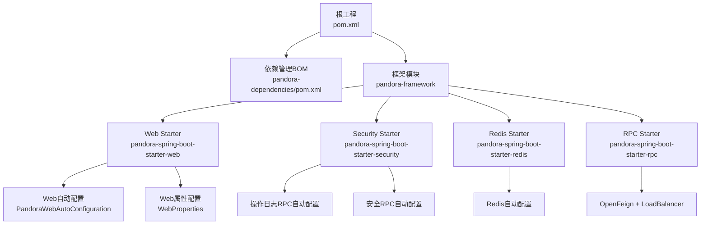
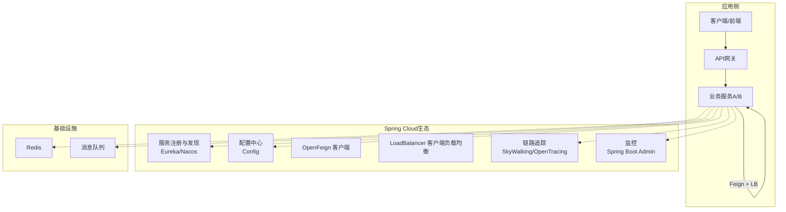
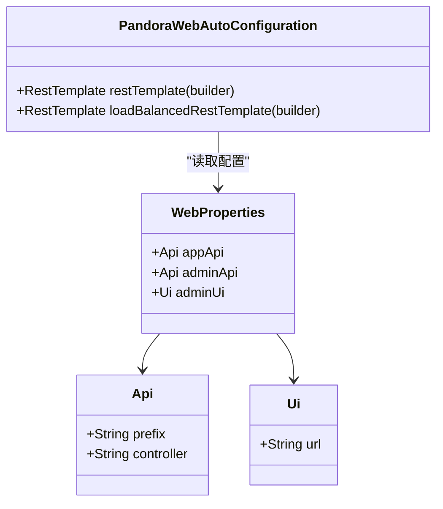
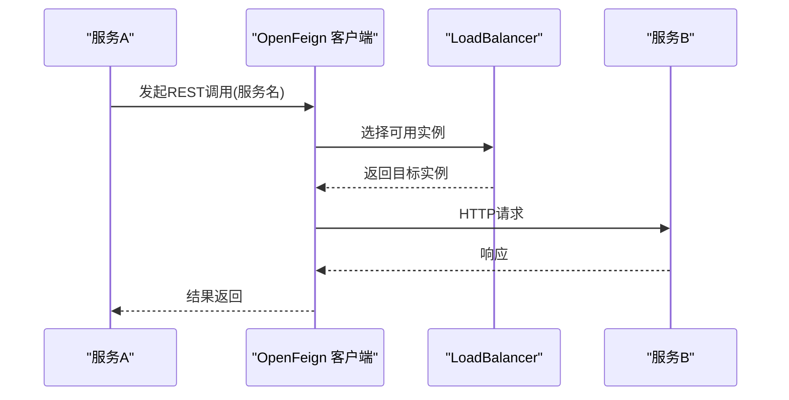
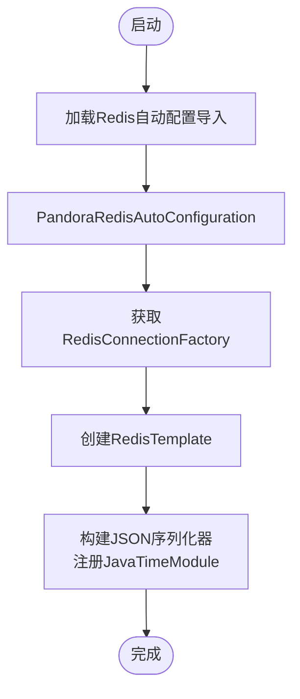
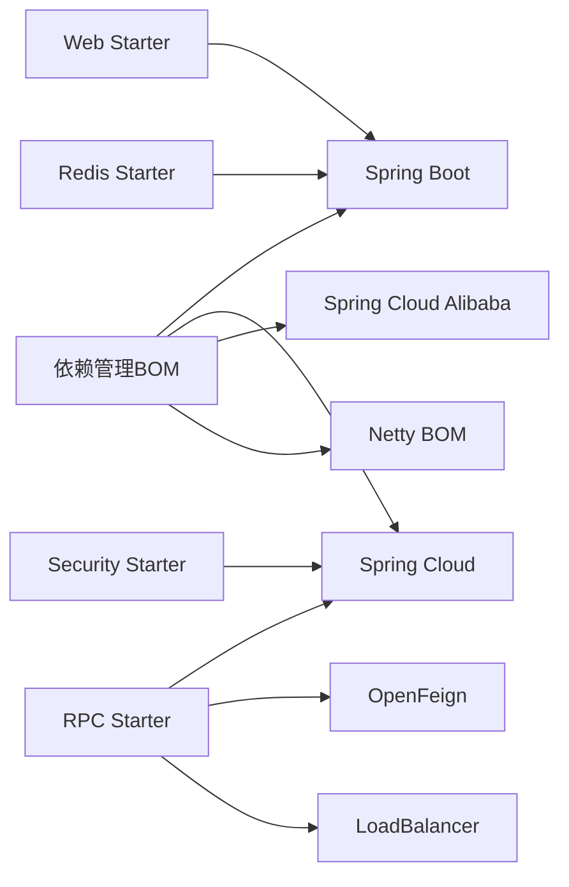

# Spring Cloud集成

<cite>
**本文引用的文件**
- [README.md](file://README.md)
- [根POM](file://pom.xml)
- [依赖管理BOM](file://pandora-dependencies/pom.xml)
- [RPC Starter POM](file://pandora-framework/pandora-spring-boot-starter-rpc/pom.xml)
- [Web自动配置导入](file://pandora-framework/pandora-spring-boot-starter-web/src/main/resources/META-INF/spring/org.springframework.boot.autoconfigure.AutoConfiguration.imports)
- [安全自动配置导入](file://pandora-framework/pandora-spring-boot-starter-security/src/main/resources/META-INF/spring/org.springframework.boot.autoconfigure.AutoConfiguration.imports)
- [Redis自动配置导入](file://pandora-framework/pandora-spring-boot-starter-redis/src/main/resources/META-INF/spring/org.springframework.boot.autoconfigure.AutoConfiguration.imports)
- [Web自动配置](file://pandora-framework/pandora-spring-boot-starter-web/src/main/java/net/ittimeline/pandora/framework/web/config/PandoraWebAutoConfiguration.java)
- [Web属性配置](file://pandora-framework/pandora-spring-boot-starter-web/src/main/java/net/ittimeline/pandora/framework/web/config/WebProperties.java)
- [Redis自动配置](file://pandora-framework/pandora-spring-boot-starter-redis/src/main/java/net/ittimeline/pandora/framework/redis/config/PandoraRedisAutoConfiguration.java)
- [API日志RPC自动配置](file://pandora-framework/pandora-spring-boot-starter-web/src/main/java/net/ittimeline/pandora/framework/apilog/config/PandoraApiLogRpcAutoConfiguration.java)
- [操作日志RPC自动配置](file://pandora-framework/pandora-spring-boot-starter-security/src/main/java/net/ittimeline/pandora/framework/operatelog/config/PandoraOperateLogRpcAutoConfiguration.java)
- [安全RPC自动配置](file://pandora-framework/pandora-spring-boot-starter-security/src/main/java/net/ittimeline/pandora/framework/security/config/PandoraSecurityRpcAutoConfiguration.java)
- [通用公共模块POM](file://pandora-framework/pandora-common/pom.xml)
</cite>

## 目录
1. [简介](#简介)
2. [项目结构](#项目结构)
3. [核心组件](#核心组件)
4. [架构总览](#架构总览)
5. [详细组件分析](#详细组件分析)
6. [依赖关系分析](#依赖关系分析)
7. [性能考虑](#性能考虑)
8. [故障排查指南](#故障排查指南)
9. [结论](#结论)
10. [附录](#附录)

## 简介
本指南面向在Spring Cloud生态系统中集成Pandora Cloud框架的团队，系统阐述如何在Pandora Cloud Starter组件的基础上，完成服务发现（Eureka/Nacos）、配置中心（Config）、API网关（Gateway）、负载均衡（Ribbon/LoadBalancer）等核心能力的对接与最佳实践。同时，结合仓库中已有的自动配置与依赖管理，给出可落地的配置要点、集成步骤与排障建议。

## 项目结构
仓库采用多模块Maven工程组织，顶层聚合根负责版本与插件管理；pandora-dependencies提供统一的依赖版本与BOM；pandora-framework封装各类Spring Boot Starter，覆盖Web、安全、缓存、RPC等场景。

图表来源
- [根POM:1-150](file://pom.xml#L1-L150)
- [依赖管理BOM:140-170](file://pandora-dependencies/pom.xml#L140-L170)
- [Web自动配置导入:1-8](file://pandora-framework/pandora-spring-boot-starter-web/src/main/resources/META-INF/spring/org.springframework.boot.autoconfigure.AutoConfiguration.imports#L1-L8)
- [安全自动配置导入:1-6](file://pandora-framework/pandora-spring-boot-starter-security/src/main/resources/META-INF/spring/org.springframework.boot.autoconfigure.AutoConfiguration.imports#L1-L6)
- [Redis自动配置导入:1-2](file://pandora-framework/pandora-spring-boot-starter-redis/src/main/resources/META-INF/spring/org.springframework.boot.autoconfigure.AutoConfiguration.imports#L1-L2)

章节来源
- [README.md:1-15](file://README.md#L1-L15)
- [根POM:1-150](file://pom.xml#L1-L150)
- [依赖管理BOM:140-170](file://pandora-dependencies/pom.xml#L140-L170)

## 核心组件
- 依赖与版本管理：通过pandora-dependencies统一管理Spring Boot、Spring Cloud、Spring Cloud Alibaba以及常用中间件版本，确保与Pandora Cloud Starter兼容。
- Web Starter：提供Web自动配置、路径前缀、跨域、RestTemplate（含负载均衡）等能力。
- Security Starter：提供安全自动配置、操作日志RPC、安全RPC等，配合OpenFeign进行服务间调用。
- Redis Starter：提供Redis自动配置与JSON序列化模板。
- RPC Starter：内置OpenFeign与LoadBalancer依赖，便于服务间REST调用与客户端负载均衡。

章节来源
- [依赖管理BOM:140-170](file://pandora-dependencies/pom.xml#L140-L170)
- [Web自动配置导入:1-8](file://pandora-framework/pandora-spring-boot-starter-web/src/main/resources/META-INF/spring/org.springframework.boot.autoconfigure.AutoConfiguration.imports#L1-L8)
- [安全自动配置导入:1-6](file://pandora-framework/pandora-spring-boot-starter-security/src/main/resources/META-INF/spring/org.springframework.boot.autoconfigure.AutoConfiguration.imports#L1-L6)
- [Redis自动配置导入:1-2](file://pandora-framework/pandora-spring-boot-starter-redis/src/main/resources/META-INF/spring/org.springframework.boot.autoconfigure.AutoConfiguration.imports#L1-L2)
- [RPC Starter POM:22-58](file://pandora-framework/pandora-spring-boot-starter-rpc/pom.xml#L22-L58)

## 架构总览
下图展示了Pandora Cloud Starter在Spring Cloud生态中的位置与交互关系，重点体现RPC调用链路与负载均衡配置。

说明
- 服务注册与发现：通过Spring Cloud注册到Eureka或Nacos。
- 配置中心：从Config拉取动态配置。
- API网关：统一入口，路由到各业务服务。
- 负载均衡：OpenFeign + Spring Cloud LoadBalancer实现客户端侧软负载。
- 链路追踪与监控：SkyWalking/OpenTracing与Spring Boot Admin。
- 缓存与消息：Redis与消息队列作为基础设施。

## 详细组件分析

### Web自动配置与路径前缀
- 自动装配：通过AutoConfiguration.imports引入Web相关自动配置，包括Banner、Jackson、Web、API日志、Swagger、XSS、加密等。
- 路径前缀：WebProperties定义/admin-api与/app-api前缀及对应Controller包匹配规则，统一对外接口前缀，提升安全与路由清晰度。
- RestTemplate：提供无负载均衡与带@LoadBalanced两种RestTemplate Bean，便于直连或服务名调用。

图表来源
- [Web属性配置:18-68](file://pandora-framework/pandora-spring-boot-starter-web/src/main/java/net/ittimeline/pandora/framework/web/config/WebProperties.java#L18-L68)
- [Web自动配置:43-176](file://pandora-framework/pandora-spring-boot-starter-web/src/main/java/net/ittimeline/pandora/framework/web/config/PandoraWebAutoConfiguration.java#L43-L176)

章节来源
- [Web自动配置导入:1-8](file://pandora-framework/pandora-spring-boot-starter-web/src/main/resources/META-INF/spring/org.springframework.boot.autoconfigure.AutoConfiguration.imports#L1-L8)
- [Web属性配置:18-68](file://pandora-framework/pandora-spring-boot-starter-web/src/main/java/net/ittimeline/pandora/framework/web/config/WebProperties.java#L18-L68)
- [Web自动配置:43-176](file://pandora-framework/pandora-spring-boot-starter-web/src/main/java/net/ittimeline/pandora/framework/web/config/PandoraWebAutoConfiguration.java#L43-L176)

### RPC与负载均衡集成
- 依赖：RPC Starter引入spring-cloud-starter-openfeign与spring-cloud-starter-loadbalancer，提供声明式HTTP客户端与客户端负载均衡。
- 调用链：业务服务间通过OpenFeign发起REST调用，结合@LoadBalanced的RestTemplate或Feign的负载均衡策略实现服务名路由与健康检查。
- 兼容性：为兼容第三方库对HttpClient 4.x的依赖，RPC Starter显式引入httpclient 4.5.14以避免Nacos升级后的类缺失问题。

图表来源
- [RPC Starter POM:22-58](file://pandora-framework/pandora-spring-boot-starter-rpc/pom.xml#L22-L58)
- [Web自动配置:162-176](file://pandora-framework/pandora-spring-boot-starter-web/src/main/java/net/ittimeline/pandora/framework/web/config/PandoraWebAutoConfiguration.java#L162-L176)

章节来源
- [RPC Starter POM:22-58](file://pandora-framework/pandora-spring-boot-starter-rpc/pom.xml#L22-L58)
- [Web自动配置:162-176](file://pandora-framework/pandora-spring-boot-starter-web/src/main/java/net/ittimeline/pandora/framework/web/config/PandoraWebAutoConfiguration.java#L162-L176)

### 安全与RPC自动配置
- 操作日志RPC：通过@EnableFeignClients引入OperateLogCommonApi，使服务具备操作日志上报能力。
- 安全RPC：通过@EnableFeignClients引入OAuth2TokenCommonApi等，支撑认证与权限校验。
- API日志RPC：通过@EnableFeignClients引入ApiAccessLogCommonApi与ApiErrorLogCommonApi，统一API访问与错误日志采集。

图表来源
- [操作日志RPC自动配置:14-17](file://pandora-framework/pandora-spring-boot-starter-security/src/main/java/net/ittimeline/pandora/framework/operatelog/config/PandoraOperateLogRpcAutoConfiguration.java#L14-L17)
- [安全RPC自动配置](file://pandora-framework/pandora-spring-boot-starter-security/src/main/java/net/ittimeline/pandora/framework/security/config/PandoraSecurityRpcAutoConfiguration.java#L17)
- [API日志RPC自动配置:15-18](file://pandora-framework/pandora-spring-boot-starter-web/src/main/java/net/ittimeline/pandora/framework/apilog/config/PandoraApiLogRpcAutoConfiguration.java#L15-L18)

章节来源
- [操作日志RPC自动配置:14-17](file://pandora-framework/pandora-spring-boot-starter-security/src/main/java/net/ittimeline/pandora/framework/operatelog/config/PandoraOperateLogRpcAutoConfiguration.java#L14-L17)
- [安全RPC自动配置:17](file://pandora-framework/pandora-spring-boot-starter-security/src/main/java/net/ittimeline/pandora/framework/security/config/PandoraSecurityRpcAutoConfiguration.java#L17)
- [API日志RPC自动配置:15-18](file://pandora-framework/pandora-spring-boot-starter-web/src/main/java/net/ittimeline/pandora/framework/apilog/config/PandoraApiLogRpcAutoConfiguration.java#L15-L18)

### Redis自动配置
- 自动装配：通过AutoConfiguration.imports引入Redis自动配置，优先于Redisson自动配置，确保自定义RedisTemplate生效。
- 序列化：基于Jackson的JSON序列化，注册JavaTimeModule以支持LocalDateTime等时间类型。

图表来源
- [Redis自动配置导入:1-2](file://pandora-framework/pandora-spring-boot-starter-redis/src/main/resources/META-INF/spring/org.springframework.boot.autoconfigure.AutoConfiguration.imports#L1-L2)
- [Redis自动配置:19-46](file://pandora-framework/pandora-spring-boot-starter-redis/src/main/java/net/ittimeline/pandora/framework/redis/config/PandoraRedisAutoConfiguration.java#L19-L46)

章节来源
- [Redis自动配置导入:1-2](file://pandora-framework/pandora-spring-boot-starter-redis/src/main/resources/META-INF/spring/org.springframework.boot.autoconfigure.AutoConfiguration.imports#L1-L2)
- [Redis自动配置:19-46](file://pandora-framework/pandora-spring-boot-starter-redis/src/main/java/net/ittimeline/pandora/framework/redis/config/PandoraRedisAutoConfiguration.java#L19-L46)

### 通用公共模块与RPC依赖
- 通用公共模块pandora-common对OpenFeign Core与线程上下文传递等依赖进行了集中管理，便于API包复用与线程上下文透传。

章节来源
- [通用公共模块POM:98-114](file://pandora-framework/pandora-common/pom.xml#L98-L114)

## 依赖关系分析
- 版本统一：pandora-dependencies统一管理Spring Boot、Spring Cloud、Spring Cloud Alibaba与Netty等BOM，确保与Pandora Cloud Starter兼容。
- Starter依赖：各Starter按需引入Web、Security、Redis、RPC等能力，避免重复配置与版本冲突。
- 兼容性：RPC Starter显式引入httpclient 4.5.14以适配第三方库对HttpClient 4.x的依赖。

图表来源
- [依赖管理BOM:140-170](file://pandora-dependencies/pom.xml#L140-L170)
- [RPC Starter POM:22-58](file://pandora-framework/pandora-spring-boot-starter-rpc/pom.xml#L22-L58)

章节来源
- [依赖管理BOM:140-170](file://pandora-dependencies/pom.xml#L140-L170)
- [RPC Starter POM:22-58](file://pandora-framework/pandora-spring-boot-starter-rpc/pom.xml#L22-L58)

## 性能考虑
- 客户端负载均衡：优先使用Spring Cloud LoadBalancer，减少服务端压力，提升弹性与可用性。
- 序列化优化：Redis使用JSON序列化并注册时间模块，避免频繁装箱拆箱与格式转换开销。
- 超时与重试：合理设置Feign超时与重试策略，结合熔断器（Hystrix/Resilience4j）降低雪崩风险。
- 监控与追踪：启用SkyWalking/OpenTracing与Spring Boot Admin，持续观测延迟、错误率与资源使用。

## 故障排查指南
- 服务无法注册/发现
  - 检查服务名与注册中心配置是否一致。
  - 确认网络连通与注册中心端口开放。
- 调用失败或超时
  - 查看Feign日志与链路追踪，定位具体服务与耗时环节。
  - 检查LoadBalancer健康状态与实例数量。
- 序列化异常
  - 确认RedisTemplate序列化器配置与数据类型匹配。
  - 核对Jackson模块注册（时间类型）。
- 第三方库依赖冲突
  - RPC Starter已显式引入httpclient 4.5.14，若仍有ClassNotFoundException，检查依赖排除与传递范围。

章节来源
- [RPC Starter POM:42-51](file://pandora-framework/pandora-spring-boot-starter-rpc/pom.xml#L42-L51)
- [Redis自动配置:25-46](file://pandora-framework/pandora-spring-boot-starter-redis/src/main/java/net/ittimeline/pandora/framework/redis/config/PandoraRedisAutoConfiguration.java#L25-L46)

## 结论
通过pandora-dependencies统一版本与依赖，结合Web、Security、Redis、RPC等Starter，Pandora Cloud能够在Spring Cloud生态中快速落地服务发现、配置中心、API网关与负载均衡等核心能力。建议在生产环境中配套启用链路追踪与监控，并根据业务特性完善熔断与限流策略，确保系统稳定与可观测。

## 附录
- 集成清单
  - 服务发现：引入Eureka/Nacos依赖与注册配置。
  - 配置中心：引入Config客户端与命名空间配置。
  - API网关：引入Gateway与路由规则配置。
  - 负载均衡：启用OpenFeign + LoadBalancer。
  - 安全：启用Security Starter与相关RPC自动配置。
  - 缓存：启用Redis Starter并校验序列化配置。
- 配置示例路径参考
  - Web路径前缀与控制器包匹配：[Web属性配置:18-68](file://pandora-framework/pandora-spring-boot-starter-web/src/main/java/net/ittimeline/pandora/framework/web/config/WebProperties.java#L18-L68)
  - RestTemplate与@LoadBalanced：[Web自动配置:162-176](file://pandora-framework/pandora-spring-boot-starter-web/src/main/java/net/ittimeline/pandora/framework/web/config/PandoraWebAutoConfiguration.java#L162-L176)
  - Feign与RPC自动配置：[操作日志RPC自动配置:14-17](file://pandora-framework/pandora-spring-boot-starter-security/src/main/java/net/ittimeline/pandora/framework/operatelog/config/PandoraOperateLogRpcAutoConfiguration.java#L14-L17)，[安全RPC自动配置](file://pandora-framework/pandora-spring-boot-starter-security/src/main/java/net/ittimeline/pandora/framework/security/config/PandoraSecurityRpcAutoConfiguration.java#L17)，[API日志RPC自动配置:15-18](file://pandora-framework/pandora-spring-boot-starter-web/src/main/java/net/ittimeline/pandora/framework/apilog/config/PandoraApiLogRpcAutoConfiguration.java#L15-L18)
  - Redis序列化：[Redis自动配置:25-46](file://pandora-framework/pandora-spring-boot-starter-redis/src/main/java/net/ittimeline/pandora/framework/redis/config/PandoraRedisAutoConfiguration.java#L25-L46)