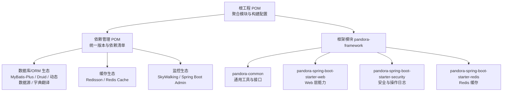
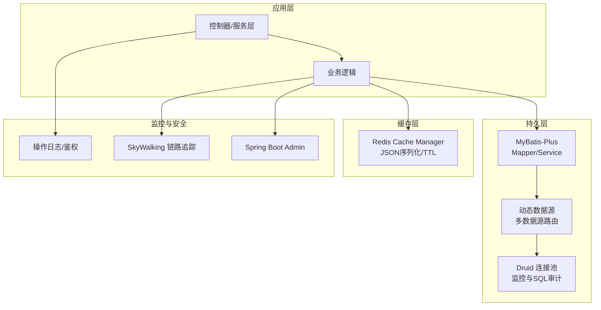
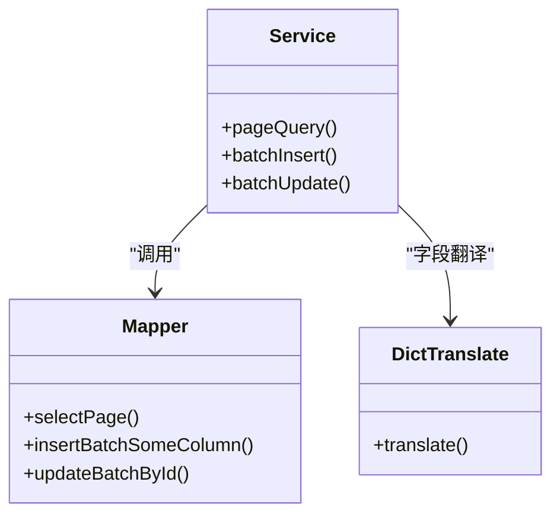
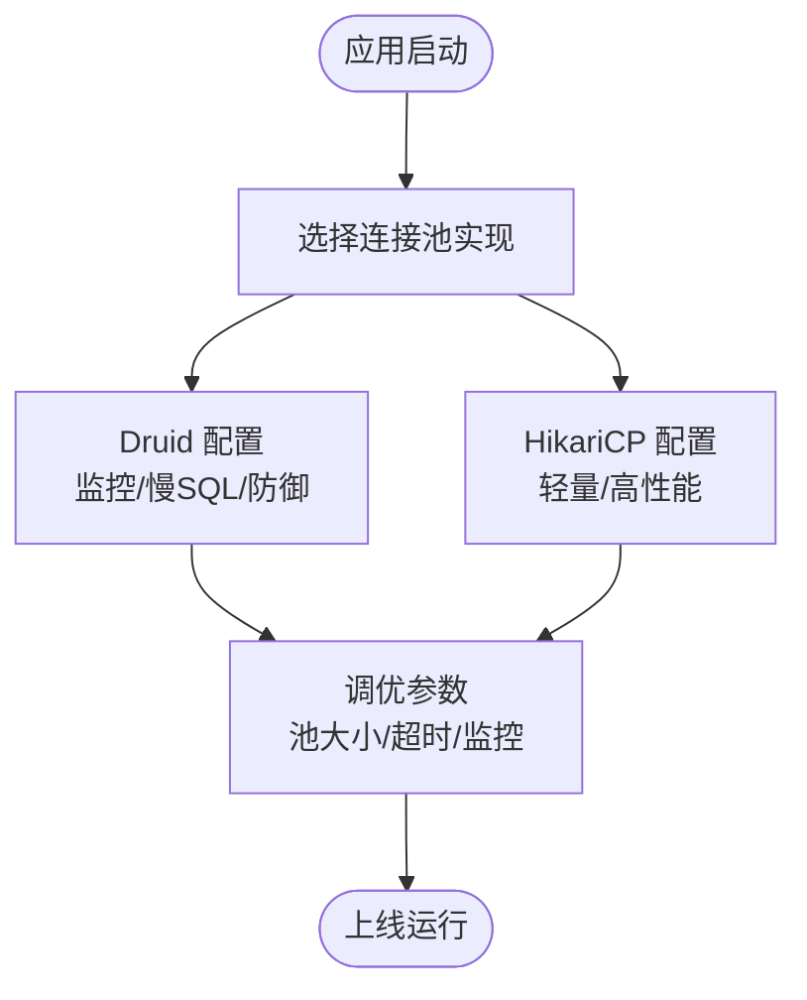
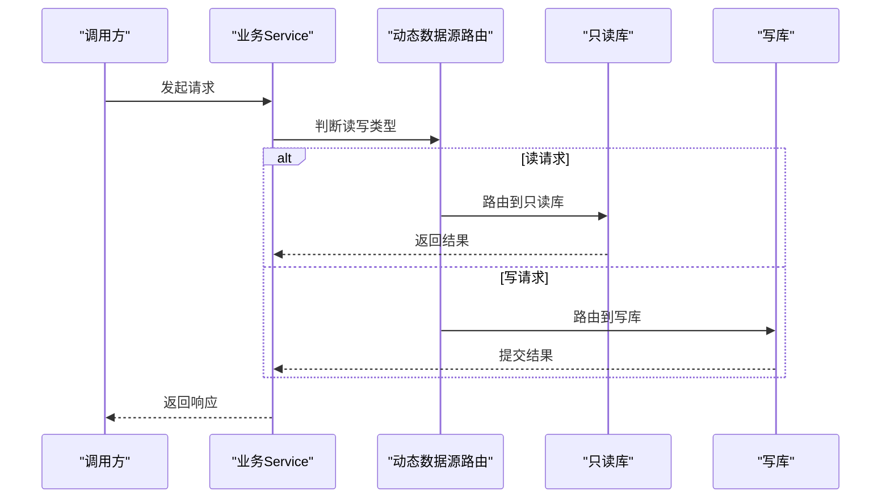
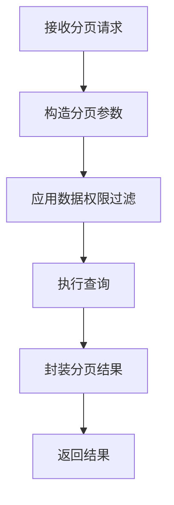
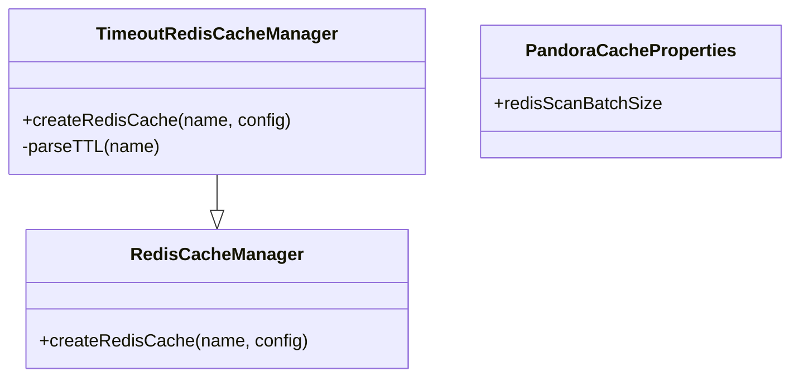
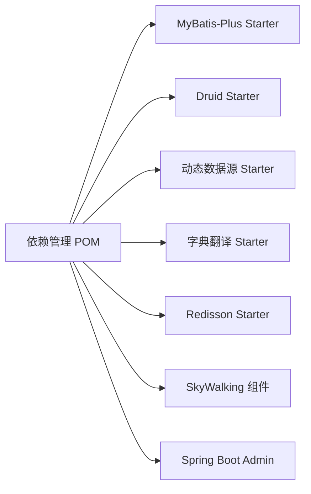
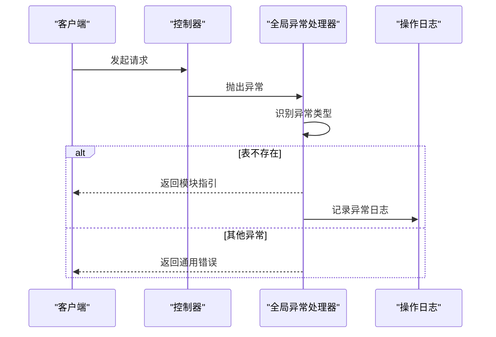

# 数据库集成

<cite>
**本文引用的文件**
- [根工程 POM](file://pom.xml)
- [依赖管理 POM](file://pandora-dependencies/pom.xml)
- [通用模块 POM](file://pandora-framework/pandora-common/pom.xml)
- [Web 启动器 POM](file://pandora-framework/pandora-spring-boot-starter-web/pom.xml)
- [全局异常处理器](file://pandora-framework/pandora-spring-boot-starter-web/src/main/java/net/ittimeline/pandora/framework/web/core/handler/GlobalExceptionHandler.java)
- [自动字典翻译接口](file://pandora-framework/pandora-common/src/main/java/com/fhs/trans/service/AutoTransable.java)
- [操作日志配置](file://pandora-framework/pandora-spring-boot-starter-security/src/main/java/net/ittimeline/pandora/framework/operatelog/config/PandoraOperateLogConfiguration.java)
- [Redis 缓存自动装配](file://pandora-framework/pandora-spring-boot-starter-redis/src/main/java/net/ittimeline/pandora/framework/redis/config/PandoraCacheAutoConfiguration.java)
- [Redis 缓存属性配置](file://pandora-framework/pandora-spring-boot-starter-redis/src/main/java/net/ittimeline/pandora/framework/redis/config/PandoraCacheProperties.java)
- [支持超时的 Redis 缓存管理器](file://pandora-framework/pandora-spring-boot-starter-redis/src/main/java/net/ittimeline/pandora/framework/redis/core/TimeoutRedisCacheManager.java)
- [Spring Security 自动装配导入](file://pandora-framework/pandora-spring-boot-starter-security/src/main/resources/META-INF/spring/org.springframework.boot.autoconfigure.AutoConfiguration.imports)
</cite>

## 目录
1. [简介](#简介)
2. [项目结构](#项目结构)
3. [核心组件](#核心组件)
4. [架构总览](#架构总览)
5. [详细组件分析](#详细组件分析)
6. [依赖分析](#依赖分析)
7. [性能考虑](#性能考虑)
8. [故障排查指南](#故障排查指南)
9. [结论](#结论)
10. [附录](#附录)

## 简介
本指南面向在 Pandora Cloud 框架中进行数据库集成的开发者，重点覆盖以下方面：
- ORM 框架集成：MyBatis-Plus、JPA、Hibernate 的选型与配置要点
- 连接池配置：Druid/HikariCP 的选择与调优
- 多数据源与读写分离：基于动态数据源的实现思路
- 核心能力：分页查询、批量操作、数据权限控制
- 数据库迁移：Flyway/Liquibase 的集成配置建议
- 性能优化：SQL 优化、连接池调优、缓存策略
- 安全与运维：数据库安全配置、备份恢复策略、监控告警

说明：当前仓库已内置 MyBatis-Plus 与 Druid 的依赖与版本管理，动态数据源与字典翻译等生态组件亦在依赖清单中；JPA/Hibernate 与 Flyway/Liquibase 在本仓库未直接声明依赖，需按需引入。

## 项目结构
Pandora Cloud 采用多模块聚合工程，数据库相关能力通过依赖管理统一版本并由各启动器模块按需启用。关键模块与职责如下：
- pandora-dependencies：集中管理第三方依赖版本，明确数据库/ORM、缓存、监控等生态组件版本
- pandora-common：提供通用 POJO、工具类、异常体系与通用 API 接口
- pandora-spring-boot-starter-web：Web 层能力，包含全局异常处理、API 日志、脱敏等
- pandora-spring-boot-starter-security：安全与操作日志能力
- pandora-spring-boot-starter-redis：Redis 缓存自动装配与管理器扩展

图表来源
- [根工程 POM:11-14](file://pom.xml#L11-L14)
- [依赖管理 POM:202-262](file://pandora-dependencies/pom.xml#L202-L262)
- [Web 启动器 POM:19-46](file://pandora-framework/pandora-spring-boot-starter-web/pom.xml#L19-L46)
- [通用模块 POM:26-71](file://pandora-framework/pandora-common/pom.xml#L26-L71)

章节来源
- [根工程 POM:11-14](file://pom.xml#L11-L14)
- [依赖管理 POM:202-262](file://pandora-dependencies/pom.xml#L202-L262)

## 核心组件
- ORM 与连接池
  - MyBatis-Plus：通过 starter 引入，提供增强的 CRUD、分页、代码生成、联表查询扩展等能力
  - Druid：作为 Spring Boot 3 的连接池 Starter，提供监控、SQL 防御与高可用特性
  - 动态数据源：支持多数据源切换，适合多租户或多业务库场景
  - 字典翻译：提供 VO 字段自动翻译能力，降低重复查询成本
- 缓存与监控
  - Redis 缓存：提供 JSON 序列化、键前缀、自定义 TTL 等配置
  - SkyWalking：链路追踪与指标采集
  - Spring Boot Admin：服务端/客户端监控
- 安全与日志
  - 操作日志：基于注解与切面记录用户操作轨迹
  - 全局异常处理：对常见数据库异常进行分类与友好提示

章节来源
- [依赖管理 POM:202-262](file://pandora-dependencies/pom.xml#L202-L262)
- [Redis 缓存自动装配:40-83](file://pandora-framework/pandora-spring-boot-starter-redis/src/main/java/net/ittimeline/pandora/framework/redis/config/PandoraCacheAutoConfiguration.java#L40-L83)
- [支持超时的 Redis 缓存管理器:19-36](file://pandora-framework/pandora-spring-boot-starter-redis/src/main/java/net/ittimeline/pandora/framework/redis/core/TimeoutRedisCacheManager.java#L19-L36)
- [操作日志配置:18-26](file://pandora-framework/pandora-spring-boot-starter-security/src/main/java/net/ittimeline/pandora/framework/operatelog/config/PandoraOperateLogConfiguration.java#L18-L26)

## 架构总览
数据库集成在框架中的位置与交互如下：

图表来源
- [依赖管理 POM:202-262](file://pandora-dependencies/pom.xml#L202-L262)
- [Redis 缓存自动装配:40-83](file://pandora-framework/pandora-spring-boot-starter-redis/src/main/java/net/ittimeline/pandora/framework/redis/config/PandoraCacheAutoConfiguration.java#L40-L83)
- [Spring Security 自动装配导入:1-5](file://pandora-framework/pandora-spring-boot-starter-security/src/main/resources/META-INF/spring/org.springframework.boot.autoconfigure.AutoConfiguration.imports#L1-L5)

## 详细组件分析

### ORM 框架集成：MyBatis-Plus
- 依赖与版本
  - 通过依赖管理统一版本，确保与流程引擎等组件的兼容性
- 核心能力
  - 增强 CRUD、分页查询、代码生成、联表查询扩展
  - 结合字典翻译组件，减少二次查询
- 最佳实践
  - 使用分页参数对象进行分页查询
  - 使用批量插入/更新时注意主键策略与幂等性
  - 利用代码生成器快速生成实体与 Mapper

图表来源
- [依赖管理 POM:202-262](file://pandora-dependencies/pom.xml#L202-L262)
- [自动字典翻译接口:18-60](file://pandora-framework/pandora-common/src/main/java/com/fhs/trans/service/AutoTransable.java#L18-L60)

章节来源
- [依赖管理 POM:202-262](file://pandora-dependencies/pom.xml#L202-L262)
- [自动字典翻译接口:18-60](file://pandora-framework/pandora-common/src/main/java/com/fhs/trans/service/AutoTransable.java#L18-L60)

### 连接池配置：Druid 与 HikariCP
- Druid（推荐）
  - 提供丰富的监控与 SQL 防御能力，适合生产环境
  - 通过 Spring Boot 3 Starter 自动装配
- HikariCP
  - 轻量、高性能，适合对延迟敏感的场景
  - 若选择 HikariCP，需移除 Druid Starter 并引入对应 Starter
- 配置要点
  - 连接数、空闲连接、最大池大小、连接超时
  - SQL 监控与慢查询阈值
  - 防御策略：SQL 注入拦截、统计与告警

图表来源
- [依赖管理 POM:202-207](file://pandora-dependencies/pom.xml#L202-L207)

章节来源
- [依赖管理 POM:202-207](file://pandora-dependencies/pom.xml#L202-L207)

### 多数据源与读写分离
- 动态数据源
  - 通过动态数据源 Starter 实现多数据源切换
  - 支持主从分离、读写分离、按条件路由
- 实施建议
  - 明确路由规则（注解/策略/配置）
  - 事务一致性与跨库事务处理
  - 监控与告警：各数据源的连接与执行状态

图表来源
- [依赖管理 POM:229-232](file://pandora-dependencies/pom.xml#L229-L232)

章节来源
- [依赖管理 POM:229-232](file://pandora-dependencies/pom.xml#L229-L232)

### 分页查询与批量操作
- 分页查询
  - 使用分页参数对象进行分页查询，结合 MyBatis-Plus 分页插件
- 批量操作
  - 使用批量插入/更新接口，注意主键策略与幂等性
  - 控制批处理大小，避免内存与锁竞争
- 数据权限控制
  - 在查询层加入数据范围过滤（如部门/租户维度）
  - 通过切面或拦截器统一注入权限条件

图表来源
- [依赖管理 POM:202-262](file://pandora-dependencies/pom.xml#L202-L262)

章节来源
- [依赖管理 POM:202-262](file://pandora-dependencies/pom.xml#L202-L262)

### 数据库迁移：Flyway 与 Liquibase
- Flyway
  - 基于版本化的 SQL 迁移脚本，简洁易用
  - 建议将迁移脚本放在资源目录，按版本命名
- Liquibase
  - 基于变更日志的 XML/YAML/JSON 描述，适合复杂变更
  - 建议与 CI/CD 集成，在构建阶段自动执行
- 集成建议
  - 在启动类或配置类中启用迁移
  - 将迁移脚本纳入版本控制，避免手工修改
  - 生产环境执行迁移前做好回滚预案

章节来源
- [依赖管理 POM:202-262](file://pandora-dependencies/pom.xml#L202-L262)

### 缓存策略与性能优化
- 缓存策略
  - Redis 缓存管理器支持自定义 TTL 与键前缀
  - JSON 序列化提升可读性与跨语言兼容
- 连接池调优
  - 根据 QPS 与并发调整池大小、空闲连接与超时
  - 开启慢查询监控与告警
- SQL 优化
  - 合理索引、避免 N+1 查询
  - 使用分页与批量操作减少往返
- 监控与告警
  - SkyWalking 观察链路与耗时
  - Spring Boot Admin 监控实例健康

图表来源
- [Redis 缓存自动装配:40-83](file://pandora-framework/pandora-spring-boot-starter-redis/src/main/java/net/ittimeline/pandora/framework/redis/config/PandoraCacheAutoConfiguration.java#L40-L83)
- [支持超时的 Redis 缓存管理器:19-36](file://pandora-framework/pandora-spring-boot-starter-redis/src/main/java/net/ittimeline/pandora/framework/redis/core/TimeoutRedisCacheManager.java#L19-L36)
- [Redis 缓存属性配置:14-29](file://pandora-framework/pandora-spring-boot-starter-redis/src/main/java/net/ittimeline/pandora/framework/redis/config/PandoraCacheProperties.java#L14-L29)

章节来源
- [Redis 缓存自动装配:40-83](file://pandora-framework/pandora-spring-boot-starter-redis/src/main/java/net/ittimeline/pandora/framework/redis/config/PandoraCacheAutoConfiguration.java#L40-L83)
- [支持超时的 Redis 缓存管理器:19-36](file://pandora-framework/pandora-spring-boot-starter-redis/src/main/java/net/ittimeline/pandora/framework/redis/core/TimeoutRedisCacheManager.java#L19-L36)
- [Redis 缓存属性配置:14-29](file://pandora-framework/pandora-spring-boot-starter-redis/src/main/java/net/ittimeline/pandora/framework/redis/config/PandoraCacheProperties.java#L14-L29)

### 安全与运维
- 数据库安全
  - 最小权限原则、账号分离（读/写/运维）
  - 加密传输（SSL/TLS）、敏感字段加密
- 备份与恢复
  - 定期全量/增量备份，验证恢复流程
  - 多地域容灾与快照策略
- 监控与告警
  - 连接池健康、慢查询、错误率
  - SkyWalking 与 Spring Boot Admin 集成

章节来源
- [依赖管理 POM:202-262](file://pandora-dependencies/pom.xml#L202-L262)

## 依赖分析
- 依赖管理统一版本，确保 ORM、连接池、缓存、监控等生态组件稳定共存
- MyBatis-Plus 与 Druid 已在依赖清单中声明，动态数据源与字典翻译亦具备
- JPA/Hibernate 与 Flyway/Liquibase 当前未在依赖清单中声明，需按需引入

图表来源
- [依赖管理 POM:202-262](file://pandora-dependencies/pom.xml#L202-L262)

章节来源
- [依赖管理 POM:202-262](file://pandora-dependencies/pom.xml#L202-L262)

## 性能考虑
- SQL 优化
  - 合理设计索引，避免全表扫描
  - 使用分页与批量操作，减少网络往返
- 连接池调优
  - 根据峰值 QPS 调整池大小与超时
  - 开启慢查询与错误统计
- 缓存策略
  - 读多写少场景优先缓存热点数据
  - 使用 JSON 序列化与自定义 TTL，避免缓存雪崩

章节来源
- [Redis 缓存自动装配:40-83](file://pandora-framework/pandora-spring-boot-starter-redis/src/main/java/net/ittimeline/pandora/framework/redis/config/PandoraCacheAutoConfiguration.java#L40-L83)
- [支持超时的 Redis 缓存管理器:19-36](file://pandora-framework/pandora-spring-boot-starter-redis/src/main/java/net/ittimeline/pandora/framework/redis/core/TimeoutRedisCacheManager.java#L19-L36)

## 故障排查指南
- 表结构缺失导致的异常
  - 全局异常处理器对“表不存在”类异常进行分类，并输出模块指引
- 操作日志与权限
  - 操作日志配置启用后，可通过注解与切面记录用户行为
  - 权限校验通过远程 API 或本地校验实现

图表来源
- [全局异常处理器:386-446](file://pandora-framework/pandora-spring-boot-starter-web/src/main/java/net/ittimeline/pandora/framework/web/core/handler/GlobalExceptionHandler.java#L386-L446)
- [操作日志配置:18-26](file://pandora-framework/pandora-spring-boot-starter-security/src/main/java/net/ittimeline/pandora/framework/operatelog/config/PandoraOperateLogConfiguration.java#L18-L26)

章节来源
- [全局异常处理器:386-446](file://pandora-framework/pandora-spring-boot-starter-web/src/main/java/net/ittimeline/pandora/framework/web/core/handler/GlobalExceptionHandler.java#L386-L446)
- [操作日志配置:18-26](file://pandora-framework/pandora-spring-boot-starter-security/src/main/java/net/ittimeline/pandora/framework/operatelog/config/PandoraOperateLogConfiguration.java#L18-L26)

## 结论
- Pandora Cloud 已在依赖层面提供了完善的数据库/ORM生态支撑（MyBatis-Plus、Druid、动态数据源、字典翻译），可直接用于生产
- 如需引入 JPA/Hibernate 或 Flyway/Liquibase，可在各自模块中按需添加依赖与配置
- 建议结合缓存、监控与安全组件，形成完整的数据库集成方案

## 附录
- 配置建议
  - 连接池：优先 Druid，开启慢查询与 SQL 防御
  - 多数据源：明确路由规则，保证事务一致性
  - 缓存：合理设置 TTL 与键前缀，使用 JSON 序列化
  - 迁移：Flyway/Liquibase 二选一，纳入 CI/CD
- 监控与告警
  - SkyWalking 与 Spring Boot Admin 集成，关注连接池与慢查询指标