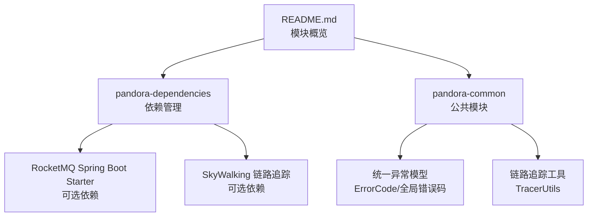
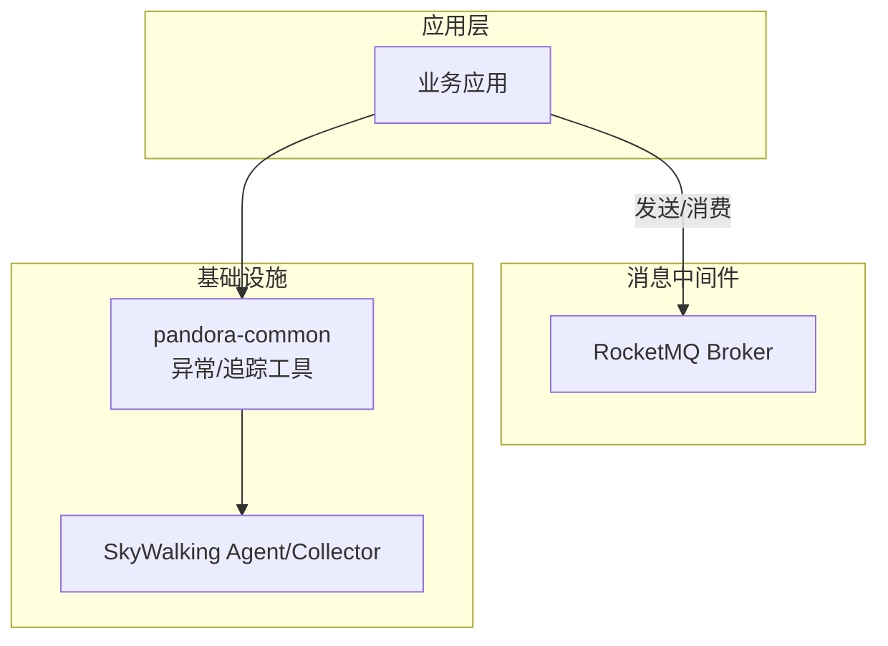
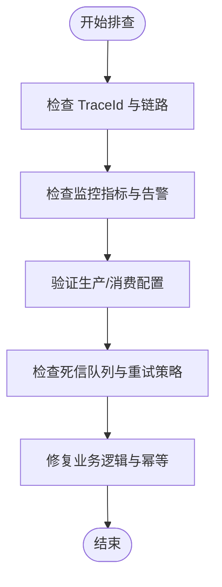
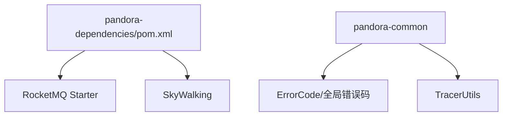

# 消息队列集成

<cite>
**本文引用的文件**
- [pandora-dependencies/pom.xml](file://pandora-dependencies/pom.xml)
- [README.md](file://README.md)
- [pandora-common/exception/ErrorCode.java](file://pandora-framework/pandora-common/src/main/java/net/ittimeline/pandora/framework/common/exception/ErrorCode.java)
- [pandora-common/exception/enums/GlobalErrorCodeConstants.java](file://pandora-framework/pandora-common/src/main/java/net/ittimeline/pandora/framework/common/exception/enums/GlobalErrorCodeConstants.java)
- [pandora-common/util/web/monitor/TracerUtils.java](file://pandora-framework/pandora-common/src/main/java/net/ittimeline/pandora/framework/common/util/web/monitor/TracerUtils.java)
</cite>

## 目录
1. [简介](#简介)
2. [项目结构](#项目结构)
3. [核心组件](#核心组件)
4. [架构总览](#架构总览)
5. [详细组件分析](#详细组件分析)
6. [依赖分析](#依赖分析)
7. [性能考虑](#性能考虑)
8. [故障排查指南](#故障排查指南)
9. [结论](#结论)
10. [附录](#附录)

## 简介
本指南面向在 Pandora Cloud 框架中集成消息队列的工程实践，重点覆盖以下目标：
- 明确当前仓库对消息队列的依赖现状与可扩展方向
- 提供异步消息处理、事件驱动架构、消息可靠性保证的实现思路
- 说明消息生产者、消费者、死信队列、消息重试等关键配置要点
- 解释消息序列化、分区策略、负载均衡等高级特性在框架中的落地方式
- 覆盖消息幂等性处理、事务消息、定时消息等特殊场景的实现建议
- 给出消息监控、性能调优与故障排查的方法，并总结高可用部署与运维管理要点

当前仓库已将 RocketMQ 的 Spring Boot Starter 作为可选依赖纳入依赖管理，便于快速接入 RocketMQ；同时，框架提供了统一的异常体系与链路追踪工具，可作为消息队列可靠性与可观测性的基础支撑。

## 项目结构
仓库采用多模块结构，消息队列相关能力主要通过依赖管理与公共模块支撑：
- 依赖管理模块：集中管理 RocketMQ、SkyWalking、Spring Boot Admin 等组件版本
- 公共模块：提供统一异常模型与链路追踪工具，为消息队列可靠性与可观测性提供基础

图表来源
- [pandora-dependencies/pom.xml:41-43](file://pandora-dependencies/pom.xml#L41-L43)
- [pandora-dependencies/pom.xml:300-314](file://pandora-dependencies/pom.xml#L300-L314)
- [README.md:1-15](file://README.md#L1-L15)

章节来源
- [pandora-dependencies/pom.xml:41-43](file://pandora-dependencies/pom.xml#L41-L43)
- [pandora-dependencies/pom.xml:300-314](file://pandora-dependencies/pom.xml#L300-L314)
- [README.md:1-15](file://README.md#L1-L15)

## 核心组件
- 依赖管理与版本锁定
  - RocketMQ Spring Boot Starter：用于快速接入 RocketMQ，简化生产者/消费者配置与自动装配
  - SkyWalking：提供链路追踪能力，便于消息发送/消费路径的可视化与问题定位
- 公共异常模型
  - ErrorCode 与全局错误码常量：为消息队列处理过程中的错误归口与统一响应提供基础
- 链路追踪工具
  - TracerUtils：提供获取 TraceId 的便捷方法，便于在消息处理链路中贯穿追踪标识

章节来源
- [pandora-dependencies/pom.xml:41-43](file://pandora-dependencies/pom.xml#L41-L43)
- [pandora-dependencies/pom.xml:300-314](file://pandora-dependencies/pom.xml#L300-L314)
- [pandora-common/exception/ErrorCode.java:17-32](file://pandora-framework/pandora-common/src/main/java/net/ittimeline/pandora/framework/common/exception/ErrorCode.java#L17-L32)
- [pandora-common/exception/enums/GlobalErrorCodeConstants.java:16-41](file://pandora-framework/pandora-common/src/main/java/net/ittimeline/pandora/framework/common/exception/enums/GlobalErrorCodeConstants.java#L16-L41)
- [pandora-common/util/web/monitor/TracerUtils.java:12-29](file://pandora-framework/pandora-common/src/main/java/net/ittimeline/pandora/framework/common/util/web/monitor/TracerUtils.java#L12-L29)

## 架构总览
下图展示了在 Pandora Cloud 中集成消息队列的整体架构思路：以 RocketMQ 为核心消息中间件，结合 SkyWalking 实现链路追踪，利用公共异常模型与工具类保障可靠性与可观测性。

图表来源
- [pandora-dependencies/pom.xml:41-43](file://pandora-dependencies/pom.xml#L41-L43)
- [pandora-dependencies/pom.xml:300-314](file://pandora-dependencies/pom.xml#L300-L314)
- [pandora-common/util/web/monitor/TracerUtils.java:12-29](file://pandora-framework/pandora-common/src/main/java/net/ittimeline/pandora/framework/common/util/web/monitor/TracerUtils.java#L12-L29)

## 详细组件分析

### 依赖与版本管理
- RocketMQ Spring Boot Starter
  - 作用：简化 RocketMQ 生产者与消费者的自动装配与配置
  - 版本：由依赖管理统一锁定，确保与 Spring Boot 3.x 生态兼容
- SkyWalking
  - 作用：提供链路追踪能力，便于跨服务定位消息发送/消费路径
  - 版本：由依赖管理统一锁定

章节来源
- [pandora-dependencies/pom.xml:41-43](file://pandora-dependencies/pom.xml#L41-L43)
- [pandora-dependencies/pom.xml:300-314](file://pandora-dependencies/pom.xml#L300-L314)

### 异常模型与统一响应
- ErrorCode 与全局错误码
  - 作用：为消息队列处理过程中的异常提供统一编码与提示，便于前端与监控系统识别
  - 建议：在消息消费失败、幂等校验失败、重试耗尽等场景，使用统一错误码进行响应与告警

章节来源
- [pandora-common/exception/ErrorCode.java:17-32](file://pandora-framework/pandora-common/src/main/java/net/ittimeline/pandora/framework/common/exception/ErrorCode.java#L17-L32)
- [pandora-common/exception/enums/GlobalErrorCodeConstants.java:16-41](file://pandora-framework/pandora-common/src/main/java/net/ittimeline/pandora/framework/common/exception/enums/GlobalErrorCodeConstants.java#L16-L41)

### 链路追踪与可观测性
- TracerUtils
  - 作用：提供获取 TraceId 的工具方法，便于在消息处理链路中贯穿追踪标识
  - 建议：在消息生产与消费过程中记录 TraceId，结合 SkyWalking 进行端到端追踪

章节来源
- [pandora-common/util/web/monitor/TracerUtils.java:12-29](file://pandora-framework/pandora-common/src/main/java/net/ittimeline/pandora/framework/common/util/web/monitor/TracerUtils.java#L12-L29)

### 消息可靠性与重试策略
- 生产者侧
  - 建议：启用同步/异步发送确认与批量发送，结合业务超时与重试策略
  - 建议：在发送失败时记录 TraceId 与错误码，触发降级或本地补偿
- 消费者侧
  - 建议：使用手动签收与合理设置消费超时，失败时进入死信队列或延迟重试
  - 建议：结合全局错误码与异常模型，输出统一的错误响应与告警
- 死信队列与重试
  - 建议：为不同业务设置最大重试次数与退避策略，超过阈值进入死信队列
  - 建议：对死信消息进行人工干预与二次处理，避免无限循环

章节来源
- [pandora-common/exception/enums/GlobalErrorCodeConstants.java:16-41](file://pandora-framework/pandora-common/src/main/java/net/ittimeline/pandora/framework/common/exception/enums/GlobalErrorCodeConstants.java#L16-L41)

### 幂等性处理
- 建议：基于消息 ID 或业务主键建立幂等表/缓存，消费前先查后落，避免重复处理
- 建议：结合链路追踪与统一异常模型，记录幂等校验失败的 TraceId 与错误码

章节来源
- [pandora-common/util/web/monitor/TracerUtils.java:12-29](file://pandora-framework/pandora-common/src/main/java/net/ittimeline/pandora/framework/common/util/web/monitor/TracerUtils.java#L12-L29)
- [pandora-common/exception/ErrorCode.java:17-32](file://pandora-framework/pandora-common/src/main/java/net/ittimeline/pandora/framework/common/exception/ErrorCode.java#L17-L32)

### 事务消息与定时消息
- 事务消息
  - 建议：在本地事务提交成功后再发送消息，失败则回滚，结合 RocketMQ 的事务消息机制
- 定时消息
  - 建议：使用 RocketMQ 的延时级别或自定义延迟队列，满足定时投递需求

章节来源
- [pandora-dependencies/pom.xml:41-43](file://pandora-dependencies/pom.xml#L41-L43)

### 序列化与分区策略
- 序列化
  - 建议：统一使用 JSON 或二进制序列化，确保跨语言与跨版本兼容
- 分区策略
  - 建议：根据业务键选择分区策略，保证同业务的数据在同一分区提升顺序性与性能

章节来源
- [pandora-dependencies/pom.xml:41-43](file://pandora-dependencies/pom.xml#L41-L43)

### 负载均衡
- 建议：消费者组内多实例水平扩展，结合 RocketMQ 的负载均衡策略实现高吞吐

章节来源
- [pandora-dependencies/pom.xml:41-43](file://pandora-dependencies/pom.xml#L41-L43)

### 监控与性能调优
- 监控
  - 建议：结合 SkyWalking 观察消息发送/消费链路的延迟与错误率
  - 建议：对关键指标（发送延迟、堆积量、重试率、死信率）进行告警
- 性能调优
  - 建议：调整批大小、压缩策略、线程池大小与队列容量，平衡吞吐与延迟

章节来源
- [pandora-dependencies/pom.xml:300-314](file://pandora-dependencies/pom.xml#L300-L314)

### 故障排查流程

图表来源
- [pandora-common/util/web/monitor/TracerUtils.java:12-29](file://pandora-framework/pandora-common/src/main/java/net/ittimeline/pandora/framework/common/util/web/monitor/TracerUtils.java#L12-L29)
- [pandora-common/exception/enums/GlobalErrorCodeConstants.java:16-41](file://pandora-framework/pandora-common/src/main/java/net/ittimeline/pandora/framework/common/exception/enums/GlobalErrorCodeConstants.java#L16-L41)

## 依赖分析
- 模块耦合
  - 依赖管理模块集中控制消息队列与可观测性组件版本，降低模块间版本冲突风险
  - 公共模块为各业务模块提供统一异常与追踪能力，提升一致性
- 外部依赖
  - RocketMQ Spring Boot Starter：简化消息队列接入
  - SkyWalking：提供链路追踪能力

图表来源
- [pandora-dependencies/pom.xml:41-43](file://pandora-dependencies/pom.xml#L41-L43)
- [pandora-dependencies/pom.xml:300-314](file://pandora-dependencies/pom.xml#L300-L314)
- [pandora-common/exception/ErrorCode.java:17-32](file://pandora-framework/pandora-common/src/main/java/net/ittimeline/pandora/framework/common/exception/ErrorCode.java#L17-L32)
- [pandora-common/util/web/monitor/TracerUtils.java:12-29](file://pandora-framework/pandora-common/src/main/java/net/ittimeline/pandora/framework/common/util/web/monitor/TracerUtils.java#L12-L29)

章节来源
- [pandora-dependencies/pom.xml:41-43](file://pandora-dependencies/pom.xml#L41-L43)
- [pandora-dependencies/pom.xml:300-314](file://pandora-dependencies/pom.xml#L300-L314)
- [pandora-common/exception/ErrorCode.java:17-32](file://pandora-framework/pandora-common/src/main/java/net/ittimeline/pandora/framework/common/exception/ErrorCode.java#L17-L32)
- [pandora-common/util/web/monitor/TracerUtils.java:12-29](file://pandora-framework/pandora-common/src/main/java/net/ittimeline/pandora/framework/common/util/web/monitor/TracerUtils.java#L12-L29)

## 性能考虑
- 发送端
  - 批量发送与压缩：提升吞吐，降低网络开销
  - 同步/异步发送策略：根据一致性要求选择
- 消费端
  - 并发度与线程池：根据 CPU 与磁盘 IO 调整
  - 手动签收与超时：避免阻塞与重复消费
- 监控与调优
  - 关注堆积量、重试率与延迟，动态调整批大小与并发度

## 故障排查指南
- 快速定位
  - 使用 TraceId 在 SkyWalking 中检索消息链路
  - 查看统一错误码与错误信息，判断是业务异常还是系统异常
- 常见问题
  - 消息堆积：检查消费速率与批大小，必要时扩容消费者
  - 死信堆积：核查重试策略与死信队列处理流程
  - 幂等问题：核对幂等表/缓存与业务键设计

章节来源
- [pandora-common/util/web/monitor/TracerUtils.java:12-29](file://pandora-framework/pandora-common/src/main/java/net/ittimeline/pandora/framework/common/util/web/monitor/TracerUtils.java#L12-L29)
- [pandora-common/exception/enums/GlobalErrorCodeConstants.java:16-41](file://pandora-framework/pandora-common/src/main/java/net/ittimeline/pandora/framework/common/exception/enums/GlobalErrorCodeConstants.java#L16-L41)

## 结论
- 仓库已具备接入 RocketMQ 的基础能力，结合 SkyWalking 与公共异常/追踪工具，可构建可靠的异步消息与事件驱动架构
- 建议在生产环境中完善重试、死信、幂等、事务与定时消息等关键能力，并持续优化监控与性能

## 附录
- 模块概览参考
  - README 中列出的模块与职责，有助于理解消息队列在整体架构中的定位

章节来源
- [README.md:1-15](file://README.md#L1-L15)