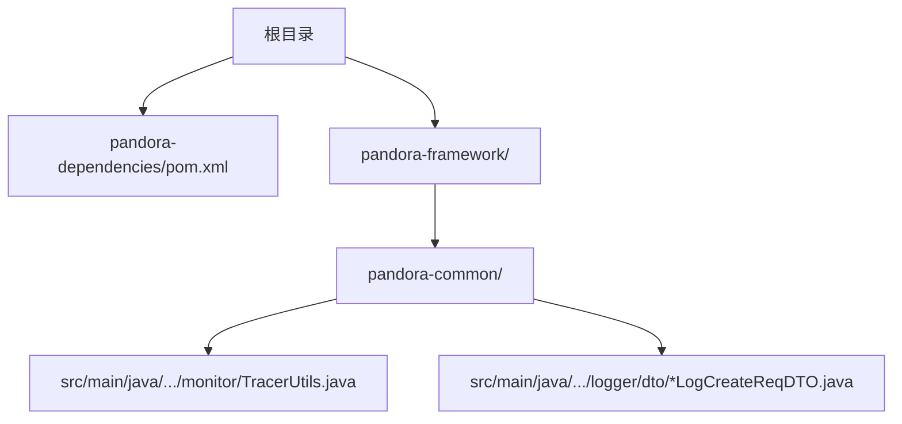
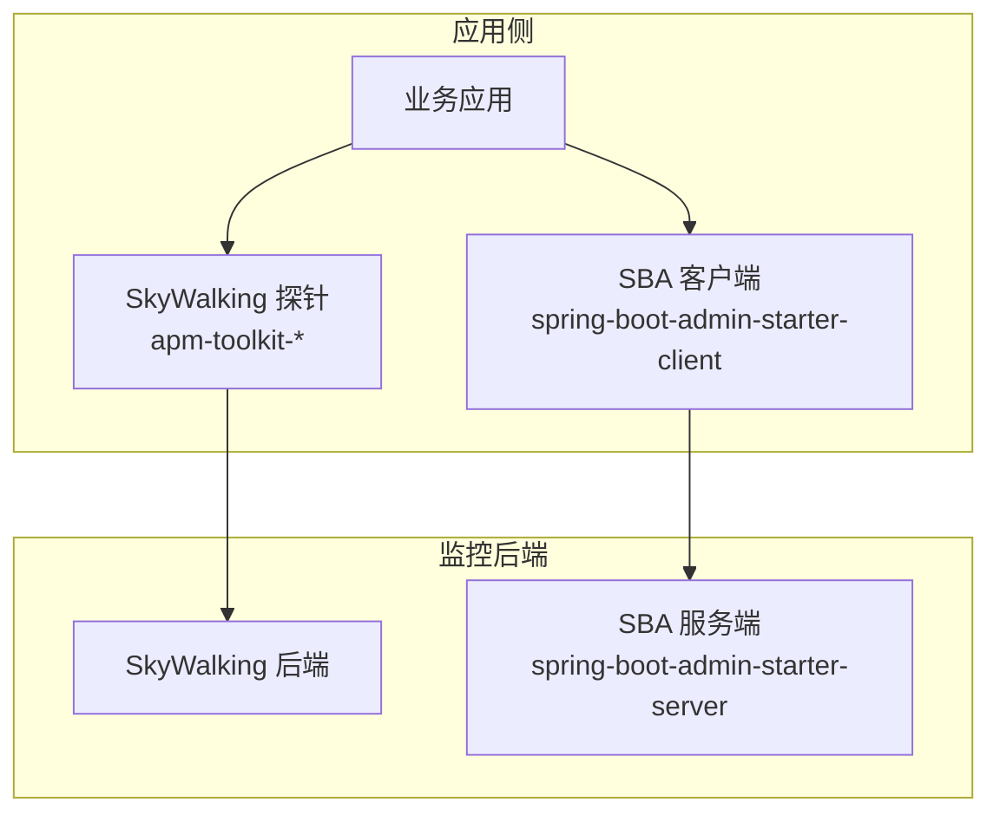
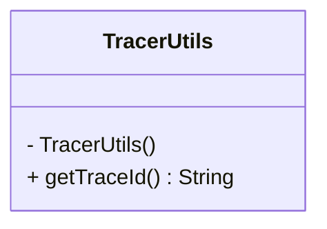
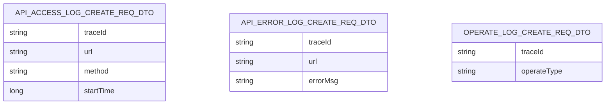
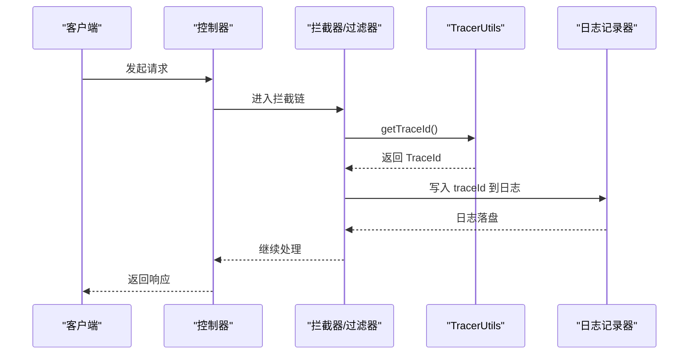
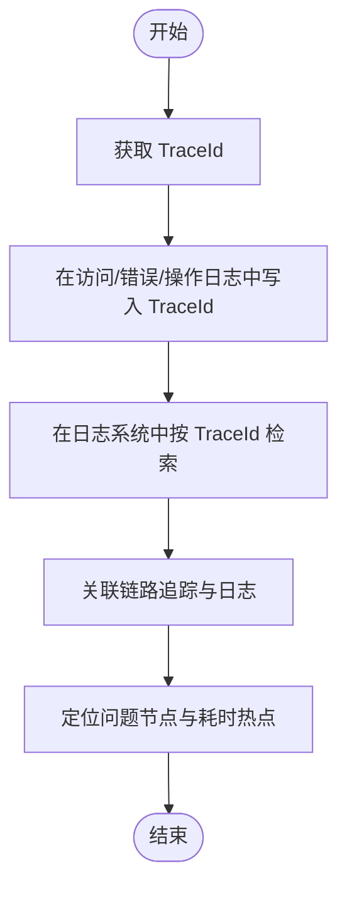
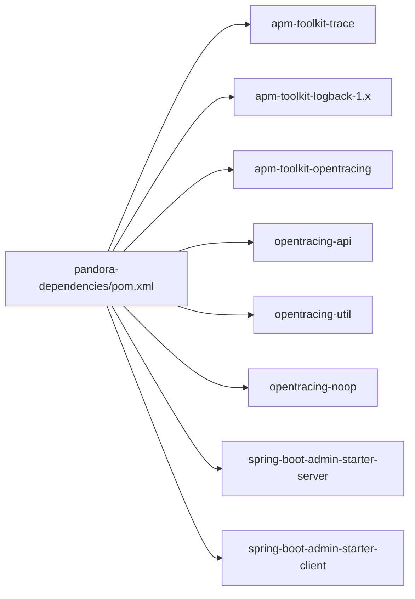
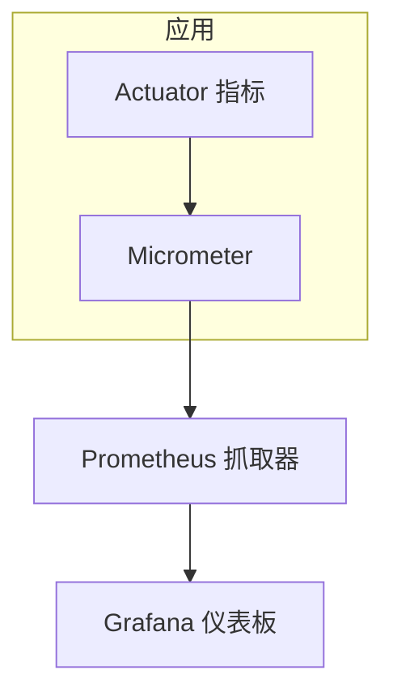
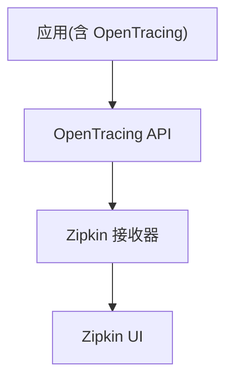
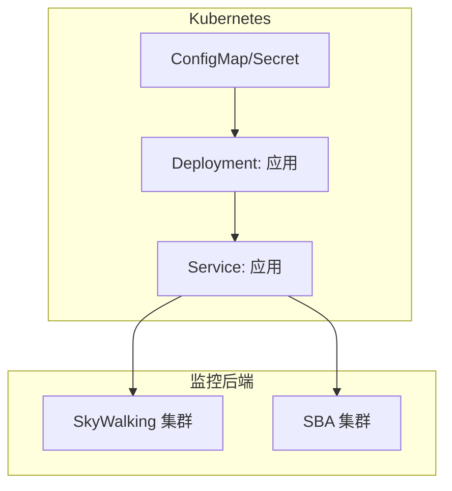

# 监控集成

<cite>
**本文引用的文件**
- [README.md](file://README.md)
- [pandora-dependencies/pom.xml](file://pandora-dependencies/pom.xml)
- [pandora-common/pom.xml](file://pandora-common/pom.xml)
- [TracerUtils.java](file://pandora-framework/pandora-common/src/main/java/net/ittimeline/pandora/framework/common/util/web/monitor/TracerUtils.java)
- [ApiAccessLogCreateReqDTO.java](file://pandora-framework/pandora-common/src/main/java/net/ittimeline/pandora/framework/common/biz/infra/logger/dto/ApiAccessLogCreateReqDTO.java)
- [ApiErrorLogCreateReqDTO.java](file://pandora-framework/pandora-common/src/main/java/net/ittimeline/pandora/framework/common/biz/infra/logger/dto/ApiErrorLogCreateReqDTO.java)
- [OperateLogCreateReqDTO.java](file://pandora-framework/pandora-common/src/main/java/net/ittimeline/pandora/framework/common/biz/system/logger/dto/OperateLogCreateReqDTO.java)
</cite>

## 目录
1. [简介](#简介)
2. [项目结构](#项目结构)
3. [核心组件](#核心组件)
4. [架构总览](#架构总览)
5. [详细组件分析](#详细组件分析)
6. [依赖关系分析](#依赖关系分析)
7. [性能考虑](#性能考虑)
8. [故障排查指南](#故障排查指南)
9. [结论](#结论)
10. [附录](#附录)

## 简介
本指南面向在 Pandora Cloud 框架中集成监控体系的工程团队，聚焦以下能力与目标：
- 集成链路追踪：基于 SkyWalking 的 APM 能力，提供跨服务的调用链追踪与日志关联。
- 集成服务治理与可观测性：通过 Spring Boot Admin 提供服务端与客户端的健康状态、指标与日志采集能力。
- 日志与操作审计：在访问日志、错误日志与操作日志中统一注入链路标识，便于端到端问题定位。
- 可视化与自动化运维：结合链路追踪与日志，形成可检索、可告警、可回溯的监控闭环。
- 容器化与高可用：给出与 Kubernetes/Docker 的集成思路与最佳实践。

说明：当前仓库已内置 SkyWalking 与 Spring Boot Admin 的依赖与工具类，但未包含 Prometheus/Grafana/Zipkin 等组件的具体配置文件或示例。因此，本指南在“概念性”部分提供这些工具的集成建议与流程图，不绑定具体源码文件；在“代码级”部分严格基于现有源码进行分析与落地说明。

## 项目结构
从仓库结构看，监控相关能力主要分布在以下位置：
- 依赖版本与管理：pandora-dependencies/pom.xml 中集中声明了 SkyWalking、OpenTracing、Spring Boot Admin 等依赖及其版本。
- 公共工具与模型：pandora-common 模块中包含 TracerUtils 工具类以及日志 DTO，统一注入 traceId。
- 模块概览：README.md 展示了框架模块清单，便于理解各模块职责。

图表来源
- [pandora-dependencies/pom.xml:299-339](file://pandora-dependencies/pom.xml#L299-L339)
- [pandora-common/pom.xml:87-96](file://pandora-common/pom.xml#L87-L96)
- [TracerUtils.java:1-30](file://pandora-framework/pandora-common/src/main/java/net/ittimeline/pandora/framework/common/util/web/monitor/TracerUtils.java#L1-L30)
- [ApiAccessLogCreateReqDTO.java:1-40](file://pandora-framework/pandora-common/src/main/java/net/ittimeline/pandora/framework/common/biz/infra/logger/dto/ApiAccessLogCreateReqDTO.java#L1-L40)
- [ApiErrorLogCreateReqDTO.java:1-40](file://pandora-framework/pandora-common/src/main/java/net/ittimeline/pandora/framework/common/biz/infra/logger/dto/ApiErrorLogCreateReqDTO.java#L1-L40)
- [OperateLogCreateReqDTO.java:1-40](file://pandora-framework/pandora-common/src/main/java/net/ittimeline/pandora/framework/common/biz/system/logger/dto/OperateLogCreateReqDTO.java#L1-L40)

章节来源
- [README.md:1-15](file://README.md#L1-L15)
- [pandora-dependencies/pom.xml:106-339](file://pandora-dependencies/pom.xml#L106-L339)
- [pandora-common/pom.xml:87-96](file://pandora-common/pom.xml#L87-L96)

## 核心组件
- SkyWalking 集成
  - 依赖：apm-toolkit-trace、apm-toolkit-logback-1.x、apm-toolkit-opentracing、OpenTracing API/Util/Noop。
  - 版本：由 pandora-dependencies/pom.xml 统一管理。
  - 工具类：TracerUtils 提供获取 TraceId 的静态方法，便于在任意模块便捷获取链路标识。
- Spring Boot Admin 集成
  - 依赖：spring-boot-admin-starter-server（服务端）、spring-boot-admin-starter-client（客户端）。
  - 作用：统一暴露 Actuator 指标，提供服务注册、健康检查、日志与指标可视化界面。
- 日志与审计模型
  - 访问日志、错误日志、操作日志 DTO 中均包含 traceId 字段，用于与链路追踪关联。

章节来源
- [pandora-dependencies/pom.xml:299-339](file://pandora-dependencies/pom.xml#L299-L339)
- [pandora-common/pom.xml:87-96](file://pandora-common/pom.xml#L87-L96)
- [TracerUtils.java:20-28](file://pandora-framework/pandora-common/src/main/java/net/ittimeline/pandora/framework/common/util/web/monitor/TracerUtils.java#L20-L28)
- [ApiAccessLogCreateReqDTO.java:1-40](file://pandora-framework/pandora-common/src/main/java/net/ittimeline/pandora/framework/common/biz/infra/logger/dto/ApiAccessLogCreateReqDTO.java#L1-L40)
- [ApiErrorLogCreateReqDTO.java:1-40](file://pandora-framework/pandora-common/src/main/java/net/ittimeline/pandora/framework/common/biz/infra/logger/dto/ApiErrorLogCreateReqDTO.java#L1-L40)
- [OperateLogCreateReqDTO.java:1-40](file://pandora-framework/pandora-common/src/main/java/net/ittimeline/pandora/framework/common/biz/system/logger/dto/OperateLogCreateReqDTO.java#L1-L40)

## 架构总览
下图展示了基于现有依赖的监控架构：应用通过 SkyWalking 探针采集链路与日志，Spring Boot Admin 客户端上报指标与健康状态，Admin Server 统一呈现与告警。

图表来源
- [pandora-dependencies/pom.xml:299-339](file://pandora-dependencies/pom.xml#L299-L339)

## 详细组件分析

### 组件A：TracerUtils 工具类
- 职责：提供获取当前请求链路标识（TraceId）的静态方法，便于在日志、异常处理、审计等场景统一注入 traceId。
- 设计要点：私有构造函数保证不可实例化；直接委托 SkyWalking 的 TraceContext 获取 TraceId。
- 使用建议：在拦截器、过滤器、全局异常处理器、日志切面中调用该工具类，确保 traceId 无遗漏。

图表来源
- [TracerUtils.java:12-29](file://pandora-framework/pandora-common/src/main/java/net/ittimeline/pandora/framework/common/util/web/monitor/TracerUtils.java#L12-L29)

章节来源
- [TracerUtils.java:1-30](file://pandora-framework/pandora-common/src/main/java/net/ittimeline/pandora/framework/common/util/web/monitor/TracerUtils.java#L1-L30)

### 组件B：日志与审计模型中的 traceId
- 访问日志、错误日志、操作日志 DTO 均包含 traceId 字段，用于与链路追踪关联。
- 实践建议：在日志记录器中显式写入 traceId，便于跨服务检索同一请求的完整轨迹。

图表来源
- [ApiAccessLogCreateReqDTO.java:1-40](file://pandora-framework/pandora-common/src/main/java/net/ittimeline/pandora/framework/common/biz/infra/logger/dto/ApiAccessLogCreateReqDTO.java#L1-L40)
- [ApiErrorLogCreateReqDTO.java:1-40](file://pandora-framework/pandora-common/src/main/java/net/ittimeline/pandora/framework/common/biz/infra/logger/dto/ApiErrorLogCreateReqDTO.java#L1-L40)
- [OperateLogCreateReqDTO.java:1-40](file://pandora-framework/pandora-common/src/main/java/net/ittimeline/pandora/framework/common/biz/system/logger/dto/OperateLogCreateReqDTO.java#L1-L40)

章节来源
- [ApiAccessLogCreateReqDTO.java:1-40](file://pandora-framework/pandora-common/src/main/java/net/ittimeline/pandora/framework/common/biz/infra/logger/dto/ApiAccessLogCreateReqDTO.java#L1-L40)
- [ApiErrorLogCreateReqDTO.java:1-40](file://pandora-framework/pandora-common/src/main/java/net/ittimeline/pandora/framework/common/biz/infra/logger/dto/ApiErrorLogCreateReqDTO.java#L1-L40)
- [OperateLogCreateReqDTO.java:1-40](file://pandora-framework/pandora-common/src/main/java/net/ittimeline/pandora/framework/common/biz/system/logger/dto/OperateLogCreateReqDTO.java#L1-L40)

### 组件C：链路追踪工具调用序列
以下序列图展示了在一次请求中如何获取并使用 TraceId 的典型流程。

图表来源
- [TracerUtils.java:20-28](file://pandora-framework/pandora-common/src/main/java/net/ittimeline/pandora/framework/common/util/web/monitor/TracerUtils.java#L20-L28)

章节来源
- [TracerUtils.java:1-30](file://pandora-framework/pandora-common/src/main/java/net/ittimeline/pandora/framework/common/util/web/monitor/TracerUtils.java#L1-L30)

### 组件D：日志检索与问题定位流程

图表来源
- [ApiAccessLogCreateReqDTO.java:1-40](file://pandora-framework/pandora-common/src/main/java/net/ittimeline/pandora/framework/common/biz/infra/logger/dto/ApiAccessLogCreateReqDTO.java#L1-L40)
- [ApiErrorLogCreateReqDTO.java:1-40](file://pandora-framework/pandora-common/src/main/java/net/ittimeline/pandora/framework/common/biz/infra/logger/dto/ApiErrorLogCreateReqDTO.java#L1-L40)
- [OperateLogCreateReqDTO.java:1-40](file://pandora-framework/pandora-common/src/main/java/net/ittimeline/pandora/framework/common/biz/system/logger/dto/OperateLogCreateReqDTO.java#L1-L40)
- [TracerUtils.java:20-28](file://pandora-framework/pandora-common/src/main/java/net/ittimeline/pandora/framework/common/util/web/monitor/TracerUtils.java#L20-L28)

## 依赖关系分析
- SkyWalking 依赖
  - apm-toolkit-trace：提供 TraceId 获取与注解支持。
  - apm-toolkit-logback-1.x：将日志与 TraceId 关联。
  - apm-toolkit-opentracing：桥接 OpenTracing 规范。
  - io.opentracing:*：OpenTracing API 标准实现。
- Spring Boot Admin 依赖
  - spring-boot-admin-starter-server：监控服务端。
  - spring-boot-admin-starter-client：监控客户端，自动暴露 Actuator 指标。
- 版本管理
  - skywalking.version、spring-boot-admin.version、opentracing.version 在 pandora-dependencies/pom.xml 中统一管理。

图表来源
- [pandora-dependencies/pom.xml:299-339](file://pandora-dependencies/pom.xml#L299-L339)

章节来源
- [pandora-dependencies/pom.xml:50-54](file://pandora-dependencies/pom.xml#L50-L54)
- [pandora-dependencies/pom.xml:299-339](file://pandora-dependencies/pom.xml#L299-L339)

## 性能考虑
- 探针开销控制
  - SkyWalking 探针默认以低开销模式运行；在高并发场景下，建议通过探针参数优化采样率与日志级别，避免对主业务造成显著延迟。
- 日志写入
  - 将 traceId 写入日志时应避免阻塞 IO；建议采用异步日志或批量刷盘策略。
- 指标暴露
  - SBA 客户端会暴露大量指标，建议在生产环境开启指标裁剪与采样，减少内存与 CPU 占用。
- 网络与存储
  - SkyWalking 后端与 SBA 服务端需具备充足的网络带宽与磁盘空间，建议对日志与指标进行分片与压缩。

## 故障排查指南
- 无法获取 TraceId
  - 确认应用已正确引入 SkyWalking 探针依赖与启动参数。
  - 检查 TracerUtils.getTraceId() 是否在请求上下文中被调用（如拦截器、过滤器、全局异常处理器）。
- 日志中缺少 traceId
  - 检查日志记录器是否在写入前调用了 TracerUtils.getTraceId() 并将其写入日志字段。
  - 确认日志 DTO 中 traceId 字段已正确赋值并在序列化时输出。
- SBA 客户端无法上报指标
  - 检查 Actuator 暴露的端点与权限配置。
  - 确认 SBA 服务端地址与客户端配置一致，网络连通正常。

章节来源
- [TracerUtils.java:20-28](file://pandora-framework/pandora-common/src/main/java/net/ittimeline/pandora/framework/common/util/web/monitor/TracerUtils.java#L20-L28)
- [ApiAccessLogCreateReqDTO.java:1-40](file://pandora-framework/pandora-common/src/main/java/net/ittimeline/pandora/framework/common/biz/infra/logger/dto/ApiAccessLogCreateReqDTO.java#L1-L40)
- [ApiErrorLogCreateReqDTO.java:1-40](file://pandora-framework/pandora-common/src/main/java/net/ittimeline/pandora/framework/common/biz/infra/logger/dto/ApiErrorLogCreateReqDTO.java#L1-L40)
- [OperateLogCreateReqDTO.java:1-40](file://pandora-framework/pandora-common/src/main/java/net/ittimeline/pandora/framework/common/biz/system/logger/dto/OperateLogCreateReqDTO.java#L1-L40)

## 结论
- 当前仓库已具备完善的 SkyWalking 与 Spring Boot Admin 依赖与工具类基础，能够快速实现链路追踪与服务可观测性。
- 建议在日志与审计模型中统一注入 traceId，并通过 TracerUtils 在关键路径中自动采集，形成“日志+链路”的双视角监控。
- 对于 Prometheus/Grafana/Zipkin 等工具，可在现有依赖基础上扩展接入，结合 SBA 的指标与日志，构建完整的监控可视化与告警体系。

## 附录

### Prometheus 与 Grafana 集成（概念性）
- 指标导出
  - 通过 Spring Boot Actuator 暴露 JVM、Tomcat、自定义指标。
  - 使用 Micrometer 将指标注册到 Prometheus。
- 可视化
  - 在 Grafana 中创建仪表板，绑定 Prometheus 数据源，绘制 QPS、错误率、P95/P99 响应时间等关键指标。
- 告警
  - 基于 Grafana Alert 或 Prometheus Alertmanager，设置阈值与静默窗口，联动通知。

[此图为概念性示意，不对应具体源码文件]

### Zipkin 集成（概念性）
- 传输与兼容
  - SkyWalking 与 OpenTracing 生态兼容，可通过 OpenTracing API 将链路数据桥接到 Zipkin。
- 可视化
  - 在 Zipkin 中查看跨服务调用链，定位慢调用与失败节点。

[此图为概念性示意，不对应具体源码文件]

### 容器化与高可用（概念性）
- Docker/Kubernetes
  - 将应用打包为容器镜像，使用 Deployment/Service 管理；为 SkyWalking 与 SBA 后端分别部署独立服务。
  - 使用 ConfigMap/Secret 管理配置与证书；通过 Ingress/NLB 暴露服务端口。
- 高可用
  - SkyWalking OAP 与 UI 副本数扩展；SBA 服务端集群化部署；持久化存储卷挂载日志与指标。
- 安全
  - 为 Admin 与后端组件启用 TLS 与认证；限制网络访问范围；对敏感配置进行加密存储。

[此图为概念性示意，不对应具体源码文件]