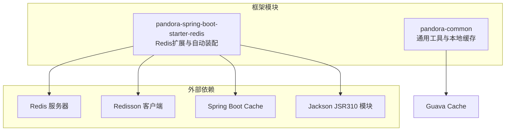
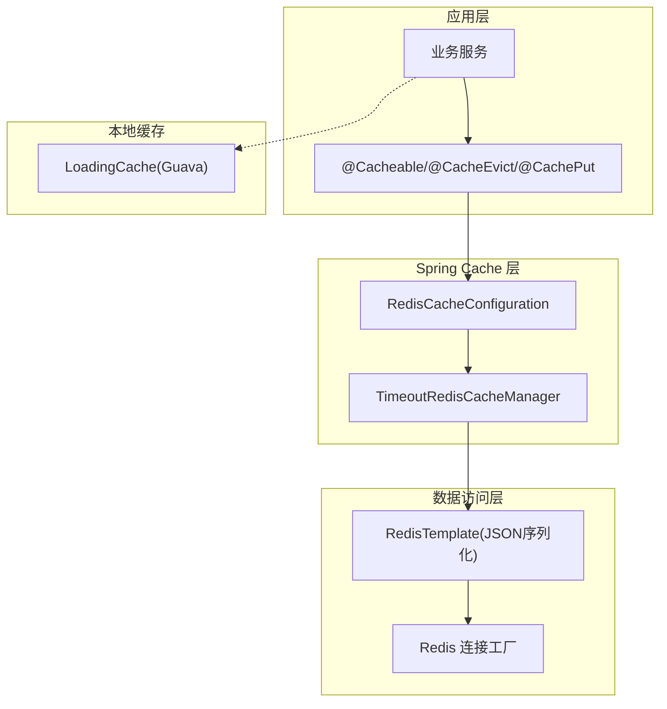
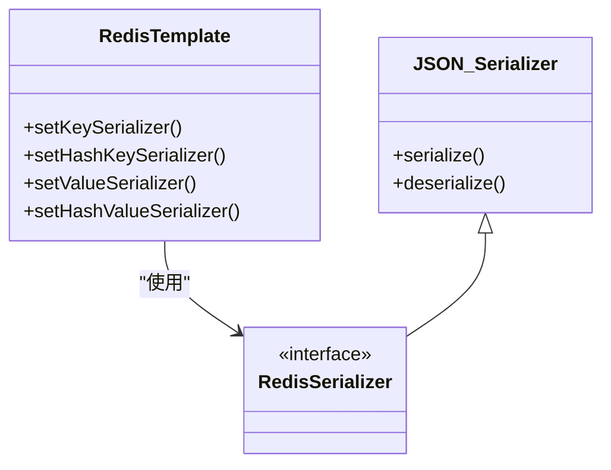
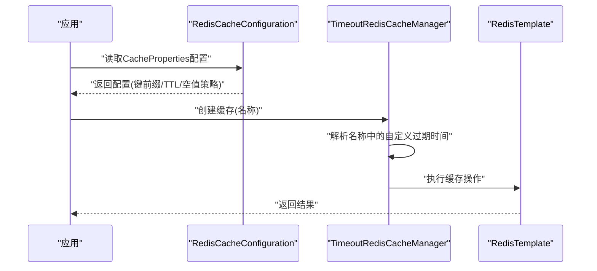
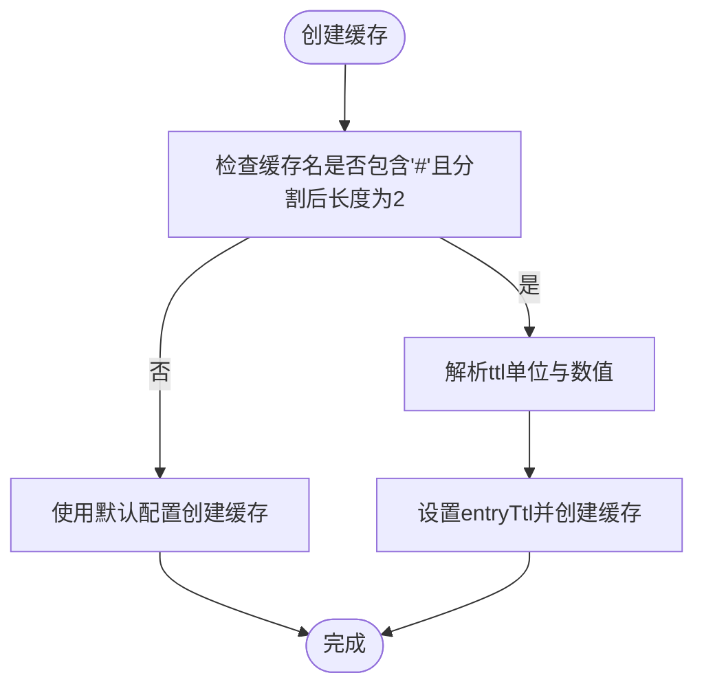
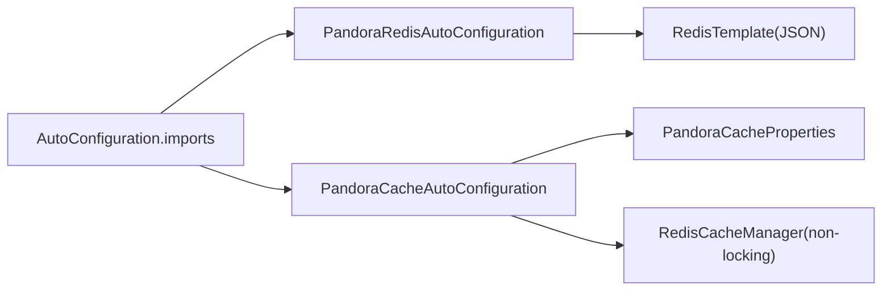
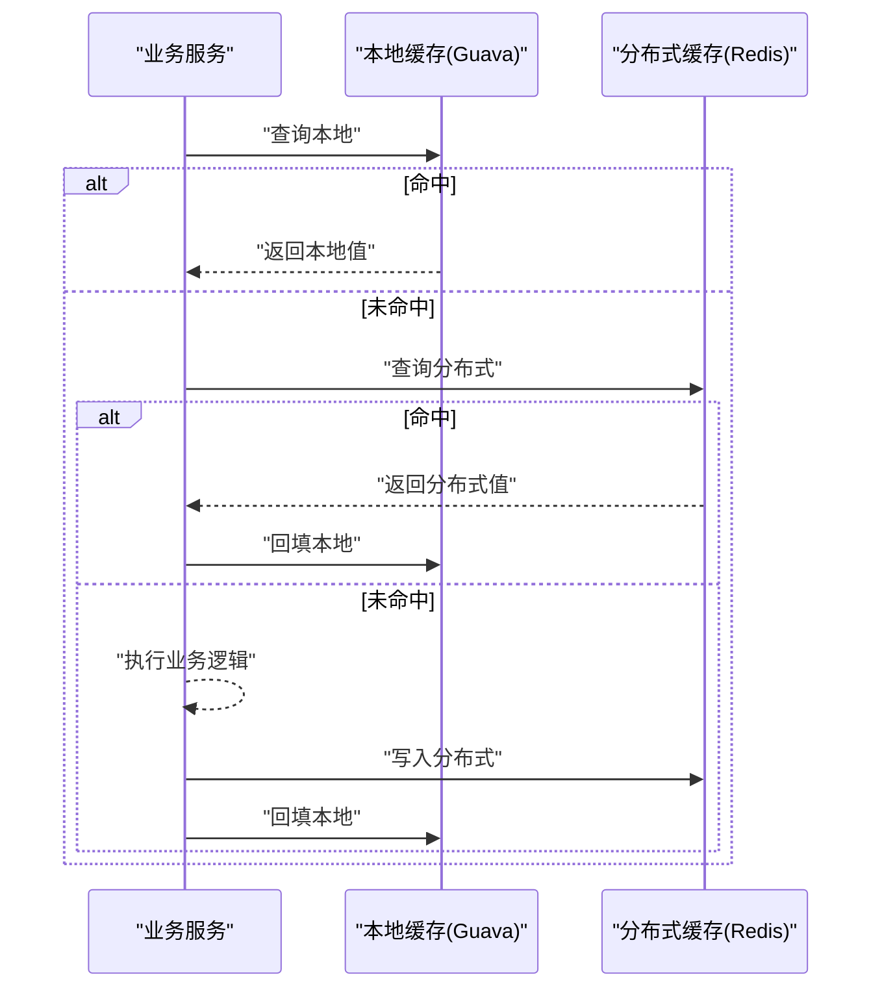
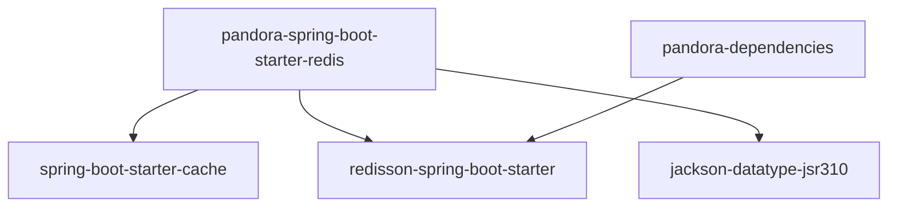

# 缓存集成

<cite>
**本文引用的文件**   
- [pandora-spring-boot-starter-redis/pom.xml](file://pandora-framework/pandora-spring-boot-starter-redis/pom.xml)
- [pandora-spring-boot-starter-redis/src/main/resources/META-INF/spring/org.springframework.boot.autoconfigure.AutoConfiguration.imports](file://pandora-framework/pandora-spring-boot-starter-redis/src/main/resources/META-INF/spring/org.springframework.boot.autoconfigure.AutoConfiguration.imports)
- [pandora-spring-boot-starter-redis/src/main/java/net/ittimeline/pandora/framework/redis/config/PandoraRedisAutoConfiguration.java](file://pandora-framework/pandora-spring-boot-starter-redis/src/main/java/net/ittimeline/pandora/framework/redis/config/PandoraRedisAutoConfiguration.java)
- [pandora-spring-boot-starter-redis/src/main/java/net/ittimeline/pandora/framework/redis/config/PandoraCacheAutoConfiguration.java](file://pandora-framework/pandora-spring-boot-starter-redis/src/main/java/net/ittimeline/pandora/framework/redis/config/PandoraCacheAutoConfiguration.java)
- [pandora-spring-boot-starter-redis/src/main/java/net/ittimeline/pandora/framework/redis/config/PandoraCacheProperties.java](file://pandora-framework/pandora-spring-boot-starter-redis/src/main/java/net/ittimeline/pandora/framework/redis/config/PandoraCacheProperties.java)
- [pandora-spring-boot-starter-redis/src/main/java/net/ittimeline/pandora/framework/redis/core/TimeoutRedisCacheManager.java](file://pandora-framework/pandora-spring-boot-starter-redis/src/main/java/net/ittimeline/pandora/framework/redis/core/TimeoutRedisCacheManager.java)
- [pandora-common/src/main/java/net/ittimeline/pandora/framework/common/util/web/cache/CacheUtils.java](file://pandora-framework/pandora-common/src/main/java/net/ittimeline/pandora/framework/common/util/web/cache/CacheUtils.java)
- [pandora-dependencies/pom.xml](file://pandora-dependencies/pom.xml)
</cite>

## 目录
1. [简介](#简介)
2. [项目结构](#项目结构)
3. [核心组件](#核心组件)
4. [架构总览](#架构总览)
5. [详细组件分析](#详细组件分析)
6. [依赖分析](#依赖分析)
7. [性能考量](#性能考量)
8. [故障排查指南](#故障排查指南)
9. [结论](#结论)
10. [附录](#附录)

## 简介
本指南面向Pandora Cloud框架的缓存集成，聚焦于Redis、Redisson与本地缓存的协同使用，覆盖以下主题：
- Redis与Spring Cache的自动装配与配置
- 自定义过期时间、键前缀、序列化策略
- Redisson在框架中的定位与依赖
- 本地缓存（Guava Cache）工具类的使用建议
- 缓存穿透、击穿、雪崩的防护思路与落地要点
- 常见注解（@Cacheable、@CacheEvict、@CachePut）的使用路径与最佳实践
- 性能监控、容量规划与故障处理
- Redis哨兵与集群部署的配置要点（概念性说明）

## 项目结构
Pandora Cloud的缓存能力由独立的starter模块提供，核心位于pandora-spring-boot-starter-redis中，配合通用工具模块pandora-common提供本地缓存能力。

图表来源
- [pandora-spring-boot-starter-redis/pom.xml:19-40](file://pandora-framework/pandora-spring-boot-starter-redis/pom.xml#L19-L40)
- [pandora-dependencies/pom.xml:264-269](file://pandora-dependencies/pom.xml#L264-L269)

章节来源
- [pandora-spring-boot-starter-redis/pom.xml:19-40](file://pandora-framework/pandora-spring-boot-starter-redis/pom.xml#L19-L40)
- [pandora-dependencies/pom.xml:264-269](file://pandora-dependencies/pom.xml#L264-L269)

## 核心组件
- Redis自动配置与模板
  - RedisTemplate与序列化：KEY使用字符串序列化，VALUE使用JSON序列化（含JavaTimeModule支持）
  - Redisson自动装配前置，确保自定义RedisTemplate优先生效
- Cache自动配置
  - 启用@EnableCaching，构建RedisCacheConfiguration，支持键前缀、TTL、空值缓存开关
  - 使用TimeoutRedisCacheManager实现按缓存名动态定制过期时间
- 配置属性
  - pandora.cache.redisScanBatchSize：scan批量大小
- 本地缓存工具
  - 提供基于Guava Cache的LoadingCache构建方法，支持同步与异步刷新

章节来源
- [pandora-spring-boot-starter-redis/src/main/java/net/ittimeline/pandora/framework/redis/config/PandoraRedisAutoConfiguration.java:25-46](file://pandora-framework/pandora-spring-boot-starter-redis/src/main/java/net/ittimeline/pandora/framework/redis/config/PandoraRedisAutoConfiguration.java#L25-L46)
- [pandora-spring-boot-starter-redis/src/main/java/net/ittimeline/pandora/framework/redis/config/PandoraCacheAutoConfiguration.java:40-83](file://pandora-framework/pandora-spring-boot-starter-redis/src/main/java/net/ittimeline/pandora/framework/redis/config/PandoraCacheAutoConfiguration.java#L40-L83)
- [pandora-spring-boot-starter-redis/src/main/java/net/ittimeline/pandora/framework/redis/config/PandoraCacheProperties.java:14-29](file://pandora-framework/pandora-spring-boot-starter-redis/src/main/java/net/ittimeline/pandora/framework/redis/config/PandoraCacheProperties.java#L14-L29)
- [pandora-common/src/main/java/net/ittimeline/pandora/framework/common/util/web/cache/CacheUtils.java:37-59](file://pandora-framework/pandora-common/src/main/java/net/ittimeline/pandora/framework/common/util/web/cache/CacheUtils.java#L37-L59)

## 架构总览
Pandora Cloud的缓存架构以Spring Cache为核心，结合Redis作为后端存储，并通过自定义的TimeoutRedisCacheManager实现按缓存名的动态过期控制；同时提供本地缓存工具类用于热点数据的低延迟访问。

图表来源
- [pandora-spring-boot-starter-redis/src/main/java/net/ittimeline/pandora/framework/redis/config/PandoraCacheAutoConfiguration.java:40-83](file://pandora-framework/pandora-spring-boot-starter-redis/src/main/java/net/ittimeline/pandora/framework/redis/config/PandoraCacheAutoConfiguration.java#L40-L83)
- [pandora-spring-boot-starter-redis/src/main/java/net/ittimeline/pandora/framework/redis/core/TimeoutRedisCacheManager.java:19-50](file://pandora-framework/pandora-spring-boot-starter-redis/src/main/java/net/ittimeline/pandora/framework/redis/core/TimeoutRedisCacheManager.java#L19-L50)
- [pandora-common/src/main/java/net/ittimeline/pandora/framework/common/util/web/cache/CacheUtils.java:37-59](file://pandora-framework/pandora-common/src/main/java/net/ittimeline/pandora/framework/common/util/web/cache/CacheUtils.java#L37-L59)

## 详细组件分析

### Redis自动配置与模板
- RedisTemplate
  - KEY/HashKey：字符串序列化
  - VALUE/HashValue：JSON序列化（内置JavaTimeModule，适配LocalDateTime等JSR310类型）
- Redisson自动装配前置
  - 保证框架自定义的RedisTemplate优先于Redisson的自动配置生效

图表来源
- [pandora-spring-boot-starter-redis/src/main/java/net/ittimeline/pandora/framework/redis/config/PandoraRedisAutoConfiguration.java:25-46](file://pandora-framework/pandora-spring-boot-starter-redis/src/main/java/net/ittimeline/pandora/framework/redis/config/PandoraRedisAutoConfiguration.java#L25-L46)

章节来源
- [pandora-spring-boot-starter-redis/src/main/java/net/ittimeline/pandora/framework/redis/config/PandoraRedisAutoConfiguration.java:25-46](file://pandora-framework/pandora-spring-boot-starter-redis/src/main/java/net/ittimeline/pandora/framework/redis/config/PandoraRedisAutoConfiguration.java#L25-L46)

### Cache自动配置与键前缀、TTL
- RedisCacheConfiguration
  - computePrefixWith：根据CacheProperties.redis.keyPrefix计算键前缀，避免Redis Desktop Manager显示空格问题
  - serializeValuesWith：统一使用JSON序列化
  - entryTtl/disableCachingNullValues/disableKeyPrefix：根据CacheProperties.redis配置生效
- RedisCacheManager
  - 使用非锁定写入与scan批量策略，提升大规模键扫描性能
  - 通过TimeoutRedisCacheManager实现按缓存名动态过期

图表来源
- [pandora-spring-boot-starter-redis/src/main/java/net/ittimeline/pandora/framework/redis/config/PandoraCacheAutoConfiguration.java:40-83](file://pandora-framework/pandora-spring-boot-starter-redis/src/main/java/net/ittimeline/pandora/framework/redis/config/PandoraCacheAutoConfiguration.java#L40-L83)
- [pandora-spring-boot-starter-redis/src/main/java/net/ittimeline/pandora/framework/redis/core/TimeoutRedisCacheManager.java:27-50](file://pandora-framework/pandora-spring-boot-starter-redis/src/main/java/net/ittimeline/pandora/framework/redis/core/TimeoutRedisCacheManager.java#L27-L50)

章节来源
- [pandora-spring-boot-starter-redis/src/main/java/net/ittimeline/pandora/framework/redis/config/PandoraCacheAutoConfiguration.java:40-83](file://pandora-framework/pandora-spring-boot-starter-redis/src/main/java/net/ittimeline/pandora/framework/redis/config/PandoraCacheAutoConfiguration.java#L40-L83)

### 自定义过期时间机制
- 规则
  - 缓存名格式：name#ttl单位，例如“userCache#30m”
  - 支持单位：d（天）、h（小时）、m（分钟）、s（秒），默认秒
- 实现
  - TimeoutRedisCacheManager在创建缓存时解析名称，移除ttl部分并设置entryTtl
  - 未匹配规则时回退到默认配置

图表来源
- [pandora-spring-boot-starter-redis/src/main/java/net/ittimeline/pandora/framework/redis/core/TimeoutRedisCacheManager.java:27-82](file://pandora-framework/pandora-spring-boot-starter-redis/src/main/java/net/ittimeline/pandora/framework/redis/core/TimeoutRedisCacheManager.java#L27-L82)

章节来源
- [pandora-spring-boot-starter-redis/src/main/java/net/ittimeline/pandora/framework/redis/core/TimeoutRedisCacheManager.java:27-82](file://pandora-framework/pandora-spring-boot-starter-redis/src/main/java/net/ittimeline/pandora/framework/redis/core/TimeoutRedisCacheManager.java#L27-L82)

### 配置属性与自动注册
- 自动配置入口
  - 通过META-INF/spring/org.springframework.boot.autoconfigure.AutoConfiguration.imports声明
- 配置项
  - pandora.cache.redisScanBatchSize：scan批量大小，默认30
- 依赖
  - spring-boot-starter-cache：启用Spring Cache
  - redisson-spring-boot-starter：Redisson客户端
  - jackson-datatype-jsr310：JSR310时间模块

图表来源
- [pandora-spring-boot-starter-redis/src/main/resources/META-INF/spring/org.springframework.boot.autoconfigure.AutoConfiguration.imports:1-2](file://pandora-framework/pandora-spring-boot-starter-redis/src/main/resources/META-INF/spring/org.springframework.boot.autoconfigure.AutoConfiguration.imports#L1-L2)
- [pandora-spring-boot-starter-redis/pom.xml:31-39](file://pandora-framework/pandora-spring-boot-starter-redis/pom.xml#L31-L39)

章节来源
- [pandora-spring-boot-starter-redis/src/main/resources/META-INF/spring/org.springframework.boot.autoconfigure.AutoConfiguration.imports:1-2](file://pandora-framework/pandora-spring-boot-starter-redis/src/main/resources/META-INF/spring/org.springframework.boot.autoconfigure.AutoConfiguration.imports#L1-L2)
- [pandora-spring-boot-starter-redis/pom.xml:31-39](file://pandora-framework/pandora-spring-boot-starter-redis/pom.xml#L31-L39)

### 本地缓存与混合使用
- 本地缓存工具
  - buildAsyncReloadingCache：异步刷新LoadingCache，适合高并发场景
  - buildCache：同步刷新LoadingCache，适合与线程上下文绑定的场景
- 混合策略
  - 本地缓存用于热点数据的低延迟访问
  - 分布式缓存用于跨实例共享与一致性保障
  - 建议：热点数据先查本地，未命中再查分布式缓存，命中后回填本地

图表来源
- [pandora-common/src/main/java/net/ittimeline/pandora/framework/common/util/web/cache/CacheUtils.java:37-59](file://pandora-framework/pandora-common/src/main/java/net/ittimeline/pandora/framework/common/util/web/cache/CacheUtils.java#L37-L59)

章节来源
- [pandora-common/src/main/java/net/ittimeline/pandora/framework/common/util/web/cache/CacheUtils.java:37-59](file://pandora-framework/pandora-common/src/main/java/net/ittimeline/pandora/framework/common/util/web/cache/CacheUtils.java#L37-L59)

### 注解使用与最佳实践
- @Cacheable
  - 用途：读取缓存；未命中时执行方法并将结果写入缓存
  - 建议：为热点查询设置合理TTL；必要时使用自定义过期时间命名
- @CacheEvict
  - 用途：清除缓存；可用于更新后清理
  - 建议：批量删除时注意key前缀一致性；或使用通配策略
- @CachePut
  - 用途：直接写入缓存，不参与条件判断
  - 建议：与@CacheEvict组合使用，确保缓存与数据一致性
- 最佳实践
  - 明确key生成策略，避免缓存污染
  - 对空值也做缓存时需谨慎，防止缓存穿透
  - 对热点key设置短TTL并开启异步刷新

章节来源
- [pandora-spring-boot-starter-redis/src/main/java/net/ittimeline/pandora/framework/redis/config/PandoraCacheAutoConfiguration.java:40-83](file://pandora-framework/pandora-spring-boot-starter-redis/src/main/java/net/ittimeline/pandora/framework/redis/config/PandoraCacheAutoConfiguration.java#L40-L83)

### 缓存防护策略（概念性说明）
- 缓存穿透
  - 现象：查询不存在的数据导致频繁穿透到后端
  - 防护：缓存空值（需设置短TTL）；布隆过滤器预筛
- 缓存击穿
  - 现象：热点Key过期瞬间大量并发请求
  - 防护：互斥锁（Redisson分布式锁）；热点Key永不过期+后台异步刷新
- 缓存雪崩
  - 现象：大量Key同时过期导致瞬时压力
  - 防护：TTL加随机抖动；多级缓存（本地+分布式）；限流降载

## 依赖分析
- starter模块依赖
  - spring-boot-starter-cache：启用@EnableCaching与自动装配
  - redisson-spring-boot-starter：提供Redisson客户端能力
  - jackson-datatype-jsr310：支持Java时间类型的JSON序列化
- 依赖管理
  - Redisson版本在pandora-dependencies中集中管理

图表来源
- [pandora-spring-boot-starter-redis/pom.xml:31-39](file://pandora-framework/pandora-spring-boot-starter-redis/pom.xml#L31-L39)
- [pandora-dependencies/pom.xml:264-269](file://pandora-dependencies/pom.xml#L264-L269)

章节来源
- [pandora-spring-boot-starter-redis/pom.xml:31-39](file://pandora-framework/pandora-spring-boot-starter-redis/pom.xml#L31-L39)
- [pandora-dependencies/pom.xml:264-269](file://pandora-dependencies/pom.xml#L264-L269)

## 性能考量
- 序列化
  - 使用JSON序列化统一VALUE，减少反序列化开销；注意字段变更的兼容性
- 键前缀
  - 统一键前缀避免不同模块间的键冲突，便于运维与清理
- 批量扫描
  - 非锁定写入与scan批量策略降低写入阻塞与扫描成本
- 过期策略
  - 热点数据采用短TTL+异步刷新；冷数据采用长TTL
- 本地缓存
  - 热点数据本地驻留，显著降低Redis压力

## 故障排查指南
- 常见问题
  - 键前缀异常：确认CacheProperties.redis.keyPrefix配置与computePrefixWith逻辑
  - TTL未生效：检查缓存名是否符合“name#ttl单位”格式
  - 序列化异常：确认JSON序列化器与JavaTimeModule已正确注册
  - Redisson冲突：确认PandoraRedisAutoConfiguration在Redisson自动装配之前生效
- 排查步骤
  - 检查AutoConfiguration导入文件是否生效
  - 校验RedisTemplate序列化配置
  - 使用scan命令验证键前缀与批量扫描行为
  - 关注本地缓存最大容量与刷新策略

章节来源
- [pandora-spring-boot-starter-redis/src/main/resources/META-INF/spring/org.springframework.boot.autoconfigure.AutoConfiguration.imports:1-2](file://pandora-framework/pandora-spring-boot-starter-redis/src/main/resources/META-INF/spring/org.springframework.boot.autoconfigure.AutoConfiguration.imports#L1-L2)
- [pandora-spring-boot-starter-redis/src/main/java/net/ittimeline/pandora/framework/redis/config/PandoraRedisAutoConfiguration.java:25-46](file://pandora-framework/pandora-spring-boot-starter-redis/src/main/java/net/ittimeline/pandora/framework/redis/config/PandoraRedisAutoConfiguration.java#L25-L46)
- [pandora-spring-boot-starter-redis/src/main/java/net/ittimeline/pandora/framework/redis/core/TimeoutRedisCacheManager.java:27-82](file://pandora-framework/pandora-spring-boot-starter-redis/src/main/java/net/ittimeline/pandora/framework/redis/core/TimeoutRedisCacheManager.java#L27-L82)

## 结论
Pandora Cloud的缓存集成以Spring Cache为核心，结合Redis与Redisson，提供了灵活的键前缀、TTL与序列化配置，并通过TimeoutRedisCacheManager实现了按缓存名的动态过期。配合本地缓存工具类，可在热点场景获得更优性能。建议在生产环境中结合业务特征，制定合理的过期策略、防护策略与监控方案。

## 附录
- Redis哨兵与集群部署（概念性说明）
  - 哨兵模式：主从高可用，自动故障转移
  - 集群模式：分片存储，水平扩展
  - 在Spring Boot中通常通过连接URL或配置中心指定节点列表，确保与RedisTemplate的序列化策略一致