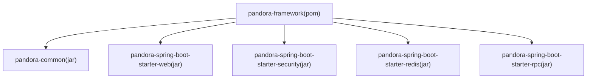
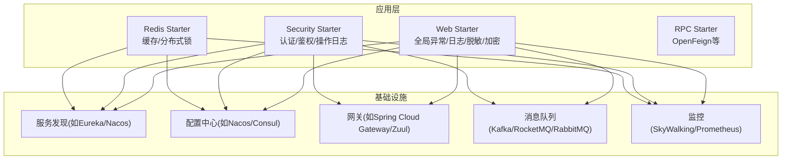
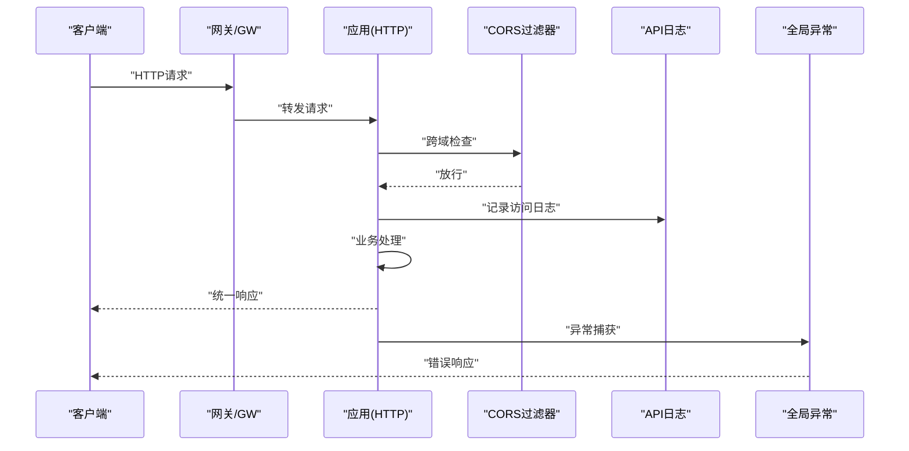
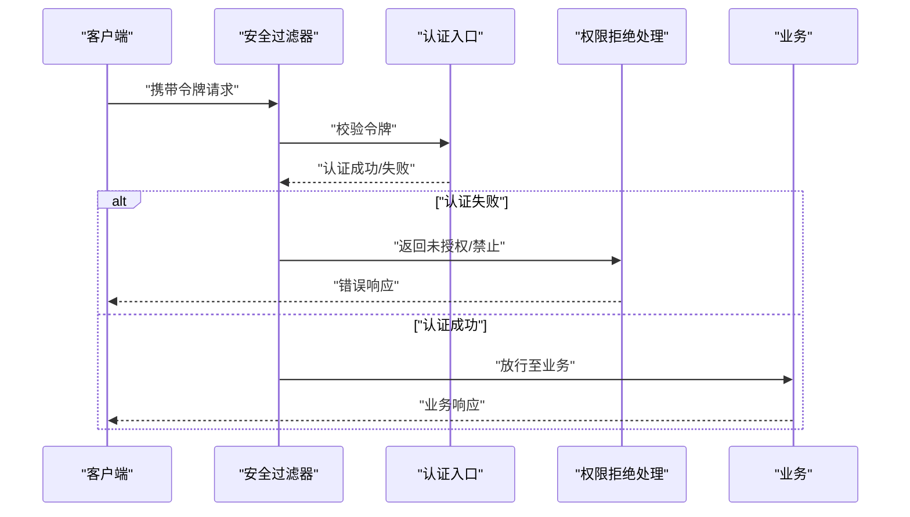
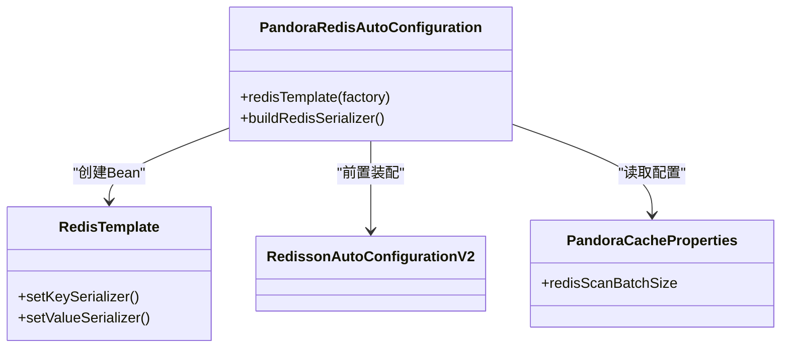
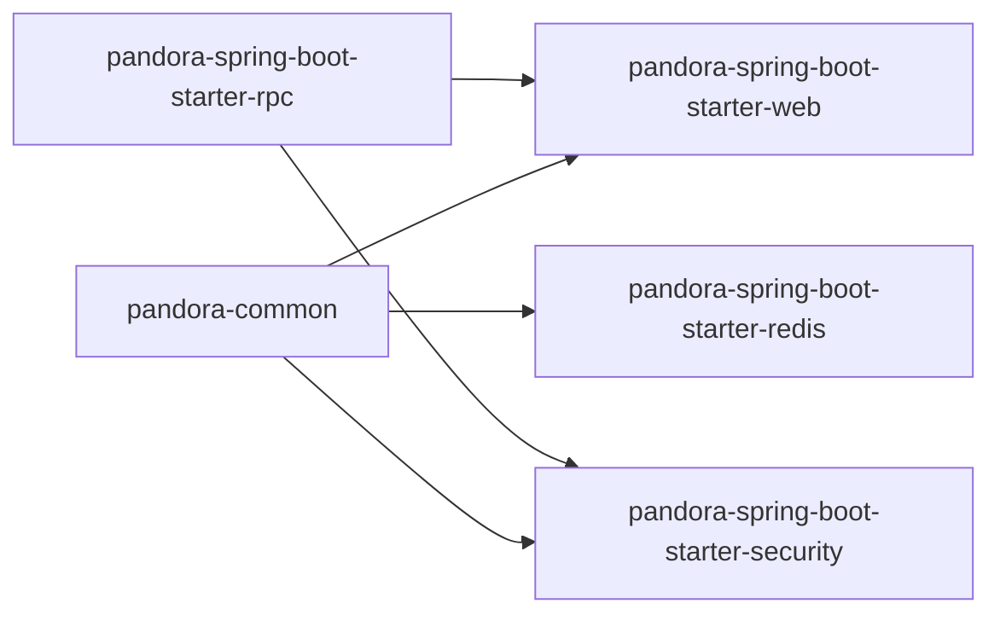

# 集成指南

<cite>
**本文引用的文件**
- [README.md](file://README.md)
- [pandora-framework/pom.xml](file://pandora-framework/pom.xml)
- [pandora-framework/pandora-common/pom.xml](file://pandora-framework/pandora-common/pom.xml)
- [pandora-framework/pandora-spring-boot-starter-web/pom.xml](file://pandora-framework/pandora-spring-boot-starter-web/pom.xml)
- [pandora-framework/pandora-spring-boot-starter-security/pom.xml](file://pandora-framework/pandora-spring-boot-starter-security/pom.xml)
- [pandora-framework/pandora-spring-boot-starter-redis/pom.xml](file://pandora-framework/pandora-spring-boot-starter-redis/pom.xml)
- [pandora-framework/pandora-spring-boot-starter-web/src/main/resources/META-INF/spring/org.springframework.boot.autoconfigure.AutoConfiguration.imports](file://pandora-framework/pandora-spring-boot-starter-web/src/main/resources/META-INF/spring/org.springframework.boot.autoconfigure.AutoConfiguration.imports)
- [pandora-framework/pandora-spring-boot-starter-security/src/main/resources/META-INF/spring/org.springframework.boot.autoconfigure.AutoConfiguration.imports](file://pandora-framework/pandora-spring-boot-starter-security/src/main/resources/META-INF/spring/org.springframework.boot.autoconfigure.AutoConfiguration.imports)
- [pandora-framework/pandora-spring-boot-starter-redis/src/main/resources/META-INF/spring/org.springframework.boot.autoconfigure.AutoConfiguration.imports](file://pandora-framework/pandora-spring-boot-starter-redis/src/main/resources/META-INF/spring/org.springframework.boot.autoconfigure.AutoConfiguration.imports)
- [pandora-framework/pandora-spring-boot-starter-web/src/main/java/net/ittimeline/pandora/framework/web/config/PandoraWebAutoConfiguration.java](file://pandora-framework/pandora-spring-boot-starter-web/src/main/java/net/ittimeline/pandora/framework/web/config/PandoraWebAutoConfiguration.java)
- [pandora-framework/pandora-spring-boot-starter-web/src/main/java/net/ittimeline/pandora/framework/web/config/WebProperties.java](file://pandora-framework/pandora-spring-boot-starter-web/src/main/java/net/ittimeline/pandora/framework/web/config/WebProperties.java)
- [pandora-framework/pandora-spring-boot-starter-security/src/main/java/net/ittimeline/pandora/framework/security/config/PandoraSecurityAutoConfiguration.java](file://pandora-framework/pandora-spring-boot-starter-security/src/main/java/net/ittimeline/pandora/framework/security/config/PandoraSecurityAutoConfiguration.java)
- [pandora-framework/pandora-spring-boot-starter-security/src/main/java/net/ittimeline/pandora/framework/security/config/SecurityProperties.java](file://pandora-framework/pandora-spring-boot-starter-security/src/main/java/net/ittimeline/pandora/framework/security/config/SecurityProperties.java)
- [pandora-framework/pandora-spring-boot-starter-redis/src/main/java/net/ittimeline/pandora/framework/redis/config/PandoraRedisAutoConfiguration.java](file://pandora-framework/pandora-spring-boot-starter-redis/src/main/java/net/ittimeline/pandora/framework/redis/config/PandoraRedisAutoConfiguration.java)
- [pandora-framework/pandora-spring-boot-starter-redis/src/main/java/net/ittimeline/pandora/framework/redis/config/PandoraCacheProperties.java](file://pandora-framework/pandora-spring-boot-starter-redis/src/main/java/net/ittimeline/pandora/framework/redis/config/PandoraCacheProperties.java)
</cite>

## 目录
1. [简介](#简介)
2. [项目结构](#项目结构)
3. [核心组件](#核心组件)
4. [架构总览](#架构总览)
5. [详细组件分析](#详细组件分析)
6. [依赖关系分析](#依赖关系分析)
7. [性能考量](#性能考量)
8. [故障排查指南](#故障排查指南)
9. [结论](#结论)
10. [附录](#附录)

## 简介
本指南面向在微服务与Spring Cloud生态中集成Pandora Cloud框架的工程团队，目标是帮助您快速完成与服务发现、配置中心、网关、数据库、缓存、消息队列以及监控系统的集成；同时覆盖安全、服务治理、负载均衡、熔断降级等高级特性，并提供可落地的配置模板、集成步骤、测试策略与部署建议。

## 项目结构
Pandora Cloud以模块化方式组织，核心由以下模块构成：
- pandora-dependencies：BOM管理
- pandora-framework：框架封装，包含多个starter模块
  - pandora-common：公共POJO、枚举、工具与依赖
  - pandora-spring-boot-starter-web：Web层增强（全局异常、API日志、脱敏、加密、OpenAPI等）
  - pandora-spring-boot-starter-security：安全与操作日志
  - pandora-spring-boot-starter-redis：Redis与缓存封装
  - pandora-spring-boot-starter-rpc：RPC相关（OpenFeign等）

图表来源
- [pandora-framework/pom.xml:26-32](file://pandora-framework/pom.xml#L26-L32)

章节来源
- [README.md:1-15](file://README.md#L1-L15)
- [pandora-framework/pom.xml:15-32](file://pandora-framework/pom.xml#L15-L32)

## 核心组件
- Web增强组件：提供全局异常、统一响应包装、请求体缓存复用、跨域、RestTemplate（含负载均衡）等能力
- 安全组件：提供认证入口、鉴权拒绝处理、BCrypt密码编码器、Token认证过滤器、安全上下文策略、免登录URL白名单等
- 缓存组件：基于Redisson与Spring Cache，提供JSON序列化的RedisTemplate与缓存扫描批大小配置

章节来源
- [pandora-framework/pandora-spring-boot-starter-web/pom.xml:19-46](file://pandora-framework/pandora-spring-boot-starter-web/pom.xml#L19-L46)
- [pandora-framework/pandora-spring-boot-starter-security/pom.xml:23-55](file://pandora-framework/pandora-spring-boot-starter-security/pom.xml#L23-L55)
- [pandora-framework/pandora-spring-boot-starter-redis/pom.xml:19-40](file://pandora-framework/pandora-spring-boot-starter-redis/pom.xml#L19-L40)

## 架构总览
下图展示了Pandora Cloud在Spring Boot/Spring Cloud生态中的定位与交互要点：Web层负责HTTP接入与安全拦截，安全层负责认证授权，缓存层提供高性能存储与分布式能力，公共模块提供基础能力与工具。

## 详细组件分析

### Web组件（全局异常、API日志、跨域、RestTemplate）
- 自动装配导入清单：包含横幅、Jackson、Web、API日志、Swagger、XSS、加密等自动配置
- 关键能力
  - 统一前缀：按包路径动态为不同API前缀（如/app-api、/admin-api）绑定控制器
  - 全局异常：统一捕获并上报错误日志
  - 统一响应：统一封装返回体
  - 跨域：预设允许所有来源/头/方法
  - 请求体缓存：支持重复读取请求体
  - RestTemplate：提供普通与带负载均衡的实例
- 配置项（WebProperties）
  - appApi/adminApi：前缀与包匹配规则
  - adminUi：管理界面访问地址

图表来源
- [pandora-framework/pandora-spring-boot-starter-web/src/main/java/net/ittimeline/pandora/framework/web/config/PandoraWebAutoConfiguration.java:43-91](file://pandora-framework/pandora-spring-boot-starter-web/src/main/java/net/ittimeline/pandora/framework/web/config/PandoraWebAutoConfiguration.java#L43-L91)
- [pandora-framework/pandora-spring-boot-starter-web/src/main/java/net/ittimeline/pandora/framework/web/config/PandoraWebAutoConfiguration.java:116-152](file://pandora-framework/pandora-spring-boot-starter-web/src/main/java/net/ittimeline/pandora/framework/web/config/PandoraWebAutoConfiguration.java#L116-L152)
- [pandora-framework/pandora-spring-boot-starter-web/src/main/java/net/ittimeline/pandora/framework/web/config/PandoraWebAutoConfiguration.java:159-175](file://pandora-framework/pandora-spring-boot-starter-web/src/main/java/net/ittimeline/pandora/framework/web/config/PandoraWebAutoConfiguration.java#L159-L175)

章节来源
- [pandora-framework/pandora-spring-boot-starter-web/src/main/resources/META-INF/spring/org.springframework.boot.autoconfigure.AutoConfiguration.imports:1-8](file://pandora-framework/pandora-spring-boot-starter-web/src/main/resources/META-INF/spring/org.springframework.boot.autoconfigure.AutoConfiguration.imports#L1-L8)
- [pandora-framework/pandora-spring-boot-starter-web/src/main/java/net/ittimeline/pandora/framework/web/config/PandoraWebAutoConfiguration.java:43-177](file://pandora-framework/pandora-spring-boot-starter-web/src/main/java/net/ittimeline/pandora/framework/web/config/PandoraWebAutoConfiguration.java#L43-L177)
- [pandora-framework/pandora-spring-boot-starter-web/src/main/java/net/ittimeline/pandora/framework/web/config/WebProperties.java:18-68](file://pandora-framework/pandora-spring-boot-starter-web/src/main/java/net/ittimeline/pandora/framework/web/config/WebProperties.java#L18-L68)

### 安全组件（认证、鉴权、操作日志）
- 自动装配导入清单：包含安全、Web安全、RPC安全、操作日志等自动配置
- 关键能力
  - 认证入口与拒绝处理
  - BCrypt密码编码器
  - Token认证过滤器（支持Header与参数两种携带方式）
  - 安全上下文策略（支持线程本地传递）
  - 免登录URL白名单
  - Mock模式与密钥
- 配置项（SecurityProperties）
  - tokenHeader/tokenParameter：令牌头与参数名
  - mockEnable/mockSecret：Mock开关与密钥
  - permitAllUrls：免登录URL列表
  - passwordEncoderLength：BCrypt成本因子

图表来源
- [pandora-framework/pandora-spring-boot-starter-security/src/main/java/net/ittimeline/pandora/framework/security/config/PandoraSecurityAutoConfiguration.java:36-99](file://pandora-framework/pandora-spring-boot-starter-security/src/main/java/net/ittimeline/pandora/framework/security/config/PandoraSecurityAutoConfiguration.java#L36-L99)

章节来源
- [pandora-framework/pandora-spring-boot-starter-security/src/main/resources/META-INF/spring/org.springframework.boot.autoconfigure.AutoConfiguration.imports:1-6](file://pandora-framework/pandora-spring-boot-starter-security/src/main/resources/META-INF/spring/org.springframework.boot.autoconfigure.AutoConfiguration.imports#L1-L6)
- [pandora-framework/pandora-spring-boot-starter-security/src/main/java/net/ittimeline/pandora/framework/security/config/PandoraSecurityAutoConfiguration.java:36-99](file://pandora-framework/pandora-spring-boot-starter-security/src/main/java/net/ittimeline/pandora/framework/security/config/PandoraSecurityAutoConfiguration.java#L36-L99)
- [pandora-framework/pandora-spring-boot-starter-security/src/main/java/net/ittimeline/pandora/framework/security/config/SecurityProperties.java:19-58](file://pandora-framework/pandora-spring-boot-starter-security/src/main/java/net/ittimeline/pandora/framework/security/config/SecurityProperties.java#L19-L58)

### 缓存组件（Redis与Cache）
- 自动装配导入清单：包含Redis与Cache自动配置
- 关键能力
  - 自定义RedisTemplate：KEY使用字符串序列化，VALUE使用JSON序列化（含JavaTimeModule）
  - 支持Redisson与Spring Cache
  - 缓存扫描批大小配置（用于批量扫描场景）
- 依赖要点
  - Redisson Spring Boot Starter
  - Spring Boot Starter Cache
  - Jackson JSR310扩展

图表来源
- [pandora-framework/pandora-spring-boot-starter-redis/src/main/java/net/ittimeline/pandora/framework/redis/config/PandoraRedisAutoConfiguration.java:19-50](file://pandora-framework/pandora-spring-boot-starter-redis/src/main/java/net/ittimeline/pandora/framework/redis/config/PandoraRedisAutoConfiguration.java#L19-L50)
- [pandora-framework/pandora-spring-boot-starter-redis/src/main/java/net/ittimeline/pandora/framework/redis/config/PandoraCacheProperties.java:14-30](file://pandora-framework/pandora-spring-boot-starter-redis/src/main/java/net/ittimeline/pandora/framework/redis/config/PandoraCacheProperties.java#L14-L30)

章节来源
- [pandora-framework/pandora-spring-boot-starter-redis/src/main/resources/META-INF/spring/org.springframework.boot.autoconfigure.AutoConfiguration.imports:1-2](file://pandora-framework/pandora-spring-boot-starter-redis/src/main/resources/META-INF/spring/org.springframework.boot.autoconfigure.AutoConfiguration.imports#L1-L2)
- [pandora-framework/pandora-spring-boot-starter-redis/src/main/java/net/ittimeline/pandora/framework/redis/config/PandoraRedisAutoConfiguration.java:19-50](file://pandora-framework/pandora-spring-boot-starter-redis/src/main/java/net/ittimeline/pandora/framework/redis/config/PandoraRedisAutoConfiguration.java#L19-L50)
- [pandora-framework/pandora-spring-boot-starter-redis/src/main/java/net/ittimeline/pandora/framework/redis/config/PandoraCacheProperties.java:14-30](file://pandora-framework/pandora-spring-boot-starter-redis/src/main/java/net/ittimeline/pandora/framework/redis/config/PandoraCacheProperties.java#L14-L30)

### 公共模块（基础能力与工具）
- 依赖范围：多数依赖标记为provided，便于在API模块或业务模块中按需使用
- 关注点
  - SkyWalking追踪工具
  - VO翻译组件
  - OpenAPI依赖（provided）
  - AOP、Servlet、Jackson、Guava、Validation等

章节来源
- [pandora-framework/pandora-common/pom.xml:26-114](file://pandora-framework/pandora-common/pom.xml#L26-L114)

## 依赖关系分析
- Web Starter依赖common与rpc，提供Web与OpenAPI能力
- Security Starter依赖common与web/rpc，提供安全与操作日志能力
- Redis Starter依赖common与redisson、cache、jackson-jsr310
- common模块为各starter提供基础能力

图表来源
- [pandora-framework/pandora-spring-boot-starter-web/pom.xml:20-28](file://pandora-framework/pandora-spring-boot-starter-web/pom.xml#L20-L28)
- [pandora-framework/pandora-spring-boot-starter-security/pom.xml:24-38](file://pandora-framework/pandora-spring-boot-starter-security/pom.xml#L24-L38)
- [pandora-framework/pandora-spring-boot-starter-redis/pom.xml:19-40](file://pandora-framework/pandora-spring-boot-starter-redis/pom.xml#L19-L40)

章节来源
- [pandora-framework/pandora-spring-boot-starter-web/pom.xml:19-46](file://pandora-framework/pandora-spring-boot-starter-web/pom.xml#L19-L46)
- [pandora-framework/pandora-spring-boot-starter-security/pom.xml:23-55](file://pandora-framework/pandora-spring-boot-starter-security/pom.xml#L23-L55)
- [pandora-framework/pandora-spring-boot-starter-redis/pom.xml:19-40](file://pandora-framework/pandora-spring-boot-starter-redis/pom.xml#L19-L40)

## 性能考量
- 负载均衡与RestTemplate
  - Web组件提供带负载均衡的RestTemplate Bean，便于服务间调用时启用客户端负载均衡
- 缓存与序列化
  - RedisTemplate使用JSON序列化，减少反序列化开销；Jackson注册JavaTimeModule，避免时间类型序列化问题
  - 缓存扫描批大小可调，平衡内存与网络占用
- 跨域与过滤器链
  - 明确过滤器顺序，确保跨域配置生效；请求体缓存仅在必要时开启，避免额外IO

章节来源
- [pandora-framework/pandora-spring-boot-starter-web/src/main/java/net/ittimeline/pandora/framework/web/config/PandoraWebAutoConfiguration.java:171-175](file://pandora-framework/pandora-spring-boot-starter-web/src/main/java/net/ittimeline/pandora/framework/web/config/PandoraWebAutoConfiguration.java#L171-L175)
- [pandora-framework/pandora-spring-boot-starter-redis/src/main/java/net/ittimeline/pandora/framework/redis/config/PandoraRedisAutoConfiguration.java:24-46](file://pandora-framework/pandora-spring-boot-starter-redis/src/main/java/net/ittimeline/pandora/framework/redis/config/PandoraRedisAutoConfiguration.java#L24-L46)
- [pandora-framework/pandora-spring-boot-starter-redis/src/main/java/net/ittimeline/pandora/framework/redis/config/PandoraCacheProperties.java:14-30](file://pandora-framework/pandora-spring-boot-starter-redis/src/main/java/net/ittimeline/pandora/framework/redis/config/PandoraCacheProperties.java#L14-L30)

## 故障排查指南
- 跨域不生效
  - 检查过滤器顺序是否正确；Web组件已将CORS过滤器置于特定顺序以确保生效
- 令牌校验失败
  - 确认请求头或参数名与配置一致；检查免登录白名单是否误放
- 重复读取请求体异常
  - 确认已启用请求体缓存过滤器；避免在未缓存的情况下多次读取
- 缓存序列化异常
  - 确保对象具备默认构造函数与可序列化字段；确认Jackson模块已注册

章节来源
- [pandora-framework/pandora-spring-boot-starter-web/src/main/java/net/ittimeline/pandora/framework/web/config/PandoraWebAutoConfiguration.java:116-152](file://pandora-framework/pandora-spring-boot-starter-web/src/main/java/net/ittimeline/pandora/framework/web/config/PandoraWebAutoConfiguration.java#L116-L152)
- [pandora-framework/pandora-spring-boot-starter-security/src/main/java/net/ittimeline/pandora/framework/security/config/SecurityProperties.java:23-58](file://pandora-framework/pandora-spring-boot-starter-security/src/main/java/net/ittimeline/pandora/framework/security/config/SecurityProperties.java#L23-L58)

## 结论
Pandora Cloud通过模块化设计与自动装配机制，为Spring Cloud生态提供了开箱即用的Web增强、安全与缓存能力。结合本文提供的集成步骤、配置模板与最佳实践，可在微服务架构中快速落地服务治理、负载均衡、熔断降级、安全与可观测性等关键能力。

## 附录

### Spring Cloud集成要点
- 服务发现
  - 推荐使用Nacos或Eureka，Web组件已内置RestTemplate负载均衡Bean，便于服务间调用
- 配置中心
  - 使用Nacos/Consul作为配置中心，配合Spring Cloud Config或原生配置加载
- 网关
  - 使用Spring Cloud Gateway或Zuul，结合Web组件的API前缀与跨域配置，统一入口与安全控制
- 监控
  - 引入SkyWalking或Prometheus+Grafana，利用公共模块中的追踪工具与指标采集

### 配置模板（YAML片段）
- Web配置（WebProperties）
  - 前缀与包匹配规则
  - 管理UI地址
- 安全配置（SecurityProperties）
  - 令牌头/参数名
  - 免登录白名单
  - Mock开关与密钥
  - BCrypt成本因子
- 缓存配置（PandoraCacheProperties）
  - Redis Scan批大小

章节来源
- [pandora-framework/pandora-spring-boot-starter-web/src/main/java/net/ittimeline/pandora/framework/web/config/WebProperties.java:18-68](file://pandora-framework/pandora-spring-boot-starter-web/src/main/java/net/ittimeline/pandora/framework/web/config/WebProperties.java#L18-L68)
- [pandora-framework/pandora-spring-boot-starter-security/src/main/java/net/ittimeline/pandora/framework/security/config/SecurityProperties.java:19-58](file://pandora-framework/pandora-spring-boot-starter-security/src/main/java/net/ittimeline/pandora/framework/security/config/SecurityProperties.java#L19-L58)
- [pandora-framework/pandora-spring-boot-starter-redis/src/main/java/net/ittimeline/pandora/framework/redis/config/PandoraCacheProperties.java:14-30](file://pandora-framework/pandora-spring-boot-starter-redis/src/main/java/net/ittimeline/pandora/framework/redis/config/PandoraCacheProperties.java#L14-L30)

### 高级特性与最佳实践
- 服务治理
  - 使用RestTemplate负载均衡与重试策略
  - 在网关层统一限流、熔断与灰度发布
- 负载均衡
  - 优先选择客户端LB（Ribbon/LoadBalancer），结合服务发现
- 熔断降级
  - 结合Resilience4j/Hystrix在网关或服务内实现
- 安全
  - 启用HTTPS、最小权限原则、令牌刷新与黑名单
- 监控
  - 链路追踪、指标采集、日志聚合与告警联动

### 集成测试策略
- 单元测试
  - 使用Spring Boot Test与Mockito验证Web、Security与Redis组件行为
- 集成测试
  - 搭建最小化环境（Nacos/Eureka、Redis、网关），进行端到端验证
- 性能测试
  - 使用JMeter/Locust压测，关注缓存命中率、RT与错误率

### 部署建议
- 环境隔离
  - 开发/测试/生产三环境分离，配置中心按环境管理
- 容器化
  - 使用Docker与Kubernetes，结合HPA与滚动更新
- 安全加固
  - 禁用不必要的端点暴露，启用WAF与DDoS防护