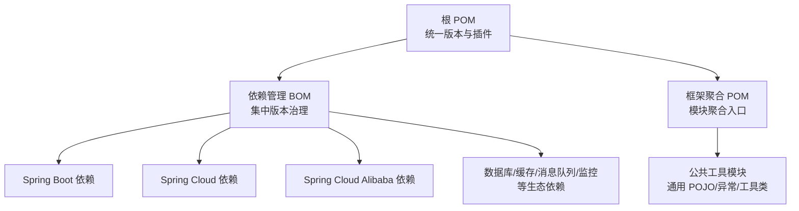
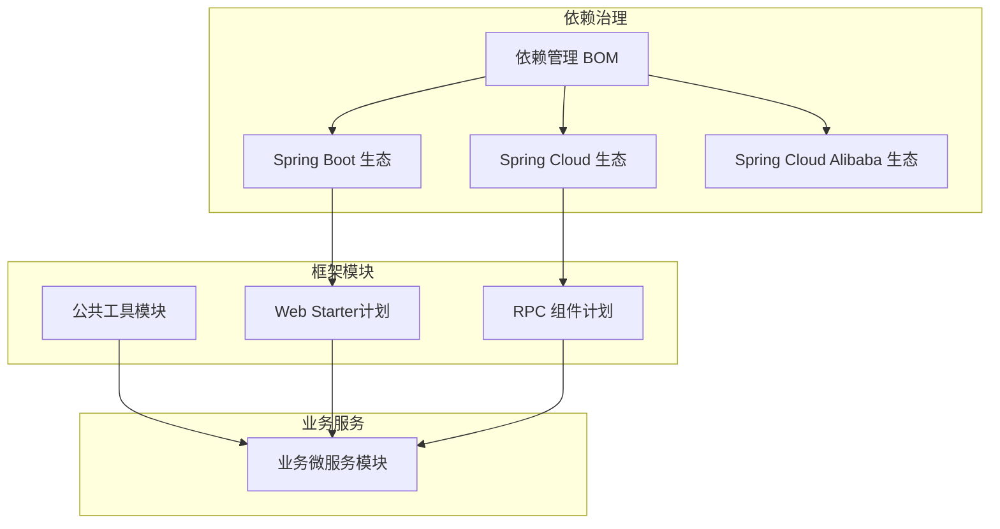
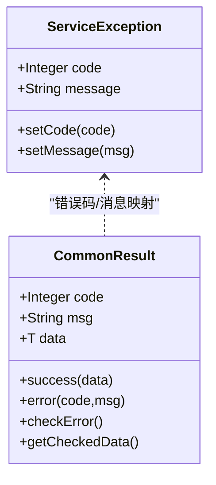
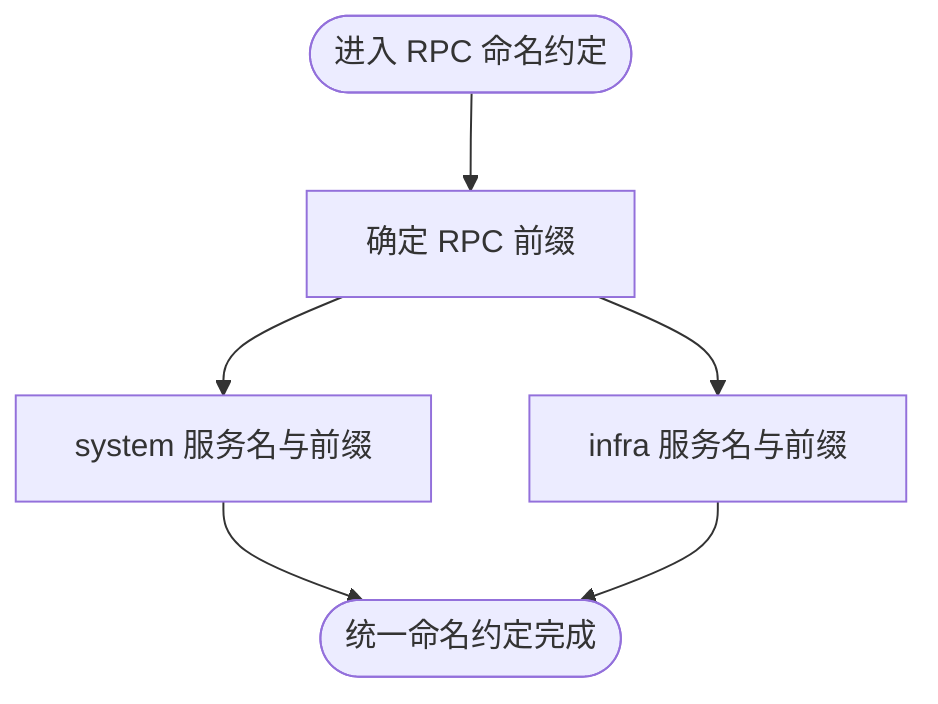
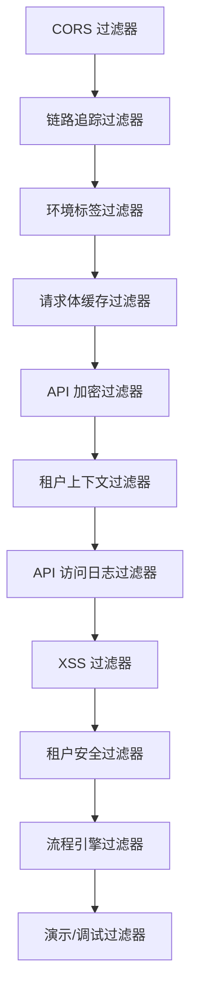
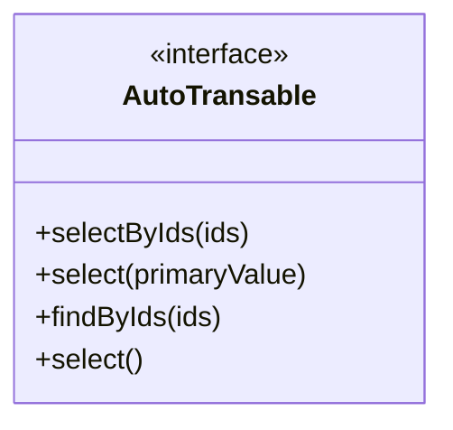
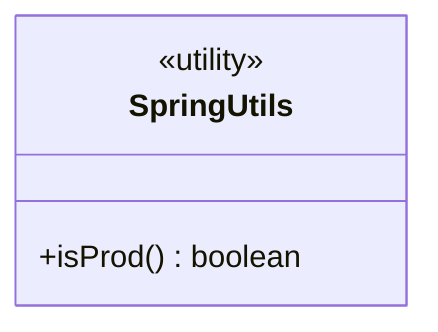
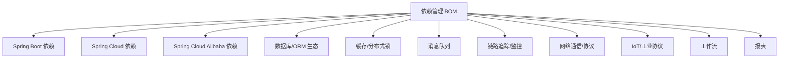

# 项目概述

<cite>
**本文引用的文件**
- [根 POM](file://pom.xml)
- [依赖管理 BOM](file://pandora-dependencies/pom.xml)
- [框架聚合 POM](file://pandora-framework/pom.xml)
- [公共工具模块 POM](file://pandora-framework/pandora-common/pom.xml)
- [公共模块 README](file://pandora-framework/pandora-common/README.md)
- [项目总 README](file://README.md)
- [公共模块异常 ServiceException](file://pandora-framework/pandora-common/src/main/java/net/ittimeline/pandora/framework/common/exception/ServiceException.java)
- [公共模块通用返回 CommonResult](file://pandora-framework/pandora-common/src/main/java/net/ittimeline/pandora/framework/common/pojo/CommonResult.java)
- [RPC 常量 RpcConstants](file://pandora-framework/pandora-common/src/main/java/net/ittimeline/pandora/framework/common/constants/RpcConstants.java)
- [Web 过滤器顺序常量 WebFilterOrderConstants](file://pandora-framework/pandora-common/src/main/java/net/ittimeline/pandora/framework/common/constants/WebFilterOrderConstants.java)
- [自动翻译接口 AutoTransable](file://pandora-framework/pandora-common/src/main/java/com/fhs/trans/service/AutoTransable.java)
- [Spring 工具类 SpringUtils](file://pandora-framework/pandora-common/src/main/java/net/ittimeline/pandora/framework/common/util/web/spring/SpringUtils.java)
</cite>

## 目录
1. [引言](#引言)
2. [项目结构](#项目结构)
3. [核心组件](#核心组件)
4. [架构总览](#架构总览)
5. [详细组件分析](#详细组件分析)
6. [依赖分析](#依赖分析)
7. [性能考虑](#性能考虑)
8. [故障排查指南](#故障排查指南)
9. [结论](#结论)
10. [附录](#附录)

## 引言
Pandora Cloud 微服务框架旨在为企业级微服务开发提供一体化脚手架与基础设施能力。项目通过统一的依赖管理、标准化的通用组件与约定式的设计，显著降低微服务开发门槛，加速业务迭代。框架采用 Spring Boot 3.5.14 与 Spring Cloud 生态组合，结合阿里巴巴生态与可观测性、网络通信、IoT、工作流等多领域能力，形成覆盖“开发—测试—部署—运维”的完整工具链。

本项目不仅面向初学者提供清晰的技术栈入门路径，也为资深开发者提供可扩展、可演进的架构参考。通过模块化设计与 BOM 统一版本治理，确保团队在快速交付的同时保持一致性与可维护性。

## 项目结构
项目采用多模块聚合结构，以 Maven POM 为中心组织，分为“依赖管理”和“框架封装”两大维度：

- 顶层聚合：统一版本、构建插件与仓库配置
- 依赖管理：集中管理 Spring Boot、Spring Cloud、Spring Cloud Alibaba 以及各类中间件与工具库版本
- 框架封装：当前已沉淀公共工具模块，后续可扩展 Web Starter、RPC 组件等

图表来源
- [根 POM:1-150](file://pom.xml#L1-L150)
- [依赖管理 BOM:1-612](file://pandora-dependencies/pom.xml#L1-L612)
- [框架聚合 POM:1-37](file://pandora-framework/pom.xml#L1-L37)
- [公共工具模块 POM:1-101](file://pandora-framework/pandora-common/pom.xml#L1-L101)

章节来源
- [根 POM:1-150](file://pom.xml#L1-L150)
- [依赖管理 BOM:1-612](file://pandora-dependencies/pom.xml#L1-L612)
- [框架聚合 POM:1-37](file://pandora-framework/pom.xml#L1-L37)
- [公共工具模块 POM:1-101](file://pandora-framework/pandora-common/pom.xml#L1-L101)
- [项目总 README:1-15](file://README.md#L1-L15)

## 核心组件
公共工具模块是当前框架的核心承载，提供以下关键能力：

- 统一异常与错误码体系：定义业务异常、全局错误码与异常工具，规范错误处理与返回格式
- 通用响应模型：标准的返回体结构，支持成功/失败、数据与错误信息的统一表达
- RPC 常量与命名约定：为跨服务调用提供统一前缀与服务名约定
- Web 过滤器顺序常量：确保过滤器链按预期顺序执行，避免安全与日志等环节错位
- 自动翻译接口：为 VO 数据翻译提供统一接口契约，便于字典/枚举等外部数据映射
- Spring 工具类：封装常用 Spring 上下文判断（如环境判定），便于条件化配置与功能开关

章节来源
- [公共模块异常 ServiceException:1-64](file://pandora-framework/pandora-common/src/main/java/net/ittimeline/pandora/framework/common/exception/ServiceException.java#L1-L64)
- [公共模块通用返回 CommonResult:1-123](file://pandora-framework/pandora-common/src/main/java/net/ittimeline/pandora/framework/common/pojo/CommonResult.java#L1-L123)
- [RPC 常量 RpcConstants:1-42](file://pandora-framework/pandora-common/src/main/java/net/ittimeline/pandora/framework/common/constants/RpcConstants.java#L1-L42)
- [Web 过滤器顺序常量 WebFilterOrderConstants:1-37](file://pandora-framework/pandora-common/src/main/java/net/ittimeline/pandora/framework/common/constants/WebFilterOrderConstants.java#L1-L37)
- [自动翻译接口 AutoTransable:1-61](file://pandora-framework/pandora-common/src/main/java/com/fhs/trans/service/AutoTransable.java#L1-L61)
- [Spring 工具类 SpringUtils:1-24](file://pandora-framework/pandora-common/src/main/java/net/ittimeline/pandora/framework/common/util/web/spring/SpringUtils.java#L1-L24)

## 架构总览
从整体架构看，Pandora Cloud 以“依赖管理 BOM + 框架模块”为核心，向上支撑业务微服务模块，向下对接数据库、缓存、消息队列、链路追踪、监控告警等基础设施。当前已沉淀公共工具模块，后续可扩展 Web Starter、RPC 组件、网关与安全组件等。

图表来源
- [依赖管理 BOM:106-576](file://pandora-dependencies/pom.xml#L106-L576)
- [公共工具模块 POM:26-98](file://pandora-framework/pandora-common/pom.xml#L26-L98)
- [框架聚合 POM:15-24](file://pandora-framework/pom.xml#L15-L24)

## 详细组件分析

### 统一异常与错误码体系
公共模块定义了统一的异常模型与错误码规范，确保服务间错误语义一致，便于前端与网关统一处理。

图表来源
- [公共模块异常 ServiceException:1-64](file://pandora-framework/pandora-common/src/main/java/net/ittimeline/pandora/framework/common/exception/ServiceException.java#L1-L64)
- [公共模块通用返回 CommonResult:1-123](file://pandora-framework/pandora-common/src/main/java/net/ittimeline/pandora/framework/common/pojo/CommonResult.java#L1-L123)

章节来源
- [公共模块异常 ServiceException:1-64](file://pandora-framework/pandora-common/src/main/java/net/ittimeline/pandora/framework/common/exception/ServiceException.java#L1-L64)
- [公共模块通用返回 CommonResult:1-123](file://pandora-framework/pandora-common/src/main/java/net/ittimeline/pandora/framework/common/pojo/CommonResult.java#L1-L123)

### RPC 常量与服务命名约定
为跨服务调用提供统一前缀与服务名约定，确保 API 前缀与服务名的一致性，降低联调成本。

图表来源
- [RPC 常量 RpcConstants:1-42](file://pandora-framework/pandora-common/src/main/java/net/ittimeline/pandora/framework/common/constants/RpcConstants.java#L1-L42)

章节来源
- [RPC 常量 RpcConstants:1-42](file://pandora-framework/pandora-common/src/main/java/net/ittimeline/pandora/framework/common/constants/RpcConstants.java#L1-L42)

### Web 过滤器顺序控制
通过常量定义 Web 过滤器的执行顺序，确保跨域、链路追踪、请求缓存、加密、租户上下文、访问日志、XSS 防护、安全过滤、流程引擎等环节按预期顺序执行。

图表来源
- [Web 过滤器顺序常量 WebFilterOrderConstants:1-37](file://pandora-framework/pandora-common/src/main/java/net/ittimeline/pandora/framework/common/constants/WebFilterOrderConstants.java#L1-L37)

章节来源
- [Web 过滤器顺序常量 WebFilterOrderConstants:1-37](file://pandora-framework/pandora-common/src/main/java/net/ittimeline/pandora/framework/common/constants/WebFilterOrderConstants.java#L1-L37)

### 自动翻译接口 AutoTransable
为 VO 数据翻译提供统一接口契约，便于在 API 模块中直接复用，减少重复实现。

图表来源
- [自动翻译接口 AutoTransable:1-61](file://pandora-framework/pandora-common/src/main/java/com/fhs/trans/service/AutoTransable.java#L1-L61)

章节来源
- [自动翻译接口 AutoTransable:1-61](file://pandora-framework/pandora-common/src/main/java/com/fhs/trans/service/AutoTransable.java#L1-L61)

### Spring 工具类 SpringUtils
提供常用 Spring 上下文能力封装，如环境判断，便于在不同环境下启用差异化配置或行为。

图表来源
- [Spring 工具类 SpringUtils:1-24](file://pandora-framework/pandora-common/src/main/java/net/ittimeline/pandora/framework/common/util/web/spring/SpringUtils.java#L1-L24)

章节来源
- [Spring 工具类 SpringUtils:1-24](file://pandora-framework/pandora-common/src/main/java/net/ittimeline/pandora/framework/common/util/web/spring/SpringUtils.java#L1-L24)

## 依赖分析
项目通过依赖管理 BOM 集中治理版本，确保 Spring Boot 3.5.14、Spring Cloud 与 Spring Cloud Alibaba 的兼容性，并引入数据库、缓存、消息队列、链路追踪、监控、网络通信、IoT、工作流、报表等生态组件，形成“开箱即用”的微服务基础设施。

图表来源
- [依赖管理 BOM:106-576](file://pandora-dependencies/pom.xml#L106-L576)

章节来源
- [依赖管理 BOM:1-612](file://pandora-dependencies/pom.xml#L1-L612)

## 性能考虑
- 版本治理与兼容性：通过 BOM 精确锁定 Spring Boot 3.5.14 与 Spring Cloud 生态版本，避免依赖冲突导致的性能回退与不稳定
- 编译期优化：启用 Lombok 与 MapStruct 注解处理器，减少运行时反射与样板代码，提升编译与启动效率
- 统一插件策略：使用统一的 Maven 插件与参数，确保构建一致性与可重复性
- 过滤器顺序优化：通过明确的过滤器顺序常量，避免重复处理与无效 IO，提升请求处理吞吐

## 故障排查指南
- 统一异常处理：优先使用公共模块的异常与返回模型，确保错误码与消息格式一致，便于定位与排查
- 环境判断：通过 SpringUtils 的环境判断，确认是否处于生产环境，从而启用或关闭某些调试/降级逻辑
- 过滤器链问题：若出现安全、日志或缓存相关异常，检查过滤器顺序常量是否被正确应用
- RPC 命名问题：核对 RPC 前缀与服务名是否与约定一致，避免路由失败

章节来源
- [公共模块异常 ServiceException:1-64](file://pandora-framework/pandora-common/src/main/java/net/ittimeline/pandora/framework/common/exception/ServiceException.java#L1-L64)
- [公共模块通用返回 CommonResult:1-123](file://pandora-framework/pandora-common/src/main/java/net/ittimeline/pandora/framework/common/pojo/CommonResult.java#L1-L123)
- [Spring 工具类 SpringUtils:1-24](file://pandora-framework/pandora-common/src/main/java/net/ittimeline/pandora/framework/common/util/web/spring/SpringUtils.java#L1-L24)
- [Web 过滤器顺序常量 WebFilterOrderConstants:1-37](file://pandora-framework/pandora-common/src/main/java/net/ittimeline/pandora/framework/common/constants/WebFilterOrderConstants.java#L1-L37)
- [RPC 常量 RpcConstants:1-42](file://pandora-framework/pandora-common/src/main/java/net/ittimeline/pandora/framework/common/constants/RpcConstants.java#L1-L42)

## 结论
Pandora Cloud 微服务框架以“依赖管理 + 公共工具模块”为基础，结合 Spring Boot 3.5.14 与 Spring Cloud 生态，为企业提供高内聚、低耦合的微服务脚手架。当前公共模块已沉淀统一异常、通用返回、RPC 常量、过滤器顺序与自动翻译等关键能力；未来可围绕 Web Starter、RPC 组件、网关与安全组件持续扩展，进一步完善微服务全生命周期能力。

## 附录
- 技术栈概览
  - 核心框架：Spring Boot 3.5.14、Spring Cloud、Spring Cloud Alibaba
  - 数据库与 ORM：MyBatis、MyBatis-Plus、动态数据源、字典翻译
  - 缓存与分布式：Redisson、分布式锁
  - 消息队列：RocketMQ
  - 监控与链路追踪：SkyWalking、Spring Boot Admin、OpenTracing
  - 网络通信：OkHttp、Vert.x、MQTT、CoAP、SSH/SFTP
  - 工作流：Flowable
  - 报表：积木报表
  - 工具库：Lombok、MapStruct、Hutool、Guava、FastJSON、Apache Commons 等

章节来源
- [依赖管理 BOM:106-576](file://pandora-dependencies/pom.xml#L106-L576)
- [公共模块 README:1-33](file://pandora-framework/pandora-common/README.md#L1-L33)