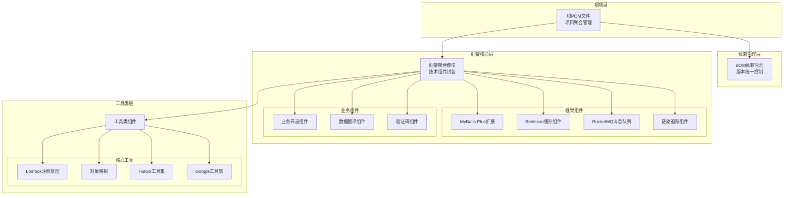
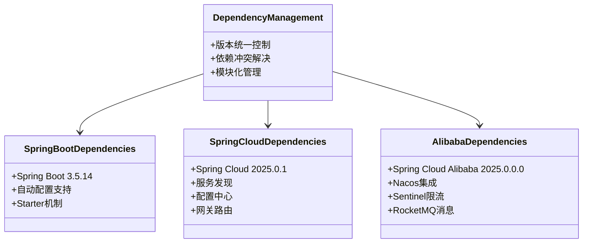
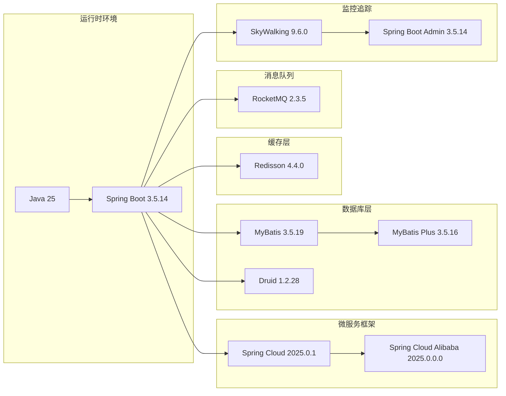
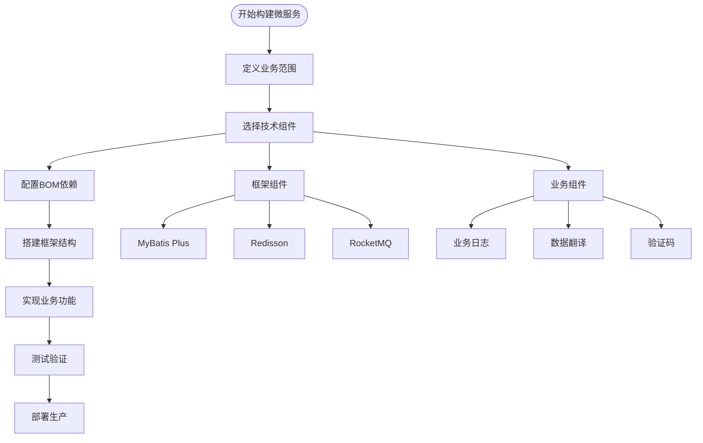
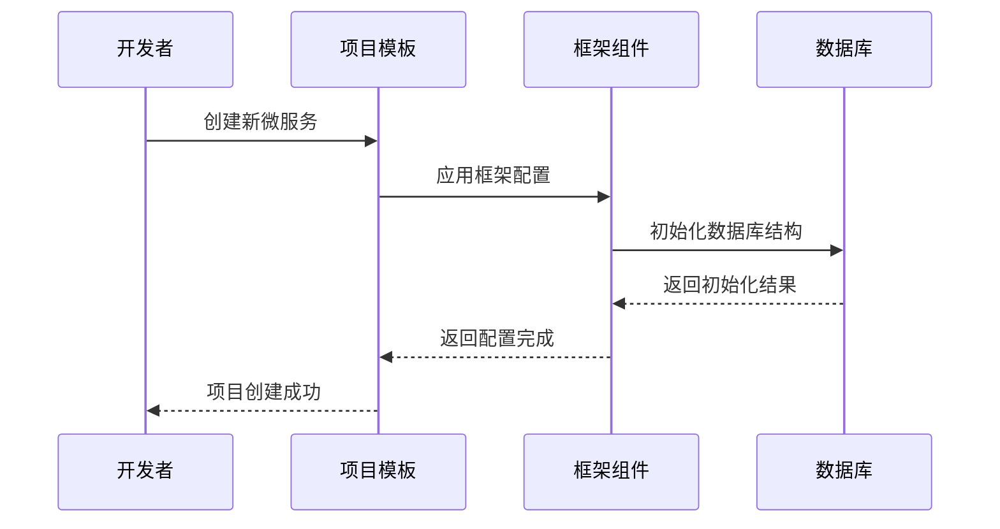

# 项目概述

<cite>
**本文引用的文件**
- [根POM文件](file://pom.xml)
- [依赖管理BOM](file://pandora-dependencies/pom.xml)
- [框架聚合模块](file://pandora-framework/pom.xml)
- [项目说明文档](file://README.md)
- [Lombok配置](file://lombok.config)
</cite>

## 目录
1. [项目简介](#项目简介)
2. [项目架构](#项目架构)
3. [核心组件](#核心组件)
4. [技术栈概览](#技术栈概览)
5. [设计理念](#设计理念)
6. [核心优势](#核心优势)
7. [适用场景](#适用场景)
8. [入门指南](#入门指南)
9. [最佳实践](#最佳实践)
10. [总结](#总结)

## 项目简介

Pandora Cloud（潘多拉云平台）是一个企业级微服务云平台基础脚手架项目，旨在为企业提供一套完整的微服务基础设施解决方案。该项目通过模块化的设计理念，将复杂的微服务生态系统整合为统一的开发框架，显著降低了微服务开发的复杂度和成本。

### 项目定位

该项目作为企业级云平台的基础设施，提供了以下核心价值：
- **标准化开发流程**：统一的项目模板和开发规范
- **模块化组件体系**：可复用的技术组件和业务组件
- **企业级特性集成**：完善的监控、安全、分布式事务等企业级能力
- **快速开发支撑**：减少重复性工作，加速业务迭代

**章节来源**
- [项目说明文档:1-2](file://README.md#L1-L2)

## 项目架构

Pandora Cloud采用了典型的多模块Maven架构，通过清晰的层次结构实现了关注点分离和模块化管理。



**图表来源**
- [根POM文件:11-14](file://pom.xml#L11-L14)
- [依赖管理BOM:109-140](file://pandora-dependencies/pom.xml#L109-L140)
- [框架聚合模块:15-24](file://pandora-framework/pom.xml#L15-L24)

### 架构特点

1. **分层架构设计**：从依赖管理到具体实现的清晰分层
2. **模块化组织**：每个组件独立封装，便于复用和维护
3. **版本统一管理**：通过BOM确保依赖版本一致性
4. **可扩展性**：支持新增组件和第三方集成

**章节来源**
- [根POM文件:11-14](file://pom.xml#L11-L14)
- [框架聚合模块:15-24](file://pandora-framework/pom.xml#L15-L24)

## 核心组件

### 依赖管理体系

项目采用BOM（Bill of Materials）模式进行依赖管理，确保所有子模块使用一致的版本号，避免版本冲突问题。



**图表来源**
- [依赖管理BOM:120-140](file://pandora-dependencies/pom.xml#L120-L140)

### 技术组件分类

项目中的技术组件主要分为两大类：

#### 框架组件
- **MyBatis Plus扩展**：增强ORM功能，提供代码生成器和联表查询支持
- **Redisson缓存组件**：提供分布式缓存和分布式锁功能
- **RocketMQ消息队列**：高性能消息中间件集成
- **SkyWalking链路追踪**：分布式系统监控和追踪

#### 业务组件
- **BizLog业务日志**：统一的日志记录和审计功能
- **EasyTrans数据翻译**：字段值翻译和国际化支持
- **Captcha验证码**：图形验证码生成和验证

**章节来源**
- [依赖管理BOM:142-253](file://pandora-dependencies/pom.xml#L142-L253)
- [框架聚合模块:20-24](file://pandora-framework/pom.xml#L20-L24)

## 技术栈概览

### 核心技术栈

Pandora Cloud采用了当前主流的企业级Java微服务技术栈，确保了项目的先进性和稳定性。



**图表来源**
- [根POM文件:20-35](file://pom.xml#L20-L35)
- [依赖管理BOM:60-91](file://pandora-dependencies/pom.xml#L60-L91)

### 工具类生态

项目集成了丰富的工具类库，涵盖各个开发场景的需求：

| 工具类别 | 核心组件 | 主要功能 |
|---------|----------|----------|
| **代码生成** | Lombok 1.18.46 | 注解驱动的代码生成 |
| | MapStruct 1.6.3 | 对象映射和转换 |
| **工具集合** | Hutool 5.8.44 | 常用工具方法集合 |
| | Guava 33.6.0 | Google开源工具集 |
| | Commons Lang3 3.20.0 | 字符串和对象工具 |
| **网络通信** | Netty 4.2.13 | 高性能网络框架 |
| | OkHttp 5.3.2 | HTTP客户端库 |
| | Vert.x 5.0.12 | 事件驱动应用框架 |

**章节来源**
- [依赖管理BOM:20-42](file://pandora-dependencies/pom.xml#L20-L42)

## 设计理念

### 模块化设计原则

Pandora Cloud的设计遵循了高度模块化的架构原则，每个组件都有明确的职责边界和清晰的接口定义。



**图表来源**
- [框架聚合模块:15-24](file://pandora-framework/pom.xml#L15-L24)

### 依赖管理策略

项目采用集中式依赖管理策略，通过BOM文件统一管理所有子模块的依赖版本，确保了版本的一致性和兼容性。

**章节来源**
- [依赖管理BOM:109-140](file://pandora-dependencies/pom.xml#L109-L140)

## 核心优势

### 开发效率提升

1. **标准化模板**：提供统一的项目结构和开发规范
2. **自动化配置**：通过Starter自动配置常用组件
3. **代码生成**：集成MyBatis Plus代码生成器，快速生成CRUD代码
4. **测试支持**：内置Mockito和Jedis Mock等测试工具

### 企业级特性完备

1. **分布式追踪**：SkyWalking提供完整的链路追踪能力
2. **监控告警**：Spring Boot Admin实现服务监控
3. **安全防护**：集成多种安全组件和认证机制
4. **高可用设计**：支持集群部署和故障转移

### 生态系统丰富

1. **云服务集成**：支持AWS S3、微信支付、支付宝等第三方服务
2. **消息中间件**：支持RocketMQ、MQTT等多种消息协议
3. **数据库扩展**：MyBatis Plus提供强大的ORM功能
4. **缓存方案**：Redisson提供分布式缓存和锁机制

**章节来源**
- [依赖管理BOM:44-57](file://pandora-dependencies/pom.xml#L44-L57)
- [依赖管理BOM:547-620](file://pandora-dependencies/pom.xml#L547-L620)

## 适用场景

### 企业级应用开发

Pandora Cloud特别适合以下类型的企业应用场景：

- **电商平台**：需要高并发处理订单、库存管理等功能
- **金融系统**：要求严格的数据一致性和审计功能
- **物流系统**：需要实时追踪和调度管理
- **政务系统**：要求高安全性和合规性

### 微服务架构转型

对于正在从单体应用向微服务架构转型的企业，Pandora Cloud提供了：

- **渐进式迁移**：支持逐步拆分现有系统
- **统一标准**：确保新旧系统的一致性
- **降低风险**：通过成熟的组件减少技术风险

### 快速原型开发

对于需要快速验证业务想法的团队，Pandora Cloud提供了：

- **快速启动**：标准化模板减少初始配置时间
- **灵活扩展**：可根据需求添加或移除组件
- **成本控制**：避免重复造轮子，降低开发成本

## 入门指南

### 环境准备

在开始使用Pandora Cloud之前，需要准备以下开发环境：

1. **Java环境**：Java 25或更高版本
2. **Maven**：推荐使用Maven 3.6+
3. **IDE**：IntelliJ IDEA或Eclipse
4. **数据库**：MySQL 8.0+或其他关系型数据库
5. **缓存**：Redis 6.0+

### 项目初始化

```bash
# 克隆项目
git clone https://github.com/ittimeline/pandora-cloud.git

# 进入项目目录
cd pandora-cloud

# 清理并重新构建
mvn clean install -DskipTests
```

### 基础配置

1. **数据库配置**：在application.yml中配置数据库连接
2. **缓存配置**：设置Redis连接信息
3. **消息队列**：配置RocketMQ或RabbitMQ
4. **监控配置**：设置SkyWalking Agent

### 第一个微服务



**图表来源**
- [框架聚合模块:15-24](file://pandora-framework/pom.xml#L15-L24)

## 最佳实践

### 项目结构规范

1. **模块划分**：按照业务领域划分微服务模块
2. **包命名**：采用清晰的包命名约定
3. **配置管理**：使用环境变量和配置文件分离
4. **日志规范**：统一的日志格式和级别

### 代码质量保证

1. **单元测试**：每个功能模块至少包含单元测试
2. **集成测试**：关键业务流程包含集成测试
3. **代码审查**：建立代码审查流程
4. **持续集成**：配置CI/CD流水线

### 性能优化建议

1. **数据库优化**：合理使用索引和连接池
2. **缓存策略**：制定合理的缓存失效策略
3. **异步处理**：对耗时操作使用异步处理
4. **监控指标**：建立关键性能指标监控

### 安全防护措施

1. **输入验证**：对所有用户输入进行验证
2. **权限控制**：基于角色的访问控制
3. **数据加密**：敏感数据的加密存储
4. **安全审计**：完整的操作日志记录

## 总结

Pandora Cloud微服务云平台基础脚手架项目为企业提供了一套完整、成熟、可扩展的微服务开发解决方案。通过模块化的设计理念和完善的依赖管理体系，该项目显著降低了微服务开发的复杂度，提高了开发效率。

### 主要价值体现

1. **技术价值**：集成了当前主流的企业级微服务技术栈
2. **业务价值**：提供了可复用的业务组件和最佳实践
3. **管理价值**：标准化的开发流程和质量保证体系
4. **经济价值**：减少重复开发，提高团队生产力

### 发展前景

随着微服务架构的不断发展和完善，Pandora Cloud将继续演进，支持更多的云原生技术和企业级需求。项目团队将持续优化组件质量和开发体验，为企业数字化转型提供强有力的技术支撑。

无论是初学者还是经验丰富的开发者，都能在Pandora Cloud项目中找到适合自己的开发方式和最佳实践。通过合理利用项目提供的组件和规范，可以快速构建高质量的企业级微服务应用。