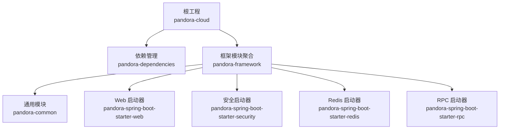
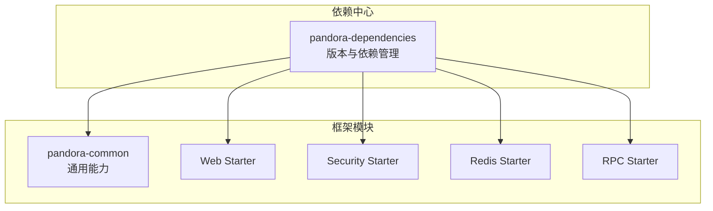
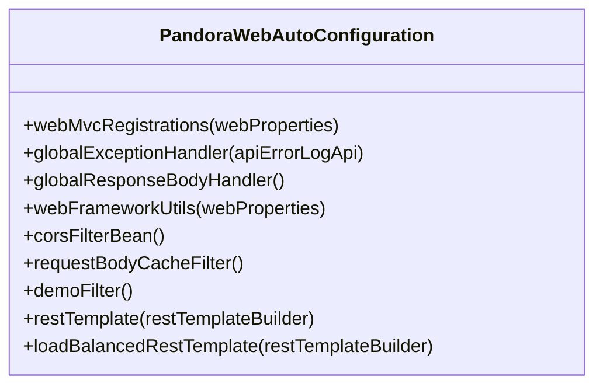
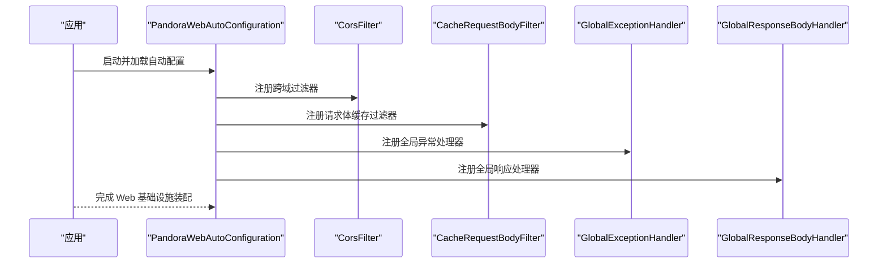
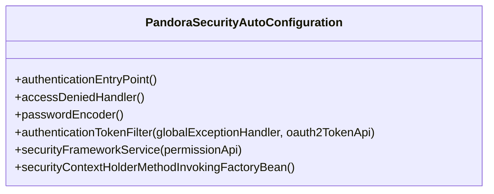
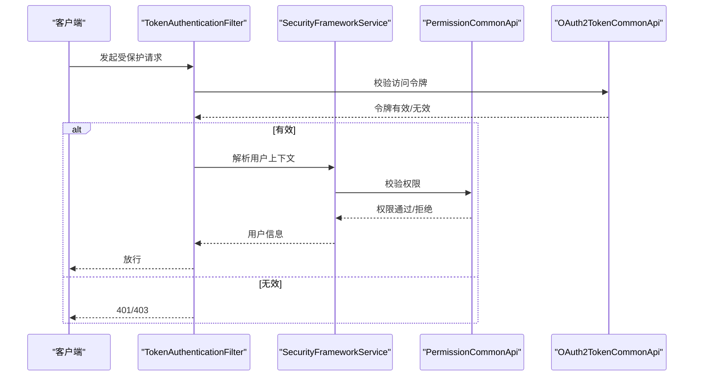
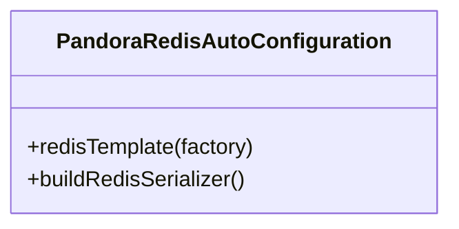
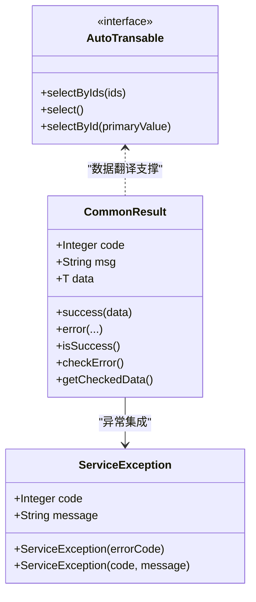
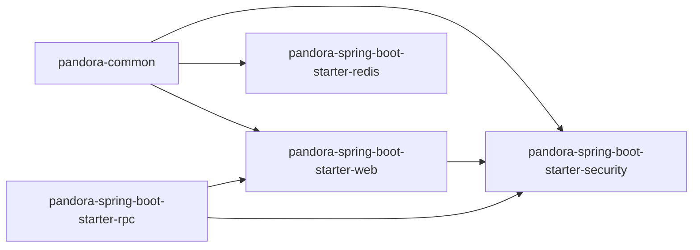

# 项目概述

<cite>
**本文引用的文件**
- [README.md](file://README.md)
- [pom.xml](file://pom.xml)
- [pandora-dependencies/pom.xml](file://pandora-dependencies/pom.xml)
- [pandora-framework/pom.xml](file://pandora-framework/pom.xml)
- [pandora-framework/pandora-common/README.md](file://pandora-framework/pandora-common/README.md)
- [pandora-framework/pandora-common/pom.xml](file://pandora-framework/pandora-common/pom.xml)
- [pandora-framework/pandora-spring-boot-starter-web/pom.xml](file://pandora-framework/pandora-spring-boot-starter-web/pom.xml)
- [pandora-framework/pandora-spring-boot-starter-web/src/main/resources/META-INF/spring/org.springframework.boot.autoconfigure.AutoConfiguration.imports](file://pandora-framework/pandora-spring-boot-starter-web/src/main/resources/META-INF/spring/org.springframework.boot.autoconfigure.AutoConfiguration.imports)
- [pandora-framework/pandora-spring-boot-starter-web/src/main/java/net/ittimeline/pandora/framework/web/config/PandoraWebAutoConfiguration.java](file://pandora-framework/pandora-spring-boot-starter-web/src/main/java/net/ittimeline/pandora/framework/web/config/PandoraWebAutoConfiguration.java)
- [pandora-framework/pandora-spring-boot-starter-security/pom.xml](file://pandora-framework/pandora-spring-boot-starter-security/pom.xml)
- [pandora-framework/pandora-spring-boot-starter-security/src/main/resources/META-INF/spring/org.springframework.boot.autoconfigure.AutoConfiguration.imports](file://pandora-framework/pandora-spring-boot-starter-security/src/main/resources/META-INF/spring/org.springframework.boot.autoconfigure.AutoConfiguration.imports)
- [pandora-framework/pandora-spring-boot-starter-security/src/main/java/net/ittimeline/pandora/framework/security/config/PandoraSecurityAutoConfiguration.java](file://pandora-framework/pandora-spring-boot-starter-security/src/main/java/net/ittimeline/pandora/framework/security/config/PandoraSecurityAutoConfiguration.java)
- [pandora-framework/pandora-spring-boot-starter-redis/pom.xml](file://pandora-framework/pandora-spring-boot-starter-redis/pom.xml)
- [pandora-framework/pandora-spring-boot-starter-redis/src/main/resources/META-INF/spring/org.springframework.boot.autoconfigure.AutoConfiguration.imports](file://pandora-framework/pandora-spring-boot-starter-redis/src/main/resources/META-INF/spring/org.springframework.boot.autoconfigure.AutoConfiguration.imports)
- [pandora-framework/pandora-spring-boot-starter-redis/src/main/java/net/ittimeline/pandora/framework/redis/config/PandoraRedisAutoConfiguration.java](file://pandora-framework/pandora-spring-boot-starter-redis/src/main/java/net/ittimeline/pandora/framework/redis/config/PandoraRedisAutoConfiguration.java)
- [pandora-framework/pandora-common/src/main/java/com/fhs/trans/service/AutoTransable.java](file://pandora-framework/pandora-common/src/main/java/com/fhs/trans/service/AutoTransable.java)
- [pandora-framework/pandora-common/src/main/java/net/ittimeline/pandora/framework/common/pojo/CommonResult.java](file://pandora-framework/pandora-common/src/main/java/net/ittimeline/pandora/framework/common/pojo/CommonResult.java)
- [pandora-framework/pandora-common/src/main/java/net/ittimeline/pandora/framework/common/exception/ServiceException.java](file://pandora-framework/pandora-common/src/main/java/net/ittimeline/pandora/framework/common/exception/ServiceException.java)
</cite>

## 目录
1. [引言](#引言)
2. [项目结构](#项目结构)
3. [核心组件](#核心组件)
4. [架构总览](#架构总览)
5. [详细组件分析](#详细组件分析)
6. [依赖分析](#依赖分析)
7. [性能考虑](#性能考虑)
8. [故障排查指南](#故障排查指南)
9. [结论](#结论)
10. [附录](#附录)

## 引言
Pandora Cloud 是面向企业级微服务开发的脚手架框架，旨在通过模块化设计与 Spring Boot Starter 组件，快速搭建具备统一规范的微服务体系。其核心价值体现在：
- 统一的基础设施与最佳实践：提供 Web、安全、缓存、RPC、日志、加密、脱敏、API 文档等常用能力的一键启用。
- 降低开发成本：通过自动装配与约定优于配置，减少样板代码与重复配置。
- 易扩展与演进：以模块化组织，便于按需引入与替换，适配不同业务场景。

适用场景包括但不限于：
- 大中型企业数字化平台的后端微服务基座
- 需要统一错误码、日志、安全与 API 文档的多租户系统
- 需要快速集成 Redis、RPC、安全认证与操作审计的业务系统

## 项目结构
仓库采用多模块聚合结构，顶层 POM 聚合“依赖管理”与“框架模块”，框架模块进一步细分为通用模块与各 Spring Boot Starter 组件，形成“依赖中心 + 功能组件”的双层架构。

图示来源
- [pom.xml:11-14](file://pom.xml#L11-L14)
- [pandora-framework/pom.xml:26-32](file://pandora-framework/pom.xml#L26-L32)

章节来源
- [pom.xml:1-150](file://pom.xml#L1-L150)
- [pandora-framework/pom.xml:1-41](file://pandora-framework/pom.xml#L1-L41)

## 核心组件
- 通用模块（pandora-common）
  - 提供基础 POJO、枚举、工具类与异常体系，支撑上层组件复用。
  - 关键对象：通用返回体、分页参数、排序字段、业务异常与错误码工具等。
- Web 启动器（pandora-spring-boot-starter-web）
  - 提供全局异常、响应包装、API 访问日志、XSS 过滤、敏感信息脱敏、API 加解密、Swagger/OpenAPI 文档、跨域与请求体缓存等能力。
- 安全启动器（pandora-spring-boot-starter-security）
  - 提供认证、授权、线程上下文传递、操作日志记录等能力，结合通用模块中的 OAuth2 与权限接口。
- Redis 启动器（pandora-spring-boot-starter-redis）
  - 提供 Redisson 客户端与自定义 RedisTemplate，支持 JSON 序列化与时间类型处理。
- RPC 启动器（pandora-spring-boot-starter-rpc）
  - 作为 RPC 能力的抽象入口，配合通用模块的远程调用上下文与线程传递。

章节来源
- [pandora-framework/pandora-common/README.md:1-33](file://pandora-framework/pandora-common/README.md#L1-L33)
- [pandora-framework/pandora-common/pom.xml:1-114](file://pandora-framework/pandora-common/pom.xml#L1-L114)
- [pandora-framework/pandora-spring-boot-starter-web/pom.xml:1-91](file://pandora-framework/pandora-spring-boot-starter-web/pom.xml#L1-L91)
- [pandora-framework/pandora-spring-boot-starter-security/pom.xml:1-73](file://pandora-framework/pandora-spring-boot-starter-security/pom.xml#L1-L73)
- [pandora-framework/pandora-spring-boot-starter-redis/pom.xml:1-43](file://pandora-framework/pandora-spring-boot-starter-redis/pom.xml#L1-L43)

## 架构总览
Pandora Cloud 的整体架构围绕“依赖中心 + 功能组件”展开。依赖中心统一管理版本与第三方组件；功能组件以 Starter 的形式提供自动装配，按需启用。

图示来源
- [pandora-dependencies/pom.xml:106-601](file://pandora-dependencies/pom.xml#L106-L601)
- [pandora-framework/pom.xml:26-32](file://pandora-framework/pom.xml#L26-L32)

## 详细组件分析

### Web 启动器（自动装配与过滤链）
Web 启动器通过自动配置类注册全局异常处理器、响应包装器、跨域过滤器、请求体缓存过滤器以及 RestTemplate Bean，并支持基于前缀的路径映射与演示模式开关。

图示来源
- [pandora-framework/pandora-spring-boot-starter-web/src/main/java/net/ittimeline/pandora/framework/web/config/PandoraWebAutoConfiguration.java:47-176](file://pandora-framework/pandora-spring-boot-starter-web/src/main/java/net/ittimeline/pandora/framework/web/config/PandoraWebAutoConfiguration.java#L47-L176)

图示来源
- [pandora-framework/pandora-spring-boot-starter-web/src/main/java/net/ittimeline/pandora/framework/web/config/PandoraWebAutoConfiguration.java:116-176](file://pandora-framework/pandora-spring-boot-starter-web/src/main/java/net/ittimeline/pandora/framework/web/config/PandoraWebAutoConfiguration.java#L116-L176)

章节来源
- [pandora-framework/pandora-spring-boot-starter-web/src/main/resources/META-INF/spring/org.springframework.boot.autoconfigure.AutoConfiguration.imports:1-8](file://pandora-framework/pandora-spring-boot-starter-web/src/main/resources/META-INF/spring/org.springframework.boot.autoconfigure.AutoConfiguration.imports#L1-L8)
- [pandora-framework/pandora-spring-boot-starter-web/src/main/java/net/ittimeline/pandora/framework/web/config/PandoraWebAutoConfiguration.java:47-176](file://pandora-framework/pandora-spring-boot-starter-web/src/main/java/net/ittimeline/pandora/framework/web/config/PandoraWebAutoConfiguration.java#L47-L176)

### 安全启动器（认证、授权与操作日志）
安全启动器负责注册认证入口点、权限不足处理器、密码编码器、令牌认证过滤器、安全框架服务以及线程上下文传递策略，并与通用模块的权限与 OAuth2 接口协作。

图示来源
- [pandora-framework/pandora-spring-boot-starter-security/src/main/java/net/ittimeline/pandora/framework/security/config/PandoraSecurityAutoConfiguration.java:39-98](file://pandora-framework/pandora-spring-boot-starter-security/src/main/java/net/ittimeline/pandora/framework/security/config/PandoraSecurityAutoConfiguration.java#L39-L98)

图示来源
- [pandora-framework/pandora-spring-boot-starter-security/src/main/java/net/ittimeline/pandora/framework/security/config/PandoraSecurityAutoConfiguration.java:74-83](file://pandora-framework/pandora-spring-boot-starter-security/src/main/java/net/ittimeline/pandora/framework/security/config/PandoraSecurityAutoConfiguration.java#L74-L83)

章节来源
- [pandora-framework/pandora-spring-boot-starter-security/src/main/resources/META-INF/spring/org.springframework.boot.autoconfigure.AutoConfiguration.imports:1-6](file://pandora-framework/pandora-spring-boot-starter-security/src/main/resources/META-INF/spring/org.springframework.boot.autoconfigure.AutoConfiguration.imports#L1-L6)
- [pandora-framework/pandora-spring-boot-starter-security/src/main/java/net/ittimeline/pandora/framework/security/config/PandoraSecurityAutoConfiguration.java:39-98](file://pandora-framework/pandora-spring-boot-starter-security/src/main/java/net/ittimeline/pandora/framework/security/config/PandoraSecurityAutoConfiguration.java#L39-L98)

### Redis 启动器（序列化与模板）
Redis 启动器在自动配置中优先于 Redisson 的自动配置，注册自定义的 RedisTemplate，使用 JSON 序列化并处理时间类型，确保与 Jackson 的兼容性。

图示来源
- [pandora-framework/pandora-spring-boot-starter-redis/src/main/java/net/ittimeline/pandora/framework/redis/config/PandoraRedisAutoConfiguration.java:19-49](file://pandora-framework/pandora-spring-boot-starter-redis/src/main/java/net/ittimeline/pandora/framework/redis/config/PandoraRedisAutoConfiguration.java#L19-L49)

章节来源
- [pandora-framework/pandora-spring-boot-starter-redis/src/main/resources/META-INF/spring/org.springframework.boot.autoconfigure.AutoConfiguration.imports:1-2](file://pandora-framework/pandora-spring-boot-starter-redis/src/main/resources/META-INF/spring/org.springframework.boot.autoconfigure.AutoConfiguration.imports#L1-L2)
- [pandora-framework/pandora-spring-boot-starter-redis/src/main/java/net/ittimeline/pandora/framework/redis/config/PandoraRedisAutoConfiguration.java:19-49](file://pandora-framework/pandora-spring-boot-starter-redis/src/main/java/net/ittimeline/pandora/framework/redis/config/PandoraRedisAutoConfiguration.java#L19-L49)

### 通用模块（错误码与异常体系）
通用模块提供统一的返回体、分页与排序参数、业务异常与错误码工具，以及数据翻译接口，支撑上层组件的一致性与可维护性。

图示来源
- [pandora-framework/pandora-common/src/main/java/net/ittimeline/pandora/framework/common/pojo/CommonResult.java:22-122](file://pandora-framework/pandora-common/src/main/java/net/ittimeline/pandora/framework/common/pojo/CommonResult.java#L22-L122)
- [pandora-framework/pandora-common/src/main/java/net/ittimeline/pandora/framework/common/exception/ServiceException.java:15-63](file://pandora-framework/pandora-common/src/main/java/net/ittimeline/pandora/framework/common/exception/ServiceException.java#L15-L63)
- [pandora-framework/pandora-common/src/main/java/com/fhs/trans/service/AutoTransable.java:18-60](file://pandora-framework/pandora-common/src/main/java/com/fhs/trans/service/AutoTransable.java#L18-L60)

章节来源
- [pandora-framework/pandora-common/README.md:1-33](file://pandora-framework/pandora-common/README.md#L1-L33)
- [pandora-framework/pandora-common/src/main/java/net/ittimeline/pandora/framework/common/pojo/CommonResult.java:22-122](file://pandora-framework/pandora-common/src/main/java/net/ittimeline/pandora/framework/common/pojo/CommonResult.java#L22-L122)
- [pandora-framework/pandora-common/src/main/java/net/ittimeline/pandora/framework/common/exception/ServiceException.java:15-63](file://pandora-framework/pandora-common/src/main/java/net/ittimeline/pandora/framework/common/exception/ServiceException.java#L15-L63)
- [pandora-framework/pandora-common/src/main/java/com/fhs/trans/service/AutoTransable.java:18-60](file://pandora-framework/pandora-common/src/main/java/com/fhs/trans/service/AutoTransable.java#L18-L60)

## 依赖分析
- 依赖中心（pandora-dependencies）
  - 通过 dependencyManagement 统一管理 Spring Boot、Spring Cloud、Spring Cloud Alibaba、Netty、Knife4j、MyBatis/Plus、Redisson、RocketMQ、XXL-Job、SkyWalking、OkHttp、Vert.x、IoT 协议栈、BPM 流程引擎、工具库与测试依赖等。
  - 在框架模块中以 <module> 引入，确保版本一致性与可演进性。
- 模块间依赖关系
  - Web Starter 依赖通用模块与 RPC Starter。
  - Security Starter 依赖通用模块与 Web Starter，并引入 RPC Starter。
  - Redis Starter 依赖通用模块与 Redisson。
  - Common 模块提供基础能力，被其他 Starter 间接依赖。

图示来源
- [pandora-dependencies/pom.xml:108-601](file://pandora-dependencies/pom.xml#L108-L601)
- [pandora-framework/pandora-spring-boot-starter-web/pom.xml:20-28](file://pandora-framework/pandora-spring-boot-starter-web/pom.xml#L20-L28)
- [pandora-framework/pandora-spring-boot-starter-security/pom.xml:24-55](file://pandora-framework/pandora-spring-boot-starter-security/pom.xml#L24-L55)
- [pandora-framework/pandora-spring-boot-starter-redis/pom.xml:20-29](file://pandora-framework/pandora-spring-boot-starter-redis/pom.xml#L20-L29)

章节来源
- [pandora-dependencies/pom.xml:106-601](file://pandora-dependencies/pom.xml#L106-L601)
- [pandora-framework/pandora-spring-boot-starter-web/pom.xml:19-89](file://pandora-framework/pandora-spring-boot-starter-web/pom.xml#L19-L89)
- [pandora-framework/pandora-spring-boot-starter-security/pom.xml:23-70](file://pandora-framework/pandora-spring-boot-starter-security/pom.xml#L23-L70)
- [pandora-framework/pandora-spring-boot-starter-redis/pom.xml:19-40](file://pandora-framework/pandora-spring-boot-starter-redis/pom.xml#L19-L40)

## 性能考虑
- 自动装配顺序与优先级
  - Web 启动器在特定第三方自动配置之前注册，避免初始化顺序导致的功能冲突。
  - Redis 启动器优先于 Redisson 自动配置，确保自定义 RedisTemplate 生效。
- 序列化与缓存
  - Redis 启动器使用 JSON 序列化并注册时间模块，减少序列化开销与类型不匹配问题。
- 过滤链与跨域
  - Web 启动器固定跨域过滤器顺序，避免因顺序不当导致的跨域配置失效。
- 线程上下文传递
  - 安全启动器采用可传递线程上下文策略，降低分布式场景下的上下文丢失风险。

章节来源
- [pandora-framework/pandora-spring-boot-starter-web/src/main/java/net/ittimeline/pandora/framework/web/config/PandoraWebAutoConfiguration.java:43-45](file://pandora-framework/pandora-spring-boot-starter-web/src/main/java/net/ittimeline/pandora/framework/web/config/PandoraWebAutoConfiguration.java#L43-L45)
- [pandora-framework/pandora-spring-boot-starter-redis/src/main/java/net/ittimeline/pandora/framework/redis/config/PandoraRedisAutoConfiguration.java:19-38](file://pandora-framework/pandora-spring-boot-starter-redis/src/main/java/net/ittimeline/pandora/framework/redis/config/PandoraRedisAutoConfiguration.java#L19-L38)
- [pandora-framework/pandora-spring-boot-starter-web/src/main/java/net/ittimeline/pandora/framework/web/config/PandoraWebAutoConfiguration.java:117-129](file://pandora-framework/pandora-spring-boot-starter-web/src/main/java/net/ittimeline/pandora/framework/web/config/PandoraWebAutoConfiguration.java#L117-L129)
- [pandora-framework/pandora-spring-boot-starter-security/src/main/java/net/ittimeline/pandora/framework/security/config/PandoraSecurityAutoConfiguration.java:89-96](file://pandora-framework/pandora-spring-boot-starter-security/src/main/java/net/ittimeline/pandora/framework/security/config/PandoraSecurityAutoConfiguration.java#L89-L96)

## 故障排查指南
- 跨域配置不生效
  - 检查跨域过滤器是否按预期顺序注册，确保未被其他过滤器覆盖。
- 请求体不可重复读取
  - 确认请求体缓存过滤器已注册且顺序正确。
- 全局异常未触发或响应格式不一致
  - 核查全局异常处理器与响应包装器是否成功注册，确认返回体格式与错误码体系一致。
- 安全上下文丢失
  - 检查线程上下文传递策略是否正确配置，确保在异步或线程池场景下仍可传递用户信息。
- Redis 序列化异常
  - 确认 RedisTemplate 使用 JSON 序列化并已注册时间模块，避免时间类型序列化失败。

章节来源
- [pandora-framework/pandora-spring-boot-starter-web/src/main/java/net/ittimeline/pandora/framework/web/config/PandoraWebAutoConfiguration.java:116-176](file://pandora-framework/pandora-spring-boot-starter-web/src/main/java/net/ittimeline/pandora/framework/web/config/PandoraWebAutoConfiguration.java#L116-L176)
- [pandora-framework/pandora-spring-boot-starter-security/src/main/java/net/ittimeline/pandora/framework/security/config/PandoraSecurityAutoConfiguration.java:89-96](file://pandora-framework/pandora-spring-boot-starter-security/src/main/java/net/ittimeline/pandora/framework/security/config/PandoraSecurityAutoConfiguration.java#L89-L96)
- [pandora-framework/pandora-spring-boot-starter-redis/src/main/java/net/ittimeline/pandora/framework/redis/config/PandoraRedisAutoConfiguration.java:40-46](file://pandora-framework/pandora-spring-boot-starter-redis/src/main/java/net/ittimeline/pandora/framework/redis/config/PandoraRedisAutoConfiguration.java#L40-L46)

## 结论
Pandora Cloud 通过“依赖中心 + 功能组件”的架构，为企业级微服务开发提供了高内聚、低耦合、可扩展的脚手架能力。其模块化设计与自动装配机制显著降低了开发门槛，统一了错误码、安全、日志、API 文档与缓存等基础设施标准，适合在复杂业务场景中快速落地与持续演进。

## 附录
- 快速开始建议
  - 在业务模块中引入 Web、Security、Redis 与 RPC 启动器，即可获得统一的 Web 基础设施、安全认证与授权、缓存能力与 RPC 上下文传递。
  - 使用通用模块的返回体与异常体系，保证前后端交互的一致性与可维护性。
- 常见应用场景
  - 多租户后台管理系统：利用 Web 与 Security 启动器快速搭建统一认证与权限控制。
  - 数据中台与报表平台：结合 Redis 启动器与通用模块的分页/排序参数，构建高性能的数据查询与导出能力。
  - 物联网网关：借助依赖中心中的 IoT 协议栈与消息队列组件，快速接入设备协议与消息处理。