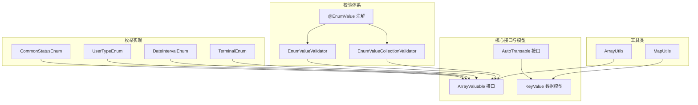
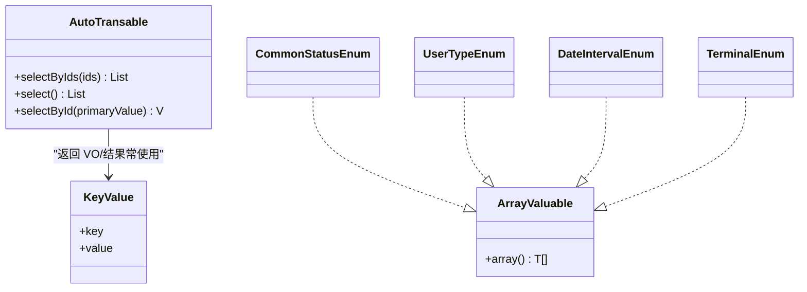
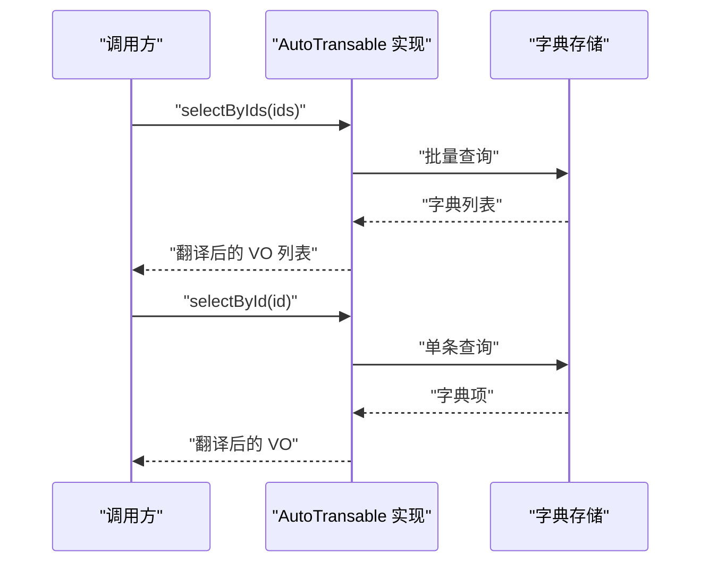
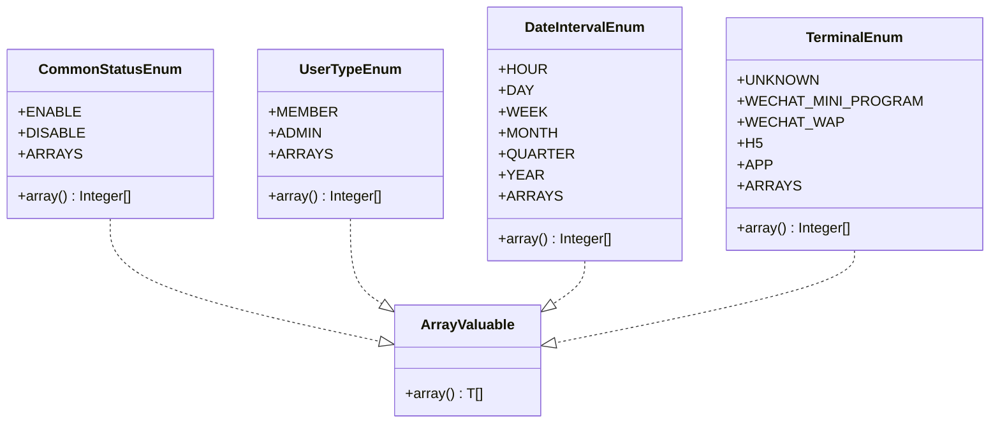
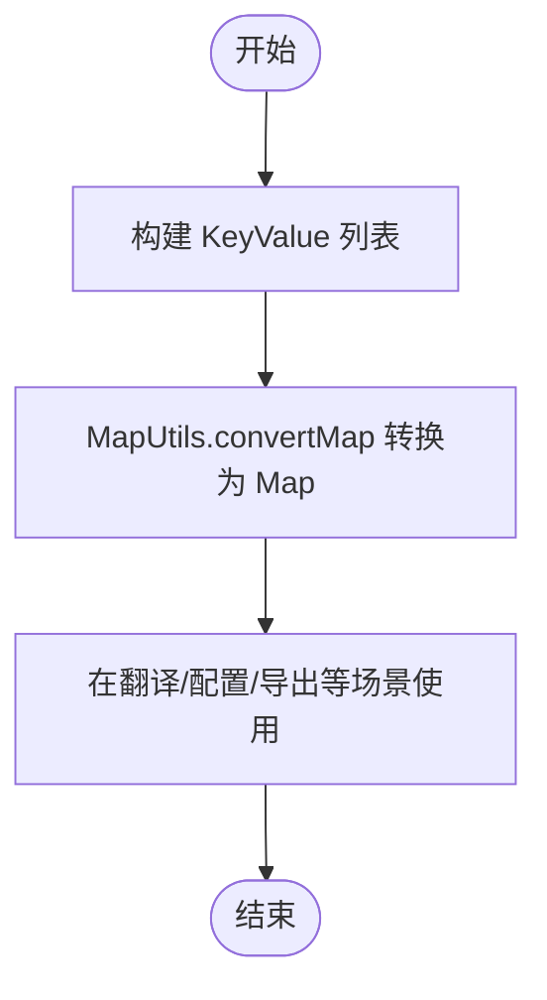
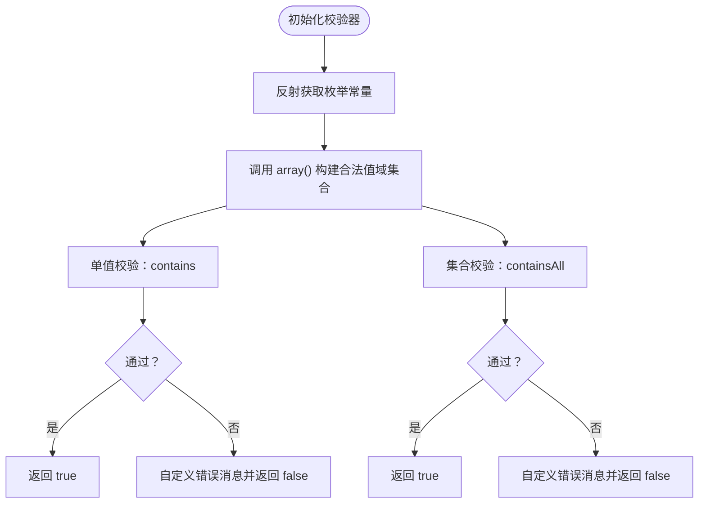
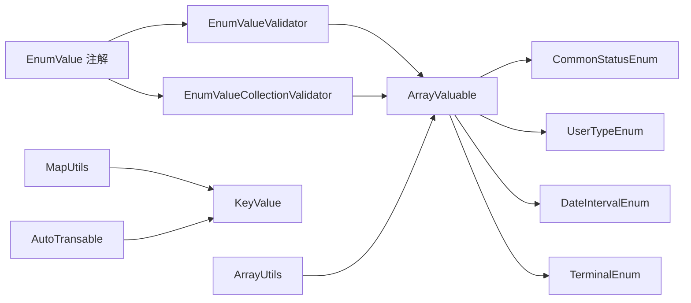

# 高级功能

<cite>
**本文引用的文件**
- [AutoTransable.java](file://pandora-framework/pandora-common/src/main/java/com/fhs/trans/service/AutoTransable.java)
- [ArrayValuable.java](file://pandora-framework/pandora-common/src/main/java/net/ittimeline/pandora/framework/common/core/ArrayValuable.java)
- [KeyValue.java](file://pandora-framework/pandora-common/src/main/java/net/ittimeline/pandora/framework/common/core/KeyValue.java)
- [CommonStatusEnum.java](file://pandora-framework/pandora-common/src/main/java/net/ittimeline/pandora/framework/common/enums/CommonStatusEnum.java)
- [UserTypeEnum.java](file://pandora-framework/pandora-common/src/main/java/net/ittimeline/pandora/framework/common/enums/UserTypeEnum.java)
- [DateIntervalEnum.java](file://pandora-framework/pandora-common/src/main/java/net/ittimeline/pandora/framework/common/enums/DateIntervalEnum.java)
- [TerminalEnum.java](file://pandora-framework/pandora-common/src/main/java/net/ittimeline/pandora/framework/common/enums/TerminalEnum.java)
- [EnumValue.java](file://pandora-framework/pandora-common/src/main/java/net/ittimeline/pandora/framework/common/validation/EnumValue.java)
- [EnumValueValidator.java](file://pandora-framework/pandora-common/src/main/java/net/ittimeline/pandora/framework/common/validation/EnumValueValidator.java)
- [EnumValueCollectionValidator.java](file://pandora-framework/pandora-common/src/main/java/net/ittimeline/pandora/framework/common/validation/EnumValueCollectionValidator.java)
- [ArrayUtils.java](file://pandora-framework/pandora-common/src/main/java/net/ittimeline/pandora/framework/common/util/foundational/collection/ArrayUtils.java)
- [MapUtils.java](file://pandora-framework/pandora-common/src/main/java/net/ittimeline/pandora/framework/common/util/foundational/collection/MapUtils.java)
</cite>

## 目录
1. [简介](#简介)
2. [项目结构](#项目结构)
3. [核心组件](#核心组件)
4. [架构总览](#架构总览)
5. [详细组件分析](#详细组件分析)
6. [依赖分析](#依赖分析)
7. [性能考虑](#性能考虑)
8. [故障排查指南](#故障排查指南)
9. [结论](#结论)
10. [附录](#附录)

## 简介
本文件聚焦 Pandora Cloud 的三项高级能力：
- AutoTransable 接口：面向数据字典翻译的自动映射能力，支持按主键批量查询与单条查询。
- ArrayValuable 接口：为枚举提供“可生成数组”的统一契约，配合校验注解与工具类实现“值域约束”和“批量取值”。
- KeyValue 数据模型：通用键值对容器，广泛用于配置、字典、结果集转换等场景。

文档将从实现原理、使用方法、性能优化、最佳实践与微服务落地案例等方面展开，并提供扩展指南与排障建议。

## 项目结构
围绕高级功能的相关模块与文件组织如下：
- 接口与模型
  - AutoTransable：自动翻译能力接口
  - ArrayValuable：数组生成契约
  - KeyValue：通用键值对
- 枚举实现
  - CommonStatusEnum、UserTypeEnum、DateIntervalEnum、TerminalEnum：均实现 ArrayValuable，提供数组值域
- 校验注解与校验器
  - EnumValue 注解 + EnumValueValidator、EnumValueCollectionValidator：基于 ArrayValuable 的运行时校验
- 工具类
  - ArrayUtils、MapUtils：与数组/映射协作的实用工具

图表来源
- [AutoTransable.java:18-60](file://pandora-framework/pandora-common/src/main/java/com/fhs/trans/service/AutoTransable.java#L18-L60)
- [ArrayValuable.java:10-15](file://pandora-framework/pandora-common/src/main/java/net/ittimeline/pandora/framework/common/core/ArrayValuable.java#L10-L15)
- [KeyValue.java:19-24](file://pandora-framework/pandora-common/src/main/java/net/ittimeline/pandora/framework/common/core/KeyValue.java#L19-L24)
- [CommonStatusEnum.java:18-47](file://pandora-framework/pandora-common/src/main/java/net/ittimeline/pandora/framework/common/enums/CommonStatusEnum.java#L18-L47)
- [UserTypeEnum.java:18-47](file://pandora-framework/pandora-common/src/main/java/net/ittimeline/pandora/framework/common/enums/UserTypeEnum.java#L18-L47)
- [DateIntervalEnum.java:19-46](file://pandora-framework/pandora-common/src/main/java/net/ittimeline/pandora/framework/common/enums/DateIntervalEnum.java#L19-L46)
- [TerminalEnum.java:18-42](file://pandora-framework/pandora-common/src/main/java/net/ittimeline/pandora/framework/common/enums/TerminalEnum.java#L18-L42)
- [EnumValue.java:28-39](file://pandora-framework/pandora-common/src/main/java/net/ittimeline/pandora/framework/common/validation/EnumValue.java#L28-L39)
- [EnumValueValidator.java:18-49](file://pandora-framework/pandora-common/src/main/java/net/ittimeline/pandora/framework/common/validation/EnumValueValidator.java#L18-L49)
- [EnumValueCollectionValidator.java:19-50](file://pandora-framework/pandora-common/src/main/java/net/ittimeline/pandora/framework/common/validation/EnumValueCollectionValidator.java#L19-L50)
- [ArrayUtils.java:20-59](file://pandora-framework/pandora-common/src/main/java/net/ittimeline/pandora/framework/common/util/foundational/collection/ArrayUtils.java#L20-L59)
- [MapUtils.java:24-113](file://pandora-framework/pandora-common/src/main/java/net/ittimeline/pandora/framework/common/util/foundational/collection/MapUtils.java#L24-L113)

章节来源
- [AutoTransable.java:18-60](file://pandora-framework/pandora-common/src/main/java/com/fhs/trans/service/AutoTransable.java#L18-L60)
- [ArrayValuable.java:10-15](file://pandora-framework/pandora-common/src/main/java/net/ittimeline/pandora/framework/common/core/ArrayValuable.java#L10-L15)
- [KeyValue.java:19-24](file://pandora-framework/pandora-common/src/main/java/net/ittimeline/pandora/framework/common/core/KeyValue.java#L19-L24)

## 核心组件
- AutoTransable 接口
  - 能力：定义按主键批量查询、全量查询、单条查询等方法族，为自动翻译提供数据源能力。
  - 设计要点：提供默认实现以兼容旧版本方法；鼓励实现 selectByIds/selectById 等现代方法族。
- ArrayValuable 接口
  - 能力：统一声明 array() 方法，返回该枚举的值数组，作为“可用值域”的数据源。
  - 应用：被多个枚举实现，配合校验注解与工具类形成“值域约束 + 批量取值”的闭环。
- KeyValue 数据模型
  - 能力：通用键值对封装，支持序列化，便于跨层传递与转换。
  - 应用：常用于字典、配置、结果集转换等场景。

章节来源
- [AutoTransable.java:18-60](file://pandora-framework/pandora-common/src/main/java/com/fhs/trans/service/AutoTransable.java#L18-L60)
- [ArrayValuable.java:10-15](file://pandora-framework/pandora-common/src/main/java/net/ittimeline/pandora/framework/common/core/ArrayValuable.java#L10-L15)
- [KeyValue.java:19-24](file://pandora-framework/pandora-common/src/main/java/net/ittimeline/pandora/framework/common/core/KeyValue.java#L19-L24)

## 架构总览
AutoTransable 与 ArrayValuable/KeyValue 的协作关系如下：

图表来源
- [AutoTransable.java:18-60](file://pandora-framework/pandora-common/src/main/java/com/fhs/trans/service/AutoTransable.java#L18-L60)
- [ArrayValuable.java:10-15](file://pandora-framework/pandora-common/src/main/java/net/ittimeline/pandora/framework/common/core/ArrayValuable.java#L10-L15)
- [KeyValue.java:19-24](file://pandora-framework/pandora-common/src/main/java/net/ittimeline/pandora/framework/common/core/KeyValue.java#L19-L24)
- [CommonStatusEnum.java:18-47](file://pandora-framework/pandora-common/src/main/java/net/ittimeline/pandora/framework/common/enums/CommonStatusEnum.java#L18-L47)
- [UserTypeEnum.java:18-47](file://pandora-framework/pandora-common/src/main/java/net/ittimeline/pandora/framework/common/enums/UserTypeEnum.java#L18-L47)
- [DateIntervalEnum.java:19-46](file://pandora-framework/pandora-common/src/main/java/net/ittimeline/pandora/framework/common/enums/DateIntervalEnum.java#L19-L46)
- [TerminalEnum.java:18-42](file://pandora-framework/pandora-common/src/main/java/net/ittimeline/pandora/framework/common/enums/TerminalEnum.java#L18-L42)

## 详细组件分析

### AutoTransable：数据字典翻译能力
- 设计目标
  - 为“自动翻译”提供统一的数据访问入口，支持批量 ID 查询与单条查询。
- 关键方法族
  - selectByIds(ids)：按主键批量查询，推荐优先使用
  - select()：获取全部数据（默认空列表）
  - selectById(id)：按主键查询单条
  - findByIds(ids)：历史方法，已标记过时
- 使用建议
  - 在微服务中，将翻译所需的字典数据暴露为 AutoTransable 实现类，供上层翻译框架调用。
  - 返回值 VO 需与 KeyValue 或其他模型配合，完成 key/value 的映射输出。

图表来源
- [AutoTransable.java:18-60](file://pandora-framework/pandora-common/src/main/java/com/fhs/trans/service/AutoTransable.java#L18-L60)

章节来源
- [AutoTransable.java:18-60](file://pandora-framework/pandora-common/src/main/java/com/fhs/trans/service/AutoTransable.java#L18-L60)

### ArrayValuable：枚举值域扩展机制
- 设计目标
  - 提供统一的“值域数组”出口，使校验、过滤、导出等场景复用同一数据源。
- 实现模式
  - 各枚举实现 ArrayValuable 并提供静态数组 ARRAYS，覆盖所有枚举值的“键”集合。
  - 通过 array() 返回该数组，供校验器与工具类消费。
- 典型枚举
  - CommonStatusEnum：启用/禁用两类状态
  - UserTypeEnum：会员/管理员两类用户类型
  - DateIntervalEnum：时间间隔（小时/天/周/月/季度/年）
  - TerminalEnum：终端类型（微信小程序/公众号/H5/App/未知）

图表来源
- [ArrayValuable.java:10-15](file://pandora-framework/pandora-common/src/main/java/net/ittimeline/pandora/framework/common/core/ArrayValuable.java#L10-L15)
- [CommonStatusEnum.java:18-47](file://pandora-framework/pandora-common/src/main/java/net/ittimeline/pandora/framework/common/enums/CommonStatusEnum.java#L18-L47)
- [UserTypeEnum.java:18-47](file://pandora-framework/pandora-common/src/main/java/net/ittimeline/pandora/framework/common/enums/UserTypeEnum.java#L18-L47)
- [DateIntervalEnum.java:19-46](file://pandora-framework/pandora-common/src/main/java/net/ittimeline/pandora/framework/common/enums/DateIntervalEnum.java#L19-L46)
- [TerminalEnum.java:18-42](file://pandora-framework/pandora-common/src/main/java/net/ittimeline/pandora/framework/common/enums/TerminalEnum.java#L18-L42)

章节来源
- [ArrayValuable.java:10-15](file://pandora-framework/pandora-common/src/main/java/net/ittimeline/pandora/framework/common/core/ArrayValuable.java#L10-L15)
- [CommonStatusEnum.java:18-47](file://pandora-framework/pandora-common/src/main/java/net/ittimeline/pandora/framework/common/enums/CommonStatusEnum.java#L18-L47)
- [UserTypeEnum.java:18-47](file://pandora-framework/pandora-common/src/main/java/net/ittimeline/pandora/framework/common/enums/UserTypeEnum.java#L18-L47)
- [DateIntervalEnum.java:19-46](file://pandora-framework/pandora-common/src/main/java/net/ittimeline/pandora/framework/common/enums/DateIntervalEnum.java#L19-L46)
- [TerminalEnum.java:18-42](file://pandora-framework/pandora-common/src/main/java/net/ittimeline/pandora/framework/common/enums/TerminalEnum.java#L18-L42)

### KeyValue：键值对模型与应用
- 设计目标
  - 提供通用的键值对封装，支持序列化，便于跨层传输与转换。
- 典型用途
  - 字典项：key=编码，value=名称
  - 配置项：key=配置键，value=配置值
  - 结果集转换：将多列数据转为键值对列表
- 工具协同
  - MapUtils 提供 convertMap 将 KeyValue 列表转换为 Map
  - AutoTransable 的返回值常与 KeyValue 配合，完成 key/value 输出

图表来源
- [KeyValue.java:19-24](file://pandora-framework/pandora-common/src/main/java/net/ittimeline/pandora/framework/common/core/KeyValue.java#L19-L24)
- [MapUtils.java:64-68](file://pandora-framework/pandora-common/src/main/java/net/ittimeline/pandora/framework/common/util/foundational/collection/MapUtils.java#L64-L68)

章节来源
- [KeyValue.java:19-24](file://pandora-framework/pandora-common/src/main/java/net/ittimeline/pandora/framework/common/core/KeyValue.java#L19-L24)
- [MapUtils.java:64-68](file://pandora-framework/pandora-common/src/main/java/net/ittimeline/pandora/framework/common/util/foundational/collection/MapUtils.java#L64-L68)

### 校验注解与校验器：基于 ArrayValuable 的值域约束
- 注解 EnumValue
  - 作用：标注字段/参数的值必须在指定枚举范围内
  - 关键属性：value（实现 ArrayValuable 的枚举类）、message、groups、payload
- 校验器
  - EnumValueValidator：校验单个值
  - EnumValueCollectionValidator：校验集合
  - 初始化阶段读取枚举的 array() 作为合法值域，运行时进行 contains/containsAll 校验
- 使用建议
  - 参数/入参标注 @EnumValue(实现类.class)，即可自动约束取值范围
  - 集合参数使用 @EnumValue 校验集合内每个元素

图表来源
- [EnumValue.java:28-39](file://pandora-framework/pandora-common/src/main/java/net/ittimeline/pandora/framework/common/validation/EnumValue.java#L28-L39)
- [EnumValueValidator.java:18-49](file://pandora-framework/pandora-common/src/main/java/net/ittimeline/pandora/framework/common/validation/EnumValueValidator.java#L18-L49)
- [EnumValueCollectionValidator.java:19-50](file://pandora-framework/pandora-common/src/main/java/net/ittimeline/pandora/framework/common/validation/EnumValueCollectionValidator.java#L19-L50)
- [ArrayValuable.java:10-15](file://pandora-framework/pandora-common/src/main/java/net/ittimeline/pandora/framework/common/core/ArrayValuable.java#L10-L15)

章节来源
- [EnumValue.java:28-39](file://pandora-framework/pandora-common/src/main/java/net/ittimeline/pandora/framework/common/validation/EnumValue.java#L28-L39)
- [EnumValueValidator.java:18-49](file://pandora-framework/pandora-common/src/main/java/net/ittimeline/pandora/framework/common/validation/EnumValueValidator.java#L18-L49)
- [EnumValueCollectionValidator.java:19-50](file://pandora-framework/pandora-common/src/main/java/net/ittimeline/pandora/framework/common/validation/EnumValueCollectionValidator.java#L19-L50)

## 依赖分析
- 耦合关系
  - 枚举实现 ArrayValuable，形成“值域契约”
  - 校验注解依赖 ArrayValuable 的实现类，运行时通过反射读取 array()
  - 工具类 ArrayUtils/MapUtils 与 ArrayValuable/KeyValue 协作，支撑批量转换与映射
- 内聚性
  - AutoTransable 与 KeyValue 的组合，使翻译结果具备统一的键值表达形式
- 外部依赖
  - 校验器使用集合工具进行 contains/containsAll 检查
  - 工具类内部使用第三方库进行集合与数组操作

图表来源
- [EnumValue.java:28-39](file://pandora-framework/pandora-common/src/main/java/net/ittimeline/pandora/framework/common/validation/EnumValue.java#L28-L39)
- [EnumValueValidator.java:18-49](file://pandora-framework/pandora-common/src/main/java/net/ittimeline/pandora/framework/common/validation/EnumValueValidator.java#L18-L49)
- [EnumValueCollectionValidator.java:19-50](file://pandora-framework/pandora-common/src/main/java/net/ittimeline/pandora/framework/common/validation/EnumValueCollectionValidator.java#L19-L50)
- [ArrayValuable.java:10-15](file://pandora-framework/pandora-common/src/main/java/net/ittimeline/pandora/framework/common/core/ArrayValuable.java#L10-L15)
- [CommonStatusEnum.java:18-47](file://pandora-framework/pandora-common/src/main/java/net/ittimeline/pandora/framework/common/enums/CommonStatusEnum.java#L18-L47)
- [UserTypeEnum.java:18-47](file://pandora-framework/pandora-common/src/main/java/net/ittimeline/pandora/framework/common/enums/UserTypeEnum.java#L18-L47)
- [DateIntervalEnum.java:19-46](file://pandora-framework/pandora-common/src/main/java/net/ittimeline/pandora/framework/common/enums/DateIntervalEnum.java#L19-L46)
- [TerminalEnum.java:18-42](file://pandora-framework/pandora-common/src/main/java/net/ittimeline/pandora/framework/common/enums/TerminalEnum.java#L18-L42)
- [MapUtils.java:24-113](file://pandora-framework/pandora-common/src/main/java/net/ittimeline/pandora/framework/common/util/foundational/collection/MapUtils.java#L24-L113)
- [KeyValue.java:19-24](file://pandora-framework/pandora-common/src/main/java/net/ittimeline/pandora/framework/common/core/KeyValue.java#L19-L24)
- [ArrayUtils.java:20-59](file://pandora-framework/pandora-common/src/main/java/net/ittimeline/pandora/framework/common/util/foundational/collection/ArrayUtils.java#L20-L59)

章节来源
- [EnumValue.java:28-39](file://pandora-framework/pandora-common/src/main/java/net/ittimeline/pandora/framework/common/validation/EnumValue.java#L28-L39)
- [EnumValueValidator.java:18-49](file://pandora-framework/pandora-common/src/main/java/net/ittimeline/pandora/framework/common/validation/EnumValueValidator.java#L18-L49)
- [EnumValueCollectionValidator.java:19-50](file://pandora-framework/pandora-common/src/main/java/net/ittimeline/pandora/framework/common/validation/EnumValueCollectionValidator.java#L19-L50)
- [ArrayValuable.java:10-15](file://pandora-framework/pandora-common/src/main/java/net/ittimeline/pandora/framework/common/core/ArrayValuable.java#L10-L15)
- [MapUtils.java:24-113](file://pandora-framework/pandora-common/src/main/java/net/ittimeline/pandora/framework/common/util/foundational/collection/MapUtils.java#L24-L113)

## 性能考虑
- 校验器初始化
  - 仅在 Bean 初始化阶段反射读取一次 array()，后续直接使用内存中的值域集合，避免重复反射开销
- 批量查询
  - AutoTransable 的 selectByIds(ids) 适合批量查询，减少多次往返
- 数组与集合操作
  - 使用高效的 contains/containsAll 检查；如需高频校验，建议将值域缓存为 HashSet 以降低查找复杂度
- 工具类优化
  - ArrayUtils/MapUtils 已利用第三方库进行高效数组/集合转换，尽量复用现有工具，避免重复造轮子

## 故障排查指南
- 校验失败
  - 现象：参数校验报错，提示值不在指定范围
  - 排查：确认 @EnumValue 指定的枚举类是否正确实现 ArrayValuable，且 array() 返回非空集合
  - 参考路径：[EnumValueValidator.java:23-30](file://pandora-framework/pandora-common/src/main/java/net/ittimeline/pandora/framework/common/validation/EnumValueValidator.java#L23-L30)、[EnumValueCollectionValidator.java:24-31](file://pandora-framework/pandora-common/src/main/java/net/ittimeline/pandora/framework/common/validation/EnumValueCollectionValidator.java#L24-L31)
- 翻译结果为空
  - 现象：AutoTransable 返回空列表或空值
  - 排查：确认实现类 selectByIds/selectById 是否正确连接数据源；检查传入的 ids 是否为空或格式错误
  - 参考路径：[AutoTransable.java:39-58](file://pandora-framework/pandora-common/src/main/java/com/fhs/trans/service/AutoTransable.java#L39-L58)
- 键值对转换异常
  - 现象：convertMap 转换后数据缺失或顺序异常
  - 排查：确认 KeyValue 列表不为空且 key/value 非空；必要时使用 LinkedHashMap 保证顺序
  - 参考路径：[MapUtils.java:64-68](file://pandora-framework/pandora-common/src/main/java/net/ittimeline/pandora/framework/common/util/foundational/collection/MapUtils.java#L64-L68)

章节来源
- [EnumValueValidator.java:23-30](file://pandora-framework/pandora-common/src/main/java/net/ittimeline/pandora/framework/common/validation/EnumValueValidator.java#L23-L30)
- [EnumValueCollectionValidator.java:24-31](file://pandora-framework/pandora-common/src/main/java/net/ittimeline/pandora/framework/common/validation/EnumValueCollectionValidator.java#L24-L31)
- [AutoTransable.java:39-58](file://pandora-framework/pandora-common/src/main/java/com/fhs/trans/service/AutoTransable.java#L39-L58)
- [MapUtils.java:64-68](file://pandora-framework/pandora-common/src/main/java/net/ittimeline/pandora/framework/common/util/foundational/collection/MapUtils.java#L64-L68)

## 结论
- AutoTransable 为字典翻译提供了统一的数据访问能力，结合 KeyValue 输出，可快速实现多语言/多维度的自动映射。
- ArrayValuable 将枚举的“值域”抽象为可复用契约，配合 @EnumValue 注解与校验器，形成强一致的参数约束。
- KeyValue 作为通用容器，贯穿于字典、配置、结果集转换等场景，提升跨层数据表达的一致性与可维护性。
- 建议在微服务中将上述能力作为基础设施，统一规范参数校验、字典翻译与数据表达，降低耦合并提升开发效率。

## 附录

### 微服务落地案例
- 场景一：订单状态翻译
  - 在订单服务中，使用 AutoTransable 实现字典查询，返回状态码与状态名的 KeyValue 映射；前端通过状态码显示中文状态。
  - 参考路径：[AutoTransable.java:18-60](file://pandora-framework/pandora-common/src/main/java/com/fhs/trans/service/AutoTransable.java#L18-L60)、[KeyValue.java:19-24](file://pandora-framework/pandora-common/src/main/java/net/ittimeline/pandora/framework/common/core/KeyValue.java#L19-L24)
- 场景二：用户类型与终端类型校验
  - 在用户中心/运营平台，使用 @EnumValue(UserTypeEnum.class) 校验用户类型参数；使用 @EnumValue(TerminalEnum.class) 校验终端类型。
  - 参考路径：[EnumValue.java:28-39](file://pandora-framework/pandora-common/src/main/java/net/ittimeline/pandora/framework/common/validation/EnumValue.java#L28-L39)、[UserTypeEnum.java:18-47](file://pandora-framework/pandora-common/src/main/java/net/ittimeline/pandora/framework/common/enums/UserTypeEnum.java#L18-L47)、[TerminalEnum.java:18-42](file://pandora-framework/pandora-common/src/main/java/net/ittimeline/pandora/framework/common/enums/TerminalEnum.java#L18-L42)
- 场景三：时间间隔导出
  - 导出报表时，使用 DateIntervalEnum.array() 获取所有可用间隔，确保导出选项与系统一致。
  - 参考路径：[DateIntervalEnum.java:19-46](file://pandora-framework/pandora-common/src/main/java/net/ittimeline/pandora/framework/common/enums/DateIntervalEnum.java#L19-L46)

### 扩展指南与最佳实践
- 自定义枚举实现 ArrayValuable
  - 步骤：实现接口并提供静态数组 ARRAYS，重写 array() 返回该数组；确保数组元素与枚举“键”一致
  - 参考路径：[ArrayValuable.java:10-15](file://pandora-framework/pandora-common/src/main/java/net/ittimeline/pandora/framework/common/core/ArrayValuable.java#L10-L15)、[CommonStatusEnum.java:23-37](file://pandora-framework/pandora-common/src/main/java/net/ittimeline/pandora/framework/common/enums/CommonStatusEnum.java#L23-L37)
- 自定义 AutoTransable 实现
  - 步骤：实现 selectByIds/selectById；返回值建议与 KeyValue/VO 配合；注意批量查询的性能与分页
  - 参考路径：[AutoTransable.java:18-60](file://pandora-framework/pandora-common/src/main/java/com/fhs/trans/service/AutoTransable.java#L18-L60)
- 自定义校验注解
  - 步骤：使用 @EnumValue 指定实现类；如需更复杂的校验逻辑，可扩展 ConstraintValidator
  - 参考路径：[EnumValue.java:28-39](file://pandora-framework/pandora-common/src/main/java/net/ittimeline/pandora/framework/common/validation/EnumValue.java#L28-L39)、[EnumValueValidator.java:18-49](file://pandora-framework/pandora-common/src/main/java/net/ittimeline/pandora/framework/common/validation/EnumValueValidator.java#L18-L49)
- 性能优化建议
  - 将 array() 结果缓存为 HashSet，提高 contains/containsAll 的命中率
  - 批量查询时，合理分批与去重，避免超大 IN 子句
  - 工具类尽量复用现有实现，减少重复转换

章节来源
- [ArrayValuable.java:10-15](file://pandora-framework/pandora-common/src/main/java/net/ittimeline/pandora/framework/common/core/ArrayValuable.java#L10-L15)
- [CommonStatusEnum.java:23-37](file://pandora-framework/pandora-common/src/main/java/net/ittimeline/pandora/framework/common/enums/CommonStatusEnum.java#L23-L37)
- [AutoTransable.java:18-60](file://pandora-framework/pandora-common/src/main/java/com/fhs/trans/service/AutoTransable.java#L18-L60)
- [EnumValue.java:28-39](file://pandora-framework/pandora-common/src/main/java/net/ittimeline/pandora/framework/common/validation/EnumValue.java#L28-L39)
- [EnumValueValidator.java:18-49](file://pandora-framework/pandora-common/src/main/java/net/ittimeline/pandora/framework/common/validation/EnumValueValidator.java#L18-L49)